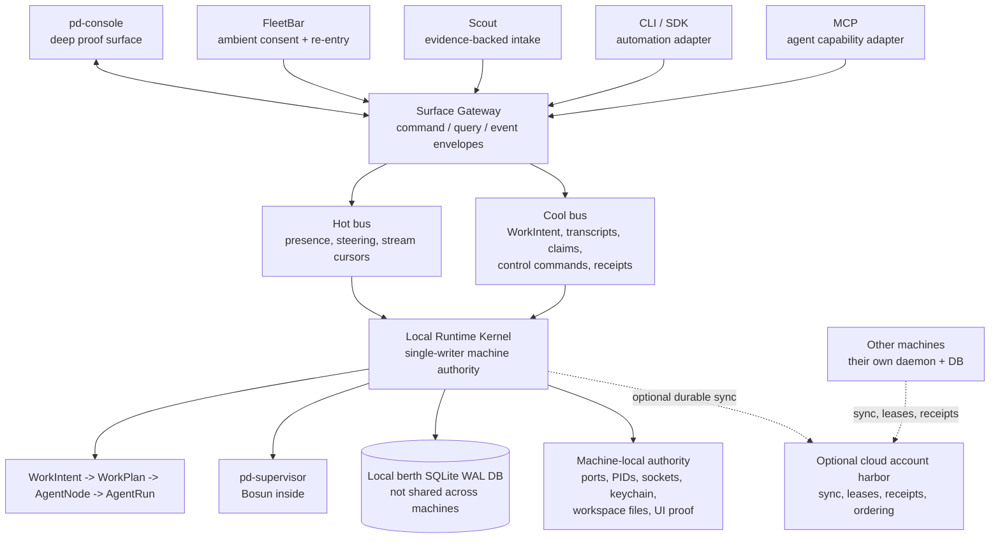

# Port Daddy Agent Skill

You are not just coding. You are operating in a shared local coordination
system. Port Daddy is the substrate. This skill is the field manual.

Use it when you need agents to move through a repo without losing truth:
current daemon state, active work, claimed files, locks, notes, actor inboxes,
FleetBar/Fleet Control Center evidence, validation, and recoverable handoffs.

## NOT For

- One-line read-only answers where Port Daddy state does not matter.
- Generic "be careful with git" advice.
- Replacing repo-authored docs, live daemon truth, tests, or operator evidence.
- Launching extra agents when one bounded local change is enough.

## Operator vs Agent — know which surface you are

The CLI is for **you** (the agent) and for emergencies. The human operator does
not run `pd` commands, edit `.env.local` files, run `launchctl kickstart`, or
tail logs. Their surface is the FleetBar menu-bar app and the dashboard endpoint
discovered from the running daemon — buttons, panels, deep-links to provider token pages.

When you tell the operator to do something, point at the **FleetBar button or
dashboard panel**, not at a shell command. If the surface does not exist yet,
that is a product gap: file a `high`-severity feedback entry against the
`FleetBar` surface so cartographer promotes it onto the roadmap. Open examples
to follow: `fleetbar-secret-management-with-provider-deeplinks`,
`fleetbar-console-must-support-zoom-and-text-scaling`.

If an agent's output reads like "now run `launchctl ...`" or "edit
`~/.env.local` and add ...", rewrite it. The right output is "open FleetBar →
Credentials → Cloudflare → paste token (deep-link: dash.cloudflare.com/
profile/api-tokens?template=workers-ai)" — with the gap filed as feedback if
the button is not built yet. Operators do not read AGENTS.md; they should not
have to.

## Giant Squid harness

For a Port Daddy project, `pd squid on` is the one full arm switch. It stages
the local lifecycle tentacles, wires every detected interactive CLI in its real
scope (Claude/Gemini project config; Codex/agy daemon-gated user config), adds
the `◆ PD` statusline, installs Pilot SessionStart steering, and adds `/squid`.
Do not use or recommend the removed `pd squid hooks` fork; `pd hooks install`
is the narrower hook-only repair surface.

Read `pd squid status` before claiming the harness works. `LIVE` means complete
wiring plus a fresh daemon heartbeat; `READY` means complete wiring with the
daemon down; `PARTIAL` and `DEGRADED` require repair. Use `--json` when another
surface needs the same truth and `pd squid tap` to inspect the exact bounded
next-turn envelope. User-level Codex/agy entries do not make hooks global: the
wrapper requires the exact project root in the arm registry. `pd squid off`
removes that root while preserving other projects.

The harness is quiet by design — it injects nothing when nothing is fresh — so
**do not read silence as proof it is working, and do not read it as proof it is
broken.** Every turn appends one VoiceLog line (`spoke` / `silent` /
`suppressed` + reason) to `$PD_HOME/squid-voice-log.jsonl`. `pd squid voice`
shows recent turns, `--stats` gives the spoke/quiet/suppressed rates, and
`--follow` tails new turns while an agent works. `--suppressed` lists turns whose
context was filtered, dropped, or clipped, with an explicit reason: stale
matrix, expired evidence, evidence irrelevant to the current working directory,
or byte/entry caps. Use it to diagnose why candidate context did not fully reach
the prompt. Every rate reads `n/a` rather than `0%` when there is no data — "the
harness has never run here" and "the harness was quiet 100% of the time" are
opposite diagnoses.

The operator drives this through FleetBar's selected-project `◆ GIANT SQUID`
strip. It exposes state, provider count, and Arm/Repair/Disarm without asking the
operator to run these agent-facing commands.

## Default Agent Happy Path

Use this path before you reach for advanced coordination. It is the normal
agent loop for repo work on this machine.

```bash
pd status
pd sitrep --template
pd briefing
pd salvage --project <project> --limit 20
pd begin "<bounded task>" --identity <project>:<agent> --lifecycle durable
pd whoami
pd plan set "- [ ] Setup X\n- [ ] Fix Y\n- [ ] Verify Z"
pd advise <likely-path> --task "<plain-language task>"
pd note "Scope: <files>. Assumptions: <truth>. Validation: <commands>."
pd session files add <path>
# work, validate, check off plan, and keep notes current
pd plan check "Setup X"
pd note "Result: <change>. Validation: <evidence>. Remaining: <risk>."
pd done "<short outcome>"
```

## Plan & Todo List Tracking

Every agent must establish a versioned todo checklist using `pd plan set`.
- **Set a plan**: Run `pd plan set` with markdown checklist items.
- **View latest plan**: Run `pd plan show` or `pd plan`.
- **Mark item completed**: Run `pd plan check <index>` (e.g., `pd plan check 1` or `pd plan check "step one"`).
- **Close session gate**: `pd done` checks your active plan. If any unchecked `[ ]` items remain, the close operation fails closed. Bypass with `pd done --force-incomplete --reason "<why>"` if incomplete work is intentionally handshaked or deferred.

## Session Continuity

A resumed coding session is not automatically a new Port Daddy session. Treat
multi-day work as a continuity problem first, then decide whether to resume,
link, or restart.

Re-anchor when a conversation resumes after a calendar day, after context
compaction, after daemon/session drift, or when the worktree is behind the
canonical remote:

```bash
pd status
pd briefing
pd sessions --all-worktrees
pd notes --limit 20
pd salvage --project <project> --limit 20
git status --short --branch
git fetch origin
```

Resume the existing session when the user goal, worktree or successor
worktree, branch lineage, and touched surface are still the same unresolved
slice. If the previous session is stale, abandoned, or cannot be made active,
use `pd session takeover <old-session-id> [reason]` (or `pd takeover <old-session-id> [reason]`) to create a linked
successor. It preserves the predecessor's append-only notes, releases stale
claims, and records the lineage on both sessions.

Start a new linked session when the product goal changed, the previous slice
was completed or merged, the branch no longer descends cleanly from the old
work, or the next edit would touch unrelated surfaces. Continuity comes from
explicit provenance, not from overloading one old purpose forever.

The first continuity note must carry enough truth for another agent to take
over without transcript archaeology:

- predecessor session id and new session id, if different
- identity, worktree, branch, and base drift from the canonical branch
- dirty or claimed files, plus any ownership conflicts
- last validation that is still trusted and validation that is stale
- runtime truth, especially socket/TCP/port-file or install-root drift
- next intended edit, blocker, or handoff

After drift, prefer explicit session ids for notes and file claims. If
`pd whoami`, active context, TCP port-file routing, and direct session storage
disagree, call it a coordination bug. Leave the best durable evidence you can,
fix the bounded bug if this slice can safely absorb it, or continue with a
clear note about the degraded coordination path.

Harness continuation is a separate identity boundary from Port Daddy session
takeover. Never replay a raw Claude, Codex, Gemini, or agy transcript into a
different runtime. Persist a sanitized handoff capsule first. Native resume is
valid only when the source and effective target backend share the same catalog
adapter family, the source id is a UUID rather than an option-shaped token, and
the daemon can bind bounded local evidence to the canonical source workspace.
Claude, Codex, and Gemini need an explicit transcript reference; agy also needs
its current workspace-to-conversation cache binding. The witnessed workspace
device/inode must still match at the final CLI child boundary. Missing or stale evidence
is not a reason to replay a transcript; it means native resume is unavailable
and cross-harness continuation must start a successor from the sanitized
capsule. Never trust the capsule's historical workspace path as execution cwd.
Reuse its reverified source witness; for a history-only, API, or model-server
source, pass an explicit current `targetWorkdir` that resolves to the intended
user-owned checkout. On `POST /memory/handoffs/:episodeId/continue`, choose the concrete
`targetBackend` and use `mode: auto` (default), `native`, or `handoff`. Auto
restores only a matching session-scoped adapter family and otherwise sends the
versioned sanitized successor brief to a new target session. Explicit native
must fail rather than silently changing identity semantics; explicit handoff
always creates a successor, even inside one family. Use a stable idempotency key
and trust the owner-leased continuation
receipt, not a model's claim that it resumed. A backend override that changes
adapter family, a lost accepted-to-running lease, or a failed terminal receipt
transition must fail closed before Port Daddy reports success.

Inspect portability with `pd backend adapters --matrix` or
`GET /harness-adapters/continuation-matrix`. Read the grid as declared mechanics,
not proof: `N` means same-family native resume is mechanically available and `H`
means a sanitized successor handoff is available. `--probe` is discovery only.
Only durable completed spawn transcripts, continuation receipts, or dedicated
live-control receipts can mark the corresponding predicate witnessed; evidence
older than seven days remains visible but stale. Never turn catalog declarations,
help output, path existence, or an agent's self-report into a numeric conformance
badge.

Durable roster identity is another layer again. Use `pd roster list` and
`pd roster search "<expertise>" [--repo <path>]` when the question is which
long-lived named expert should receive work, even when no body is currently
running. A roster alias such as `portdaddy-typography-expert` is a human label;
the daemon-minted `agent_node_...` is the principal. Create one with `pd roster
create`, or promote a proven session only after storing its sanitized handoff
capsule, then use `pd roster promote <session-id> --episode <id> ...`. Profile
edits append revisions. `pd roster continue <agent-node-id> --backend <id>`
chooses a new body without changing the person and reuses the same witnessed
native-or-successor continuation receipt path described above. Stored trigger
and permission fields are declarations, not proof they are active or enforced.
Roster expertise search fuses BM25 with the shared MiniLM embedder; treat a
`degraded` lexical fallback as repair work and run `pd doctor`.


## Telos vs Purpose

Every Port Daddy agent carries a **telos** alongside its **purpose**.
They look similar in `pd whoami` output, but they are not the same field
and should not drift together.

| Field | Meaning | Lifetime |
|---|---|---|
| `purpose` | The current task this session is doing. | Per-session. Resets when you `pd done` and `pd begin` again. |
| `telos`   | Why this agent exists in the fleet — the durable role headline. | Long-lived. Survives across sessions, salvages, and respawns. |

`pd begin "<purpose>"` sets the purpose. By default the telos defaults to
the same string for compatibility, but creator-provided telos is preferred:
fleet YAML, spawn calls, and registration paths can declare a richer telos
object explicitly, and `pd whoami` will show that string instead.

When to update each:

- **Per task** — change `purpose` via a fresh `pd begin` (or `pd done` then
  `pd begin`). Don't reuse a session whose purpose has materially shifted.
- **When the agent's role changes** — update `telos` through registration
  or heartbeat. Don't let operator surfaces (FleetBar, Fleet Control Center,
  briefings) show a stale role headline. A runtime-derived fallback telos
  is allowed only as compatibility — bake a real telos in as soon as you
  know the role.

Practical rules:

- If you spawn fleet agents in `pd-fleet.yml`, declare `telos:` on each
  agent explicitly. Keep starter templates, schema docs, CLI help, API
  docs, and this skill aligned when the telos shape changes.
- If you can choose only one to make accurate, make telos accurate.
  Operator surfaces use it for the human-readable "what does this agent
  do" answer.
- When handing off, mention both telos and purpose in your `pd note` if
  they differ — the next agent inherits identity but may need to set a
  new purpose for its own slice.

## Reconciling Before Publishing

Fetch and reconcile before publishing:

```bash
git fetch origin
git rebase origin/main
pd sessions --all-worktrees
pd notes --limit 20
pd guard check --staged
```

## PR Finish Line

When you open or inherit a PR, you own the machine-visible finish line unless
you explicitly hand it off in Port Daddy notes.

- Read live PR comments, reviews, inline bot findings, and status checks before
  declaring the branch ready.
- Treat bot comments as review findings — fleetbot included. The
  `port-daddy-fleet` bot posts `[pd-code-reviewer]` and `[pd-qa]` threads on
  every PR; read and answer them alongside Copilot, Claude review, Cloudflare
  Pages, CodeQL, release, package, and `roadmap-link-gate` comments. Reply to
  every actionable thread with fixed / deferred / contested-because, and never
  declare a PR done with a `port-daddy-fleet` (or other actionable) thread
  unanswered.
- A reply is not the same as resolution. After fixing or contesting inline
  review comments, resolve the GitHub review threads and query the PR's
  `reviewThreads` (GraphQL or equivalent) to prove no actionable thread remains
  unresolved.
- Run or spawn an adversarial reviewer for non-trivial changes. Ask for a
  `SHIP / SHIP-AFTER-FIX / DO-NOT-SHIP` verdict and fix high-confidence
  findings before merge.
- "CI green" includes GitHub checks and attached external deploy/status checks.
  If a red check is truly external, inspect the linked logs and document the
  owner/root cause in both the PR and a `pd note`; otherwise fix the branch.
- Before the final handoff, post the validation evidence on the PR, leave a
  `pd note`, and `pd done` the session.

## Small Decision Table

| Situation | Move |
|---|---|
| You will edit files | Start a session, leave a scope note, and claim the smallest real files or regions. |
| The live daemon looks stale | Verify daemon provenance before trusting docs, source, or memory. |
| Another session may overlap | Read notes, claims, activity, and ownership before changing the surface. |
| Work was interrupted | Use salvage or `pd session takeover`; preserve the abandoned intent. |
| The same coding vibe resumes days later | Re-anchor, then resume the old session or create a takeover successor with explicit predecessor provenance. |
| You are about to commit, push, or deploy | Fetch, reconcile, re-read live coordination state, stage narrowly, and run the guard. |

## Advanced Surfaces

Use these only when the task actually needs them:

- Tuples and channels for machine-readable shared facts.
- Actor inboxes for durable role ownership.
- Pheromones and file heat for contention signals.
- Fleet YAML and spawned runs for real parallel work.
- Locks for scarce resources such as promotion, generated artifacts,
  migrations, and release packaging.
- FleetBar and Fleet Control Center for operator-visible truth.

## CLI Documentation Contract

The CLI reference lives in this skill and the website docs; nothing should
require a separate `port-daddy-cli` skill. The source-backed website page
`/docs/cli` must give every command row a detail route with syntax, options,
examples, aliases, source provenance, and API contract metadata.

High-frequency commands:

```bash
pd status
pd briefing
pd begin "<purpose>" --identity <project>:<agent> --lifecycle durable
pd note "Scope: <files>"
pd session files add <path>
pd add --dry-run -A
pd guard check --staged
pd tube <channel> --send "message"
pd actor lookout --message "release surface drift fixed"
pd done "<summary>"
```

Load `references/cli-reference.md` when you need the broader command families,
aliases, generated docs expectations, or claim-aware git staging rules.

## Ambient Peer Coordination

The point is not to make agents talk constantly. The point is to publish
shared facts where other agents and operator surfaces can find them.

- Use `pd note` for scope, assumptions, touched files, validation, blockers,
  and handoffs.
- Use symbol/region claims when a change is naturally smaller than a file.
- Use tuples, channels, and actor inboxes for machine-readable coordination.
- When possible, fix bounded Port Daddy dogfood bugs when you discover them; if the fix is not
  bounded, leave exact evidence and a targeted actor message.
- Publish `coordination:inconsistency` for not just collision avoidance, but
  implied-goal contradictions, UI or docs shape conflicts, live runtime/source
  drift, security, auth, privacy, data-retention, trust-boundary divergence,
  raw text or unauthenticated endpoints beside authenticated, secure API
  claims, and sessions marked active while their agent registry bodies are dead or missing.
- Operator-worthy callouts go to durable channels. Routine progress stays in notes.

## Roadmap, Skill, And Actor Truth

Roadmap and skill-drift work must route through live actor and recovery
surfaces, not only local prose.

```bash
pd actors --project <project>
pd actor cartographer --project <project>
pd actor navigator --inbox-stats
pd actor navigator --inbox --unread
pd actor navigator --message "roadmap state changed; see docs/recovery/CURRENT-WORK.md"
pd actor lookout --message "release-surface drift fixed in docs, website, README, and skill"
```

Mailbox delivery is durable but not an immediate answer. After messaging an
actor, keep working from the actual source of truth: `docs/recovery/CURRENT-WORK.md`,
`.cartographer/README.md`, `.cartographer/status.md`, live notes, sessions,
and the checked-in release surfaces.

## MCP Equivalents

When a client is using MCP instead of the CLI, use the matching Port Daddy MCP
tools for claims, sessions, notes, locks, messaging, salvage, harbors, spawning,
and service orchestration. Prefer MCP for model clients that already have it
installed; prefer the CLI when you need shell-local git, build, or deployment
evidence.

## Operating Loop

Run the loop in order. Skip only when the task is truly trivial.

```bash
pd status
pd briefing
pd salvage --project <project> --limit 20
pd begin "<bounded task>" --lifecycle durable
pd advise <likely-path> --task "<plain-language task>"
pd note "Scope: <files>. Assumptions: <truth>. Validation: <commands>."
pd session files add <path>
pd guard status
pd guard install --mode enforce  # if this repo should enforce claims and the guard is not already enforcing
# work
git fetch origin
git rebase origin/main           # use origin/master only when that remote branch actually exists
pd sessions --all-worktrees
pd notes --limit 20
pd guard check --staged
pd note "Result: <change>. Validation: <evidence>. Remaining: <risk>."
pd done "<short outcome>"
```

The loop is not ceremony. It solves the actual failures that ruin multi-agent
work: stale runtime assumptions, invisible ownership, repeated archaeology,
ambiguous handoffs, and local green checks that do not match the installed app.

## Decision Points

| Situation | Move |
|---|---|
| You will edit files | Start a session, leave a scope note, claim the smallest real surface. |
| Another session may overlap | Read notes/activity/claims, then route around or publish a coordination inconsistency. |
| The daemon or FleetBar looks wrong | Verify live process, socket, TCP URL, install root, and Fleet Control Center evidence. |
| Work was interrupted | Use salvage before restarting. Preserve the original intent when claiming. |
| A fact should be machine-queryable | Emit a tuple or schema-shaped handoff, not prose only. |
| A scarce resource is involved | Use a lock for promotion, migrations, generated assets, or release packaging. |
| A release surface changed | Update docs, README, website, skill, and package/export metadata in the same coherent slice. |
| You are about to commit, push, or deploy | Fetch the canonical remote branch, rebase/merge current work onto it, re-read live sessions/notes/activity, stage through `pd add --dry-run -A` then `pd add -A`, and run `pd guard check --staged`. Do not publish stale-base work. |

## Procedural Cues

- If `pd status` is green but the browser or FleetBar is stale, suspect install
  root or daemon freshness before rewriting source.
- Daemon installation is binary-first. `pd start`, `pd daemon start`, and
  `pd install` should launch `dist/daemon/port-daddy-daemon` when present;
  source-backed `tsx server.ts` is a development-only fallback gated by
  `PORT_DADDY_ALLOW_SOURCE_DAEMON=1`.
- Single-binary builds use `npm run build:bin` and emit `dist/port-daddy`.
  That executable carries CLI dispatch, the MCP stdio server, and a hidden
  `__daemon` entrypoint without a `tsx` subprocess. The build embeds Fleet UI
  and public samples into the executable through a generated asset table, then
  smoke-tests daemon health plus `/samples/manifest.json` and
  `/fleet-ui/index.html` with an empty `PORT_DADDY_RESOURCE_DIR`.
- Public tutorial samples are served from the generated `/samples/manifest.json`
  bundle. Rebuild it with `npm run build:public-samples` before claiming a
  binary install can serve promised example code.
- If a file looks unclaimed but a recent note says someone owns that surface,
  trust the coordination story enough to inspect before editing.
- If your fix needs a phrase like "probably unrelated," separate it from the
  slice until evidence says otherwise.
- If a note cannot tell the next agent what changed, what was validated, and
  what remains, it is not a handoff yet.
- If a process-level command succeeded but the UI still looks broken, the work
  is not visually verified.
- If two agents disagree about product shape, publish the conflict to
  `coordination:inconsistency` instead of smoothing it away.
- If the user has to remind you to coordinate, the process has already failed:
  pull against the canonical branch, read the live fleet, leave a Port Daddy
  note, and make the durable instruction stronger before continuing.
- If Coordination Guard is absent or only advisory in a repo that expects
  enforced claims, run `pd guard install --mode enforce` or leave an explicit
  blocker note with the exact failure.

## Daemon Architecture Model

Treat the daemon as the local single-writer control plane. Stable, dev-latest,
and branch berths may all run at once, but they do not share a SQLite file and
they are not interchangeable evidence.

The Agent Harbor runtime refactor target (ADR-0100) is intentionally
destructive: one Surface Gateway owns official command, query, and event
envelopes; WorkIntent is the launch-shaped runtime primitive; old routes,
verbs, and MCP tools survive only as temporary migration adapters or fail-closed
messages once the gateway path owns the behavior. Do not document this target
as shipped unless the current branch and live daemon prove it.



Authority rules:

- `pd-console` is the deep proof surface; FleetBar grants ambient consent,
  status, and re-entry; Scout captures evidence-backed Work Intents.
- Native surfaces do not call CLI or MCP internally. FleetBar, pd-console,
  Scout, CLI, SDK, and MCP are adapters into the same daemon contract / Surface
  Gateway path; CLI and MCP are for agents, scripts, CI, emergency repair, and
  integrations.
- `pd use` is per-shell/per-process berth context. It does not switch the global
  daemon. Native surfaces must show the active berth/codebase/dev lane they are
  actually connected to.
- A local daemon is authoritative for its own machine. Never assume another
  machine has the same DB state unless a named harbor sync/lease protocol says
  so and exposes read-back evidence.
- Stable Homebrew, at its published dynamic endpoint, is the operator's canonical local runtime. Dev
  berths are proof for a branch, not proof that FleetBar's stable surface is
  fixed.
- On canonical macOS, launchd is the only process lifecycle owner. `pd start`,
  `pd restart`, and `pd stop` control that launchd job and verify one generation;
  they must never create a detached fallback. The daemon owns readiness, Bosun
  only requests launchd replacement for a dead/stale heartbeat, and
  status/Doctor/native UIs only observe their shared PID, port, heartbeat, and
  binary identity. If those facts disagree, call the control plane diverged.
- Cross-machine coordination should sync durable events, receipts, leases, and
  replayable intent through a harbor/relay ledger. Do not pretend SQLite files
  merge peer-to-peer or share a writable registry across machines.
- When WorkIntent and Surface Gateway own a behavior, delete the older route,
  CLI verb, or MCP tool; or keep it only as a short-lived internal adapter that
  writes legacy provenance into the new envelope and has an explicit deletion
  plan. No long-lived bridge architecture.
- Release proof must include source tests, the compiled daemon binary, launchd
  supervision, smoke routes, soak/shadow workload, `pd doctor`, and visible
  pd-console plus FleetBar truth.

## FleetBar And Console Proof

FleetBar is the native Mac ambient entry point. pd-console is the deep proof
surface for full runtime truth. Use them when the task touches agents,
readiness, launches, Shipwright, resources, spawned runs, or operator-visible
coordination. Deeper guidance lives in `references/fleetbar-and-console.md`
(loaded via the bundled assets map below).

## Bundled Assets — Load On Demand

Everything else in this skill is progressive disclosure: each subdirectory has
an `INDEX.md` listing what is inside and when to read it. Load the index for
the situation in front of you, then load the leaf file the index points at.
Do not pre-load the whole bundle.

| Trigger | Open this index first |
|---|---|
| You hit a symptom and need to branch from "what's happening" to "what to do" | `decisions/INDEX.md` |
| You want a worked walkthrough that mirrors your situation | `examples/INDEX.md` |
| You are about to fork or rejoin a sub-agent (parent→child, not peer) | `subagent-fork/INDEX.md` |
| You are spawning a fleet persona or editing `pd-fleet.yml` | `agents/INDEX.md` |
| You need to start an agent with verified-fresh local truth (JSON-routable prologue) | `scripts/prologue/INDEX.md` |
| You need a visual model of the loop, lifecycle, handoff, or fanout | `diagrams/INDEX.md` |
| You need a deeper procedural reference (theory, recovery, CLI/API/SDK, multi-agent recipes, .portdaddyrc, session lifecycle) | `references/INDEX.md` |
| You need a machine-readable contract (semantic identity, fleet schema, tuple/note/pheromone/salvage shape, MCP catalog) | `schemas/INDEX.md` |
| You are about to copy a starter (`.portdaddyrc`, `pd-fleet.yml`, coordination note, handoff, session note) | `templates/` |
| You want the rendered architecture overview or this bundle's affordance self-score | `architecture.html` / `affordance-scorecard.json` |

If a subdirectory has assets but no `INDEX.md`, or an `INDEX.md` is out of
sync with what's on disk, that is a drift bug — surface it with the
skill-hygiene validator (see Self-Check).

Loose top-level scripts beside the prologue:

- `scripts/preflight.sh` — pre-edit gate: daemon up, no mid-rebase, claims sane.
- `scripts/agent-handshake.sh` — emit a handoff envelope on session close.
- `scripts/emit_agent_handoff.py` — typed handoff emitter; pairs with `templates/handoff.md`.
- `scripts/fleet-validate.sh` — validate a `pd-fleet.yml` against `schemas/pd-fleet.schema.json`.
- `scripts/salvage-triage.sh` — surface dead-agent intent worth claiming.
- `scripts/session-resume.sh` — resume a salvaged session with original purpose.

## Output Contracts

When leaving durable evidence, prefer the bundled schemas:

- `schemas/coordination-note.schema.json`
- `schemas/agent-handoff.schema.json`
- `schemas/validation-report.schema.json`

Use the templates under `templates/` when a note or handoff needs to be copied
into another channel, actor inbox, or PR description.

## CLI Quick Reference

The agent surface uses semantic identities of shape `project:stack:context`
(e.g. `port-daddy:cli:fix-flake`, `myapp:api:auth`). Same identity always
hashes to the same port - port assignment is deterministic.

```bash
# Identity, status, salvage, briefing
pd whoami                                # current session, agent, identity
pd status                                # daemon health and uptime
pd briefing                              # what's happening across the fleet
pd salvage --project <project>           # recover dead-agent intent

# Sessions & coordination
pd begin "<task>" --identity <project>:<stack>:<context> --lifecycle durable
pd note "Scope: ..."                     # durable progress evidence
pd takeover <old-session-id>             # linked successor; notes stay append-only
pd session files add <path>              # claim a file region
pd done "<outcome>"                      # close + leave result note

# Resources
pd claim <project>:<stack>:<context>     # claim a deterministic port
pd release <id>                          # release a claimed port
pd with-lock <name> -- <command>         # run a command holding a named lock

# DNS, integration signals, fleet awareness
pd dns <name>                            # resolve DNS records for a service
pd integration ready <signal>            # mark integration ready for downstream
pd integration needs <signal>            # declare a missing integration
pd sessions --all-worktrees              # cross-worktree session view
```

See `references/api-reference.md` for the full HTTP surface and
`references/sdk-reference.md` for the JS/TS SDK. MCP tools mirror the CLI:
`begin_session`, `end_session_full`, `whoami`, `claim_port`, `release_port`,
`acquire_lock`, `add_note`, `pd_discover` are the equivalents agents use
through the MCP protocol.

## Recently Shipped Surfaces

These landed on `main` in the last few weeks. The shipped Homebrew `pd`
binary **lags `main`** — verify a command exists in the installed CLI
(`pd <verb> --help`) before you depend on it, and rebuild the daemon if
you are dogfooding a route that just landed in source.

### Relay — cross-machine pub/sub (ADR-0049)

The **relay** (`docs/adr/0049-relay-architecture.md`) is a zero-trust event
fabric — a **zero-trust** (no component is implicitly believed; every message
carries its own proof) Cloudflare Worker (`apps/relay/`) that federates Port
Daddy channels across machines. The daemon holds an outbound SSE connection
(`lib/relay-client.ts`); routes live in `routes/relay.ts`.

```bash
pd relay url <https://relay.portdaddy.dev>   # set the relay URL (persisted to daemon config)
pd relay url --clear                          # disable relay
pd relay status                               # connection, session, last handshake, channels
pd relay exchange --oidc-token <t>            # OIDC → PD card (CI; reads $ACTIONS_ID_TOKEN)
```

MCP equivalent: `relay_status()` (read-only) tells an agent whether
cross-machine pub/sub is live before it relies on a remote channel.

### Dispatch — autonomous feature-dev queue (ADR-0035)

**Dispatch** (`cli/commands/dispatch.ts`, `lib/dispatch/runner.ts`) is the
operator queue for autonomous feature work: drop a sentence-shaped goal, a
worker runs it in an **isolated git worktree** under `~/coding/tmp/port-daddy-dispatch-<id>`
(never `/tmp`), then opens a **draft PR** via `lib/dispatch/spawn-adapter.ts`.
The operator accepts or rejects through `pd review`.

```bash
pd dispatch propose "<goal text>"     # queue a goal (state=proposed)
pd dispatch queue                     # list proposed dispatches
pd dispatch list                      # list dispatches (filter with --state)
pd dispatch show <id>                 # one dispatch in detail
pd dispatch run <id>                  # DRY-RUN by default — prints the plan
pd dispatch run <id> --really-run     # actually spawn the worker + open the draft PR
pd dispatch cancel <id> --reason "<why>"
```

`run` defaults to dry-run; you must pass `--really-run` to spawn. Default
backend is `cli:codex` (override with `--backend cli:claude-code`); per-dispatch
`--budget` (default 5 USD, max 25) and `--timeout` (default 3h, max 6h) cap
blast radius. `pd nightshift` is a **deprecated alias** kept for one minor
version — the verb is `pd dispatch` (renamed in PR #143). Design notes:
`docs/proposals/pd-nightshift.md`.

### Coast Guard — OS-sandbox confinement + compulsion rent (ADR-0050)

The **Coast Guard** (`lib/coast-guard.ts`, `docs/adr/0050-coast-guard.md`)
confines every spawned subprocess in an OS sandbox (macOS Seatbelt via
`sandbox-exec`; bubblewrap/Landlock on Linux) so a stray `cat .env.local`
yields nothing — managed secrets are scrubbed from the child env and the
sandbox denies `.env`/`.env.local`. It is wired into `lib/spawner.ts` as the
default for every subprocess backend (opt-out, never advertised). A hard
egress request/byte cap returns `402 Spend Cap Exceeded`.

The keystone is **compulsion rent** (`lib/coast-guard/compulsion.ts`):
coordination is the price of the sandbox. An un-noted commit blocks the next
commit (`requireNotePerCommit`, default on), and a sandbox that drifts far
behind its base and goes silent past the grace window becomes reclaim-eligible —
reclaim can **never** touch the operator's live main checkout
(`isReclaimableSandbox`). You see your own confinement with:

```bash
pd coast-guard status          # alias: pd cg — sandbox mechanism, secret broker, egress cap, protected dirs
```

### Attest — honest self-report (ADR-0045)

```bash
pd attest          # loud-fail invariants: exits NON-ZERO when any CRITICAL invariant fails
pd attest --json   # the merged server + client report
```

`pd attest` (`cli/commands/attest.ts`, `lib/attest.ts`) merges the daemon-side
report (`GET /attest` — integrity, schema, perms) with CLI-only checks
(CLI↔daemon version match). It applies the honest-green rule — a green exit
means every CRITICAL invariant actually holds — so it is safe to put in a boot
gate or CI. No subcommands.

### Tube — conversational pipe over channels

**Tube** (`cli/commands/tube.ts`) is a relay-independent, multi-subscriber pipe
for agent↔agent back-and-forth. Every subscriber receives every message;
distinct `--as` identities are distinct subscribers. Prefer a persistent tube
channel over point-to-point inboxes when two agents need a real conversation —
it persists and delivers to all subscribers.

```bash
pd tube <channel>                       # listen (default; blocks for the next event)
pd tube <channel> --send "<body>"       # post a top-level message
pd tube <channel> --reply "<body>"      # inline reply, auto-correlated, keep listening
pd tube <channel> --once                # one poll-pass, then exit
```

### Design-stage ADRs (NOT shipped — do not depend on)

These are accepted-design or in-flight ADRs. Reference them for direction;
do not document their verbs as if they ship today: **marketplace** (ADR-0051),
**trajectory export + RL loop** (ADR-0052), and **out-of-band enforcement /
"DOM DADDY"** (ADR-0053, in-flight) which moves enforcement out of in-band
git-hook shims to branch-protection / cred-broker layers. A release-cadence +
Rust-surface ADR (ADR-0054) is being written in parallel; once it lands it is
the canonical answer to "is this feature in my installed `pd`?"

## Self-Check

```bash
python3 skills/port-daddy-agent-skill/scripts/validate_port_daddy_agent_skill.py skills/port-daddy-agent-skill
python3 skills/skill-hygiene/scripts/audit_skill_library.py --root skills --deterministic --no-persist
bash skills/port-daddy-agent-skill/scripts/diagnose_port_daddy_agent_context.sh
```

The first command checks this bundle's required shape. The second is the
generic skill-hygiene library audit — it flags orphaned files (assets no INDEX
or SKILL.md mentions), drifted indexes (entries vs. disk), and missing INDEXes
across every bundle. The third samples the local Port Daddy context so the
agent can reason from live state instead of memory. When mirrors change, also
run `node scripts/sync-skill-mirrors.mjs --check` to confirm the agent-surface
copies match this canonical.

---

## Git Discipline (NON-NEGOTIABLE)

Multi-agent repos collide on the staging area. Follow these rules without
exception. They come from a real incident — see `references/git-discipline.md`
for the post-mortem and the full ADR.

1. **Worktree for long-running background work.** If your work takes more than ~10s between "start" and "commit", do it in a git worktree (`git worktree add ../$repo-$agent-$task`). Disjoint trees make collisions structurally impossible.
2. **Never `git add -A` / `git add .` / `git add -u` in agent code paths.** Stage by explicit path. You can only commit what you authored.
3. **Pre-commit dirty-tree check.** Before any `git commit`, run `git status --porcelain` and abort with a named-paths error if anything dirty in the tree was authored elsewhere.
4. **Push only what you tagged.** Tags are content-addressed; branches are shared mutable state across agents.
5. **Lock the staging area when sharing a tree by exception.** `pd lock <repo>:git:write` (or `pd with-lock <repo>:git:write -- <command>`) serializes the rare case where Rule 1 cannot apply. MCP-aware clients can call the `acquire_lock` tool with the same name.

A pre-commit hook that enforces Rule 3 belongs in any repo with multiple
agents writing to it. `pd guard install --mode enforce` is the reference.

## Coordination Reflex

Whenever you work on a Port Daddy-protected project, ask yourself **before**
starting:

1. *How can I do this even better and in tandem with other agents?*
2. *What background helpers would make this delightful instead of a slog?* (See Useful Background Agents below.)
3. *What pheromone trail / tuple / actor message would future-me wish I had left?*
4. *What ambient signal (file heat, recent notes, claim density) tells me where the danger is?*
5. *Did anything in this skill mislead, mis-instruct, or under-equip me last time?* If yes, plan a 2-line edit alongside the work — see "Maintain These Skills".

Coordination is cheap when it is durable and machine-readable. It is
expensive when it is conversational ("hey did you finish X?"). Default to:

- **`pd note`** for scope, assumptions, touched files, validation, blockers, handoffs.
- **Claims** at the smallest real granularity — file region or symbol where possible.
- **Tuples** (`pd tuple out <space> <key>=<value>`) for facts another agent might query.
- **Pheromones** (`pd pheromone deposit <surface>`) for contention/heat signals.
- **Actor inboxes** for durable role-routed escalations (see Actor Roster below).

If the user has to remind you to coordinate, the process has already
failed: pull against the canonical branch, read the live fleet, leave a
durable note, and make the standing instruction stronger before continuing.

### Coordination is continuous, not a session-start ritual

Sessions TTL out. File claims expire. Other agents start and stop while
your work is in flight. Anchoring once at the top of a session is **not
enough**. Re-check at every checkpoint:

- **Before any commit, push, or rebase** — `pd guard check --staged`. If
  the session timed out, `pd begin` again; if files lost their claim,
  `pd session files add` them back.
- **Before pulling against `origin/main`** — `pd sessions --all-worktrees`
  and `pd notes --limit 20`. New work may have landed in your slice
  while you were typing.
- **When the pd-shim refuses a destructive verb** — read the refusal.
  It names exactly which files are claimed by which sessions. See
  `references/git-discipline.md` § *The pd-shim*.
- **After a long-running build or test run** — re-anchor before pushing.
  A 20-minute test suite is plenty of time for a session to expire and
  for someone else to claim your files.

The cost of a redundant `pd begin` is zero. The cost of pushing past a
stale claim is rebasing under conflict pressure or, worse, silently
overwriting another agent's WIP.

### Slicing work into reviewable PRs

For anything structural, the default is **ADR-first** followed by
slice-by-slice PRs:

1. Write the ADR. Lock the design with the user before any code lands.
2. **PR-α** — schema / interface / foundational change. No migration,
   no read-path rewires. Reviewable in isolation.
3. **PR-β** — migration + read-path rewires + file deletions. Bisectable
   if the migration mis-parses.
4. **PR-γ / PR-δ** — follow-on capability layers (cloud backends, fleet
   integration, dashboard surfaces) against the now-stable interface.

Bundling all of these into one PR is the failure mode this slicing
exists to prevent. Each slice should land green CI on its own.

### Picking work: `pd roadmap pop`

When the operator says "go on" or "pop something off the roadmap," the
canonical move is `pd roadmap pop`. It atomically claims a single entry
under a partial UNIQUE index (so concurrent pops race-safely), prints
the suggested release verb, and — with `--begin` — chains directly into
`pd begin` and links the new session + agent onto the claim row. See
ADR-0033 (atomicity) and ADR-0034 (session linkage), plus the roadmap
section in `references/cli-reference.md` for the full surface.

When done with the popped item: `pd roadmap release <slug>`. Letting a
`--begin`-linked session end naturally also releases the claim.

## Actor Roster (universal Port Daddy concepts)

Port Daddy exposes a small set of durable actor inboxes. They are roles,
not processes — messages persist; the actor processes them on demand.
Use them when a concern crosses your slice's boundary.

| Actor | Owns | Message when... |
|---|---|---|
| **Coxswain** | claims, locks, surface integrity | A file conflict needs adjudication; a stale lock blocks promotion. |
| **Navigator** | roadmap state, work-slice routing, recovery ledger | A roadmap item finishes; the recovery ledger contradicts the live fleet. |
| **Cartographer** | priorities + ideas synthesis | A new idea should join the queue; priorities feel wrong. |
| **Lookout** | release-surface drift | Source shipped without the matching docs / CLI help / website / version stamp. |
| **Quartermaster** | spawn discipline, model readiness, fleet spend | A persona uses an over-powered model; spawn count rises without proportional value. |

Routing one-liner: **file → Coxswain. Roadmap → Navigator. Priority → Cartographer. Drift → Lookout. Spawn → Quartermaster.**

## Useful Background Agents (suggestion menu)

Port Daddy makes it cheap to keep several focused background agents running.
When you start meaningful work on a project, scan this list and propose
spawning the ones that fit the project's gaps. The user picks; you draft
the YAML in `pd-fleet.yml` so they can review before launch.

| Suggested agent | When to propose |
|---|---|
| **Test gardener** | Project has tests but new features ship without them |
| **Documentation steward** | API/CLI surface changes faster than docs |
| **Roadmap cartographer** | Many half-built things; ideas escape into Slack/issues |
| **Architecture archivist** | Codebase has accreted faster than the architecture doc |
| **Marketing voice** | Public-facing project with infrequent releases |
| **Prototype scout** | "What if?" ideas pile up unbuilt |
| **Feature stitcher** | Independent features could compose into something new |
| **Fleet observer** | Background agents drift, stop firing |
| **Post-mortem proposer** | Multi-agent friction or "wow we fought dumb git shit" moments |
| **Adversarial QA** | Code lands without thinking about how it breaks |
| **Skill auditor** | Project ships skills (windags-skills, .claude/skills, etc.) |

These are not a fixed menu. **Always think creatively** about what this
specific project needs, and propose new agent shapes as the project shape
shifts. The proposal protocol is small: write the agent shape into a draft
block in `pd-fleet.yml`, leave a `pd note` summarizing what it would do,
and message Cartographer with a one-line recommendation. The user approves
before anything starts firing.

## Catalog-First Reflex (use the WinDAGs MCP)

There are 600+ specialist skills in the WinDAGs catalog. Most coding tasks
have a skill written for them already. **Search the catalog before you
start, not after you're stuck.**

```bash
windags_skill_search "<one-line description of what you're about to do>"
windags_skill_graft <skill-id-1> <skill-id-2>   # pull the full SKILL.md bodies into your prompt
```

Default reflexes:

- **Before every meaningful task** — one `windags_skill_search` call. If a top result is >0.4 score, graft it.
- **When you find yourself reasoning about a domain you don't own** — the catalog has a skill for that. Search.
- **When a skill would help on this project long-term** — install it into the project's `.claude/skills/` and leave a `pd note` recording the install.
- **When you used a skill and it was wrong / stale** — that's a Maintain-These-Skills moment (next section).

If you go a whole session without a single `windags_skill_search`, that's
probably a missed leverage opportunity.

## Maintain These Skills (standing invitation)

**This skill is yours to edit.** It is a living instruction set, not a sacred
text, and the canonical copy lives in-repo at
`skills/port-daddy-agent-skill/SKILL.md`. If something here misled you, is out
of date, is unclear, or could be tighter, **fix it in the same slice as the
work that revealed the problem**. Drive-by improvements are explicitly
welcome — you do not need an issue, a ticket, or permission.

The bar is low on purpose: small, frequent, evidence-backed edits compound.
The bar that stays high: change the public skill only when the lesson would
help an agent on *any* project (not just port-daddy itself). Internal/contributor
wisdom belongs in `port-daddy-internal-dev` — see "Internal-only vs. public"
below.

When to edit — if any of these are true after a session, the edit is owed:

- **You hit a failure mode that should have been a warning.** Add it to Anti-Patterns with detection + fix.
- **Port Daddy shipped a new command, deprecated one, or changed a flag.** Update the relevant section *and* `references/cli-reference.md`.
- **A Decision-Point row would have saved past-you ≥10 minutes.** Add it.
- **`pd feedback` reveals a recurring friction.** Propose the systemic fix here, not just in the feedback stream.
- **Something here is just *wrong* — stale syntax, broken example, dead link, contradiction with the code.** Fix it. Cite the source-of-truth file (e.g. `cli/commands/feedback.ts`) in the commit message.
- **Something here is *inefficient* — three commands where one verb now exists, a worked example that takes 8 lines for what `pd advise` does in 1.** Tighten it.

How to edit (the small ceremony, not a gate):

1. Edit `skills/port-daddy-agent-skill/SKILL.md` directly in a worktree (Git Discipline, Rule 1).
2. Keep the change *small and named*: one rule, one section, one Anti-Pattern.
3. Commit with a body that explains *what changed and why this slice surfaced it* — past-you is the audience.
4. Run `pnpm test -- tests/unit/distribution-freshness.test.js tests/unit/port-daddy-skill-authority.test.js` before pushing; both are structural contracts the public skill must satisfy.
5. After landing, message Cartographer once so the wisdom propagates to the next session: `pd actor cartographer --message "Skill update: <one-line>."`

**Internal-only vs. public.** If the lesson is about *editing the port-daddy
codebase itself* — build commands, release ceremony, Coordination Guard
internals, contributor-only test patterns — edit `port-daddy-internal-dev`
instead. Don't mix internal wisdom into the public skill. The litmus test:
*would an agent working on an unrelated project benefit from this?* Yes →
public. No → internal.

**Retrospective edits welcome.** If you read this skill, did the work, and
only realized days later what should have been here, the edit is still owed.
Open a tiny PR. The freshness of the lesson matters less than landing it
before the next agent steps on the same rake.

## Feedback Loop (you owe the user this)

Port Daddy is a tool for the user. Tools improve when their users tell the
maintainer where the friction is. **Drop feedback after every Port Daddy session,
even briefly.**

**Primary surface — CLI bare form** (auto-derives slug, droppedBy, surface):

```bash
pd feedback "salvage worked first try; --project arg syntax was guessable but undocumented"
pd feedback "got confused: pd briefing showed two coxswain actors; expected one" --high
pd feedback "worktree creation cost 30s on first run; would skip it for sub-minute tasks" --surface CLI
pd feedback recent       # see what's open
pd feedback mine         # what you've dropped this fleet
pd feedback ack <id>     # mark a finding harvested into the roadmap
```

The bare form derives a kebab-case slug from the message, picks
`droppedBy` from the active session/agent context (falls back to
`cli:$USER`), and infers `surface` from the CWD path segment. Severity
shortcuts `--critical` / `--high` / `--medium` / `--low` work in lieu of
`--severity X`.

**Equivalent MCP surface** — the tool is named `drop_feedback` and
requires `slug` + `summary` (plus an agent identifier as `droppedBy`):

```
drop_feedback({
  slug: "briefing-shows-duplicate-coxswain",
  summary: "got confused: pd briefing showed two coxswain actors; expected one",
  droppedBy: "<your agent id>",
  severity: "high",
  surface: "CLI"
})
```

The user reads these. They are not noise.

If you skipped a step in the loop (no `pd note`, no claim, no salvage
check), **own up to it in the feedback** with the reason:

```bash
pd feedback "SKIPPED: pd salvage. Reason: I judged the task too small. In hindsight: should not have skipped." --hook "skipped-coordination-step"
```

## Anti-Patterns

### Treating Coordination As Optional
**Detection:** Edits land without `pd note`, claims, or session begin.
**Fix:** The Operating Loop is the floor, not the ceiling. Skipping it is a bug to own up to in `pd feedback`, not a shortcut.

### Sweeping Up Peers' Work With `git add -A`
**Detection:** Background agent's commit contains files it did not author.
**Fix:** Per Git Discipline above — worktree, explicit-path staging, dirty-tree pre-check.
**Triggering incident:** windags-skills `bb34efa`. Force-push was disallowed; the audit trail had to be corrected via tagging instead.

### Spawning A New Agent Where A Note Would Do
**Detection:** The fleet shows N+1 agents but the actual work is one bounded change.
**Fix:** Default to a session and a note. Spawn only when the work decomposes into independently-running pieces.

### Silent Friction
**Detection:** A session ends with `pd done`, no `pd feedback`.
**Fix:** End every session with feedback, even if it's "no friction this time."

## Quality Gates (you, the agent following this skill)

- [ ] You started the session with `pd begin` and left at least one `pd note` before editing.
- [ ] You claimed the smallest real surface (`pd session files add <path>` or symbol/region).
- [ ] You did not run `git add -A` / `git add .` / `git add -u` anywhere.
- [ ] Your commit's `git status --porcelain` was clean of unfamiliar files.
- [ ] If your work took >10s of background time, you used a worktree.
- [ ] You ran `pd guard check --staged` before commit / push / deploy.
- [ ] You ended with `pd done` AND `pd feedback "..."` (or MCP `drop_feedback`).
- [ ] If you skipped any of the above, you owned up to it explicitly in the feedback.
- [ ] You ran at least one `windags_skill_search` for the task domain before starting.
- [ ] **You asked yourself: "did this skill mislead, mis-instruct, or under-equip me?"** If yes, you committed the fix to `skills/port-daddy-agent-skill/SKILL.md` (or `port-daddy-internal-dev` for contributor-only wisdom) in the same slice — no separate ticket, no permission needed. The bar is "would past-me have wanted to know this?", not "is this big enough to be its own PR." See "Maintain These Skills".
