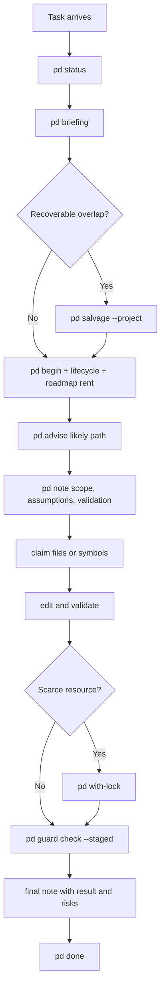

# Agent Operating Loop

```mermaid
flowchart TD
  A["Task arrives"] --> B["pd status"]
  B --> C["pd briefing"]
  C --> D{"Recoverable overlap?"}
  D -->|Yes| E["pd salvage --project"]
  D -->|No| F["pd begin + lifecycle + roadmap rent"]
  E --> F
  F --> G["pd advise likely path"]
  G --> H["pd note scope, assumptions, validation"]
  H --> I["claim files or symbols"]
  I --> J["edit and validate"]
  J --> K{"Scarce resource?"}
  K -->|Yes| L["pd with-lock"]
  K -->|No| M["pd guard check --staged"]
  L --> M
  M --> N["final note with result and risks"]
  N --> O["pd done"]
```
