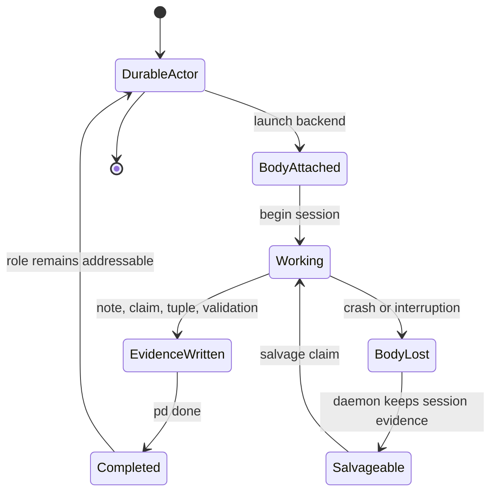

# Agent Lifecycle

```mermaid
stateDiagram-v2
  [*] --> DurableActor
  DurableActor --> BodyAttached: launch backend
  BodyAttached --> Working: begin session
  Working --> EvidenceWritten: note, claim, tuple, validation
  EvidenceWritten --> Completed: pd done
  Working --> BodyLost: crash or interruption
  BodyLost --> Salvageable: daemon keeps session evidence
  Salvageable --> Working: salvage claim
  Completed --> DurableActor: role remains addressable
  DurableActor --> [*]
```
