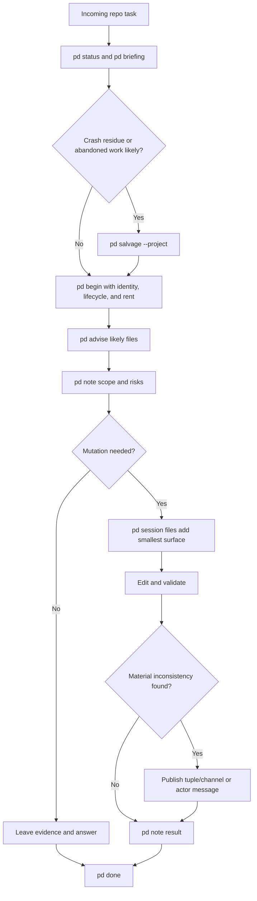

# Port Daddy Coordination Flow

```mermaid
flowchart TD
  A[Incoming repo task] --> B[pd status and pd briefing]
  B --> C{Crash residue or abandoned work likely?}
  C -->|Yes| D[pd salvage --project]
  C -->|No| E[pd begin with identity, lifecycle, and rent]
  D --> E
  E --> F[pd advise likely files]
  F --> G[pd note scope and risks]
  G --> H{Mutation needed?}
  H -->|No| I[Leave evidence and answer]
  H -->|Yes| J[pd session files add smallest surface]
  J --> K[Edit and validate]
  K --> L{Material inconsistency found?}
  L -->|Yes| M[Publish tuple/channel or actor message]
  L -->|No| N[pd note result]
  M --> N
  I --> O[pd done]
  N --> O
```
