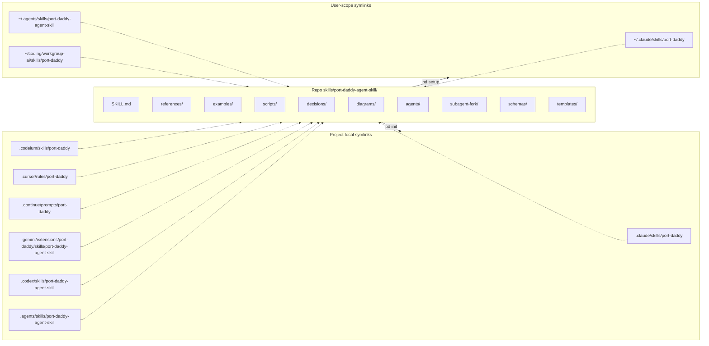

# Diagram 06: Skill Fanout Topology

`pd init` (and `pd setup`) write symlinks from many runtime locations into the canonical skill bundle. This is how every agent runtime — Claude Code, Codex, Gemini, Codeium, Cursor, Continue — sees the SAME skill content from one source of truth.

## Topology



## Why this topology

Each agent runtime expects the skill at a different path. Naive solutions:

- **Copy** the skill into each location: divergence within hours, multiple sources of truth.
- **Reference by absolute path**: breaks when the repo moves; doesn't survive teammate setups.
- **Symlink to canonical**: one source, one update path, works across runtimes.

`pd init` writes the project-local set on demand (cheap, idempotent). `pd setup` writes the user-scope set during installation. Both target the same canonical bundle.

## Operational consequences

### Updating the skill

Edit `skills/port-daddy-agent-skill/SKILL.md` (or any other file in the bundle). Every symlinked location now sees the change. No re-run of `pd init` needed.

### Moving the repo

If you move `~/coding/port-daddy/` to a new path, every symlink breaks. Re-run `pd setup` to re-target user-scope; re-run `pd init` in each project for project-local.

### Detecting drift

```bash
# Verify a symlink points where it should:
ls -la ~/.claude/skills/port-daddy
# Expected: → /Users/<you>/coding/port-daddy/skills/port-daddy-agent-skill

# If it points elsewhere or is a real directory: drift. Run pd setup.
```

### When NOT to use the symlink

- Distributing the skill via npm or brew: those should COPY (snapshot a version), not symlink.
- A frozen production environment where the canonical bundle isn't accessible.

For those cases, the skill ships its own version metadata (`CHANGELOG.md`) so the snapshot's age is detectable.

## Test enforcement

`tests/unit/distribution-freshness.test.js` and `tests/unit/port-daddy-skill-authority.test.js` check:

- The canonical bundle exists and matches expected structure.
- The mirror metadata in `SKILL.md` (`mirrors:` block) lists correct paths.
- No legacy `port-daddy-cli` skill directory.

If you add a new fanout target, update those tests too.

## Related

- `cli/commands/init.ts` — implementation of project-local fanout.
- `cli/commands/setup.ts` — user-scope fanout.
- `references/distribution-and-installation.md` — broader installation story.
- `tests/unit/distribution-freshness.test.js` — enforcement.
