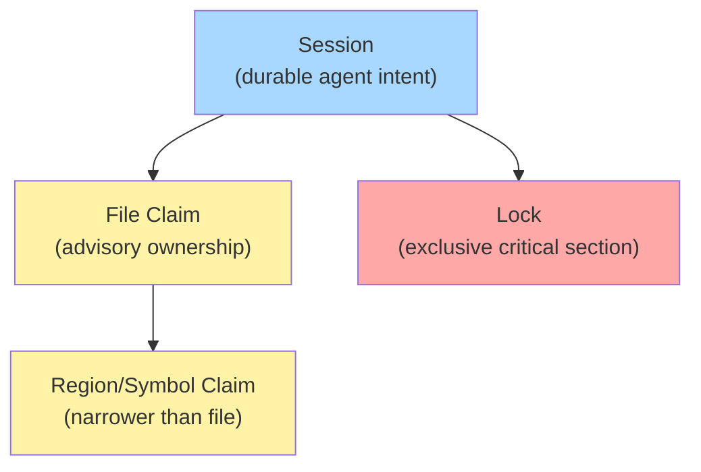
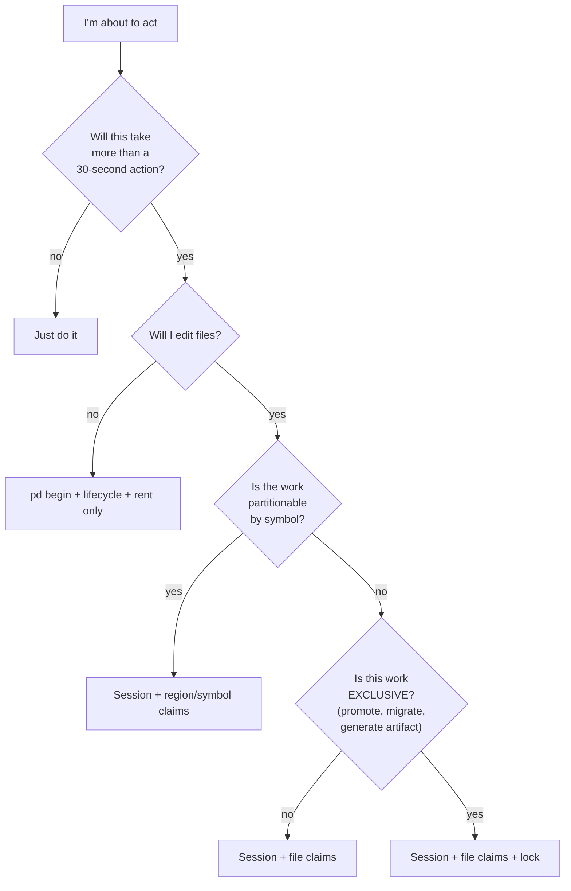

# Diagram 07: Session, Claim, and Lock Interaction

Sessions, file claims, and locks are three different concepts that agents conflate. This diagram clarifies their scopes and how they compose.

## Concept ladder



| Concept | Scope | Coordination level |
|---|---|---|
| **Session** | An agent's whole bounded task | Durable record of intent + notes |
| **Claim** | One file (or symbol within it) | Advisory — visible to others, doesn't enforce |
| **Region/Symbol claim** | A symbol-bounded slice of a file | Advisory; resolves via lib/symbol-index.ts |
| **Lock** | A named resource (e.g., "stable-promotion") | EXCLUSIVE — daemon refuses concurrent acquire |

## When to use which



## Composition examples

### Example 1: Adding a feature to one file

```bash
pd begin "Add /examples/leader-election to website-v2 examples list" --lifecycle durable --roadmap <slug>
pd note "Scope: website-v2/src/data/examples.ts"
pd session files claim website-v2/src/data/examples.ts
# edit
pd note "Result: added entry. Validation: build + lint pass."
pd done "leader-election example linked"
```

Session ✓, claim ✓, no lock needed (no exclusive resource).

### Example 2: Promote-stable

```bash
pd begin "Promote main@<sha> to stable" --lifecycle durable --roadmap <release-slug>
pd lock acquire stable-promotion --ttl 600     # exclusive
pd session files claim port-daddy-stable/CURRENT-SHA
# build, test, install
pd note "Promoted to <sha>. Daemon restarted."
pd lock release stable-promotion
pd done "promotion complete"
```

Session ✓, claim ✓, lock ✓ — because two simultaneous promotions would corrupt stable.

### Example 3: Parallel edits to a router

```bash
# Parent:
pd begin "Add 3 endpoints to routes/fleet.ts" --lifecycle durable --roadmap <slug>
pd session files claim routes/fleet.ts        # broad parent claim

# Spawn 3 sub-agents, each with symbol-scoped claim:
# Sub-agent A:
pd session files claim routes/fleet.ts --symbol-path GET_FleetStatus
# Sub-agent B:
pd session files claim routes/fleet.ts --symbol-path POST_FleetSpawn
# Sub-agent C:
pd session files claim routes/fleet.ts --symbol-path DELETE_FleetAgent
```

Parent owns the file at the file level. Children own non-overlapping regions. The symbol index ensures resolution.

## What each enforces

### Session

- Durable record. Survives daemon restart.
- Coordination Guard checks "is there an active session attached to this shell" before commit.
- Closing (`pd done`) makes the session ineligible for further claims.

### Claim

- ADVISORY. Doesn't physically prevent another agent from editing.
- Triggers warnings in `pd advise`.
- Visible to `pd files who-owns <path>`.
- Coordination Guard checks "is each staged file claimed by the active session?"

### Lock

- ENFORCED by the daemon. Concurrent `pd lock acquire` for the same name BLOCKS.
- Has a TTL. Expired locks can be force-released.
- Failure to release after work = stuck downstream agents.
- Best for non-mergeable shared resources: promotion, migrations, generated artifacts, release packaging.

### Region/symbol claim

- Same enforcement model as a file claim (advisory).
- Resolution depends on a fresh symbol index. Stale index = wrong owner reported.
- `pd symbols parse <file>` refreshes if needed.

## Failure modes

### Session active, no claims, files staged

Coordination Guard refuses commit: "File X not claimed."

Fix: claim each staged file.

### Claim by abandoned session, you want it

Don't override silently. Use `pd salvage claim <session-id>` to formally take over the abandoned work, OR force-release if you can verify the original work is moot.

### Lock held by abandoned process

Daemon's TTL eventually releases. For urgent cases:

```bash
pd lock force-release <lock-name> --reason "holder agent-X is verified dead at <time>"
```

Always note the reason — this is auditable.

### Region claim but symbol index is stale

`pd files who-owns <path> --symbol-path <X>` returns wrong agent. Resolution:

```bash
pd symbols parse <file>      # re-index
pd files who-owns ...        # re-query
```

## Anti-patterns

- **Lock for everything.** Locks serialize. Use only for non-mergeable resources.
- **Session without notes.** Sessions are coordination; without notes they're invisible to peers.
- **Claim without session.** Daemon will reject: claims belong to sessions.
- **Multiple sessions, one shell.** The per-shell context can only point at ONE session at a time. Open a new shell or use explicit `--session` flags.

## Related

- `references/coordination-theory.md` — deeper theory.
- `references/session-lifecycle-state-machine.md` — session states in detail.
- `lib/sessions.ts`, `lib/locks.ts`, `lib/symbol-index.ts` — implementation.
- `decisions/before-publish.md` — pre-commit gates that touch all three.
