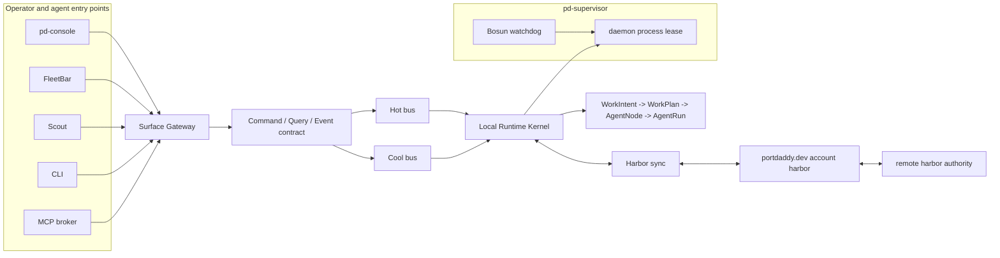

# Diagram 08: Agent Harbor Runtime Refactor

Use this when an agent needs the current Agent Harbor architecture in one
picture: surface entry points, one command/query/event gateway, hot and cool
buses, local runtime authority, supervision, and harbor sync.

Read it as a boundary map:

- `pd-console` is the deep proof surface.
- FleetBar grants consent and re-entry.
- Scout captures evidence-backed Work Intents.
- CLI submits the same envelope family as native surfaces.
- MCP broker is the managed-body capability aperture.
- Surface Gateway verifies and normalizes command, query, and event envelopes.
- Local Runtime Kernel owns Work Intent, Agent Node, Agent Run, transcript,
  control, cost, claim, and receipt truth.
- Bosun lives inside `pd-supervisor`; it watches local process health.
- Harbor sync moves durable records between local, account, and remote
  authority domains.
