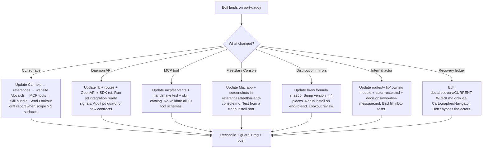

# Port Daddy — Internal Contributor Manual

You are editing the Port Daddy codebase itself: the daemon, MCP server,
FleetBar, Fleet Control Center, website, CLI, SDKs, distribution surfaces,
the recovery ledger, and the internal actor inboxes. This skill is private
to the port-daddy repo because most of what's here would be noise on a
project that just *uses* Port Daddy.

For the public skill — how any agent on any project should drive Port
Daddy — see the sibling `port-daddy-agent-skill`.

## NOT For

- Agents on other projects driving Port Daddy as a coordination tool — that's `port-daddy-agent-skill`.
- General coding without a Port Daddy surface change.
- Distribution to public skill catalogs.
- Replacing the live daemon, recovery ledger, or actor inboxes as sources of truth — those still come first.

## Operator vs Agent — the product rule

When designing or changing a Port Daddy surface, the test is "would the
operator have to drop to a terminal to do this routinely?" If yes, the design
is wrong. The operator's surface is FleetBar + the dashboard. `pd` CLI exists
for agents and emergencies. Every routine operator action (configure
credentials, restart daemon, see open feedback, harvest a roadmap entry, ack a
salvage item) must have a FleetBar button or dashboard panel as its primary
surface — CLI is the secondary path for agents and scripts.

Contributor implication: when you add a new actuator or data source, ship the
FleetBar/dashboard affordance in the same slice when reasonable, or file a
`high`-severity FleetBar feedback entry so cartographer promotes it to the
roadmap before the CLI-only path ships to operators. Examples in flight:
`fleetbar-secret-management-with-provider-deeplinks`,
`fleetbar-console-must-support-zoom-and-text-scaling`.

## How to work a slice (operating expectations)

The full posture lives in `AGENTS.md` § Agent Operating Expectations. The
repo-specific mechanics:

- **Coordinate + pay rent.** Clean linked worktree off `origin/main`,
  `pd begin … --lifecycle durable`, `pd session files add` before editing, a
  `pd note` per commit (the Coordination Guard enforces it), `pd done` at the end.
  When inheriting stale work, prefer `pd takeover <old-session-id> [reason]`
  (or `pd session takeover <old-session-id> [reason]`) over deleting or silently reusing the old session; notes and claim
  history are append-only evidence.
- **Supplant, don't migrate.** No users yet (operator directive, 2026-08-22):
  a new mechanism that overlaps an old one replaces it exhaustively in the same
  slice — delete the legacy path, fix every caller, no compat shims, no
  "legacy mode" flags, no downgrade fallbacks, no deprecation windows.
  Backwards compatibility only when the operator explicitly asks, per surface.
- **Assume broken; verify both ends.** After any write, read it back from the
  surface that should serve it, and prove cold start (daemon down → elegant
  operator instruction, never a stack trace), worktrees, a second user, and the
  GitHub round-trip. A green exit code is not evidence.
- **Keep daemon actuation singular.** On canonical macOS, launchd alone starts,
  stops, replaces, and resurrects the daemon. The daemon publishes readiness;
  Bosun detects a dead/stale generation and asks launchd for replacement;
  Doctor/status/native UIs observe the same snapshot. Never add a detached
  fallback to `pd start` or `pd restart`, never silently walk the canonical port,
  and do not call runtime health green unless launchd PID, `/health`, PID/port
  files, heartbeat, listener, and binary hash converge.
- **Confirm the telemetry trail.** Calls must show up in `pd usage` AND in the
  transcript saves (`lib/transcripts.ts`), and durable state must ride the
  Cloudflare fabric (`lib/relay-client.ts`) so posterity is cheap and survives the
  container — verify the read-back, don't assume it.
- **Dogfood novelly + capture wins.** Exercise a CLI/MCP/SDK surface you haven't
  before each slice; when a hard-won gambit lands, write it into this skill (or the
  public `port-daddy-agent-skill` if it generalizes).
- **Generalize.** Features must work for non-tsx/non-Rust repos, remote harbors,
  other machines, and shared GitHub teams — not just this checkout.
- **Whitepaper check.** Reconcile coordination/kernel work against the seven
  whitepapers registered in `website-v2/src/data/whitePapers.ts` (Legible Swarm,
  Single-Writer Kernel, Spawn to Person, Harbor Economy, Anchor Protocol, Bonded
  Commons, Federated Harbor); note drift in the PR.
- **Skill matching.** If you're missing a matching skill, pause and do skill
  research. The intended home is a **seamanship** match-cascade/graft selector
  (proposed, not yet built — modelled on windags `windags_skill_induct` /
  `windags_skill_graft`); until it lands, match by hand against `skills/`.
- **Launch work through PD spawn** (`pd spawn`, SDK `spawn()`, or MCP `spawn`),
  never a raw side-channel — so the work is registered, sandboxed, budgeted, salvageable.
- **Managers orchestrate; workers author PRs.** A manager lane delegates
  implementation edits, PR body drafting, and PR authoring to worker sessions.
  The manager reads returned artifacts, checks evidence, steel-mans the strongest
  case against shipping, retunes roles by round, and decides whether work
  advances.
- **Target: durable roles keep ledgers.** Notes are immutable evidence; role
  ledgers are curated projections for future briefings. Do not claim this as a
  fully shipped runtime unless the branch/live daemon proves it. Ledger entries
  that summarize operator preferences or cross-repo tactics must carry
  provenance, redaction/sync posture, account/team authority, and staleness.
- **Keep `README.md` current** in the same PR when a slice changes a documented surface.
- **A daemon/CLI-surface change ships atomically with its release.** If your slice
  alters the shipped `pd` — a new/renamed/removed verb, what the single binary
  registers, anything an operator sees after `brew upgrade` — the version bump,
  the embedded-version sync, and the Homebrew formula roll are part of the SAME
  change, not a follow-up. A landed binary that disagrees with the formula is the
  drift `version-drift-guard` and `tests/unit/embedded-version-sync.test.js` are
  there to catch; do not let them be what discovers it. Full rule and the
  "did the surface actually change?" test: `AGENTS.md` § *Release*.
- **Prove Squid from release cargo.** Adding a hook to source is not enough.
  Declare every required tentacle/identity/steering asset in
  `release-artifacts.json`, stage it in `release.yml`, then run
  `scripts/smoke-squid-release.mjs` against the compiled binary outside the
  source tree. The proof must cover Claude/Gemini project config, Codex/agy
  user config, exact-root gating, statusline, Pilot SessionStart, `/squid`, and
  machine-readable READY/LIVE state. A source-suite pass cannot substitute for
  this artifact-boundary proof.
- **Prove native dependencies again after macOS signing.** Hardened runtime can
  change dynamic-loader behavior after an unsigned build smoke has passed. Run
  the native import through the exact signed `dist/pd` release pair, with
  `DYLD_*` absent, before soak or archive sealing. Package dylibs behind a
  verified executable-relative Mach-O rpath and keep
  `com.apple.security.cs.allow-dyld-environment-variables` out of the release
  entitlements; do not trade a packaging defect for an injection surface.
- **Keep coordination content bounded; the SITREP is the visible value
  surface.** Coordination content (alerts/pheromones) stays invisible and
  bounded: with the SITREP dial off, a healthy no-op turn emits zero bytes and
  no status message, never starts the daemon or shells through the full `pd`
  CLI, and filters file traces to the exact project root before rendering them.
  Keep that coordination block to one heading plus at most two facts, clamp its
  context budget, and keep harness deadlines at one second. The regression
  proof must include thousands of irrelevant matrix entries while still
  surfacing one fresh exact-root fact. Installer tests must also prove atomic,
  idempotent config writes and migration of duplicate legacy Codex
  registrations without disturbing user hooks. The end-of-turn SITREP
  compulsion is the deliberate exception (operator doctrine reversal,
  2026-08-22): governed by the per-repo `sitrep.endOfTurn` dial
  (off|suggest|enforce, default enforce; `PD_SITREP` env override wins, then
  `agent.config.json` → `.portdaddy/sitrep.json` → `.portdaddy/project.json`),
  the pd-hook-prompt tentacle and the SessionStart Pilot inject the end-of-turn
  SITREP table contract — a constant-size standing block that rides outside the
  coordination byte cap. Do not re-bound or silently strip it; repos that want
  quiet turns dial it off explicitly.

## Core Decision Tree



## Internal Actor Embodiments

The five actor roles in the public skill are *concepts*. In this repo,
each one has a concrete **embodiment**: a route, a lib module, a fleet
persona, and a status surface. When you edit any one of these, you are
editing a piece of the actor's body, and the corresponding inboxes,
contracts, and operator surfaces must stay coherent.

| Actor | Route | Lib module | Fleet persona | Status surface |
|---|---|---|---|---|
| **Coxswain** | `routes/claims.ts`, `routes/locks.ts` | `lib/claims/`, `lib/locks/`, `lib/symbol-index/` | `agents/coxswain.yaml` (when present) | claim density + lock health in `pd briefing` | <!-- cite-exempt: illustrative role/template path -->
| **Navigator** | `routes/sessions.ts`, `routes/recovery.ts` | `lib/sessions/`, `lib/salvage.ts` | `agents/navigator.yaml` | `docs/recovery/CURRENT-WORK.md` | <!-- cite-exempt: illustrative role/template path -->
| **Cartographer** | `routes/cartographer.ts` | `lib/roadmap-progress.ts`, `lib/feedback.ts` | `agents/cartographer.yaml` (also lives at `.claude/agents/cartographer/`) | `.cartographer/status.md`, `IDEAS-TROVE.md`, `DOGFOOD-FEEDBACK.md` |
| **Lookout** | `routes/lookout.ts` | release-surface scanners under `lib/` | `fleet/documentarian.sh` (current shell-script form) | drift reports posted to lookout inbox | <!-- cite-exempt: illustrative role/template path -->
| **Quartermaster** | `routes/spawn.ts`, `routes/fleet.ts` | `lib/spawner.ts`, `lib/cost-tracker.ts`, `lib/backend-readiness.ts`, `lib/resource-governance.ts` | `agents/quartermaster.yaml` | spawn budget + readiness in FleetBar |

**Shipwright** is a sixth, internal-only role: it owns skill-bundle
ingestion, archetype classification, and survey aggregation across the
fleet. Lives at `lib/shipwright/{archetypes.ts, skill-index.ts, survey.ts}`
and `routes/shipwright.ts`. Tests under `tests/unit/shipwright-*.test.js`.
Don't expose Shipwright in the public skill — it's a port-daddy-internal
abstraction.

## Recently Shipped Surfaces — contributor module map

These landed on `main` in the last few weeks. When you touch one, you own
its full mirror set (Release-Surface Drift, below). Each is a release
surface: CLI help, manifest, MCP catalog, and skill docs must move with the
code. The public-facing summary lives in `skills/port-daddy-agent-skill/SKILL.md`
§ *Recently Shipped Surfaces* — keep the two in sync.

| Surface | ADR | Edit these together |
|---|---|---|
| **Relay** — cross-machine pub/sub | `docs/adr/0049-relay-architecture.md` | Worker `apps/relay/` (D1 schema `apps/relay/schema.sql`, `wrangler.toml`) · daemon routes `routes/relay.ts` · outbound SSE `lib/relay-client.ts` · CLI `cli/commands/relay.ts` · MCP `relay_status` in `mcp/server.ts` |
| **Cloud coordination peer** — offline-first CRDT federation | `docs/adr/0092-suggestibility-ladder-and-cloud-coordination-federation.md` §4 | shared wire/fold `lib/coordination-ledger.ts` · local SQLite outbox/importer `lib/coordination-peer.ts` · relay DO/auth/routes `apps/relay/src/coordination-room.ts`, `apps/relay/src/coordination-auth.ts`, `apps/relay/src/coordination.ts` · real sandbox daemon `apps/fleet-executor/src/sandbox-runner.ts` · compiled acceptance smoke `scripts/smoke-coordination-peer.sh` |
| **Dispatch** — autonomous feature-dev queue | ADR-0035 | `cli/commands/dispatch.ts` (+ deprecated alias `cli/commands/nightshift.ts`) · `lib/dispatch/{runner,spawn-adapter,queue,state-machine}.ts` · `routes/dispatches.ts` · `pd review` · `docs/proposals/pd-nightshift.md` | <!-- cite-exempt: illustrative role/template path -->
| **Coast Guard** — sandbox + compulsion rent | `docs/adr/0050-coast-guard.md` | `lib/coast-guard.ts` (`buildSeatbeltProfile`, `wrapWithSandbox`) · `lib/coast-guard/{compulsion,compulsion-facts,egress-meter}.ts` · default in `lib/spawner.ts` · read path `cli/commands/coast-guard.ts` (`operator_coast_guard` feature) · `requireNotePerCommit` wiring in the Coordination Guard (`cli/commands/guard.ts`) | <!-- cite-exempt: illustrative role/template path -->
| **Attest** — honest self-report | ADR-0045 | `cli/commands/attest.ts` · `lib/attest.ts` · `lib/attest-invariants.ts` · `GET /attest` · the `attest` manifest feature |
| **Tube** — conversational pipe | — | `cli/commands/tube.ts` · message-channel store · `pd_discover` listing |

Contributor gotchas specific to these:

- **Dispatch is dry-run by default.** `pd dispatch run <id>` prints the plan;
  only `--really-run` spawns. The worktree root is `~/coding/tmp/port-daddy-dispatch-<id>`
  (never `os.tmpdir()` / `/tmp`). If you change the spawn path, keep it under
  the scratch root — the Coast Guard reclaim gate (`isReclaimableSandbox`)
  assumes disposable sandboxes live there and the operator's main checkout
  does not.
- **No artifact means no reap.** A review launch may finish with useful dirty
  files while push/PR publication returns no URL. The Conductor adapter must
  route that outcome to `salvage` and preserve the worktree plus transcript.
  `settled` is disposable only when `resultArtifact` proves the work is durable.
- **`pd nightshift` must keep delegating.** The alias rewrites legacy flags
  (`--auto-queue` → `--auto-claim`, `--status` → `--state`) before calling
  `handleDispatch`. If you add a dispatch flag, check the alias still maps it.
- **Coast Guard is opt-out and never advertised.** It is the default for
  every subprocess backend in `lib/spawner.ts`; the agent-facing refusal must
  never name the opt-out (same rule as the guard bypass — guardrails do not
  advertise their bypass).
- **`pd attest` is a loud-fail gate.** Adding an invariant means it can flip
  CI/boot gates red. New CRITICAL invariants go in `lib/attest-invariants.ts`
  with a test; mark non-blocking checks as such so a green exit keeps meaning
  "every CRITICAL invariant holds."
- **Manifest bijection.** `features.manifest.json` is the parity source of
  truth (`npm run parity`). The `dispatch`/`relay`/`attest`/`operator_coast_guard`
  feature rows carry `_note` fields explaining intentionally-omitted routes
  (e.g. generic-typed Fastify handlers the route-parser cannot extract) — keep
  those notes accurate when you add or remove a route.
- **A coordination Durable Object is a peer, not the commit point for local
  work.** Never put a network await on the local claim/note/session/lease write
  path. Persist a local outbox first, acknowledge an operation only after the
  DO alarm flush made it durable, require contiguous pull cursors, and keep the
  sender retrying anything merely buffered. The DO hot path must not call
  `storage.put` per operation; model it on HarborChannel/HarborQuota and prove
  zero request-path writes plus one alarm-batch write.
- **Remote-daemon selection forbids local substitution.** An explicit URL or
  profile that refuses a connection must not enter direct-DB mode and must not
  auto-start a local daemon. Squid's generated hook gate uses bounded remote
  health for that explicit peer; only the implicit local daemon uses local
  ready/PID/heartbeat files. Preserve both sides in tests.

### Rust surfaces — the kernel IS landed; ADR-0120 is the boundary rule

The kernel lives in-tree at `core/kernel/` (pd-anchor / pd-mesh / pd-eventlog /
pd-runtime / pd-core / pd-compat / pd-tui / pd-rs). **ADR-0120 is the
once-and-for-all answer to "what is Rust for"** — read it before any
console/Rust/crypto work. The three-plane rule, compressed:

1. **Security kernel (Rust, canonical, small):** `core/kernel/pd-anchor`
   (Ed25519 cards, macaroon discharge gate, keystore), `core/pd-broker`
   (ADR-0087 separate-UID TCB), `core/harbor-card-rs` (FFI constant-time
   compare + caps-subset). Every security primitive is implemented ONCE, here.
   Native TS reaches it via FFI (`lib/arbiter.ts`, `lib/macaroon-ffi.ts`).
2. **Product planes (TypeScript, on purpose):** daemon control plane, fleet,
   CLI, website, and BOTH Cloudflare Workers. Outside the TCB, so Rust buys no
   security there (ADR-0087) — and Workers physically cannot call native code.
   Where a Worker must duplicate kernel *logic*, it lands a shared test-vector
   fixture in `tests/fixtures/*-parity-vectors.json` generated from the
   canonical Rust impl, asserted by both suites, in the same PR. No fixture,
   no second implementation. Never a third.
3. **Console (Rust because GPU, not crypto):** `core/pd-console` renders; it
   never signs/verifies. Not precedent for "write X in Rust."

Fixture regeneration is a security-relevant diff — review it like a change to
the verifier itself. **Do not scaffold new Rust crates** for non-kernel,
non-GPU work; keep prod/latest/dev pd-console lanes distinct when building or
reviewing the console.

#### Building / installing / running `pd-console` (full detail in `AGENTS.md` § *Building, installing & running pd-console*)

Two binaries from one crate on **crates.io gpui 0.2.2** (not the Zed git pin):
`pd-console` (GPU window, `--features gpui`, macOS) and `pd-console-repl` (headless TUI, CI gate).
Build: `cargo build --release --bin pd-console --features gpui` (from `core/pd-console`).
**Install BOTH launch surfaces or you demo a stale build:** the PATH binary
`~/.port-daddy/bin/pd-console` *and* the double-clickable `~/Applications/pd-console.app`
(embeds its own binary — does NOT read PATH). After replacing the .app binary,
`codesign --force --deep --sign - ~/Applications/pd-console.app` or macOS rejects it.
Launch normally against the canonical published daemon port; use
`PORT_DADDY_URL` only to target one explicit development berth. Startup must
never read `~/.port-daddy/console-daemon.url`: that stale selector previously
pinned future launches to dead berths. `PD_CONSOLE_THEME=light|dark` / `Ctrl-A
g` controls the theme. The Work screen submits one WorkIntent and stays attached
to the daemon's exact launch/agent/transcript receipt; never jump to “newest
agent” or spawn directly from the view. gpui 0.2.2 has no transform:
glow/lift = `shadow(BoxShadow)` + hover color; timelines = `with_animation`; inside `.hover(|s|…)`
pass bare `rgb(x)` (NOT `.into()` — ambiguous). Console branch: `feat/console-tmux-multiplexer`.

## Release-Surface Drift (the contributor's prime directive)

When Port Daddy itself ships, the cost of inconsistency lands on every
project on the user's machine. **Every change to a public surface MUST
update every mirror in the same coherent slice.**

For the actual release ceremony (tagging, GitHub Release, `release.yml`,
archive provenance, and the tap's credential-independent self-promotion),
follow `docs/RELEASING.md`.
For semver policy and the canonical list of *version surfaces* that must
all bump in lockstep, see `docs/VERSIONING.md`.

The list below is the broader surface area a contributor touches *before*
the release ceremony fires — the docs, examples, manifests, and CLI help
that lie about behavior if not updated alongside the code.

Public surfaces, in approximate update order:

1. Source code (`lib/`, `routes/`, `mcp/`, `apps/FleetBar/`).
2. CLI help text (`bin/port-daddy-cli.ts` and any `--help` strings touched).
3. The skill bundle (this repo's `skills/port-daddy-agent-skill/SKILL.md`, references, templates, examples).
4. The website (`apps/website-v2/` — `/docs/cli`, `/docs/api`, `/docs/mcp`, command detail routes, screenshots).
5. The OpenAPI spec, SDK reference, MCP tool catalog.
6. README + the version surfaces in `docs/VERSIONING.md`. The changelog is
   NOT hand-edited: add `changelog.d/<pr>-<slug>.md` (see `changelog.d/README.md`)
   and let `node scripts/assemble-changelog.mjs --release <version>` stamp
   `CHANGELOG.md` — the release train runs it for you.
7. Any plugin/extension manifests (Codex `.codex/skills/`, Gemini `.gemini/extensions/port-daddy/`, Claude `.claude/skills/`).
8. **Binary smoke-test** (per `docs/RELEASING.md` §3, "local feature dev") for any change in `lib/`, `routes/`, `server.ts`, or `mcp/`. Source-mode `tsx server.ts` lies about what users actually run.

The Homebrew formula is no longer a per-PR concern. The `curiositech/homebrew-tap` workflow discovers stable `latest.json` on a serialized schedule, independently peels the release tag, verifies both Batten imprints and archive digests, and requires GitHub provenance for v3.30.3+. Source `release.yml` waits for the exact formula version but never writes across repositories. See `docs/RELEASING.md` §1 step J.

If you cannot land all of these in one commit, leave a `pd actor lookout`
message naming the gaps and link the follow-up issue. Lookout is the role
that watches for release-surface drift; making the drift visible is your
job, fixing it is theirs (or future-yours).

## PR Finish Line Discipline

For Port Daddy repo PRs, local validation is not the finish line. Before
calling a branch ready, inspect and close the full PR surface:

- Inline bot comments from Copilot, Claude review, Cloudflare Pages, CodeQL,
  package/release jobs, or deploy previews count as review findings. Reply to
  each actionable thread with fixed / deferred / contested-because.
- A neutral adversarial reviewer runs in CI on **every** PR (the
  `claude-adversarial-review` workflow — assumes laziness/slop/lies/corner-cutting,
  ends with a `SHIP / SHIP-AFTER-FIX / DO-NOT-SHIP` verdict). Also run your own
  skeptical reviewer agent for non-trivial changes. Fix high-confidence findings
  as named fixup commits on the branch.
- **The PR description is gated.** `.github/PULL_REQUEST_TEMPLATE.md` is the form,
  and `scripts/check-pr-requirements.mjs` (CI job `pr-requirements-guard`) fails the
  merge queue on an empty/boilerplate Summary or Test Plan, or a visual diff with no
  artifacts. Draft-check locally: `npm run check:pr-requirements -- --body-file <draft.md>`.
- Treat GitHub CI, external deploy checks, release-package jobs, and Cloudflare
  Pages as one CI/CD surface. If one is red, inspect the linked logs. Only call
  it external after proving the branch is not the cause, and record that proof
  in both the PR and a `pd note`.
- Do not leave a PR with "CI green except..." as an unresolved aside. Either
  make it green, file/assign the external blocker with evidence, or hand off the
  exact next action to an active Port Daddy session.
- **UI diffs ship visual artifacts — forever (now `[M]`).** A PR touching a GPUI
  surface (`core/pd-console` window), the console (any pane/renderer), or the
  website/dashboard (`website-v2/`, `fleet-config-ui/`, `public/fleet-ui/`,
  `public/`, `dashboard/`, `apps/FleetBar/`) is incomplete without screenshots + a
  GIF + a short screen recording of the real change in its Test Plan, and
  `pr-requirements-guard` now fails the PR without at least a screenshot + a motion
  artifact. Green CI proves compilation, not rendering. TUI panes →
  `vhs` (tape under `core/pd-console/docs/artifacts/`); GPUI window →
  `cargo build --release --features gpui` then `core/pd-console/scripts/capture-gpui.sh`
  (needs macOS Screen Recording permission — a headless host is TCC-denied);
  website/dashboard → headless Playwright dark+light pairs. See AGENTS.md
  § "Visual artifacts for UI diffs". Operator rule, 2026-06-11.

## PR Lifecycle (Create / Update / Land)

The Finish Line Discipline above is the *review contract*; this is the
*mechanical contract*. `AGENTS.md` (`## Pull Request Operating Procedure`)
carries the canonical copy — this is the contributor-repo mirror.

**Create.** Linked worktree off `origin/main` under `~/coding/tmp/wt-<slug>`
(never the main checkout — it carries the operator's WIP) → `pd begin
"<purpose>" --identity port-daddy:contrib:<slug>` → scope `pd note` → `pd
session files add <files>` *before* editing → edit → `pd guard check
--staged` → commit (no Claude co-author trailer) → `git push -u origin
<branch>` → `gh pr create` → `pd done`.

**Update** (review + CI). Pull bot comments with `gh api
repos/curiositech/port-daddy/pulls/<n>/comments` and fix the real ones.
Land every HIGH adversarial finding as a named fixup commit. Get `npx tsc
--noEmit`, jest, `npm run parity`, and the build green. Rebase onto latest
`origin/main`, resolve conflicts, push.

**Land.** Merge in dependency order: base before dependent, and rebase the
dependent after *each* merge — mergeability can flip MERGEABLE → CONFLICTING
the moment the base lands. Use the protected flow: `gh pr merge <n> --auto`
when the merge queue is active, and let branch protection choose the merge
strategy. Do not add `--squash`, `--merge`,
`--rebase`, or `--admin` as routine agent flow. A human maintainer may make an
explicit, documented emergency bypass; an agent does not admin-skip a real
required gate. Cloudflare Pages may be external/advisory, but prove that from
branch protection and record the evidence before treating it as non-blocking.

**Cleanup.** Delete a worktree only when its branch is merged AND `git -C
<wt> status --porcelain` is clean. Never delete a worktree with uncommitted
work; never reset or clobber the main checkout.

### Shell gotchas (real and recurring)

- **`git add -A` is refused by the pd-shim.** Stage explicit paths. If the
  refusal is wrong, repair the session/claim input and publish the
  inconsistency; do not disable the guard.
- **The `~/.port-daddy/bin/git` shim sets `core.pager=delta` → `bat`.** If
  `bat` is absent, `git log` / `git show` / `git commit` emit `command not
  found: bat` and can swallow output. Use `git -c core.pager=cat …` or
  `GIT_PAGER=cat`.
- **Inline `node -e` and heredocs get mangled by zsh.** Write a `.cjs` under
  the repo's `.scratch/` (gitignored, resolves `node_modules`) and run it.
- **Secrets go through `pd secret set`** (hidden stdin prompt) — never as an
  argv argument.

### Test + session gotchas (dev-loop shibboleths)

The friction below costs every fresh session real time. Internalize it.

- **Tests are Jest, not vitest.** `tests/unit/*.test.js` import from
  `@jest/globals`; run them with `npm test` (which is `node
  --experimental-vm-modules node_modules/jest/bin/jest.js`). Invoking `vitest`
  fails at import with *"Do not import `@jest/globals` outside of the Jest test
  environment"* — that's a wrong-runner error, not a broken test.
- **A fresh linked worktree has no `node_modules`.** `git worktree add` copies
  tracked files only, so `npm test` / `jest` / `tsc` all fail with
  `MODULE_NOT_FOUND` until you install. Either `npm ci` in the worktree, or run
  the parent checkout's binary directly against the worktree:
  `node --experimental-vm-modules
  /Users/erichowens/coding/port-daddy/node_modules/jest/bin/jest.js --rootDir .
  <path/to/test>`. A bare `node_modules` symlink to the parent does **not**
  work — Node resolves the symlink target and looks for `node_modules` beside
  *it*, not inside it.
- **Headless `pd begin` needs an explicit lifecycle and closed stdin.** With no
  TTY, `pd begin` blocks waiting for interactive input, and even with a purpose
  it errors without `--lifecycle`. Use `pd begin "<purpose>" --lifecycle
  durable < /dev/null` (or `--lifecycle ephemeral` for heartbeat-bound process
  sessions). Sessions launched via the Bash background-job wrapper never
  register — run `pd begin` in the foreground.
- **Coordination-Guard claims are per-file, not per-directory.** `pd session
  files add skills/foo/` does not cover `skills/foo/SKILL.md`; the guard rejects
  the commit file-by-file. Claim exactly what you staged:
  `pd session files add $(git diff --cached --name-only)` right before `pd guard
  check --staged`.
- **A `git add -A` / `reset --hard` / `rebase` refused with "coordination
  guard … could not be verified"** (not the routine advisory refusal) means the
  daemon-side guard couldn't confirm your session. Re-run `pd begin`, then
  retry. If direct session state, claims, and the refusal still disagree,
  publish exact evidence to `coordination:inconsistency` and surface the blocker
  to the operator instead of routing around the guard.
- **Environment variables override context slot**: When running Port Daddy commands (like `pd begin`, `pd done`, `pd session files add`) inside subagent execution lanes spawned by harnesses (such as Antigravity/Claude Code), the harness may inject `PD_SESSION_ID` and `PD_AGENT_ID` of the parent/old session into the environment. Because the CLI prioritizes these environment variables over context slot files, any command will resolve to that old session (which may be completed, leading to "No active session found"). Fix this by prefixing your commands with `PD_SESSION_ID="" PD_AGENT_ID=""` to force the CLI to read the active context from the filesystem context slots.
- **Binary drift in integration tests on dev machine**: Ephemeral test daemons started by the integration test framework will verify binary hashes. If there's a global Homebrew or PATH-installed `pd` binary, it may cause false positive "binary drift" checks. Fix this by overriding the comparable on-disk path by setting `PORT_DADDY_BIN_OVERRIDE: process.execPath` inside the test environment for both the CLI runs and the ephemeral daemon spawns (now configured automatically in `tests/helpers/integration-setup.js` and `tests/helpers/ephemeral-daemon.js`).
- **Roadmap receipts for core coordination changes**: Changes to core coordination paths (like `cli/commands/sessions.ts`) are monitored by the Coordination Guard. The guard will block commits affecting these files unless the committing agent has touched/upserted a corresponding roadmap item (e.g. via `pd roadmap touch <slug> --harbor port-daddy --note <why>`). Note that `--harbor port-daddy` must be specified if you are working in a temporary sandboxed worktree where the folder name diverges from the default repo name.
- **Rich Docstring Mandate (TypeScript and Rust)**: Every library function and method in the codebase must carry rich, informative documentation. This is enforced by the `npm run check:rich-docs` (under `scripts/check-rich-docs.mjs`) validation loop. TypeScript functions/methods must use `/** ... */` JSDoc blocks including `@param` and `@returns` tags (when parameters/return values are present) and discuss design, motivation, or philosophical rationale (e.g., matching keywords: `motivation`, `purpose`, `philosophy`, `why`, `design`, `intent`). Rust functions must use `///` doc comments discussing the same motivation/philosophy keywords and parameter/return usage. You can run `npm run check:rich-docs -- --staged` to fast-audit only your changed/staged files.
- **Hook fan-out is host-visible work, not free middleware**: Codex schedules a command hook once per matching nested tool call and renders concurrent batches as concurrent hook jobs. Never register an observational synchronous `PostToolUse` command, and never match an edit gate against broad `Bash` / `exec_command` / shell surfaces when the gate cannot derive a canonical target. The shipped topology is one turn briefing plus a synchronous gate only for direct edit tools; claims and notes are the cumulative outcome record. A six-tool read-only batch must schedule zero Port Daddy tool hooks. The raw debug/headless `pd-hook-post-tool` asset remains staged, but the stable interactive wrapper is an immediate zero-work tombstone so a running provider with cached config cannot resurrect it; never “repair” that wrapper by copying the raw tentacle over it. Its absence from provider config is intentional and must still diagnose as LIVE.
- **Hook config paths are a durable interface, not a package location**: resolve versioned release assets only while staging; every Claude/Codex/Gemini/agy lifecycle config must call `~/.port-daddy/bin/pd-hook-*`. Release smoke must reject `/Cellar/` paths, and uninstall/repair must sweep legacy project-local Codex TOML without touching user hooks. The generated wrapper owns a CLOSED/OPEN/HALF_OPEN circuit breaker (3 consecutive failures or >250 ms, 5-minute cooldown, one probe, zero hook retries). Measure latency through external `/usr/bin/time -p -o`; shell-reserved `time` leaks outside redirections under dash. A missing timer must fail open, trip the same breaker, and request FleetBar Repair. Test unexpected exit, missing executable, missing timer, slow execution, exit-2 enforcement, concurrent accounting, one-shot FleetBar remediation, repair reset, minimal tooling, macOS/Linux shell behavior, and compiled artifact wiring as separate V&V seams.
- **Harness introspection is a bounded interface**: `pd squid status` and `pd squid debug status` must read one sanitized timeline source and emit valid JSON regardless of retained history size. Cap recent steps and matrix values, expose total/returned/truncated metadata, and keep descriptions beside actual/expected timestamps. When capture is off, routine status must omit retained session identifiers and absolute workspace/event paths; only explicit debug status may reveal that diagnostic window. The portable shell compactor must strip BSD/macOS `wc -c` whitespace before its numeric guard and remove the first partial line after `tail -c`, or the nominal byte ceiling silently stops working and the retained TSV begins with a corrupt record. Test a multi-thousand-record fixture, macOS-padded byte counts, complete record boundaries, and a response-size ceiling; a JSON EOF is an interface failure even when the underlying daemon route returned 200.
- **Arrival and sitrep are on the critical path**: optional `pd begin` peer guidance is semantic-only, capped to three, fail-open, and budgeted at 75 ms total — disable reconnect retries, abort the active request, and test a transport that never settles. Sitrep must project and cap every top-level collection, nested salvage notes, and text field; preserve exact note totals separately from the DB-bounded preview. `--quiet` must request a summary-only route rather than fetching a full payload and discarding it locally. A fast database query that serializes 200 KB of histories is still a failed launcher interface.
- **A preferred port is not endpoint evidence**: startup may seed `9876`, but SDK/CLI connection resolvers must use an explicit URL, a real socket, or a strictly parsed published port. Keep forgiving seed helpers separate from strict connection helpers, including public display fields and socket-to-TCP fallback. Reject a protocol the returned connection target cannot carry: the current Node target is HTTP-only, so accepting `https:` and then calling `node:http` is a plaintext-to-TLS-port defect, not compatibility. Fixture-test absent, malformed, unreadable, environment-published, file-published, unsupported-protocol, and constructor-URL-over-socket cases without consulting the developer's live daemon. The compiled smoke must use AF_UNIX-safe paths under `~/coding/tmp` and prove Unix plus TCP health on both boots.
- **Provider CLI policy flags are versioned interfaces**: dogfood the exact packaged spawn argv against the installed provider CLI, not only a mocked child process. Current Codex defines `--approve-for-me` as automatic review inside `workspace-write`; combining it with `--sandbox workspace-write` is a hard parse error before an agent starts. Direct spawn and Tube builders must share this compatibility invariant, and a reviewer that cannot launch is a product red, not a reason to waive review.
- **A Cloudflare Queue delivery is not a logical Fleet run**: persist an ingress intent before `queue.send()`, idempotently key it by webhook delivery id, and assign a monotonic generation per repo + PR. Only supersede older active generations after the newer queue send succeeds; otherwise a transient admission failure can erase the last valid review. The executor must compare-and-swap that intent before spend so duplicate deliveries, retries, and stale heads acknowledge without re-running ships. Project activity from the intent ledger plus `fleet_runs`; label D1-known queue depth and expected timestamps as estimates, never Cloudflare-internal position. Keep active rows out of retention deletion, delete intent-only receipts through the same operator contract, and test the webhook, executor race, rollback-without-table path, signed-in receipt, and terminal retention seams independently.
- **Generated relay migration ledgers land through a PR, never a direct `main` push**: `deploy-relay.yml` first proves the staging D1 apply and deploys `relay-latest`, then updates the deterministic `automation/relay-staging-ledger` branch and arms auto-merge on its generated PR. Use `release-workflow-state.mjs select-live-token` to live-probe the dedicated PAT fallbacks and expose only the source name. Do not use `GITHUB_TOKEN` for this mutation (GitHub leaves its generated PR runs human-approval-gated; use a dedicated App/PAT for automatic runs), do not add `github-actions[bot]` to the ruleset bypass, and do not make staging availability depend on whether the generated ledger PR has merged. The production gate stays closed until that PR lands.

## Show-Me Runbook (operator demos)

When the operator asks to *see* a pd-console / FleetBar / daemon feature, the
deliverable is a running, seeded, correctly-registered triple — not a build log.
Every step below encodes an actual failure from a live demo (2026-07-12).

1. **Build the TRIPLE from the feature branch** with `scripts/dev-triple.sh <label>`.
   The daemon must launch with the berth env vars from `shared/daemon-berths.ts`
   (`BERTH_ENV`): `PD_DAEMON_TIER=dev PD_DAEMON_LABEL=<label> PD_DAEMON_COLOR=<hex>
   PD_DAEMON_SOURCE_DIR=<worktree>` so it self-registers into
   `~/.port-daddy/dev-daemons.json`. `dev-triple.sh` exports these itself; any other
   launch path must export them by hand. Unregistered berth = daemon invisible in
   FleetBar's Daemons list = furious operator.
2. **Seed live state before the operator looks.** An empty daemon renders empty
   panes — it can't render what it has no backend for. For claim/conflict surfaces:
   two sessions with overlapping `POST /sessions/:id/files` claims (`agentId` is
   required in the body).
3. **Multi-PR feature → combined local preview branch.** Merge the PR branches
   locally (never push the merge branch) so the operator reviews the sum. Demoing
   one slice invites rage-bugs about everything the other slice already fixed.
4. **`pd-console-repl` / terminal-face artifacts are machine-gate evidence only** —
   never operator review material. Operator review = the GPUI app, running, seeded.
5. **Emoji sweeps grep BOTH literal emoji AND unicode escapes** (`\u{2693}`,
   `\u{1F...}`). Escaped emoji still render as emoji; the no-emoji-as-icons rule
   judges pixels, not grep hits.
6. **Never create virtual displays or modify display settings.** On-primary-screen
   window openings only with explicit operator consent, per action.

## Distribution Mirror Sync

The skill bundle is mirrored to several locations. Inside this repo the
canonical copy is `skills/port-daddy-agent-skill/`. The `metadata.mirrors`
block in its frontmatter declares targets:

| Target | Purpose | Sync trigger |
|---|---|---|
| `.codex/skills/` | Codex CLI agents on this repo | install.sh + brew post_install |
| `.claude/skills/` | Claude Code agents on this repo | install.sh + brew post_install |
| `.agents/skills/` | Generic AGENTS.md-aware tools | install.sh |
| `.gemini/extensions/port-daddy/skills/` | Gemini CLI extension surface | install.sh |
| windags-skills (out of repo) | Public catalog distribution | manual `cp -r` from this repo to `~/coding/windags-skills/skills/` |

`port-daddy-internal-dev` (this skill) **is intentionally absent** from
the mirrors-list above. Do not propose distributing it. Its presence on a
non-port-daddy machine would be confusing noise.

## Recovery Ledger Discipline

`docs/recovery/CURRENT-WORK.md` is owned by Navigator + Cartographer.
**Do not edit it directly.** Send messages to those actors:

```bash
pd actor navigator --message "ROADMAP: <slice> completed at <commit>. Suggest promoting next: <item>."
pd actor cartographer --message "DOGFOOD: <synthesis>. Suggest roadmap entry: <name>."
```

Mailbox delivery is durable but not synchronous. After messaging an actor,
keep working from the actual source of truth: `docs/recovery/CURRENT-WORK.md`,
`.cartographer/README.md`, `.cartographer/status.md`, live notes, sessions,
and the checked-in release surfaces.

If `docs/recovery/CURRENT-WORK.md` contradicts the live fleet, that is a
**Navigator** issue. File it; do not silently overwrite.

## Git Discipline (inherited; see ADR 0001)

The five rules from `port-daddy-agent-skill` apply here too — and harder,
because this repo has the highest agent density on the user's machine.

1. **Worktree mandatory** for any background contributor work — even small ones. The repo has 70+ existing worktrees and dozens of WIP branches; sweeping up someone's WIP is a near-certainty without isolation.
2. **No `git add -A` ever.** No exceptions. The repo has too many drafts in flight.
3. **Pre-commit `git status --porcelain` check.** Abort on foreign files. The pre-commit hook from `pd guard install --mode enforce` should be on at all times in this repo.
4. **Lock the staging area** if you must work in the main checkout: `pd lock port-daddy:git:write` (or `pd with-lock port-daddy:git:write -- <command>`). MCP-aware clients can call `acquire_lock` with the same name.
5. **Push only what you tagged.** Never `git push --follow-tags` from a contributor agent.

See `references/git-discipline-internal.md` for port-daddy-specific
extensions (release-tag immutability, the v-prefix convention, the brew
formula update protocol).

## Fleet Model Tiers (never choose from memory)

Every Workers AI model decision — a ship's tier, a purser step model, a new
admission — is made against `references/cloudflare-model-roster.md` (the
verified catalog + pricing snapshot, the admission contract, and the standing
decision record) and the live scoreboard
(`node scripts/fleet-ship-stats.mjs --days 14`, which reads the relay D1's
per-ship × per-model spend and broken/repair health). Two standing rules:
an id is honored only after existence + rate + context are verified (phantom
ids return silent blanks — #654), and a model-change PR carries its
before-window stats and gets judged on its after-window. The gpt-oss-20b
author tier (#8870: 75% repair failure, half the fleet's verdicts washed out)
is the tombstone for choosing a tier off a price note without a scoreboard.

## Catalog-First Reflex (windags MCP, internal edition)

Port Daddy contributors are not exempt from the catalog. The 600+ skills
in `~/coding/windags-skills/` cover most patterns you'll hit while
editing this codebase: rate limiting, caching, websocket protocols,
distributed transactions, pre-mortems, evaluation harnesses, design
systems for the website, and more.

```bash
windags_skill_search "<the thing you're about to do>"
windags_skill_graft <skill-id> [skill-id...]
```

**Before every contributor slice**, one search. Examples that have paid off:

- Editing the daemon's lock-acquire path? `windags_skill_search "distributed lock semantics"` → grafts `distributed-algorithms` and `sagas-garcia-molina-salem-1987`.
- Adding a new MCP tool description? `windags_skill_search "MCP tool description writing"` → grafts `mcp-creator` if relevant.
- Touching the website? `windags_skill_search "responsive layout master"` and friends — the design-system skills ship with usable component patterns.
- Writing pre-release tests? `windags_skill_search "adversarial QA"` → grafts `qa-automation-specialist` or `webapp-testing`.

If the catalog is wrong or stale for our domain, that's a Cartographer
issue: `pd actor cartographer --message "Catalog gap: <what skill should exist>. Use case: <internal slice>."`

## Maintain These Skills (port-daddy-internal-dev edition)

This skill is alive. It improves when contributors update it. **When you
finish a slice — any slice on this repo — ask: did I just learn something
that this skill *or* `port-daddy-agent-skill` should have warned me about?**

Contributors are the only agents who write to *both* surfaces. As an
internal agent you own a continuous maintenance duty for both:

- **Public** (`skills/port-daddy-agent-skill/SKILL.md`) — anything that helps an agent on *any* project using Port Daddy. New verb, deprecated flag, decision row, anti-pattern, clarification, brevity win.
- **Internal** (this skill) — anything specific to *editing this repo*: release ceremony, internal actor embodiments, drift protocol, worked contributor examples.

Drive-by edits are explicitly welcome on both. No issue required, no
permission required. Same-slice fixes — landing the skill update alongside
the code change that revealed the problem — are the default; that is what
keeps the documentation from going stale between releases. Retrospective
edits (the lesson surfaced days later) are still owed; open a tiny PR.

Concrete triggers:

- **You hit a release-surface gap** the protocol didn't cover. Update `references/release-surface-drift-protocol.md`.
- **An internal actor's body moved** (new route, lib reshuffle). Update the Internal Actor Embodiments table.
- **A worked example would have saved an hour** for a recurring slice. Add it to `examples/`.
- **A new useful internal-only tool** (audit script, fleet persona, debugger) was written. Cross-link from this skill.

Update mechanics:

```bash
git worktree add ../port-daddy-internal-skill-$(date +%s) origin/main
cd ../port-daddy-internal-skill-*
pd begin "Update port-daddy-internal-dev: <what>" --identity port-daddy:contrib:internal-skill-update
$EDITOR skills/port-daddy-internal-dev/SKILL.md   # or references/<file>.md
git add skills/port-daddy-internal-dev/<paths>
git status --porcelain                             # must be clean of foreign files
git commit -m "skill: port-daddy-internal-dev — <change>"
```

If the wisdom is **public** (any agent on any project would benefit), put
it in `port-daddy-agent-skill` instead. The split-decision rule: *would
this help an agent on a non-port-daddy repo?* Yes → public. No → internal.
Both? → public, with a port-daddy-specific extension page in this skill.

After landing, send Cartographer:
`pd actor cartographer --message "port-daddy-internal-dev updated: <section>. Reason: <session/incident>."`

## Advance (the invocable "move it along" call)

When the operator invokes this skill with `advance` (or any phrasing like
"move things along", "go on", "keep going", "you know what to do"), run the
standing autonomous sweep. **Do not ask permission at any step** — review is
the gate, not the operator. These are the operator's recorded expectations;
re-asking them is the failure mode this section exists to kill.

1. **Recon.** `pd status` / `pd briefing` / `pd sessions --all-worktrees`,
   then `env -u GITHUB_HOST gh pr list --author @me --state open` (plus any
   PRs this fleet opened under other identities). Snapshot main's CI:
   `gh run list --branch main --limit 5`.
2. **Classify each open PR**: green-and-mergeable → land it now; stale base →
   rebase; red required check → root-cause it; superseded by a landed PR →
   close it with a comment naming the superseding PR (never merge a
   semantically obsolete diff — see the #353 incident); draft → leave unless
   its gate condition is met. Compare the head's actual invariant and tree to
   current `origin/main`; an old green check and a non-empty commit list do not
   prove work is still missing. Carry forward the smallest valid invariant,
   and leave broad adjacent programs open instead of relabeling them as part of
   a cleanup sweep.
3. **Red required check = STOP and fix the root cause**, even when the debt
   is inherited from main. Never `--admin` over a real red. Cloudflare Pages
   may be external/advisory, but prove that from branch protection before
   treating it as non-blocking.
   A Fleet receipt that says concluded while GitHub's required check remains
   `in_progress` is the same class of stop: inspect both sides of the delivery
   interface. The executor must propagate an exhausted `completeCheckRun`
   result into queue retry/DLQ before acknowledging the message. Keep ship
   checkpoints durable and post non-idempotent aggregate reviews only after
   the required check PATCH succeeds, so retries neither re-spend nor duplicate.
   The logical-run deadline must also fit the configured roster: budget at
   least one default AI-call window per ship plus explicit queue/checkpoint
   overhead. A ceiling equal to `ship count x call deadline` has zero room for
   continuations and will deterministically terminate healthy checkpointed
   reviews before their final blocking ship. Prove the slow-success boundary
   with a focused test whenever either deadline or roster size changes.
4. **Answer every review thread.** Copilot and claude-review inline comments
   are first-class reviews: fix-and-reply, or dismiss-with-reason against
   origin/main. A PR with unanswered threads is not "ready".
5. **Land in dependency order**, base before dependent, rebasing the
   dependent after each merge. Use `gh pr merge <n> --auto` for merge-queue
   repos and let the protected branch choose strategy. Admin bypass is not a
   routine agent landing path.
6. **Clean up**: delete only worktrees whose branch is merged AND whose
   `git status --porcelain` is clean. Never touch the main checkout.
7. **Close the ledger**: `pd note "Result: ... Validation: ... Remaining: ..."`,
   `pd done`, `pd feedback` — and if the sweep taught this skill something,
   land the skill edit in the same sweep.

Built bundles (`public/fleet-ui/`) conflict on every rebase because both
sides rebuilt them: resolve toward main's bundle, finish the rebase, rebuild
from the rebased source (`cd fleet-config-ui && npx vite build`), and commit
the fresh bundle. Never hand-merge a minified asset.

## Operating Loop (contributor)

```bash
# 1. Anchor + reconnaissance
pd status
pd briefing
pd salvage --project port-daddy --limit 20
pd sessions --all-worktrees

# 2. Worktree (always)
git worktree add ../port-daddy-$(date +%s)-$WORK_SLUG origin/main
cd ../port-daddy-$(date +%s)-$WORK_SLUG

# 3. Identity and scope
pd begin "<bounded slice>" --identity port-daddy:contrib:$WORK_SLUG
pd note "Scope: <surfaces>. Assumptions: <truth>. Validation: <commands + tests>."
pd session files add <path>...

# 4. Work
# ... edits ...

# 5. Reconcile
git fetch origin
git rebase origin/main
pd notes --limit 20
pd guard check --staged

# 6. Cross-surface coherence (the contributor-specific bit)
node scripts/release-surface-audit.mjs   # if present
# OR walk the Release-Surface Drift list above by hand

# 7. Commit + push (NOT tag — tags are release work, see RELEASING.md §1)
git add <explicit paths>
git status --porcelain          # MUST be clean of foreign files
git commit -m "<scope>: <change>"
git push -u origin <feature-branch>
gh pr create ...                # standard PR flow

# 8. Close
pd note "Result: <change>. Validation: <evidence>. Remaining: <Lookout drifts, follow-ups>."
pd done "<outcome>"
pd feedback "<contributor experience report>"   # bare form; auto slug + agent
```

**For releases** (cutting `v3.X.Y`, building binaries, rolling the brew tap): follow `docs/RELEASING.md`, not this loop. Tagging here is a footgun — feature branches must not push tags. The "binary smoke-test before merging anything in `lib/`, `routes/`, `server.ts`, or `mcp/`" rule is in RELEASING.md §3; honor it.


## Durable Roster Architecture

When editing the named-agent roster, do not add a parallel durable identity
table. `AgentNode.agentNodeId` is the daemon-minted person. The profile rides on
append-only `agent-node` facts; its slug is only a scoped display alias. The
legacy `/agent-roster` remains a live process/session projection, and
`lib/actor-roster.ts` remains the static organizational-role registry. A roster
change must keep those three meanings separate in route names, CLI copy, tests,
and Beacon.

Session promotion must verify both the Port Daddy session and the sanitized
handoff episode, then bind memory/continuation to the AgentNode id. Never bypass
`/memory/handoffs/:episodeId/continue` with a second spawn path. Expertise
retrieval must use BM25 + the shared MiniLM embedder with fused ranks, and must
label lexical fallback degraded. Do not add reputation scores from declared
skills, or mark stored permission/trigger declarations enforced without a
daemon-witnessed runtime receipt.

## Anti-Patterns (port-daddy contributor edition)

### Editing The Recovery Ledger Directly
**Detection:** Diff includes `docs/recovery/CURRENT-WORK.md` without a Navigator message in the same slice.
**Symptoms:** Live fleet contradicts the ledger; salvage routes to wrong sessions; Cartographer status falls out of sync with reality.
**Fix:** Always route ledger updates through `pd actor navigator` or `pd actor cartographer`. The actor is the writer of record.
**Why:** The ledger is the audit trail. Direct edits are silent rewrites of audit history.

### Bumping One Surface, Forgetting Six
**Detection:** A `pd ...` command's behavior changed; CLI help is current; website `/docs/cli/<command>` page is stale; OpenAPI is stale; skill `references/cli-reference.md` is stale.
**Symptoms:** Operators read four different versions of "what does this command do" depending on where they look. Lookout inbox fills.
**Fix:** Walk the Release-Surface Drift list before commit. If you can't update all of them in this slice, send `pd actor lookout` a message naming the gaps with a link to the follow-up.
**Timeline:** Single-surface tools could ship one update at a time; Port Daddy spans CLI + daemon + MCP + website + Mac app + skill bundle + brew. Each new surface compounds the drift cost.

### Treating Shipwright As Public
**Detection:** Shipwright concepts (archetype classification, skill-index aggregation, survey rollups) appear in `port-daddy-agent-skill` or `references/actor-roster.md`.
**Symptoms:** Users on other projects see internal abstractions in their docs; the public skill bloats; Shipwright's contract leaks before it stabilizes.
**Fix:** Keep Shipwright references in this skill (`port-daddy-internal-dev`) only. The public surface should expose its *outputs* (better skill matches, better classifications) without naming the internal mechanism.

### Force-Pushing A Release Tag
**Detection:** A `vX.Y.Z` tag points to a different commit than the one originally tagged.
**Symptoms:** Brew formulas with frozen sha256 break for users; CI caches invalidate; users on the old tag see different code than users on the new one with the same tag string.
**Fix:** Tags are immutable. If a release was wrong, ship `vX.Y.Z+1` with a CHANGELOG entry explaining the recall. Never `git push --force origin vX.Y.Z`.

### Treating A Configured Release Token As A Working Token
**Detection:** A workflow uses `${{ secrets.PREFERRED || secrets.FALLBACK }}` for a mutating checkout or `GH_TOKEN`, or validates only that a secret is non-empty.
**Symptoms:** An expired or under-scoped preferred PAT masks a healthy fallback forever; retries fail at the same checkout before any release state changes.
**Fix:** Probe the repository API with each candidate and require `.permissions.push == true`. Emit only a non-secret source identity, conditionally pass that source's literal secret to `actions/checkout`, select the same secret locally inside later mutation steps, and fail closed if neither probe passes. Never move a secret value through `GITHUB_OUTPUT`.
**Why:** Presence is configuration evidence, not authorization evidence. The fallback decision must reflect the capability required by the exact mutation.

### Skipping `pd feedback` On Contributor Friction
**Detection:** Internal contributor sessions end clean but the friction isn't recorded; the same friction visits the next contributor.
**Symptoms:** "Why is this so hard" gets discovered repeatedly. The roadmap doesn't reflect the actual pain. Cartographer's priorities lag reality.
**Fix:** End every contributor session with `pd feedback "<one-liner>"` (bare form) or `drop_feedback({ slug, summary, droppedBy })` from MCP, even (especially) if everything went smoothly — record what worked too. Friction patterns and frictionless patterns are both signal.

### Rewriting The Registry In Place
**Detection:** A DB consolidation, backup, restore, or berth-seeding script writes directly over `~/.port-daddy/port-registry.db`, skips dry-run by default, or archives fragments while a daemon still has any candidate DB open.
**Symptoms:** The live daemon keeps an old SQLite handle, `-wal`/`-shm` sidecars are orphaned, rollback depends on manual archaeology, or same-basename fragments overwrite each other in the archive.
**Fix:** Use the `lib/backup.ts` pattern: durable scratch under `~/.port-daddy`, a read-only source handle for `VACUUM INTO`, a staged destination file, `PRAGMA integrity_check`, archive the existing canonical DB family first, rename the staged DB into place, and roll back the old canonical DB automatically if install fails. Default the script to dry-run; require an explicit apply flag and fail closed when `lsof` shows a daemon holding a candidate DB.

### Unregistered Dev Berth
**Detection:** A demo daemon is launched (via `scripts/dev-triple.sh` or by hand) without the `BERTH_ENV` vars from `shared/daemon-berths.ts` (`PD_DAEMON_TIER`, `PD_DAEMON_LABEL`, `PD_DAEMON_COLOR`, `PD_DAEMON_SOURCE_DIR`); `~/.port-daddy/dev-daemons.json` has no entry for it.
**Symptoms:** The daemon is healthy on its port but invisible in FleetBar's Daemons list; the operator concludes the feature "doesn't work" while it runs fine in the dark.
**Fix:** Launch with the full berth env (dev-triple.sh exports it; other launch paths must export it by hand), then verify the entry appears in `~/.port-daddy/dev-daemons.json` before inviting the operator to look.
**Why:** Registration is the daemon's identity on the operator surface. A daemon that never self-registers does not exist as far as the demo is concerned.

### Prefix-Only Named Daemon Isolation
**Detection:** A named daemon profile sets `PORT_DADDY_PREFIX` but leaves `PORT_DADDY_DB`, socket, IPC, PID, port, or heartbeat paths implicit.
**Symptoms:** The profile appears isolated on its chosen port while a consumer that does not interpret the prefix silently opens the canonical registry or control files. Multiple profiles then own different process identities over the same durable truth, and a test daemon can stall or crash production startup.
**Fix:** Build named-profile environments through `buildDaemonProfileEnv()` and assert every mutable runtime path equals the resolved profile path. Acceptance-test the running profile on a noncanonical port, then inspect its open files and require that no canonical registry handle appears.
**Why:** A profile is a state-plane boundary, not a naming convention. Isolation must survive new consumers and refactors without depending on every module reimplementing prefix inference correctly.

### Demoing One Slice Of A Multi-PR Feature
**Detection:** The feature spans multiple unmerged PRs, but the triple was built from a single PR branch.
**Symptoms:** The operator files rage-bugs against branch A for everything branch B already fixed; review time is spent re-litigating known-done work.
**Fix:** Build a COMBINED local preview branch — merge the PR branches locally, build the triple from that, and never push the merge branch. The operator reviews the sum, not a slice.
**Why:** The operator reviews the intended product state, not your PR topology. Showing a partial state generates false findings that cost more than the merge does.

### Letting Purser Run The Whole Repository
**Detection:** Purser authored a small contract, but the sandbox invokes the repository's unfiltered test script. The failure names no contract case and instead ends in unrelated integration setup, daemon startup, or another suite's fixture.
**Symptoms:** A handful of unit tests consumes minutes, a healthy PR is blocked by infrastructure it did not touch, and the author is told only that the contract failed.
**Fix:** Keep the repository's own runner, but pass only the Purser-authored test paths after the runner's argument separator, shell-quote every path, and fail closed when the authored-file set is empty. Reproduce that exact command locally before blaming the reviewed PR.
**Why:** Purser's authority comes from executing its stated contract. Repository-wide failures are neither that contract nor actionable review evidence.

### Calling A Purser Loader Failure A Contract Failure
**Detection:** Purser's sandbox says `Test suite failed to run`, reports zero executed tests, imports `bun:test`, `node:test`, or `vitest` into a Jest-discovered file, or uses an unbound `__dirname` in an ESM package.
**Symptoms:** A healthy implementation PR is marked `BLOCK` even though no authored assertion ran; an invalid stacked test PR becomes a second red PR; pushing again reuses the same broken files forever.
**Fix:** Treat runner compatibility as trusted executability evidence before the sandbox and again before every reuse. Replace an incompatible reused suite in place through the normal bounded authoring path; give a newly authored mismatch one rewrite with the exact loader error. If the trusted gate still fails, classify Purser as broken machinery, do not stack or retarget the files, and say explicitly that the implementation contract was not tested. Only an executed test-case failure may become a contract `BLOCK`.
**Why:** A runner rejecting Purser's file is evidence about Purser, not the reviewed change. Keeping those failure domains separate makes an adversarial gate strict without making it arbitrary.

### Trusting Purser Output Before It Is A Complete Program
**Detection:** A generated `.js`, `.ts`, `.jsx`, `.tsx`, `.mjs`, `.cjs`, `.mts`, or `.cts` file reaches the sandbox, branch creation, or PR retargeting before a parser has accepted the whole file under its extension's source-type contract.
**Symptoms:** Literal ellipses, truncated prose, or module/CommonJS mismatches become invalid stacked PRs; the parent PR is retargeted away from `main`; Jest reports a syntax or loader failure even though no contract assertion ran.
**Fix:** After discovery and trusted-runner evidence are available, parse every authored file as a complete program with recovery disabled and the source type implied by its extension. Give the author one bounded repair containing the exact parser error, then re-run every executability gate. If any file still fails, classify Purser as broken machinery and stop before sandbox execution, branch/stack creation, or parent-PR retargeting.
**Why:** Generated source is untrusted input. Syntax and loader acceptance are preconditions for adversarial evidence, not findings about the reviewed implementation.

## Worked Examples

### Example 1: Adding a new MCP tool

> Full step-by-step walkthrough with the actual diffs: `examples/01-add-mcp-tool.md`.

**Slice:** Add `pd_swarm_status` MCP tool that returns aggregate fleet health.

1. Worktree: `git worktree add ../port-daddy-$(date +%s)-mcp-swarm-status origin/main && cd $_`.
2. `pd begin "Add pd_swarm_status MCP tool" --identity port-daddy:contrib:mcp-swarm-status`.
3. Implement in `mcp/server.ts` (new tool registration).
4. Implement the underlying lib in `lib/swarm-status.ts` if not present. <!-- cite-exempt: illustrative role/template path -->
5. Update `scripts/mcp-handshake-test.mjs` — bump REQUIRED_TOOLS count and assert. <!-- cite-exempt: illustrative role/template path -->
6. Update `port-daddy-agent-skill/SKILL.md` "MCP Equivalents" list.
7. Update website `apps/website-v2/.../mcp-catalog.tsx` (or equivalent route). <!-- cite-exempt: illustrative role/template path -->
8. `pd actor lookout --message "NEW MCP TOOL pd_swarm_status: tested, surfaces updated."`
9. Commit with explicit paths; tag if this is part of a numbered release.

### Example 2: Renaming an internal actor

**Slice:** Rename `Lookout` to `Watchstander`.

This is enormous: it touches the public skill, this skill, every reference,
every actor message ever sent, the website, the CLI, the MCP. **Do not do
it in one commit.** Land the rename in phases through Cartographer:

1. `pd actor cartographer --message "PROPOSAL: rename Lookout → Watchstander. Scope spans 12+ surfaces. Suggest milestone breakdown."`
2. Wait for Cartographer to publish the milestone breakdown.
3. Land aliases first (both names work; Lookout is deprecated).
4. Migrate one surface per slice with Lookout's drift discipline.
5. Cut the Lookout name only after the public skill, website, and brew formula have shipped two consecutive versions with the alias.

### Example 3: Bumping the brew formula

**Slice:** Ship `v0.42.0`.

1. Land the version-bump PR from a claimed Port Daddy release worktree.
2. Tag the merged commit and publish the GitHub Release; `release.yml` builds, seals, and attests both archives.
3. Confirm each archive has provenance bound to `curiositech/port-daddy`, `.github/workflows/release.yml`, `refs/tags/v0.42.0`, and the exact tag commit.
4. Let `curiositech/homebrew-tap` self-discover the stable feed. Its serialized workflow verifies the independent tag, both Batten imprints, advertised digests, and provenance before committing the formula.
5. If promotion needs repair, fix the tap through its own claimed worktree and PR, then dispatch `update-formula.yml` on the tap's default branch. Do not manufacture a partial repository-dispatch payload.
6. Require the source `update-homebrew` wait and pristine artifact/Homebrew install lanes to pass, then record the release, tap commit, and installed doctor evidence in the Port Daddy note.

## Quality Gates (contributor)

- [ ] You worked in a worktree (not the main port-daddy checkout).
- [ ] You ran `pd guard check --staged`; it passed cleanly.
- [ ] You staged by explicit path; `git add -A` does not appear in your shell history for this slice.
- [ ] Every public surface affected has been updated in this slice OR a Lookout message names the gap.
- [ ] If you touched an internal actor's body, you updated the actor-roster reference and the matching `decisions/` entry.
- [ ] If you renamed or removed a CLI / API / MCP surface, you provided a migration path and a deprecation window.
- [ ] You did not edit `docs/recovery/CURRENT-WORK.md` directly.
- [ ] You ended with `pd done` AND `pd feedback "..."` (CLI bare form) or MCP `drop_feedback`.
- [ ] If you skipped any of the above, you owned up to it explicitly in the feedback.
- [ ] You ran `windags_skill_search` for the slice's domain before starting.
- [ ] **Two-skill maintenance check.** You asked: "did the public `port-daddy-agent-skill` or this internal skill mislead me, mis-instruct me, or under-equip me?" If yes, you landed the fix on the correct surface (public vs. internal — see "Maintain These Skills") *in the same slice*. Drive-by edits are explicitly welcome; no separate ticket required.
- [ ] You did NOT propagate internal-only wisdom into `port-daddy-agent-skill` (that's the public skill's split-decision rule).

## Sources

- ADR 0001 — Background-Agent Git Discipline.
- `port-daddy-agent-skill/SKILL.md` — public companion this skill extends.
- `lib/shipwright/` — internal skill-bundle ingestion + classification (the contributor-facing "Shipwright" concept).
- `routes/cartographer.ts`, `routes/spawn.ts`, `routes/sessions.ts` — actor route ownership.
- `references/release-surface-drift-protocol.md` (this skill) — the full mirror-update walk.
- `references/git-discipline-internal.md` (this skill) — port-daddy-specific git extensions.
