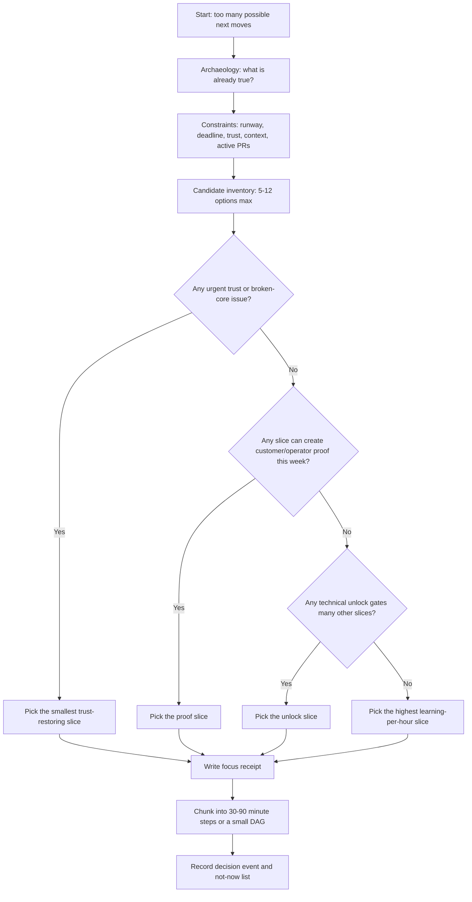

# Product Roadmap Focus

Use this skill when everything feels important. Its job is to force one clear
roadmap commitment, name what is being cut, and leave evidence that future agents
can replay instead of re-litigating the same choice.

This is not a generic backlog grooming skill. It is for ADHD founder/product
work where technical excitement, operator frustration, money pressure, and
multi-agent sprawl all compete for attention.

## Core Rule

The best next task is the smallest visible slice that most increases the odds of
a real user choosing the product again.

If a candidate does not improve operator trust, reduce a current blocker, create
customer proof, reduce existential risk, or unlock many follow-on tasks, it is
probably not "now." It may still be good. Put it in not-now with dignity.

## Decision Flow



## The Seven Lenses

Score lightly. Do not turn this into spreadsheet theater. Use 0, 1, 2, 3.

| Lens | Ask | High score means |
|---|---|---|
| Operator trust | What is currently making the product feel fake, scary, or unusable? | Fixing it makes the product credible today. |
| Customer proof | Does this produce screenshots, transcripts, demos, revenue, or user feedback? | A human can react to it this week. |
| Money/risk | Does this reduce burn, avoid waste, or improve the path to paid use? | It changes survival odds, not vanity. |
| Technical unlock | Does this unblock several other slices? | Many future tasks get cheaper. |
| Context economy | Does this reduce repeated archaeology or context loss? | Future agents stop relearning the same thing. |
| ADHD fit | Can this be finished in a few visible chunks without shame spirals? | Clear first step, visible progress, low switch tax. |
| Reversibility | Can we undo or revise if wrong? | Cheap to change after learning. |

Default formula:

```text
focus_score = trust + proof + money_risk + unlock + context_economy + adhd_fit + reversibility
switch_tax = active_contexts_touched + number_of_agents_needed + unclear_acceptance_gates
choose highest focus_score with tolerable switch_tax
```

If two choices tie, choose the one with the strongest operator-visible proof.

## Roadmap Focus Receipt

Every prioritization pass ends with this receipt. Use
`templates/roadmap-focus-receipt.md` for a copyable version.

```text
Decision:
Now:
Why now:
Evidence:
Not now:
Cut/suspend:
First visible proof:
Acceptance gate:
Kill/revisit trigger:
Owner:
Review date:
```

The not-now section is critical. ADHD systems fail when every good idea stays
half-alive. Cutting, parking, or deferring is an act of care.

## Agent Split Rule

Stay single-agent when:

- the slice has one owner and one acceptance gate;
- the change touches one subsystem;
- context transfer would cost more than the work;
- the user needs a coherent product judgment.

Split into a DAG or multiple agents when:

- archaeology, design, implementation, and review can progress independently;
- there are 3 or more genuinely parallel evidence-gathering paths;
- a human approval gate is needed before expensive or irreversible work;
- different agents can produce falsifiable artifacts, not just opinions;
- file/worktree boundaries are clean enough to avoid merge contention.

Never split just because more agents feels powerful. Split when the graph reduces
time-to-proof or raises review quality.

## Event Log Shape

Product decisions should be append-only. A changed mind is not a contradiction;
it is a new event with better evidence. Read `references/decision-event-schema.md`
when implementing daemon routes, pd-console panes, or roadmap projections.

Minimum events:

- `RoadmapCandidateObserved`
- `RoadmapConstraintRecorded`
- `RoadmapFocusChosen`
- `RoadmapItemDeferred`
- `RoadmapFocusRevised`
- `RoadmapProofAttached`

The current roadmap view is a projection. The decision event log is the source of
truth.

## Anti-Patterns

### Shiny Criticality Inflation

Everything sounds existential because the idea is exciting. Detection: the task
has no user-facing proof, no current blocker, and no acceptance gate. Fix: move it
to not-now and choose the proof slice.

### Architecture Before Trust

The team designs a perfect substrate while the operator still cannot see a live
agent, transcript, file diff, or recovery path. Fix: prioritize the smallest
operator-trust proof before the grand architecture layer.

### Eight Open Loops Day

The roadmap has many active threads and no visible finish. Detection: more than
two active contexts require working memory at once. Fix: choose one now, one next,
and explicitly suspend the rest.

### Hidden Runway

The work ignores money, time, or energy constraints because they feel stressful.
Fix: name the constraint in the receipt. This is not financial advice; it is
product survival awareness. Escalate real financial planning to a qualified
professional.

### Decision Amnesia

Agents revisit the same priority argument every week. Fix: write a focus receipt
and append a decision event. Future agents may revise it only by citing new
evidence.

## Worked Example: Port Daddy Control Panel

Situation:
  The website can talk about harnesses, but the operator still cannot reliably
  see live transcripts, active sessions, model identity, files touched, and
  interrupt controls inside pd-console.

Candidates:

- more marketing art;
- Cloudflare marketplace;
- transcripted compliant Agent Node;
- mobile app;
- public skill sharing.

Decision:
  Now: transcripted compliant Agent Node in pd-console.

Why:
  It restores operator trust, creates demo proof, unlocks compliance testing,
  reduces repeated archaeology, and makes every later page less speculative.

Not now:
  Marketplace, broader federation, and new art unless needed to explain the
  actual working control panel.

Acceptance gate:
  A local Codex or Claude Code body and a Cloudflare body appear in pd-console
  with transcript, stream state, model/tier, files touched, controls, and a saved
  receipt.

## Quality Gates

- [ ] The selected now item has one visible proof artifact.
- [ ] The not-now list names at least three tempting things being cut or parked.
- [ ] Acceptance gate is binary enough that another agent can verify it.
- [ ] First step is under 90 minutes.
- [ ] Context switch count is named.
- [ ] A revisit trigger exists.
- [ ] If work is split, every agent has a distinct artifact and file/worktree boundary.
- [ ] A focus receipt or decision event is left in durable project memory.

## Activation Tests

Should activate:

- "What is the most important thing to work on next?"
- "Prioritize this roadmap and tell me what to cut."
- "Which MVP slice should we ship first?"
- "Should this be one agent or a DAG?"
- "Everything feels urgent; pick the next Port Daddy control-panel slice."

Should not activate:

- "Implement the already-selected `/agents` route."
- "Run the test suite."
- "Write CSS for this specific button."
- "Explain CQRS in general."
- "Give me personal investment advice."

## References

- `references/decision-event-schema.md` - Load when implementing roadmap event
  storage, projections, APIs, or pd-console priority panes.
- `templates/roadmap-focus-receipt.md` - Use when leaving a note, PR comment, or
  roadmap decision artifact.
