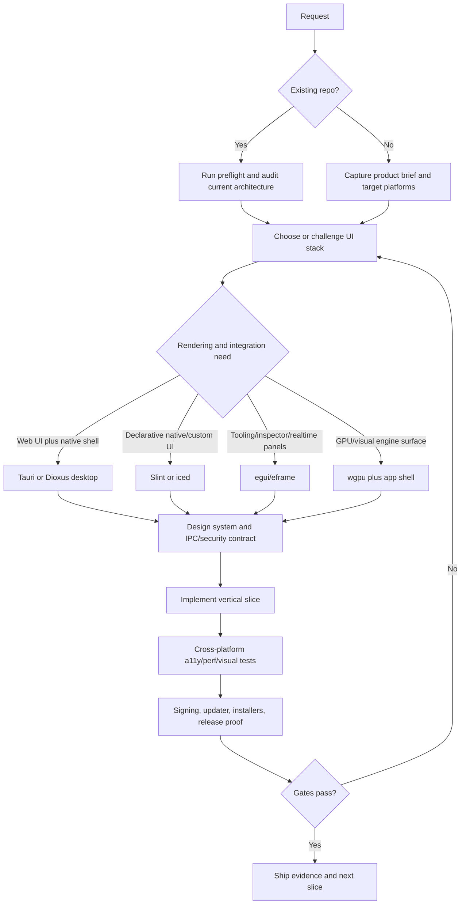

# Rust Desktop App Builder

Build Rust desktop apps that feel native, gorgeous, secure, fast, and shippable on macOS, Windows, and Linux.

## When To Use

Use for:
- New or existing Rust desktop apps where the user expects a premium product, not a demo shell.
- Choosing among Tauri 2, Dioxus desktop, Slint, egui/eframe, iced, wgpu, or a hybrid architecture.
- Desktop apps with native menus, tray, shortcuts, auto-update, signing, notarization, installers, local data, offline behavior, or hardware/filesystem access.
- Design passes where "modern" means desktop-native hierarchy, dense ergonomics, buttery motion, precise typography, cross-platform polish, and real screenshots.
- Audits of Rust GUI apps for security, IPC scope, accessibility, performance, release readiness, or platform fit.

NOT for:
- CLI-only Rust tools, server services, mobile-only apps, game engines, or web-only sites.
- One-off GUI sketches where the user explicitly wants speed over production rigor.
- Copying native OS chrome without testing the actual OS behavior.
- Choosing a framework from popularity alone.

## Operating Rules

- Pick the UI stack from product constraints first: security boundary, rendering model, accessibility needs, OS integration, bundle size, team skills, and release channel.
- If the user asks for "hot", translate that into measurable surface quality: first meaningful paint, input latency, density, typography, motion, focus treatment, high-DPI fidelity, platform affordances, empty/error states, and installer trust.
- Do not flatten macOS, Windows, and Linux into one fake-neutral skin. Build a coherent core design language, then adapt menus, shortcuts, window controls, typography, notifications, file dialogs, and release packaging per platform.
- Treat WebView apps as privileged local apps, not websites. Define IPC commands, capabilities, CSP, local file scope, remote-content policy, and updater signing before shipping.
- Do not block the UI thread. Heavy Rust work belongs in async tasks, worker threads, command queues, or incremental render/update loops with cancellation and progress.
- Ship with evidence: screenshots on all target OSes or explicitly noted gaps, cross-platform build matrix, a11y checks, perf budgets, signing/updater status, and release artifacts.

## Preflight

Run this before architecture or release decisions depend on the current repo:

```bash
skills/rust-desktop-app-builder/scripts/preflight.sh .
```

For a deeper static audit:

```bash
python3 skills/rust-desktop-app-builder/scripts/audit_rust_desktop_app.py .
```

## Core Process



## Required Contract

Before large implementation, produce or update:

- Product brief: jobs, target OSes, offline model, data sensitivity, hardware/system integration, and release channel.
- Framework decision record: chosen stack, rejected stacks, risks, migration cost, and platform-specific consequences.
- Desktop design system: density, window layout, typography, color roles, icons, materials, titlebar/chrome strategy, keyboard model, command palette, drag/drop, context menus, and motion rules.
- Architecture map: Cargo workspace, UI layer, core domain library, IPC boundary, async/task model, persistence, settings, logging, crash reporting, and update channel.
- Security/privacy packet: local file scope, permissions/capabilities, CSP or renderer isolation, remote-content policy, secrets, telemetry, sidecars, updater signatures, and data retention.
- Verification matrix: fmt, clippy, tests, screenshot/video review, high-DPI/fractional scaling, keyboard-only flow, screen-reader or accessibility-tree checks, perf budget, installers, signing, and rollback/update proof.

## Framework Shibboleths

- Tauri 2 is for polished WebView UI plus Rust system integration; its power comes with IPC and capability discipline.
- Dioxus desktop is Rust-first and WebView-backed; browser APIs are not automatically available even though the renderer is a WebView.
- Slint is strong for custom, declarative, product-grade UIs where Rust logic and designed components should travel across desktop and embedded/mobile-adjacent surfaces.
- egui/eframe is immediate-mode and excellent for tools, inspectors, telemetry panels, visualization controls, and fast native utility apps; it needs taste and structure to avoid "debug panel forever".
- iced is attractive when an Elm-style update loop, type-safety, async subscriptions, and native widgets are more important than web ecosystem reuse.
- wgpu is a rendering substrate, not an app framework. Use it when the primary product value is custom graphics, visualization, simulation, canvas, or GPU compute.

## Anti-Patterns

### Framework Beauty Contest

Novice: "Tauri is popular, so it is the best Rust desktop choice."

Expert: Choose from constraints. A WebView shell, immediate-mode tool, declarative native UI, Elm-style native app, and GPU surface have different risk envelopes.

Timeline: Since Tauri 2 and Dioxus 0.7, desktop Rust choices are no longer "Electron alternative or nothing"; the right answer is often stack-specific.

### Web App In A Trench Coat

Novice: Port a responsive website into a desktop window and call it native.

Expert: Desktop apps need menus, shortcuts, window behavior, file dialogs, drag/drop, tray, OS notifications, high-DPI detail, offline states, and platform release trust.

### IPC Is A Public API

Novice: Expose broad Rust commands to the frontend and rely on TypeScript discipline.

Expert: Treat every renderer call as hostile input. Scope commands, validate payloads, constrain paths, deny by default, and keep secrets in Rust.

### Pretty First Screenshot

Novice: Tune the first viewport until it looks expensive.

Expert: Verify resize, keyboard, screen reader names, loading, empty, error, offline, update, installer, crash, and long-running task states.

### Cross-Platform Means Identical

Novice: Force one chrome, font, shortcut map, and release flow onto all operating systems.

Expert: Keep product identity coherent while adapting per OS. Native trust often lives in small details.

## References

Load only the file that matches the current decision:

| File | Consult When |
|------|--------------|
| `references/INDEX.md` | Choosing which deep reference to open |
| `references/framework-selection.md` | Selecting or challenging Tauri, Dioxus, Slint, egui, iced, or wgpu |
| `references/visual-inspiration.md` | Pulling in current high-taste Rust desktop examples, screenshots, templates, and tutorials |
| `references/visual-design-system.md` | Making the app modern, beautiful, native-feeling, and visually disciplined |
| `references/architecture-and-state.md` | Designing Cargo layout, state flow, IPC, async work, persistence, and OS integration |
| `references/security-privacy-packaging.md` | Handling capabilities, updater signing, notarization, installers, telemetry, and local data |
| `references/performance-accessibility-testing.md` | Setting budgets and proving cross-platform quality |
| `templates/rust-desktop-plan.md` | Starting an implementation or rehabilitation plan |
| `templates/framework-decision-matrix.md` | Recording a framework choice with explicit tradeoffs |
| `templates/release-checklist.md` | Preparing a user-visible desktop release |
| `examples/expected-output.md` | Matching the expected final handoff style |
| `examples/rust-desktop-inspiration-board.html` | Opening a visual board of current Rust desktop app and framework inspiration |
| `examples/premium-tauri-slice.md` | Seeing a concrete Tauri vertical slice |
| `examples/native-egui-slice.md` | Seeing a concrete egui/eframe native slice |
