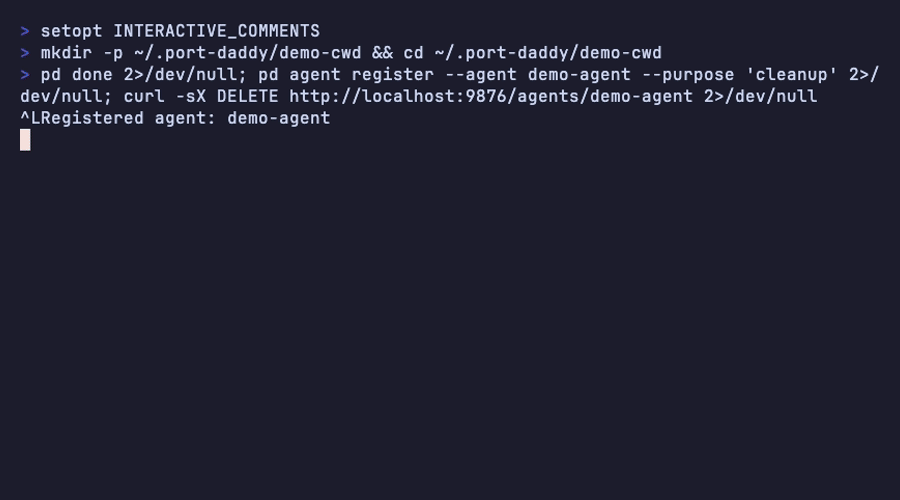
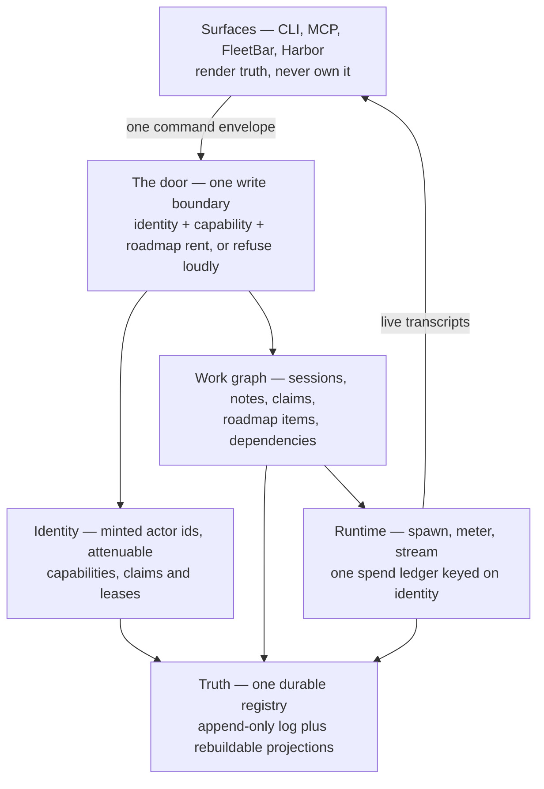

<!-- pd:version 3.28.2 -->
# ⚓ Port Daddy

Run a fleet of coding agents on one machine without them destroying each other's work.

[](https://npmjs.com/package/port-daddy)
[](https://github.com/curiositech/port-daddy/actions/workflows/ci.yml)
[](LICENSE)



Point ten agents at one repository and they race. Two of them bind port 3000. Two of them
rewrite the same function. One runs out of context mid-task and takes everything it knew
with it, and the agent you start next has no idea any of it happened.

Port Daddy is a daemon that runs on your machine and holds one durable record of who is
doing what. Agents ask it for ports and get stable ones. They announce which files they are
about to edit, and find out when someone else got there first. They leave an append-only
trail, so when one dies the next one can pick the work up instead of starting over. Every
mutation — a port claim, a commit, a spawned subagent, a control command — goes through one
enforced boundary that checks who you are and what you are allowed to do, or refuses out
loud.

It is for you if you run more than one agent at a time, or one agent for long enough that
losing its context hurts. If you run a single short-lived agent, you do not need this yet.

## Install

```bash
# readme-verify: skip — package managers, not verifiable in CI
brew install curiositech/tap/port-daddy   # macOS
npm install -g port-daddy                 # anywhere with Node 20+
```

Then wire everything up once:

```bash
# readme-verify: skip — mutates the host: launchd, editor configs, git hooks
pd setup
```

`pd setup` starts the daemon under launchd, writes MCP configuration for whichever editors
it finds (Claude Code, Claude Desktop, Cursor, Windsurf, Gemini, Cline), installs the agent
skill, and offers to install FleetBar, the macOS menu-bar app.

## Quick start

Claim a port. The same identity always gets the same port, so you can stop hardcoding them:

```bash
# readme-verify: run
$ pd claim myapp
3178
```

Use it:

```bash
# readme-verify: skip — illustrative; runs your project's dev server
PORT=$(pd claim myapp -q) npm run dev -- --port $PORT
```

Check on the daemon whenever you want to know what is actually true:

```bash
# readme-verify: run
$ pd status
Port Daddy is responsive (healthy)
  Version: 3.28.2
  PID: 94208
  Uptime: 11m
  Active ports: 80
  Control plane: converged — launchd, /health, daemon.pid, daemon.port, and Bosun heartbeat agree
  Fleet: 0 project(s), 0 agent(s)
```

`pd learn` walks through the rest interactively. `pd demo` runs a scripted tour.

## How it works

One daemon owns the truth. Everything else is a projection of it.



Three consequences follow from that shape, and they explain most of the product:

**Nothing gets to write behind the daemon's back.** Not the CLI, not an MCP tool call, not
a spawned agent, not a `git commit`. If a mutation cannot name who is making it and show
that it is entitled to, it fails — and it says why.

**Every surface is disposable.** FleetBar, the console, the CLI, the MCP server: none of
them hold state. Kill any of them and the fleet keeps running. Reopen it and it shows you
the same truth.

**Dead agents leave salvage, not wreckage.** Sessions and notes are append-only, so a crash
is a handoff rather than a loss.

The full six-plane model is in
[the coarsened architecture](docs/architecture/PORT-DADDY-COARSENED-ARCHITECTURE.md).

## The coordination loop

This is the whole daily protocol. Five verbs.

```bash
# readme-verify: surface
pd begin "Fix flaky auth tests" --lifecycle durable --roadmap auth-hardening
pd note "Scope: lib/auth.ts. Assumption: JWT lib stays. Validation: npm test"
pd session files add lib/auth.ts    # announce what you are about to edit
pd add lib/auth.ts                  # claim-aware git add; refuses files others hold
pd done "Auth fixed; tests green. PR opened: https://github.com/curiositech/port-daddy/pull/143"
```

Three things about that loop are enforced rather than suggested, and they are the reason
the trail is worth reading later.

`--lifecycle` is required. `durable` means the session outlives the process, so a crash
leaves salvageable work; `ephemeral` means heartbeat-bound, and the session ends when the
process does.

Every session says where it sits on the roadmap — `--roadmap <slug>` to link an existing
item, `--roadmap-new "<title>"` to create one, or `--sidequest "<reason>"` to state that
this is deliberately off-roadmap. One line, at the start, instead of an argument at review
time.

Every session ends with a receipt. `pd done` refuses a result note that does not say where
the work landed: a PR URL, `no-pr-yet: <reason>`, or `not-applicable: <reason>`. It also
refuses a branch with no upstream, because work nobody can fetch is not finished work.

When you come back from a break:

```bash
# readme-verify: surface
pd look --since 30      # what happened in the last 30 minutes
pd attention            # what other agents queued for you
pd salvage --project myapp   # work left behind by agents that died
```

And when an agent does die, its successor inherits rather than restarts:

```bash
# readme-verify: surface
pd salvage claim dead-agent-99   # inherit its session, claims, and notes
pd takeover <old-session-id>     # successor session with recorded lineage
```

More recipes: [the coordination cookbook](docs/patterns/coordination-cookbook.md).

## What you get

Every verb prints its permission tier in `pd help`. `silent` is read-only; `notify` mutates
your own state; `approval` affects other agents; `destructive` releases someone else's
resources and prompts before it does. The registry that decides this is
[`cli/permission-tiers.ts`](cli/permission-tiers.ts) — when this table and that file
disagree, the file wins.

| What you want | Verbs | Depth |
|---|---|---|
| **Ports and services** — stable ports from semantic identities, dependency-ordered startup | `claim` `release` `find` `list` `ps` `services` `url` `env` `ports` `scan` `projects` `dns` `wait` `watch` `integration` | `pd help ports` |
| **Sessions, notes and claims** — the append-only work trail | `begin` `done` `note` `notes` `say` `session` `sessions` `takeover` `files` `who-owns` `plan` `snapshots` | [cookbook](docs/patterns/coordination-cookbook.md) |
| **Situational awareness** — what is happening, and what to do before you edit | `status` `whoami` `look` `sitrep` `briefing` `history` `activity` `log` `changelog` `metrics` `advise` `preflight` `compass` | `pd help advisor` |
| **Messaging** — channels, threaded pipes, direct mail, external triggers | `pub` `sub` `broadcast` `tube` `channels` `inbox` `send` `sent` `webhook` `tunnel` | [`pd tube` tutorial](docs/tutorials/pd-tube.md) |
| **Locks and shared memory** — mutual exclusion, tuple space, ambient signals, semantic recall | `lock` `unlock` `locks` `with-lock` `tuple` `pheromone` `graph` `memory` `skill-graft` `harbor` `harbors` | `pd help semantic` |
| **Agents and delegation** — spawn work, run declarative fleets, bridge harnesses | `agent` `agents` `swarm` `spawn` `spawned` `work` `fleet` `backend` `squid` `roster` `actor` `actors` `hooks` | [delegation modes](docs/DELEGATION-MODES.md) |
| **Money and limits** — every spawn escrows a bond; the budget guard pauses and asks rather than overrunning | `wallet` `bond` (plus the arbiter and `fleet panic`) | [ADR-0060](docs/adr/0060-daemon-fleet-conductor.md) |
| **Observability** — golden signals and cost, over HTTP | `metrics` (`GET /metrics/golden`, `/metrics/cost`) | [`docs/openapi.yaml`](docs/openapi.yaml) |
| **Recovery** — inherit dead agents' work, snapshot and roll back the registry | `salvage` `resurrection` `backup` `restore` | [ADR-0037](docs/adr/0037-pd-backup-durable-snapshots.md) |
| **Daemon and host** — supervision, health, secrets, host safety | `setup` `start` `stop` `restart` `install` `daemon` `dev` `use` `mcp` `upgrade` `self-update` `doctor` `diagnose` `ci-gate` `attest` `health` `safe` `secret` `config` | [daemon and supervision](docs/operations/daemon-and-supervision.md) |
| **Learning** | `learn` `tutorial` `demo` `help` | `pd learn` |

Two of these are worth calling out because they are not what you would guess from the name.

**`pd doctor` and `pd attest` disagree on purpose.** `doctor` grades every check `ok`,
`warn`, or `critical`, and only a critical fails the exit code — so `pd doctor --ci` is safe
to wire into a build. `attest` is the honest self-report: it runs the invariant registry and
reports `PASS`, `FAIL`, `SKIPPED`, or `UNKNOWN` per invariant, and it always tells you what
it could *not* verify. "All good" from `attest` means every checked invariant passed, and
names the ones it did not check.

**`pd safe` guards the host, not the daemon.** It scans for plaintext secrets, moves them
into the OS keychain, and checks the staged diff at commit time.

## Surfaces

None of these own state. All of them render the same truth and submit through the same door.

- **FleetBar** — the macOS menu bar. Ambient awareness: who is running, what is contended,
  what is burning money. Its window is the Control Center.
- **Harbor** (`pd-console`) — the GPU-native operator console, and the editor this project
  is building toward: an IDE where humans and agents are co-equal replicas in the buffer,
  with agents subordinate through the same governance plane as everything else — claims,
  bonds, guard, articles of agreement.
- **Scout** — the Chrome extension and FleetBar intake for visual tasks: screenshot a bug,
  add a note, and it becomes a reviewable work item with the DOM context attached.
- **CLI and MCP** — the automation adapters. The MCP server exposes the coordination
  primitives as tools to any client that speaks it; `pd mcp` prints the config.

Every MCP tool result passes an output governor before it reaches the caller, so no tool
result can overflow a harness's context window. Set `PD_MCP_MAX_OUTPUT_CHARS` to change the
budget.

## Documentation

**Learning** — `pd learn` (interactive), `pd tutorial`, and
[`docs/tutorials/`](docs/tutorials/).

**Doing** — [the coordination cookbook](docs/patterns/coordination-cookbook.md) for common
swarm shapes; [delegation modes](docs/DELEGATION-MODES.md) for choosing between `spawn`,
`agent`, `sortie`, and `fleet`; [daemon and supervision](docs/operations/daemon-and-supervision.md)
for launchd, Bosun, and keeping the daemon alive.

**Looking up** — `pd help <topic>`, generated from the same registry the CLI dispatches on.
[`docs/openapi.yaml`](docs/openapi.yaml) is the HTTP contract.

**Understanding** — [the coarsened architecture](docs/architecture/PORT-DADDY-COARSENED-ARCHITECTURE.md)
is the model of record. [`docs/adr/`](docs/adr/) holds the decision history.
[`docs/SECURITY_SOUNDNESS.md`](docs/SECURITY_SOUNDNESS.md) states what is and is not
defended. The white papers — *The Anchor Protocol* and *The Bonded Commons* — are at
[portdaddy.dev/whitepaper](https://portdaddy.dev/whitepaper).

**Where it is going** — [`docs/ROADMAP.md`](docs/ROADMAP.md), and `pd roadmap` for the live
one. The arc is a code of the sea for agents beyond one machine: a separate-UID enforcement
broker, one substrate synced across machines, and encrypted peer coordination between
remote instances.

## Development

```bash
# readme-verify: skip — requires a clone and a full toolchain
git clone https://github.com/curiositech/port-daddy
npm install
npm run dev          # daemon + website
npm test
```

The control plane is held to zero test failures. CI enforces version consistency across
every distribution surface, surface parity for new CLI verbs (`npm run parity`), that the
compiled binaries actually run, ProVerif and Kani proofs for the protocol and kernel
invariants, and that this file's examples still match the CLI:

```bash
# readme-verify: skip — the gate that checks this file
node scripts/check-readme-accuracy.mjs
```

Start with [CONTRIBUTING.md](CONTRIBUTING.md). Every PR is held to the contract in
[AGENTS.md](AGENTS.md): a real summary, a non-trivial test plan, visual evidence for visual
changes, tests for new code, and a `CHANGELOG.md` entry. An adversarial reviewer runs on
every PR and posts a `SHIP` / `SHIP-AFTER-FIX` / `DO-NOT-SHIP` verdict.

Questions and bugs: [the issue tracker](https://github.com/curiositech/port-daddy/issues).

## License

FSL-1.1-MIT — free for development and internal use, see [LICENSE](LICENSE).

Built by [Erich Owens](https://github.com/erichowens) at [curiositech](https://curiositech.ai). 🚩
