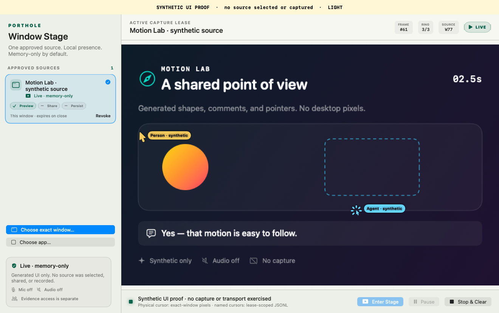
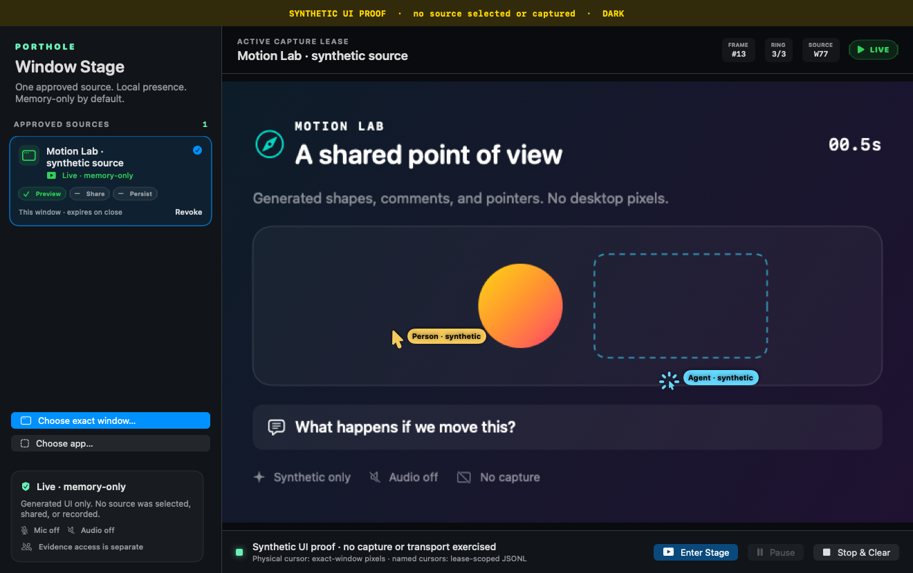

# Native Stage presentation evidence · 2026-09-02




Motion: [light, three seconds](stage-light-synthetic.mov) ·
[dark, three seconds](stage-dark-synthetic.mov).
Alternate phases: [light at 0.5 seconds](stage-light-12.png) ·
[dark at 2.5 seconds](stage-dark-60.png).

## What this proves

These are native SwiftUI `StageView` renders through an inert presentation model,
not HTML mockups or desktop screenshots. Generated shapes, two named pointers,
a selection outline, a clock and comments change across 72 frames per appearance.
Both movies were decoded back: 72 video frames, 1320×830 pixels, no audio.
The logical canvas is 1320×830 points; PNGs and movies use one pixel per point.
The [manifest](synthetic-ui-manifest.json) records each artifact's dimensions,
byte count and SHA-256 digest.

The separate command runs before any capture controller, Keychain lookup,
picker, native window or cursor reader is constructed. It uses offscreen AppKit
view rasterization and generated media. No system capture API, operator window,
input injection, or screenshot-automation permission was used.

## What this does not prove

No source was actually approved, selected, captured, shared or recorded. The
displayed source, permission labels, live state, pointers and comments are
synthetic presentation data. This does not prove Screen Recording consent,
background capture, real local/agent cursor transport, control authority,
production signing, notarization or distribution. Those remain separate gates.
The manifest explicitly marks these claims false; no capture receipt is emitted.

## Provenance and reproduction

- Source commit: `ab587cf801e482c60b07201f5b9c6e6f66464e4d`.
- Debug executable SHA-256: `3c2fcfcbceb76d0e93857348a78faff372420fa44d577ae0988b9570540f1636`.
- Responsible successor actor: `01M1HHA9PT76GHGKMVP18QCHE3`.
- Session: `session-finish-native-porthole-stage-review-bounded-stop-71757a2ee97a`.
- Publication lineage: [PR #9992](https://github.com/curiositech/port-daddy/pull/9992),
  preserving public source authors and the original hardening commit.

At that source commit, run `swift build` in `apps/porthole-stage-capture`, then:

```sh
.build/debug/PortholeStageCapture \
  --render-synthetic-proof "$HOME/coding/tmp/porthole-new-synthetic-proof"
```

The destination must not exist. Movie bytes can differ across toolchains or
encoding runs; each run receives its own integrity manifest. The tests verify
decoded frames and dimensions, not cross-toolchain video-byte reproducibility.

Verification at the source commit: 55 Swift tests; 13 Python integration/render
tests against both debug and release binaries; two strictly verified ad-hoc app
packages assembled into byte-identical archives. Those archives were labeled
non-production and had SHA-256
`ab1c0bfbd2aee781bb5b289c7935a98730684f45e73d006196fb9b0a6784b550`.
That is deterministic assembly from one compiled payload, not reproducible builds
across machines and not a production release receipt.
