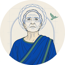
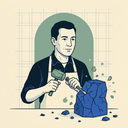

# Fleet Ship Roster

The fourteen ship-avatar personae of the Port Daddy fleet. These are the **faces**
that appear on GitHub PR comments (`pd-code-reviewer[bot]`, etc.), in the PD
dashboard, and anywhere a ship speaks.

Visual DNA: cobalt `#003fb8`, deep teal/sage `#006b5f`, cream `#f2eee6`, near-black
`#1f1f1f`. Style: flat editorial illustration with an architectural-blueprint
sensibility — confident linework, halftone shading, no painterly rendering. Each
ship is **a character**, not a logo. When you see all fourteen in a row you can
tell them apart at thumbnail size.

> Render the avatars below at `./<ship>/avatar-128.png` or `./<ship>/avatar-512.png`.
> The repo also ships `avatar-64.png` for inline chip / mention use.

## Critical Family — the honest ones

| | Ship | Personality |
|---|---|---|
|  | **code-reviewer** | Opinionated senior eng with the operator's priors. Carries the weight of every ADR. |
|  | **red-team** | The honest adversary. Looks for what could go wrong. Civil but not cuddly. |
|  | **tautology-sniffer** | The unsentimental copyeditor of tests. Suspicious of green ticks. |
|  | **augur** | Diviner who reads contradictions in plans. Predicts future bugs. |
|  | **qa** | Post-commit smoke-tester. Boring, deterministic, useful. |

## Generative Family — the productive ones

| | Ship | Personality |
|---|---|---|
|  | **test-author** | Patient craftsperson. Writes the tests you knew you needed. |
|  | **spark** | Idea spotter. Lights up when a pattern surfaces. |
|  | **spider** | External crawler. Brings news from outside the harbor. |

## Observational Family — the cartographers

| | Ship | Personality |
|---|---|---|
|  | **tenderfoot** | Fresh-eyes new developer. Hopeful, asks dumb questions, finds real lies in docs. |
|  | **test-hunter** | Coverage cartographer. Maps gaps. |
|  | **cartographer** | Roadmap mapmaker. Sees the project as a territory. |

## Maintenance Family — the tenders

| | Ship | Personality |
|---|---|---|
|  | **gardener** | Quiet, methodical. Tends git history like a garden. |
|  | **documentarian** | Scribe. Watches code–doc drift. |
|  | **simplifier** | Refactor monk. Cuts what can be cut. |

---

## File map

```
assets/ship-avatars/
├── ROSTER.md                       # this file
├── augur/
│   ├── avatar-512.png              # primary, GitHub-bot size
│   ├── avatar-128.png              # dashboard chip
│   └── avatar-64.png               # inline mention chip
├── cartographer/{512,128,64}
├── code-reviewer/{512,128,64}
├── documentarian/{512,128,64}
├── gardener/{512,128,64}
├── qa/{512,128,64}
├── red-team/{512,128,64}
├── simplifier/{512,128,64}
├── spark/{512,128,64}
├── spider/{512,128,64}
├── tautology-sniffer/{512,128,64}
├── tenderfoot/{512,128,64}
├── test-author/{512,128,64}
└── test-hunter/{512,128,64}
```

## Provenance

- Generated 2026-05-20 via **Nano Banana Pro** (`gemini-3-pro-image-preview`).
- Palette enforced strictly via prompt preamble — no style-reference image was
  used (none of the canonical brand references existed at the path the operator
  memory expected; we instead encoded the four-color palette as a hard
  constraint in the prompt).
- Generation script: `scripts/ship-avatars/generate_fleet.py`. Re-runnable with
  `python3 scripts/ship-avatars/generate_fleet.py --only <name> --force` to
  regenerate any single ship without touching the others.
- 512×512 is the model output (normalized via Lanczos if returned at a different
  size); 128×128 and 64×64 are Lanczos downscales from the 512.
