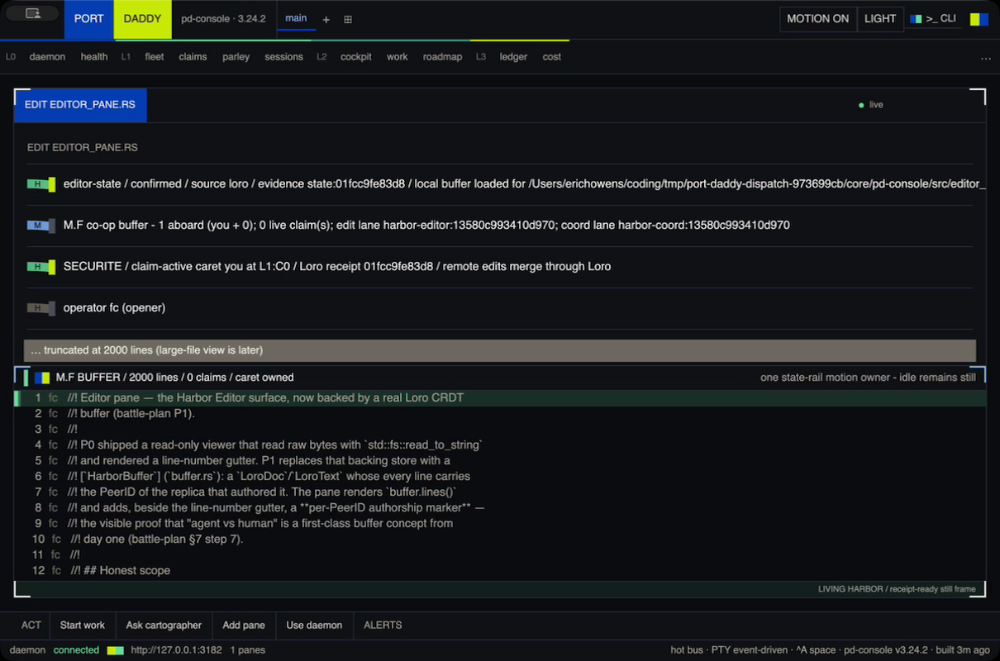
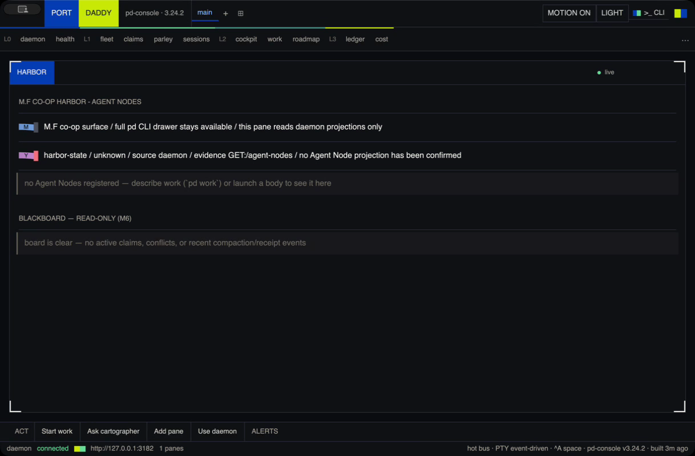
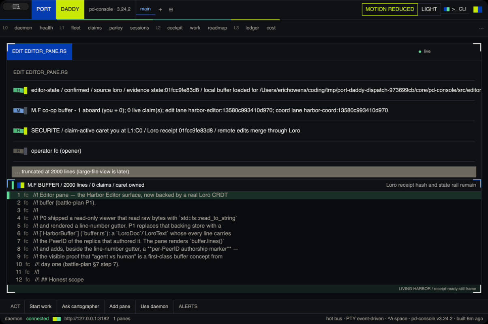

# Harbor editor review-state proof

Native GPUI evidence for the bounded Harbor editor review pass on PR #1960.
Every capture targets the named codebase daemon at `http://127.0.0.1:3182`;
the canonical daemon on `9876` was not targeted.

## Runtime truth

- The branch-local launcher stopped the prior `harbor-linework` profile (PID
  `87972`) and compiled/restarted it from this worktree. No installed Homebrew
  `pd` command was used for the restart.
- Capture daemon: `harbor-linework`, PID `64460`, Port Daddy `3.24.2`, revision
  `33e1aef3c`, port `3182`, plane `ephemeral:harbor-linework`.
- `/health` reports `binaryDrift.drifted: false` and both `runningPath` and
  `onDiskPath` as this worktree's
  `dist/daemon/port-daddy-daemon`; the running/on-disk hashes match.
- Final native app: PID `78390`, `core/target/debug/pd-console`, window `3642`
  on off-operator-screen display selector `2`, focused on `edit editor_pane.rs`.
- `/agent-nodes` returned `data: []` from a non-stale `roster` projection. No
  actors, claims, conflicts, approvals, or collaboration were seeded in the UI.
- The motion recording was driven through the app's real control socket by
  changing between the editor and Harbor panes. It does not inject
  frontend-authored daemon state.
- The reduced-motion image uses the same layout and Loro evidence as the normal
  image; the static `Loro receipt hash and state rail remain` cue preserves
  orientation without running the timed owner.

Machine-readable runtime details and SHA-256 hashes are in
[`runtime-state.json`](./runtime-state.json).

## Stills

- Editor, normal motion: 
- Harbor, empty daemon projection: 
- Editor, reduced motion: 

## Motion

- [Native motion GIF](./editor-motion.gif)
- [Native motion MP4](./editor-motion.mp4)
- [Native ScreenCaptureKit MOV](./editor-motion.mov)

The source MOV is H.264 at `1242x800`, `8.023s`, and contains 220 frames.
Frame hashing found 199 visually distinct frames while the control socket
changed panes, so this is not a static recording or decorative JSON proof.

## Validation represented by this packet

- `cargo test --manifest-path core/pd-console/Cargo.toml --bin pd-console-repl`
  — 377 passed, 0 failed.
- `cargo test --manifest-path core/pd-console/Cargo.toml --test story_motion_contract`
  — 3 passed, 0 failed; it executes the production motion parser and owner
  decision for all eight Harbor/editor policies.
- `CARGO_INCREMENTAL=0 cargo build --manifest-path core/pd-console/Cargo.toml --bin pd-console --features gpui`
  — passed with 126 existing dead-code warnings.
- The GPUI binary-as-test target SIGBUSes in `libgpui_macros`/`syn`; the same
  SIGBUS reproduces at unchanged PR revision `f400336e1`. The application build,
  focused non-GPUI suites, and native runtime proof are green; the inherited
  test-target compiler crash is not represented as passing.
