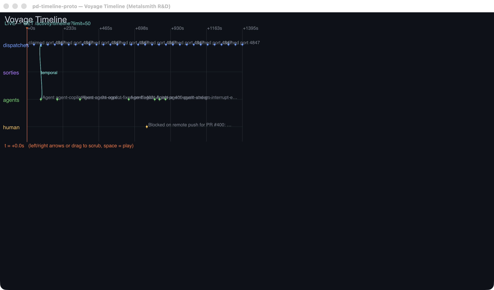

# pd-timeline-proto — Voyage Timeline (Metalsmith R&D)

A **standalone macOS window** that renders a minimal "Voyage Timeline" with
**bespoke GPU vector graphics** ([Vello](https://github.com/linebender/vello))
and **high-quality text** ([Parley](https://github.com/linebender/parley)) — the
Linebender stack. This is **Track B R&D**: it proves the rendering ceiling we'd
reach beyond gpui's widget model. It does **not** touch `core/pd-console` or the
daemon, and it is **excluded** from the `core/` cargo workspace (see
`core/Cargo.toml`) so the Linux `rust-console` CI job never compiles its heavy
macOS GPU deps.



## What it renders

- A horizontal **timeline** with four tracks: `dispatches`, `sorties`,
  `agents`, `human`.
- **Event markers** (dots + blocks) placed by timestamp on their track.
- **Causal threads**: smooth cubic-bezier curves connecting a cause marker on
  one track to an effect marker on another, with arrowheads — the signature
  custom-GPU vector visual.
- **Parley text** for the title, track labels, time-axis ticks, event labels,
  and the data-source banner (real glyph shaping via HarfRust, not bitmap fonts).
- A **playhead** you scrub with the **left/right arrow keys** or by
  **left-dragging**. **Space** toggles auto-play.

## Data

On startup it resolves `PORT_DADDY_URL` or the daemon's published port file, then
does one blocking `GET /activity/timeline?limit=50` against that selected live
daemon and lays those events out (the banner reads `LIVE — …`). If no endpoint
is published or the daemon is unreachable it falls back to a baked, clearly
marked fixture (`FIXTURE — …`). Daemon `type` strings are mapped onto tracks via
a closed-vocabulary `match` (a structured-field dispatch, **not** keyword NLP
over free text).

## Rendering stack & why

| Layer        | Choice                | Why |
|--------------|-----------------------|-----|
| Window/events| `winit` 0.30          | Standard, cross-platform, `ApplicationHandler` model. |
| GPU          | `wgpu` 22 (Metal)     | On macOS wgpu lowers to **Metal** — confirmed at runtime (`backend: Metal, Apple M4 Max`). |
| Vector       | `vello` 0.3           | Compute-based path renderer. This **is** the hand-written GPU vector engine we'd otherwise build in MSL. |
| Text         | `parley` 0.2          | Shaping + layout (HarfRust), glyph runs fed straight into the Vello scene. |
| Geometry     | `kurbo` 0.11          | Beziers, affines, points. |

**Why not pure `objc2-metal`?** You'd be re-implementing Vello's compute
pipeline — anti-aliased path fill/stroke, the coarse/fine rasterizer, the glyph
atlas — by hand in MSL. That's months, not a prototype. winit+wgpu still lands
on Metal, so we keep "bespoke GPU vector rendering" while standing on
Linebender. The pure-Metal tradeoff is documented in the `metal-text-pipeline`
skill (`skills/metal-text-pipeline/`).

## Run it

```bash
cd core/pd-timeline-proto
cargo run --release
# scrub: ← / →   drag: left-mouse   play/pause: space   quit: esc
```

Auto-play (continuous redraw, prints frame timing) for benchmarking:

```bash
PD_TIMELINE_AUTOPLAY=1 cargo run --release
```

## Performance

Measured on **Apple M4 Max** (`backend: Metal`), release build, while the
playhead sweeps continuously:

- **GPU scene build + submit: 0.5–2.1 ms per frame** (typically ~0.6 ms).
- **Frame rate: vsync-limited to the display** (AutoVsync). Unclamped runs
  logged **750–900 FPS**, so the render work has enormous headroom — **120 fps
  ProMotion is trivially sustained** with ~99% of the frame budget idle.

The bottleneck is never the GPU here; it's `present`/vsync. That headroom is the
whole point of the bare-metal path.

## Visual artifacts

- `docs/timeline-window.png` — still of the window, playhead at t=+0s (live data).
- `docs/timeline-scrubbed.png` — playhead scrubbed to ~+500s via arrow keys.
- `docs/timeline-scrub.mov` — short screen recording of the playhead sweeping.

Regenerate them with:

```bash
./scripts/capture.sh
```

The helper uses `screencapture -l<CGWindowID>` to grab only this window
regardless of z-order. If captures come out black, macOS denied Screen
Recording to the calling terminal — re-run from a Terminal granted Screen
Recording in System Settings > Privacy & Security.
