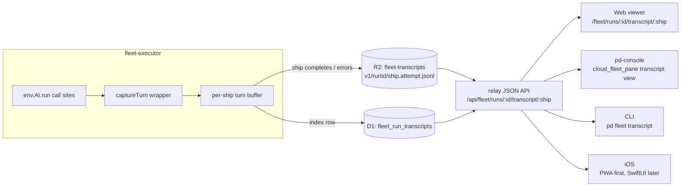

# Fleet Session Transcripts — RFC

**Status**: Proposed
**Audience**: fleet-executor / relay / pd-console / CLI contributors
**Companion surfaces**: the fleet run receipt page (`apps/relay/src/fleet-run-page.ts`), the Shipwright model board, per-ship spend stats

## The gap this closes

The fleet run page is now a real receipt: per-ship model, cost, permissions, prompt
link, PR title and diff, absolute timestamps, cross-generation strip. What it still
cannot show is **the conversation itself** — the raw multi-turn exchange between the
executor and each ship's model. Every `env.AI.run(...)` return value is parsed for a
verdict, summarized into a curated `fleet_run_steps` row, and then dropped on the
floor. When a ship hallucinates (the purser steel-manning files that don't exist),
the only forensic record is whatever the curated step chose to keep.

The receipt answers *what the ship concluded*. The transcript answers *why* — and
today that answer does not exist anywhere durable. AI Gateway logs (when
`AI_GATEWAY_ID` is set) capture request/response bodies, but with capped retention
and truncation; they are a debugging convenience, not a product surface, and they
are invisible to relay, the console, the CLI, and any future mobile surface.

## Design in one picture



Capture once, at the one chokepoint every model call already passes through; store
in one versioned interchange format; let every surface render the same bytes.

## Capture: the call-site inventory

Every model turn in the executor flows through `env.AI.run(model, {messages, ...},
opts)`. The full inventory on current main:

| Call site | Phase label | Notes |
| --- | --- | --- |
| `execute.ts` MAP fan-out (`mapModelFor`) | `map` (chunk i/n) | one call per diff chunk |
| `execute.ts` main ship / REDUCE calls | `main` / `reduce` | the verdict-producing turns |
| `purser.ts` pipeline (`runPurserStep`) | `steelman` / `plan` / `author` / `gate` | the multi-step purser conversation |
| `xo.ts` editor + ideation passes | `xo` / `ideation` | non-blocking curation turns |
| `embedText` embeddings | — | **excluded**: not conversational, high volume, no forensic value |

The capture layer is a wrapper — `runCaptured(ai, model, payload, opts, tap)` —
that the call sites adopt one by one. It records the outbound `messages` array as
`system`/`user` turns and the response as an `assistant` turn (or `error` turn on
throw, before re-throwing so `ai-resilience.ts` circuit behavior is untouched).

**Capture must never fail a run.** Every tap is try/caught; a failed write
increments a dropped-turns counter and marks the index row `incomplete`. The
transcript is evidence, not a dependency.

**System-prompt dedup.** A MAP fan-out sends the same multi-KB system prompt seven
times. The buffer stores each distinct system prompt once per object, keyed by
content hash; repeated turns carry a `sysRef` to it. This is a storage-layer
optimization the viewer resolves transparently.

**Secret scrub.** Prompts are built from repo content, diffs, and ship definitions —
already world-visible inputs — but the writer still runs a scrub pass (GitHub token
prefixes, JWT shapes, `Authorization:` header patterns) before anything touches R2.
Defense in depth, not a substitute for never putting tokens in prompts.

**Resume interplay.** A checkpointed ship that resumes on a retried delivery does
not re-run, so it produces no new transcript — the viewer follows the attempt chain
to the prior attempt's object, exactly as `ship-resumed` steps already do for
verdicts.

## The interchange format: `pd-transcript.v1`

JSONL, one envelope per line, schema-first (this is machine-to-machine payload, not
creative text). Monotonic `seq` per `(runId, ship, attempt)` gives ordering,
permalinks, and range pagination for free.

```json
{
  "v": 1,
  "runId": "run:fc387670-…",
  "ship": "purser",
  "attempt": 1,
  "seq": 7,
  "phase": "plan",
  "chunk": { "index": 3, "count": 7 },
  "kind": "assistant",
  "model": "@cf/…",
  "ts": 1756000000,
  "latencyMs": 8421,
  "usage": { "prompt": 4211, "completion": 512 },
  "costUsd": 0.00113,
  "content": [{ "type": "text", "text": "…" }],
  "sysRef": null,
  "truncated": false
}
```

Format rules (the ones that keep this from rotting):

- **`v` is mandatory** and bumps on any breaking change; readers reject unknown
  majors rather than guessing.
- **`kind` is a closed discriminated union**: `system | user | assistant | error`.
  New kinds are additive minor bumps.
- **`content` is a parts array** (text-only in v1) so images/files can arrive later
  as URI references — never inline base64.
- **Per-turn truncation cap** (256 KB) and per-object cap (~10 MB) with explicit
  `truncated: true` markers. Silent truncation reads as "complete" and poisons
  forensics.
- The same envelope is deliberately adapter-friendly: a Claude Code session JSONL
  or a Codex log can be mapped into `pd-transcript.v1` later, making this the
  fleet-wide transcript format rather than a Workers-AI-only one.

## Storage: R2 for bytes, D1 for the index

- **New R2 bucket `fleet-transcripts`** — binding `TRANSCRIPTS` on fleet-executor
  (write) and relay (read). Object key `v1/{runId}/{ship}.{attempt}.jsonl`, written
  once when the ship completes or errors (flush-what-we-have on error).
- **New D1 table `fleet_run_transcripts`** — `(run_id, ship, attempt)` PK, plus
  `r2_key, turns, bytes, models_csv, prompt_tokens, completion_tokens, cost_usd,
  incomplete, created_at`. The index is what run pages, ship stats, and routing
  ledgers join against; nobody lists R2.
- **Why not D1 for the raw bytes**: individual turns run to hundreds of KB and a
  run to megabytes; `fleet_run_steps` stays what it is — a curated receipt with
  small JSON details. Two stores, two jobs.
- **Retention**: R2 lifecycle expires raw objects at 90 days; index rows live
  forever (they are the outcome ledger). At rough current volume (~40 calls/run ×
  ~60 KB average × ~100 runs/day) steady state is ~20 GB — under a dollar a month.

## Read path: one API, token-gated

Relay grows two routes, both under the run page's existing signed-token scheme
(`?t=v1.…` scoped to the run id — no ambient reads, per the relay zero-trust
doctrine):

- `GET /fleet/runs/:id/transcript/:ship` — the HTML viewer.
- `GET /api/fleet/runs/:id/transcript/:ship.jsonl?attempt=N&from=SEQ&to=SEQ` —
  raw envelopes for the console, CLI, and iOS. The token rides as a query param or
  `Authorization: Bearer`, identically validated.

Relay streams the R2 object through with range-by-`seq` filtering; no copy of the
bytes lands in D1 or KV.

## The four surfaces

**Web viewer (relay)** — the reference implementation. A turn-card timeline: role
glyph, phase chip (`MAP 3/7`, `PLAN`, `GATE`), model + tokens + cost + latency in a
gutter, system prompts collapsed by default and rendered once (dedup-aware),
markdown- and diff-aware body rendering, a raw-JSON toggle per turn, `#t{seq}`
permalinks, j/k keyboard nav, client-side search. Provenance masthead: run id, head
SHA, ship config panel link — the same trust grammar the run page already speaks.
Live tail for a running ship is polling the index row, same cadence the run page
already refreshes at.

**CLI** — `pd fleet transcript <run-id> [ship] [--attempt N] [--raw] [--follow]` in
`cli/commands/fleet.ts`. Default output renders turn cards in the CLI's existing
chrome through the pager; `--raw` emits untouched JSONL for `jq`; `--follow` polls
the same API the web tail uses.

**pd-console (GPUI)** — a transcript view reached from `cloud_fleet_pane.rs`,
fetching the same JSONL API, rendered as a virtualized list reusing the visual
grammar of the existing chat pane. The console adds what the web can't: split view
of transcript beside the PR diff the ship was judging.

**iOS** — no native app exists today (nothing but a Swift calendar helper in
`tools/`). The honest sequence: make the web viewer fully responsive and
PWA-installable first — it ships to every phone the day relay deploys — and treat a
SwiftUI reader over the same JSONL API as a later, demand-driven step. Building a
native app before the API has a second consumer would be scaffolding without a
tenant.

## The flywheel this enables

The index rows are more than navigation. Joined against ship verdicts and
challenge outcomes they become the per-`(ship, model)` outcome ledger the adaptive
routing strategy needs — today's model-tier assignments were calibrated once, by
hand, from spend stats; with transcripts attached to outcomes, "which model should
this ship use" becomes a measured answer that updates itself. The same corpus is
the evidence base when a ship's verdict is disputed, and the raw material for any
future eval harness or fine-tune of a ship's behavior.

## Phasing

| Phase | Ships | Size |
| --- | --- | --- |
| 1 | Capture wrapper + R2 bucket/binding + D1 migration + index rows; run page's per-ship panel links to raw JSONL | the load-bearing slice |
| 2 | Web viewer route + turn-card UI + live tail | biggest UX win |
| 3 | JSON API hardening (ranges, attempts) + `pd fleet transcript` | small once 1–2 exist |
| 4 | pd-console transcript view | independent of 3 |
| 5 | PWA polish; SwiftUI reader only if demanded | mostly free / deferred |

Phase 1 alone converts the run page's "transcript link" from an impossibility into
a link, which is the promise this RFC exists to keep.

## Risks and their answers

- **Leakage**: transcripts contain repo content and model reasoning. Answer:
  signed-token access only, secret scrub on write, 90-day raw retention.
- **Cost runaway**: a pathological run could write huge objects. Answer: hard
  per-turn and per-object caps with explicit truncation markers.
- **Viewer collapse on huge runs**: hundreds of turns × large bodies. Answer:
  `seq`-range pagination in the API, virtualized rendering, collapsed-by-default
  system turns.
- **Capture skew**: a call site added without the wrapper silently disappears from
  transcripts. Answer: a test that walks `env.AI.run` call sites and fails when one
  is untapped — the same discipline `map-reduce-invariants` tests already apply.

## Open questions

1. Should ideation/XO turns (non-blocking, high-volume) be captured by default or
   behind a flag? Leaning: captured, they're cheap and occasionally the evidence.
2. Does the purser's sandbox execution output (when the SANDBOX binding lands)
   belong in the same transcript as `tool_result`-style turns? Leaning: yes, as a
   v1 minor addition — that's exactly what the parts array is for.
3. Token scope: should a run-page token grant transcript access automatically, or
   should transcripts require a distinct scope? Leaning: same token — the receipt
   already shows the sensitive conclusions; the transcript is their provenance.
