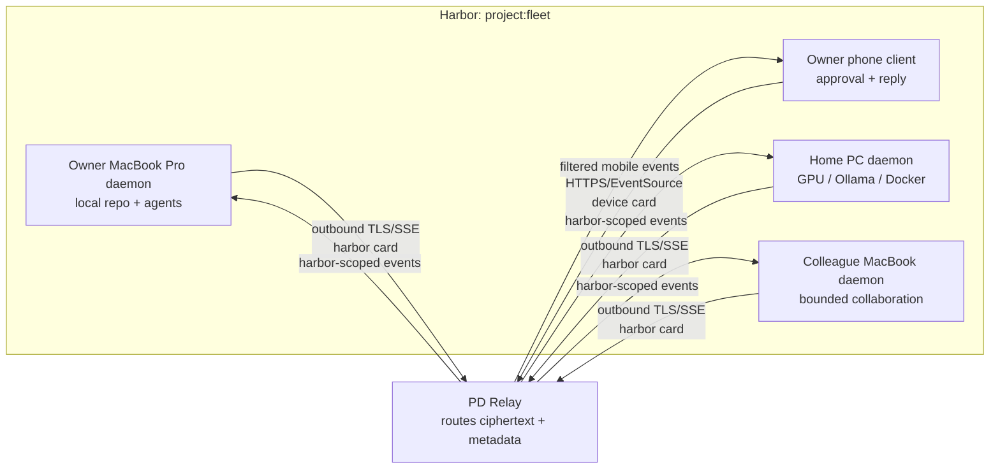
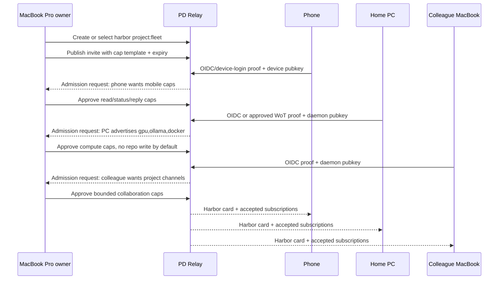

# 0027. Relay Harbor Mesh

## Status

Proposed - 2026-05-06

## Context

Port Daddy has several pieces of the cross-machine story, but they are not yet
one official design:

- `docs/adr/0013-unified-harbor-model.md` defines harbors as named
  coordination scopes.
- `docs/adr/0025-pki-decision.md` defines the relay PKI direction: OIDC-first
  hybrid identity bootstrap, admin-approved WoT for self-hosted/harbor-local
  cases, and ACME later.
- `lib/harbors.ts` ships local harbor rows, membership rows, scoped
  capabilities, channels, member patterns, and Phase 2 harbor-card issuance on
  entry.
- `lib/harbor-tokens.ts` ships current Phase 2 daemon-held Ed25519 harbor cards
  with `hv: 2`, `cap`, `aud`, one-hour default TTL, JTI audit rows, and
  revocation checks. It explicitly defers per-harbor signing keys, attenuation,
  and cross-machine federation.
- `lib/messaging.ts`, `cli/commands/messaging.ts`, and `lib/tube.ts` ship local
  pub/sub over daemon channels, including `pd tube` envelopes and local cursor
  files. `pd tube` is intentionally relay-independent today.
- `lib/tuples.ts`, `cli/commands/tuples.ts`, and MCP tuple tools ship a
  harbor-scoped tuple space.
- `lib/fleet-channels.ts`, fleet hooks, and channel-resolution code already
  distinguish logical channels from project/worktree-scoped physical channels.
- `docs/DAEMON-MESH-ARCHITECTURE.md` describes a heavier pre-implementation
  daemon mesh with leader election, peer discovery, and federated writes.
- `skills/pd-relay-zero-trust/templates/ADR-Relay-Architecture.md` and
  `skills/pd-relay-zero-trust/templates/ADR-V4-Remote-Harbor-Redefinition.md`
  describe the intended relay and remote-harbor shape, but they are templates,
  not accepted ADRs in `docs/adr/`.

The product scenario that needs a decision is smaller and more concrete than a
general database mesh:

> One person has a phone, MacBook Pro, and home PC. A remote colleague joins
> the same harbor from their MacBook. They need coordination signals, fleet
> status, tuples, handoffs, approvals, selected compute requests, and replies to
> move across those devices without exposing raw local daemon state, sharing
> owner credentials, or opening inbound firewall holes.

## Decision Drivers

- Keep local Port Daddy useful when every remote dependency is offline.
- Preserve the harbor as the trust and capability boundary.
- Avoid multi-writer SQLite, cross-device database replication, and implicit
  remote code execution.
- Make phone participation possible without requiring the phone to run a full
  daemon.
- Let a home PC advertise capabilities such as GPU, Ollama, Docker, or a repo
  checkout without giving every harbor member those capabilities by default.
- Treat tuple/channel propagation as event federation, not shared memory with
  hidden global consistency.
- Keep the design compatible with Relay PKI ADR-0025 and current Phase 2 harbor
  cards, while being honest that attenuation, relay transport, and cross-device
  harbor sync are not fully shipped.

## Considered Options

- **Full daemon mesh**: peer daemons discover each other, elect a leader, and
  replicate federated writes.
- **Relay-backed event mesh**: daemons connect outbound to a relay, publish and
  subscribe to harbor-scoped event streams, and keep authoritative state local.
- **Shared cloud database**: every device reads and writes one hosted Port Daddy
  database.
- **Manual export/import only**: users pass files, copied tokens, and chat
  messages between devices with no relay fabric.

## Decision

Adopt a **relay-backed harbor event mesh** as the official recommendation for
phone + MacBook Pro + home PC + remote colleague collaboration.

The mesh is not a replicated daemon database. It is a harbor-scoped event fabric
that propagates selected channel messages, tuples, capability advertisements,
presence, revocations, and explicit request/reply flows between authorized
members. Each daemon remains authoritative for its own sessions, files, locks,
local agents, local notes, local command execution, and local secrets.

The recommended device roles are:

| Device | Role | Authority |
|--------|------|-----------|
| Owner phone | Thin approval and reply surface | Status, inbox, replies, revocation, and explicit approvals; no daemon and no raw filesystem authority by default |
| Owner MacBook Pro | Primary local control plane | Repo-local sessions, file claims, locks, notes, ordinary agent launches, owner approvals, and final publish decisions |
| Owner home PC | Secondary daemon / compute worker | Advertises GPU/Ollama/Docker/checkout resources, accepts only approved request classes, applies local policy before execution |
| Colleague MacBook | Scoped collaborator | Project channels, handoffs, coordination tuples, and bounded request/reply; no owner secrets, owner revocation, or home-PC compute control by default |
| PD Relay | Event gateway | Routes encrypted envelopes, revocations, accepted subscriptions, and chain heads; does not decrypt payloads or expand capabilities |



The design was checked against these Jury-rig skill lenses:

- `agentic-zero-trust-security`: connection is not authority; use scoped cards,
  signed envelopes, revocation, audit, and least privilege.
- `tunnels-for-agents`: prefer outbound-only tunnel/relay connections for NAT
  traversal instead of requiring inbound access to a home network.
- `reverse-proxy-for-agents`: treat the relay as an agent gateway with TLS,
  SSE/EventSource, rate limits, accepted subscriptions, and explicit identity
  headers.
- `always-on-agent-architecture`, `always-on-agent-inputs`, and
  `always-on-agent-safety`: persistent agents need bounded memory/input
  channels, stale/fresh markers, cost gates, data hygiene, and revocation UX.
- `vibe-coding-background-agent`, `cooperative-vibe-coding`, and
  `high-quality-vibe-coding`: background help should be quiet for observation,
  explicit for side effects, worktree-aware, and verifiable before merge or
  publish.

## Recommendation

### Trust Boundary

The harbor is the collaboration boundary. A member is trusted only for the
capabilities in its current harbor card, not for everything its device can do.
The relay is trusted to route and retain metadata under policy; it is not
trusted with plaintext payloads, broad identity assertions, or permission
expansion.

Recommended boundary:

- **Relay may see**: harbor fingerprint, channel name, sender fingerprint,
  sequence numbers, payload size, arrival time, subscription metadata, rate
  limit outcomes, and revocation metadata.
- **Relay must not see**: decrypted note bodies, tuple payload plaintext when
  the tuple is marked confidential, local filesystem contents, local command
  output unless explicitly published, or raw daemon master keys.
- **Daemon remains authority for**: local repo mutations, file claims, locks,
  spawned agents, local notes, local tools, local model credentials, and local
  secrets.
- **Harbor card governs**: allowed publish/subscribe prefixes, tuple patterns,
  capability advertisement, request/response commands, rate limits, maximum
  payload size, expiry, audience, and delegation depth.

This preserves ADR-0025 invariant I7: authentication and authorization stay
separate. Device identity proves who is connecting; capabilities decide what
that device can do.

### Join Flow

Use a two-layer join:

1. **Identity bootstrap**: the joining device or colleague proves identity using
   ADR-0025's OIDC-first hybrid path. Self-hosted/air-gapped harbors may use
   admin-approved WoT. ACME remains a future name-binding proof.
2. **Harbor admission**: an existing harbor administrator approves the member
   and grants a scoped harbor card. Admission records device identity,
   human/account identity, requested capabilities, approved capabilities,
   expiry, and revocation handle.

Recommended flow for the scenario:



No member receives the harbor's full authority by joining. Each member receives
the smallest card that lets it do the approved job. A phone defaults to
read/status/reply/request caps; a home PC may advertise compute capability but
must not accept remote execution unless the card explicitly allows a request
class; a colleague receives project collaboration caps, not local-owner caps.

### Device Identity

Represent identity as two linked records:

- **Human/account identity**: the person or service account proven by OIDC, WoT,
  or future ACME metadata.
- **Device identity**: a stable Ed25519 public key generated on the device and
  registered to the account/harbor membership.

Recommended fields for a future membership table or relay registry entry:

```ts
interface HarborMeshMember {
  harborFingerprint: string;
  accountId: string;
  deviceId: string;
  devicePubkey: string;
  deviceKind: 'phone' | 'laptop' | 'desktop' | 'ci' | 'bot' | 'browser';
  displayName: string;
  proofMethod: 'oidc' | 'acme' | 'wot';
  approvedCaps: string[];
  advertisedCapabilities: string[];
  expiresAt: number;
  revokedAt?: number;
}
```

The display name is never the authority. The device public key plus proof
metadata is the authority. Device loss revokes that device's cards without
revoking the human's other devices.

### Capability Scoping

Use capability strings that are specific enough for UI and policy:

| Capability | Meaning |
|------------|---------|
| `chan:pub:<prefix>` | Publish to matching relay/logical channel prefix |
| `chan:sub:<prefix>` | Subscribe to matching channel prefix |
| `tuple:out:<pattern>` | Write matching tuple kinds into the harbor |
| `tuple:read:<pattern>` | Read matching tuple kinds |
| `tuple:take:<pattern>` | Consume matching tuple kinds |
| `presence:write` | Publish heartbeat/status for this device |
| `cap:advertise` | Publish device capabilities |
| `request:send:<class>` | Ask another member to perform a class of work |
| `request:accept:<class>` | Accept remote requests of a class |
| `handoff:write` | Publish explicit handoff artifacts |
| `revocation:read` | Receive revocation notices |

Default caps for the target devices:

| Member | Default approved caps |
|--------|-----------------------|
| Owner phone | `chan:sub:status:*`, `chan:sub:inbox:*`, `chan:pub:reply:*`, `request:send:low-risk`, `approval:write`, `presence:write`, `revocation:self` |
| Owner MacBook Pro | Owner/editor caps for local project channels and tuples; approval authority for own devices; no automatic authority over PC-only resources |
| Owner home PC | `cap:advertise`, `chan:sub:request:compute:*`, `request:accept:compute`, limited `tuple:out:result:*`, local-only execution gate |
| Colleague MacBook | Bounded project collaboration caps, normally `chan:pub/sub:project:*`, `tuple:out/read:coordination:*`, `handoff:write`, no owner-only revocation/admin caps |

Remote execution is intentionally two-step: a member can request work only if it
has `request:send:*`, and the target device can accept only if it has
`request:accept:*`. The target daemon still applies its local operator policy,
budget limits, model readiness, filesystem claims, and human gates.

### Ergonomic Control Plane

The user-facing flow should be profile based, not capability-string based:

1. The owner opens **Share Harbor** on the MacBook Pro.
2. Port Daddy asks which profile to issue: **Phone**, **Compute PC**,
   **Collaborator**, **CI/Bot**, or **Custom**.
3. The owner sees a plain-language summary of the caps, expiry, retention,
   and what the device cannot do.
4. The joining device scans a QR code or opens a magic link, proves identity,
   and generates its own device key.
5. The relay returns accepted and rejected subscriptions. The MacBook Pro and
   phone both show the joined device with live/stale state, cap summary, and a
   revoke button.

The phone UI should stay card based: who is asking, which device will act, the
exact capability used, expected budget/cost lane, freshness, and approve/reject.
It should not expose a general remote shell by default. Background agents may
publish suggestions, tests, status, and low-risk findings silently; they should
ask before spawning, writing files, spending meaningful budget, accepting remote
compute, opening tunnels, installing dependencies, or publishing to a colleague.

### Tuple And Channel Propagation

The relay mesh propagates events, not database rows. Local channels and tuple
spaces keep their existing semantics. A relay-aware daemon maps eligible local
events into a relay envelope and maps accepted remote envelopes back into local
synthetic events.

Channel recommendation:

- Keep human-readable logical channels such as `git:committed`,
  `request:compute:gpu`, and `status:fleet`.
- Resolve them locally to project/worktree-scoped physical channels as the
  current channel code already does.
- Prefix relay wire channels with the harbor fingerprint:
  `<harbor_fingerprint>:<physical_channel>`.
- Mark imported remote messages with origin metadata so they do not loop back
  into the relay.

Tuple recommendation:

- Propagate only tuple kinds explicitly allowed by `tuple:*` capabilities.
- Preserve `harbor`, `fields`, `writtenBy`, `createdAt`, `expiresAt`, `origin`,
  and a relay sequence/hash.
- Imported tuples are synthetic local tuples only when the receiving daemon has
  a matching subscription and import policy. Otherwise they remain visible as
  relay events but do not mutate the local tuple table.
- `tuple:take` does not become a distributed atomic operation in v0. A remote
  take is modeled as a request event and a local accepted mutation by the daemon
  that owns the tuple.

This keeps tuple/channel federation compatible with current `lib/tuples.ts` and
`lib/messaging.ts` while avoiding false global consistency.

### Offline Behavior

Local work remains first-class:

- If the relay is down, each daemon continues local sessions, local channels,
  local tuples, notes, file claims, locks, and agents.
- Relay-eligible outbound events queue locally with a disk limit, TTL, and
  operator-visible backpressure.
- On reconnect, a daemon resumes from the last acknowledged relay sequence and
  replays queued events whose cards and payload TTLs are still valid.
- Expired cards are refreshed before replay. Events that require expired or
  revoked authority are dropped with an audit event, not silently replayed.
- The phone can show cached read-only status with a clear stale marker, but it
  must not pretend to have live authority while disconnected.
- A home PC can finish already-accepted local work while offline, but remote
  request acceptance and result publication wait for reconnect.

The relay may be required for cross-device liveness, but it must never be
required for a developer to keep using Port Daddy locally.

### Conflict And Failure Modes

| Failure | Expected behavior |
|---------|-------------------|
| Relay outage | Local mode continues; relay queue backs off; UI shows stale remote view and queue depth |
| Device offline | Presence expires; subscriptions stop; no other device assumes ownership of its local locks or files |
| Phone lost | Revoke phone device key and active JTIs; other devices keep their cards |
| Home PC compromised | Revoke PC device and accepted cards; rotate affected channel keys; treat its published results as suspect after compromise window |
| Colleague removed | Revoke colleague devices; rotate harbor/channel keys for future secrecy; existing local records remain audit evidence |
| Duplicate device names | UI disambiguates by device key/fingerprint; display name is cosmetic |
| Channel loop | Imported relay events carry origin IDs; daemon refuses to re-export same origin |
| Tuple conflict | No distributed `take`; conflict surfaces as request denial or explicit `coordination:conflict` event |
| Concurrent request acceptance | Target daemon owns acceptance; requester receives one accepted/rejected result per target |
| Card expiry mid-stream | Client refreshes card; relay rejects stale card; subscriptions resume with last event id |
| Capability mismatch | Relay rejects publish/subscribe; local daemon records exact rejected cap and surface |
| Malicious relay drops events | Subscribers detect stale sequence/head; content remains encrypted |
| Malicious member publishes bad data | Capability/rate limits bound blast radius; consumers validate decrypted payload before local mutation |

## What Is Shipped Today

- Local harbors with scope, members, declared capabilities, channels, expiry,
  and agent patterns in `lib/harbors.ts`.
- Harbor entry that can issue a Phase 2 harbor card when `harborTokens` is
  wired.
- Phase 2 Ed25519 harbor cards in `lib/harbor-tokens.ts`, including versioned
  verification, one-hour default TTL, JTI persistence before issuance, and JTI
  revocation checks.
- Local pub/sub channels in `lib/messaging.ts` and CLI publish/subscribe
  surfaces.
- Local `pd tube` envelopes and cursor behavior in `lib/tube.ts` and
  `cli/commands/tube.ts`.
- Content-addressed local blob storage in `lib/blob.ts`, which can carry larger
  relay/tube artifacts by hash without making the relay inspect their payloads.
- Local harbor-scoped tuple space in `lib/tuples.ts` and tuple CLI/MCP tools.
- Project/worktree-scoped physical channel resolution for fleet and messaging
  paths.
- ADR-0025 relay PKI recommendation.

## What Is Proposed Here

- A relay-backed harbor event mesh as the official path for multi-device and
  remote-colleague collaboration.
- Device membership records linking human/account proof to device public keys.
- Harbor admission and per-device capability templates for phone, MacBook Pro,
  home PC, colleague MacBook, CI, bot, and browser clients.
- Relay wire channels based on `<harbor_fingerprint>:<physical_channel>`.
- Explicit propagation policy for channels, tuples, presence, capabilities,
  handoffs, and request/reply flows.
- Offline queueing, replay, and stale-view behavior.
- Loop prevention and conflict reporting rules.
- A clear non-goal boundary against multi-writer SQLite and full daemon state
  replication.

## What Is Not Yet Shipped

- Managed relay transport, relay storage, or relay SSE fan-out.
- Relay-aware `pd tube` backend.
- `pd harbor share`, `pd harbor join`, or device admission UX.
- Phase 3 attenuation and delegation chains.
- Per-harbor signing keys or harbor fingerprint derivation from a shared harbor
  keypair in the local runtime.
- Cross-device key rotation UX.
- Relay queue/replay implementation.
- Remote tuple/channel import policy.
- Mobile client UI.
- Formal relay ProVerif extension or production relay SLO evidence.

## Consequences

### Positive

- Solves the phone/MacBook-Pro/home-PC/colleague-MacBook scenario without
  waiting for a full distributed database mesh.
- Keeps local Port Daddy reliable and understandable.
- Makes the trust boundary reviewable: every remote effect is a capability
  decision.
- Composes with current local harbors, channels, tuple space, and harbor cards.
- Avoids opening inbound daemon ports on user machines.
- Gives the phone a real participation model without pretending it is a daemon.

### Negative

- There is no single globally consistent view of sessions, locks, tuples, or
  file claims in v0.
- Relay metadata remains sensitive even with E2E payloads.
- Device admission, revocation, and key rotation are new UX surfaces that must
  be designed carefully.
- Some "mesh" language in older docs implies stronger state replication than
  this ADR recommends.
- Operators must understand stale remote views and local-only fallback states.

### Neutral

- Full daemon mesh remains possible later, but it becomes a separate decision
  with a higher implementation and security bar.
- Self-hosted relay remains an important path for air-gapped and PKI-averse
  teams.
- Existing local-only Port Daddy installs need no migration until they opt in.

## Implementation Notes

1. Promote the relay architecture and remote-harbor redefinition templates into
   official ADRs or fold their stable parts into implementation docs before
   code that depends on them ships.
2. Add a relay membership registry keyed by harbor fingerprint and device
   public key, compatible with ADR-0025 proof metadata.
3. Define a capability grammar and property tests proving attenuation never
   expands rights before accepting delegated publishers.
4. Add relay-aware channel export/import around the existing messaging module,
   preserving logical-to-physical resolution.
5. Add relay-aware tuple export/import as policy-driven events, not direct DB
   replication.
6. Add local outbound queueing with card-expiry/revocation checks before replay.
7. Build phone participation as a filtered client profile, not as a full daemon.
8. Build the home-PC compute lane as request/reply plus local policy gates
   before attempting generic remote spawning.
9. Build collaborator invites as separate attenuated profiles, never as owner
   credential reuse.
10. Keep direct daemon mesh, leader election, and database replication out of
   v0 unless a future ADR re-opens that scope.

## Related ADRs / References

- `docs/adr/0013-unified-harbor-model.md`
- `docs/adr/0014-the-anchor-protocol.md`
- `docs/adr/0025-pki-decision.md`
- `docs/DAEMON-MESH-ARCHITECTURE.md`
- `lib/harbors.ts`
- `lib/harbor-tokens.ts`
- `lib/messaging.ts`
- `lib/tuples.ts`
- `lib/blob.ts`
- `lib/tube.ts`
- `cli/commands/tube.ts`
- Jury-rig skill: `agentic-zero-trust-security`
- Jury-rig skill: `tunnels-for-agents`
- Jury-rig skill: `reverse-proxy-for-agents`
- Jury-rig skill: `cooperative-vibe-coding`
- Jury-rig skill: `vibe-coding-background-agent`
- Jury-rig skill: `high-quality-vibe-coding`
- Jury-rig skill: `always-on-agent-architecture`
- Jury-rig skill: `always-on-agent-inputs`
- Jury-rig skill: `always-on-agent-safety`
- `skills/pd-relay-zero-trust/references/relay-architecture.md`
- `skills/pd-relay-zero-trust/references/threat-model.md`
- `skills/pd-relay-zero-trust/templates/ADR-Relay-Architecture.md`
- `skills/pd-relay-zero-trust/templates/ADR-V4-Remote-Harbor-Redefinition.md`

## Open Questions

- Should the official CLI use `pd harbor share/join`, `pd relay join`, or a
  separate `pd devices` namespace for admission?
- Does the harbor fingerprint derive from a per-harbor public key, a relay-side
  membership key, or the current daemon-issued harbor-card audience until
  per-harbor keys ship?
- Which tuple kinds should default to confidential E2E payloads versus relay
  visible metadata?
- What is the minimum useful phone UI: status, inbox, request approval, or full
  `pd tube` participation?
- Do owner devices need a quorum for revoking a colleague in shared-team
  harbors, or is single-admin revocation acceptable for v0?
