# 0060. The Daemon Fleet Conductor — one daemon that conducts the whole autonomous fleet

## Status

Proposed — 2026-06-18. Author: Erich (operator, single-person operation).

Supersedes the *operational overlap* between `pd dispatch` (ADR-0035 lineage),
`pd spawn`, and `pd fleet` (the YAML runner). It does **not** supersede the
substrate ADRs it builds on: 0013 (harbors), 0022 (durable actor souls / body
leases), 0028 (actor / fleet-agent / session three layers), 0050 (Coast Guard:
bonds, rent, slash, sandbox), 0046 (operator console), 0107-conversation-protocol
(FIPA performatives — renumbered from the pre-retrofit slot also called "0047";
current ADR-0047 is the unrelated Harbor Envelope Enforcement ADR). This ADR is
the **conductor that ties those four substrates into one spawn primitive**.

## Context

The operator's stated intent, verbatim: *"Make the daemon the all-powerful entity
launching autonomous port-daddy agents."* Today the daemon has **four overlapping,
half-redundant ways to launch an agent**, and none of them is the all-powerful
conductor the operator wants. They each reinvent a slice of the same lifecycle and
each is missing a different safety property.

### The four spawn surfaces today

1. **`dispatch`** — `lib/dispatch/queue.ts`, `lib/dispatch/runner.ts`,
   `lib/dispatch/spawn-adapter.ts`, `lib/dispatch/state-machine.ts`,
   `routes/dispatches.ts`, `cli/commands/dispatch.ts`.
   - Best-in-class **state machine** (`queue.ts:11-35`, `state-machine.ts:87`):
     `proposed → claimed → in_progress → produced → review_pending →
     {accepted|rejected} → settled|salvage|failed`, persisted in SQLite
     (`queue.ts:220`), enforced by SQL WHERE-clauses.
   - Best-in-class **worktree discipline**: `spawn-adapter.ts:392` always creates a
     fresh branch under `~/coding/tmp/port-daddy-dispatch-<id>`, never main; opens a
     draft PR (`spawn-adapter.ts:456`).
   - Spawns via raw `execFile()` (`spawn-adapter.ts:251`), Coast-Guard-wrapped
     (`spawn-adapter.ts:242`).
   - **Missing:** real-time cost tracking (only a clamped ceiling,
     `runner.ts:99-113`); no bond escrow; no harbor card; **does not go through the
     durable actor fleet** (actor-id columns exist but no FK, `queue.ts:211-214`);
     no inbox; **no recursion**; the runner is a *pure planner* that delegates, so
     it knows nothing about the live spawner's circuit breaker.

2. **spawned-run records** — `pd spawn`, `lib/sorties.ts`, `routes/sorties.ts`.
   - Best-in-class **spawn primitive**: the spawn path calls
     `spawner.spawn(...)`, which is the path today that does bond escrow
     (`spawner.ts:1541-1569`), harbor admission (`spawner.ts:1478-1539`), Coast
     Guard write-policy from capability tier (`spawner.ts:1428-1475`), telemetry
     enforcement (`spawner.ts:1349-1360`), transcript recording, and **slash on
     dirty exit / refund on clean exit** (`spawner.ts:1872-1887`).
   - Best-in-class **economic safety**: NO_SPAWN_WITHOUT_BOND is enforced here.
   - **Missing:** worktree creation — spawned runs refuse a main checkout
     (`spawner.ts:1059`) but never *creates* a worktree, so the caller must have
     already cd'd into one; a weaker lifecycle (`sorties.ts:5` — six flat states,
     no review gate, no PR); **no recursion** (`sorties.ts`/`spawner.ts`, ABSENT);
     does not produce a reviewable PR artifact.

3. **`fleet`** — `lib/fleet-engine.ts`, `cli/commands/fleet.ts`, `pd-fleet.yml`.
   - YAML-declared agents + watchers; "dogfoods `pd spawn`" per its own header.
   - Has a **`FleetLimits`** shape (`fleet-engine.ts:65-72`:
     `maxConcurrentSpawns`, `maxSpawnsPerHour`, `budgetUsdPerDay`) — the closest
     thing to a rate/cost governor that exists — but it is **per-fleet-config and
     advisory**, not a daemon-wide breaker.

4. **The reactive orchestrator** — `lib/orchestrator.ts` (the "Reactive
   Orchestrator" half), wired at `server.ts:544` as
   `createReactiveOrchestrator(db, messaging, spawner)`. Event-driven: a message on
   a channel triggers a `spawner.spawn`. This is the **autonomous** surface — and
   it is the one with the least supervision, because it fires without an operator in
   the loop and without dispatch's PR/review artifact.

### What already exists that we must not rebuild

- **A per-agent budget circuit breaker, embryonic but real.** `costTracker`
  (`server.ts:524`) watches per-project daily spend; on breach it calls
  `onKill → budgetPause.arm(...)` (`server.ts:526`); `budget-pause.ts` interposes a
  60s grace window with three operator actions (raise / kill / grace) and otherwise
  fires `spawner.kill(agentId)` (`server.ts:511`). Broadcasts `budget:pending` /
  `budget:resolved` for the console. **This is a per-agent breaker. There is no
  fleet-wide breaker and no error-rate breaker.**
- **The bond / rent / slash economy** (ADR-0050): `bonds.ts` escrow with the
  conservation invariant `wallet + escrow + commons = supply`; `coast-guard/rent-*`
  graduated slashing, advisory until `PD_RENT_SLASH_MODE=enforce`.
- **The durable actor fleet** (ADR-0022/0028): `actor-roster.ts`, `agent-inbox.ts`
  — actors are durable mailboxes that survive process death; agents are ephemeral
  bodies that embody them.
- **Harbor capability cards** (ADR-0013): `harbor-tokens.ts` Ed25519-signed JWTs
  carrying a `cap[]` array; `harbor-envelope.ts` enforces them on the wire.
- **The FIPA inter-agent protocol** the operator called "ICP":
  `lib/ipc-types.ts:14` `Performative` — REQUEST / INFORM / PROPOSE / CANCEL /
  SUBSCRIBE etc. with `conv_id` correlation. Plus the `tube` (`lib/tube.ts`) and
  `messaging` (`lib/messaging.ts`) channels.
- **`nightshift`** is **already** a thin alias to dispatch (`cli/commands/nightshift.ts`),
  plus the `roadmap-popper` (`lib/roadmap-popper.ts:143`) that selects
  `nightshift_eligible=1` items autonomously.
- **The operator console** (ADR-0046): `core/pd-console` (GPUI window +
  headless `pd-console-repl` twin).

### Where they overlap and where they diverge

| Property | dispatch | spawn | fleet | orchestrator |
|---|---|---|---|---|
| Persisted lifecycle | **strong** (8 states + PR) | weak (6 flat) | none (in-mem) | none |
| Worktree off main | **creates it** | refuses main, doesn't create | inherits | inherits |
| Bond escrow / slash | none | **yes** | via spawner | via spawner |
| Harbor card | none | **yes** | via spawner | via spawner |
| Real-time cost breaker | none | per-agent (server wiring) | advisory limits | per-agent |
| Reviewable PR artifact | **yes** | no | no | no |
| Autonomous trigger | nightshift popper | manual | watchers/schedule | **events** |
| Recursion (agent spawns agent) | ABSENT | ABSENT | ABSENT | ABSENT |
| Depth cap | n/a | n/a | n/a | n/a |
| Actor-fleet placement | columns only | harbor only | no | no |
| Inbox between agents | no | no | channels | channels |

The divergence is not principled — it is accidental. `dispatch` got the lifecycle
and the worktree because it grew out of nightshift's "open a PR overnight" use case.
`spawn` got the economy and the harbor card because it grew out of `spawner.spawn`,
the real launch primitive. **Neither is wrong; each has half the answer.**

## Decision

**Collapse all four surfaces onto one daemon-resident `Conductor` that owns one
`spawn primitive`. The Conductor is the all-powerful entity. `dispatch`, `spawn`,
`fleet`, and the reactive orchestrator become *intents* that the Conductor admits,
prices, places, and supervises — they stop being separate launchers.**

Concretely:

1. **One spawn primitive: `conductor.launch(intent)`.** It is the *union* of
   dispatch's lifecycle + worktree + PR and spawn's bond + harbor + slash. It is
   the only code path that ever reaches `spawner.spawn`. `dispatch.runner`,
   spawn launch, `fleet-engine`, and the reactive orchestrator all call
   `conductor.launch` instead of any private spawn.

2. **The Conductor is the conductor of a durable actor fleet, not a process pool.**
   Every launch *embodies an actor* (ADR-0028 Layer 2). The agent body is
   ephemeral; the actor (mailbox + owned surfaces) is durable. A launch that dies
   mid-flight leaves the actor and its inbox intact, and the lifecycle is
   resumable, not lost (ADR-0008 resurrection applies).

3. **Recursion is a first-class, depth-capped capability — not an accident.** An
   agent may launch a sub-agent **only** by sending a `PROPOSE` performative to the
   Conductor (it cannot call `spawner.spawn` itself; the spawner is daemon-private).
   The Conductor stamps every launch with a `lineage` (`rootId`, `parentId`,
   `depth`) and **refuses any launch whose `depth` exceeds the configured cap**
   (`PD_FLEET_MAX_DEPTH`, default **3**). Lineage is the spine of every safety
   invariant below.

4. **Cost is governed by a two-tier ledger + a real circuit breaker.** Per-launch
   bond/ceiling (already in the economy) *plus* a **lineage budget** (the whole
   subtree under a `rootId` shares one cap) *plus* a **global fleet budget**. A
   `FleetCircuitBreaker` trips on any of: lineage budget exhausted, global budget
   exhausted, or rolling **error-rate** over a window (e.g. >50% of the last N
   launches in a lineage failed). Tripping **halts new launches in that scope** and
   arms the existing `budget-pause` grace UX, now scoped to *a lineage or the whole
   fleet*, not just one agent.

5. **The control plane is the operator's kill switch.** Halt / pause / inspect are
   first-class daemon operations addressable from both the CLI (`pd fleet halt`,
   `pd fleet pause <scope>`, `pd fleet inspect`) and the GPUI console
   (`core/pd-console`), backed by the same `messaging` broadcast the budget-pause
   already uses (`fleet:state`).

6. **Capability is carried by harbor cards; coordination is carried by performatives
   and inboxes.** Every launch is issued a harbor card (ADR-0013) scoped to exactly
   the capabilities its intent declares. Agents talk to each other and to the
   Conductor **only** through FIPA performatives (`ipc-types.ts`) over tube/messaging
   channels and durable actor inboxes (`agent-inbox.ts`). Rent is paid (ADR-0050)
   for the sandbox; rent breach → graduated slash.

7. **`nightshift` is the unattended mode of this one system** — the
   `roadmap-popper` posts `PROPOSE` intents to the Conductor on a schedule, subject
   to *the same* depth cap, lineage budget, breaker, and control plane. There is no
   separate "nightshift engine."

### The unified intent

```ts
interface LaunchIntent {
  // — identity & lineage (Conductor-stamped; caller may not forge depth) —
  rootId: string;          // the operator-initiated launch at the top of the tree
  parentId?: string;       // who proposed this launch (a launch, or 'operator')
  depth: number;           // 0 for operator; parent.depth + 1 otherwise

  // — work —
  goal: string;
  actor: ActorId;          // which durable actor this body embodies (ADR-0028)
  backend: Backend;
  model?: string; modelTier?: ModelTier;

  // — safety envelope —
  capabilities: string[];  // → harbor card cap[], bond tier, Coast Guard write policy
  bondUsd?: number;        // per-launch escrow (else scope-proportional, ADR-0050)
  lineageCeilingUsd: number;   // shared cap for the whole subtree under rootId
  timeoutMs: number;

  // — artifact policy —
  worktree: 'create' | 'inherit';   // dispatch-style fresh branch vs run-in-place
  mergePolicy: 'review' | 'never' | 'auto';  // 'auto' requires the Steward (ADR-0056)

  // — provenance —
  source: 'operator' | 'dispatch' | 'spawn' | 'fleet' | 'orchestrator' | 'nightshift' | 'agent';
}
```

`dispatch`, `spawn`, `fleet`, `orchestrator`, and `nightshift` become **thin
constructors of `LaunchIntent`** with different defaults (dispatch defaults
`worktree:'create', mergePolicy:'review'`; direct spawn defaults `worktree:'inherit',
mergePolicy:'never'`; an agent-proposed launch defaults `source:'agent'` and is
depth-checked). They no longer own spawning.

### The unified state machine

We keep dispatch's strong machine and graft the economy's resolution onto its tail.
Every launch — operator-initiated or agent-proposed — walks exactly this path:

```mermaid
stateDiagram-v2
    [*] --> proposed
    proposed --> admitted: depth ≤ cap AND breaker closed AND bond escrowable AND harbor card issued
    proposed --> refused: depth > cap OR breaker open OR no bond OR capability denied
    admitted --> embodied: actor leased per ADR-0028, worktree ready, card minted
    embodied --> running: spawner.spawn live; heartbeat + cost meter on
    running --> produced: agent exited clean; PR or output artifact captured
    running --> failed: dirty exit, timeout, or kill
    produced --> review_pending: mergePolicy = review
    produced --> settled: mergePolicy = never, no gate
    review_pending --> accepted: operator or Steward ADR-0056 approves
    review_pending --> rejected: operator or Steward declines
    accepted --> settled: bond refunded, actor lease released
    rejected --> salvage: branch preserved, bond refunded — honest failure is not a slash
    failed --> salvage: bond slashed if rent-breach, else refunded
    running --> halted: operator or breaker HALT — SIGTERM then SIGKILL, lineage frozen
    halted --> salvage: worktree + transcript preserved for inspection
    refused --> [*]
    settled --> [*]
    salvage --> [*]
```



Safety invariants, each enforced at a named gate:

- **I1 — NO_SPAWN_WITHOUT_BOND** (existing, ADR-0050). `proposed→admitted` fails if
  escrow fails.
- **I2 — NO_SPAWN_ON_MAIN.** `admitted→embodied` fails unless the worktree is a real
  worktree (`spawner.ts:1059` check, now also *creating* it when
  `worktree:'create'`).
- **I3 — DEPTH_CAPPED.** `proposed→admitted` fails if `depth > PD_FLEET_MAX_DEPTH`.
  Depth is Conductor-stamped from the proposer's lineage; an agent cannot forge it
  because it never holds the spawner.
- **I4 — LINEAGE_BUDGET_CONSERVED.** The sum of all bonds + realized cost under a
  `rootId` never exceeds `lineageCeilingUsd`. Checked at `proposed→admitted` and
  continuously by the breaker.
- **I5 — GLOBAL_BREAKER.** No launch is admitted while the global breaker is open.
- **I6 — CAPABILITY_SCOPED.** Every running agent holds a harbor card whose `cap[]`
  is a subset of its parent's `cap[]` (capabilities only ever narrow downward).
- **I7 — HALT_IS_TOTAL.** A HALT on a scope transitions every `running` launch in
  that scope to `halted` and refuses every `proposed` one, atomically.

### The conductor topology

```mermaid
flowchart TB
    subgraph Operator
      CLI[pd fleet halt/pause/inspect]
      GPUI[pd-console GPUI + repl twin]
    end
    subgraph Intents
      D[dispatch] --> C
      S[spawn] --> C
      F[fleet YAML] --> C
      RO[reactive orchestrator] --> C
      NS[nightshift / roadmap-popper] --> C
      AG[agent PROPOSE perf.] --> C
    end
    C[Conductor<br/>admit · price · place · supervise]
    C --> BRK[FleetCircuitBreaker<br/>lineage+global budget · error-rate]
    C --> LDG[Cost Ledger<br/>per-launch · per-lineage · global]
    C --> ACT[Actor Fleet placement<br/>ADR-0022/0028]
    C --> HC[Harbor card issue<br/>ADR-0013]
    C --> BOND[Bond escrow / slash<br/>ADR-0050]
    C --> WT[Worktree mint off main]
    C --> SP[spawner.spawn<br/>the only caller]
    SP --> CG[Coast Guard sandbox]
    BRK -. trips .-> PAUSE[budget-pause grace UX<br/>scoped: agent|lineage|fleet]
    CLI -. fleet:control .-> C
    GPUI -. fleet:control .-> C
    C -. fleet:state broadcast .-> GPUI
    C -. fleet:state broadcast .-> CLI
    AG -. inbox / FIPA perf .-> ACT
```

### The circuit-breaker / halt control plane

```mermaid
sequenceDiagram
    participant Op as Operator (CLI/GPUI)
    participant C as Conductor
    participant B as FleetCircuitBreaker
    participant L as Cost Ledger
    participant Sp as Spawner
    participant A as Running agents (scope)

    Note over L,B: every cost event flows ledger→breaker
    L->>B: realized cost / exit code per launch
    B->>B: evaluate lineage budget, global budget, error-rate window
    alt breaker trips (budget OR error-rate)
        B->>C: OPEN(scope)
        C->>C: refuse all proposed in scope (I5/I4)
        C->>Op: broadcast fleet:state {breaker: open, scope}
        C->>C: arm budget-pause grace (raise|kill|grace) for scope
    end
    Op->>C: pd fleet halt <scope>   (manual kill switch)
    C->>A: SIGTERM → 5s → SIGKILL (via Sp.kill, lineage-ordered)
    C->>C: mark running→halted, freeze lineage (I7)
    C->>Op: broadcast fleet:state {halted: scope}
    Op->>C: pd fleet pause <scope>  (soft)
    C->>C: stop admitting new launches; leave running ones alive
    Op->>C: pd fleet inspect <rootId>
    C->>Op: lineage tree + per-node cost + state + transcripts
    Op->>C: pd fleet resume <scope>  (or raise budget)
    C->>B: CLOSE(scope)
```

## The hard parts (honest)

These are the parts most likely to be hand-waved. They are the reason this is an
ADR and not a one-PR refactor.

1. **Recursive-spawn cost blowup is the central risk.** A depth cap of 3 with a
   fan-out of 5 is up to 1 + 5 + 25 + 125 = 156 agents from one operator launch.
   Depth alone is *not* a cost bound. The real bound is **I4 (lineage budget)**: the
   subtree shares one `lineageCeilingUsd`, debited *before* a child is admitted, so
   a deep tree starves itself rather than blowing past the cap. Depth cap exists to
   bound *latency and blast radius*; the ledger bounds *money*. Both are necessary;
   neither alone suffices. We must reserve a child's bond against the lineage
   ceiling at `proposed→admitted`, not at completion, or a burst of concurrent
   children can each pass the check before any debits land (classic TOCTOU). The
   ledger reservation must be a single SQLite transaction (ADR-0006 synchronous
   queries make this honest).

2. **The error-rate breaker can self-trip on cold start and on legitimately hard
   work.** A window of "last N launches in a lineage" is undefined for N small, and
   genuinely hard tasks fail a lot without being runaway. Mitigation: the error-rate
   breaker requires a **minimum sample** (e.g. ≥4 launches) before it can trip, and
   it trips to **pause** (stop admitting) rather than **halt** (kill running) — a
   reversible state the operator resolves. We do *not* auto-halt on error-rate; only
   budget exhaustion or the operator halts running agents.

3. **Halt/pause semantics across the actor fleet are not free.** "Halt" must be
   atomic with respect to admission (I7): between deciding to halt and actually
   SIGTERM-ing, no new child may slip through. We achieve this by making the breaker
   state a precondition *read inside the same admission transaction* that escrows the
   bond — admission and breaker-state share one lock. **Pausing** is softer: running
   agents keep running (killing mid-edit corrupts worktrees), only admission stops.
   **Halting** a `running` agent is a real SIGTERM→SIGKILL; the worktree and
   transcript are preserved to `salvage` so the operator can inspect, not a clean
   teardown. A halted lineage's *actors* survive (ADR-0022) — only the *bodies* die.

4. **Slash vs. refund on halt is a policy landmine.** An operator-initiated halt is
   **not** agent misbehavior — it must **refund**, never slash, or the operator is
   punished for using the kill switch. Only rent-breach (ADR-0050) or dirty
   self-inflicted exit slashes. The breaker tripping on *budget* refunds in-flight
   bonds; tripping on *error-rate* pauses (no kill, no slash).

5. **Backward-compat during migration.** `pd dispatch` / `pd spawn` must keep
   working byte-for-byte while the Conductor is introduced behind them. We do this
   by making the Conductor's first incarnation a *pass-through* that both commands
   route through, with the new gates **observe-only** (log, don't refuse) until
   proven — exactly the pattern ADR-0050 used for rent-slash (`advisory` →
   `enforce`).

## Reconciliation: what survives, what dies, what's renamed

**Survives (becomes the spine):**
- `lib/dispatch/state-machine.ts` and the 8-state lifecycle → the **unified state
  machine** (extended with `admitted`, `embodied`, `halted`).
- `lib/dispatch/queue.ts` SQLite persistence → the Conductor's launch store
  (add `root_id`, `parent_id`, `depth`, `lineage_ceiling_usd` columns).
- `lib/dispatch/spawn-adapter.ts` worktree+PR logic → the `worktree:'create'`
  branch of the Conductor.
- `lib/spawner.ts` `spawner.spawn` → unchanged; remains the only true launcher,
  now called *only* by the Conductor.
- `lib/sorties.ts` episodic-memory hook → kept; fires on Conductor terminal states.
- `lib/budget-pause.ts` → kept; generalized from `agentId` to a `scope`.
- `bonds.ts`, `coast-guard/*`, `harbors.ts`, `harbor-tokens.ts`, `actor-roster.ts`,
  `agent-inbox.ts`, `ipc-types.ts` → unchanged substrates the Conductor orchestrates.

**Dies / absorbed:**
- The reactive-orchestrator's private `spawner.spawn` call (`server.ts:544` wiring)
  → rerouted to `conductor.launch`. The orchestrator keeps its *trigger* logic, loses
  its *launch* logic.
- Direct spawn launch → `conductor.launch`; legacy `/sorties` HTTP rows stay as compatibility records.
- `fleet-engine`'s direct spawn → `conductor.launch`; `FleetLimits` is *subsumed* by
  the lineage/global ledger (kept as per-fleet overrides, no longer the only governor).
- Dispatch's `runner.ts` clamp-only budget (`runner.ts:99-113`) → replaced by the
  real ledger; the pure planner becomes the dispatch *intent constructor*.

**Renamed / command surface:**
- `pd dispatch <...>` → preserved as queue sugar; constructs a `LaunchIntent{source:'dispatch'}`.
- `pd spawn <...>` → preserved as the only direct one-shot launch primitive; constructs `LaunchIntent{source:'spawn'}`.
- `pd nightshift` → already a dispatch alias; now a Conductor intent on a schedule.
- **New** `pd fleet halt|pause|resume|inspect [scope]` — the operator control plane
  (extends today's `pd fleet up/down/status`).
- **New** `pd fleet tree <rootId>` — render the lineage tree with per-node cost/state.

The end state: **one `pd fleet` verb-space is the operator's window onto the whole
autonomous system**, and `dispatch`/`spawn`/`nightshift` route through it.

## Phased build plan

Each phase is a shippable PR. Phase 1 is small and landable and adds **zero new
behavior to the running daemon** — it is pure scaffolding + observe-only telemetry,
the safe way to introduce a chokepoint.

### Phase 1 (the first PR — small, landable) — *Lineage stamping + the launch chokepoint, observe-only*
- Add a `lib/fleet/conductor.ts` with `conductor.launch(intent)` that, in this
  phase, **only** stamps lineage (`rootId`/`parentId`/`depth`), records the launch
  to a new `fleet_launches` table (mirroring dispatch's schema + lineage columns),
  emits a `fleet:state` broadcast, and then **delegates to the existing
  `spawner.spawn` unchanged**. No gates enforce yet — depth-over-cap and
  budget-over-ceiling **log a warning and proceed** (the ADR-0050 advisory pattern).
- Reroute direct spawn launch and the reactive orchestrator (`server.ts:544`)
  to call `conductor.launch` instead of `spawner.spawn` directly. `dispatch`
  untouched this phase (it already has its own adapter; it joins in Phase 3).
- Tests: lineage stamping, depth computation, the launch row is written, the
  broadcast fires, spawner is still called with identical args (golden test).
- **Concrete first PR title:** `feat(fleet): introduce Conductor launch chokepoint with lineage stamping (observe-only) — ADR-0060 Phase 1`.

### Phase 2 — *The cost ledger + global/lineage breaker, enforcing*
- `lib/fleet/cost-ledger.ts` (designed-not-built; per-launch · per-lineage · global) reserving bonds
  against `lineageCeilingUsd` in one SQLite transaction at admission.
- `lib/fleet/circuit-breaker.ts` consuming cost + exit events; trips on budget
  (→ pause+grace) and error-rate (→ pause only, min-sample guard).
- Flip depth cap (`I3`) and lineage budget (`I4`) from observe-only to enforce
  behind `PD_FLEET_ENFORCE=1`, defaulting off, then on after a soak.

### Phase 3 — *Unify dispatch + worktree-create + the control plane*
- Route `dispatch` through the Conductor; fold its state machine into the unified
  one; add `admitted`/`embodied`/`halted` states.
- `pd fleet halt|pause|resume|inspect|tree` CLI + `fleet:control` channel; generalize
  `budget-pause` scope from agent → {agent, lineage, fleet}.
- Wire the GPUI console (`core/pd-console`) panes: lineage tree, breaker state, halt
  button, with the headless `pd-console-repl` twin rendering the same.

### Phase 4 — *Recursion + actor-fleet placement + capability narrowing*
- Admit agent-proposed launches via `PROPOSE` performative through the actor inbox;
  enforce I6 (capabilities only narrow); place bodies on durable actors (FK the
  `worker_actor_id` columns dispatch already reserved, `queue.ts:211-214`).
- `nightshift`/`roadmap-popper` post intents through the same admission path.

### Phase 5 — *Slash/refund policy hardening + auto-merge via the Steward*
- Codify refund-on-halt, slash-on-rent-breach; wire `mergePolicy:'auto'` to the
  Steward (ADR-0056), closing the loop dispatch left open (`queue.ts:606-610`).

## Consequences

- **Positive:** one mental model, one safety surface, one place to add a gate. The
  operator gets a real kill switch and real cost bounds *before* turning on
  recursion — the dangerous capability lands last, on top of proven guards.
- **Negative:** the Conductor becomes a critical chokepoint; if it is buggy, the
  whole fleet is. Mitigated by the observe-only first phase and the golden test that
  spawner args are unchanged.
- **Risk accepted:** during Phases 1–2 there are briefly *two* notions of cost
  governance (the old per-agent breaker and the new ledger). They coexist; the new
  one is observe-only until soaked, so the old backstop always holds.

## References

- ADR-0013 Unified Harbor Model · ADR-0022 Durable Actor Souls and Body Leases ·
  ADR-0028 Actor / Fleet-Agent / Session Three Layers · ADR-0035 (dispatch lineage,
  via `cli/commands/nightshift.ts`) · ADR-0046 Operator Console · ADR-0047
  Conversation Protocol (FIPA performatives) · ADR-0050 Coast Guard (bonds, rent,
  slash, sandbox) · ADR-0056 The Steward.
- Code: `lib/dispatch/queue.ts`, `lib/dispatch/runner.ts`,
  `lib/dispatch/spawn-adapter.ts`, `lib/dispatch/state-machine.ts`,
  `lib/sorties.ts`, `routes/sorties.ts`, `lib/spawner.ts`,
  `lib/spawner/backends/cli-tube.ts`, `lib/orchestrator.ts`, `lib/fleet-engine.ts`,
  `lib/budget-pause.ts`, `lib/bonds.ts`, `lib/coast-guard/`, `lib/harbors.ts`,
  `lib/harbor-tokens.ts`, `lib/actor-roster.ts`, `lib/agent-inbox.ts`,
  `lib/ipc-types.ts`, `lib/roadmap-popper.ts`, `core/pd-console/`, `server.ts`.
