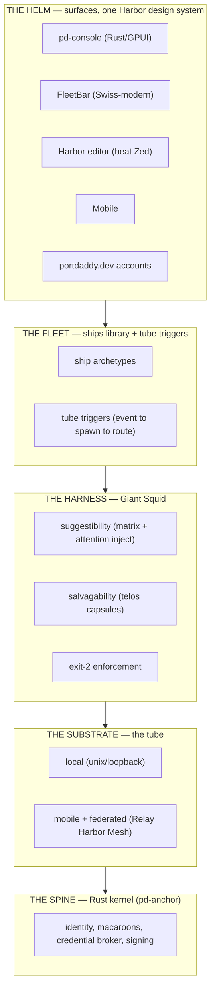

# 0090. The Harbor — one helm for human + agent fleets

## Status

Proposed — 2026-06-24. North-Star synthesis; **extends** [ADR-0048](0048-what-port-daddy-is.md)
("What Port Daddy Is"). This ADR does not introduce a new mechanism — it *ties the existing
and emerging ones into one product* and assigns each a layer, a maturity, and a real anchor.

Composes: [ADR-0027](0027-relay-harbor-mesh.md) (Relay Harbor Mesh — the remote/federation
substrate), [ADR-0028](0028-salvage-envelope.md) (salvage), [ADR-0039](0039-suggestibility-layer.md)
(suggestibility), [ADR-0087](0087-trusted-computing-base-broker.md) (TCB),
[ADR-0088](0088-host-safety-layer.md) (host safety), and the Giant Squid Harness ADR
(the agent-execution harness; in review as PR #545, renumbered to 0091).

## Context

Nine threads have been built or sketched in parallel, and the operator asked the right
question: how do they become *one product* rather than nine demos? The Rust kernel, the
Giant Squid harness (suggestibility + salvagability), the tube substrate (local / mobile /
remote), a library of fleet ships + tube triggers, the Harbor design system for the Rust
console, the Swiss-modern FleetBar operator control, the "beat Zed" collaborative editor,
the mobile experience, and portdaddy.dev accounts + V4 remote harbor.

The honest state varies — some shipped, some emerging, some aspirational — and this ADR
records that plainly. Its job is the map, not the claim.

## Decision

**Port Daddy is *the Harbor*: one helm from which a human operator commands a fleet of
agents — local, remote, and federated — over a single substrate (the tube), on a single
trusted spine (the Rust kernel), with every agent made suggestible and salvageable, all
wearing one face: the Harbor design language.**

Five layers, bottom-up. Each named thread lands on exactly one.

### Where each thread lands (with honest maturity)

Legend: **shipped** / *emerging* / `aspirational`.

| Thread | Layer | Real anchor | Maturity |
|---|---|---|---|
| Rust kernel | Spine | `core/kernel/pd-anchor` (custody #496, broker #508 merged) | **shipped** |
| Harness: suggestibility + salvagability | Harness | Giant Squid (PR #545); `lib/attention.ts` (ADR-0039); `lib/telos-salvage.ts` (ADR-0028) | harness *designed*; suggestibility/salvage **shipped** |
| Tube substrate (incl. mobile) | Substrate | `lib/tube.ts` | local **shipped**; mobile `aspirational` |
| V4 remote harbor | Substrate (edge) | ADR-0027 Relay Harbor Mesh | *emerging* |
| Fleet ships + tube triggers | Fleet | `lib/shipwright/archetypes.ts`, `fleet/ships/`, `lib/fleet-channels.ts` | *emerging* |
| Harbor design for the Rust app | Helm/skin | the design system (`tokens.css` + Harbor/Chart/Signal themes) + pd-console | *emerging* |
| FleetBar operator control + Swiss modern | Helm | `lib/fleetbar-launcher.ts`, berths/Conductor | app **shipped**; Swiss-modern skin *emerging* |
| "Beat Zed" collaborative editor / vibe coding | Helm | `docs/strategy/harbor-editor-battle-plan.md`, `core/harbor-card-rs`, `lib/harbormaster.ts`, Loro CRDT, agents-as-peers | *emerging* (P0/P1 shipped) |
| portdaddy.dev user accounts | Helm/edge | website-v2 exists; no auth/account routes yet | `aspirational` |

### The four throughlines (what makes it one product)

1. **Suggestibility** — every agent, every turn, sees the swarm and your steering (Giant
   Squid matrix injection over `lib/attention.ts`). The operator's hand is always on the wheel.
2. **Salvagability** — no voyage dies in vain: every run emits a `SelfSalvageCapsule`
   (`lib/telos-salvage.ts`, ADR-0028); the editor's CRDT merges agent work as a peer's, never
   a clobber. *Nothing is lost.*
3. **Collaborative vibe coding** — human and agents are co-equal peers in the Harbor editor
   (Loro CRDT, agents-as-peers) and in the fleet. "Beat Zed" = the same fast collaborative
   editing, but the collaborators are your agents.
4. **One helm, one skin** — the Harbor design system is the single visual grammar across the
   Rust console, the Swiss-modern FleetBar, the editor, and mobile; the ICS signal-flag
   language is the cross-surface status grammar (a locked file reads Lima-yellow everywhere).

### The unifying skin

The `tokens.css` design system is the one face. The console renders the Harbor theme;
FleetBar takes the Swiss-modern restraint of Chart Table; the editor and mobile inherit the
same tokens; Signal Deck's flag-language becomes the cross-surface status grammar. Choose the
theme once; it propagates. (Design system + three themes: `~/coding/tmp/pd-harness-design`.)

## Consequences

- **Positive:** one coherent product the whole crew steers by; each ambition has a layer, an
  anchor, and a maturity, so we always know what is real versus aspirational; the design
  system makes every helm surface "render the matrix in the chosen theme."
- **The keystone:** the load-bearing first cut is the Giant Squid `hook-tentacles` slice
  (Claude-Code-first) — it makes the harness *real* and earns its SMART proofs (per-turn
  suggestibility, the `exit 2` lock/steering gate, demonstrably working). Every helm surface
  above is then a projection of that substrate.
- **Honest gaps:** mobile and portdaddy.dev accounts are aspirational; remote harbor is
  emerging (ADR-0027); the harness is designed, not built. This ADR claims none of them done.

## References

- ADR-0048 — "What Port Daddy Is"; this North-Star extends it.
- ADR-0027 — Relay Harbor Mesh; the remote/federation substrate ("V4 remote harbor").
- ADR-0028 — the salvage envelope; salvagability.
- ADR-0039 — the suggestibility / attention layer.
- ADR-0087 / ADR-0088 — the TCB and host-safety layers the spine and harness compose with.
- `lib/tube.ts` — the substrate.
- `lib/telos-salvage.ts` — the `SelfSalvageCapsule`.
- `lib/shipwright/archetypes.ts`, `lib/fleet-channels.ts` — the fleet ships + tube-trigger channels.
- `lib/harbormaster.ts` — the Harbor editor orchestration.
- `docs/strategy/harbor-editor-battle-plan.md` — the "beat Zed" plan.
