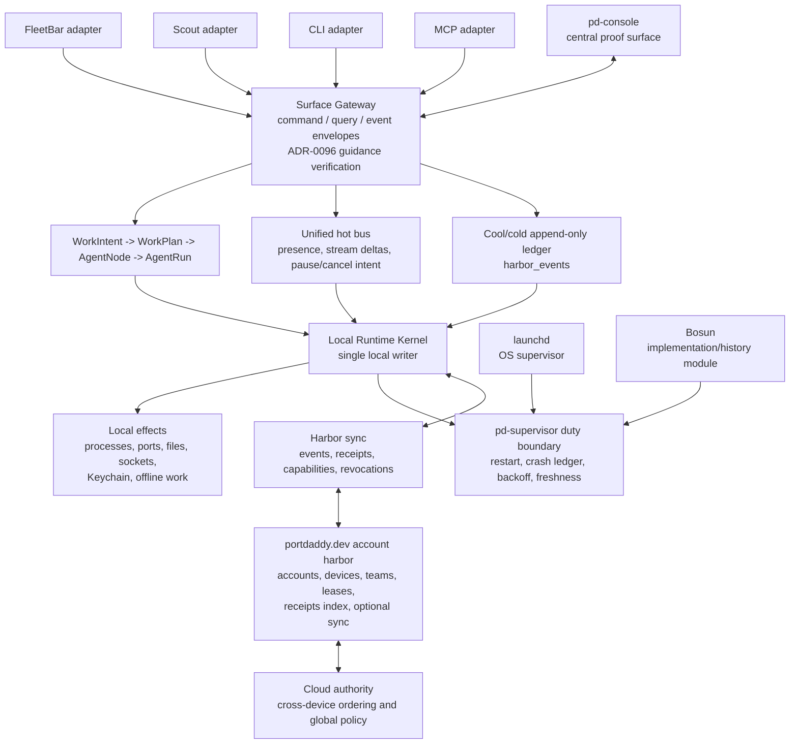

# ADR-0100: Destructive Daemon Runtime Authority

## Status

Proposed - 2026-07-09. Wave 2 Lane A authority freeze for the destructive
daemon/runtime refactor.

Depends on: [ADR-0095](./0095-agent-run-saga-and-backend-authority.md)
(Agent Run Saga + backend authority),
[ADR-0096](./0096-signed-guidance-envelope-and-suggestibility-authority.md)
(signed GuidanceEnvelope and suggestibility authority),
[ADR-0090](./0090-database-distribution-and-sync.md) (database distribution and
sync architecture), and the Agent Harbor binder chapters
[25](../architecture/agent-harbor-technical-binder/25-agent-harbor-runtime-refactor-alignment.md)
and [26](../architecture/agent-harbor-technical-binder/26-agent-harbor-runtime-refactor-agent-dag.md).

Blocks: destructive daemon/runtime implementation lanes that delete or fail
closed legacy routes, CLI verbs, MCP tools, hot-stream paths, supervisor
paths, and sync paths.

## Context

Port Daddy now has enough real surfaces that incremental compatibility is more
dangerous than a hard refactor. `pd-console`, FleetBar, Scout, CLI, MCP, legacy
spawn/dispatch/sortie-style entry points, Bosun, launchd, local SQLite ledgers,
relay harbor-card auth, and emerging `portdaddy.dev` account surfaces can all
look like they own part of runtime truth.

That split authority creates the failure modes this refactor is meant to remove:

- a surface can start work without a daemon-owned `WorkIntent`;
- old launch verbs can own independent creation state;
- live streams can be mistaken for durable event truth;
- Bosun, launchd, and future `pd-supervisor` language can imply multiple local
  supervisors;
- cloud or relay authentication can be confused with human account authority;
- two machines can appear to share a writable SQLite registry when they only
  share optional sync events.

ADR-0096 is not missing architecture. It is the accepted dependency that tells
this refactor how signed guidance becomes authority: verified guidance is checked
at the Surface Gateway, harness, and broker boundary before it can become a
control command, tool grant, or cool/cold ledger event.

## Decision

Port Daddy will do the destructive daemon/runtime refactor around one authority
shape:

- `pd-console` is the central operator proof surface.
- FleetBar, Scout, CLI, and MCP are adapters into a shared Surface Gateway.
- The Surface Gateway is the only entry boundary for official command, query,
  and event envelopes.
- The Local Runtime Kernel is the single local writer for local processes,
  ports, files, sockets, Keychain, offline work, Work Intents, Work Plans, Agent
  Nodes, Agent Runs, local transcripts, local claims, costs, controls, receipts,
  and local ledger rows.
- Existing `harbor_events` becomes the canonical cool/cold append-only ledger.
- Hot streams are unified behind the gateway and are never durable truth.
- `pd-supervisor` is the Port Daddy duty boundary for local process supervision.
  launchd remains the OS supervisor. Bosun remains implementation/history until
  crash-ledger, backoff, restart, and release proof make it safe to retire or
  absorb.
- Cloud authority is explicit and narrower than local runtime authority:
  accounts, devices, teams, global leases, billing/receipts index, optional sync,
  and cross-device ordering.
- No machine shares a writable SQLite database with another machine.

Legacy bridge posture is rejected. When the new WorkIntent and Surface Gateway
path owns a behavior, the old route, CLI verb, or MCP entry point must either be
deleted or fail with migration guidance. It must not quietly alias into a second
runtime model.

## Normative Runtime Diagram

This diagram is normative for the destructive refactor. Code, CLI help, MCP
tools, docs, and native surfaces must converge on this shape.

Read it literally:

- `pd-console` is centered because it is the only required surface for full
  daemon truth: transcript replay, files, diffs, claims, controls, costs,
  receipts, guidance verification state, and restart proof.
- FleetBar is ambient consent, status, and re-entry. It must not grow a second
  transcript, run, or supervisor model.
- Scout is evidence-bearing intake. It submits context through WorkIntent and
  Surface Gateway rather than owning a launch route.
- CLI and MCP are agent, CI, emergency, and integration adapters. They do not
  get separate semantics.
- Hot bus data is replaceable. Cool/cold ledger rows are replayable authority.
- Harbor sync moves append-only records, receipts, capabilities, revocations,
  and ordering evidence. It does not replicate a local SQLite file as a shared
  writable database.

## Authority Boundaries

### Local runtime authority

The Local Runtime Kernel owns:

- process start, stop, restart, PID, body lease, and local exit status;
- port assignment, socket paths, launch URLs, and berth selection;
- local files, worktrees, claims, locks, patches, and proof artifacts;
- macOS Keychain and other OS-local secret custody;
- offline work and local ledger append while disconnected;
- local transcript capture, local archive, and replay;
- local WorkIntent, WorkPlan, AgentNode, AgentRun, ControlCommand, claim, cost,
  receipt, and event rows.

### Cloud authority

The cloud owns only the domains that require account or multi-device authority:

- human accounts and account recovery;
- devices and device pairing;
- teams, membership, invitations, and policy bundles;
- global leases and cross-device conflict ordering;
- billing and receipt index publication;
- optional sync configuration and remote retention choices;
- remote harbor ordering when the operator explicitly enters a remote harbor.

The cloud never becomes the local process manager for a laptop, and the local
kernel never becomes the global account authority.

### Account and project-auth boundary

Relay harbor-card auth is transport/capability auth for relay and harbor-card
exchange. It is not human account auth. A relay card can prove that a channel,
device, or CI actor holds a scoped capability; it does not prove that a
`portdaddy.dev` human account is signed in, paid, team-authorized, or allowed to
join a project.

The `portdaddy.dev` account skeleton comes later. Until then, project/account
behavior is default-deny:

- no project sync by default;
- no transcript upload by default;
- no cross-device write path by default;
- no team policy grant without an explicit account/device/team authority record;
- no migration that treats relay credentials as a substitute for account
  credentials.

## Legacy Entry Point Policy

When a new WorkIntent/Surface Gateway path owns a behavior, every older
entrypoint is handled by one of two allowed outcomes:

1. Delete it and remove its public docs, CLI help, MCP tool registration,
   OpenAPI/SDK reference, tests, and feature manifest row.
2. Fail closed with migration guidance that names the new path and preserves no
   hidden side effect.

Quiet aliases are forbidden. A compatibility edge may exist only as an explicit
migration adapter that writes one `source.legacyVerb` field into a WorkIntent and
has a deletion phase. It must not own state, a transcript, a claim model, a
budget model, or a supervisor path.

## Hot And Cool/Cold Bus Policy

`harbor_events` is the canonical cool/cold append-only ledger for this refactor.
It may gain stricter types, idempotency keys, sequence checks, projections,
archival mirrors, and replay tests, but it does not get replaced by another
ledger without a superseding ADR.

Hot streams must be unified, not multiplied. A WebSocket, SSE stream, local pipe,
or native callback may carry low-latency presence, cursors, stream deltas, and
pause/cancel intent. It must not be the source of truth for:

- WorkIntent creation;
- AgentNode materialization;
- ControlCommand durability;
- transcript event order;
- cost/receipt accounting;
- crash ledger rows;
- cloud sync checkpoints.

Every hot action that matters must either land in `harbor_events` or be visibly
marked ephemeral.

## Supervisor Policy

`pd-supervisor` is the Port Daddy duty boundary for local runtime supervision.
It owns the Port Daddy-specific duties:

- daemon process lease;
- readiness and freshness checks;
- restart/backoff policy;
- crash ledger append;
- duplicate-side-effect prevention during restart;
- release/install proof;
- degraded state surfaced to FleetBar and `pd-console`.

launchd remains the OS supervisor on macOS. It launches and keeps the supervisor
alive; it does not own Port Daddy restart semantics, crash classification, berth
truth, or release proof.

Bosun remains implementation/history until the replacement is proven. It can be
an internal module, compatibility binary, or migration shim, but it is not a
second authority. The refactor cannot remove or demote Bosun claims until a
seeded restart harness, crash ledger, backoff, release proof, and native-surface
evidence show that `pd-supervisor` actually owns the duty.

## Proof Gates

This ADR is not satisfied by source changes alone. The destructive refactor is
not releasable until all gates below pass.

### Seeded restart harness

- Seed local WorkIntent, AgentNode, transcript, control, cost, and receipt rows.
- Restart through `pd-supervisor`, not raw daemon commands.
- Prove `pd-console` and FleetBar rebuild from Local Runtime Kernel projections
  and `harbor_events`.
- Prove crash/backoff/freshness state is visible and durable.

### Shadow replay and duplicate-side-effect prevention

- Replay a recorded ledger into a shadow runtime.
- Prove side-effecting commands do not re-run unless idempotency permits it.
- Prove pause/cancel/approval commands preserve sequence and expiry.
- Prove stale hot-bus frames cannot resurrect old state.

### Native FleetBar and pd-console proof

- FleetBar shows the active berth/runtime authority and routes consent/re-entry
  through the same Surface Gateway path.
- `pd-console` shows full run truth from daemon projections, including guidance
  verification state from ADR-0096.
- Screenshots or recordings prove native surfaces, not adjacent web stand-ins.

### RC and Homebrew gates

- RC build installs and starts through the sanctioned supervisor path.
- Homebrew install proves the compiled daemon, supervisor, CLI, FleetBar, and
  `pd-console` agree about runtime authority.
- Old routes, CLI verbs, and MCP tools are deleted or fail with migration
  guidance in the installed artifact, not only in source.

## Implementation Matrix

| Phase | Roadmap slug | Status | Depends on | Description |
|-------|--------------|--------|------------|-------------|
| 0 | adr-0100-destructive-daemon-runtime-authority | now | ADR-0095, ADR-0096, binder ch25/ch26 | This ADR and the Wave 2 Lane A binder work packet define the normative authority, deletion policy, local/cloud boundary, supervisor boundary, and proof gates. |
| 1 | adr-0100-phase-1-surface-gateway-freeze | later | Phase 0 | Freeze the Surface Gateway command/query/event contract and route discovery so all official surfaces share one authority boundary. |
| 2 | adr-0100-phase-2-workintent-migration | later | Phase 1 | Move old launch families to WorkIntent source metadata or fail-closed migration errors; no quiet aliases. |
| 3 | adr-0100-phase-3-hot-cold-ledger-unification | later | Phase 1 | Make `harbor_events` the canonical cold ledger and unify hot streams as ephemeral projections. |
| 4 | adr-0100-phase-4-supervisor-consolidation | later | Phase 0 | Establish `pd-supervisor` as duty boundary while preserving launchd as OS supervisor and Bosun as implementation/history until proof gates pass. |
| 5 | adr-0100-phase-5-account-harbor-boundary | later | Phase 0 | Add account/device/team/cloud authority records without treating relay harbor-card auth as human account auth or enabling project sync by default. |
| 6 | adr-0100-phase-6-rc-homebrew-proof | later | Phases 1-5 | Run seeded restart, shadow replay, native FleetBar + `pd-console`, RC, and Homebrew proof gates before release. |

## Consequences

### Positive

- Runtime authority becomes inspectable: every official action crosses the same
  gateway, every durable action lands in the same append-only ledger family, and
  every cloud/local domain names its writer.
- Operators get `pd-console` as the deep proof surface and FleetBar as ambient
  consent without two UI state machines.
- Old launch words stop calcifying into permanent product architecture.
- The refactor can be reviewed lane-by-lane because deletion policy and proof
  gates are fixed before code churn begins.

### Negative

- This is intentionally destructive. Some old commands, routes, MCP tools, and
  tests will disappear or start failing with migration guidance.
- Short-term compatibility gets worse in exchange for long-term authority.
- Release cannot be considered done until native proof and Homebrew proof exist,
  which is slower than source-only validation.

### Neutral

- `portdaddy.dev` account work is acknowledged but not smuggled into the local
  runtime refactor. It remains a later skeleton with project default-deny.
- Relay harbor-card auth remains useful for capability transport but does not
  become human account auth.
- SQLite remains local-machine authority. Cross-machine truth is append-only
  sync, receipts, leases, and ordering evidence, never a shared writable DB.
