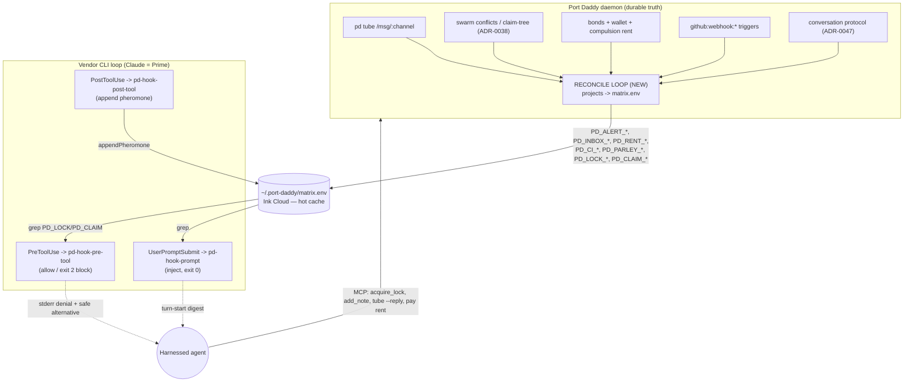

# 0108. The Port Daddy Harness — a harnessed agent as a citizen of the fleet

## Status

Proposed

## Context

Port Daddy already ships the **Giant Squid Harness**: a thin adapter that sinks three shell "tentacles" into a vendor CLI's native hook surface so Port Daddy logic fires *inside the vendor's own agent loop* rather than wrapping it. The verified surfaces today are narrow and honest:

- `lib/squid/adapter.ts` — `ClaudeCliSquidAdapter` (`verified = true`) injects `UserPromptSubmit`, `PreToolUse`, `PostToolUse` into `.claude/settings.json` (`injectHooks`) and spawns `claude -p` so they fire (`spawnVoyage`). `CodexSquidAdapter` and `GeminiSquidAdapter` are `verified = false` skeletons whose `spawnVoyage` **throws** — they write a *plausible* `config.toml` / `.gemini/settings.json` but refuse to claim a working harness.
- `lib/squid/matrix.ts` — the **Ink Cloud**, a POSIX `KEY="value"` file at `~/.port-daddy/matrix.env`, mkdir-locked so K≥8 ephemeral agents append without torn lines. It carries `PD_LOCK_*`, `PD_PHEROMONE_*`, and `PD_ALERT_*`. **It is a hot cache, not a source of truth** — the daemon reconcile loop that drains it into `lib/attention.ts`/`lib/pheromone.ts` is an explicit unbuilt TODO.
- The tentacles: `bin/pd-hook-prompt` greps the matrix for `PD_ALERT_*`/`PD_PHEROMONE_*` relevant to `cwd` and prints them; the vendor **prepends hook stdout to the turn's context** — the "Suggestibility Envelope" (always `exit 0`, advisory). `bin/pd-hook-pre-tool` is the **one enforced gate**: it computes `PD_LOCK_<path>`, and if the target is locked by a *different* `PD_ACTOR` it `exit 2`, which the vendor treats as a hard block with stderr fed back as the denial reason. `bin/pd-hook-post-tool` appends a pheromone on file-mutating tools. Every tentacle **fails open** by design.

Critically, the injected `PreToolUse`/`PostToolUse` matcher is `Edit|Write|MultiEdit|NotebookEdit` — **`Bash` is not gated**. So today the harness gates *file edits* against locks but does **not** see `rm -rf`, `git push --force`, or `cat .env.local` issued through `Bash`.

Meanwhile, the rest of Port Daddy is **substrate-rich**. The harness can stand on real primitives instead of inventing them:

- **Pub/sub:** `pd tube` over the daemon's `/msg/:channel` surface, with a versioned envelope `{ v, kind: 'tube.msg', body, inReplyTo? }` and a per-channel history cursor (`lib/tube.ts`). The conversation protocol (ADR-0047) gives tube messages a **FIPA performative** (`escalate`/`cfp`/`propose`/`inform`/`agree`/`refuse`) plus `conversationId` and `delegationChain`.
- **Swarm awareness:** the MCP tools `swarm_awareness`, `coordination_preflight`, `sitrep`, `catch_me_up` are live. `lib/client.ts` already computes `conflicts[]` with `{ filePath, sessionId, purpose, claimedAt }`. The claim-tree (ADR-0038) and three-layer actor/fleet/session model (ADR-0028) underlie this.
- **Economy:** `lib/bonds.ts` is **real enforcement** — `escrow` debits a project wallet into an escrow row *before* spawn, with the invariant `wallet + escrow + commons = supply` and `NO-SPAWN-WITHOUT-BOND`. `lib/dispatch/runner.ts` clamps every dispatch to a **$25 hard ceiling** (`clampBudget`) and stamps `budgetUsd` into the plan. ADR-0050 phase 7 is the **compulsion**: "no note, no commit" rent, already enforced in the Coordination Guard (`lib/coast-guard/compulsion.ts`).
- **Worktrees:** `lib/worktree.ts` enumerates worktrees and flags `isMain`; `lib/worktree-policy.ts::evaluateSessionWorktreePolicy` already **refuses sessions on the main worktree** and **refuses to name the bypass flag** — the exact "point only at the corrective action" doctrine. `lib/dispatch/runner.ts::deriveWorktreePath` makes each dispatch its own worktree.
- **Destructive-command interception:** ADR-0037 (`pd-shim`) already specifies the git deny-list — `reset --hard`, `clean -f`, `checkout -- <path>` hard-refused; `push --force` to `main`/`master`/`stable` *always* refused; un-`done` push refused — and the doctrine of **injecting a warning block into the agent's next turn rather than only blocking**. The Coast Guard (ADR-0050) confines secret reads at the OS sandbox layer and meters egress.
- **CI/CD:** `lib/fleet/triggers/github.ts` already subscribes to `github:webhook:<event>` channels including `pull_request`; `lib/webhooks.ts` and `lib/fleet/outputs/github.ts` exist.

The gap is **not primitives. It is the harness binding.** A harnessed agent today *cannot hear* a tube message mid-voyage, *is not told* what the swarm is doing at PreToolUse, *gets no CI verdict back*, *cannot be invited to parley*, *pays rent only at commit-time (not per tool-call)*, *is not forced into a worktree by the harness itself*, and *is not gated on `Bash` at all*. This ADR specifies that binding — and is rigorous about what is shipped versus aspirational.

## Decision Drivers

- **Stand on real primitives; invent nothing that exists.** Tube, bonds, dispatch budget, worktree-policy, pd-shim deny-list, swarm conflicts, GitHub triggers are all real. The harness's job is to *surface* them through the three hook events, not reimplement them.
- **The hook surface is tiny and mostly one-directional.** A vendor hook gets one event on stdin and can do exactly two things: print to stdout (advisory inject) or `exit 2` (block, PreToolUse only). There is **no push channel** into a running turn — everything an agent "hears" must be *pulled by a tentacle at the next hook firing*.
- **Fail open, always.** A crashed hook is a broken product; a quiet hook is degraded coordination. Enforcement (`exit 2`) is the only exception and must be deliberate.
- **Never name the bypass.** Carried verbatim from `worktree-policy.ts` and ADR-0037: refusal copy points only at the corrective action.
- **Honesty about vendor parity.** Only `ClaudeCliSquidAdapter` is verified. Codex/Gemini parity is unproven and must be marked as such everywhere.

## Considered Options

- **A. A resident daemon-side orchestrator that drives the vendor loop.** Rejected: contradicts the Squid thesis — the vendors already built optimized token-streaming/retry loops; we sink tentacles into them, we do not replace them.
- **B. A fat MCP tool the agent must *choose* to call each turn.** Rejected as the *primary* mechanism: an agent that forgets to call `catch_me_up` is the dark-lane failure ADR-0050 phase 7 exists to kill. The hook surface is non-optional; MCP tools are the agent's *response* path, not the delivery path. (We use both: hooks deliver, MCP responds.)
- **C. (chosen) Bind the eight capabilities to the three existing hook events**, with the Ink Cloud as the hot read cache the tentacles grep, a daemon **reconcile loop** that projects durable state (tube, conflicts, CI verdicts, parley invites, rent status) *into* the matrix, and a widened `Bash` PreToolUse gate for destructive interception. Claude is Prime; Codex/Gemini are validate-then-add.

## Decision

The harness makes an agent a fleet citizen via **three hook events** plus **one new daemon component** (the **Reconcile Loop**) that projects durable coordination state into the Ink Cloud so the tentacles can grep it at native speed each turn.

### Architecture

The agent **hears** by pull: the Reconcile Loop writes durable events into `matrix.env`; the next hook firing greps them and injects/enforces. The agent **responds** through MCP tools (`acquire_lock`, `add_note`, `tube`, etc.) back to the daemon, closing the loop.

### The eight capabilities

**1. Hears updates (fleet events).** `UserPromptSubmit` → `pd-hook-prompt`, the only event that fires on every turn-start unconditionally and whose stdout is prepended to context. The Reconcile Loop drains each subscribed channel's new tube messages (after the agent's per-channel cursor) and writes them as `PD_INBOX_<channel>_<msgid> = "<performative>|<sender>|<body>"`; the tentacle greps `PD_INBOX_*`/`PD_ALERT_*` and emits a `[PORT DADDY — PENDING MESSAGES]` block. Inject only (advisory). **Honest caveat:** there is **no** push into an in-flight turn; "mid-turn" delivery is bounded by hook firing frequency. **REAL:** tube transport + cursor; `PD_ALERT_*` inject path. **NEW:** the Reconcile drain; `PD_INBOX_*`; subscription→cursor binding. **Effort: M.**

**2. Pub/sub subscriptions.** No direct hook surface — subscription is daemon state; delivery rides on §1. On `begin_session` the harness auto-subscribes the actor to its own inbox, its `<project>:fleet` channel, its fleet shard, and any parley channels. Subscriptions persist as `PD_SUB_<actor>_<channel>`. **REAL:** channels, `pd tube listen`, `pd_discover`. **NEW:** auto-subscribe policy; `PD_SUB_*`; subscribe/unsubscribe MCP verbs. **Effort: S–M.**

**3. Knows what other agents are doing (swarm awareness).** `PreToolUse` (enforced conflict block) + `UserPromptSubmit` (advisory digest). The Reconcile Loop projects the live conflict set and claim-tree into `PD_LOCK_<path>` (already consumed) **and** a new `PD_CLAIM_<path> = "<actor>|<purpose>|blast:<n>"`. Turn-start emits a `[PORT DADDY — SWARM]` block: live sessions, who owns files near `cwd`, predicted blast radius. **Enforce** the existing `exit 2` lock block for hard conflicts; **inject** the advisory picture so the agent re-plans *before* it reaches a locked file. A *claimed-not-locked* target warns to stderr but `exit 0` (advisory). **REAL:** the `PD_LOCK_*` enforced block (the one shipped enforcement in the whole harness). **NEW:** `PD_CLAIM_*`; turn-start digest; blast-radius. **Effort: M.**

**4. CI/CD outcomes.** `UserPromptSubmit` → `pd-hook-prompt`. The GitHub webhook trigger already receives `pull_request`/`check_run`/`workflow_run` payloads; the Reconcile Loop matches a verdict to the agent's branch (from `PD_DISPATCH_BRANCH` or session worktree) and writes `PD_CI_<branch> = "<status>|<check>|<url>"`. The tentacle injects a `[PORT DADDY — CI VERDICT]` block — a failure directs *fix-and-repush* (corrective action named, never the bypass); a green build confirms and points at the harbormaster gate. **REAL:** webhook triggers + payload parsing; branch stamping. **NEW:** branch→agent matching; `PD_CI_*`; verdict injection. **Effort: M.**

**5. Parley invitations.** `UserPromptSubmit` (delivery) + MCP (join/respond). "Parley" is the human name for an ADR-0047 multi-party conversation with a `conversationId`, performatives, and explicit termination. An invitation is a tube `inform`/`cfp` to the invitee's inbox; the loop writes `PD_PARLEY_<convId> = "<topic>|<convener>|turn:<actor>|deadline:<ts>"`. The agent joins by `tube --reply`; **turn order** is enforced by the convener setting `turn:<actor>` (the tentacle prompts the agent to speak only when it's its turn); **termination** is ADR-0047's quiescence/TTL/Arbiter/HiTL. **REAL:** tube transport, `--reply` auto-correlation, the ADR-0047 *design*. **NEW (mostly aspirational):** ADR-0047 itself is Proposed — the performative envelope, turn-order enforcement, and termination are unbuilt. **Effort: L** (blocked on ADR-0047 phases 0–4).

**6. Forced to pay rent.** `PreToolUse` (budget/rent gate) + `UserPromptSubmit` (status digest). Two distinct economics, both real: (a) **spawn-time bond (shipped)** — `bonds.ts` escrows before spawn; `runner.ts` clamps to $25/dispatch; (b) **per-turn/holding rent (new)** — the loop computes running spend vs escrowed bond plus rent for held resources (claims, ports, compute) and writes `PD_RENT_<actor> = "spent:<usd>|cap:<usd>|holds:<n>|status:ok|throttled|evicted"`. The pre-tool tentacle reads `PD_RENT_<self>`; `status:throttled` injects a slowdown warning (advisory); `status:evicted` **`exit 2`** — expensive tool-calls blocked until the agent pays (publishes the owed note / tops up). This is ADR-0050 phase 7's compulsion made per-tool-call. Reclaim acts **only** on a disposable `~/coding/tmp/<slug>` sandbox, never the live checkout. **REAL:** bonds/wallet/escrow with conservation invariant; $25 ceiling; commit-time compulsion. **NEW:** per-tool rent projection; holding-rent model; eviction `exit 2`. **Effort: M–L.**

**7. Directed to fresh worktrees.** `PreToolUse` (widened to match `Bash` + edit tools) + `begin_session` policy. `evaluateSessionWorktreePolicy` already refuses sessions on `isMain` and refuses to name the bypass. The harness extends this to the *tool* layer: a `PreToolUse` edit/create targeting the **main checkout** under an isolated session `exit 2`s with *"This work must run in a linked worktree. Create one with `git worktree add ~/coding/tmp/<slug> -b <branch>` and continue there."* The path convention is **`~/coding/tmp/<slug>`, never `/tmp`** (macOS-purged). **REAL:** `evaluateSessionWorktreePolicy`; `deriveWorktreePath` for dispatch. **NEW:** the tool-level gate; the steering directive; path-classification. **Effort: M.**

**8. Destructive commands intercepted.** `PreToolUse` → `pd-hook-pre-tool`, **matcher widened to include `Bash`** (today `Edit|Write|MultiEdit|NotebookEdit` only — `Bash` is the gap through which `rm -rf` and force-push pass unseen). The tentacle parses `tool_input.command` and classifies against the **ADR-0037 deny-list**: `rm -rf`, `git reset --hard`, `git clean -f`, `git checkout -- <path>`, `git push --force`, history rewrite, mass deletion, and secret exfiltration (`cat .env.local` and friends — the Coast Guard deny-list). Force-push to `main`/`master`/`stable` is **always** refused. **Enforce** (`exit 2`) **with the safe coordinated alternative named in stderr** — *"`git push --force` to `main` is refused. Use `pd revert <slug>` to undo safely / open a PR / rebase onto `origin/main`."* Defense-in-depth: the OS sandbox (Coast Guard, shipped) denies secret *reads* at the kernel level; the hook adds the interactive veto + the *guidance* the sandbox cannot give. **Honesty:** a truly-malicious same-UID agent can disable the hook or egress directly — this is **blast-radius reduction for the cooperative case**, not a vault. **REAL:** the ADR-0037 deny-list spec + pd-shim; the Coast Guard sandbox secret-deny. **NEW:** porting the deny-list into the tentacle; **widening the matcher to `Bash`** (the single highest-leverage change in this ADR); the safe-alternative copy. **Effort: M.**

### Vendor-portability matrix

| Capability | Claude (Prime, verified) | Codex (validate-then-add) | Gemini (validate-then-add) |
|---|---|---|---|
| 1. Hears updates (turn-start inject) | ✅ stdout prepended | ❓ `UserPromptSubmit` hook exists; inject unverified | ❓ `BeforeAgent` hook exists; inject unverified |
| 2. Subscriptions | ✅ (daemon-side; delivery via §1) | ✅ daemon-side; ❓ delivery | ✅ daemon-side; ❓ delivery |
| 3. Swarm awareness inject | ✅ | ❓ unverified | ❓ unverified |
| 3. Conflict **block** (`exit 2`) | ✅ **shipped** | ❓ exit-2 OR `permissionDecision:deny` JSON; **unverified** (`spawnVoyage` throws) | ❓ exit-2 documented; **unverified** (`spawnVoyage` throws) |
| 4. CI verdict inject | ✅ | ❓ | ❓ |
| 5. Parley invite/respond | ✅ inject; MCP respond | ❓ inject; ✅ MCP (vendor-agnostic) | ❓ inject; ✅ MCP |
| 6. Rent gate (`exit 2`) | ✅ via PreToolUse | ❓ exit-2 unverified; Codex has its own sandbox modes | ❓ unverified |
| 7. Worktree steering (`exit 2`) | ✅ | ❓ | ❓ |
| 8. Destructive veto (`exit 2` on Bash) | ✅ **after matcher-widening** | ❓ Bash-event shape + exit-2 unverified | ❓ unverified |

**Uncertainty is explicit and load-bearing.** Every ❓ is a cell where `spawnVoyage` currently *throws* precisely so no one mistakes a written config for a working harness. The honest read: **all `exit 2` enforcement (3-block, 6, 7, 8) is Claude-only today.** Advisory injection *might* work on Codex/Gemini but is unproven. The MCP response path is vendor-agnostic because it rides the `port-daddy` MCP server, not the hook surface.

Per the 2026-06-25 research sweeps: **Gemini CLI** exposes `BeforeAgent`/`BeforeTool`/`AfterTool` in `.gemini/settings.json` with exit-2 blocking and the same JSON contract; **Codex CLI** exposes `PreToolUse`/`PostToolUse`/`UserPromptSubmit` (among 10 events) in `.codex/config.toml` `[hooks]`, blocking via exit-2 *or* a `permissionDecision:deny` JSON, with `notify` being broadcast-only (not a gate). Both are *promising leads read from source*, not yet validated by running the real CLI and observing a live block — phase 7 below is exactly that validation.

### Phased rollout

| Phase | Roadmap slug | Status | Depends on | Description |
|-------|--------------|--------|------------|-------------|
| 0 | adr-0051-phase-0-reconcile-loop | now | — | The daemon **Reconcile Loop**: project durable state into `PD_INBOX_*`, `PD_CLAIM_*`, `PD_CI_*`, `PD_PARLEY_*`, `PD_RENT_*`; drain pheromones with decay. **Done when:** a tube message to a subscribed channel appears as `PD_INBOX_*` and is injected at the next turn, once. |
| 1 | adr-0051-phase-1-bash-destructive-gate | now | — | **Widen the PreToolUse matcher to `Bash`** and port the ADR-0037 deny-list + Coast-Guard secret-deny into `pd-hook-pre-tool` with safe-alternative stderr. **Done when:** `rm -rf /` and `git push --force origin main` are `exit 2`-blocked with a corrective directive, and `git status`/`ls` pass. Highest-leverage, lowest-dependency slice. |
| 2 | adr-0051-phase-2-hears-and-subscriptions | now | phase-0 | §1 + §2: auto-subscribe on `begin_session`; `PD_SUB_*`; turn-start `[PENDING MESSAGES]` block; cursor advance. **Done when:** an agent reads a fleet message at turn-start exactly once. |
| 3 | adr-0051-phase-3-swarm-and-ci | now | phase-0 | §3 advisory swarm digest + `PD_CLAIM_*`; §4 CI verdict matching + `PD_CI_*` inject. **Done when:** a red check on the agent's branch injects a fix-and-repush directive next turn. |
| 4 | adr-0051-phase-4-rent-gate | next | phase-0 | §6 per-tool rent projection + `exit 2` eviction; holding-rent for claims/ports. **Done when:** an agent over its cap is blocked at PreToolUse with a pay/note directive, fail-open on any rent-read error. |
| 5 | adr-0051-phase-5-worktree-steering | next | phase-1 | §7 tool-level worktree gate; `~/coding/tmp/<slug>` steering. **Done when:** an edit against the main checkout under an isolated session is `exit 2`-redirected to a worktree. |
| 6 | adr-0051-phase-6-parley-binding | backlog | ADR-0047 phases 0–4 | §5 `PD_PARLEY_*` + turn-order injection + termination cleanup. **Blocked on** the conversation-protocol substrate. **Done when:** an invited agent speaks only on its turn and stops on quiescence. |
| 7 | adr-0051-phase-7-codex-gemini-validate | backlog | phase-1..3 | Validate Codex/Gemini hook parity (synchronous, exit-2-respecting, stdout-injecting) by **running the real CLI and observing a live block**, then flip `verified`. **Done when:** at least the advisory inject path is proven on one non-Claude vendor and `spawnVoyage` no longer throws for it. |

### Failure modes

- **Reconcile Loop stalls** → the Ink Cloud goes stale. Mitigation: stamp `PD_RECON_HEARTBEAT_TS`; the prompt tentacle injects a "coordination cache is N seconds stale" warning past a threshold, and rent/worktree `exit 2` gates **fail open** if the cache is stale (degraded coordination beats a wedged fleet).
- **Matrix lock contention at K≥8** → torn appends. Mitigation: already handled — mkdir-atomic lock + stale-break; the lock-held window is microscopic by design.
- **`exit 2` over-blocking** → a false-positive destructive-classification halts legitimate work. Mitigation: the deny-list is conservative; on *parse* failure the tentacle `exit 0`s; only an *unambiguous* match blocks. Bash classification must be tested against quoting/heredoc edge cases before phase 1 ships.
- **CI verdict mis-routed** → an agent told to fix a branch it doesn't own. Mitigation: match strictly on branch; on ambiguity, inject as advisory `[CI — UNATTRIBUTED]` rather than a directive.
- **Rent eviction races a clean exit** → an agent slashed for a cap it was about to refund. Mitigation: bonds' conservation invariant + refund-on-clean-exit is authoritative; the hook only *throttles*, the ledger *settles*.
- **Parley turn-order deadlock** → no progress. Mitigation: ADR-0047 termination — TTL + quiescence + Arbiter veto; the convener's `deadline` forces advance.
- **Hook disabled / matrix deleted** → no coordination. By design this is *degraded*, not *broken*: every advisory path fails silent, every enforced path fails open on read error. The only thing lost is coordination, never the vendor loop.

### Security considerations

- **The same-UID honesty rule (ADR-0050, non-negotiable):** the hook gates are **blast-radius reduction for the cooperative case** — runaway spend, accidental `rm -rf`, confused-deputy secret reads. They do **not** defend a truly-malicious same-UID agent that disables the hook, `unset`s the matrix path, or egresses directly. *A secret a process can use, it can copy.* Real isolation needs separate-UID/VM (ADR-0050 phase 4), which breaks live-tree editing. State this in every surface; never imply the hook is a vault.
- **Defense-in-depth:** the OS sandbox (Coast Guard, shipped) is the kernel-level floor for secret reads; the harness hook is the cooperative-guidance layer above it. The two compose — sandbox denies, hook explains.
- **Injection safety:** matrix values are escaped/unescaped to stay shell-parseable; tentacles use `printf '%b'` on assembled strings, not `eval`. CI URLs and tube bodies injected into context must be treated as untrusted text (an injected `[CI VERDICT]` could carry a prompt-injection payload from a PR title) — the digest is clearly framed as *quoted fleet data*, not instructions.
- **Force-push to protected branches is unconditional** (ADR-0037): `main`/`master`/`stable` force-push is refused regardless of any override flag, and the refusal never names a bypass.
- **Rent/eviction is mechanism, not punishment:** grace windows are lenient; reclaim can act **only** on a disposable `~/coding/tmp/<slug>` sandbox, **never** the live main checkout.

## Consequences

### Positive
- A harnessed agent becomes a real fleet citizen across all eight axes, standing entirely on shipped primitives bound through three hook events plus one daemon loop.
- The single highest-leverage fix — **widening the PreToolUse matcher to `Bash`** (phase 1) — closes the gap through which `rm -rf` and force-push currently pass entirely unseen, and it has zero upstream dependencies.
- The Reconcile Loop (phase 0) discharges the long-standing matrix TODO and unblocks five of the eight capabilities at once.

### Negative
- **All hard enforcement is Claude-only today.** Codex/Gemini get, at best, advisory injection, and even that is unverified. The matrix's many ❓ cells are the honest cost of a hook-surface-portability that the vendors have not standardized.
- **Parley (§5) is mostly aspirational** — it depends on ADR-0047, which is itself Proposed.
- **`exit 2` blocking expands the harness's blast radius.** Every new gate is a new way to wrongly halt legitimate work; the fail-open discipline must be tested hard, not assumed.

### Neutral
- This ADR is the *binding* layer; it deliberately invents no new coordination primitive. Where it adds keys (`PD_INBOX_*`, `PD_CLAIM_*`, `PD_CI_*`, `PD_PARLEY_*`, `PD_RENT_*`, `PD_SUB_*`), they are projections of existing durable state into the existing Ink Cloud format, not new sources of truth — the hot-cache-not-truth boundary is preserved.

## Note on ADR-0091 references

The files under `lib/squid/*` and `bin/pd-hook-*` cite a non-existent **ADR-0091 ("Giant Squid Harness")**. No ADR-0091 exists on disk. This ADR-0051 **is** the harness ADR those files were gesturing at; a follow-up should reconcile the dangling `ADR-0091` citations to `ADR-0051`.

## Critical files for implementation

- `lib/squid/adapter.ts` — the matcher-widening (add `Bash`) and the `verified` flags; the one-line change that unlocks destructive interception.
- `lib/squid/matrix.ts` — the Ink Cloud + the Reconcile Loop TODO that phase 0 must implement; new `PD_*` key families plug in here.
- `bin/pd-hook-pre-tool` — the enforced `exit 2` gate; destructive (§8), rent (§6), worktree (§7), and conflict (§3) blocks all extend this tentacle.
- `lib/dispatch/runner.ts` — the real budget ceiling (`clampBudget`, $25) and worktree/branch derivation the rent and worktree phases build on.
- `lib/bonds.ts` and `lib/worktree-policy.ts` — the shipped economic enforcement and the no-bypass worktree refusal the harness extends from session-level to tool-level.
