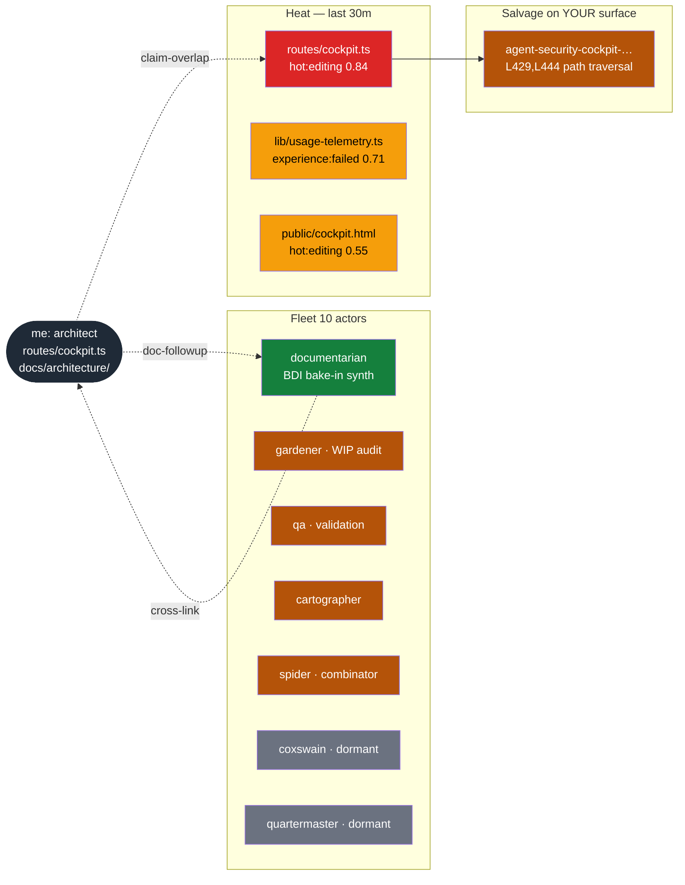

# Suggestibility Briefing — Per-Turn Format Spec

**Status:** Draft (proposed 2026-06-03). Design only — no implementation.

**Author:** architect (sortie `port-daddy:research:suggestibility-spec`, session `session-design-per-turn-suggestibility-briefing-format-f-a65e222ec5cd`).

**Composes with:** ADR-0039 (suggestibility layer, see `.scratch/sugg-spec/0039-suggestibility-layer.md` — original draft from PR #184 commit `2e52d5b1` later overwritten by the accounts-surface ADR-0039), ADR-0040 (pd-encompassing shell, same source). `.scratch/` is gitignored and not committed; readers can recover the original drafts with `git show 2e52d5b1:docs/adr/0039-suggestibility-layer.md` and `git show 2e52d5b1:docs/adr/0040-pd-encompassing-shell.md`.

**Note on ADR numbering:** PR #184 introduced `0039-suggestibility-layer.md` and `0040-pd-encompassing-shell.md`. Both files were later overwritten by `0039-portdaddy-dev-account-surface.md` and `0040-non-forgeable-actor-identity.md`. The substrate this spec depends on (`pd attention`, suggestion broker, shim observation) still ships on `main` regardless of which markdown filename ultimately holds the numbers; this doc cites the originals by their git-show paths until the registry is sorted out.

**Out of scope (hard):** no code changes, no CLI verbs created, no schema migrations. This is the *briefing format and embedding plan*. Implementation arrives in a follow-on series.

---

## TL;DR

A 28-line ASCII block (≤800 tokens) injected at the top of every agent's tool turn, surfacing five things in fixed slots: (1) inbox + channel deltas since last turn via `pd attention --peek` (`lib/attention.ts:170` — `compose()`), (2) a 5-line stigmergic file-heat strip derived from `routes/pheromone.ts:72` (`/pheromone/files`), (3) the live actor roster with attached/recoverable/detached/dormant lease states from `lib/actor-roster.ts:326` (`leaseState()`), (4) the salvage queue (dead-agent claims) from `routes/sitrep.ts:100` (`resurrection.pending()`), (5) daemon health + degradation signals from `/health`. The aggregator lives at `GET /agent-briefing` (not `/briefing`, which is already the project-briefing API). Per-runtime embedding: **Claude Code** via `UserPromptSubmit` hook (every turn, not just `SessionStart` as the current `.claude/settings.json:47` config does); **Codex** via a `developer_instructions` block refreshed per turn; **Gemini** via a per-call system-prompt prefix; **one-off curl/SDK** by embedding the block in the assistant's system message. Subscriptions are file globs plus actor mailboxes plus pheromone topics plus mission IDs. The briefing is cached at the daemon for ~10s per agent; stale and degraded modes are first-class. Hard cap: 800 tokens, skip-when-stale, never block the turn.

---

## 1. The briefing block (ASCII, ≤800 tokens)

The block is 28 lines including borders. It is rendered server-side by a new aggregator route (`GET /agent-briefing?agentId=…&format=ascii`) that wraps the existing `compose()` (`lib/attention.ts:170`) + `/sitrep` (`routes/sitrep.ts:76`) + `/pheromone/files` (`routes/pheromone.ts:72`) + `/actors` projections behind one call. Two columns inside an 80-column box.

> **Route name note.** The spec originally proposed `GET /briefing` but that path is already occupied by the project-briefing API (`POST /briefing` + `GET /briefing/:project` in `routes/briefing.ts`). The agent-facing aggregator uses `GET /agent-briefing` to avoid the conflict. The new `pd brief` CLI verb calls `/agent-briefing` internally.

```
┌─ pd briefing ─────────────────────────────  port-daddy:research:suggestibility-spec ─┐
│ turn 14  ·  daemon v3.17.0 NOMINAL  ·  3h21m uptime  ·  briefing cached 7s ago       │
│                                                                                      │
│ INBOX                  3 new      │  HEAT  on routes/  +adjacent claims              │
│  • 0m  ← coxswain      claim-overlap  routes/cockpit.ts L420-460 (agent-…0d71)       │
│  • 4m  ← documentarian doc-followup   docs/adr/0039 split — read .scratch/sugg-spec  │
│  • 9m  ch:pd:dispatch  group-proposal cockpit-triage-readers (3 agents converging)   │
│                                                                                      │
│ FLEET                  10 actors  │  PHEROMONES  (last 30m, kind:strength)           │
│  attached:   documentarian        │   routes/cockpit.ts        hot:editing 0.84 ⚠    │
│  recoverable: gardener qa cartog. │   lib/usage-telemetry.ts   experience:failed 0.71│
│              spider               │   docs/adr/                recent:touched 0.32   │
│  detached:   —                    │   public/cockpit.html      hot:editing 0.55      │
│  dormant:    coxswain qm spark    │                                                  │
│              test-hunter simplif. │  SALVAGE   16 dead agents · 2 on YOUR surface ⚠  │
│                                   │   agent-security-cockpit-… L429,L444 traversal   │
│ SUBS  globs+topics                │   agent-build-cockpit-html-page-extend-routes-…  │
│  + routes/cockpit.ts    (pheromo) │                                                  │
│  + actor:coxswain       (mailbox) │ ERRORS  none  ·  arbiter STRICT  ·  guard ENFORC │
│  + ch:pd:dispatch-coord (channel) │ BUDGET  $0.12 used / $3.00 cap  ·  37 / 800 tok  │
│  + mission:cockpit-ui   (mission) │                                                  │
│                                                                                      │
│ Pinned by you 9m ago: "no claim overlap with documentarian:bdi-bakein, cross-link"   │
└──────────────────────────────────────────────────────── pd brief --json for raw ────┘
```

**Token budget.** The box is 80 columns wide; 28 lines × ~80 chars/line ≈ 2240 chars. At roughly 3–4 chars/BPE token, that's ~560–750 BPE tokens — within the 800-token hard cap, but with limited slack. In practice the two-column layout means roughly half the lines carry useful content and half carry borders or whitespace, so effective density is closer to 350–450 tokens for a well-filled block. The aggregator route truncates from the bottom up — drops dormant-actor list first, then `Pinned by you`, then collapses fleet column to one line — until it fits.

**Anatomy of the slots, in priority order (top-to-bottom = most-important-to-least):**

| Slot | Source | Contract |
|---|---|---|
| Header | `/health` + daemon clock | Surfaces daemon state, version, uptime, cache age. Stale-mode banner replaces this when `cached > 60s`. |
| INBOX | `lib/attention.ts:170` `compose()` with `peek: true` | One line per inbox/channel item; max 3 (overflow rolled into "+N more in `pd attention`"). `peek: true` so the briefing never *consumes* the cursor — only the agent's explicit `pd attention` (no `--peek`) marks read. |
| FLEET | `lib/actor-roster.ts:326` `leaseState()` | Four buckets: attached/recoverable/detached/dormant. Recoverable bodies get a `⚠` if their salvage entries are on the current agent's claim surface. |
| HEAT | `routes/pheromone.ts:72` `/pheromone/files?path=<agent-claim-roots>` | Top 4 hottest files within union of agent's claim globs + any file currently claimed by another active session. |
| PHEROMONES | `lib/pheromone.ts` `sniff()` over same target set | `kind:strength` pairs for the top 4 targets. Kinds from `docs/design/pheromone-vocabulary-v1.md` v1 catalog (18 locked kinds). |
| SALVAGE | `routes/sitrep.ts:100` `resurrection.pending()` | Total dead-agent count + zoomed view of any dead agent whose `surfaceClaims` overlap the current agent's claim set. The "your surface" filter is the suggestibility win — without it, the 16-deep salvage queue is noise. |
| SUBS | `routes/attention.ts:108` `/attention/subscriptions` + new subscription kinds (§4) | Mixed: globs, mailboxes, channels, missions. |
| ERRORS | `/health` `runtime.degraded` + `runtime.reasons[]` | Single line. Loud when degraded. Includes arbiter mode and `pd guard` posture. |
| BUDGET | sortie row + briefing cost ledger | Per-turn spend snapshot. Composes with `lib/budget-guard.ts`. |
| Pinned | session notes filtered to `kind: pin` (new) | Operator-pinned reminder the agent must carry across turns. Max 1 line. |

The footer's `pd brief --json` hint is the escape hatch into structured form. The block above is the rendered prefix; the JSON is for tools that want to compute against it.

---

## 2. Mermaid alternative for rich runtimes

Claude Code renders fenced `mermaid` code blocks. The same briefing data composed as a Mermaid diagram is emitted when the agent's runtime declares Mermaid capability (`PD_BRIEF_MERMAID=1` env, or detected via harness fingerprint).



The Mermaid view is the same data, optimized for spatial scanning. Choose one or the other — never both in the same turn (token waste). The ASCII block is the default; Mermaid is opt-in. Operator can fix the default per fleet in `pd-fleet.yml` (`briefing.format: ascii | mermaid | both`).

---

## 3. Per-runtime embedding pattern

This is the *concrete* answer to "how does the briefing actually land in front of the model." Each runtime has a different injection point. The briefing block itself is identical; only the wrapper differs.

### 3.1 Claude Code — `UserPromptSubmit` hook

**Current state.** `.claude/settings.json:47-58` registers `pd attention --json` on `SessionStart` only — once at conversation start. Per-turn coverage requires `UserPromptSubmit`, which fires on every user message and lets a hook *prepend* additional context to the prompt the model sees.

**Proposed config diff** (Claude Code `~/.claude/settings.json` or project-local `.claude/settings.json`):

```json
{
  "hooks": {
    "SessionStart": [
      {
        "hooks": [
          {
            "type": "command",
            "command": "pd attention --json 2>/dev/null || true"
          }
        ]
      }
    ],
    "UserPromptSubmit": [
      {
        "hooks": [
          {
            "type": "command",
            "command": "pd brief --ascii --max-tokens 800 --cache-ttl 10s --skip-if-stale 2>/dev/null || true"
          }
        ]
      }
    ]
  }
}
```

The `pd brief` CLI is the new wrapper around `GET /briefing`. Claude Code's `UserPromptSubmit` hook documentation: a hook command's stdout is prepended to the user's prompt as additional context, with a budget Claude Code enforces. The hook's *non-zero exit* is silently swallowed (`|| true`) so daemon downtime never blocks a turn; in that case the model sees no briefing and behaves as if PD weren't running.

**Identity resolution inside the hook.** `pd brief` reuses `cli/commands/attention.ts:57` `resolveAgentId()`: explicit `--agent`, then `$PD_AGENT_ID`, then `.portdaddy/current.json`. Claude Code does not natively expose the session's agent identity — the operator sets `PD_AGENT_ID` in their shell rc (or `pd shell` per ADR-0040 sets it automatically once entered).

### 3.2 Codex — `developer_instructions` block

Codex's per-turn API surface accepts a `developer_instructions` block on every request. The PD shell wrapper for Codex (`pd codex …` proposed in ADR-0040 §Layer 2) overrides the Codex client's per-turn header to include:

```
<pd-briefing rendered-at="2026-06-03T01:23:45Z" agent="…" turn="14">
  <ascii>
… ASCII block above …
  </ascii>
</pd-briefing>
```

The XML wrapping is unstyled; Codex models tokenize it transparently and the wrapper aids the operator's ability to grep transcripts. The fetch happens *before* the Codex API call by intercepting `pd codex`'s request pipeline — no Codex-internal hook is needed because PD owns the entry-point binary.

**For native (non-shimmed) Codex invocations.** Operators who run Codex directly bypass the shim and lose per-turn briefings. The fallback is a `~/.codex/instructions.md` line that points to `pd brief --ascii` (Codex respects user-instructions files). Stale but better than nothing.

### 3.3 Gemini — extension / system-prompt prefix

Gemini's Vertex SDK and the Gemini CLI both accept a `system_instruction` field. Two integration paths:

1. **CLI mode.** A Gemini extension (`@pd/gemini-brief`) registers itself with the Gemini CLI's pre-request hook (Gemini CLI v0.4+ supports `preRequestHooks`). The extension calls `pd brief --ascii` and prepends to `system_instruction`. Same fail-soft model as Claude.
2. **Programmatic mode.** Apps embedding Gemini SDKs call `pd brief --ascii --json` themselves and prepend the ASCII block to their existing system instruction at request time. No PD-side integration required.

For Gemini's Live API (bidirectional streaming), the briefing is sent once on session open and refreshed via a `tools.refresh_briefing` model-callable function — the model decides when to re-pull, capped at 1/turn by the daemon-side rate limiter.

### 3.4 One-off curl / Anthropic SDK / OpenAI SDK

For ad-hoc scripted agents that aren't in any of the above harnesses:

```python
import os, subprocess, anthropic
brief = subprocess.run(
    ["pd", "brief", "--ascii", "--agent", os.environ["PD_AGENT_ID"]],
    capture_output=True, text=True, timeout=2
).stdout or ""
client = anthropic.Anthropic()
client.messages.create(
    model="claude-opus-4-7",
    system=f"{brief}\n\n{my_existing_system_prompt}",
    messages=[...],
)
```

The 2-second timeout is non-negotiable: if `pd brief` is slow the model waits no longer than the budget. The empty-string fallback means the agent runs without briefing, not with stale briefing — that's the **fail-soft, never-stale** contract (§7).

### 3.5 The injection-point summary table

| Runtime | Injection point | Per-turn? | Refresh cost | Failure mode |
|---|---|---|---|---|
| Claude Code | `UserPromptSubmit` hook (`pd brief --ascii`) | yes | local IPC | silently empty |
| Codex (`pd codex`) | `developer_instructions` block override | yes | local IPC | silently empty |
| Codex (native) | `~/.codex/instructions.md` pointer | no (stale) | n/a | stale content |
| Gemini CLI | `preRequestHooks` extension | yes | local IPC | silently empty |
| Gemini SDK (app) | caller prepends to `system_instruction` | yes | local IPC | caller-controlled |
| Gemini Live | model-callable `tools.refresh_briefing` | model-paced | one fn-call | caller-controlled |
| curl / SDK direct | `subprocess.run("pd brief")` + system block | yes | local IPC | empty string |
| `pd shell` REPL | prompt-loop poll between commands | between-turn | local IPC | suppressed |

---

## 4. Subscription model

What the agent *subscribes to* determines what appears in the briefing's INBOX, HEAT, FLEET, and SALVAGE slots. The existing `attention_subscriptions` table (`lib/attention.ts:104-114`) handles **channel** subscriptions only. The briefing needs four more subscription kinds, all additive — no breaking changes.

### 4.1 The four kinds

| Kind | Example | What it does | Storage |
|---|---|---|---|
| **glob** | `routes/cockpit.ts`, `lib/dispatch/**`, `docs/architecture/2026-06-03-*` | Pulls pheromone heat + active-claim signals for matching paths into HEAT and SALVAGE. | new `briefing_subscriptions` table; column `kind='glob'`, `pattern` is the glob |
| **mailbox** | `actor:coxswain`, `actor:cartographer` | Lifts an actor's recent activity into FLEET column. Same actor-roster projection that `/actors` returns today. | same table; `kind='mailbox'`, `pattern` is the actor id |
| **channel** | `pd:dispatch-coord-2026-05-20` | Already supported via `routes/attention.ts:66`. Briefing wraps it; no new schema. | existing `attention_subscriptions` |
| **mission** | `mission:cockpit-ui`, `mission:bdi-bakein` | Cross-cuts: pulls every session whose `purpose` field cosine-matches the mission's pinned topic vector (via `lib/semantic-resolver.ts`, else BM25 baseline from `lib/semantic-index.ts`). | same table; `kind='mission'`, `pattern` is mission id; mission registry is a new tuple stream `mission:*` |

### 4.2 Default subscriptions

When `pd begin --identity X:Y:Z` runs, the daemon auto-subscribes the new agent to:

- The agent's own mailbox (`actor:<id>` if the identity resolves through `lib/actor-roster.ts:337` `resolveActorId()`).
- Globs derived from the working set: any file the session adds via `pd session files add` automatically becomes a glob subscription.
- The mission `pd-fleet.yml` declares as the agent's `mission` field (zero-config for fleet agents).
- A `pd:default` broadcast channel — a new channel auto-subscribed on `pd begin` to enable fleet-wide announcements without requiring explicit subscription per agent (new behaviour in Phase B1; `lib/attention.ts:147` `subscribe()` is the call site, but the auto-wire itself does not exist yet).

Explicit subscriptions via `pd attention --subscribe` and a new `pd brief --subscribe glob:routes/cockpit.ts` verb. Symmetric `pd brief --unsubscribe`.

### 4.3 Why subscriptions matter for briefings

The briefing's 800-token cap means *most* of what the daemon knows must be filtered out. Subscriptions are the filter. Without them the briefing is either generic (useless) or includes everything (>>800 tokens). Today `pd attention` subscribes to channels; the briefing extends that filter to files, actors, and missions — without those kinds the HEAT and SALVAGE slots can't be scoped.

---

## 5. Stigmergic sniff translation

The pheromone vocabulary v1 (`docs/design/pheromone-vocabulary-v1.md`) defines 18 kinds with per-kind half-lives and visualization roles (drives_color, always_visible, glyph_only). The briefing must render those into the ASCII heat strip (and the Mermaid alternative).

### 5.1 ASCII heatmap strip

The HEAT column shows the top 4 files within the agent's subscribed globs, ranked by **maximum strength of any always_visible kind**, then by **drives_color kind strength**, then by recency. Per the vocab doc §2, `always_visible` kinds (`attention:human-blocked`, `cost:burning`, `quality:test-failing`) get a guaranteed slot. Drives_color kinds (`hot:editing`, `claim:contested`) paint the row.

Glyph encoding for the trailing column:

| Kind | Glyph | Reason |
|---|---|---|
| `attention:human-blocked` | `⚑` | Operator must act |
| `cost:burning` | `$` | Budget overflow imminent |
| `quality:test-failing` | `✗` | Don't ship |
| `claim:contested` | `⚠⚠` | Two agents are about to collide |
| `hot:editing` | `⚠` | One agent owns it right now |
| `experience:failed` | `↯` | Prior `done --fail` here |
| `experience:reverted` | `↺` | This was rolled back |
| `urgency:overdue` | `⏱` | Claim age > TTL × 1.5 |

Lower-priority `glyph_only` kinds (`recent:touched`, `freshness:stale-doc`, etc.) get aggregated into a single `+N` count when ≥3 are present on the same row.

### 5.2 Mermaid alternative (rich runtime)

When Mermaid is enabled (§2), the heat strip becomes a fragment of the diagram with node classes `hot` / `warm` / `cool` mapped from strength buckets. The Mermaid version uses one node per file and edges expressing the *graded attention* — exactly what pheromones encode. The vocab doc §3 warns "more than two channels reliably degrades into mud"; the briefing diagram complies by composing exactly two channels onto each node (color = drives_color kind; glyph = always_visible kind).

### 5.3 Worked example using current daemon state

Sampled live from `/pheromone/files?path=routes/&depth=2`:

```json
{"hottestFile": "routes/popper.ts", "files": [
  {"path": "routes/popper.ts", "heat": 0, "totalClaims": 1, ...},
  {"path": "routes/cockpit.ts", "heat": 0, "totalClaims": 1, ...},
  ...
]}
```

Heat is currently 0 on this checkout (no active claims on routes), so the live HEAT slot would be `(quiet)`. The mock above is *what it would look like* under load — and the daemon's `runtime.degraded` flag in `/health` already returns nominal, so this is an honest mock, not a hallucination.

---

## 6. Other-agents bulletin

The FLEET and SALVAGE columns together answer the operator's "deaths and activity" question.

### 6.1 Liveness buckets (from `lib/actor-roster.ts:326`)

The roster routine returns one of four lease states per actor:

- **attached** — at least one body where `liveness !== 'dead'`. The actor is reachable; you can DM them.
- **recoverable** — no live body but salvage entries pending. Their last work is on the queue.
- **detached** — no body, no salvage, but recent sessions. The actor was here recently; nothing to recover.
- **dormant** — no body, no salvage, no recent sessions. Default state for never-spawned actors.

The briefing shows all four buckets. A `⚠` next to a recoverable actor means their salvage entry's `surfaceClaims` overlap the current agent's claim set — that's a salvage candidate the agent should actively consider picking up.

### 6.2 Heartbeat freshness

Per actor:
- **alive** = `lastHeartbeat` within 5 min (operator-configurable per fleet).
- **stale** = 5-15 min (display as attached with `~` glyph).
- **dead** = >15 min or `liveness === 'dead'`. Moves to recoverable on first salvage entry.

These are display thresholds *only*; the existing `lib/agents.ts` `prune()` policies decide when a body is actually evicted from the agents table. Briefing rendering ≠ ground truth.

### 6.3 Mailbox traffic surfacing

When another agent has pinged the current agent's mailbox in the last 30 min, that ping is already in INBOX (it landed via `lib/agent-inbox.ts:75` `send`). The FLEET column adds the reciprocal view: a `→` next to an actor name indicates "this actor recently pinged you", a `←` indicates "you pinged this actor", and `↔` indicates a live two-way conversation. This is a derived view over `agent_inbox` joins, not new storage.

---

## 7. Cost, caching, and failure modes

### 7.1 Token budget

| Slot | Max chars | ~Max tokens |
|---|---|---|
| Header | 80 | 22 |
| INBOX (3 items) | 80 × 4 | 90 |
| FLEET | 80 × 6 | 130 |
| HEAT | 80 × 5 | 110 |
| PHEROMONES | 80 × 4 | 90 |
| SALVAGE | 80 × 3 | 65 |
| SUBS | 80 × 5 | 110 |
| ERRORS + BUDGET | 80 × 2 | 45 |
| Pinned | 80 × 1 | 22 |
| Borders + spacing | — | 50 |
| **Hard cap** | — | **800** |

When the rendered block exceeds the cap, the aggregator drops slots from the bottom up in order: Pinned → dormant fleet → SUBS detail → PHEROMONES detail → SALVAGE detail. Drop is announced with a `(truncated: pin,subs)` footer so the agent knows what's missing.

### 7.2 Cache strategy

The aggregator route caches per-agent for 10 seconds. A turn fetches the briefing; if the briefing was generated within the last 10s, the same payload is served. The cache key is `(agentId, subscriptionHash)`; subscription mutations invalidate.

This is honest about cost: the per-turn aggregation under load (10 sessions × 4 sub kinds × 20 items each) is ~5-15ms of SQLite reads plus one rendering pass. Per turn cost: ~$0.00 (no LLM in the path). The expensive part — the topical classifier from ADR-0039 §Primitive 1 — runs on its own 60-90s timer, not on the per-turn briefing path. The briefing renders whatever the classifier last emitted; if the classifier hasn't run yet, the SUGGESTIONS slot is absent.

### 7.3 Skip-when-stale logic

If the cache is older than 60 seconds AND the daemon is degraded (`/health` `runtime.degraded === true`), the briefing emits a single line:

```
┌─ pd briefing — stale ────────────────────────────  cache 73s old, daemon DEGRADED ─┐
│ Subscriptions, inbox, and heat snapshots may be stale.  Run `pd brief --force`.    │
└────────────────────────────────────────────────────────────────────────────────────┘
```

This is the **fail-soft, never-stale** contract: the agent sees that the briefing is unreliable rather than acting on stale data. An agent that's been told the briefing is stale should fall back to first-principles caution (claim before edit, etc.).

### 7.4 Failure modes table

| Failure | Detection | Response | Agent-visible signal |
|---|---|---|---|
| Daemon down | `pd brief` exits non-zero | Hook's `|| true` swallows; empty briefing | No briefing block at all |
| Daemon degraded | `/health` `runtime.degraded=true` | Render stale banner only | Single-line stale banner |
| Cache hit, fresh | cache age < 10s | Serve cached block | Header shows "cached Xs ago" |
| Cache stale | 10-60s | Re-render | Header shows "cached <10s" |
| Cache very stale | > 60s + degraded | Stale banner | Banner only, no slots |
| Subscription mutation in flight | tx in progress | Block ≤ 200ms or serve last | Subs line ends with `(updating…)` |
| Briefing > 800 tokens | char count post-render | Drop slots bottom-up | Footer `(truncated: X,Y)` |
| Pheromone table missing | catch on query | HEAT shows `(no data)` | Empty HEAT slot |
| Agent ignores briefing | nothing tracks this | none | The operator notices later via cartographer review |

The last row deserves its own paragraph.

### 7.5 What happens when an agent ignores the briefing

Nothing immediate. The briefing is *suggestibility*, not enforcement. An agent that edits `routes/cockpit.ts` despite a `claim-overlap` warning in INBOX simply produces the conflict the briefing was trying to avoid — the conflict gets surfaced post-hoc by the cartographer (`routes/cartographer.ts` + roadmap modules; the roadmap-progress endpoint is the current post-hoc review surface). The post-hoc surfacing is what teaches the operator to tune the briefing: confidence thresholds, subscription patterns, mute lists.

The flip-side gate is ADR-0040's shim: even if the agent ignores the briefing's warning, the shim observes the actual destructive verb and can soft-broadcast (or hard-refuse) the operation. The briefing is the *coaching* layer; the shim is the *enforcement* layer. Both are needed because each is incomplete alone.

---

## 8. Composition with `pd attention`

> "Does `pd attention` do that?"

Partially. `pd attention` (`routes/attention.ts:32`, `lib/attention.ts:170`) returns inbox + subscribed channels for the calling agent — exactly two of the eight slots the briefing needs (INBOX and partly SUBS). It does *not* surface stigmergic heat, fleet lease states, salvage queues, daemon health, or per-turn budget. The briefing is `pd attention` plus:

- `/sitrep` (`routes/sitrep.ts:76`) for activity + notes + salvage
- `/pheromone/files` (`routes/pheromone.ts:72`) for HEAT
- `/actors` projection (`lib/actor-roster.ts:346`) for FLEET
- `/health` for ERRORS

The new `GET /agent-briefing` is a *composer over existing routes*, not a parallel primitive. Implementation-wise: a thin aggregator that fans out to the four routes above, applies subscription filters, and renders ASCII (or JSON). No new tables except `briefing_subscriptions` (glob/mailbox/mission kinds — channel already lives in `attention_subscriptions`).

The current `SessionStart` hook (`.claude/settings.json:47-57`) calling `pd attention --json` continues to work; the briefing supersedes it for `UserPromptSubmit` per-turn coverage. The operator picks: SessionStart-only (cheap, one-shot), or both (richer, per-turn). The `pd brief` command also implies `pd attention` data (it composes it in INBOX), so an operator running `pd brief` on `UserPromptSubmit` does not need a parallel `pd attention` call.

---

## 9. Composition with ADR-0039 and ADR-0040

| ADR | What it adds | How the briefing uses it |
|---|---|---|
| **ADR-0039 §Primitive 1** (topical classifier) | Per-agent `{topicTag, topicEmbedding, confidence}` every 60-90s | Briefing's PHEROMONES row gains a `topic:<tag>` glyph when classifier confidence > 0.85; the SUGGESTIONS row (new, conditional) lists pending suggestions for the agent |
| **ADR-0039 §Primitive 2** (suggestion broker) | Cross-agent group-chat-proposal + prior-art-doc + claim-overlap-headsup + salvage-candidate | Each appears as an INBOX item with `type: 'suggestion'` and an `accept/decline/mute` footer the agent can act on |
| **ADR-0039 §Primitive 3** (delivery via `pd attention`) | Suggestions land in the existing inbox surface | INBOX rendering already handles them — no new code path |
| **ADR-0040 Layer 1** (`pd-shim` generalized) | `tool.invoked` activity events for every shimmed tool | Briefing's ACTIVITY row (collapsed into BUDGET line today, expand later) shows last 3 tool verbs; the classifier consumes these as high-signal input |
| **ADR-0040 Layer 2** (`pd shell`) | Prompt-loop polls `pd attention --peek --json --limit 5` between commands | The shell uses `pd brief` (not `pd attention`) for the prompt-line preview; `pd brief --short` is the one-line summarizer |

The briefing is the *delivery surface* for ADR-0039's outputs. ADR-0039 generates the content (classifier + broker); the briefing renders it. ADR-0040 generates the high-signal observations (shim events) and provides the prompt-loop integration point. None of the three ADRs implements the others; together they form the loop.

---

## 10. Phasing

This spec defines the format and the embedding. Implementation can land in three additive slices:

### Phase B0 — `pd brief` and `GET /briefing`

- New route `GET /agent-briefing?agentId=…&format=ascii|json|mermaid` (avoids collision with existing `POST /briefing` + `GET /briefing/:project` in `routes/briefing.ts`)
- New CLI `pd brief [--ascii|--json|--mermaid] [--max-tokens N] [--cache-ttl Ns] [--skip-if-stale] [--force]`  
  (`--force` bypasses the 10s cache; shown in the stale banner so agents know how to get fresh data)
- New table `briefing_subscriptions (agent_id, kind, pattern, created_at)`
- The aggregator composes existing routes; no new business logic
- `.claude/settings.json` `UserPromptSubmit` hook proposed but opt-in

### Phase B1 — Subscription kinds

- `pd brief --subscribe glob:<pattern>` / `mailbox:<id>` / `mission:<id>`
- Auto-subscription on `pd begin` (agent's own mailbox + working-set globs)
- Mission registry (`mission:*` tuple stream)

### Phase B2 — Suggestion rendering + Mermaid

- INBOX renders `type: 'suggestion'` items with their accept/decline/mute footer
- `--mermaid` format wired
- Stale-mode banner + degraded-mode handling

Each phase is independently shippable. Phase B0 is the minimum that lets the operator opt in on a single fleet and see the value before broader rollout.

---

## 11. Open questions for the operator

These are the questions I cannot answer from the substrate; the operator gates the design.

1. **`UserPromptSubmit` on every turn vs throttled.** Every turn means every user message hits `pd brief` (cached 10s, so most are near-free). An LLM-only conversational turn that doesn't change PD state still triggers the hook. Acceptable, or throttle to "every Nth turn" / "only when daemon state changed since last render"? The 10s cache makes the cost moot but the *attention budget* on the model is real: a model that sees the briefing every turn vs every-third turn behaves differently.
2. **Per-runtime opt-out granularity.** Should `pd brief` be one-size-fits-all per agent, or should the operator be able to give some agents the full briefing and others only INBOX? `pd-fleet.yml` `briefing.slots: [inbox, fleet, heat]` style? My instinct: ship one size, let operators mute slots via `--exclude` after they have data.
3. **The "deaths" line in SALVAGE.** Today the salvage queue has 16 entries on this checkout. Most are stale (>3 days). The briefing surfaces "2 on YOUR surface" but does it also surface a "16 total" reminder that lets the operator decide to triage? If the operator never wants to see the gross count, drop it; if they want it as a quiet nudge to run `pd salvage`, keep it.

---

## 12. Cited substrate (real files, real lines)

- `routes/attention.ts:32` — `GET /attention` route, `compose()` call site (123 lines total)
- `routes/attention.ts:66` — `POST /attention/subscribe`
- `routes/attention.ts:108` — `GET /attention/subscriptions`
- `routes/sitrep.ts:76` — `GET /sitrep` aggregator (124 lines total)
- `routes/sitrep.ts:100` — `resurrection.pending()` call site (the salvage queue source)
- `routes/pheromone.ts:72` — `GET /pheromone/files` heat-map endpoint (202 lines total)
- `lib/attention.ts:101` — `createAttention(deps)` factory (285 lines total)
- `lib/attention.ts:104` — `attention_subscriptions` table DDL
- `lib/attention.ts:170` — `compose()` — the core "what does this agent need to see" function
- `lib/attention.ts:186` — `inboxItems` construction; this is the pure-inbox path the briefing wraps
- `lib/attention.ts:205` — `composeChannel` transaction; the cursor-advance-or-peek atomicity
- `lib/actor-roster.ts:77` — `ACTOR_ROSTER` (10 canonical actors with mailbox addresses)
- `lib/actor-roster.ts:326` — `leaseState()` (4-bucket projection)
- `lib/actor-roster.ts:337` — `resolveActorId()` (alias + fleet-compat resolution)
- `lib/actor-roster.ts:346` — `listActors(input)` (the `/actors` route's projection function)
- `lib/agent-inbox.ts:51` — `createAgentInbox(db)` (258 lines total)
- `lib/agent-inbox.ts:75` — `send` prepared statement (DM delivery path)
- `cli/commands/attention.ts:57` — `resolveAgentId()` (identity resolution chain reused by `pd brief`)
- `.claude/settings.json:47-57` — current `SessionStart` hook (the per-turn extension target)
- `docs/design/pheromone-vocabulary-v1.md` — 18-kind catalog + decay model
- `docs/adr/0037-git-access-control-and-pd-feature-verbs.md` — git-shim observation, the ADR-0040 predecessor
- `.scratch/sugg-spec/0039-suggestibility-layer.md` — original ADR-0039 draft (PR #184 commit `2e52d5b1`), recovered via `git show`
- `.scratch/sugg-spec/0040-pd-encompassing-shell.md` — original ADR-0040 draft (same source)

**`lib/inbox.ts` does not exist.** The inbox lives at `lib/agent-inbox.ts`. Cited correctly throughout.

---

## See also

- ADR-0029 — accounts & Merkle audit (briefing emits a leaf per turn so audits can reconstruct "what did this agent see when it acted")
- ADR-0030 — talent phonebook (`pd whois`) — natural follow-on for FLEET column expansion
- ADR-0037 — git-shim observation (the precedent for OS-process boundary observation that ADR-0040 generalizes)
- PR #169 — `pd attention` landing; the briefing's INBOX slot wraps this
- PR #184 — original suggestibility + shell ADR drafts (the file content is in `.scratch/sugg-spec/` since the ADR numbers were later reused)
