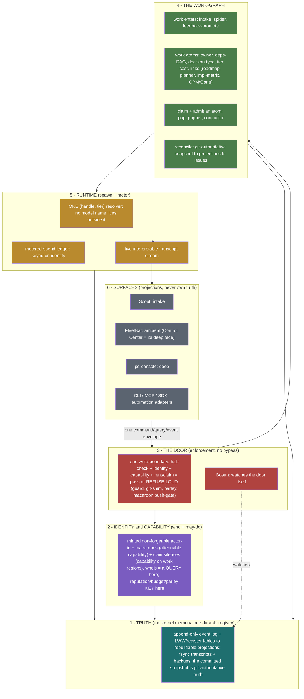
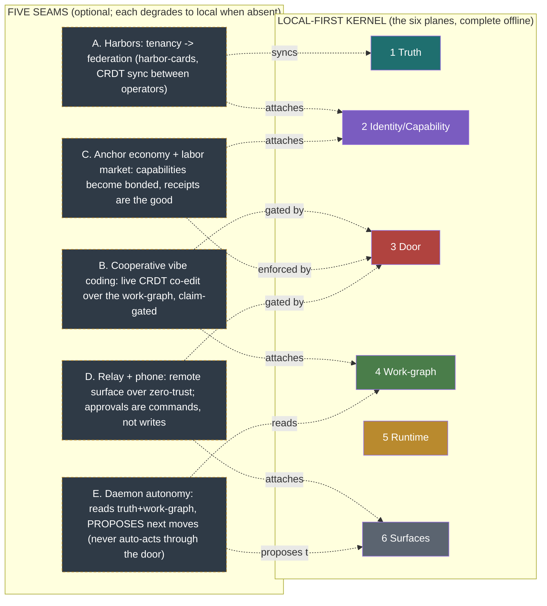

# Port Daddy — Coarsened System Architecture

Status: architecture-of-record sketch (2026-07-14). This is the graph-coarsening
pass the operator ordered: collapse ~91 ADRs and ~40 lib modules — a fog of
nautical/animal metaphors — into the *few real nodes*, merging any two features
that are the same thing under different names. No feature is sacred if it merges.

## One sentence

**Port Daddy is a local-first coordination KERNEL: one daemon owns one durable
truth; unforgeable identity gates an enforced door every mutation must pass;
behind the door is one shared work-graph; operators observe and steer through
distance-ranked surfaces that are pure projections. Every model call, every
write, every control command flows through the daemon — or is refused, loudly.**

Everything below is that sentence, expanded into six planes.

## The coarsened graph



## The merges (graph coarsening — same thing, different names → one node)

| Coarsened node | Absorbs (ADRs / features / metaphors) | Why they are ONE |
|---|---|---|
| **1 · Truth store** | db-distribution/durable-home/reunify/tombstones/backup · event-ledger(0095) · transcript-store(0058) · roadmap_items · claim_forest · sessions/notes · episodic-memory | All are "the one durable registry" in two shapes (append log + register tables); surfaces are projections of it. |
| **2 · Identity & capability** | actor-identity(0040) · actor-souls(0022) · harbor-cards(0094) · macaroons(0053) · bonds/wallet · claim-leases(0038) · **whois/phonebook(0030)** · reputation | A minted non-forgeable id is the primitive; macaroons attenuate it; leases are capabilities on work-regions; **whois is just a query**; budget/reputation/parley-parties all key here. |
| **3 · The door** | guard-rent · git-shim(0037) · out-of-band-enforce(0053) · parley(0055) · **halt/Bosun** · macaroon push-gate | One enforced write-boundary around every mutation (commit/push/spawn/direct-DB-write/control-command): verify live+identity+capability+rent or refuse loud. |
| **4 · Work-graph** | idea-intake(0085) · **Spider**(generative) · feedback-promote — *(one "work enters" funnel)*; roadmap_items · planner(0086) · claim(0033) · impl-matrix(0043) · CPM/Gantt — *(one work-graph)*; pop · popper · conductor-admission — *(one "claim an atom")*; reconciler · git-snapshot · Issues-mirror — *(one reconcile loop)* | Four funnels/verbs that were 6+ ADRs are four edges of ONE graph: work enters → is structured → is claimed → is reconciled. |
| **5 · Runtime** | spawner · conductor · backend-catalog · **model-registry (was 2 copies)** · **tier-vocab (was 4)** — *(one (handle,tier) resolver)*; cost-accrual(0095) · budget-guard · telemetry · counters — *(one metered ledger)*; fleet_transcripts · archive · SSE — *(one live stream)* | Callers speak (handle, tier); the resolver owns concrete ids; spend is one ledger keyed on identity; the transcript is one followable stream. |
| **6 · Surfaces** | Scout(intake) · FleetBar(ambient) · pd-console(deep) · **Control Center = FleetBar's deep face** · CLI/MCP/SDK(adapters) · wf-beacon(render testbed) | Distance-from-work ranks them; none owns state; all render truth + submit one envelope. |

## Making room for the wider world — five seams, not a rewrite

Local-first is the *moat*, not a limitation. The six-plane kernel is complete and
self-sufficient on one machine, offline, forever. Everything the operator wants
next — harbors, cooperative vibe coding, the anchor economy, selling agentic
labor, the phone, a daemon that proposes work — attaches at **defined seams on
the existing planes**. The invariant that makes it safe: **every seam degrades to
"just my machine" when offline or solo.** No kernel plane may ever depend on a
seam being present.



**A. Harbors — tenancy that becomes federation.** A *harbor* is already the scope
key on Truth (the `harbor` column) and the membership set in Identity
(harbor-cards, ADR-0094). Locally it's just a namespace: "my work" vs "this
repo's fleet." The seam: two operators' daemons **sync a shared harbor** by
gossiping its append-only event log and reconciling its LWW registers — the exact
merge the reunify already does, run over the relay instead of over local shards.
Harbor-cards (verifiable credentials) are the join token; a harbor you're not a
member of is invisible. Federation is *harbor sync*, nothing more — and with no
peers, a harbor is a local folder.

**B. Cooperative vibe coding — CRDT co-edit, claim-gated.** Live multi-party
editing (human + human, human + agent) is a **real-time projection of the
Work-graph + Truth planes**: a Loro/CRDT buffer whose regional claims are Door
capabilities (a lease on a file region = the right to edit it live). The
governance is client-agnostic and lives in the daemon (the "Harbor editor is the
backend" ruling): pd-console is one renderer; VS Code / web / phone are future
ones over the same MCP+CRDT contract. Offline, it's just you editing; the CRDT
merges your reconnect cleanly. The Door prevents two writers silently clobbering
a region — the same claim discipline, at keystroke granularity.

**C. The anchor economy — capabilities become the traded good.** The Anchor
protocol (Harbor Cards, FloatPlans, escrow, Merkle artifacts, bilateral receipts,
settlement, browser-verifiable proof) is the **Identity/Capability plane extended
into a market**: a capability, minted and attenuated as a macaroon, becomes
*bondable* and *sellable*, and a **signed work-receipt is the good** — provenance
you can verify without trusting the seller. It's enforced by the Door (a bond is
a caveat the push must discharge) and settled against the metered ledger. Locally
this is dormant; it only lights up when a second party is on the other side of a
receipt.

**D. Selling agentic labor — the bonded three-sided market.** This is (C) plus
reputation: a non-forgeable id (Identity keystone) accrues an **outcome ledger**
(oracle-closed receipts — merged SHAs, passing tests), a reputation estimator
prices it, and bonds + graduated sanctions make cheating unprofitable
(mechanism-design, not vibes). Buyer, seller-agent, and the harbor-as-marketplace
are the three sides. Every piece keys on the Identity node — which is *why*
identity is the keystone the whole horizon depends on: **you cannot price what you
cannot trust, and you cannot trust a forgeable string.**

**E. The phone, and a daemon that knows what to do.** The phone is a **Surface
over the relay**: a thin remote renderer of daemon truth, reaching in
zero-trust (macaroon-gated). Critically, **operator actions from the phone travel
as control-commands through the Door — never as DB writes** (the lease-authorizer
keystone) — so an approval, a pause, a kill from your pocket is the same gated
verb as from pd-console, just carried over the relay. And "the daemon having some
idea what to do" is **autonomy = the Suggestion Nervous System reading the
Work-graph** (the next-move meta-DAG: sensemaker -> decompose -> skill-select ->
premortem -> synthesize) and *proposing* — a suggestion in your inbox, a nudge, a
drafted dispatch — but it **proposes to a Surface, it never auto-acts through the
Door**. Autonomy is advisory by construction; the human (or an explicit,
bonded, capability-gated policy) still passes the door.

**The through-line:** identity is the pivot for A/C/D, the Door is the safety for
B/C/E, and Truth's sync is the mechanism for A/B. Build the kernel keystones
(identity, the door, the work-graph) and the five seams are *wiring*, not new
systems — the same "cheapest velocity is wiring" pattern, one level up.

## The Lookout collapse (a worked coarsening)

"Lookout" appeared **three** times under different names: release-drift watcher,
PR-review sniffer, and the chartered coordination overlap-judge — plus a
"resume-advisor" and "unSpider(0032)". They are **one detector** (coordination.
contradiction) with duty-stations, and it lives in Plane 3/4's advisory edge.
Same for: **Bosun** = enforcement.daemon-supervisor; **whois** = identity.query;
**Cartographer** = work-graph.projection-renderer; **Arbiter/Coast-Guard** =
the door's policy engine; **Parley** = the door's conflict-resolution mode.

## The build-integrity spine (cross-cutting — the operator's codegen ask)

One canonical source per cross-language concern; everything else is GENERATED
and drift-gated:

```
  canonical source (TS)  ──codegen──►  derived artifact (Rust config / JSON / test vectors)
        │                                        │
        └──── content-hash of source embedded in BOTH ────┘
  pre-commit + CI: regenerate → if hash mismatch → BLOCK with fix message
```

Applies to: the (handle,tier) **model registry** (→ pd-console model-tiers.json),
**macaroon test vectors** (Rust ⇄ TS byte-parity), **contracts/schemas**, the
**backend/handle set**. Principle: *single source, generated everywhere, drift is
a build failure.* This is the permanent cure for the two-registries rot #2477
just patched by hand.

## Design invariants (the interview answers)

1. **One truth.** Every write lands in the durable registry or is refused. Daemons are projections; the committed snapshot is git-authoritative.
2. **No bypass.** Every mutation passes the door; a dead daemon HALTS work loudly (Bosun watches the door).
3. **No forgeable authority.** Every capability chains to a minted id; nothing keys on a self-asserted string.
4. **No model names outside the resolver.** Callers speak (handle, tier).
5. **No error as success.** Every gate verifies authoritative state; INCONCLUSIVE/timeout/crash = FAIL, never PASS.
6. **No feature owns two names.** A capability's canonical name is `plane.role`; metaphor is UI flavor only. Drift re-enters through unqualified names.

## Cleanup / refactor targets (kill the metaphor sprawl as we go)

- Collapse the ~7 backend-list literals and 4 tier vocabularies to the single resolver (#2477 started this).
- Collapse the ~30 direct-`better-sqlite3` writers behind the door's liveness gate.
- Rename code/ADR identities to `plane.role`; retire dead metaphor archetypes (shipwright `spider`/`unspider` inert entries).
- One backend/handle set, one tier ladder, one model registry, one macaroon impl-with-vectors — all codegen-drift-gated.

## What hangs off this

The `roadmap-schema-wiring` item's schema fields (owner, deps, decision-type,
tier, cost, links, skill-requirements) are literally Plane-4 node attributes.
The 18 skills-to-build map one-to-one onto plane roles. The waves build
plane-by-plane, keystone-first: Truth (done) → Door/Bosun (in flight) →
Identity → Work-graph → Runtime resolver → Surfaces (the followable product).
