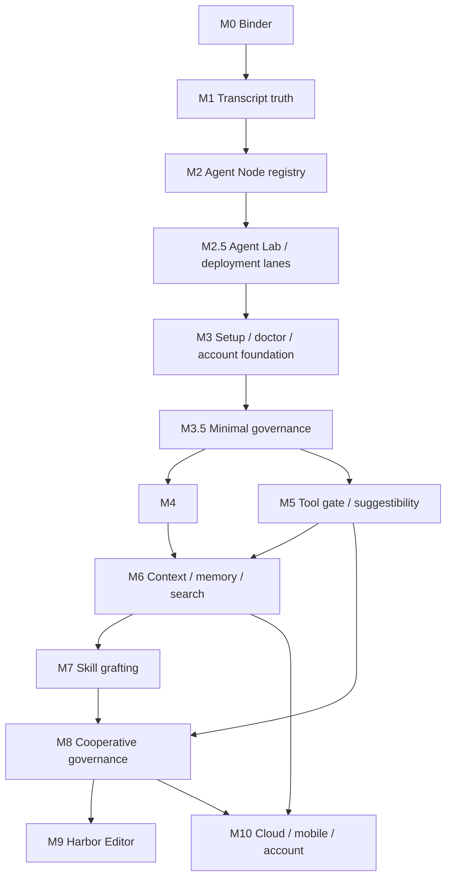

# 07 Milestones And Work DAG

## Rollout principle

Do not build the final mythology first. Build the evidence chain:

1. transcript capture;
2. Agent Node registry;
3. compliance probes;
4. operator control panel;
5. guided remediation;
6. context and memory;
7. cooperative editing and claims;
8. cloud/mobile/team.

Every milestone should produce a visible user artifact and a test.

## Milestone 0 - Canon and binder

Goal:
  Align the product, runtime, security, memory, and UI architecture.

Deliverables:

- this binder;
- glossary and Agent Node definition;
- decision record for "daemon owns local harbor authority";
- list of existing code paths to converge into anode adapters;
- open questions promoted to roadmap.

Gate:

- docs lint;
- adversarial review recorded;
- Port Daddy note with scope and next action.

## Milestone 1 - Transcript and session truth

Goal:
  Make transcript absence impossible to miss.

Tasks:

- define transcript event schema;
- add `agent_nodes` table if not already present;
- join sessions, agents, transcript streams, worktrees, and providers;
- ingest existing Codex/Claude transcript sources where available;
- record timestamps, provider, model tier, body kind, and files touched;
- show "no transcript because..." instead of blank panels;
- add transcript search by session id and agent id.

Gate:

- launch a Codex body and see events;
- attach or launch Claude Code and see events if hooks are installed;
- show a non-compliant legacy run as weak/observed;
- unit tests for event schema and query joins.

## Milestone 2 - Agent Node registry and compliance probe

Goal:
  Distinguish compliant from non-compliant agents.

Tasks:

- implement Agent Node registry API;
- implement `pd agent probe`;
- add compliance levels C0-C6;
- add remediation report;
- add heartbeat and context pressure;
- add provider/body metadata;
- add UI roster card fields.

Gate:

- one compliant local Codex Agent Node;
- one compliant local Claude Code Agent Node;
- one compliant local Antigravity Agent Node;
- one compliant Cloudflare (cloud fleet) Agent Node;
- one compliant LM Studio Agent Node;
- one weak observed agent;
- one fake/custom probe fixture;
- app displays compliance and failed checks.

Launch-path gate:

Every launch path must enter through the same Work Intent service before the
first model turn, or be explicitly marked observed/unmanaged. Legacy command
names, compatibility bridges, cloud fleet bodies, hooks, custom APIs, and
imported sessions are intake sources, not separate runtime concepts.

The gate passes only when each intake source can be traced:

- Work Intent id;
- Work Plan id;
- Agent Node ids, if any were materialized;
- body/anode adapter id, if a runtime was attached;
- transcript stream id;
- compliance level or unmanaged reason.

## Milestone 2.5 - Agent Lab and deployment lanes

Goal:
  Let people develop, probe, and rehearse new agents before admitting them to a
  production harbor.

Tasks:

- make `pd spawn --dry-run` and `POST /spawn { "dryRun": true }` return the
  resolved launch plan without starting an agent;
- show repo/worktree scope in the registry and active-agent roster;
- add a local Agent Lab pane in pd-console for dry-run plans, failed compliance
  checks, tool grants, and expected transcript streams;
- add Cloudflare development mode using Wrangler local/miniflare and observed
  remote telemetry rows;
- add Cloudflare production deployment cards for relay, fleet executor, and
  GitHub App fleet workers;
- require a compliance probe before a dry-run plan can be promoted to a
  production Agent Node;
- preserve dev/prod provenance in Work Receipts.

Gate:

- dry-run for Codex, Claude Code, Ollama, custom, and Cloudflare bodies returns a
  launch plan and no process;
- local production launch creates a scoped Agent Node with transcript stream;
- Cloudflare dev worker projects an observed remote row;
- Cloudflare production worker can be interrupted, budgeted, and retired from
  pd-console;
- an unmanaged custom agent is clearly labeled and remediated instead of shown as
  compliant.

## Milestone 3 - Setup, doctor, and account foundation

Goal:
  Make installation, remediation, local-only use, and optional identity sane.

Tasks:

- `pd setup` installs app, daemon, CLI, hooks, MCP config, and shell completion;
- `pd doctor` checks daemon, app signature, hooks, MCP, transcript path,
  Keychain, provider keys, worktree root, sandbox support, relay pairing, and
  stale versions;
- hook names and descriptions reviewed for transparency;
- one-click repair where possible;
- local-only no-account path;
- optional passkey sign-in;
- device pairing for mobile/relay readiness;
- signed download/update identity;
- explicit data-boundary screen.

Gate:

- fresh machine or fixture install path;
- broken hook fixture repaired;
- missing provider key explained;
- screenshots and motion artifacts for app remediation view.

## Milestone 3.5 - Minimal governance substrate

Goal:
  Prevent the control panel from becoming decorative.

Tasks:

- daemon-issued ids and signed Articles;
- adapter nonce challenge;
- minimal pre-tool gate for destructive git;
- pause/kill command envelope;
- negative probe that denied destructive git had no side effect;
- MCP config/hash drift detection.

Gate:

- one body reaches C2;
- one body reaches C4 for pause/interrupt;
- non-governed bodies show controls disabled with remediation.

## Milestone 4 - Operator control panel

Goal:
  See, click, stream, inspect, and control agents in the native app.

Tasks:

- build conjoined roster and detail panes;
- render live stream and historical transcript;
- show files, diffs, notes, claims, PRs, cost, provider, model tier, context;
- add click controls: open, pause, interrupt, steer, checkpoint, successor,
  retire;
- open relative file paths as global paths with syntax highlighting;
- show active versus historical sessions clearly.

Gate:

- user can click an active agent and watch stream frames;
- user can click a past agent and read transcript;
- user can see files touched;
- user can interrupt a compliant agent;
- controls are enabled only for the compliance level that supports them;
- inspection works for observed agents without pretending control exists;
- GPUI artifacts include screenshot, GIF, and recording.

## Milestone 5 - Tool gate and suggestibility

Goal:
  Port Daddy gets in front of agent turns and tools.

Tasks:

- pre-tool and post-tool protocol;
- destructive git blocker;
- turn-start envelope with inbox, repo updates, parley suggestions, skill grafts,
  memory packet, conflict warnings;
- tool result persistence;
- operator approval flow;
- provider adapters for Claude hooks and Codex launch path.

Gate:

- destructive git blocked in a fixture;
- turn-start guidance reaches agent;
- tool calls visible in transcript;
- missing hook detected and repaired.

## Milestone 6 - Context, memory, and transcript search

Goal:
  Make agents resumable and memory useful.

Tasks:

- context pressure tracking;
- compaction packets with citations;
- Longshoreman compactor;
- transcript search across events, notes, files, PRs, and outcomes;
- episodic memory extraction;
- graph facts with validity intervals;
- blackboard view.

Gate:

- force context threshold and see compaction packet;
- resume successor from packet and transcript;
- search "how did we deploy X" and get cited results;
- memory retrieval never exceeds configured budget.

## Milestone 7 - Skills and grafting

Goal:
  Make skill use explicit, searchable, and validated.

Tasks:

- skill index service;
- skill graft envelope;
- skill proposal and independent validation;
- private/repo/team/public skill scopes;
- skill usage outcome tracking;
- `pd doctor` checks skill availability;
- UI shows active grafts.

Gate:

- user-mentioned skill graft reaches an Agent Node;
- missing skill produces remediation;
- new skill candidate created from transcript episode;
- reviewer validates before shared admission.

## Milestone 8 - Cooperative governance

Goal:
  Make multiple agents safe enough to work at once.

Tasks:

- symbol/region claims;
- semantic conflict predictor;
- parley protocol;
- blackboard conflict cards;
- Longshoreman conflict watcher;
- claim gutter in editor plugin or app;
- sanctions/reputation ledger.

Gate:

- two agents claim overlapping symbols and get parley;
- direct high-confidence conflict blocks;
- low-confidence conflict warns;
- conflict is visible in app and transcript.

## Milestone 9 - Harbor Editor wedge

Goal:
  Demonstrate human and agents co-editing with governance.

Tasks:

- read-only editor pane;
- Loro local buffer;
- syntax highlighting;
- authorship gutter;
- daemon-bus collaboration;
- claims as awareness ranges;
- salvage dead agent edits;
- property tests for op replay.

Gate:

- human opens file in native app;
- local edit persists;
- second peer joins;
- agent writes within claim;
- out-of-claim write blocked or shadowed;
- killed agent's edits can be recovered.

## Milestone 10 - Cloud, mobile, account, and public harbor

Goal:
  Make Port Daddy useful across devices and machines.

Tasks:

- account creation and device pairing;
- encrypted relay and optional transcript sync;
- mobile observer/control app;
- hosted remote Agent Nodes;
- BYOK cloud vault opt-in;
- team harbor roles;
- public skill sharing;
- billing and usage;
- export/delete controls.

Gate:

- pair phone to local harbor;
- interrupt remote agent from mobile;
- launch hosted agent with visible budget;
- verify local-only mode uploads nothing;
- export and delete cloud transcript.

## Work DAG

## First two implementation slices

Slice 1:
  Build transcript truth and Agent Node join. Fix the blank app problem by
  showing exact non-compliance when no transcript exists.

Slice 2:
  Build the native app roster/detail control panel after the minimal governance
  substrate exists: recent sessions, active streams, files touched, notes,
  provider/model tier, timestamps, and click controls. Controls are disabled
  when an agent lacks the matching compliance level.

Do not start with cloud billing, public harbors, or 3D visuals. Those need the
Agent Node truth foundation.

## Tenth milestone outcome

At milestone 10, the operator can:

- install Port Daddy with one command or signed app;
- launch local and remote agents;
- see live and past transcripts;
- steer agents from native app and phone;
- use editor plugin overlays;
- share a team harbor;
- run custom agents through the public API;
- keep secrets local or opt into encrypted cloud vault;
- search the history of agent work;
- let Longshoremen compact context and propose skills;
- verify every consequential action in the ledger.

That is the point where Port Daddy becomes a real alternative to "open three
CLIs and hope."
