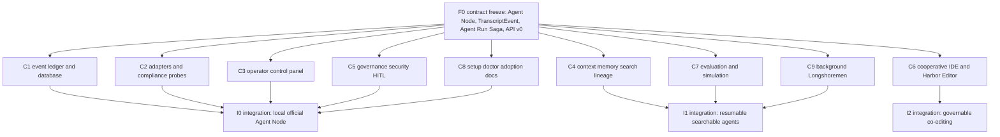

# 12 Agent Work Chains And Second Pass Review

Status: work-chain map and architecture review addendum.

Purpose:
  Convert the Agent Harbor binder into concrete chains that can be assigned to
  Port Daddy agents, then review the binder through infrastructure, agentic
  patterns, API compatibility, cost, caching, chain decomposition, HITL,
  routing, multi-agent systems, empirical evaluation, database design,
  background agents, argumentative lineage, CQRS/event sourcing, event-driven
  architecture, GPUI Harbor, and temporal planning lenses.

This chapter answers the practical question:

> Which agents can I send out now, without making a coordination mess?

## Chain decomposition summary

The binder is not a single chain. It has a short serial foundation and then a
wide fanout.

Serial foundation:
  Freeze the Agent Node event contract, Agent Run Saga boundary, API versioning
  policy, and database/event-store ownership. Without that, every other chain
  invents a different truth model.

Parallel fanout:
  Once the contract is frozen, the work decomposes into nine mostly disjoint
  chains. That is the practical width of the current architecture DAG. Trying
  to run fewer than these lanes will serialize unrelated work; trying to run
  many more will create coordination overhead before the contract is stable.

Integration:
  Each chain returns a narrow artifact: an ADR, schema patch, probe fixture,
  GPUI slice, eval harness, or roadmap delta. The integration agent merges
  artifacts by dependency order, not by completion order.

## Chains to send agents onto

### F0. Contract freeze chain

Send one senior architecture agent.

Mission:
  Freeze the minimum v0 contract that every other chain imports.

Inputs:

- [03 Agent Contract And Extension API](./03-agent-contract-and-extension-api.md)
- [09 Data Model And API](./09-data-model-and-api.md)
- [11 Redteam Whitehat Cross Lens Review](./11-redteam-whitehat-cross-lens-review.md)

Outputs:

- `docs/adr/<new>-agent-run-saga.md`
- event schema diff for `TranscriptEvent`, `AgentNode`, `ControlCommand`,
  `CostAccrualEvent`, `PartitionDecision`, and `ArgumentLineageEdge`
- API compatibility policy for `/api/agent-nodes/*`, `/api/transcripts/*`,
  `/api/control-commands/*`, and `/api/work-receipts/*`

Gate:
  No other chain may make breaking event/API assumptions until F0 marks v0 as
  provisional. Additive fields are allowed; removals or renames require a
  versioned transform.

Do not touch:
  GPUI implementation or provider adapters except to name their contracts.

### C1. Event ledger, database, and projections chain

Send one CQRS/database/event-driven agent.

Mission:
  Make the daemon-owned event log and read models real enough for the app and
  adapters to trust.

Primary lenses:
  CQRS/event sourcing, event-driven architecture, database design, API
  versioning, caching.

Outputs:

- append-only event-store design with optimistic concurrency;
- projection list for roster cards, transcript timeline, cost display, file
  touches, claims, compliance, and work receipts;
- migration plan using expand-contract for any existing tables;
- idempotent projection handlers and replay plan;
- cache policy for hot read models.

Acceptance gates:

- events are immutable, past-tense, and schema-versioned;
- projections rebuild from scratch;
- consumers are idempotent;
- API v0 tolerates unknown fields;
- cache entries have TTL, invalidation owner, and staleness label.

Human gate:
  Required before destructive migrations, dropping legacy columns, or changing
  public API response shapes.

### C2. Adapter, LLM router, and compliance probe chain

Send one agent who understands Claude Code, Codex, Cloudflare, Ollama/LM Studio,
custom stdio/HTTP bodies, model routing, and cost accrual.

Mission:
  Turn "official Port Daddy agent" from a concept into compliance fixtures.

Primary lenses:
  Agentic infrastructure, agentic patterns, LLM router, cost accrual, API
  compatibility.

Outputs:

- adapter capability matrix: native, hooked, proxy, observed, unmanaged;
- `pd agent probe` fixture plan for Codex, Claude Code, Cloudflare, Ollama or
  LM Studio, and a fake malicious adapter;
- model-tier routing policy: fast, mid, strong, local, custom;
- abort-aware cost-accrual events and budget-stop behavior;
- backward-compatible adapter protocol versioning.

Acceptance gates:

- forged compliance fixture is downgraded;
- partial cost is captured on abort/failure;
- model tier is shown separately from provider-specific model name;
- a C0/C1 observed body never receives C2+ controls;
- old adapter versions get sunset warnings instead of silent breakage.

Human gate:
  Required before enabling a new adapter to run shell, GitHub, deploy, or broad
  filesystem tools.

### C3. Operator control panel chain

Send one GPUI/product agent.

Mission:
  Make the app show active and historical agents as clickable, transcripted,
  controllable collaborators.

Primary lenses:
  GPUI Harbor, human gates, error boundaries, background-agent UX.

Outputs:

- roster/detail pane implementation plan with exact data dependencies;
- transcript renderer contract for streaming, historical replay, malformed
  events, and missing transcripts;
- controls matrix by compliance level;
- pane-level fallback states and visual fixtures;
- screenshot, GIF, and recording plan for PRs.

Acceptance gates:

- no raw ID typing for ordinary use;
- live stream and saved transcript are distinct and visible;
- every action button has enabled, disabled, pending, failed, and acknowledged
  states;
- pane failure does not blank the workspace;
- human approval gates show context, cost, confidence, and what happens next.

Human gate:
  Required before any irreversible action button: deploy, post externally,
  force interrupt remote execution, delete, retire, or publish.

### C4. Context, memory, search, and argumentative lineage chain

Send one memory/provenance agent.

Mission:
  Make transcript history searchable, resumable, and epistemically inspectable
  without flooding agent context.

Primary lenses:
  Context economics, argumentative lineage, epistemic coverage, caching,
  empirical evaluation.

Outputs:

- `ContextEnvelope` schema with budget, reader, purpose, source links, expiry,
  and omitted-risk list;
- transcript search eval corpus and retrieval metrics;
- lineage graph: claim, data, warrant, backing, qualifier, rebuttal mapped onto
  transcript events and swarm spans;
- epistemic coverage scan for memory/index coverage holes;
- cache-aside policy for search results with invalidation on new events.

Acceptance gates:

- all local transcripts are saved by default;
- injection is budgeted and source-linked;
- no recursive summary from prior summary without source zoom;
- every synthesized claim can show lineage or be marked unsupported;
- retrieval@5, citation precision, P95 latency, and hallucination rate are
  reported before memory is used for successor resume.

Human gate:
  Required before using transcript-derived data for public skills, training
  data, cloud sync, or externally visible claims.

### C5. Governance, security, and human gate chain

Send one security/governance agent.

Mission:
  Turn policy into runtime gates: what the agent can do, when the human must
  decide, and how abuse is contained.

Primary lenses:
  Cryptoeconomic protocol security, human gates, multi-agent systems, resource
  bounded planning.

Outputs:

- destructive-action policy matrix;
- human gate placement table;
- Sybil, oracle, griefing, and front-running table for team/public harbors;
- accepted-risk register with owner, trigger, likelihood, and impact;
- claim lease, progress checkpoint, and reclaim policy.

Acceptance gates:

- every high-risk action has a structural, economic, social, or accepted-risk
  defense classification;
- economic defenses have numbers;
- social defenses include a bootstrap failure plan;
- approval gates are not placed after every node;
- autonomy claims include refusal, delay, and local interpretation semantics.

Human gate:
  Required before irreversible actions, user-facing external output, high-cost
  phases, low-confidence outputs, and first run of new automation templates.

### C6. Cooperative IDE and Harbor Editor chain

Send one Rust GPUI plus CRDT coordination agent.

Mission:
  Build the path from operator console to cooperative IDE: humans and agents as
  peers, governed by claims, guard, and salvage.

Primary lenses:
  Build-coop-IDE GPUI, multi-agent coordination, event sourcing, HSTS planning.

Outputs:

- phased Harbor Editor wedge plan: shell, buffer, claims, salvage, transport;
- Loro replica identity model backed by Port Daddy Agent Node identity;
- claim-as-presence and guard-before-merge design;
- salvage plan for dead replicas and successor agents;
- visual artifact requirements for each GPUI slice.

Acceptance gates:

- agents are peers, not invisible tools;
- CRDT byte merge never replaces intent governance;
- dead-replica op log can be replayed;
- daemon remains the collaboration server for the first slice;
- transport abstraction exists, but LAN/remote transport is not built before
  local buffer plus governance.

Human gate:
  Required before merging agent-authored edits across contested claims or
  publishing collaborative edits externally.

### C7. Evaluation, simulation, and scheduling chain

Send one empirical evaluation and temporal-planning agent.

Scoring substrate: this chain's scenario library and metrics land in
**Coordination-Bench** (ADR-0052 phases 3a/3b, Amendment 1) — the same
Episode JSONL and reward rubric score both real-fleet and synthetic episodes.

Mission:
  Make the system measurable: coordination overhead, recovery fidelity,
  salvage latency, cost, and operator usefulness.

Primary lenses:
  Empirical systems evaluation, HSTS planning/scheduling, agentic
  infrastructure ROI.

Outputs:

- preregistered evaluation plan;
- scenario library for compliant, weak, broken, malicious, stale, and remote
  agents;
- Tier A baseline definitions;
- latency, fidelity, cost, and quality metrics;
- stochastic simulation for bottleneck resources: context, cost, tool gates,
  human approvals, remote leases.

Acceptance gates:

- every metric has confidence interval;
- comparisons include effect size;
- human ratings have kappa;
- at least one Tier A baseline exists;
- bottleneck resources are identified before scheduler commitments;
- output is behavioral envelope, not one brittle nominal sequence.

Human gate:
  Required before publishing benchmark claims, ROI claims, or marketing charts.

### C8. Setup, doctor, adoption, and docs chain

Send one infrastructure/adoption agent.

Mission:
  Make the system installable, remediable, and explainable without making the
  operator run a ritual of commands.

Primary lenses:
  Agentic infrastructure adoption, API compatibility, background-agent UX,
  caching, cost visibility.

Outputs:

- `pd setup` and `pd doctor` user journey;
- remediation decision tree for hooks, MCP, daemon, transcripts, Keychain,
  provider keys, app health, and stale adapters;
- compatibility guide for old CLI/app/daemon versions;
- installation and trust copy that names hooks honestly;
- adoption metrics: time to first official Agent Node, time to remediation,
  active daily agents, accepted suggestions.

Acceptance gates:

- default install path is one command or signed app flow;
- `pd doctor` has one repair path per detected issue where possible;
- no stale npm instructions;
- hook metadata is transparent;
- users can see local-only versus cloud-sync state.

Human gate:
  Required before changing installer behavior, update channel, privacy copy, or
  any flow that stores keys or uploads data.

### C9. Background Longshoremen chain

Send one background-agent and discourse/provenance agent.

Mission:
  Define durable infrastructure agents that quietly help Voyagers without
  spamming, duplicating work, or becoming hidden controllers.

Primary lenses:
  Vibe-coding background agents, discourse coordinator, argumentative lineage,
  Wooldridge multi-agent systems, cost accrual.

Outputs:

- Longshoreman classes: compactor, conflict watcher, PR shepherd,
  skillwright, cost watcher, security lookout, discourse cartographer;
- event triage policy: silent, notify, approval-required, blocked;
- suggestion TTL, dedupe key, dismissal/acceptance tracking;
- discourse state model for contradictions, elisions, and unresolved questions;
- cost caps and kill switches for background work.

Acceptance gates:

- visible suggestions capped and batched;
- background work has explicit budget and stop reason;
- Longshoremen cannot silently mutate code or publish externally;
- every claim of contradiction has source lineage;
- dead Longshoremen are salvageable like Voyagers.

Human gate:
  Required before a Longshoreman changes files, comments on GitHub, sends
  messages externally, spends above threshold, or modifies a shared skill.

## Dispatch prompts

Use these as starting briefs for Port Daddy-launched agents. Each agent should
start with `pd attention`, `pd status`, `pd briefing`, and a concrete `pd note`
before editing.

### Prompt: F0 contract freeze

You are the Agent Harbor contract-freeze agent. Read binder chapters 03, 09,
11, and 12. Produce a minimal v0 interface that all other chains can depend on:
Agent Node, TranscriptEvent, Agent Run Saga, CostAccrualEvent,
PartitionDecision, ArgumentLineageEdge, ControlCommand, WorkReceipt, and API
versioning policy. Do not implement GPUI or adapters. Your output is an ADR and
schema delta with compatibility rules.

### Prompt: C1 event ledger

You are the event ledger/database chain. Build the append-only event store,
projection, migration, and cache plan for Agent Harbor. Use CQRS, event
sourcing, event-driven architecture, database design, API compatibility, and
caching lenses. Return concrete tables, event names, projection rebuild rules,
idempotency keys, cache TTL/invalidation, and expand-contract migration steps.

### Prompt: C2 adapters

You are the adapter/compliance chain. Define and test compliance probes for
Codex, Claude Code, Cloudflare, Ollama/LM Studio, and custom bodies. Include a
malicious fake adapter. Route model selection by fast, mid, strong, local,
and custom tiers. Capture partial cost on abort. Return fixtures and
compatibility constraints.

### Prompt: C3 operator panel

You are the GPUI operator-panel chain. Turn Agent Nodes into a clickable roster
and transcript detail surface. Include live stream, historical transcript,
files, diffs, claims, PRs, cost, model tier, context pressure, and control
states. Build pane-level fallbacks and visual artifact requirements. Do not
make operators type IDs.

### Prompt: C4 memory lineage

You are the memory/search/lineage chain. Build the ContextEnvelope, transcript
search eval, lineage graph, and coverage scanner. Save all local transcripts by
default, but inject only budgeted, sourced digests. Every synthesized claim
needs lineage or an unsupported marker.

### Prompt: C5 governance

You are the security/governance chain. Build the destructive-action matrix,
human gates, accepted-risk register, claim leases, and public-harbor economics.
Analyze undercollateralization, griefing, oracle manipulation, Sybil economics,
and front-running. Every defense must be structural, economic, social, or
accepted risk.

### Prompt: C6 cooperative IDE

You are the Harbor Editor chain. Design the Rust GPUI/Loro path where agents
and humans are peer replicas governed by claims and salvage. The daemon is the
collaboration server for the first slice. Do not build transport before local
buffer plus governance.

### Prompt: C7 evaluation

You are the evaluation/simulation chain. Design empirical tests for salvage
latency, recovery fidelity, cost, coordination overhead, operator usefulness,
and tool-gate correctness. Include Tier A baselines, sample-size notes,
confidence intervals, effect sizes, human-rating rubrics, and threats to
validity.

### Prompt: C8 setup doctor

You are the setup/doctor/adoption chain. Design the one-command or signed-app
setup flow, `pd doctor`, hook/MCP remediation, local-only versus cloud-sync
state, provider-key UX, and compatibility warnings. Remove ritual command walls.

### Prompt: C9 Longshoremen

You are the background Longshoreman chain. Define durable infra agents for
compaction, conflict watching, PR shepherding, skill creation, cost watching,
security lookout, and discourse mapping. Keep them quiet, budgeted, source
linked, and salvageable.

## Second-pass review findings

### S1. The binder still needs an API compatibility chapter or ADR

The current contract is event-rich, but every adapter, app, and cloud client
will become a consumer. Breaking event names or response shapes will strand
agents mid-run.

Change required:
  Add date-based or semantic API versions, tolerant readers, deprecation
  headers for HTTP routes, successor links, and at least a six-month policy for
  public API breaking changes. Internal experimental routes can move faster if
  they are marked unstable.

### S2. The event log must be the source of truth, not another projection

The binder already says "if the daemon cannot query it, the operator cannot
trust it." The stronger CQRS rule is: projections are disposable; the event log
is not.

Change required:
  Model transcript, control, budget, claim, tool, and receipt events as the
  append-only record. Roster cards, app panes, cost widgets, and memory indexes
  are projections that can rebuild.

### S3. Agent Node launch needs transactional outbox semantics

Starting a body and writing database state is a dual-write risk.

Change required:
  The launch command writes an `AgentRunRequested` event and outbox row inside
  one transaction. A launcher consumes that event idempotently, starts the body,
  and writes `AgentBodyStarted` or `AgentBodyStartFailed`. No UI should infer a
  body is running before the start event arrives.

### S4. Caching must be explicit because stale agent state is dangerous

The control panel will want fast rosters and timelines. Caching them without
invalidating on new events will recreate the user's current complaint: the app
shows nothing or stale truth.

Change required:
  Cache only projections, never command decisions. Every cache has TTL, event
  cursor, invalidation owner, and stale badge. A stale roster can be shown; a
  stale tool-approval decision cannot be reused.

### S5. Cost must accrue in real time and survive aborts

Costs are not just billing; they are part of operator control and model-router
feedback.

Change required:
  Add `CostAccrued`, `BudgetWarned`, `BudgetExceeded`, and
  `CostFinalized` events. Partial costs must finalize on abort, failure, and
  remote timeout. Model-router decisions should be evaluated against actual
  cost and quality outcomes.

### S6. Human gates need to be sparse and high-signal

If the app asks for approval after every internal node, the operator will ignore
it. If it gates after irreversible actions, it is too late.

Change required:
  Gate before irreversible actions, before expensive remaining phases, before
  external/user-facing delivery, on low-confidence outputs, and on first use of
  a new automation template. Each gate shows context, output, confidence, cost,
  next step, and approve/modify/reject routes.

### S7. Multi-agent autonomy needs honest knowledge levels

The binder should not assume common knowledge. An agent knowing a file claim is
not the same as everyone knowing that everyone knows it.

Change required:
  Mark coordination facts by knowledge level: local observation, daemon-known,
  broadcast, acknowledged, common-enough for action. Protocols should require
  acknowledgments only where safety needs them; otherwise eventual distributed
  knowledge is enough.

### S8. Background agents need permission classes and flow-state etiquette

Longshoremen are valuable only if they do not hijack the user's flow.

Change required:
  Classify every background action as silent, notify-after, approval-required,
  or blocked. Suggestions need dedupe keys, TTL, dismissal tracking, and flow
  deferral. Any code mutation, external comment, or shared-skill change needs a
  human gate unless policy says otherwise.

### S9. Empirical evaluation needs strong baselines, not demo videos

Visual proof is required for GPUI work, but architecture claims need data.

Change required:
  For coordination protocols, compare against at least one Tier A baseline:
  well-tuned single-agent, simple worktree-per-agent with notes, or existing
  Port Daddy claims without official Agent Nodes. Report confidence intervals,
  effect sizes, and threats to validity.

### S10. The DAG should preserve temporal flexibility

The plan should not assign exact dates or exact agent counts too early. The
critical resource can shift: tool-gate implementation, transcript ingestion,
GPUI surface, human review, or remote lease reliability.

Change required:
  Treat the roadmap as behavioral envelopes. Commit early only to bottlenecks
  proven by simulation or current defects; otherwise preserve ordering
  constraints instead of exact schedules.

### S11. Argumentative lineage should be visible in reviews and synthesis

A binder produced by multiple agents will accumulate claims that sound settled
but came from different warrants.

Change required:
  Every major architecture conclusion should be traceable to source docs,
  transcript events, reviewer spans, or accepted risk records. Contradictions
  should render as unresolved rebuttals until synthesized.

### S12. Epistemic coverage belongs in code and doc review

Gradient-following agents will overwork hot areas and skip isolated corners.

Change required:
  Add a coverage scan over binder chapters, API surfaces, adapter types, UI
  panes, and security boundaries. After warm-up, assign Agent Nodes to the
  highest-uncertainty unseen work item rather than only the loudest current
  pain.

## Revised implementation order

1. F0 contract freeze:
   Event/API/schema/saga ground truth.

2. C1 plus C2 narrow slice:
   Event ledger plus one local compliant Codex or Claude Code body.

3. C3 narrow slice:
   GPUI roster/detail reads the real projection and shows live or missing
   transcript truth.

4. C5 narrow slice:
   Destructive git gate, human approval card, and forged-compliance probe.

5. C4 narrow slice:
   Transcript search, context envelope, and cited compaction packet.

6. C8 narrow slice:
   Setup/doctor remediation for missing hooks, MCP drift, and transcript path.

7. C7 test harness:
   Fixture scenarios and baseline metrics for the first six slices.

8. C9 Longshoremen:
   Reactive compactor and conflict watcher only, with cost caps.

9. C6 Harbor Editor wedge:
   Local buffer plus claims and salvage. No remote transport until governance
   works locally.

## Minimal chain governance

Every chain must publish:

- claimed files and owned surface;
- contract dependencies from F0;
- current confidence and blockers;
- cost so far and remaining budget;
- human gates required before irreversible work;
- test evidence or doc evidence;
- handoff packet for the integration agent.

Every integration wave should run:

1. schema compatibility check;
2. event replay check;
3. API contract tests;
4. security/secret scan;
5. cost accrual sanity test;
6. GPUI visual artifact check if UI changed;
7. empirical fixture if behavior claims changed;
8. argumentative lineage scan for unresolved contradictions.

## Bottom line

Send agents onto chains, not vibes.

The practical fanout is:

- F0 first, alone;
- C1-C5 and C8 can begin immediately after F0;
- C4 can begin with F0 draft but cannot validate successor resume until C1
  event truth exists;
- C7 can start scenario design immediately, but cannot score real behavior
  until C1-C3 emit events;
- C9 can define policy immediately, but should not run active Longshoremen
  until cost, transcript, and permission events exist;
- C6 should design now but implement after the local Agent Node control plane
  proves claims, transcripts, and salvage.

This keeps agents independent without pretending the architecture is already
more stable than it is.
