# 13 Platform Plays And Runtime Surface Review

Status: platform review addendum.

Purpose:
  Review the Agent Harbor plan through observability, zero-trust, hierarchical
  skill representation, and sound-design lenses. Then answer the platform
  question: if Port Daddy is a multi-agent coordinator with CLI, IDE, native app,
  browser previews, MCP, and rich artifacts, what platform plays should it own?

## Reviewer lenses

Logging and observability:
  The transcript is not a substitute for logs, traces, and metrics. It is the
  operator-facing event trail. Runtime observability still needs structured
  logs, correlation ids, OpenTelemetry-style spans, SLOs, error sampling,
  redaction, and cardinality limits.

Agentic zero-trust security:
  Do not rely on polite agent instructions where capability revocation can
  enforce the boundary. Every agent message, tool grant, MCP server, skill
  package, and remote worker should be treated as untrusted until verified.

Hierarchical skills and skill-based representation:
  Skills should become executable affordances, not just documents. A skill
  should say what action it enables, what convergence looks like, what
  information it needs before acting, and what higher-priority objective it must
  not violate.

Sound design and audio:
  Sound is a restraint problem. The Harbor app should stay silent by default,
  use a tiny coherent event vocabulary, respect mute and Do Not Disturb, and
  never make audio the only signal.

## Platform thesis

Port Daddy should not be just a launcher for Claude Code, Codex, or other CLIs.
It should be the operating system for agentic software work:

- a local authority and event ledger;
- an MCP discovery and permission broker;
- a rich-media preview and artifact lab;
- a browser/DOM/console capture surface;
- a native operator app and IDE companion;
- a zero-trust capability mint;
- a transcript, trace, cost, and work-receipt system;
- a skill and background-agent runtime;
- a cooperative editor where agents and humans are peers.

The platform play is trust plus control plus artifact quality. Other systems can
run agents. Port Daddy should make agent work visible, interruptible,
auditable, replayable, and pleasant to operate.

## Platform plays

### 1. MCP Port Authority

Port Daddy should help people find MCP servers, but the winning play is not
"another list of MCPs." The official MCP Registry is the upstream discovery
primitive. Port Daddy's layer should add:

- install cards with plain-language permissions;
- namespace, source, package, signature, and version provenance;
- compatibility with Claude Code, Codex, Cursor, local agents, and Port Daddy
  Agent Nodes;
- least-privilege capability mapping;
- one-click install, disable, repair, and uninstall;
- runtime health checks through `pd doctor`;
- sandbox smoke tests before first use;
- security and cost risk labels;
- team policy: allowed, needs approval, blocked;
- usage stats and failure traces;
- deprecation and update warnings.

MCP discovery flow:

```mermaid
flowchart LR
  Registry["Official / community MCP registry"] --> Normalize["Normalize metadata"]
  Normalize --> Verify["Verify source, package, signature"]
  Verify --> Manifest["Permission manifest"]
  Manifest --> Smoke["Sandbox smoke test"]
  Smoke --> Card["Harbor install card"]
  Card --> Grant["Capability grants"]
  Grant --> Runtime["Runtime health and usage"]
  Runtime --> Doctor["pd doctor remediation"]
```



What the user sees:

- "GitHub MCP wants repo metadata, PR comments, and issue writes."
- "This server can run shell commands. Require approval for writes?"
- "Used by 4 agents today, 2 failures, last healthy 3 minutes ago."
- "This MCP is disabled because its binary changed since approval."

### 2. Rich Media Preview Lab

If agents build software, Port Daddy must show software running. Text diffs are
not enough.

The Harbor app should have a preview lab with:

- embedded Chromium or a browser-control backend with console, network, DOM,
  screenshots, accessibility tree, and viewport matrix;
- local dev-server launcher with Port Daddy port allocation;
- screenshot and DOM extraction capture as first-class artifacts;
- visual diff against prior run or PR baseline;
- GIF and short video capture for PR test plans;
- console-error and network-error cards linked to transcript events;
- mobile and tablet viewport presets;
- authenticated preview sessions with explicit secret handling;
- asset gallery for images, video, audio, PDFs, terminal recordings, and native
  app screenshots;
- "ask an agent about this pixel/DOM node/log line" affordance.

The browser is not a decoration. It is a tool body:

- every navigation has a trace id;
- every screenshot has a source URL, viewport, timestamp, and hash;
- console logs and network failures are transcript events;
- DOM extraction feeds visual QA and agent context;
- captured artifacts attach to Work Receipts and PR bodies.

### 3. App and runtime host

Port Daddy should launch what agents build:

- web apps;
- local APIs;
- databases or fixtures;
- native app dev builds;
- worker previews;
- static sites;
- test harnesses;
- storybook/component sandboxes;
- CLI demos;
- docs previews.

The user should see an "App Running" surface with:

- port, URL, process, sandbox, env, and owner Agent Node;
- stdout/stderr/log stream;
- browser preview and console;
- restart, kill, rebuild, clear cache, and open logs buttons;
- linked files and recent commits;
- cost and resource use if remote.

### 4. Skills and MCP marketplace

Port Daddy needs a skill catalog next to the MCP catalog.

Skill cards should include:

- what affordance the skill enables;
- required tools and permissions;
- applicable task patterns;
- incompatible skills;
- convergence or success criteria;
- provenance and signature;
- examples and outcome stats;
- whether it can be grafted automatically, only suggested, or human-approved.

The hierarchical-skill lens matters here: a skill is not just "some text to
inject." It is a reusable control primitive. For example:

- "review a PR" requires source diff, tests, and review rubric;
- "repair hook install" requires local filesystem and app config grants;
- "generate browser artifact" requires browser-control capability and preview
  URL;
- "publish external reply" requires human gate or explicit policy grant.

Superior objectives always dominate subordinate ones:

```text
Articles / safety / user instruction
  > capability lease
  > active human gate
  > task skill
  > model suggestion
  > local convenience
```

That is the software-agent version of nullspace composition: the task skill can
use remaining freedom only after superior constraints are preserved.

### 5. Work Receipt and artifact studio

The output of an agent run should be a polished evidence package:

- transcript hash;
- trace id;
- diff hash;
- cost;
- model/body/provenance;
- screenshots and recordings;
- browser console summary;
- tests and checks;
- human approvals;
- denied actions;
- PR comments and replies;
- final state and successor links.

This is useful for PRs, team review, customer trust, and training data
curation.

### 6. Observability cockpit

Agent work needs its own observability layer:

- trace id per Agent Run Saga;
- spans for adapter launch, model turns, tool calls, MCP calls, browser
  captures, GitHub writes, human gates, and remote leases;
- structured logs with redaction at logger initialization;
- metrics for active agents, tool denials, stream lag, transcript ingest lag,
  cost per run, success rate, recovery latency, and stale claims;
- alert thresholds tied to user impact;
- error sampling that always keeps failures;
- cardinality controls so `agent_id` and `session_id` do not explode dashboards
  without bucketing or trace drill-down.

Transcript events are the human-readable ledger. Observability data is the
operator and engineer debugging layer. They must share correlation ids.

### 7. Team and cloud harbor

Once the local proof chain works, the platform can grow into:

- shared team harbor;
- remote workers;
- mobile observer/control app;
- encrypted transcript sync;
- BYOK vault;
- hosted browser preview workers;
- policy-managed MCP and skill catalogs;
- team analytics;
- public Work Receipts;
- eventually public or federated harbors.

Do not start here. This is powerful only after local Agent Nodes, transcripts,
interrupts, browser previews, MCP permissions, and receipts are real.

## Control surface simplification

The user's point is correct: if Port Daddy can interrupt, pause, revoke
capabilities, and block tools, then we do not need to encode everything as
agent self-discipline.

Old shape:
  Many CLI/MCP commands tell the agent what it should do: check inbox, leave
  notes, avoid destruction, ask before tools, inspect conflicts, remember to
  parley, stop when told.

Better shape:
  A small number of enforced capability-backed primitives:

- register or attach body;
- grant or revoke capability;
- preflight tool;
- append transcript event;
- inject turn context;
- send operator message;
- pause, interrupt, kill;
- checkpoint;
- fork successor;
- approve or deny human gate;
- claim or release region;
- publish or retract receipt.

Everything else becomes a projection, UI action, skill, or policy on top.

What remains of "compulsion":

- Articles of Agreement define expectations and evidence;
- turn-start guidance nudges the agent;
- Longshoremen suggest better next steps;
- skill grafts provide procedural knowledge.

But enforcement happens at the boundary:

- no capability means no action;
- expired lease means retry through the daemon;
- denied tool means no side effect;
- interrupted body loses leases;
- remote body that ignores revocation becomes suspect and cannot receive new
  grants.

This is cleaner, safer, and a much smaller command surface.

## Zero-trust amendments

Agent identities:

- every official Agent Node gets a stable cryptographic identity;
- every body gets a body key or signed launch token;
- remote/public bodies need short TTL certificates or equivalent signed
  envelopes.

Messages:

- control messages carry `jti`, expiry, issuer, subject, session, and trace id;
- replay cache rejects duplicate `jti`;
- cross-harbor messages require explicit cross-domain capability.

Capabilities:

- no ambient access to env vars, filesystem, browser, MCP, GitHub, or network;
- capabilities are attenuated when delegated;
- child capability is always a subset of parent capability;
- public or unknown skills run in WASM or container sandbox where practical;
- package and skill artifacts are content-addressed and author-signed.

Audit:

- local mode can use append-only file/database logs;
- team/cloud/public mode needs Merkle-rooted audit trails;
- security violations are transcript events and structured logs;
- Work Receipts commit to final transcript and artifact hashes.

## Observability amendments

Add these event/log fields across the binder:

```text
trace_id
span_id
parent_span_id
agent_node_id
session_id
body_id
turn_id
tool_call_id
capability_lease_id
human_gate_id
work_receipt_id
correlation_source
redaction_state
```

Log levels:

- `INFO`: lifecycle and business events: agent registered, run started, gate
  approved, receipt published.
- `WARN`: degradation: stale heartbeat, missing hook, cache stale, capability
  near expiry, retrying.
- `ERROR`: failed operation that will retry or needs remediation.
- `FATAL`: daemon or security state cannot continue safely.
- `DEBUG` or `TRACE`: local development detail, sampled in production.

Golden signals for Agent Harbor:

- latency: tool preflight, transcript ingest, browser screenshot, stream lag;
- traffic: model turns, tool calls, MCP calls, browser captures;
- errors: failed launches, denied tools, broken hooks, stream disconnects;
- saturation: active agents, token/cost budget, queue depth, preview workers.

## Sound amendments

Default:
  Silent. Audio opt-in with master off, volume, and OS mute/DND respect.

Allowed cue classes:

1. Approval needed:
   Async, consequential, would be missed.

2. Agent failed or became suspect:
   Must co-fire visual flag and inbox item.

3. Remote interrupt acknowledged:
   Useful because the operator may look away after pressing interrupt.

4. Budget threshold crossed:
   Only for material thresholds, coalesced.

5. Long-running task completed:
   Only if it completed after the user left the app.

6. Parley or conflict requiring operator decision:
   Coalesced by conflict group.

No sound for:

- hover;
- ordinary button clicks;
- every stream frame;
- every agent message;
- every file write;
- repeated completion bursts.

Implementation:

- audio thread or voice pool;
- predecoded or procedural cues;
- no UI-thread decode;
- no sound-only event;
- no sharp repeated 2-5 kHz fatigue cue;
- visual artifact and accessibility review for any audio-bearing event.

## Embedded browser and media platform details

The embedded browser should expose:

- page DOM tree;
- accessibility tree;
- console logs;
- network waterfall;
- storage/cookies view with redaction;
- screenshot, crop, and video capture;
- viewport presets;
- visual diff;
- element picker;
- Playwright/CDP command log;
- "copy as issue" and "attach to PR" actions.

The preview system should support:

- web app preview;
- component preview;
- API playground;
- static docs;
- generated image gallery;
- video/GIF player;
- audio cue audition panel;
- native app screenshot gallery;
- terminal recording viewer;
- PDF/doc preview.

Every preview artifact becomes:

- transcript event;
- blob with hash;
- Work Receipt attachment;
- optional PR body artifact;
- searchable media item.

## MCP discovery product surface

Port Daddy should have an "MCPs" view:

Roster:
  installed, available, recommended, disabled, broken, blocked.

Detail:
  what it does, who maintains it, what it can access, how it authenticates,
  what agents used it, recent failures, config diff, and uninstall button.

Install:
  choose scope: user, repo, harbor, team. Choose capabilities. Run smoke test.
  Save config. Add to doctor.

Runtime:
  show current grants, calls, cost, errors, and denials.

Discovery:
  recommend MCPs by repo imports, detected services, task intent, missing tool
  failures, and explicit operator request. Do not auto-install.

Review:
  new MCPs enter quarantine until source/provenance/permissions are reviewed.

## New chains to add

### C10. Observability and zero-trust chain

Mission:
  Add trace ids, span model, structured logs, capability envelopes, replay
  protection, Merkle audit mode, and security violation events.

Outputs:

- Observability ADR;
- zero-trust capability envelope spec;
- log and metric field schema;
- SLOs for transcript ingest, stream lag, preflight latency, and browser
  capture latency;
- security event projection.

Gate:
  No team/cloud/public harbor without C10.

### C11. MCP and media platform chain

Mission:
  Design MCP discovery/install/remediation and rich preview lab around embedded
  browser, media artifacts, and Work Receipts.

Outputs:

- MCP cockpit design;
- registry ingestion and provenance plan;
- browser preview architecture;
- artifact model for screenshot, DOM, console, video, audio, PDF, and terminal
  recordings;
- PR artifact publishing flow.

Gate:
  No marketing claim that Port Daddy can build apps end-to-end until C11 can
  show running software, console errors, screenshots, and artifacts.

### C12. Sonic identity chain

Mission:
  Design a tiny opt-in Harbor sound vocabulary and Rust playback path.

Outputs:

- sound policy;
- six-cue maximum map;
- audio setting UI;
- event-to-cue gate;
- Rust audio implementation plan;
- accessibility test plan.

Gate:
  No cue ships without visual counterpart, mute/DND compliance, and off-thread
  playback.

## Bottom line

Port Daddy's moat is not just "many agents." It is the platform that makes many
agents trustworthy:

- find tools safely;
- run built software visibly;
- capture rich proof;
- interrupt and revoke authority;
- show traces and costs;
- preserve transcripts;
- create receipts;
- let humans and agents work in one governed harbor.

The command surface should shrink as enforcement improves. The app and daemon
should carry the contract; agents should not have to remember a hundred
voluntary rituals to stay compliant.
