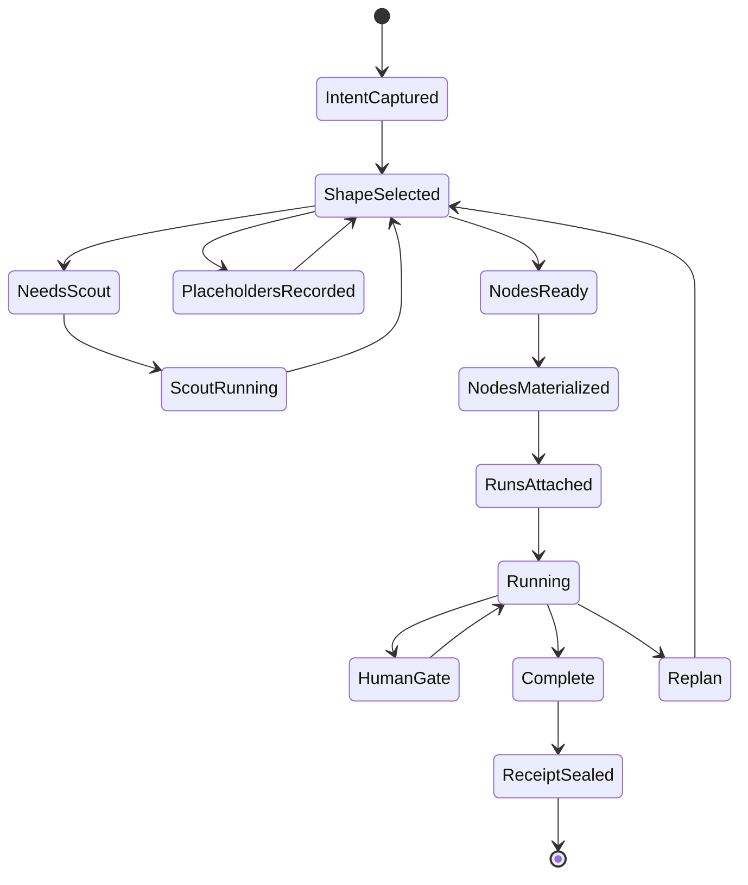

# Work Intake And Node Shaping

Status: architecture binder chapter.

Port Daddy should not ask the operator to choose between dispatch, sortie,
conjure, spawn, or other launch words. Claude Code and Codex do not make the
operator pick a runtime taxonomy before asking for work, and Port Daddy should
not either.

The product primitive is:

> Start work.

The daemon primitive is:

> Create a Work Intent, shape it into a Work Plan, and materialize Agent Nodes
> only when the Articles of Agreement can govern them.

Everything else is adapter detail.

## The one thing

All intake paths should call the same service:

```text
WorkIntentService.create(input) -> WorkIntent
WorkPlanner.shape(intent) -> WorkPlan
AgentNodeService.materialize(plan.node_specs) -> AgentNode[]
AnodeAdapter.attach(node, body_spec) -> AgentRun
```

The input may come from `pd-console`, the CLI, FleetBar, a mobile approval, a
GitHub webhook, a schedule, a staff agent, a compatibility bridge, or an
imported external session. That source is metadata. It must not fork the runtime
model.

The old names should become compatibility shims:

- background or queued work becomes a Work Intent with a background start
  policy;
- interactive creation becomes a Work Intent with the operator present;
- cloud execution becomes a Work Intent with remote placement constraints;
- compatibility bridges become Work Intents with adapter preferences;
- imported sessions become Work Intents with `attach_existing: true`.

No shim owns its own transcript, claims, budget, compliance probe, UI pane, or
state machine. All of those belong to Work Intent, Work Plan, Agent Node, Agent
Run, Transcript Stream, and Articles of Agreement.

## Naming rule

Use these names in code, docs, and UI:

| Use | Meaning |
| --- | --- |
| Work Intent | the operator or system request before planning |
| Work Plan | daemon decision about shape, gates, and resources |
| Agent Node | durable controllable agent identity |
| Agent Run | one execution attempt by a body attached to a node |
| Body | Claude Code, Codex CLI, Cloudflare Worker, Ollama, LM Studio, custom stdio, or human |
| Anode Adapter | provider/runtime adapter that attaches a body |
| Planning Placeholder | unresolved work item that is not executable yet |

Avoid these names in new internal APIs:

- dispatch;
- sortie;
- spawn;
- conjure;
- vague node as a product term.

`vague node` is acceptable only inside algorithm notes. The product term should
be **Planning Placeholder**, because it makes the important fact obvious: no
agent exists yet.

## Default policy

Start with one Agent Node unless there is evidence that splitting helps.

The planner should split only when it can write down why:

- independent work exists with low file, state, and decision coupling;
- different skills or providers are genuinely useful;
- context pressure would make one agent worse;
- a human gate or adversarial review needs independent judgment;
- the dependency graph has real width, not just a long sequence;
- the expected split cost plus coordination cost is lower than the stay cost.

The operator should not be asked how many nodes they need. The app can show the
planner's proposed shape and let the operator approve, simplify, or expand it.

## Shape decision table

| Shape | Use when | Do not use when |
| --- | --- | --- |
| Single Agent Node | The task fits one context, touches a coherent surface, has high coupling, needs live chat, or has no clear independent branches. | Splitting would duplicate context, create merge conflicts, or only satisfy a naming ritual. |
| Scout Agent Node | The goal is ambiguous, the repo surface is unknown, dependencies are unclear, or the right skills/files cannot be named yet. | The work is already concrete enough to execute safely. |
| Linear chain | Work is sequential, each step depends on the last, or context rollover is needed at checkpoints. | Steps can truly run in parallel. |
| DAG/workgroup | There are 3-7 concrete branches with clear interfaces, low overlap, separate validation gates, and useful parallelism. | The graph is mostly guesswork, or many branches would compete for the same files. |
| Planning Placeholder | The planner knows a role exists but cannot safely name files, skills, body, model tier, or acceptance criteria yet. | It is executable now. |
| Staff service | The work is durable infrastructure: compaction, conflict watch, PR triage, cost watch, skill indexing, or transcript summarization. | It is a one-off product/code task. |
| Human gate | The next step is destructive, high-cost, external, privacy-sensitive, or low-confidence. | The daemon already has clear authority and rollback. |

## Concrete heuristics

Port Daddy should record the planner's evidence so the operator can see why one
node became many:

- **Split economics:** split only when `split_cost + communication_cost <
  stay_cost`.
- **Context pressure:** prepare split or successor planning before the current
  body is out of room; do not wait until the context window is already full.
- **Graph width:** use the maximum antichain as the lower bound for true
  parallel chains. Long depth does not imply many agents.
- **Existing capacity:** assign work to existing compatible nodes before
  creating new nodes.
- **Coupling:** high file overlap, shared mutable state, or one design decision
  controlling all branches means use one node or a chain.
- **Skill boundary:** split when subproblems map to distinct skills and the
  handoff can be described in one paragraph with acceptance criteria.
- **Failure domain:** split when independent failure would be useful; do not
  split when one failure invalidates every branch.
- **Review independence:** use a separate reviewer/evaluator node when the value
  comes from independence, not extra throughput.
- **Budget:** many cheap nodes are still wrong if they create transcript noise,
  merge conflicts, or operator burden.
- **Uncertainty:** if the planner cannot name the files, capability grants, or
  done condition, make a Planning Placeholder or scout first.

## Planning placeholders

A Planning Placeholder is an unresolved work item in the Work Plan. It is not an
Agent Node and should not reserve a model, provider, budget, worktree, or broad
capabilities.

Allowed fields:

- role description;
- known dependencies;
- uncertainty reason;
- resolution trigger;
- maximum wait wave;
- evidence needed.

Forbidden fields:

- provider or model tier;
- body configuration;
- file claims;
- capability grants;
- cost reservation beyond planning overhead;
- transcript stream id.

Resolution triggers:

- scout output lands;
- dependency output is complete;
- relevant files and acceptance criteria are known;
- confidence crosses the planner threshold;
- the operator chooses a direction;
- timeout forces replan or cancellation.

If more than roughly a third of the plan remains placeholders after two waves,
the planner should stop pretending and re-scope with the operator or a scout.

## Work Plan state machine



Articles of Agreement attach at `NodesMaterialized`, before the first model
turn. A body cannot become official after the fact except as an observed,
partially compliant import with a clear gap report.

## Operator experience

The default surface should be a single action:

```text
Start work
```

In the CLI, the future shape should be one command family, for example:

```text
pd work start "fix the flaky auth tests"
pd work plan "ship the mobile transcript viewer"
pd work attach --session <external-session-id>
```

The exact names can change, but the rule should not: one command family creates
work, and Port Daddy decides the execution shape. Power users can request
constraints such as local-only, cloud-ok, max-cost, no-parallelism, or
review-required, but they should not need to learn old launch categories.

In `pd-console`, the operator should see:

- the Work Intent text;
- the Work Plan shape;
- why the planner chose one node or many;
- any Planning Placeholders and their resolution triggers;
- active Agent Nodes and their transcripts;
- pending human gates;
- cost and context pressure;
- the ability to simplify or approve a proposed split.

## Migration plan

1. Introduce Work Intent and Work Plan records.
2. Make every launch source call WorkIntentService first.
3. Change old commands into thin aliases that write source metadata.
4. Move state machines, transcript routing, compliance checks, budget, claims,
   and UI reads to Work Intent, Work Plan, Agent Node, and Agent Run records.
5. Rename internal APIs away from old verbs as each path migrates.
6. Keep old command names temporarily with deprecation help that points at the
   one command family.
7. Remove old terms from the operator UI once parity is proven.

The test is simple: a new body should be impossible to start without either a
Work Intent and Work Plan or an explicit unmanaged import reason. If any code
path can create a transcript, claim, budget, or process without that chain, the
old launch vocabulary is still leaking into architecture.
