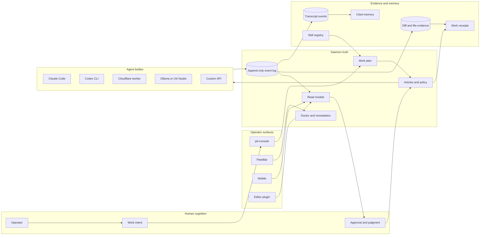
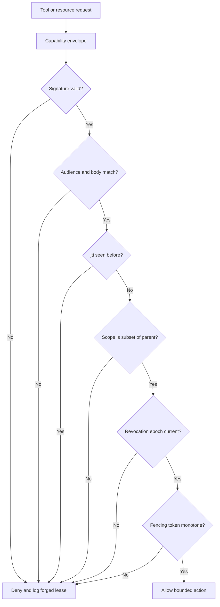
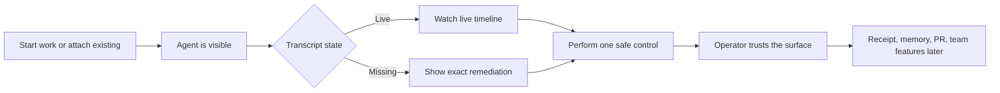
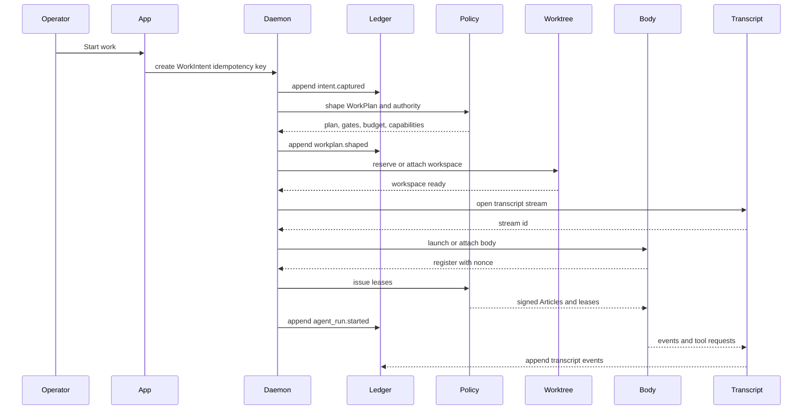
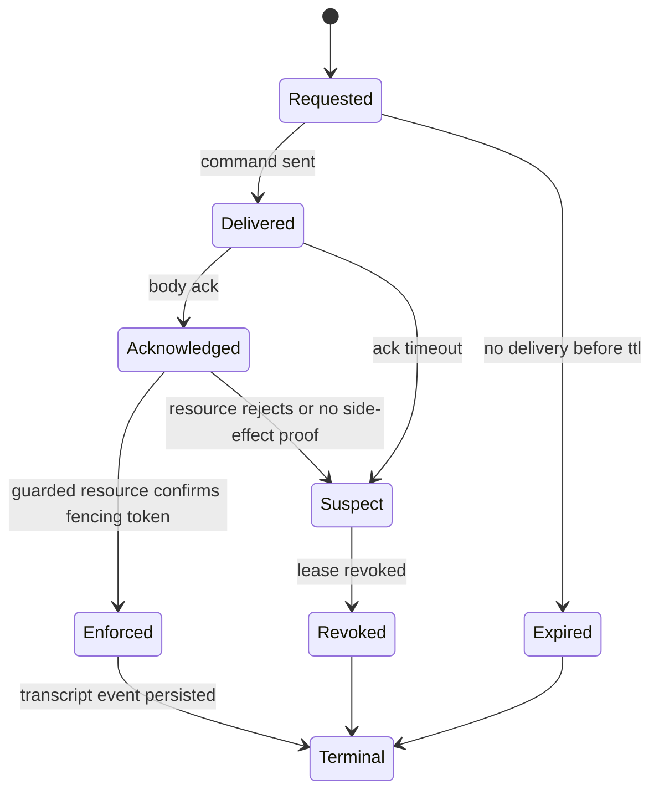
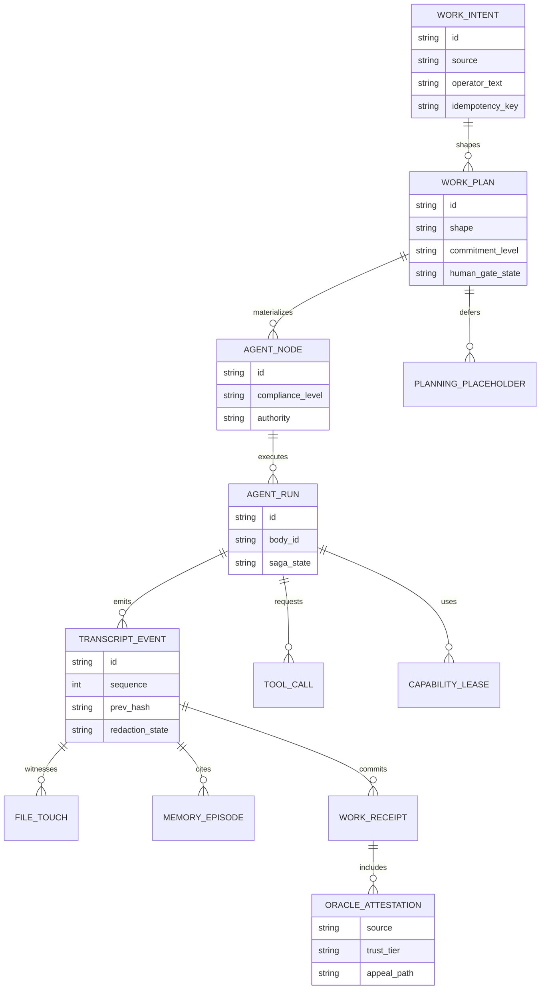
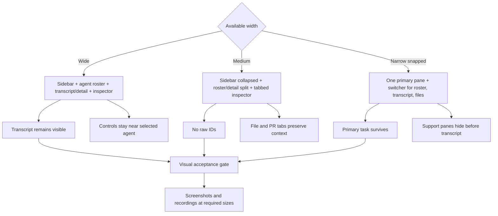
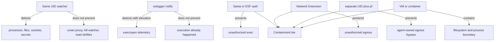

# Recursive Critical Synthesis

Status: critical synthesis addendum.

Purpose:
  Apply a harsher review board to the Agent Harbor binder: red team, whitehat,
  federated harbor, macOS host security, UX friction, product appeal, desktop
  window layout, code architecture, data-intensive systems, cognitive systems
  engineering, Mermaid diagramming, and skill architecture.

This chapter does not replace the earlier reviews. It turns them into
cross-chapter invariants, proof gates, diagrams, and skills that should exist
before Port Daddy claims the harbor architecture is real.

## Recursive synthesis verdict

The binder is aiming at the right product: an operator control plane for AI
software work, not a prettier terminal around agents. The strongest version of
the plan is compelling because it gives the operator four things existing agent
CLIs mostly do not give together:

- live and historical transcripts with tool calls, files, costs, and provenance;
- an interruptible control plane with policy gates before dangerous actions;
- a shared workspace where multiple agents can coordinate without turning every
  handoff into chat archaeology;
- receipts and memory that let work become inspectable, resumable, and
  learnable.

The hard critique is that the plan can still fail by building a beautiful shell
around partially observed subprocesses. The architecture must make the control
plane's truth model more important than its UI, marketing, or agent poetry.

If Port Daddy cannot prove what an agent saw, did, changed, spent, claimed,
blocked, and was allowed to do, it is not an official Agent Node. It is an
observed process with a nice card.

## Diagram 1 - joint cognitive system

The operator, daemon, agents, worktrees, memory, skills, and external systems
are one joint cognitive system. The product succeeds when shared situation
awareness survives interruption, failure, and scale.

Design implication:
  The UI is not a dashboard over miscellaneous state. It is the cockpit of a
  joint cognitive system. Every pane must preserve situation awareness: who is
  acting, what evidence exists, what is unknown, and what the operator can do
  next.

## Redteam findings and whitehat closures

### C1. The compliance ladder can still become theater

Redteam:
  A process can appear official because it registered, heartbeats, or writes
  notes, while transcripts are missing, hooks are disabled, tool gates are
  bypassed, or stream offsets are unverifiable.

Whitehat:
  Compliance must be negative-probed. Each level C0-C6 needs a failing fixture
  that proves the UI downgrades the agent when the capability is absent or
  forged.

Gate:
  No compliance badge ships without a matching "prove it fails" test.

### C2. Same-UID host safety is detection, not containment

Redteam:
  An AI process running as the operator's UID can disable shell variables,
  bypass proxy settings, read dotfile secrets, kill same-UID watchers, or run
  unsigned binaries. Calling a same-UID sniffer a wall is false.

Whitehat:
  Split host safety into tiers: read-only detection, elevated telemetry,
  privileged enforcement, and separate-UID or VM containment. The app must label
  each agent's tier plainly.

Gate:
  `pd doctor` and `pd-console` must show "observed only" for read-only sensors.
  Real prevention requires Santa, Network Extension, Endpoint Security, pf, a
  separate UID, container, or VM boundary.

### C3. Capability leases are not cryptographic enough yet

Redteam:
  Nonces and leases are named, but a malicious adapter can replay, splice, or
  over-claim a lease unless the lease is a signed envelope with audience,
  issuer, subject, parent, expiry, revocation epoch, and scope attenuation.

Whitehat:
  Define a capability envelope before broad tool gating ships. It should bind:
  pinned key algorithm, issuer, subject Agent Node, body id, audience daemon or
  guarded resource, `jti`, parent lease id, scope, subset proof, expiry,
  revocation epoch, and monotone fencing token.

Gate:
  A guarded resource must reject an expired, replayed, wrong-audience,
  wrong-body, parent-scope-widening, or lower-fencing-token lease even if the
  agent claims approval.

### C4. Federation language is ahead of federation proofs

Redteam:
  Shared harbors, public skills, remote agents, team harbors, relay, mobile, and
  cloud vaults imply cross-domain trust. Without explicit pact composition,
  revocation propagation, token epoch binding, tree-head witnessing, and Sybil
  economics, the plan imports federation risk without federation proof.

Whitehat:
  Keep local harbor as the only P0 authority domain. Every cross-harbor feature
  must use "refuses versus prices": refuse unauthenticated tokens, unwitnessed
  heads, stale revocations, and budgetless commitments; price propagation,
  witness service, bond floor, and dispute latency.

Gate:
  Team/public harbor milestones require a threat model table with trust,
  tokens, revocation, Sybil, settlement, equivocation, bond drain, cold start,
  and operator-Sybil rows.

### C5. Federated revocation has to fail closed under partition

Redteam:
  The plan can show revocations and stale state, but a cross-harbor token that
  remains usable during a partition breaks the authority story.

Whitehat:
  Name a propagation bound `D` in each federation pact. A partitioned harbor
  must pessimistically refuse cross-harbor tokens after `D` until it resyncs.

Gate:
  Before team/public harbors, a TLA+/Apalache model or equivalent test fixture
  must show: after `revoked(token, epoch) + D`, no non-partitioned harbor
  accepts the token; partitioned harbors enter `refuse_cross_harbor` until
  resync.

### C6. Transcript-by-default needs a tested redaction boundary

Redteam:
  Saving every transcript is correct for control and learning, but unredacted
  secrets in tool output can become a durable leak. Later cloud sync or team
  sharing turns a local bug into a breach.

Whitehat:
  Keep local transcripts on by default. Add structured secret detection before
  persistence, not after. Store redaction markers and hashes so receipts remain
  useful without preserving leaked payloads.

Gate:
  Milestone 1 needs fixtures for provider keys, SSH keys, `.env` paths, OAuth
  tokens, npmrc, Docker auth, shell history, and MCP config. Raw secret values
  must not persist unless the user explicitly enables encrypted raw retention.

### C7. Work Plan launch is a saga, not a function call

Redteam:
  Starting an agent touches identity, budget, worktree, transcript stream,
  capability leases, provider credentials, sandboxing, projections, and UI. A
  crash halfway through can leave orphaned processes, billed calls, stale
  leases, or missing transcripts.

Whitehat:
  Model Work Intent to Agent Run as an idempotent saga with durable steps,
  timeouts, retries, and compensations. Every step must be safe to replay or
  clearly compensable.

Gate:
  The daemon must tolerate duplicate create requests, process launch failure,
  transcript writer failure, billing abort, stale capability lease, and app
  disconnect without corrupting state.

### C8. Work Receipts can become self-certifying theater

Redteam:
  A receipt that only hashes Port Daddy's own events is useful but not enough
  for high-stakes trust. Screenshots, reviewer verdicts, GitHub facts, CI
  checks, cloud-provider events, and cost events have different manipulation
  risks.

Whitehat:
  Add an oracle registry to receipts: source, signer, trust tier, replay path,
  manipulation risk, appeal path, and whether independent review is required.

Gate:
  A receipt cannot promote a claim to "verified" unless the relevant oracle
  entry says how the claim can be replayed or challenged.

### C9. Operator appeal still depends on proof, not breadth

Redteam:
  The pitch can sound like "yet another everything IDE" if the first five
  seconds do not show the unique promise: agents you can see, steer, interrupt,
  resume, and trust.

Whitehat:
  Make the first product story narrow and visceral: "Watch every agent work.
  Stop the dangerous move. Resume from evidence. Ship with receipts."

Gate:
  Marketing, install, and app onboarding should show live transcript, file
  changes, blocked dangerous command, and resume/receipt. Do not lead with a
  taxonomy of harbors, staff, bonds, or adapters.

### C10. First value must be three moments, not ten

Redteam:
  The first-run path can drown the operator in install, mode choice, provider
  setup, agent taxonomy, transcript status, file tree, doctor, receipt, and
  account prompts.

Whitehat:
  First value is: attach or start one agent, see live or missing transcript
  truth, perform one safe control action.

Gate:
  The native app onboarding should pass this flow before any team, marketplace,
  cloud vault, or public harbor language appears.

### C11. Desktop layout needs a geometry contract

Redteam:
  A native app can still feel like a cramped terminal if panes are percentage
  splits with clipped paths, bottom bars, and raw IDs. When snapped or resized,
  the operator loses the agent transcript or control context.

Whitehat:
  Define role-aware presets: wide, medium, narrow. Related regions stay in one
  primary window. Agent roster and detail are conjoined; inspector data follows
  selection; auxiliary windows are reserved for distinct tasks.

Gate:
  `pd-console` visual PRs need screenshots and recordings at 1280x720,
  1440x900, laptop high-density, and narrow snapped width. No critical action
  may live only in a bottom bar.

### C12. Surface routing must be explicit

Redteam:
  Native app, FleetBar, web, CLI, TUI, editor plugin, mobile, and website can
  all claim to be "the control plane," creating duplicate commands and confusing
  operator expectations.

Whitehat:
  Route by job:

- native app: agent work, transcript, files, controls, repair;
- FleetBar: alerts, quick interrupt, daemon health, credentials status;
- web: account, download, billing, docs, team/admin, optional cloud settings;
- CLI: automation, scripting, emergency repair, CI;
- editor plugin: selection-aware handoff and file-local context;
- mobile: attention, approvals, cost warnings, pause/interrupt.

Gate:
  A new surface can add a capability only if it names its routing role and the
  canonical API/read model it uses.

### C13. Skill grafting can become invisible prompt mutation

Redteam:
  A Longshoreman or planner can inject skills, memories, conflict warnings, or
  policy text into an agent's next turn. If the operator cannot see what was
  injected and why, suggestibility becomes hidden control.

Whitehat:
  Every graft is an event: skill id, version, source, reason, token cost,
  expected effect, reader, expiry, and evidence links. Operators can inspect
  and disable graft classes per harbor.

Gate:
  No skill graft reaches an official Agent Node without a transcript event and
  a UI-visible "why this was injected" detail.

### C14. Event sourcing without ordering semantics is a trap

Redteam:
  An append-only log with `prevHash` per session is not enough for cross-agent,
  remote, or relay events. Out-of-order ingestion, duplicate delivery, clock
  skew, and late revocation can make projections lie.

Whitehat:
  Separate occurred time, ingested time, sequence, causality, and projection
  state. Use idempotent consumers, per-stream ordering, causal parent links,
  replayable projections, and staleness labels.

Gate:
  Every read model in the app must say whether it is live, replaying, stale, or
  partial. Projection rebuild from the event log is a release gate.

### C15. Consistency guarantees must be explicit

Redteam:
  The binder uses one mental bucket called "daemon truth," but different reads
  and writes need different guarantees. Treating all state as equally current
  will create stale controls and surprise failures.

Whitehat:
  Add a consistency matrix:

| Surface | Required guarantee |
| --- | --- |
| tool approval, capability issue, lease revocation | single-writer or linearizable |
| transcript timeline | causal per-session ordering with late correction events |
| operator command status | read-your-writes |
| roster, search, blackboard, memory, cost charts | eventual with staleness labels |
| receipts | immutable snapshot with explicit oracle trust tiers |

Gate:
  Every API response that can be stale carries a projection offset, freshness
  timestamp, and staleness label.

### C16. Public/team harbors need legibility scopes

Redteam:
  Coordination data is competitive data. Claims, file heat, transcripts,
  roadmap items, and skill drafts may reveal product strategy or vulnerabilities.

Whitehat:
  Treat legibility as scoped. Local operator view is rich. Team view is
  capability-filtered. Public view is delayed, redacted, or receipt-based.

Gate:
  Every event kind, claim, transcript, receipt, skill, and blackboard item has a
  visibility scope and sharing policy before team/public harbors ship.

### C17. Device recovery can silently become the weakest control path

Redteam:
  Mobile pause/interrupt, push approvals, and account recovery are control
  authority. Email-only recovery, stolen devices, replayed push commands, or
  unrevoked device cards can bypass the local-first safety story.

Whitehat:
  Use WebAuthn/passkey device cards, per-command `jti`, short command expiry,
  device revocation tests, and no email-only recovery for control authority.

Gate:
  Mobile control cannot ship until stolen-device, replayed-command, expired
  approval, and revoked-device fixtures all fail closed.

## Diagram 2 - Work Intent saga

Failure rule:
  Each arrow after `intent.captured` needs a timeout and compensation. If the
  body launches but transcript open fails, the body must be killed or marked
  unmanaged. If leases issue but registration fails, leases must expire. If the
  app disconnects, the run continues only if the Work Plan allows unattended
  execution.

## Diagram 2b - control and lease failure flow

Rule:
  The UI should never collapse this to a single spinner. It should show whether
  a control was requested, delivered, acknowledged, enforced, expired, revoked,
  suspect, or terminal.

## Diagram 3 - event truth and projections

Design implication:
  Roster cards, transcript timelines, cost panels, work receipts, memory, file
  previews, and PR state are projections. If they cannot be rebuilt from the
  event log plus external oracles, they are not durable truth.

## Diagram 4 - native operator layout contract

Rule:
  Start from role priorities and minimum viable pane sizes. Do not split by
  percentages and then hope minimums fit. If the panes do not fit, switch
  workspace preset.

## Diagram 5 - host authority ladder

Rule:
  Product language must distinguish detection from containment. "Safe" means
  which tier, not a green badge.

## Product appeal pass

Primary persona:
  The operator who already uses Claude Code, Codex, GitHub, terminals, and
  local scripts, and feels the pain of not knowing what agents are doing or how
  to safely interrupt/resume them.

Problem urgency:
  High for people already running multiple agents. Low for users who only want
  one chat. Port Daddy should not dilute the first story for the second group.

Identity fit:
  Strong if the app feels like an expert operations console. Weak if it reads
  like a novelty nautical metaphor or a long agent taxonomy.

Trust signals:
  Must be evidence-first: transcript, tool gate, file tree, blocked command,
  receipt, cost, and exact model/provider. Claims about "safe agents" are not
  trust signals unless the user can see the proof.

Immediate copy rule:
  Lead with verbs the user wants: see, stop, steer, resume, verify. Avoid
  leading with harbors, staff names, federation, or model routing.

## Skill roadmap

Skill Architect lens:
  Do not create one giant "Agent Harbor" skill. Create narrow skills with
  precise activation, strong NOT clauses, anti-patterns, diagrams, and reference
  files loaded only on demand.

### port-daddy:agent-node-compliance

Description draft:
  Designs and audits official Port Daddy Agent Nodes, C0-C6 proof gates,
  Articles transitions, provider probes, and unmanaged remediation. Use for
  `pd agent probe`, transcript/session joins, C-level UI, adapter compliance,
  and negative fixtures. NOT for generic multi-agent coordination or generic
  MCP work.

Reference files:

- `references/agent-node-compliance-ladder.md`
- `references/provider-compliance-fixtures.md`
- `references/remediation-messages.md`

### port-daddy:work-intake-planner

Description draft:
  Shapes Work Intent into Work Plan: single node, scout, chain, DAG/workgroup,
  staff service, human gate, or Planning Placeholder. Use when replacing old
  launch verbs, deciding one-versus-many agents, or explaining split evidence.
  NOT for executing DAGs or provider adapter implementation.

Reference files:

- `references/work-intent-shape-table.md`
- `references/planning-placeholders.md`
- `references/split-economics.md`

### port-daddy:context-memory-compaction

Description draft:
  Designs ContextEnvelope, context pressure thresholds, compaction packets,
  cited memory, transcript search, and successor resume. Use when agents near
  context limits or need memory-backed continuity. NOT for generic vector-store
  or RAG advice.

Reference files:

- `references/context-envelope-and-compaction.md`
- `references/memory-tiers-and-derived-source-contract.md`
- `references/transcript-search-evals.md`

### port-daddy:skill-grafting

Description draft:
  Selects and injects skills into Agent Nodes with graft level, expiry,
  provenance, precedence, validation, and UI visibility. Use for skill index
  services, user-mentioned skills, active grafts, memory-to-skill suggestions,
  and tool grafts. NOT for authoring new skills.

Reference files:

- `references/skill-graft-envelope.md`
- `references/skill-trust-tiers.md`
- `references/graft-event-schema.md`

### port-daddy:skillwright

Description draft:
  Turns transcript episodes into reviewed skill candidates with source
  citations, triggers, examples, tests, scope, quarantine, and admission. Use
  for hard-won reusable procedures or shared harbor skills. NOT for runtime
  skill matching or ordinary prompt writing.

Reference files:

- `references/skillwright-admission.md`
- `references/transcript-to-skill-acta.md`
- `references/shared-harbor-skill-policy.md`

### port-daddy:longshoreman-staff

Description draft:
  Designs durable Harbor Staff/Longshoremen: compactor, conflict watcher, PR
  shepherd, Skillwright, cost watcher, security lookout, and discourse
  cartographer. Use for quiet background agents, permission classes, TTL/dedupe,
  kill switches, and staff responsibilities. NOT for one-off Voyage Agent work.

Reference files:

- `references/longshoreman-permission-classes.md`
- `references/staff-event-triage.md`
- `references/staff-cost-and-noise-budgets.md`

### port-daddy:work-receipts-lineage

Description draft:
  Produces and verifies Work Receipts, transcript and diff hashes, closure
  oracles, argument lineage, unsupported-claim markers, and browser/CLI proof.
  Use when buyer-visible trust, review synthesis, or verifiable completion
  matters. NOT for PR body formatting alone.

Reference files:

- `references/work-receipts-and-argument-lineage.md`
- `references/oracle-registry.md`
- `references/receipt-verification-flow.md`

### port-daddy:agent-chain-governance

Description draft:
  Applies the F0/C1-C9 chain model: chain briefs, dependencies, integration
  gates, wave handoffs, and review coverage. Use for "which agents can I send
  out now?" and binder-to-implementation campaigns. NOT for everyday
  single-agent slices.

Reference files:

- `references/agent-chain-integration-gates.md`
- `references/wave-handoff-packets.md`
- `references/integration-agent-checklist.md`

### port-daddy:harness-doctor-remediation

Description draft:
  Designs setup and doctor remediation for hooks, MCP, Keychain, provider keys,
  transcript paths, model aliases, stale adapters, app signing, and
  operator-facing repair UI. Use for `pd doctor --fix harness` and missing
  compliance prerequisites. NOT for generic install docs.

Reference files:

- `references/harness-doctor-remediation.md`
- `references/hook-and-mcp-drift.md`
- `references/operator-repair-copy.md`

### port-daddy:operator-control-panel-design

Description draft:
  Designs `pd-console` and Harbor app operator surfaces for live agents,
  historical transcripts, controls, files, PRs, memory, and remediation. Use
  when changing native app panes, screenshots, layout contracts, or operator
  workflows. NOT for website landing pages, CLI-only flows, or backend API
  implementation.

Reference files:

- `references/surface-map.md`
- `references/geometry-presets.md`
- `references/transcript-rendering-contract.md`

### port-daddy:macos-agent-containment

Description draft:
  Applies macOS host-security tiers to Port Daddy agent bodies: read-only
  detection, elevated telemetry, Santa, Network Extension, Endpoint Security,
  pf, separate UID, containers, and VM isolation. Use when designing `pd safe`,
  sandbox labels, host safety UI, or privileged enforcement. NOT for generic
  prompt injection, web security, or TypeScript daemon coordination.

Reference files:

- `references/authority-tier-map.md`
- `references/secret-scanning-rules.md`
- `references/enforcement-roadmap.md`

### port-daddy:federated-harbor-product-gates

Description draft:
  Reviews team, public, remote, and shared harbor features for federation
  threats: pact composition, token forgery, revocation under partition, Sybil,
  settlement, equivocation, bond drain, cold start, and operator concentration.
  Use before shipping relay, cloud, mobile, team, marketplace, or public skill
  features. NOT for local-only agent sessions or generic code review.

Reference files:

- `references/federation-threat-table.md`
- `references/refuses-prices-matrix.md`
- `references/public-harbor-launch-gates.md`

## Amendments to promote into earlier chapters

- Chapter 03 should add the negative-probe rule: every compliance level has at
  least one fixture that tries to fake it.
- Chapter 06 should make redaction-before-persistence a Milestone 1 gate, not a
  later privacy feature.
- Chapter 09 should add Work Intent, Work Plan, Agent Run saga state,
  Planning Placeholder, Oracle Attestation, and projection staleness fields.
- Chapter 09 should add a consistency matrix and projection registry with
  source offsets, transform versions, rebuild commands, staleness labels, and
  dead-letter handling.
- Chapter 10 should include the wide/medium/narrow geometry contract and the
  "support panes hide before transcript" rule.
- Chapter 10 should make the first-value path three moments: visible agent,
  transcript truth, one safe control.
- Chapter 13 should treat embedded browser/media previews as controlled agent
  tools with transcripted console, DOM, screenshots, and network events.
- Chapter 14 should record the split decision evidence as durable data, not
  only planner prose.
- Chapter 14 should treat module boundaries as ports and adapters:
  `work-intake`, `agent-node`, `agent-run`, `transcripts`, `tool-gate`,
  `memory`, `claims`, `receipts`, and `adapters`.

## Reality-check gates

The binder should not advance to implementation claims until these gates have
owners:

1. Local official Agent Node gate:
   Codex and Claude Code launched from the same Work Intent path, visible in
   `pd-console`, with live and historical transcripts.
2. Negative compliance gate:
   Fake adapters fail at each compliance level and the UI shows the downgrade.
3. Host safety honesty gate:
   The app distinguishes observed, governed, sandboxed, and contained agents.
4. Event replay gate:
   Roster, transcript, cost, file touches, and receipt projections rebuild from
   the event log.
5. Redaction gate:
   Secret fixtures never persist raw in default transcript storage.
6. Operator layout gate:
   The native app passes wide, medium, narrow, and snapped visual artifacts.
7. Skill graft gate:
   Every injected skill/memory/suggestion is visible, source-linked, and
   revocable by policy.
8. Federation gate:
   Team/public/cloud harbor work cannot ship until each cross-domain threat row
   has a refuse, price, proof, or explicit non-claim.
9. Device-control gate:
   Mobile control uses passkey device cards, replay-resistant commands, short
   expiry, and fail-closed revocation fixtures.
10. Consistency gate:
   Every API and projection names its consistency guarantee, freshness marker,
   and replay/rebuild path.

These gates are intentionally severe. They are what keep the plan from becoming
agent-themed ornament around subprocesses.
