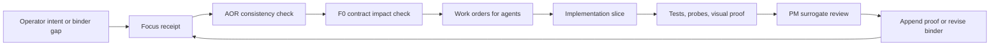

# 18 Build Prescription And Agent Launch Board

Status: current implementation prescription.

Purpose:
  Give the operator and future agents one place to answer: what do we build
  next, what waits, how many agents do we launch, and what proof makes a slice
  done?

This chapter is the binder's "go board." It does not replace the architecture
chapters. It turns them into assignable work orders.

## Executive answer

Yes, the binder needs one truth.

The current truth is:

- `README.md` defines the product spine and terms.
- This chapter defines the current build prescription and agent launch board.
- Chapter `07` defines milestone order.
- Chapter `12` defines chain decomposition and prompts.
- Chapter `16` defines who catches contradictions.
- The first implementation ADR and schema package from `F0` becomes the
  executable source of truth for code.

The binder is not finished by getting longer. It gets more trustworthy when
each iteration converts prose into:

- a versioned event or API contract;
- a test or conformance probe;
- a UI proof artifact;
- a remediation path;
- an append-only decision or proof record.

## Current product focus receipt

Decision:
  Build the official Agent Node control plane, starting with contract truth and
  transcript truth.

Now:
  `F0` contract freeze, then a narrow C1/C2/C3/C5/C8 fanout that proves one
  local official Agent Node can be transcripted, probed, shown, and governed.

Why now:
  The product will not feel real until the operator can see an agent's live and
  historical work, know whether it is compliant, and control only the actions
  Port Daddy can honestly govern.

Evidence:
  The strongest repeated operator complaint is blank or hollow control surfaces:
  no transcript, no live stream, no files, no model/provider truth, no clear
  compliant versus non-compliant status, and no click-first controls.

Not now:

- public harbors;
- marketplace or trust economy;
- full mobile product;
- cloud billing;
- Harbor Editor remote transport;
- broad website promises not backed by live control proof.

Cut/suspend:
  Do not add new launch verbs. Do not build more decorative control panels. Do
  not let old dispatch/sortie/spawn concepts keep independent runtime state.

First visible proof:
  A local Codex or Claude Code body appears in `pd-console` as an Agent Node
  with provider/model tier, compliance level, live stream or explicit
  no-stream reason, saved transcript events, files touched, and controls gated
  by compliance level.

Acceptance gate:
  The proof must survive relaunch from daemon truth, not from a cached UI model.

Kill/revisit trigger:
  If transcript ingestion cannot be made reliable for at least one local body,
  pause GPUI expansion and fix the adapter/transcript seam first.

Context switch count:
  One serial foundation plus five narrow implementation chains.

Agents needed:
  One senior `F0` agent first. After `F0` emits v0 contracts, launch five
  implementation agents plus one integration reviewer.

Owner:
  Harbor Architect of Record owns binder truth. The integration agent owns
  cross-chain merge order.

Review date:
  Revisit after `F0` contract freeze and the first local Agent Node proof.

## Iteration loop

Every Agent Harbor iteration follows the same loop:



Rules:

- If the slice changes runtime truth, update contract/schema/tests before UI.
- If the slice changes what users can do, update the operator surface and
  remediation path in the same iteration.
- If the slice changes a public promise, update website/docs only after proof.
- If a contradiction appears, the AOR logs it before implementation continues.
- If a proposed chain cannot state its input, output, owner, and proof gate, it
  is a planning placeholder, not an agent launch.

## Work orders to give agents

Launch these in order. `F0` runs alone. Everything after `F0` depends on its v0
contract package.

### Work Order F0 - Contract freeze

Send:
  One senior architecture agent.

Mission:
  Produce the minimum executable v0 contract for Agent Harbor.

Inputs:

- `README.md`
- `03-agent-contract-and-extension-api.md`
- `09-data-model-and-api.md`
- `11-redteam-whitehat-cross-lens-review.md`
- `12-agent-work-chains-and-second-pass-review.md`
- `14-work-intake-and-node-shaping.md`
- `16-binder-architect-of-record.md`

Outputs:

- an ADR for Agent Run Saga and backend authority;
- versioned schemas for `WorkIntent`, `WorkPlan`, `AgentNode`, `AgentRun`,
  `TranscriptEvent`, `ControlCommand`, `ComplianceProbeResult`,
  `CostAccrualEvent`, `WorkReceipt`, and `ContextEnvelope`;
- command/query/event boundary table;
- API versioning and tolerant-reader policy;
- migration list for old launch paths.

Acceptance gates:

- every user action maps to command, query, or event;
- UI cannot fabricate runtime truth;
- transcript, control, cost, claim, and receipt events are append-only;
- restart/reconnect can rebuild visible state from backend truth;
- old verbs are intake metadata, not runtime concepts.

Do not:
  Implement GPUI, adapters, cloud, billing, or Harbor Editor.

### Work Order C1 - Event ledger and projections

Send:
  One CQRS/database/event-driven TypeScript agent.

Mission:
  Make event truth and projections real enough for local Agent Node proof.

Outputs:

- append-only event-store table or equivalent migration plan;
- projection handlers for roster, transcript timeline, files touched, costs,
  compliance, and work receipts;
- idempotency keys and replay rules;
- stale projection behavior and rebuild command;
- unit tests for replay and projection idempotence.

Acceptance gates:

- projections rebuild from scratch;
- duplicate events are idempotent;
- unknown schema fields are tolerated;
- stale views are labeled and never used for command authorization.

### Work Order C2 - Adapter compliance probes

Send:
  One adapter/LLM-router/cost agent.

Mission:
  Prove which bodies are compliant, weak, observed, or unmanaged.

Outputs:

- capability matrix for Codex, Claude Code, Cloudflare, Ollama/LM Studio, and
  custom stdio or HTTP agents;
- a conformance design for the current launch surface, such as
  `pd spawn --probe`, `pd spawn --dry-run --probe`, or the future
  `pd work probe` once the single Work Intent command family lands;
- fixtures for compliant, weak, broken, and malicious adapters;
- model-tier policy: `fast`, `mid`, `strong`, `local`, `custom`;
- cost events for start, stream, abort, failure, and finalization.

Acceptance gates:

- forged compliance is downgraded;
- observed agents cannot receive C2+ controls;
- model tier and provider-specific model name are both visible;
- partial cost survives abort or failed body start.

### Work Order C3 - Operator control panel

Send:
  One Rust GPUI/product agent.

Mission:
  Turn Agent Nodes into a clickable roster and detail view.

Outputs:

- conjoined recent/active session list and detail pane;
- live stream renderer;
- historical transcript renderer;
- files touched with absolute path resolution and syntax-highlight preview plan;
- provider/model/compliance/cost/context display;
- click controls: open, pause, interrupt, steer, checkpoint, successor, retire;
- visual artifact plan for screenshot, GIF, and recording.

Acceptance gates:

- no ordinary operator action requires typing an ID;
- active and historical sessions are visually distinct;
- missing transcript shows exact cause and remediation;
- controls are enabled only when compliance supports them;
- pane failure does not blank the rest of the app.

### Work Order C5 - Governance and tool gates

Send:
  One security/governance agent.

Mission:
  Make the first runtime gate real: destructive git blocking plus human approval
  before risky actions.

Outputs:

- destructive-action policy matrix;
- pre-tool and post-tool event envelope;
- human gate payload shape;
- denial receipt shape;
- negative fixtures for destructive git, forged adapter, and missing hook.

Acceptance gates:

- destructive git fixture is blocked before side effects;
- the denial is visible in transcript and Work Receipt;
- remediation offers a safe alternative;
- same-UID or unmanaged bodies are not overclaimed as contained.

### Work Order C8 - Setup and doctor remediation

Send:
  One adoption/infrastructure agent.

Mission:
  Make the harness installable and repairable without command walls.

Outputs:

- `pd setup` and `pd doctor` flows for daemon, app, hooks, MCP, transcript path,
  Keychain, provider keys, worktree root, relay pairing, and stale versions;
- transparent hook names and descriptions;
- remediation cards for missing/disabled hooks and MCP drift;
- local-only versus cloud-sync status copy;
- first-value metric: time to first official Agent Node.

Acceptance gates:

- one default install path;
- one doctor repair path per detected issue when possible;
- no stale npm instructions;
- users can see what is local, what syncs, and what is disabled.

### Work Order C-routes - Daemon HTTP route layer

Origin:
  This work order was missing from the original fanout. I0's first
  compatibility report flagged it as Contradiction 1 ("the route triangle"):
  C3 and C8 both assume `GET /agent-nodes` exists, chapter `09` prescribes the
  endpoint family, and C1 built the projections — but no chain owned the HTTP
  routes joining them.

Send:
  One REST/SSE/daemon TypeScript agent, after C1 lands.

Mission:
  Serve the chapter `09` read API family over C1's projections from the
  Fastify daemon.

Outputs:

- `routes/agent-harbor.ts` (FastifyPluginAsync, registered in the route
  aggregator): `GET /agent-nodes`, `GET /agent-nodes/:id` (detail join),
  `GET /agent-nodes/:id/files`, `GET /sessions/:id/events` (cursor-paged
  history plus SSE live tail with `Last-Event-ID` replay), `GET /costs`,
  `GET /receipts/:id` (hash-chain verification against the ledger),
  `GET /compliance/:agentNodeId`;
- freshness envelope on every response: `projection.stale`,
  `lastLedgerSeq`, `headSeq`;
- fastify.inject test fixtures against seeded projections.

Acceptance gates:

- read-only: no route authorizes a command, stale or fresh;
- stale projections are labeled in the envelope, never hidden;
- unknown payload fields and query params are tolerated (tolerant reader);
- SSE stream sets `Cache-Control: no-cache` and `X-Accel-Buffering: no`,
  emits `id:` on every event, honors `Last-Event-ID` with a real replay
  buffer (the timeline projection), and heartbeats at most every 30 seconds;
- receipt verification checks the per-session hash chain AND the receipt's
  committed transcript head against the ledger — a mismatch is reported, not
  rubber-stamped;
- transcript history is cursor-paged, never unbounded.

Status:
  Shipped with C1 merged in (branch `wave3/routes`); registered in
  ADR-0095's Implementation Matrix as `agent-harbor-daemon-routes`.

### Work Order I0 - Integration reviewer

Send:
  One integration/code-review/PM-surrogate agent after F0 and during the first
  fanout.

Mission:
  Keep the chains from quietly inventing different truths.

Inputs:
  All F0/C1/C2/C3/C5/C8 outputs.

Outputs:

- compatibility report;
- contradiction register updates;
- proof gate results;
- PM-surrogate verdict: `SHIP`, `SHIP-WITH-NOTES`, or `BLOCK`.

Acceptance gates:

- no chain merges an API/event assumption that contradicts F0;
- every implementation claim has test or artifact evidence;
- no Potemkin UI state;
- no "live" claim without runtime proof;
- binder updates reflect what shipped versus what remains target-only.

### Work Order C10 - Cloudflare code-writing remote body + joinable read-only co-edit

Origin:
  Operator request (2026-07-06): "expand the Cloudflare fleet to also write code
  in remote harbors, and let these be joinable by the operator." Folded into the
  binder as the early example of the remote-harbor / cooperative-editing thread.
  Executable design: `docs/adr/0096-cloudflare-code-writing-remote-harbor-and-operator-coedit.md`.

Status:
  **Held.** Do not launch until the current C-wave has landed AND at least one
  LOCAL Agent Node's governance (transcript + tool gate + control) is visibly
  working end-to-end. The editable-buffer half is C6 and stays on the Not-now
  fence below.

Send (when unheld):
  One remote-runtime/harbor-authority agent, after a Harbor Authority contract
  freeze derived from ADR-0096 (the F0-analogue for this slice).

Mission:
  Turn the Cloudflare review executor's sibling — a code-writing remote body —
  into a compliant remote Agent Node in an authoritative remote harbor, and let
  the operator JOIN its governed buffer read-only.

Outputs (design → contract → slice):

- a Harbor Authority contract (harbor_id, authority epoch, single writer lease,
  revocation, per-artifact ACLs) — the deferred ch02 ADR, now ADR-0096;
- a `cloudflare` code-writing anode adapter: worktree binding, Sandbox Level 5,
  capability card (draft-PR-only until push is explicitly granted), transcript
  stream, cost meter;
- the ch20 "Harbor remote view": operator joins the running remote buffer
  read-only, claims as line-range stripes, semantic-conflict band;
- proof-gate results G1..G5 from ADR-0096.

Acceptance gates:
  ADR-0096 G1..G5 — remote node card with authority/cost/revocation; governed
  worktree with destructive-git blocked; remote interrupt race has no silent
  half-control; joinable read-only mirror sourced from durable events with
  operator writes explicitly disabled (Phase B pending); a verifiable Work Receipt.

Do not:
  Ship editable co-edit over the relay (that is C6 / ADR-0096 Phase B), public
  harbors, cloud billing, or a push to the operator's main checkout.

## Agent count rule

For the first execution wave:

```text
1 agent now: F0 contract freeze.
Then 6 agents: C1, C2, C3, C5, C8, I0.
Hold C4/C6/C7/C9 until F0 is done and at least one local Agent Node emits real events.
```

Why not more:
  More agents before contract freeze will create incompatible schemas and
  duplicate state machines.

Why not fewer:
  After F0, ledger, adapters, UI, governance, setup, and integration can
  advance mostly independently if they obey the same contracts.

## Tests and quality signals

The first implementation wave needs these tests, in this order:

1. Type/schema tests for v0 event and API contracts.
2. Event replay tests: rebuild roster and transcript projection from events.
3. Adapter probe tests: compliant, weak, broken, malicious.
4. Governance tests: destructive git denied before side effects.
5. GPUI fixture tests or golden screenshots for roster/detail states.
6. Doctor fixture tests for missing hooks, missing transcript path, and stale
   adapter.
7. End-to-end smoke: start one local Agent Node, emit transcript events, render
   it in the app, interrupt or deny an action, and seal a Work Receipt.

Longer-term skill and agent quality should use an attestable outcome log:

- record task, skill set, output hash, judge result, and timestamp;
- commit the outcome log with a Merkle root;
- compute local attribution over similar tasks;
- publish narrow confidence intervals only when enough calibrated outcomes
  exist.

Do not present early skill-quality numbers as global truth.

## Data model shibboleths

- The event log is sacred; projections are disposable.
- Commands decide; queries display; events record what happened.
- A UI pane can be stale, but a tool gate cannot be authorized from stale data.
- Transcript absence is data, not emptiness.
- Local transcripts are saved by default; cloud sync is a separate opt-in.
- Old launch verbs are compatibility shims until deleted.
- A Work Receipt is the trust object customers can inspect.

## What to hand an agent verbatim

Use this wrapper, then append the specific work order above:

```text
You are working inside the Port Daddy Agent Harbor implementation wave.

Start with pd attention, pd status, pd briefing, and a pd note naming this work
order. Coordinate with claims before edits. Read
docs/architecture/agent-harbor-technical-binder/README.md and
docs/architecture/agent-harbor-technical-binder/18-build-prescription-agent-launch-board.md.

Your work must preserve the source-of-truth hierarchy:
README and chapter 18 for current prescription, chapter 07 for milestone order,
chapter 12 for chain rationale, chapter 16 for contradiction ownership, and F0
contracts for executable implementation truth.

Return only evidence-backed claims: files changed, tests run, runtime proof,
visual artifacts if UI changed, and what remains target-only. Do not call a
feature live without proof.
```

## What changes next

After `F0` lands:

- replace this chapter's schema names with links to actual ADR/schema files;
- convert C1/C2/C3/C5/C8 from doc work orders into PR-ready work packets;
- add `C4` transcript search and context compaction only after events exist;
- add `C7` evaluation fixtures once there is behavior to measure;
- start `C9` Longshoremen as passive observers before they can steer agents;
- keep `C6` Harbor Editor in design until local Agent Node governance is
  visibly working.
- keep `C10` (Cloudflare code-writing remote body + joinable read-only co-edit,
  ADR-0096) held until the C-wave lands and local Agent Node governance is
  visibly working; its editable-buffer half is C6 and stays on the Not-now fence.

This is the prescription until the next focus receipt revises it with evidence.
