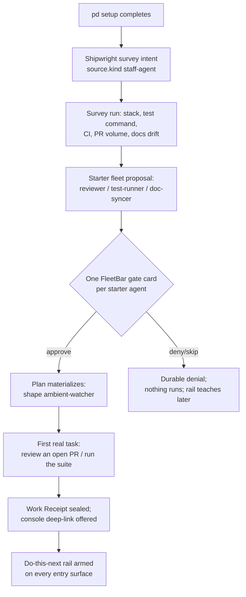

# 23 Onboarding And Cold Start: The Shipwright First-Run And The Do-This-Next Rail

Status: target-state design chapter. This is the dedicated design pass that
strategy doc `docs/strategy/2026-07-06-distribution-dogfood-and-go-to-market.md` <!-- cite-exempt: proposed in PR #707; not yet shipped -->
§11 took a position on and §14 deferred to "dedicated design work." Nothing in
this chapter is shipped; its substrate mostly is (M1–M4, the F0 v0 contracts,
and the M5 GuidanceEnvelope frozen by ADR-0096 on 2026-07-06).

Owning skills (Seamanship, grafted for this chapter):
`recovery-app-onboarding`, `wellness-app-engagement`, `ai-introduction-educator`,
`agentic-coding-ux-designer`, `legible-roadmap-with-sidequests`,
`architecture-binder-of-record`.

Purpose:
  Kill the blank-fleet cold start. An operator who runs
  `brew install port-daddy && pd setup` today lands on an empty harbor: no
  agents, no receipts, no obvious next action. This chapter designs the two
  mechanisms that close that gap — (a) the **Shipwright first-run**, which
  surveys the repo and proposes a starter fleet the operator confirms one
  card at a time, and (b) the **do-this-next rail**, the operator-facing face
  of the M5 guidance channel, surfaced at the entry of every sanctioned
  surface. Both are governed by one ethic: serve the operator's outcome, not
  a retention metric.

## The cold-start problem, stated as a failure mode

The strategy doc names it as the real adoption risk; the grafted skills name
it precisely:

- **Blank-canvas paralysis** (`recovery-app-onboarding`, "Feature FOMO
  Overload"): nineteen surfaces, seven wedges, and an empty roster is a wall,
  not an invitation. The fix is progressive disclosure — show one thing,
  deliver one micro-win, defer everything else.
- **Passive observatory learning** (`ai-introduction-educator`): an operator
  who reads about the fleet but never watches an agent do one real thing on
  *their* repo never converts. The aha moment must be hands-on, on their own
  code, within minutes — and the complexity ladder must not skip rungs: one
  agent doing one task comes before chains, DAGs, and parleys.
- **No comeback loop** (`agentic-coding-ux-designer`): a first session that
  ends without a durable receipt and an obvious next action has no reason to
  produce a second session.

The cold-start guarantee this chapter commits to, verbatim from strategy §11:

> Within ~5 minutes of install, the operator has watched one agent do one
> real thing on their own repo and produce a receipt.

## Fit: the hub/spoke model and the surface triad

Onboarding is a property of the **substrate**, rendered per-surface — never a
per-app wizard. This follows directly from strategy §9 (the daemon is the hub;
every surface is a spoke) and chapter 19's authority rule (surfaces differ in
affordance, never in authority):

- The Shipwright survey, the starter-fleet proposals, the confirm decisions,
  the first receipt, and every rail item are **daemon truth** — ledger events
  and projections. A surface that is closed during first-run misses nothing;
  it renders the same onboarding state when it opens.
- **FleetBar** is where the starter-fleet confirms land, because chapter 19
  makes it the consent surface: each proposed starter agent is a human-gate
  card (scope, skills, cost ceiling) and the only thing allowed to ask for
  the operator's attention.
- **pd-console** is where the first receipt is *watched*: the operator clicks
  the starter agent in the roster and sees the live transcript — the M1–M4
  capability, pointed at the aha moment.
- **Scout, mobile, the website account home** get the rail (below) but no
  bespoke onboarding flow; they deep-link into FleetBar/console per the
  chapter 19 boundaries.
- The `pd` CLI mirrors everything (`pd setup` drives the same intents and
  gates; `pd doctor` reports onboarding state like any other spoke state).

One consolidation note, to keep faith with PR #652 and chapter 19: strategy
§11b says the rail appears on "the web dashboard." The daemon web dashboard is
retired; the rail's web home is the **website account surface** (the logged-in
portdaddy.dev home, chapter 20's storefront set) and **mobile** — remote,
receipt-and-consent views. The sanctioned entry surfaces for the rail are:
FleetBar home, Fleet Control Center, pd-console launch view, mobile home, the
Scout popup (compact, intake-scoped), and the website account home. No fourth
desktop surface is created.

## Part (a): the Shipwright first-run

### The archetype, absorbed

Shipwright is the binder corpus's oldest good idea
(`docs/shipwright/SHIPWRIGHT-DAEMON.md`, 2026-04-19): an agent that *reads the
repo, proposes a fleet, and spends model tokens doing it* — survey → proposal
→ generated fleet, with episodic memory of prior `(survey, proposal, outcome)`
triples. This chapter absorbs that ambition into the Agent Harbor model
(ambition-archaeology classification below). What changes: Shipwright is not
a special runtime. It is a **staff agent** whose runs are ordinary Agent
Nodes, launched through the same `WorkIntentService → WorkPlanner →
AgentNodeService` chain as everything else (chapter 14). Its Work Intents
carry `source.kind: "staff-agent"`. No new verbs, no new launch path.

This has a pleasant dogfood consequence: **the first agent the operator ever
watches is Shipwright itself.** The survey run appears in the roster, streams
its transcript, and seals a receipt like any Voyager. Onboarding does not
simulate the product; it *is* the product.

### The flow



Step by step, with the skill lens that governs each step:

1. **Survey** (≤60 s target). Shipwright reads the repo: language/stack,
   test command, CI config, open PR count and staleness, docs directories and
   their drift against recent code churn. The survey is **local-only
   evidence**: it never leaves the host, is not synced, and is stored as a
   `RepoSurvey` artifact referenced by the proposal (privacy stance below).
2. **Proposal** (`agentic-coding-ux-designer`: show agent intent before
   action). Shipwright proposes a **starter fleet of at most three**:
   a PR **reviewer**, a **test-runner**, a **doc-syncer** — each proposal
   citing the survey evidence that justifies it ("14 open PRs, 6 older than a
   week → reviewer") and naming its grafted skills, its cost ceiling, and its
   trigger condition. Three is a hard cap (`recovery-app-onboarding`: limit
   to three essential features; everything else is post-onboarding
   discovery). A repo whose evidence supports fewer gets fewer — an honest
   two-card proposal beats a padded three.
3. **One confirm each** (`recovery-app-onboarding`: contextual permission
   priming, never a permission wall). Each starter agent is its own FleetBar
   human-gate card, approved or denied independently. Cost appears on the
   card — chapter 20 law 11, cost at the consent moment. Denying all three is
   a first-class path that leaves a working, teaching empty state (chapter 20
   law 12), not a broken install.
4. **First real thing** (`ai-introduction-educator`: the aha demo is on
   *their* data, hands-on, within minutes). On approval, the highest-evidence
   starter agent immediately does one bounded real task: the reviewer reviews
   the oldest open PR; the test-runner runs the suite and reports; the
   doc-syncer diffs one drifted doc. The operator is offered the console
   deep-link to watch live.
5. **Receipt** (`agentic-coding-ux-designer`: end with a durable receipt).
   The task seals a Work Receipt — transcript hash chain, diff, cost,
   approvals. The receipt is the micro-win (`wellness-app-engagement`:
   deliver the win before asking for any further commitment) and the proof
   object the operator can show a teammate.
6. **Failure is a teaching moment, not a crash**
   (`ai-introduction-educator`, demo-recovery tree): if the starter task
   fails — tests genuinely broken, PR unreviewable — the receipt says so
   honestly and the surface frames it: "the suite fails on main; that is a
   true fact about the repo the agent just proved." An honest failed receipt
   within 5 minutes still satisfies the cold-start guarantee's spirit: one
   agent, one real thing, one receipt. Never fake a success.
7. **Rollback is a visible primitive**: `pd fleet retire --starter` (and the
   equivalent Control Center action) retires the whole starter fleet, with
   receipts retained. Onboarding that cannot be undone in one gesture fails
   the `agentic-coding-ux-designer` design loop.

### Re-entry and maintenance (the lapsed operator)

`wellness-app-engagement` governs everything after day one:

- A starter agent that has not run in two weeks produces a **re-arm nudge**
  on the rail — value-framed ("your reviewer is dark; 5 PRs have landed
  unreviewed"), never loss-framed, never a streak. No guilt copy anywhere
  ("When you're ready", not "You missed").
- Notification cadence follows the skill's decision tree: an operator
  inactive 14+ days gets **no** engagement notifications; the rail simply
  renders truthfully whenever they return, leading with accumulated value
  ("23 receipts while you were away"), never with the gap.
- `pd setup --rerun` re-enters onboarding at any time (the
  `recovery-app-onboarding` "return to onboarding from settings" gate), and
  Shipwright re-surveys on demand — its episodic memory of prior
  `(survey, proposal, outcome)` triples makes the second proposal better than
  the first.

## Part (b): the do-this-next rail

### What it is

M5's guidance channel (ADR-0096, accepted 2026-07-06; `GuidanceEnvelope` v0
frozen) was built to put verified guidance in front of an *agent's* turn.
The rail is the same suggestibility idea pointed at the *operator's* turn:
the entry of every app is the operator's turn start. One consistent,
evidence-backed strip of at most three next actions:

> PR #91 needs a review — run it? · context 92% on `voyager-3` — compact? ·
> conflict forecast on `retry.ts` — parley?

Each rail item is:

- **evidence-backed**: it carries a `ref` to the daemon truth that justifies
  it (a PR projection, a ContextEnvelope pressure reading, a
  conflict-forecast event). An item with no evidence ref cannot render —
  this is the `legible-roadmap-with-sidequests` link-or-opt-out discipline
  applied to suggestions: every suggestion is traceable or it does not
  exist.
- **one-tap actionable, never auto-acting**: the item embeds a prebuilt
  draft — a Work Intent (`status: "draft"`), a ControlCommand, or a
  deep-link — and acting on it routes through the normal consent path with
  cost shown at the gate (chapter 20 law 11). The rail suggests; the
  operator decides; the daemon enforces. Nothing on the rail ever runs by
  itself.
- **dismissible durably**: dismissing an item persists against its evidence
  `ref`; the same ref never resurfaces without new evidence. A rail that
  nags is a guilt machine (`wellness-app-engagement` failure mode 1).
- **capped at three**: ranked by evidence strength and staleness cost, never
  by engagement value. More than three is Feature FOMO
  (`recovery-app-onboarding`); the fourth-best action lives behind
  "more", one click away.

### The rail and the roadmap

Strategy §12's "lookout loop" lands here: once a tracker or roadmap is
connected (GitHub Issues, Jira, Linear, or `pd roadmap`), rail items may
originate from it ("`incremental-symbol-index-refresh` is unblocked and
~150 LOC — start it?"), and every rail item that spawns work carries the
`roadmapLink`/opt-out annotation on its draft intent
(`legible-roadmap-with-sidequests`). Follow-on work an accepted rail action
surfaces is spawn-captured in the same sitting, per that skill's process —
the rail must not become a source of illegible sidequests.

### Contract: reuse F0 v0, add one projection

The rail deliberately reuses the frozen v0 vocabulary instead of inventing a
parallel one:

| Need | Reused contract | Notes |
| --- | --- | --- |
| Item typing | `guidance-envelope.schema.json` `items[]` — `{ kind, ref, priority, severity, skills[] }` | Known kinds extend by one: `next-action` joins `inbox`, `conflict-warning`, `skill-graft`, `memory-packet`, `repo-update`. Tolerant reading per ADR-0096: unknown kinds render as unrecognized, never dropped, never acted on. |
| Freshness | envelope `issuedAt` / `notAfter` / `nonce` | A stale rail item past `notAfter` degrades to a stale chip (chapter 20 law 13), never renders as current. |
| Operator authority | envelope `authority` — `loopback` \| `macaroon` | Local surfaces: loopback. Mobile/web/teammate surfaces: the attenuated macaroon chain, mandatory — a teammate's suggestion is scoped and auditable. |
| The action payload | `work-intent.schema.json` (`status: "draft"`, `startPolicy: "queued"`), `control-command.schema.json`, or a deep-link | Acting = submitting the draft through the normal intake; the rail owns zero execution. |
| Starter fleet plans | `work-plan.schema.json` — `shape: "ambient-watcher"`, `requiresApproval: true`, `gates[]` | One plan per starter agent; the FleetBar card is the chapter 18 C5 gate envelope. |
| Skill grafts on starters | `skill-graft.schema.json` | Every starter node names its grafted seamanship on the proposal and the receipt — chapter 19: Navigation without Seamanship is planning theater. |
| The first receipt | `work-receipt.schema.json` | Unchanged. The cold-start guarantee is measured by this object existing. |

What v0 does **not** cover, stated honestly: `GuidanceEnvelope` v0 is bound to
an agent turn (`agentNodeId`, `sessionId`, `turnSequence` are required), and
its signature exists because an agent *cannot* trust its own context. The
operator rail is a different trust situation — surfaces already authenticate
to the daemon (loopback socket / relay macaroons) and render only daemon
truth, so per-item signatures buy nothing locally. The proposal is therefore a
new, small **`NextActionRail` projection** (F1 candidate, not a v0 mutation):

```
NextActionRail v0-draft
  surfaceKind      fleetbar | control-center | console | mobile | scout | web-account | cli
  operator         string
  issuedAt / notAfter / nonce        (reused semantics)
  authority        { mode: loopback | macaroon, authorityRef }
  items[] (≤3)     { kind, ref, priority, evidence: { summary, eventRefs[] },
                     action: { draftIntent? | controlCommand? | deepLink? ,
                               estimatedCost? },
                     dismissToken }
```

Whether this freezes as an F1 schema or ships first as an unfrozen daemon
projection is an open question below; either way the `items[]` vocabulary
stays compatible with `GuidanceEnvelope` items so that one source of guidance
feeds both the agent channel and the operator rail.

### One rail, everywhere, honestly

The consistency requirement is absolute: the same daemon state produces the
same ranked rail on every surface, within the chapter 19 hot-bus latency
budgets (rail deltas ride the hot bus; dismissals and acted-on drafts are
cool-bus events). A surface with a disconnected daemon renders the chapter 20
law-13 honest state — cached rail with a stale chip and remediation on its
face — never a confident stale suggestion.

## The ethical-engagement laws (binding, not aspirational)

Absorbed from `wellness-app-engagement` and `recovery-app-onboarding` and
binding on every onboarding and rail surface, the way chapter 20's content
honesty laws bind copy:

1. **Outcome KPI, not engagement KPI.** The onboarding funnel's primary
   metric is receipts-sealed-on-operator-repos (and time-to-first-receipt),
   never DAU, session length, or rail-tap rate. A rail change that raises
   taps but not receipts is a regression.
2. **Every step skippable; skip-all leaves a working install.** No step of
   first-run blocks on completion. The `recovery-app-onboarding` quality
   gate, transposed: the whole flow completes in under 5 minutes, and every
   step is skippable with the consequence stated plainly.
3. **No loss-framing, no streaks, no guilt copy.** Re-engagement leads with
   accumulated value; gaps are never mentioned; nudges stop entirely after
   14 days of inactivity unless the operator returns.
4. **No dark-pattern rail items.** A rail item must trace to daemon evidence
   of operator value. "Check out feature X" promotional items are forbidden;
   discovery happens through empty states that teach (chapter 20 law 12).
5. **Cost before consent, everywhere.** Starter-fleet cards and rail actions
   show estimated cost at the gate. Budget ceilings on starter agents are
   hard caps enforced by the daemon, defaulting conservative.
6. **The rail serves the operator who wants to leave.** "Pause everything"
   and "retire starter fleet" are one gesture, offered without friction or
   confirm-shaming.

## Ambition archaeology (per `architecture-binder-of-record`)

The Shipwright corpus is the older ambition this chapter reconciles:

| Ambition (source) | Classification | Destination |
| --- | --- | --- |
| Survey → proposal → generated fleet (`SHIPWRIGHT-DAEMON.md` §0) | **absorbed** | this chapter, part (a) |
| Shipwright episodic memory of `(survey, proposal, outcome)` triples | **absorbed** | re-survey behavior, part (a) step 7 / re-entry |
| The Plane actor runtime, seven archetypes, FIPA-lite grammar (`AGENT-MODEL.md`) | **superseded** | Agent Node / Soul / Body model, chapters 03 and 14 |
| Ship grammar and fleet simulation/chat surfaces (`SHIP-GRAMMAR.md`, `UTOPIAN-VISION.md`) | **deferred** | revisit after M8 governance; no owner today |
| `pd-fleet.yml` declarative fleet (ADR-0019 proposal) | **absorbed (partial)** | starter-fleet proposals materialize as Work Plans, not YAML; the declarative file survives as an export/import format question (open question 5) |

The Architect of Record (chapter 16) owns keeping this table honest as the
chapters land.

## Acceptance gates

Chapter-scoped gate ids (IT-23x) rather than the next sequential IT-0xx,
because chapters 21–23 are being authored in parallel and sequential ids
would collide; the AoR renumbers into the chapter 00 matrix at fold-in.

### IT-23A Five-Minute Receipt

Fixture: a clean macOS VM, a seed repo with open PRs and a real test suite;
run `brew install port-daddy && pd setup`, approve the reviewer card.

Verify: wall-clock from `pd setup` completion to a sealed Work Receipt for
one real task on the seed repo is ≤ 5 minutes; the receipt validates against
`work-receipt.schema.json` and names the starter agent's grafted skills;
declining every card still lands in a working install whose empty states
teach the next action; a genuinely failing suite yields an honest failed-task
receipt, not a fake success.

### IT-23B Starter Fleet Consent

Fixture: the Shipwright proposal renders three starter cards in FleetBar.

Verify: each card shows scope, grafted skills, trigger, and estimated cost
before approval; nothing executes before the gate decision; approve
materializes a Work Plan with `shape: "ambient-watcher"` and a durable gate
decision; deny lands a durable denial and the agent never runs; no card
renders for a body whose compliance level cannot honor the decision
(chapter 19 IT-016 rule); `pd fleet retire --starter` retires everything in
one command with receipts retained.

### IT-23C Rail Consistency

Fixture: one daemon state containing a stale PR, a high-pressure context
envelope, and a conflict forecast; open FleetBar, pd-console, mobile, and the
website account home.

Verify: all surfaces render the same ≤3 items in the same order within the
chapter 19 hot-bus latency budget; every item carries an evidence ref that
resolves to a real ledger object and a prebuilt draft action with cost;
acting on an item routes through normal intent/command intake (one consent,
no auto-execution); dismissing an item on one surface removes it everywhere
and it never resurfaces on the same evidence ref; daemon-down renders the
stale/disconnected chips of chapter 20 law 13 on every surface.

### IT-23D Ethical Engagement Audit

Fixture: a simulated operator inactive 14 days, then returning; plus a copy
audit of every onboarding and rail string.

Verify: zero engagement notifications fire after day 14; the return surface
leads with accumulated value and never mentions the gap; no string in the
flow uses loss-framing, streak language, or confirm-shaming (reviewed against
the `wellness-app-engagement` notification-audit gate); every rail item in
the fixture window traces to daemon evidence — an item with no evidence ref
is a build failure; the funnel dashboard's primary metric is
time-to-first-receipt, not engagement.

## Relationship to earlier chapters

- **Chapter 01 / 19**: surface inventory and triad division of labor are
  unchanged; this chapter only assigns onboarding roles within them
  (FleetBar consents, console proves, spokes render one rail). The web-rail
  placement defers to the PR #652 consolidation as stated above.
- **Chapter 03**: the C3 (Suggestible) guidance channel is the agent-side
  twin of the rail; ADR-0096's verified-channel reframe is why rail items
  can safely embed draft intents authored by daemon projections.
- **Chapter 04**: starter agents are Longshoreman-flavored standing watchers;
  their skill grafts ride the chapter 04 graft service and appear on
  receipts.
- **Chapter 14**: Shipwright adds **no** launch verbs. Survey and starter
  tasks are Work Intents; proposals are Work Plans; the placeholder rules
  apply to a proposal the operator hasn't gated yet.
- **Chapter 16**: the AoR owns the ambition-archaeology table above and the
  gate-id renumbering at fold-in.
- **Chapter 18**: first-run and the rail slot into the build board as a
  post-M5 work order pair (the rail is buildable the day the guidance
  projections exist; Shipwright first-run additionally wants C8
  setup/doctor, shipped).
- **Chapter 20**: laws 11–14 (cost at consent, teaching empty states, honest
  chips, remediation prompts) govern every pixel this chapter describes; the
  rail and the starter cards are rendered in the story-linework system.
- **Strategy doc §9–§14**: this chapter realizes §11 end-to-end, implements
  the §12b "lookout loop" attachment point on the rail, and leaves §10 (the
  Automations app) and §13 (orchestration visualization) to their own design
  passes.

## Open questions (honest)

1. **Freeze or project?** Does `NextActionRail` become a frozen F1 schema
   now, or ship as an unfrozen daemon projection until two surfaces consume
   it? Freezing early risks a bad contract; not freezing risks four surfaces
   drifting. Recommendation: projection first, freeze at the second surface.
   Operator call.
2. **Who authors rail items?** Pure daemon projections (deterministic, cheap,
   dumb) versus a Lookout Longshoreman (an agent that reads projections and
   writes ranked suggestions — smarter, costs tokens, needs its own budget
   and its own receipt trail). Likely both, with the agent-authored tier
   clearly attributed. Unresolved.
3. **Ranking without keyword hacks.** Rail ranking must use the Seamanship
   cascade's machinery (embeddings, outcome attribution) — never keyword
   lists — but the outcome-attribution loop for *suggestions* (did acting on
   this item lead to a sealed receipt?) is undesigned.
4. **Survey privacy boundary.** The `RepoSurvey` is local-only in this
   design; but a team harbor onboarding (M10) will want to share proposals
   without sharing surveys. The redaction shape is undesigned.
5. **Starter fleet as artifact.** Should an approved starter fleet be
   exportable (`pd-fleet.yml`, ADR-0019's descendant) so a team can share a
   known-good fleet as a file — and does that become a marketplace good
   (strategy §8) with a receipt trail? Attractive, undesigned.
6. **Windows first-run.** The daemon/CLI path is portable; the FleetBar
   consent moment has no Windows tray equivalent yet (strategy §9 Windows
   track). The five-minute guarantee on Windows is unowned until that track
   is named.
7. **Cold start with no repo.** A non-coder entering through the Automations
   wedge (strategy §10) has no repo to survey. Shipwright's survey needs an
   equivalent for the trigger→automation world, or that wedge gets its own
   first-run in the Automations chapter.
