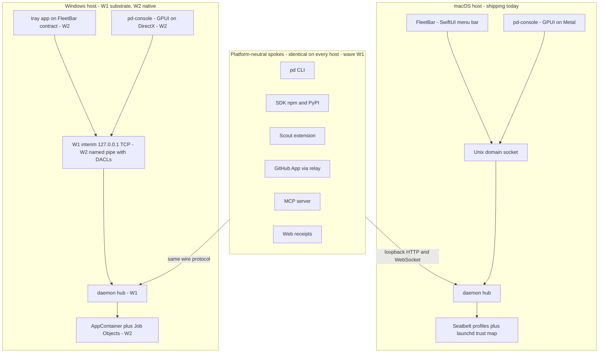

# 24 Cross-Platform And The Windows Track

Status: platform-scope chapter. This chapter answers the chapter 16 AoR open
row "Cross-platform and Windows IPC — the binder is Mac-heavy; if Port Daddy
is Mac-first now, say so and name the later platform gate." It realizes the
deferred design item from the distribution strategy
(`docs/strategy/2026-07-06-distribution-dogfood-and-go-to-market.md`, §9 and <!-- cite-exempt: strategy doc lives on the strategy/distribution-and-dogfood branch (PR #707), not yet shipped to main -->
§14): the Windows track becomes a **named gate with an owner and acceptance
tests**, not an omission. Nothing in this chapter changes the Mac-first
sequencing; it makes that sequencing an explicit, auditable product decision.

Skill lenses grafted for this chapter: `cross-platform-desktop` (platform
abstraction, close-vs-quit and tray conventions, DPI/fractional scaling, CI
matrix discipline), `rust-app-distribution` (Authenticode/Azure Trusted
Signing, MSI/winget/Scoop, SmartScreen reputation, updater signing),
`daemon-development` (Windows service vs launchd/systemd supervision, restart
policy, graceful shutdown parity), `macos-host-security` (the containment
trust map that Windows must re-derive — read-only sensors vs real authority),
and `architecture-binder-of-record` (every capability below carries an owner,
a gate, and an evidence slot; prose without proof is not coverage).

The design pass added three surface lenses that bind the W2 native work:
`beautiful-gui-design` (platform-native idioms are load-bearing — tray-flyout
vs menu-bar popover, close-means-minimize, semantic tokens that survive
light/dark on both hosts), `typography-expert` (the IT-24D legibility gates:
Segoe UI Variable in the Windows token font stack, tabular figures for
transcript-density numerics, text verified at 125%/150% fractional scaling
where DirectWrite hinting diverges from Core Text), and `frontend-design`
(words are design material — the honest empty state "not available on this
platform yet, lands at gate W2" is copy that names the gate, never a vague
apology).

## The concept: Windows is a gate, not a hope

Mac-first is a sequencing choice, not a strategy (strategy §9, verbatim). The
binder's job is to keep that choice honest in three ways:

1. **Name what is platform-neutral today.** The hub and most spokes already
   run anywhere Bun runs. Pretending the whole product is "Mac-only" would
   understate what ships; pretending it "runs on Windows" would overstate it.
2. **Name the port cost precisely.** The cost is concentrated in three places:
   the native surfaces (FleetBar and pd-console), the IPC transport (loopback
   Unix socket → named pipe with DACLs), and the enforcement substrate
   (Seatbelt/launchd trust map → AppContainer/Job Objects/Windows service
   ACLs). Everything else is packaging.
3. **Sequence it against M10 with its own gates.** The Windows track is
   milestone-gated (W-track gates below), opens in two waves (headless first,
   native surfaces second), and no chapter may claim Windows support that has
   not passed a W gate.

The one-line contract:

> The daemon is the hub; every surface is a spoke that discovers or pairs to
> it (strategy §9). Spokes that speak only HTTP/WebSocket to the hub are
> platform-neutral by construction and land on Windows early. Spokes that
> touch the host — tray, GPUI window, sandbox, IPC endpoint — are ports, and
> each port has a gate.

The same picture as a diagram. The top band never changes between hosts —
those spokes dial whichever daemon is local (or relay-paired) over the same
wire protocol. Everything below the daemon line is host territory, and host
territory is where the W gates live:

Reading rule: an arrow into a daemon is a spoke; an arrow out of a daemon is
the enforcement substrate it stands on. The two hosts differ only in the
bottom two layers — transport and containment — which is exactly where W1
(interim, honest) and W2 (hardened, native) draw their lines.

## What is platform-neutral now versus what needs the port

This is the honest inventory as a capability matrix, keyed to the strategy §9
surface table: what each surface is on macOS today, what it is on Windows
today, and what the port actually costs. "Zero/near-zero" means packaging
plus CI proof of code that has no macOS dependency; anything more is real
platform work and carries a W gate.

| Surface | macOS status | Windows status | Port cost | Wave |
| --- | --- | --- | --- | --- |
| Daemon (hub) | shipping — LaunchAgent-supervised, Unix-socket endpoint | runs wherever Bun runs (Linux already proves it); unsupervised, unpackaged | **low** — supervision + transport are the ports (own rows below); the TS core is neutral | W1 |
| CLI (`pd`) | shipping | neutral — `path.join` discipline already holds (ADR-0028) | **low** — PowerShell completion, `%LOCALAPPDATA%\port-daddy\` runtime dir | W1 |
| SDK (npm TS, PyPI next) | shipping | neutral — HTTP/socket client; socket→TCP fallback already exists | **near-zero** — CI proof on a Windows runner | W1 |
| MCP server | shipping — ships with daemon | neutral — stdio/loopback | **near-zero** — rides the daemon port | W1 |
| Webhooks / HTTP API | shipping — part of daemon | neutral — part of daemon | **zero** beyond the daemon row | W1 |
| GitHub App | shipping | neutral — webhook → relay → daemon; never touches the host OS | **zero** | W1 |
| Scout (Chrome ext.) | shipping (ch19) | neutral — Chrome is Chrome; loopback HTTP to the daemon | **near-zero** — pairing/loopback address only | W1 |
| Website / receipts | shipping — Cloudflare Pages | neutral by design — browser-verifiable receipts are platform-free (ch00 test 11) | **zero** | already |
| Relay | hosted Cloudflare Worker | hosted — host-OS-indifferent | **zero** | already |
| Installers / updaters | brew + Developer ID + notarization | absent | **medium** — MSI/winget/Scoop, Authenticode (EV or Azure Trusted Signing), SmartScreen reputation, soak gates | W1 |
| Service supervision | LaunchAgent plist, KeepAlive | absent | **low-medium** — Windows Service (SCM recovery actions) or Run-key early; restart/backoff parity per `daemon-development`; `pd doctor` Windows probe | W1 |
| IPC transport | Unix domain socket, file-mode authority | absent | **medium** — interim `127.0.0.1` TCP per ADR-0028, then named pipe with SDDL DACLs + `PIPE_REJECT_REMOTE_CLIENTS` (V4 phase 4F); blocked on Bun named-pipe support or a Rust shim | W1 interim, W2 hardened |
| Sandbox / containment | Seatbelt profiles + launchd trust map | absent | **high** — AppContainer, Job Objects, restricted tokens; profiles re-derived, not translated (`macos-host-security` cardinal rule below) | W2 |
| FleetBar | shipping — SwiftUI menu bar | absent — only the ch19 contract carries over | **high** — a new tray-app body; contract, tokens, and state machine reused, code not | W2 |
| pd-console | shipping — GPUI on Metal | GPUI supports Windows (DirectX/DirectWrite) but our Metal-tuned text/shader work (`metal-text-pipeline`, `gpui-shaders`) is unverified there | **medium-high** — rendering spike + host integration (window chrome, IME, DPI) | W2 |
| Fleet Control Center | shipping — rides FleetBar's shell | webview content (`/fleet-ui/`) is neutral; window chrome is the port | **low** once the tray app exists — token CSS verified on WebView2 | W2 |
| Mobile | n/a — relay-paired | n/a — indifferent to desktop host OS | **zero** for this track | M10 |

Consequence worth stating plainly: **an operator on Windows can get the
daemon, CLI, SDK, Scout, GitHub App, MCP, webhooks, and web receipts — eight
of the strategy's wedges — before a single native pixel is ported.** The
headless substrate is the early Windows product. What they do not get until
W2 is the glance surface (FleetBar), the deep surface (pd-console), and
hardened local containment. That is a usable, honestly-labeled subset: the
CLI + Scout + web receipts triad-minus-native.

## Fit with the surface triad and the hub/spoke model

Chapter 19's triad rule — Scout captures intent, FleetBar grants consent,
pd-console shows the truth; no surface owns runtime state — is exactly what
makes the port tractable, and this chapter leans on it rather than amending
it:

- **Scout is unchanged on Windows.** It already speaks loopback HTTP to the
  daemon and holds no host capabilities (ch19 placement rule 1). Chrome on
  Windows is the same extension. The only delta is daemon discovery
  (`127.0.0.1` TCP port instead of a socket path), which the CLI's
  socket-missing → TCP fallback already models.
- **FleetBar's contract ports; its code does not.** The ch19 contract —
  six-state glance, gate queue as the only attention demand, intent composer,
  read/write/suggest semantics, "never render a control the daemon cannot
  enforce" — is platform-free. The SwiftUI implementation is not. The Windows
  expression is a tray app (notification-area, bottom-right, per
  `cross-platform-desktop` conventions: tray-flyout instead of menu-bar
  popover, close-means-minimize-to-tray, Segoe UI in the font stack, tested
  at 125%/150% fractional scaling). Ch20's token contract already defines a
  cross-runtime mapping (`docs/design/story-linework/apps.html`); the tray app consumes the same tokens.
  It is a re-expression of a spec, not a fork of a product: the popover state
  machine and gate-card schema in `work-packets/fleetbar-technical-spec.md`
  are the source, and any behavior the tray app cannot express is logged as a
  ch16 contradiction, not silently dropped.
- **pd-console rides its framework.** GPUI runs on Windows; the risk is
  concentrated in our rendering investments (Metal-tuned text and shader
  paths) and in host integration (window chrome, IME, DPI). The W2 gate
  requires the transcript renderer and roster/detail panes — the M1–M4 truth
  surfaces — before any shader polish.
- **The hot/cool bus is transport-symmetric.** Ch19's decision — one
  multiplexed loopback WebSocket per surface for the hot bus, append-only
  ledger for the cool bus — never depended on Unix sockets. On Windows the
  WebSocket rides the loopback TCP listener (interim) or the named pipe
  (hardened). Latency budgets carry over unchanged: live board p95 < 250 ms,
  steering p95 < 100 ms, local IPC hop < 10 ms, loopback hop < 25 ms, durable
  append < 500 ms. A Windows port that cannot meet the steering budget is not
  done; it is a finding.

The hub/spoke install story also carries over verbatim from strategy §9:
`winget install Curiositech.PortDaddy` (or the MSI) stands up daemon + CLI +
MCP in one step; every other surface is a one-command or one-click add that
pairs to the running daemon; `pd doctor` reports which spokes are installed,
paired, or stale — including "FleetBar: not available on this platform yet
(Windows tray app lands at gate W2)," which is an honest empty state per
ch20 content law 12, never a silent absence.

## Contracts and schemas: reuse F0 v0, add almost nothing

The F0 v0 contract set (`schemas/agent-harbor/v0/`) — `WorkIntent`,
`WorkPlan`, `AgentNode`, `AgentRun`, `TranscriptEvent`, `ControlCommand`,
`ComplianceProbeResult`, `CostAccrualEvent`, `ContextEnvelope`, `SkillGraft`,
`WorkReceipt`, and the M5 addition `GuidanceEnvelope` — is platform-neutral
today and must stay that way. The Windows track adds **no new schema
documents**. It needs exactly three touches, all additive and all tolerated
by C1's unknown-field rule:

1. **Host platform on provenance.** `WorkReceipt.provenance` and
   `AgentNode.workspace` gain an optional `hostPlatform` object
   (`{ os: "macos"|"windows"|"linux", arch, transport: "unix-socket"|"named-pipe"|"loopback-tcp" }`).
   A buyer verifying a receipt may care that the run happened on an
   unhardened interim transport; the receipt should say so rather than let
   the verifier assume. This is the receipt-honesty principle (ch00) applied
   to platform.
2. **Containment tier on compliance.** `ComplianceProbeResult.checks` gains a
   platform-conditional `containment` check whose value names the tier
   actually in force (`seatbelt-profile`, `appcontainer`, `job-object`,
   `none-advisory`). The `macos-host-security` cardinal rule — *a same-UID
   watcher is detection, never containment; never market a watcher as a
   wall* — holds identically on Windows: a daemon and agent running as the
   same user with no Job Object/AppContainer boundary is `none-advisory`, and
   the compliance card must render it that way. The probe already
   distinguishes witnessed from claimed levels; this slots into the same
   machinery.
3. **Transport binding is discovery metadata, not schema.** Which pipe/socket/
   port a surface dials is `pd doctor` / pairing-file territory. It never
   enters WorkIntent or ControlCommand; commands and events are transport-
   blind by F0 design, and this chapter keeps them that way. The
   `GuidanceEnvelope` `loopback` proof mode (ADR-0096) is the one contract
   that mentions loopback by name; on Windows "loopback" means the
   authenticated named pipe or the 127.0.0.1 listener with the same
   launch-provisioned session key — the proof semantics (solo local operator)
   are unchanged, and the ADR-0096 verifier needs a Windows fixture, not a
   new mode.

Everything else the port needs already exists as a platform-abstraction
seam named in ADR-0028: `getRuntimeDir()` (`~/.port-daddy/` vs
`%LOCALAPPDATA%\port-daddy\`), per-OS service registration generated by
`pd install`, `getContentRoot()`, and the CLI's transport fallback chain.

## The enforcement substrate: Seatbelt → AppContainer/Job Objects

Chapter 19's enforced-MCP position (the broker collapse to `work`/`act`/
`ask`/`recall`/`status`) and chapter 13's zero-trust amendments are the parts
of the product that touch host security, so they are the parts where Windows
parity must be proven, not assumed:

| Capability | macOS mechanism | Windows mechanism | Parity risk |
| --- | --- | --- | --- |
| Process sandbox for agent bodies | Seatbelt (`sandbox-exec` profiles) | AppContainer (capability SIDs) or restricted token + Job Object | Seatbelt profiles express file-path rules directly; AppContainer is capability-based — profiles must be re-derived, not translated |
| Kill/limit a runaway body tree | process groups + launchd | Job Objects (`JOB_OBJECT_LIMIT_KILL_ON_JOB_CLOSE`, memory/CPU caps) | low — Job Objects are arguably stronger here |
| IPC endpoint authority | Unix socket file mode in `~/.port-daddy/` | named pipe DACL (SDDL), `PIPE_REJECT_REMOTE_CLIENTS` | interim TCP listener has no caller identity — any local process can dial it. Named pipes restore per-connection identity (`GetNamedPipeClientProcessId` + token query) |
| Service supervision | LaunchAgent, KeepAlive | Windows Service (SCM) with recovery actions, or Run-key (early) | brew-style "unload on upgrade" silent-death class (`daemon-development` failure mode 1) has an SCM analog; `pd doctor` supervision-integrity check must grow a Windows probe |
| Egress observation | nettop/pf/Network Extension track (ADR-0088) | WFP (Windows Filtering Platform) callouts — future | out of scope until the host-safety layer itself lands; named here so it is deferred, not forgotten |

The honest interim statement, which every Windows compliance card must carry
until W2: **on interim TCP transport, local IPC is same-user-trust; a C4
"controllable" claim is only as strong as the caller-identity check, which
TCP loopback does not provide.** This is why the hardened pipe is a W2 gate
and why `ComplianceProbeResult` carries the containment tier — the ch03
compliance ladder must not silently report the same level for a hardened-pipe
body and an open-TCP body.

## Distribution: MSI + Authenticode alongside brew + Developer ID

Per `rust-app-distribution` and ADR-0028 (decisions already made 2026-05-05,
restated here as chapter truth):

- **Signing:** EV certificate from day one (hardware token or Azure Key
  Vault; Azure Trusted Signing is the acceptable alternative for the
  US-entity path). Immediate SmartScreen reputation; OV-and-wait was
  considered and rejected. `signtool sign /tr <timestamp> /fd sha256` with
  mandatory timestamping. Same Curiositech LLC entity as the Apple cert.
- **Packages:** `winget install Curiositech.PortDaddy` as the headline
  (first-party on Windows 11), Scoop for developers, GitHub Release `.zip`,
  MSI for enterprise/Group Policy. The MSI is the `pd setup` equivalent: it
  installs daemon + CLI + MCP and registers supervision, mirroring "brew
  install + pd setup stands up the substrate" so the §9 one-install story is
  told identically on both platforms.
- **Updates:** the app-lane watcher concept (auto-refresh of installed
  surfaces) needs a Windows expression; interim is winget/Scoop upgrade
  plus `pd doctor` staleness nudges. Update artifacts are signed and the
  updater verifies before swap — the same soak rule that binds macOS releases
  (run the actual artifact before publishing) binds MSI/winget artifacts.
- **CI:** the release matrix grows `windows-latest` /
  `x86_64-pc-windows-msvc` (and `aarch64-pc-windows-msvc` when a real user
  asks) as native runners, per `cross-platform-desktop`'s "CI matrix on every
  push, period" rule. Cross-compilation is explicitly not the plan for the
  native surfaces.

## Sequencing against M10

The Windows track is two waves, positioned relative to the M-milestones
rather than dated:

- **Gate W1 — headless substrate (may open any time after M3 Setup/Doctor is
  stable on macOS; must open before M10).** Daemon + CLI + SDK + MCP +
  Scout + GitHub App + webhooks on Windows, TCP-interim transport, Windows
  service or Run-key supervision, winget/Scoop/MSI signed distribution,
  `pd doctor` fully honest about what is and is not available. Rationale for
  the M3 anchor: `pd doctor` is the surface that keeps a second platform
  honest; porting before it exists would recreate the Mac's early
  silent-failure era on a platform with fewer eyes.
- **Gate W2 — native surfaces and hardening (anchored to M10's "harbor spans
  devices/users").** Named-pipe DACL transport (V4 phase 4F, design complete
  and stale — this chapter is its adoption path), FleetBar-contract tray app,
  pd-console on GPUI/Windows rendering M1–M4 truth, AppContainer/Job Object
  containment tiers reported by the probe. W2 is deliberately *at* M10, not
  after it: M10's device-spanning claim is hollow if the second desktop
  platform cannot render a gate card natively.

Wave ordering inside W2 follows the triad's value order: transcripts/truth
(pd-console panes) before glance (tray), glance before polish (shaders,
motion, sound). An operator with pd-console-on-Windows and no tray app has a
usable product; the reverse is decoration.

## Acceptance gates

Chapter-scoped ids (IT-24A…IT-24D). Chapters 21–23 are being authored in
parallel with this one; the AoR (chapter 16) assigns the final sequential
IT numbers at merge so parallel chapters cannot collide. Style and rigor
continue ch00/ch19.

### IT-24A Headless Parity (gates W1)

Fixture: on a clean Windows 11 VM, `winget install` (or MSI), then run the
ch00 IT-001 transcript-contract fixture and one real Scout region capture
against a local page.

Verify: daemon starts under SCM/Run-key supervision and survives a kill with
restart backoff (no restart-loop death spiral); the CLI discovers the daemon
via the TCP fallback path; the transcript events round-trip identically to
the macOS fixture (byte-identical projections given the same event stream);
Scout's popup shows the honest online/offline daemon chip; `pd doctor` lists
FleetBar and pd-console as "not available on this platform yet" with the W2
gate named — never as an error and never omitted.

### IT-24B Signed Distribution (gates W1)

Fixture: the release pipeline produces the Windows artifacts for a tagged
build.

Verify: `signtool verify /pa` passes on every shipped binary; a clean VM
launch produces no SmartScreen "unknown publisher" interstitial; the winget
and Scoop manifests install the same SHA256-pinned artifact; the artifact was
*run* (soaked) before publishing, and the soak evidence is linked from the
release; an upgrade preserves `%LOCALAPPDATA%\port-daddy\` runtime data.

### IT-24C Transport Honesty (gates W1, hardens at W2)

Fixture: one agent run on interim TCP transport and (at W2) one on the
named-pipe transport.

Verify: `WorkReceipt.provenance.hostPlatform.transport` names the transport
actually used; the compliance card for the TCP run reports the
`none-advisory`/interim containment tier and does not render C4-only
controls as enforced; at W2, the named pipe rejects a connection from a
different user session (DACL) and from a remote client
(`PIPE_REJECT_REMOTE_CLIENTS`), and the caller-identity check appears in the
probe's witnessed checks; the ADR-0096 loopback-proof verifier passes its
Windows fixture unchanged.

### IT-24D Triad On Windows (gates W2)

Fixture: the ch19 IT-017 triad-consistency fixture run on Windows — one agent
observed in Scout, the tray app, and pd-console simultaneously.

Verify: all three render the same state within the unchanged hot-bus latency
budgets (steering p95 < 100 ms across the pipe); the tray app renders the
gate queue per the FleetBar contract and ch20 tokens (state never color
alone; gate cards carry cost at the consent moment); killing the daemon
degrades all three to the same honest disconnected state; pd-console text
renders legibly at 125% and 150% fractional scaling (the classic Windows
DPI defect class); close-button semantics follow platform convention
(minimize-to-tray, app keeps running — the tray is the reentry point).

## Relationship to earlier chapters

- **Chapter 00**: milestone table gains no new M; W1/W2 are platform gates
  that reference M3 and M10. The eleven non-negotiable product tests apply
  on Windows exactly as written once W2 closes.
- **Chapter 01/19**: surface inventory and triad division of labor are
  unchanged; this chapter adds the platform column. The "surfaces differ in
  affordance, not authority" rule gets its platform corollary: *platforms
  differ in wave, never in truth* — a Windows surface renders the same
  daemon truth or renders an honest absence.
- **Chapter 02**: runtime authority is unchanged; the local daemon is the
  authority on Windows too. The migration-alias discipline (spawn →
  WorkIntent) applies to transport aliases (TCP-interim → named pipe) the
  same way: intake, alias, gone.
- **Chapter 03**: the compliance ladder and probe machinery absorb the
  containment-tier check; no new ladder levels.
- **Chapter 06**: BYOK/keychain gains the Windows credential store as the
  named platform keyring (already anticipated there).
- **Chapter 16**: this chapter closes the AoR's "Cross-platform and Windows
  IPC" open row. The AoR owns IT-number assignment for parallel chapters
  21–24 and any contradiction between this chapter's tray-app contract and
  the FleetBar work-packet.
- **Chapter 19/20**: the bus contract, latency budgets, design tokens, and
  content-honesty laws bind the Windows surfaces verbatim; ch20's
  cross-runtime token mapping (`docs/design/story-linework/apps.html`) is the tray app's skin authority.
- **Strategy §9/§14**: this chapter is the dedicated design pass §14 ordered
  for the cross-platform track; the strategy paragraph is superseded by this
  chapter where they differ in detail (they do not currently differ in
  position).
- **V4 roadmap phase 4F**: the stale "Hardened Windows IPC" item is adopted
  as gate W2's transport work; its design (SDDL DACLs,
  `PIPE_REJECT_REMOTE_CLIENTS`) is carried forward unchanged.
- **ADR-0028**: signing, package, path, and service decisions are restated
  here, not re-litigated; if implementation forces a change, the ADR is
  amended first and this chapter follows.

## Open questions (honest, not rhetorical)

1. **Bun named-pipe support.** The W2 transport assumes Bun grows named-pipe
   server support or the daemon fronts the pipe with a thin native shim
   (Rust kernel is the natural host — `core/kernel` already exists). Which
   path is an F0-neutral implementation decision, but it needs an owner
   before W2 planning; the shim route also decides whether caller-identity
   checks live in Bun or Rust.
2. **GPUI Windows maturity for our workloads.** GPUI runs on Windows, but our
   text pipeline and shader investments were tuned against Metal. Is the
   DirectWrite path good enough for transcript-density text, or does W2
   budget a rendering spike first? Needs a timeboxed spike with evidence,
   not an assumption in either direction.
3. **Tray app technology.** The FleetBar contract needs a Windows body:
   native (C#/WinUI), Rust (tray + webview reusing `/fleet-ui/`), or a
   Tauri shell. The Control-Center-as-webview precedent argues for
   Rust+webview reusing the existing `/fleet-ui/` content; the
   `cross-platform-desktop` rendering-parity caveats (WebView2 vs WebKit)
   argue for testing the token CSS on WebView2 early either way. Operator
   call once W1 evidence exists.
4. **WSL2.** Do we treat a daemon inside WSL2 as "Linux" (it is) and document
   the Windows-host ↔ WSL2 boundary, or actively bridge it (Windows CLI
   dialing a WSL2 daemon)? Real developers will hit this in week one of W1;
   the cheap answer (document, don't bridge) may be the right one but should
   be decided, not defaulted.
5. **Sandbox profile re-derivation.** Seatbelt profiles are path-rule lists;
   AppContainer is capability-based. Someone must own the semantic mapping
   ("this body may read the worktree and nothing else" expressed both ways)
   and the fixture that proves both deny the same escape attempts — the
   `sandboxed-adversarial-test-harness` fixture set is the natural seed.
6. **Who dogfoods Windows?** The operator is Mac-based. A platform without a
   daily user regresses silently (the `cross-platform-desktop` "works on my
   Mac" anti-pattern at product scale). Options: a standing Windows VM in the
   fleet's own CI running the IT-24 fixtures nightly, a recruited early
   Windows user at W1, or both. Unowned dogfooding is the single most likely
   way this chapter's gates rot; flagging it as the first W1 staffing
   decision.
