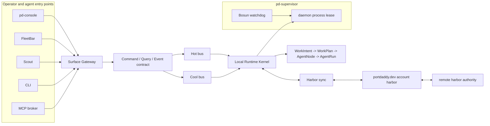

# 25 Agent Harbor Runtime Refactor Alignment

Status: execution alignment for the Agent Harbor Runtime Refactor branch.
Scope: binder and public-skill architecture documentation. Runtime code,
schemas, and migrations are owned by the implementation lanes.

This slice turns the binder plan into an implementation shape:

- one command/query/event envelope family;
- `pd-console` as the central proof surface;
- FleetBar, Scout, CLI, and managed agents routed through a Surface Gateway;
- Work Intent as the only creation path;
- Bosun folded into `pd-supervisor`;
- cloud accounts and harbors treated as authority domains, not vague placement.

## Runtime Shape

Every surface and managed body crosses the same boundary. The Surface Gateway
normalizes command, query, and event envelopes, verifies authority, assigns a
harbor domain, and dispatches to the hot or cool bus. It does not own runtime
state. The Local Runtime Kernel owns Work Intent, Work Plan, Agent Node, Agent
Run, transcript, control, claim, cost, memory, and receipt projections.

Read the diagram literally:

- `pd-console` is the seated command room. It owns deep inspection, transcript
  replay, file/diff views, steering, claims, receipts, and proof.
- FleetBar is the ambient consent and re-entry surface. It never grows its own
  transcript or control-plane model.
- Scout is evidence-bearing intake at the point of observation. It submits Work
  Intents with screenshots, DOM or region context, and source metadata.
- CLI is the agent and emergency surface. It submits the same envelopes as the
  native surfaces.
- MCP broker is the managed-body capability aperture. Official bodies do not
  reach raw MCP servers; third-party tools sit behind brokered `work`, `act`,
  `ask`, `recall`, and `status` capabilities.
- Surface Gateway verifies operator authority, route shape, signed guidance,
  risk class, idempotency, and harbor domain before an envelope reaches the
  kernel.
- The hot bus is fast and replaceable: presence, cursors, pause/cancel intents,
  stream deltas, and other low-latency state.
- The cool bus is durable and replayable: Work Intents, plans, transcript
  events, control commands, claims, gates, costs, receipts, inbox messages, and
  sync checkpoints.
- `pd-supervisor` owns local process supervision. Bosun is the watchdog inside
  the supervisor, not an independent runtime authority.
- Harbor sync projects durable events, receipts, capabilities, and revocations
  between authority domains. The UI must always name whether local kernel,
  `portdaddy.dev account harbor`, or remote harbor authority owns the record.

## Alignment With Existing Binder Truth

| Source | Aligns | Changes for this refactor |
| --- | --- | --- |
| Chapter 02 Runtime Authority And Deployment | Keeps the local daemon authoritative for local harbors and remote/hosted harbors authoritative for their own domains. Keeps the requirement that the UI names authority, data path, billing path, and controls. | Names the daemon authority as the Local Runtime Kernel behind the Surface Gateway. Names `portdaddy.dev account harbor` as the account authority domain for hybrid/hosted modes. Bosun becomes a watchdog inside `pd-supervisor`; it observes and repairs liveness, but it does not own harbor policy or event order. |
| Chapter 09 Data Model And API | Keeps explicit queryable records for Agent Nodes, Agent Runs, transcript events, control commands, claims, costs, skill grafts, receipts, and search. Keeps "if the daemon cannot query it, the operator cannot trust it." | Treats the chapter 09 endpoint families as projections behind one command/query/event gateway. New surfaces do not add bespoke route ownership; they submit envelopes and read projections. Control commands and transcript events stay separate durable records even when the hot bus makes the UI feel immediate. |
| Chapter 14 Work Intake And Node Shaping | Keeps `WorkIntentService.create -> WorkPlanner.shape -> AgentNodeService.materialize -> AnodeAdapter.attach` as the creation path. Keeps old launch words out of the operator model. | Makes the Work Intent path mandatory for FleetBar, Scout, CLI, `pd-console`, MCP broker, cloud execution, attach/import, resume, and automation. A new body cannot exist without either a Work Intent and Work Plan or an explicit unmanaged import reason. |
| Chapter 19 Operator Surface Triad | Keeps Scout as intake, FleetBar as consent/re-entry, and `pd-console` as proof. Keeps hot bus versus cool bus and the five-tool MCP broker collapse. | Adds Surface Gateway as the shared triad boundary. `pd-console` becomes central in architecture, not just one equal client, because it is the only surface required to render full daemon truth. FleetBar and Scout deep-link to `pd-console` for detail instead of growing parallel panes. |
| ADR-0096 Signed Guidance Envelope And Suggestibility Authority | Keeps verified guidance as the only operator-authoritative channel, signed over session/run binding and rejected when forged or replayed. Keeps C3 suggestibility dependent on a verifiable guidance channel. | Places guidance verification at the Surface Gateway, MCP broker, and harness boundary. A guidance item that cannot verify stays untrusted text and cannot become a control command, tool grant, or cool-bus event. Team and remote harbor guidance must carry macaroon-backed `authorityRef`; solo local loopback may use the local authority mode ADR-0096 allows. |

## Execution Order

1. Define the command/query/event gateway contract in runtime lanes, then route
   surface calls through it instead of adding new surface-specific endpoints.
2. Move all start, attach, resume, import, and automation paths through
   WorkIntent -> WorkPlan -> AgentNode -> AgentRun.
3. Make `pd-console` the primary read model consumer for full run truth:
   transcripts, files, diffs, claims, controls, costs, receipts, and guidance
   verification state.
4. Keep FleetBar and Scout small: FleetBar renders consent and re-entry;
   Scout submits evidence-bearing Work Intents and scoped replies.
5. Put Bosun inside `pd-supervisor`: heartbeat, freshness, restart, and
   degraded-state reporting flow through one local supervision artifact.
6. Make Harbor sync authority-aware: local kernel, `portdaddy.dev account
   harbor`, and remote harbor authority each write only the domains they own.

## Proof Gates

- A Work Intent submitted from `pd-console`, FleetBar, Scout, CLI, and MCP
  broker produces the same cool-bus record family and appears in `pd-console`.
- A pause or cancel from any surface reaches the hot bus quickly and then lands
  as a durable `ControlCommand` with ack, failure, or expiry.
- A forged or stale ADR-0096 guidance envelope is rejected, recorded, and
  rendered as untrusted text rather than actioned guidance.
- Restarting the local daemon through `pd-supervisor` shows Bosun watchdog state
  and rebuilds surface projections from the cool bus.
- A remote Agent Run shows its authority domain, account harbor sync path,
  budget owner, retention policy, revocation controls, and receipt location.
