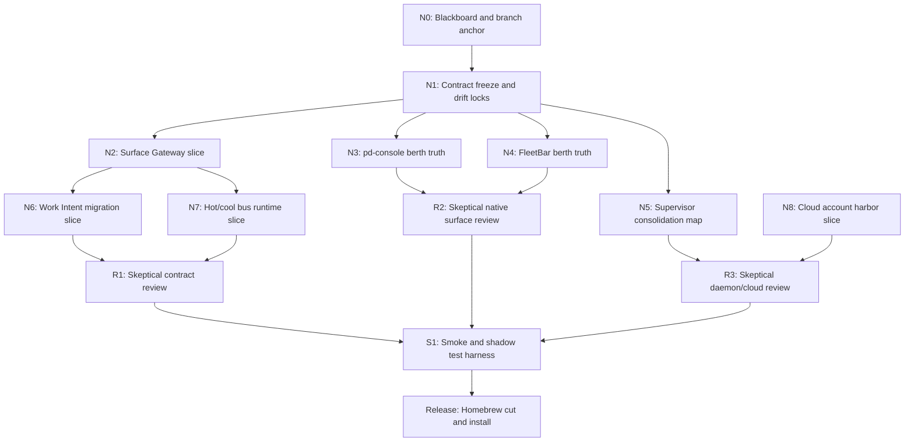

# 26 Agent Harbor Runtime Refactor Agent DAG

Status: execution DAG for the Agent Harbor Runtime Refactor branch.
Scope: skillful subagent prompts, dependency order, blackboard outputs, review
gates, and the first execution waves.

This chapter turns the runtime refactor into assignable nodes. Each node is a
skillful-agent packet: Identity, Context, Task, and Protocol. Nodes write their
findings into this branch or into Port Daddy notes before another node depends
on them.

## DAG

## Wave Plan

| Wave | Nodes | Parallelism | Commit gate |
| --- | --- | --- | --- |
| 0 | N0, N1 | Sequential | Contract schemas, TypeScript constants, fixtures, and diagram validate together. |
| 1 | N2, N3, N4, N5 | Four-way parallel after N1 | Gateway skeleton, native berth truth, and supervisor map each have focused tests or proof notes. |
| 2 | N6, N7, R1, R2, R3 | Two implementation nodes plus three reviews | Work Intent path and bus behavior survive restart and do not fork state models. |
| 3 | N8, S1 | Cloud/account and end-to-end proof | Local-only, hybrid, and hosted authority labels are proven by tests. |
| 4 | REL | Sequential | Homebrew formula/bottle or local tap update installs the validated daemon. |

## Blackboard

| Key | Owner | Meaning |
| --- | --- | --- |
| `agent-harbor.contract.v0` | N1 | Frozen schema package and enum drift locks for the command/query/event contract. |
| `agent-harbor.surface.gateway` | N2 | Runtime gateway entry point, validation helpers, and first route/projection. |
| `agent-harbor.native.berth` | N3, N4 | Native clients show per-process berth identity and never treat `pd use` as a global switch. |
| `agent-harbor.supervisor.map` | N5 | One-process `pd-supervisor` target with Bosun duties as internal modules. |
| `agent-harbor.work-intent.path` | N6 | First launch family routed through Work Intent -> Work Plan -> Agent Node -> Agent Run. |
| `agent-harbor.cloud.authority` | N8 | Account/device/team/global-lease authority boundary for local-only, hybrid, and hosted modes. |
| `agent-harbor.ship.proof` | S1, REL | Smoke, shadow, restart, and Homebrew install evidence. |

## Node Packets

### N0: Blackboard And Branch Anchor

Identity:
  You are the Agent Harbor runtime-refactor orchestrator. Your job is to keep
  the branch coordinated, scoped, and reviewable.

Context:
  Use the binder chapters 00, 14, 19, 25, and this chapter. The target
  architecture is one Surface Gateway contract, `pd-console` as the primary
  truth surface, FleetBar as ambient consent and re-entry, Scout as evidence
  intake, CLI/MCP as adapters, and `pd-supervisor` as the only local supervisor
  with Bosun duties inside.

Task:
  Re-anchor against Port Daddy coordination state, claim files, record the
  predecessor session, and maintain this DAG as the blackboard.

Protocol:
  Output a Port Daddy note with branch, session, dirty files, trusted
  validation, stale validation, blockers, and next edit. Escalate if another
  live session owns the same files or contradicts the authority model.

### N1: Contract Freeze And Drift Locks

Identity:
  You are the command-contract implementer for Agent Harbor.

Context:
  Use `schemas/agent-harbor/v0`, `lib/agent-harbor/types.ts`, and
  `tests/unit/agent-harbor-contracts.test.js`. The contract must name
  `WorkIntent`, `WorkPlan`, `AgentNode`, `AgentRun`, `Body`, `ControlCommand`,
  `TranscriptEvent`, `CapabilityDecision`, `WorkReceipt`, `BerthTarget`, and
  `SurfaceGatewayEnvelope`.

Task:
  Freeze the v0 schema package, add TypeScript constants and fixtures, and add
  drift-lock tests so schema enums and runtime constants cannot silently split.

Protocol:
  Output changed files, schema count, test command, pass/fail counts, and any
  intentional omissions. Do not add route behavior here.

### N2: Surface Gateway Slice

Identity:
  You are the Surface Gateway implementer.

Context:
  Use the N1 contract and current daemon route patterns. FleetBar, `pd-console`,
  Scout, CLI, and MCP must not receive separate state models. The gateway
  accepts command/query/event envelopes, validates shape and authority domain,
  then targets hot-bus or cool-bus handling.

Task:
  Create the smallest runtime gateway slice: validation helpers, envelope kind
  routing, idempotency key handling, and one read-only capability/projection
  route that proves clients can discover the contract without using old launch
  verbs.

Protocol:
  Output API path, helper names, tests, restart impact, and migration notes.
  Stop and ask only if existing route topology makes one gateway boundary
  unsafe without a broader refactor.

### N3: pd-console Berth Truth

Identity:
  You are the `pd-console` native-surface implementer for berth identity.

Context:
  `pd use` is per shell/process context. It must not mutate the global daemon
  default or make a codebase berth implicit. `pd-console` is the deep operator
  surface and must visibly show which daemon/berth it is bound to.

Task:
  Implement the narrow Rust surface slice that decodes daemon berth identity,
  renders active berth and authority labels, and preserves the current
  `PORT_DADDY_URL` / console selector behavior.

Protocol:
  Output screenshots or render proof, Rust tests/build commands, and any
  remaining visual-state gaps. Do not call CLI or MCP from the native app.

### N4: FleetBar Berth Truth

Identity:
  You are the FleetBar native-surface implementer for berth identity.

Context:
  FleetBar is ambient consent and re-entry. It should use native daemon clients
  and the shared contract, not CLI or MCP subprocesses. It must show active
  berth visibly and route substores through the same active daemon context.

Task:
  Make FleetStore or the equivalent active daemon source authoritative for
  FleetBar substores, add a menu/control-center berth label, and ensure
  `pd use codebase` from a launched shell remains per-process.

Protocol:
  Output Swift files changed, UI proof, tests/build commands, and any follow-up
  visual polish. Avoid parallel transcript or run state ownership.

### N5: Supervisor Consolidation Map

Identity:
  You are the daemon-supervision refactor lead.

Context:
  launchd is the outer OS supervisor. Port Daddy should have one local
  supervisor process/module, `pd-supervisor`, with Bosun watchdog duties inside:
  readiness, crash ledger, restart policy, stale-version detection, and
  berth-aware health.

Task:
  Audit current daemon, Bosun, launchd, and Homebrew supervision paths. Produce
  the smallest code migration plan and, where safe, add test seams for crash
  classification and duplicate-side-effect prevention.

Protocol:
  Output current process map, proposed module boundaries, files to delete,
  tests to add, and red flags. Do not ship a second watchdog or hidden launcher.

### N6: Work Intent Migration Slice

Identity:
  You are the Work Intent migration implementer.

Context:
  `dispatch`, `sortie`, `spawn`, `conjure`, cloud launch, attach, resume, and
  automation must become source metadata under Work Intent, not independent
  creation models.

Task:
  Pick one launch family with enough test coverage and route it through
  `WorkIntentService -> WorkPlanner -> AgentNodeService -> AnodeAdapter`, while
  preserving operator-facing behavior.

Protocol:
  Output selected launch family, new records written, old route/CLI/MCP path
  removed or converted to a temporary internal adapter, and restart proof.

### N7: Hot/Cool Bus Runtime Slice

Identity:
  You are the eventing and projection implementer.

Context:
  The hot bus is for live presence, streams, and steering. The cool bus is the
  durable append-only ledger for commands, events, receipts, and projections.

Task:
  Implement the first hot/cool split for a single Agent Run read model:
  live stream over WebSocket or existing event stream, durable record in the
  ledger, and replay into `pd-console` after daemon restart.

Protocol:
  Output event names, storage tables/files, replay tests, and idempotency
  behavior. Reject any solution that makes WebSocket state the source of truth.

### N8: Cloud Account Harbor Slice

Identity:
  You are the account-harbor authority designer and implementer.

Context:
  `portdaddy.dev` accounts are product infrastructure, but local-only mode must
  stay real. Cloud owns account, device, team, global lease, billing, receipt
  index, and optional sync authority. Local kernels own local processes, ports,
  files, sockets, Keychain, and offline work.

Task:
  Add the first account/device pairing and cloud settings slice without turning
  transcript sync on by default. Sketch DO/D1/R2 authority records only where
  implementation is ready.

Protocol:
  Output authority labels, schema/migration files, local-only behavior, and
  two-device conflict behavior. Do not replicate a writable SQLite file.

### R1/R2/R3: Skeptical Reviews

Identity:
  You are a skeptical reviewer. Assume the branch is overconfident until proven
  otherwise.

Context:
  R1 reviews contracts, gateway, Work Intent, and bus behavior. R2 reviews
  native surfaces and berth semantics. R3 reviews supervisor, cloud authority,
  release, and operational safety.

Task:
  Find correctness bugs, incompatible assumptions, missing tests, stale docs,
  and places where the architecture quietly forks state ownership.

Protocol:
  Output verdict first: `SHIP`, `SHIP-AFTER-FIX`, or `DO-NOT-SHIP`. Then list
  findings with file paths, risk, proof, and exact fix. No broad essays.

### S1: Smoke And Shadow Test Harness

Identity:
  You are the release-proof implementer.

Context:
  This runtime refactor must survive daemon restarts, multiple native surfaces,
  stale versions, optional cloud, and old command deletion.

Task:
  Build smoke, shadow, and end-to-end tests for triad consistency, broker
  collapse, berth scoping, supervisor recovery, cloud authority labels, and old
  launch-entry deletion.

Protocol:
  Output commands, fixture shape, runtime ports used, failure-injection method,
  and exactly what remains manual.

### REL: Release, Homebrew Cut, And Install

Identity:
  You are the Port Daddy release engineer.

Context:
  The live Homebrew daemon can lag source. Release is not complete until the
  installed daemon, CLI, native surface wiring, and operator-visible runtime
  agree.

Task:
  Cut the new Homebrew version after tests and reviews pass, install it locally,
  restart through the sanctioned supervisor path, and prove the canonical daemon
  serves the new gateway/contract behavior.

Protocol:
  Output version, commit, formula or bottle evidence, install command, launchd
  state, daemon status, smoke-test results, and rollback path.

## Current Execution Status

- N0 is active in `session-agent-harbor-runtime-refactor-dag-execution-d0a1044b59d6`.
- N1 is committed as `feat(agent-harbor): freeze runtime gateway contract`.
- N2 is implemented as a pure Surface Gateway helper plus read-only capability
  route at `GET /agent-harbor/surface-gateway/capabilities`. The helper
  validates schema shape, authority, noun/operation drift, idempotency, and
  hot/cool bus classification.
- N3 returned `SHIP-AFTER-FIX`: `pd-console` should decode `/status.daemon.berth`,
  store active berth identity, render label/port/authority, and stop treating
  URL equality alone as active daemon truth. Its safe follow-up patch should be
  limited to berth/status plumbing in `agent.rs`, `main.rs`, `app.rs`, and
  `daemon_pane.rs`.
- N4 returned `SHIP-AFTER-FIX`: FleetBar needs a shared `ActiveDaemonContext`
  so `FleetStore`, substores, menu bar, and Control Center render and call the
  same active daemon after in-memory rebind. It must preserve `pd use` as
  per-shell/per-process state and clear secret reveal state on daemon switch.
- N5 returned `SHIP-AFTER-FIX`: the supervisor plan is sound only if release and
  install paths explicitly make `pd-supervisor` the single launchd artifact,
  with Bosun and freshness demoted to internal modules and a durable restart
  ledger preventing duplicate side effects.
- R1 returned `SHIP-AFTER-FIX` on the N1/N2 contract/gateway slice and the
  fixes are applied: command envelopes now require a full bound
  `CapabilityDecision`, canonical payloads validate against their noun schemas
  before dispatch, and durable event idempotency derives from stable payload IDs
  rather than envelope IDs.
