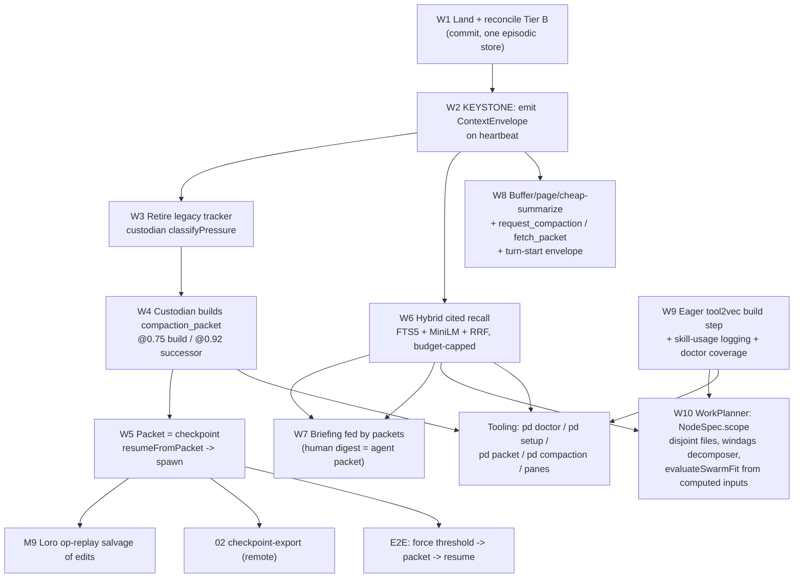

# 27 Context, Memory And Runtime Wiring

Addendum of record to [04 Context Memory And Skills](./04-context-memory-and-skills.md)
and [07 Milestones And Work DAG](./07-milestones-and-work-dag.md).

Chapter 04 designed the context/memory/skills architecture. This chapter records
the **shipped-versus-designed reality** of that architecture as built, names the
single keystone gap that starves the rest, and sequences the remaining wiring as
an executable work DAG. It also specifies three operator-directed additions that
04 did not cover in build detail: the **eager tool2vec build step + skill-usage
logging**, **agent-facing input buffering / paging / cheap summarization**, and
the **observability and test tooling** (`pd doctor`, `pd setup`, inspection
commands, operator panes) required to prove any of it works.

The audit behind this chapter was four parallel code sweeps plus a competitive
scan; every claim below is grounded in `file:line` evidence, not aspiration.

## 27.1 Status snapshot: two stacks, one keystone

The M6 machinery is not missing. It is **built, tested, and unwired.** Across
every subsystem the shape of the gap is identical: excellent primitives exist,
but the trigger fabric that would drive them was never connected.

There are **two parallel memory/context stacks**:

- **Tier A — LIVE and wired.** `lib/episodic-memory.ts` (`episodic_memory`
  table, self-created at `:222`), constructed at `server.ts:450`, harvested by
  the daemon-resident `knowledge-custodian.ts` loop (`server.ts:802`), read by
  `pd memory` (`cli/commands/memory.ts:390`) and MCP `memory_episodes` /
  `memory_stats` / `find_related_work` / `custodian_status`. The live context
  tracker is `context-window-tracker.ts` (`server.ts:572`), exposed via
  `routes/context.ts` and MCP `get_context_budget` / `get_context_overview`.
  Pressure bands here are coarse: warn >= 50%, critical >= 70% of an *effective*
  window defined as 60% of the advertised window (`context-window-tracker.ts:73`).

- **Tier B — DESIGNED, tested, UNWIRED, and currently untracked in git.**
  `lib/agent-harbor/context-pressure.ts`, `compaction.ts`, and
  `memory-episodes.ts` implement chapter 04 exactly: the 0.60/0.75/0.85/0.92
  ladder (`classifyPressure`), cited compaction packets with a validator that
  fails uncited factual claims (`buildCompactionPacket`,
  `validateCompactionPacket`), hash-chain-verified successor resume
  (`resumeFromPacket`), and a second episodic schema (`ensureMemoryEpisodeSchema`).
  Every one of these functions has **zero non-test callers**, and the files
  themselves are `??` (untracked) in the working checkout. Their tests live only
  in worktrees, not the main tree.

**The keystone.** Nothing emits a schema-valid `ContextEnvelope` on agent
heartbeats. The envelope (04.60-113) is the signal that is supposed to fire
compaction -> successor-spawn -> salvage -> partition. Because no producer
exists, the entire Tier-B ladder is starved of input and the daemon falls back
to the coarse Tier-A warner. **Fix the producer and roughly a milestone of
already-tested code becomes live at once.** Everything in this chapter is
sequenced behind that one pipe.

## 27.2 The wiring work, item by item

Each item below states the shipped reality, the target, and the concrete change.
The dependency order is captured in the DAG in 27.9.

### W1 — Land and reconcile Tier B (prerequisite)

Tier B is uncommitted. Before anything can be wired to it, it must be committed
to the main tree with its tests, and reconciled against Tier A. **Decision
required (27.10 O1):** Tier B's `memory-episodes.ts` defines a *second* episodic
schema separate from the live `episodic_memory` table. We do not ship two
episodic stores. Either Tier B's packet/pressure functions adopt Tier A's table,
or Tier A migrates onto Tier B's schema behind one interface. Recommendation:
keep the live Tier-A table as the store of record; port Tier B's
`recallEpisodes` / `openFactsFor` to read it; keep Tier B's `compaction.ts` and
`context-pressure.ts` as the new logic layer over that one store.

### W2 — Emit the ContextEnvelope (the keystone)

Every compliant agent heartbeat must carry a schema-valid `ContextEnvelope`
(schema frozen at `schemas/agent-harbor/v0/context-envelope.schema.json`; this
freeze must be folded into ch. 26/N1's single `schemas/agent-harbor/v0` contract
freeze, not a second uncoordinated freeze of the same package — see 27.11):
window tokens, per-bucket budgets (system / operator / transcriptTail /
toolResults / memories / skillGrafts / workingPlan / outputReserve), used
tokens, computed `pressure`, and recommended `action`. Producer options:

- **Preferred:** the pilot hook / squid harness stamps the envelope on each
  heartbeat POST from token accounting already available at turn boundaries.
- The daemon estimates from the transcript tail when the body cannot self-report
  (`estimator.confidence < 1`), flagged as an estimate.

`pressureHistoryFromLedger` / `latestPressureFromLedger` already read
`heartbeat` / `context_pressure` events carrying an envelope; they just have no
producer. This item is the producer.

### W3 — Retire the legacy tracker; custodian classifies on the real bands

Collapse the two threshold schemes into one. The coarse 50/70 tracker
(`context-window-tracker.ts`) is superseded by the 60/75/85/92 ladder. The
custodian's `runContextPressureDuty` (`knowledge-custodian.ts:407`, every 30s)
stops calling the legacy summary and instead calls `classifyPressure` on the
latest envelope. The `agent_task_ledger` COGS accounting stays; it is
orthogonal and correct.

### W4 — Custodian builds compaction packets

At band **0.75** the custodian calls `buildCompactionPacket` for the agent, runs
`validateCompactionPacket` (which must fail any uncited factual claim), and
appends the result as a first-class `compaction_packet` transcript event. At
band **0.92** it additionally triggers successor creation. The packet is the
cited continuation artifact defined in 04.177-209; it is not optional telemetry.

### W5 — Packet becomes the checkpoint; resume wires into spawn

There is no live-state checkpoint anywhere today. "Resurrection" hands a
successor notes, not a memory image (`resurrection.ts:391` `claim` only flips
queue status and returns `{sessionId, purpose, notes}`). We do not attempt a
process/memory snapshot. Instead the **cited compaction packet is the checkpoint
artifact.** `resumeFromPacket` wires into the spawn path so a successor boots
from a validated, hash-checked packet (`SuccessorBootstrap`) rather than raw
notes. This wiring targets the post-refactor creation path (`WorkIntent ->
WorkPlan -> AgentNode -> AnodeAdapter`, ch. 25/26), not the legacy `spawn`
surface those chapters dismantle; see 27.11. This is the M6 gate: *force
threshold -> packet built -> successor
resumes.* Downstream, M9 adds Loro op-replay to recover a dead agent's *edits*,
and 02 adds checkpoint-export for remote sessions.

### W6 — Retrieval upgrade: hybrid, cited, budget-capped

Today episodic recall is SQL `LIKE '%q%'` over title/summary/source_id
(`episodic-memory.ts:303`); ideas search is hand-rolled token weighting
(`ideas-search.ts:138`); the only real embeddings, a warm `Xenova/all-MiniLM-L6-v2`
(384-d) in `semantic-resolver.ts`, are used **only** for identity/alias
reconciliation, never for memory retrieval. The claimed "hybrid BM25+embeddings
cited search" does not exist.

**Due thought on FTS5 vs the MiniLM stack (the operator asked to weigh this).**
The answer is not one or the other; the house rule is never lexical-only, and
picking pure-vector would throw away exact-token and identifier recall that
lexical nails. Reasoning:

- *FTS5* is built into SQLite, is near-free, and is unbeatable on exact tokens,
  identifiers, error strings, and file paths, precisely the terms that dominate
  "who fixed this before / what command deployed X." Weak on paraphrase.
- *MiniLM cosine* is already warm in-process (no new dependency, no model
  download), gives paraphrase/semantic recall, and at episodic scale (thousands
  of rows) brute-force cosine is adequate; no ANN index needed yet.
- The repo already ships the exact fusion pattern to reuse: the skill-search
  cascade (BM25 -> Tool2Vec -> RRF -> cross-encoder). Recall should reuse it.

**Decision:** hybrid **FTS5 + MiniLM cosine fused by Reciprocal Rank Fusion**,
reusing the shared embedder and the existing cascade. Add an FTS5 virtual table
over episode title+summary+body and a MiniLM embedding column populated on write;
fuse at query time. Every returned memory carries a citation back to a
transcript event or document. A memory without a source is a suggestion, not a
fact (04.154). Enforce the retrieval budget cap (04.152) so recall never exceeds
its envelope bucket.

### W7 — Briefing fed by compaction packets

`briefing.ts` is genuinely live-truth (all tiers query the DB directly; the
on-disk `briefing.md/json` is explicitly a cache, `briefing.ts:728`). But it
reads only `sessions.list` / `agents.list` (`:315-652`); it does **not** read
episodic memory or packets. Briefing is compression-for-humans; the compaction
packet is compression-for-agents; 04 wants them unified. Feed the briefing from
the same cited packets and episodic recall so the human digest and the agent
continuation packet are two renders of one substrate. (`catch_me_up` is
deprecated -> alias for `sitrep`; do not extend it.)

### W8 — Agent context protection: buffer, page, cheap-summarize

**Finding:** Port Daddy does **not** do the buffer-oversized-output-to-file ->
preview-pointer -> paginate -> cheap-summarize loop. That behavior is the Claude
Code harness, not PD (zero repo hits for `Output too large` / `Preview first`).
PD ships pressure *measurement* (`get_context_budget`), pressure *alerting*
(custodian pushes `context_pressure` to `agent:<id>:inbox`, which the agent must
*pull* via `inbox_read`, not auto-injected), and *offload* (`spawn`,
handoff-successor via `handoff-capsule.ts` / `continuation-runtime.ts`). Agents
can notice and escape pressure; they cannot have oversized outputs transparently
managed for them.

Target (borrowing MemGPT/Letta virtual-context management, i.e. treat the window as
RAM and page to disk):

- **Spill layer.** Large tool outputs are written to the content-addressed blob
  store (`lib/blob.ts`, already exists) and the agent receives a preview + a blob
  pointer, not the full payload.
- **Paging tools.** New agent-facing MCP verbs: read a blob by offset/limit,
  next-page, and grep-in-buffer, so an agent pulls only the slice it needs.
- **Cheap summarization.** A Haiku-class pass (the `salvage-digest` primitive,
  ROADMAP `:420`, generalized) summarizes an oversized buffer to ~500 tokens
  before injection, with a `drill` path to the raw blob.
- **Response verbs.** Add `request_compaction` and `fetch_memory_packet` MCP
  tools so an agent under pressure can act directly instead of only being warned.
- **Turn-start envelope.** The static persona text injected today
  (`hooks/sessionstart-pilot.mjs:111`) becomes the dynamic ambient envelope
  (inbox pops, memory packet, conflict warnings): the planned
  `ambient-context-broker` (ROADMAP `:381`), ~800-token/turn budget with
  progressive compression and `pd context --preview`.

### W9 — Eager tool2vec build step + skill-usage logging

`skill-graft-tool2vec.ts` already implements the correct shape: tool2vec is the
centroid of ~15 **synthetic trigger sentences** ("what a user would type that
this skill answers"), embedded with the shared MiniLM embedder, *not* the
skill's frontmatter or body embedded directly. Centroids are content-hash-keyed
and cached in `skill-graft-tool2vec.sqlite`.

**The defect:** centroids are computed **lazily**, only when a skill is already a
ranking candidate. This is a chicken-and-egg failure. You cannot rank a skill
into the candidate set on a query it has never been ranked for, because its
centroid does not exist yet. Lazy fill silently loses recall for exactly the
skills that most need discovery.

**The fix (operator-directed):**

- A **build step** (`pd skills build-embeddings`, and a daemon startup / install
  reconcile) that materializes tool2vec centroids for the **entire user-level
  skill catalog** with missing vectors filled eagerly, content-hash-cached,
  incremental. Corpus scale as measured: 1,532 `SKILL.md` under `~/.claude`
  (1,460 in plugins), 279 in-repo; no centroid cache exists yet. The step must
  be incremental and resumable so a full first run (~1,500 one-shot cheap LLM
  calls + embeddings) is a bounded, restartable job, not a per-query tax.
- **Skill-usage logging:** every graft/selection records which skill was
  proposed, at what cosine, whether it was used, and the outcome, so
  low-recall/misfire skills (stale centroid, never-selected, high-selection
  low-success) are flagged for re-embedding or authoring review. This is the
  feedback loop that keeps the corpus honest.
- `pd doctor` gains a **coverage check**: percentage of catalog skills with a
  current-hash centroid; a low number is a defect.

### W10 — Subagent context partitioning

Today PD does fan-out and governance, not partitioning. `fleet/conductor.ts`
launches **one agent per `LaunchIntent`, one goal each**, with depth/lineage/
capability caps; `swarm-coordination.ts:evaluateSwarmFit` recommends a topology
but is a pure advisory oracle whose inputs are hand-supplied CLI flags, wired
only to `pd parley fit`. The partition primitive, `NodeSpec.scope`
(disjoint `files` / `symbols` / `forbiddenSurfaces` per node), is design-only
(`work-packets/swarm-invocation-and-node-shaping.md`), and `windags_next_move`
has zero callers in `lib/`/`cli/`.

Target: a `WorkPlanner` that emits `NodeSpec[]` with **disjoint `scope.files`**
from coupling analysis + live context-pressure bands; drives `evaluateSwarmFit`
from *computed* inputs instead of flags; maps each `NodeSpec` -> `LaunchIntent`
(Conductor already supports per-child worktrees and lineage; post-refactor each
`NodeSpec` is created as an `AgentNode` through the WorkIntent path, not a raw
`LaunchIntent` — see 27.11). Gate every split on
the binder rule `split_cost + comm_cost + merge_cost < stay_cost` (04.231,
node-shaping `:199`). Wire `windags_next_move` decomposer output as the
decomposition source. Handoff transfers the minimum cited context, never the
whole harbor (04.252), and returns a summary-only result to the parent, not the
full child transcript.

## 27.3 What we borrow (competitive grounding)

Ranked ideas to steal, each mapped to a gap above:

1. **OpenHands pluggable condenser-over-event-stream** -> W3/W4. Model
   compaction as ordered transforms on the transcript with explicit
   token/threshold triggers, split system-initiated (emergency halving) vs
   agent-initiated (voluntary). Cleanest abstraction for the ladder.
2. **Devin + Aider file+memory checkpoint / git-commit-per-step** -> W5. Snapshot
   files and memory together on a restorable timeline; atomic per-step git
   commits make rollback free and the checkpoint durable.
3. **MemGPT / Letta memory-block paging** -> W8. Window as RAM; small
   character-capped core blocks self-edited via tools; page to recall/archival.
4. **Windsurf auto-memories + Letta archival retrieval** -> W6. Auto-extracted,
   scoped, semantically-retrieved memory instead of substring `LIKE`.
5. **Claude Code isolated subagents + LangGraph reducer-merged state** -> W10.
   Clean window per subagent; summary-only handoff into reducer-controlled
   parent state; selective `Command.PARENT`-style handoff.

Bonus: Codex append-only JSONL rollout files are the low-effort transcript
capture + resume/fork substrate that W4/W5 build on.

## 27.4 Observability and tooling

None of `pd doctor`'s checks touch transcripts, episodic memory, the context
envelope, compaction, or custodian health (`cli/commands/diagnostics.ts` checks
only Node/deps/DB-writability/network/daemon/binary-drift/bosun). `pd setup`
creates no memory or transcript DB; every schema is lazily created on first
daemon use. To make this work provable and visible:

- **`pd doctor`** gains: a context-envelope/custodian check (hit
  `/context/overview` + `/custodian/status`), and the W9 skill-embedding coverage
  check.
- **`pd setup`** eagerly ensures the memory/transcript/packet schemas and the
  tool2vec cache exist, rather than deferring to first use.
- **Inspection commands:** `pd packet` / `pd compaction` (list built packets +
  validation results), `pd memory` extended for hybrid Tier-B recall, and
  `pd context --preview` for the turn-start envelope.
- **Operator panes:** a FleetBar/pd-console pane reading `/context/overview`
  (data already served) showing per-agent pressure, last packet, and recall hits.
  Placement follows the surface-authority rule (deep inspection -> pd-console;
  ambient pressure glances -> FleetBar).

## 27.5 Test plan

The missing proof is one end-to-end test: **force threshold -> packet built ->
successor resumes.** Seed a session; drive `buildContextEnvelope` to `critical`;
assert the custodian calls `buildCompactionPacket`; assert
`validateCompactionPacket` cross-checks citations and fails on an uncited claim;
call `resumeFromPacket`; assert the `SuccessorBootstrap` restores obligations and
decisions. Run it **through the daemon** (custodian loop or a `/context` route),
not against pure functions, so it exercises live plumbing. Each W-item also gets
a unit gate; W9 gets a coverage-percentage assertion; W8 gets a spill+page+drill
round-trip test.

## 27.6 Milestone placement

All of the above lives inside binder **M6 (Context / memory / search)**, with
tendrils into M4 (checkpoint/successor controls, W5), M7 (skills, W9), and M9
(Loro salvage of edits, W5). Ordering rule from 07: *do not build the final
mythology first; build the evidence chain.* The envelope producer is the first
brick.

## 27.7 Recursive-synthesis hardening (six skill-cluster critique)

Six cohesive skill clusters critiqued this plan adversarially and converged.
The result is not cosmetic; it adds five work items and a set of invariants that
close failure modes the first draft left open. The theme across all six: a
self-reported signal with no daemon-observable verifier, and a shipped-but-dead
primitive, are both coverage theater. Every W-item's done-criterion is a grep
proving live (non-test) callers route through the primitive, not that the
function exists.

Cross-cutting invariants to apply across the existing items:

1. **Rebuild from primary roots, never from the previous summary (W4/W7/W8).**
   Every compaction packet, briefing, and cheap-summary is rebuilt each round
   from durable roots (transcript events, git, notes, Tier-A rows), never from
   packet N-1. Carry a monotonic-generation counter and a provenance-monotonicity
   check: every citation in generation N must still resolve in N, and an
   obligation may only move open->closed via an explicit closing event. Upgrade
   `validateCompactionPacket` from citation-**presence** to citation-**grounding**
   (a cheap sampled-judge entailment score per claim; reject a claim whose
   citation resolves to another packet's prose rather than a primary root). The
   27.5 E2E must reject a cited-but-unsupported packet, not only an uncited one.
   This forecloses recursive-summarization collapse.
2. **One denominator, one frozen schema (W2).** `pressure = usedTokens /
   effectiveWindow`; the eight per-bucket budgets must sum to `effectiveWindow`
   and `classifyPressure` asserts that sum, so a mis-scaled producer trips a test
   instead of silently compacting late. Freeze the envelope as a discriminated
   union with `source: 'self-report' | 'estimate'` (estimate carries a required
   `confidence`) and string-literal `band`/`action` unions the custodian switches
   on with a `never` exhaustiveness guard.
3. **Trust-but-verify every self-reported signal (W2/W4/W10, new W14).** The
   daemon transcript-tail estimator is the enforcement floor; the self-reported
   envelope is an advisory overlay. Classify on `max(self.pressure,
   daemon.pressure)`; on divergence beyond a band, emit
   `context_pressure_divergence` and mark packets built from self-only envelopes
   lower-assurance. A body that lies about its pressure, its packet fidelity, or
   its scope adherence can otherwise no-op the whole M6 gate.
4. **Scoped capabilities, never bare pointers (W8).** A blob pointer is a
   macaroon-style scoped capability (session/agent id, partition, TTL,
   offset-range caveats), validated against the requesting agent's NodeSpec
   scope, failing closed on unknown ids. This is the only pointer type from day
   one. It is also a prerequisite for W10's disjoint-scope cost math, so it adds
   a W8 -> W10 edge.
5. **Proposer/validator separation (W9).** The cheap signal that *ranks* a skill
   (cosine over synthetic triggers) must never also *validate* whether its
   centroid earned its place. An independent out-of-band label (task passed,
   operator kept the graft, node produced a valid output-contract result)
   validates. Re-embed/re-author only on high-selection + low-independent-success,
   never on cosine drift alone (a stale centroid and a bad skill look identical
   at the cosine layer).
6. **Width as the coordination floor (W10).** Compute `width(coupling_graph)` =
   the max antichain as the hard ceiling and floor on subagent count; reject
   plans that exceed it as false parallelism. Shared/hot files no partition can
   separate (`db.ts`, `types.ts`, `sessions.ts`) become a virtual shared-surface
   node run serially after the parallel lanes converge, not smeared across racing
   agents. State the width number as plan evidence.

New work items surfaced by the critique:

- **W11 — Gated shared-embedder access layer.** W6 per-write embedding and W9's
  ~1,500-skill build both route through the one memoized in-process MiniLM loader
  (the real 7,182-re-await / 313 GB write-storm shape). Add a circuit breaker,
  full-jitter backoff, and coalesced in-flight load; on breaker-open W6 degrades
  to FTS5-only and the W9 build checkpoints row-level and stops. `pd doctor`
  distinguishes three states: current-hash centroid present / not-yet-built /
  embedder-down. This is a shared substrate for W2/W6/W9/W10, so the DAG's
  "independent roots" claim is downgraded to "independent in data, coupled on the
  embedder resource."
- **W12 — One buffer/paging/compaction contract with MCP + CLI + route
  adapters.** W8's verbs are not MCP-only; define one contract (schema,
  idempotency key, receipt, terminal-state lifecycles) with MCP, CLI (`pd
  context` / `pd packet`), and the `/context` route as parallel adapters, and
  evaluate the O4 on-by-default policy once in that layer.
- **W13 — O1-O4 decisions ledger + per-item owner/gate/evidence.** Convert the
  open questions into an append-only decisions ledger and attach an owner, an
  acceptance gate, and an evidence link to each W-item. The chapter is not
  ready-to-cite until O1 (two episodic stores) is closed by a landed single-store
  reconciliation, not prose.
- **W14 — Sampled runtime Arbiter for self-reported signals.** One sampled
  verifier (per-tick pressure-divergence check + child-tool-call scope monitor,
  under ~2% overhead via ring-buffer sampling) makes the enforcement-beats-hope
  rule real. It triggers salvage/halt on cross-scope access.
- **W15 — Append-only continuity/succession ledger + daemon-minted successor
  id.** A hash-chained packet gives connectedness, not continuity, and nothing in
  W5 stops one packet booting two successors (identity split-brain). The daemon
  mints a non-forgeable successor id (ADR-0040) and records
  predecessor->successor in an append-only ledger; packet consumption is a
  single-successor lease (claimed->committed, reclaimable on missed heartbeat).
  This is checkpoint + memory, explicitly not an outcome ledger.

Top risks the critique flags (full register in the synthesis record): grounding
every claim on the hot 30s custodian loop can dominate the very COGS the ledger
protects (mitigate by incrementalizing citation re-checks and running grounding
sampled/async); the contended embedder starving live recall (W11); and
fail-closed capability friction pushing operators to disable the boundary
(mitigate with an in-process fast-path and allowlisted shared read-only
surfaces).

## 27.9 The work DAG

These are **M6-scoped waves**, distinct from ch. 26's runtime-refactor waves
(which are 0-indexed over `N`-nodes). When both are in play, qualify as "M6-Wave
N" to avoid confusion (see 27.11).

**Waves.** Wave 1: W1, W2, W9 (independent roots; W2 is the keystone, W9 is the
independent skills track). Wave 2: W3, W6, W8. Wave 3: W4, W7, W10. Wave 4: W5
+ E2E, then M9/02 exports. Tooling (`pd doctor`/`setup`/inspection/panes) lands
alongside the wave that produces the data each surface reads.

## 27.10 Open decisions

- **O1 — one episodic store.** Confirm Tier A's `episodic_memory` table is the
  store of record and Tier B's logic ports onto it (27.2/W1). The alternative
  (two stores) is rejected.
- **O2 — envelope producer site.** Hook/harness self-report vs daemon estimate as
  the default; both may coexist with a confidence flag (W2).
- **O3 — build-step trigger.** Whether the eager tool2vec fill runs at
  `pd setup`, at daemon startup reconcile, on a schedule, or all three (W9). The
  full first run is ~1,500 skills; it must be incremental and resumable.
- **O4 — buffering default.** Is output-spill on-by-default for all agents or
  opt-in per compliance level (W8)?

## 27.11 Relationship to chapters 25 and 26

This chapter governs M6 (context/memory), but its runtime substrate — the agent
contract, the spawn/creation path, the heartbeat bus, and the daemon that owns
them — is being refactored in parallel by
[25 Runtime Refactor Alignment](./25-agent-harbor-runtime-refactor-alignment.md)
and [26 Runtime Refactor Agent DAG](./26-agent-harbor-runtime-refactor-agent-dag.md).
The three DAGs use disjoint numbering (07 = `M`-milestones, 26 = `N`-nodes +
0-indexed waves, 27 = `W`-items + 1-indexed waves) so there are no hard
identifier collisions, but ch. 27 sits directly on surfaces 25/26 are renaming.
The reconciliation:

1. **Creation path (the one real conflict).** 25/26 make
   `WorkIntent -> WorkPlan -> AgentNode -> AnodeAdapter.attach` the mandatory,
   only creation path and migrate `spawn` / `dispatch` / `conjure` / raw
   `LaunchIntent` into it (25 "Execution Order"; 26/N6). W5 (`resumeFromPacket`
   into spawn) and W10 (`NodeSpec -> LaunchIntent` via `fleet/conductor.ts`)
   therefore target the **post-refactor** shape: the packet is the payload a
   successor `AgentNode` boots from, and a `NodeSpec` is realized as an
   `AgentNode` through the WorkIntent path, not the legacy `spawn` surface. This
   adds a hard **26/N6 -> 27/W5** and **26/N6 -> 27/W10** edge. If 26/N6 lands
   first, W5/W10 build on it directly; if a W5/W10 prototype lands first against
   the legacy surface, it must be migrated with the rest.
2. **One `v0` contract freeze, not two.** 26/N1 freezes
   `schemas/agent-harbor/v0` with drift-locks. W2's `ContextEnvelope` schema is
   an **item inside that freeze**, not a second independent freeze of the same
   package. Add the envelope to 26/N1's enumerated contract (or explicitly carve
   it out there).
3. **Heartbeat bus.** W2 stamps the envelope on the heartbeat and reads
   `heartbeat` / `context_pressure` from the ledger. Which bus that crosses is
   governed by 26/N7's hot/cool split and the 25 Surface Gateway; W2's producer
   must emit onto the bus 26/N7 defines, not a private path.
4. **One succession/continuity ledger.** W15's append-only
   continuity/succession ledger and W14's Arbiter ledger are the **same durable
   append-only event ledger** 26/N7 owns (the "cool bus"), scoped to
   succession/verification events, not a parallel store. Reconcile schemas.
5. **Terminology.** Standardize on the 25/26 canon: `WorkIntent` (not
   `LaunchIntent`) for the creation intent, and the daemon's runtime-authority
   role named consistently (25 "Local Runtime Kernel"). Where this chapter still
   says `LaunchIntent` it means the legacy surface being migrated. Qualify wave
   labels as "M6-Wave N" whenever ch. 26 waves are also in scope.

Net: **minor drift, one latent conflict (the creation path), now cross-linked.**
W13's decisions ledger tracks closure of items 1–4 here alongside O1–O4.
