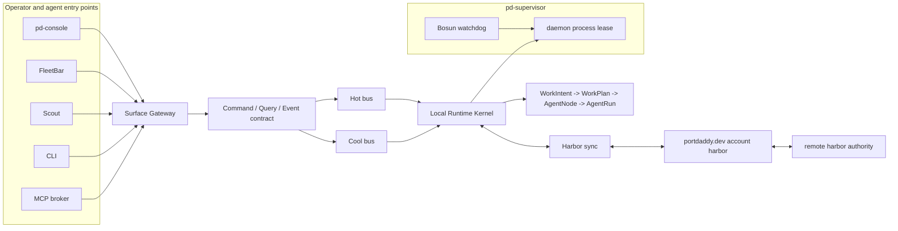

# Port Daddy Agent Harbor Technical Binder

Status: architecture binder, target-state design, and implementation roadmap.
Scope: the whole Port Daddy agent harness, operator control panel, cooperative IDE,
agent runtime contract, cloud/local boundary, account model, memory layer, skill
system, and rollout DAG.

This binder supersedes one-off "agent compliance" notes as the single spine for
building Port Daddy into something an operator can use instead of bouncing
between Claude Code, Codex, terminals, GitHub tabs, local scripts, and fragile
background agents.

## How to use this binder as truth

Read this binder as a layered source of truth, not as a pile of equal notes:

1. [00 PRD, Technical Roadmap, And Integration Test Plan](./00-prd-roadmap-and-test-plan.md)
   is the current product commitment, milestone gate summary, and integration
   test matrix.
2. `README.md` is the glossary, product spine, and current binder map.
3. [18 Build Prescription And Agent Launch Board](./18-build-prescription-agent-launch-board.md)
   is the current prescription: what to build next, which agents to launch, and
   which gates prove the work.
4. [07 Milestones And Work DAG](./07-milestones-and-work-dag.md) is the product
   milestone order.
5. [12 Agent Work Chains And Second Pass Review](./12-agent-work-chains-and-second-pass-review.md)
   is the chain decomposition rationale behind the launch board.
6. [16 Binder Architect Of Record](./16-binder-architect-of-record.md) owns
   contradictions, coverage gaps, and drift across the binder.
7. [25 Agent Harbor Runtime Refactor Alignment](./25-agent-harbor-runtime-refactor-alignment.md)
   is the current gateway/kernel/supervisor/account-harbor execution shape for
   the runtime-refactor branch.
8. [26 Agent Harbor Runtime Refactor Agent DAG](./26-agent-harbor-runtime-refactor-agent-dag.md)
   is the skillful-agent launch graph, blackboard, review plan, and release
   proof plan for executing chapter 25.
9. [Destructive Daemon Runtime Refactor](./work-packets/destructive-daemon-runtime-refactor.md)
   is the Wave 2 Lane A work packet that binds ADR-0100 to implementation
   lanes: no quiet aliases, one Surface Gateway, `harbor_events` as cold ledger,
   `pd-supervisor` as duty boundary, and local/cloud authority labels.
10. Implementation truth must eventually move from prose into ADRs, schemas,
   tests, events, and runtime projections. A section is not "real" until the
   matching proof gate passes.

If these layers disagree, do not average them. The Harbor Architect of Record
marks the contradiction, writes a `binder-aor-log:` note, and either patches the
binder or asks the operator for the product decision.

## North star

Port Daddy is the operator control plane for AI software work.

The user should be able to:

- start, inspect, steer, pause, resume, and retire agents across providers;
- see live streams, past transcripts, tool calls, diffs, files, claims, PRs,
  costs, approvals, and memory with timestamps and provenance;
- make agents coordinate through enforceable Articles of Agreement instead of
  hoping they voluntarily leave notes;
- use local, remote, cloud, and open-weight agents through one contract;
- keep routine operator work in a polished native app, with CLI and editor
  plugins as first-class companion surfaces;
- trust that secrets, transcripts, costs, and destructive operations are visible
  and governed.

The product is not "another chat window." It is an accountable harbor for
human and machine developers.

## Canonical terms

Work Intent:
  The operator's request before Port Daddy has chosen an execution shape. It can
  come from the app, CLI, editor, mobile, API, schedule, webhook, or a trusted
  staff agent. The operator should not choose between old launch verbs.

Work Plan:
  The daemon-owned plan that decides whether a Work Intent needs one Agent Node,
  a scout, a chain, a coordinated DAG, or only a planning placeholder until more
  evidence exists.

Agent Node:
  The durable Port Daddy record for an agent. It binds identity, provider,
  model tier, body process, session, transcript, workspace, claims, controls,
  costs, memory scope, and compliance level.

Soul:
  The durable identity and obligations of an Agent Node: name, role, mailbox,
  history, commitments, reputation, permissions, and recovery state.

Body:
  A concrete runtime that can die and be replaced: Claude Code, Codex CLI,
  Cloudflare Worker, LM Studio, Ollama, a custom stdio agent, or a human peer.

Articles of Agreement:
  The contract every official Port Daddy agent signs: how it registers,
  reports, receives guidance, asks to use tools, records transcript events,
  claims files, handles parleys, respects budgets, and accepts operator control.

Voyager:
  An ad hoc working agent created for a task, PR, bug, research spike, or user
  instruction. Voyagers should be easy to start and easy to retire.

Longshoreman:
  A durable infrastructure agent. Longshoremen index transcripts, compact
  context, prepare PR responses, watch conflicts, manage skill grafting, run
  tests, file roadmap updates, and keep Voyagers from drifting.

Harbor:
  A coordination domain. A local harbor is owned by the local daemon. A shared
  harbor can include other users, devices, or remote agents through explicit
  capabilities.

Anode:
  The runtime adapter behind an Agent Node. It is not a user-facing mode.
  Existing launch paths should dissolve into one Work Intent and Agent Node
  creation service, with anode adapters handling provider-specific bodies.

Navigation:
  The act of turning a Work Intent into a plan: sensemaking, decomposition
  into a DAG or hypertree of nodes, per-node skill selection, premortem, and
  synthesis. The WorkPlanner is the navigator; the WinDAGs next-move meta-DAG
  is its current engine, and engine names are not operator vocabulary.

Seamanship:
  The skill system: indexed catalog, search cascade, and the visible graft
  that attaches chosen skills to an Agent Node before launch. The WinDAGs
  skill tools are the current engine behind it. Every navigated node names
  its grafted seamanship on the team proposal and the Work Receipt.

Work Receipt:
  A signed, shareable proof of an agent run. It includes transcript hash chain,
  diff hash, files touched, provider/body/model tier, cost, approvals, guard
  denials, PR/review state, and final artifacts. Receipts are the buyer-visible
  trust object: what the agent did, what it cost, and what Port Daddy allowed.

## Binder map

- [00 PRD, Technical Roadmap, And Integration Test Plan](./00-prd-roadmap-and-test-plan.md):
  the carry-forward note for what we are building, what we are not building yet,
  milestone gates, and integration tests.
- [01 Product And Surfaces](./01-product-and-surfaces.md): why the operator would
  choose Port Daddy, and how the native app, CLI, FleetBar, website, mobile app,
  and editor plugins relate.
- [02 Runtime Authority And Deployment](./02-runtime-authority-and-deployment.md):
  local daemon authority, sandboxes, worktrees, remote sessions, cloud harbors,
  account setup, and what is shown to users.
- [03 Agent Contract And Extension API](./03-agent-contract-and-extension-api.md):
  official Agent Node compliance, provider adapters, hooks, MCP, scripts,
  custom agent API, event schema, probes, and remediation.
- [04 Context Memory And Skills](./04-context-memory-and-skills.md): transcripts,
  context windows, compaction, episodic memory, longshoremen, skill discovery,
  skill grafting, and skill sharing.
- [05 Cooperative Coding And Governance](./05-cooperative-coding-and-governance.md):
  cooperative vibe coding, claims, conflict prediction, parley, blackboards,
  CRDT Harbor Editor, incentives, and public/team harbor rules.
- [06 Security Privacy Billing And Accounts](./06-security-privacy-billing-and-accounts.md):
  BYOK, local keychain, optional cloud vault, account creation, server time,
  retention, encryption, MCP/script risk, and kill switches.
- [07 Milestones And Work DAG](./07-milestones-and-work-dag.md): the first,
  second, tenth, and intervening milestones with deliverables, gates, and task
  graph.
- [08 Adversarial Review](./08-adversarial-review.md): red-team and whitehat
  review of the binder using the requested skill lenses.
- [09 Data Model And API](./09-data-model-and-api.md): daemon-owned tables,
  endpoint shapes, event ordering, control commands, search, and migration.
- [10 Operator Control Panel](./10-operator-control-panel.md): concrete native
  app panes, transcript rendering, controls, empty states, remediation, mobile,
  and editor-plugin behavior.
- [11 Redteam Whitehat Cross Lens Review](./11-redteam-whitehat-cross-lens-review.md):
  security, economics, planning, AI-engineering, transaction, context,
  partitioning, and error-boundary critique with required proof gates.
- [12 Agent Work Chains And Second Pass Review](./12-agent-work-chains-and-second-pass-review.md):
  assignable agent chains, dependency order, human gates, and a second review
  through infrastructure, API, cost, cache, event, evaluation, and GPUI lenses.
- [13 Platform Plays And Runtime Surface Review](./13-platform-plays-and-runtime-surface-review.md):
  MCP discovery, embedded browser/media previews, zero-trust capability
  enforcement, observability, hierarchical skills, audio cues, and why real
  interrupt/block semantics shrink the command surface.
- [14 Work Intake And Node Shaping](./14-work-intake-and-node-shaping.md):
  the single Work Intent primitive, how Port Daddy chooses one Agent Node versus
  a scout, chain, DAG, staff service, or planning placeholder, and why old
  launch verbs should disappear from the internal model.
- [15 Recursive Critical Synthesis](./15-recursive-critical-synthesis.md):
  harsher red/white/federation/security/product/UX/native/data/CSE review,
  diagrams, proof gates, and the skill roadmap needed to make the binder real.
- [16 Binder Architect Of Record](./16-binder-architect-of-record.md):
  the solely responsible agent contract for binder completeness, consistency,
  coverage matrices, proof gates, escalation, and mandatory ledger entries.
- [17 Ambition Archaeology Consistency Proposals](./17-ambition-archaeology-consistency-proposals.md):
  the baseline proposal slot for reconciling older Port Daddy ambitions with
  the current Agent Harbor architecture.
- [18 Build Prescription And Agent Launch Board](./18-build-prescription-agent-launch-board.md):
  the operator-ready build prescription: current source-of-truth hierarchy,
  iteration loop, first work orders, agent fanout, and proof gates.
- [19 Operator Surface Triad](./19-operator-surface-triad.md):
  Scout, FleetBar, and pd-console as the three operator surfaces: division of
  labor, the hot/durable bus with latency budgets, the enforced-MCP broker
  collapse to five tools, and proof gates IT-015..IT-018.
- [20 Design System: Story Linework](./20-design-system-story-linework.md):
  the story-linework design constitution — palette v2, IBM Plex + Recursive,
  fractional linework, one color zone per view, the rule-8 state grammar, and
  the normative surface mocks in `docs/design/story-linework/apps.html`.
- [21 Automations: The Trigger-To-Agent App](./21-automations.md):
  the event-trigger automation loop as its own surface: plain-English wiring
  written by agents, trigger→plan→sink graphs gated at consent, Work Receipts
  per firing, the standing `Automation` record over F0 v0 contracts, inherited
  trust/receiver discipline, the gallery shape, and proof gates IT-019..IT-022.
- [22 Orchestration Surface](./22-orchestration.md):
  the Chart (steerable DAG/hypertree plan visualization), argued execution
  opinions with durable overrules, automated I0-style adversarial review,
  and agentic output evaluation feeding the ratings/guild layer; proof gates
  IT-019..IT-022.
- [23 Onboarding And Cold Start](./23-onboarding.md):
  killing the blank-fleet cold start — the Shipwright first-run (repo survey →
  starter fleet → one confirm each → a receipt within ~5 minutes) and the
  do-this-next rail at the entry of every surface, on F0 v0 contracts, with
  ethical-engagement laws and gates IT-23A..IT-23D.
- [24 Cross-Platform And The Windows Track](./24-crossplatform.md):
  Windows as a named gate, not an omission: what is platform-neutral now
  (daemon/CLI/SDK/Scout/GitHub-App/web) versus the port (native surfaces,
  named-pipe IPC with DACLs, AppContainer/Job Object containment,
  MSI + Authenticode), the W1/W2 gates sequenced against M3 and M10, and
  proof gates IT-24A..IT-24D.
- [25 Agent Harbor Runtime Refactor Alignment](./25-agent-harbor-runtime-refactor-alignment.md):
  the implementation alignment slice for one command/query/event contract,
  Surface Gateway, `pd-console` centrality, hot/cool buses, Local Runtime
  Kernel, `pd-supervisor` with Bosun inside, Harbor sync, account harbor, and
  remote harbor authority.
- [26 Agent Harbor Runtime Refactor Agent DAG](./26-agent-harbor-runtime-refactor-agent-dag.md):
  the executable skillful-agent DAG for the runtime refactor: node prompts,
  dependency order, blackboard keys, skeptical review nodes, smoke/shadow test
  gates, and release responsibilities.
- [Work packet: Destructive Daemon Runtime Refactor](./work-packets/destructive-daemon-runtime-refactor.md):
  the Wave 2 Lane A authority packet for implementation lanes: destructive
  legacy entry disposition, local/cloud authority, `harbor_events`, Surface
  Gateway, WorkIntent migration, `pd-supervisor`, native proof, and RC/Homebrew
  gates.

Current build-start work packets:

- [Cross-LLM Single-Agent Run Build Plan](./work-packets/cross-llm-single-agent-run-build-plan.md):
  the concrete slice plan for turning provider-neutral `AgentBody` and
  single-run `AgentRun` rendering into schemas, ledger/projection support,
  adapter fixtures, routes, `pd-console` UI, and receipt/proof gates.

## Architecture in one diagram

## What is already real versus target

Shipped or partial in the repo:

- a Port Daddy daemon, CLI, notes, claims, sessions, lanes, guard concepts,
  FleetBar, pd-console, relay/tube pieces, legacy launch/cloud fleet paths,
  Shipwright docs, Harbor Editor plan, research dossiers, and many skills;
- GPUI `pd-console` as a native surface with panes and a mux model;
- clear architecture canon around soul/body, Articles, append-only notes,
  parley, skill grafting, coordination, and the Harbor Editor wedge.

Spec-only or target until proven by tests:

- mobile app;
- cloud vault;
- public harbors;
- browser-verifiable Work Receipts;
- passkey/device account flow;
- C6 successor replay;
- complete transcript/session joins for every body.

Target, not fully real yet:

- complete Agent Node registry with transcript/session joins for every body;
- live stream ingestion for Claude, Codex, Cloudflare, Ollama/LM Studio, and
  custom agents through one event schema;
- turn-start and tool-gate guidance for all compliant bodies;
- GUI control of active and historical agents, including transcript replay,
  file preview, steering, takeover, and remediation;
- context window tracing and automatic compaction;
- account, billing, encrypted sync, mobile control, and public/team harbors;
- VS Code and other editor plugins as thin Port Daddy clients.

## Non-negotiable product tests

The architecture is not complete until these user-visible tests pass:

1. Start a local Codex Agent Node and a Claude Code Agent Node from `pd-console`,
   see both in the roster, click either one, and watch a live transcript stream.
2. Start a Cloudflare or remote Agent Node, see that it is remote, see cost and
   authority, and interrupt it from the app.
3. Attach an unmanaged or weakly managed agent and see "non-compliant" with
   exact remediation, not a blank panel.
4. Open an older session, read the transcript with timestamps, model/provider,
   tools, files, notes, diffs, PR links, and memory summaries.
5. Resume or fork from a captured session without deleting the old evidence.
6. Attempt a destructive git command and watch Port Daddy block, explain, and
   offer a safe alternative.
7. Add a custom agent body against the public API and pass the compliance probe.
8. Fill an agent's context window and watch a Longshoreman produce a cited
   compaction packet before the next turn.
9. Share a harbor with another user or device using explicit capabilities.
10. Save local transcripts by default, while letting the user configure
    retention, export/delete data, and opt into or out of cloud sync separately.
11. Produce a Work Receipt for a completed Agent Node and verify it in a browser
    or CLI without trusting the app's current UI.

## Source corpus folded into this binder

This binder collates these existing Port Daddy materials:

- `docs/proposals/articles-of-agreement-harness-roadmap.md`
- `docs/proposals/official-port-daddy-agent-compliance-plan.md` — authored on `codex/gpui-harness-mux`; will land with that branch (not yet shipped on main)
- `docs/strategy/harbor-editor-battle-plan.md`
- `docs/architecture/2026-06-03-cartographer-as-approver.md`
- `docs/shipwright/AGENT-MODEL.md`
- `docs/shipwright/UTOPIAN-VISION.md`
- `docs/shipwright/SHIPWRIGHT-DAEMON.md`
- `docs/shipwright/SHIP-GRAMMAR.md`
- `docs/research/2026-06-15-swarm-coordination-dossier.md`
- `docs/research/2026-06-15-recursive-control-plane.md`
- `docs/research/agent-accountability-mechanisms.md`
- `docs/research/raw/agent-coordination-sandbox-2026-06-03/*`
- `docs/research/agent-accountability-proposal.md`
- `docs/research/raw/agent-accountability-2026-05-31/*`
- `docs/research/flashy-rust-guis/*`
- `docs/research/rust-dev-mcps.md`

It also applies the requested skill lenses: game-theoretic incentives,
agentic skill discovery, semantic conflict prediction, cooperative vibe coding,
background agents, GPUI Harbor design, context partitioning, episodic memory,
always-on inputs, always-on architecture, always-on applications, always-on
safety, cryptoeconomic protocol security, security auditing,
resource-bounded planning, hypertree planning, AI engineering, distributed
transactions, context economics, agent context partitioning, and error
boundaries. The follow-up chain review applies agentic infrastructure,
agentic patterns, API compatibility, cost accrual, caching, DAG chain
decomposition, human gates, LLM routing, multi-agent systems, empirical
evaluation, epistemic coverage, database design, background agents,
argumentative lineage, CQRS/event sourcing, event-driven architecture,
cooperative GPUI IDE architecture, and temporal planning/scheduling.
The platform review adds observability, zero-trust agent security,
hierarchical skill affordances, and restrained Harbor sound design.
