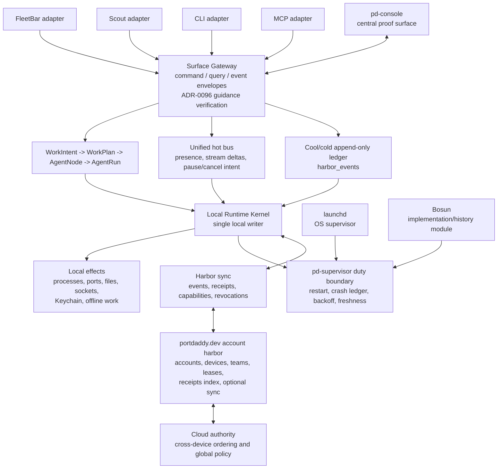

# Destructive Daemon Runtime Refactor

Status: Wave 2 Lane A authority work packet.

Scope: downstream implementation authority for the destructive daemon/runtime
refactor. This packet turns ADR-0100 and binder chapters 25/26 into work packets
for code lanes. It does not edit runtime code.

## Mission

Make Port Daddy's runtime authority impossible to misread:

- one Surface Gateway for official command/query/event envelopes;
- one WorkIntent path for creating official work;
- one local runtime kernel for local process/port/file/socket/Keychain/offline
  authority;
- one canonical cool/cold append-only ledger, `harbor_events`;
- one local Port Daddy supervision duty boundary, `pd-supervisor`;
- one explicit cloud boundary for accounts, devices, teams, leases, receipts,
  optional sync, and cross-device ordering.

This is a destructive refactor. The goal is not to preserve every old spelling
or route. The goal is to remove split authority.

## Required Reading

- [ADR-0100 Destructive Daemon Runtime Authority](../../../adr/0100-destructive-daemon-runtime-authority.md)
- [ADR-0096 Signed Guidance Envelope And Suggestibility Authority](../../../adr/0096-signed-guidance-envelope-and-suggestibility-authority.md)
- [25 Agent Harbor Runtime Refactor Alignment](../25-agent-harbor-runtime-refactor-alignment.md)
- [26 Agent Harbor Runtime Refactor Agent DAG](../26-agent-harbor-runtime-refactor-agent-dag.md)
- [14 Work Intake And Node Shaping](../14-work-intake-and-node-shaping.md)
- [19 Operator Surface Triad](../19-operator-surface-triad.md)
- [Durable State, Sandbox, And Supervision Review](./durable-state-sandbox-supervision-review.md)
- [Swarm Invocation And Node Shaping](./swarm-invocation-and-node-shaping.md)

ADR-0096 is a dependency, not a gap. Surface Gateway, MCP broker, and harness
work must verify `GuidanceEnvelope` authority before guidance becomes a command,
tool grant, or cool/cold ledger event.

## Non-Negotiable Authority Rules

| Domain | Writer of record | Readers/projections |
| --- | --- | --- |
| Operator proof | `pd-console` backed by daemon projections | FleetBar, CLI, MCP, Scout deep links |
| Work creation | `WorkIntent -> WorkPlan -> AgentNode -> AgentRun` | old launch words only as source metadata or migration errors |
| Gateway | Surface Gateway | FleetBar, Scout, CLI, MCP, `pd-console`, managed bodies |
| Local runtime | Local Runtime Kernel | local UI, CLI, MCP, receipts, sync projectors |
| Hot state | unified hot bus | native views, stream renderers, pause/cancel latency path |
| Durable state | `harbor_events` cool/cold append-only ledger | projections, receipts, sync, replay |
| Supervision | `pd-supervisor` duty boundary | launchd as OS supervisor; Bosun as internal/history until proof |
| Local effects | local kernel | cloud can request/sync, never directly manage laptop effects |
| Account/cloud | `portdaddy.dev` account harbor | local kernel, remote harbors, receipt viewers |

## Normative Diagram

Keep this diagram aligned with ADR-0100. The ADR is the authority if the two
drift.

## Work Packets

### A. Surface Gateway Authority

Owned outcome:

- one command/query/event envelope boundary for FleetBar, Scout, CLI, MCP, and
  `pd-console`;
- ADR-0096 guidance verification before control authority;
- authority domain labels on every accepted envelope;
- idempotency keys and risk class on every command envelope;
- no surface-specific runtime truth model.

Allowed legacy behavior:

- read-only discovery endpoint;
- explicit migration errors;
- temporary internal adapter that immediately creates a WorkIntent with
  `source.legacyVerb`.

Forbidden:

- quiet aliases;
- old routes owning transcript, claim, budget, or process state;
- MCP tools bypassing the gateway for official actions.

### B. WorkIntent Migration

Owned outcome:

- all official start, attach, resume, import, automation, dispatch, spawn,
  sortie, conjure, and cloud launch paths route through
  `WorkIntent -> WorkPlan -> AgentNode -> AgentRun`;
- old words are source metadata, not product taxonomy;
- CLI/MCP migration messages name the new path and produce no hidden launch.

Deletion rule:

- once a launch family is migrated, delete the old public route/tool/verb or
  make it fail closed with migration guidance in the same PR.

### C. Hot Bus And Cool/Cold Ledger

Owned outcome:

- `harbor_events` is the cool/cold append-only ledger;
- hot streams are unified transport projections;
- restart/replay reads from durable event order, not WebSocket/SSE memory;
- pause/cancel intents land quickly on the hot path and durably as
  `ControlCommand` or equivalent ledger rows.

Tests:

- restart replay;
- stale hot-frame rejection;
- idempotent duplicate delivery;
- no duplicate side effects during shadow replay.

### D. Local Runtime Kernel

Owned outcome:

- local kernel owns local process, port, file, socket, Keychain, offline work,
  transcript, claim, cost, and receipt authority;
- cloud and relay can sync or request, but not directly mutate local effects;
- no shared writable SQLite database across machines.

Required labels:

- every projection visible in `pd-console` and FleetBar names its authority
  domain: local kernel, `portdaddy.dev` account harbor, or remote harbor.

### E. Supervisor Consolidation

Owned outcome:

- `pd-supervisor` is the Port Daddy duty boundary;
- launchd remains OS supervisor;
- Bosun is preserved as implementation/history until crash-ledger, restart,
  backoff, and release proof pass;
- restart records do not duplicate side effects.

Required proof:

- seeded restart harness;
- crash ledger append;
- backoff/freshness visibility;
- native FleetBar and `pd-console` proof;
- RC and Homebrew proof.

### F. Account Harbor Boundary

Owned outcome:

- relay harbor-card auth stays transport/capability auth;
- human account auth stays a later `portdaddy.dev` account skeleton;
- project defaults remain deny: no transcript upload, sync, team grant, or
  cross-device write without explicit account/device/team authority.

Forbidden:

- treating relay credentials as account login;
- enabling sync by default;
- using cloud presence to imply local process control;
- making a remote writable SQLite copy authoritative.

## Old Entry Point Disposition Table

| Entry family | Allowed disposition | Migration guidance must say |
| --- | --- | --- |
| CLI launch verbs | delete or fail closed | use the WorkIntent/Surface Gateway path; old verb is source metadata only |
| MCP launch tools | delete or fail closed | call the brokered work capability through Surface Gateway |
| old daemon launch routes | delete or fail closed | create a WorkIntent, then materialize AgentNodes |
| hot stream endpoints | unify or mark ephemeral | durable truth lives in `harbor_events` |
| Bosun launch/supervision paths | demote behind `pd-supervisor` only after proof | launchd supervises `pd-supervisor`; Bosun is not a second authority |
| relay harbor-card auth | keep as capability transport | not human account auth; project sync remains default-deny |

## Proof Gates

No lane should claim release readiness without these gates:

1. Seeded restart harness: seed WorkIntent, AgentNode, transcript, control,
   cost, and receipt rows; restart through `pd-supervisor`; prove FleetBar and
   `pd-console` rehydrate from durable projections.
2. Shadow replay: replay the ledger into a shadow runtime; prove no duplicate
   side effects and no stale hot-frame resurrection.
3. Native proof: FleetBar and `pd-console` screenshots or recordings, not web
   stand-ins, show authority labels, restart state, and gateway-owned run truth.
4. RC gate: compiled RC uses new failure/deletion semantics in the installed
   artifact.
5. Homebrew gate: stable install proves daemon, supervisor, CLI, FleetBar, and
   `pd-console` agree about authority.

## Reviewer Checklist

- Can the UI fabricate runtime truth locally? If yes, do not ship.
- Does every official action cross Surface Gateway? If no, do not ship.
- Does any old entry point quietly alias into a second path? If yes, delete or
  fail closed.
- Is any hot stream treated as durable truth? If yes, move it to
  `harbor_events` or mark it ephemeral.
- Does any cloud path mutate local effects directly? If yes, reject the design.
- Does any relay credential stand in for human account auth? If yes, reject the
  design.
- Is Bosun still a second supervisor authority after `pd-supervisor` lands? If
  yes, reject the design.
- Do proof gates use native FleetBar and `pd-console` evidence? If no, the gate
  is incomplete.

## Deliverables For Implementation Lanes

Every downstream lane reports:

- files changed;
- old entry points deleted or changed to fail-closed;
- WorkIntent/Surface Gateway path touched;
- `harbor_events` rows or projections touched;
- local/cloud authority labels affected;
- supervisor duty boundary affected;
- validation commands;
- native proof artifacts when UI is touched;
- remaining blockers.

## Out Of Scope

- Runtime code changes in this lane.
- Account UI implementation.
- Transcript sync by default.
- Public marketing claims about cloud harbor readiness.
- Renumbering existing ADR files.
