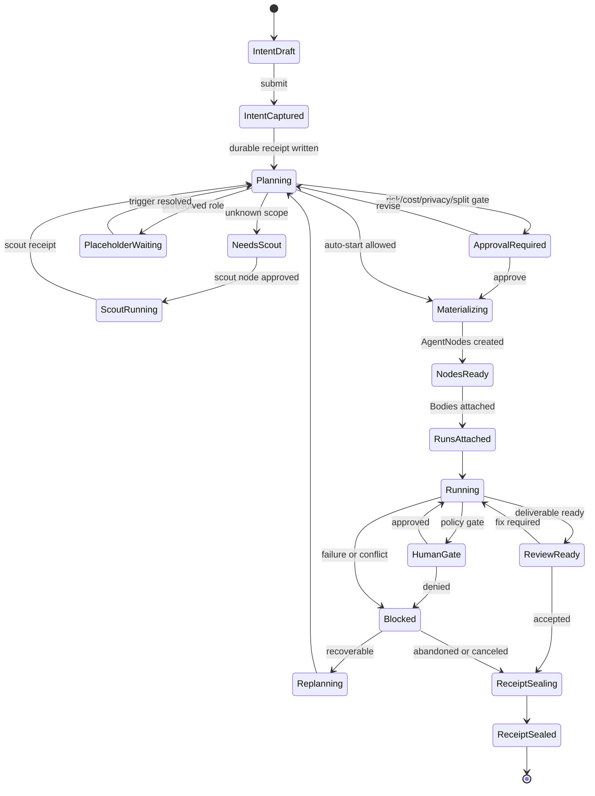

# Swarm Invocation And Node Shaping

Status: active work packet for the Agent Harbor invocation model.

## Mission

Design the one agent invocation model that replaces the current operator-facing
confusion between dispatch, sortie, spawn, conjure, and agent launch words.

The operator primitive is:

```text
Start work
```

The daemon primitive is:

```text
Capture a Work Intent, shape a Work Plan, materialize Agent Nodes only when
the plan is governable, attach Bodies through adapters, and seal a Work Receipt.
```

Everything else is source metadata, compatibility routing, or adapter detail.

## Required Reading

This packet is based on:

- `docs/architecture/agent-harbor-technical-binder/14-work-intake-and-node-shaping.md`
- `docs/architecture/agent-harbor-technical-binder/18-build-prescription-agent-launch-board.md`
- `docs/proposals/articles-of-agreement-harness-roadmap.md`
- `cli/commands/spawn.ts`
- `cli/commands/agents.ts`
- `routes/spawn.ts`
- `routes/agents.ts`
- `skills/swarm-invocation-designer/SKILL.md`
- `skills/swarm-invocation-designer/references/fast-agent-bus.md`
- `skills/swarm-invocation-designer/references/invocation-patterns.md`

Current implementation truth from the CLI and routes:

- `pd spawn` launches a body today, requiring backend, identity, task, and a
  positive budget. It supports dry-run, preflight, model/tier, workdir, files,
  allowed tools, squid hook injection, list, and kill.
- `pd agent` no longer launches work. It is registry, heartbeat, inbox, stream,
  and interrupt control only, and it tells launch callers to use `pd spawn`.
- `/spawn` owns launch, preflight, list, and kill routes today.
- `/agents` owns registration, heartbeat, unregister, get/list, inbox, and
  remote telemetry merge today.

This packet does not change that code. It defines the target model the next
contract slice should migrate toward.

## Solely Responsible Concern

Own this question:

> When an operator says "do this work", what single product action and runtime
> contract decides whether Port Daddy should use one agent, a scout, a chain, or
> a DAG/workgroup?

The answer must prevent old verbs from owning separate state machines,
transcripts, claims, budgets, compliance probes, or UI panes.

## Product Rule

The operator must not choose a runtime taxonomy before asking for work.

Allowed operator inputs:

- goal text;
- repo, PR, file selection, or current UI context;
- constraints such as local-only, cloud-ok, max cost, deadline, no parallelism,
  require review, destructive-actions need approval, preferred body/provider;
- approval for a proposed split, when the split changes cost, risk, privacy, or
  external side effects.

Forbidden operator asks:

- "Should this be a dispatch or sortie?"
- "Should I spawn or conjure?"
- "How many agents do I need?"
- "Which internal route owns the transcript?"

The surface may expose the planner's reasoning, but not require the operator to
know the implementation vocabulary.

## Single Operator Action Model

### Entry Points

All entry points create the same object graph.

| Surface | Operator action | Runtime source metadata |
| --- | --- | --- |
| `pd-console` | `Start work` composer or context action | `source.kind = "console"` |
| FleetBar / dashboard | button, queue card, approval card | `source.kind = "fleetbar"` or `"dashboard"` |
| CLI target | `pd work start "goal"` | `source.kind = "cli"` |
| GitHub / webhook | issue, review, check failure, schedule | `source.kind = "webhook"` |
| Staff agent | recovered task, PR shepherd, watcher alert | `source.kind = "staff-agent"` |
| Compatibility command | old `spawn`, `dispatch`, `sortie`, `conjure` | `source.kind = "compat"` with `source.legacyVerb` |
| Import | existing external run or session | `source.kind = "import"` |

### Operator Flow

1. Operator describes work once.
2. Port Daddy stores a `WorkIntent` before any body starts.
3. Planner creates a `WorkPlan` with shape evidence.
4. If the plan is low-risk and within standing policy, it starts. If it changes
   cost, privacy, destructive authority, or workgroup width, the operator sees
   an approval card.
5. `AgentNode` records are materialized only for executable nodes.
6. `AgentRun` records attach bodies to nodes.
7. Hot-path updates keep the board responsive.
8. Durable events seal claims, transcripts, gates, validation, review, and final
   receipt.

### Command Family Target

Names can change, but the command family should be singular:

```text
pd work start "fix the flaky auth tests"
pd work plan "ship the mobile transcript viewer"
pd work attach --session <external-session-id>
pd work list
pd work show <work-id>
pd work cancel <work-id> --reason "..."
```

Power flags are constraints, not old verb choices:

```text
--local-only
--cloud-ok
--max-cost <usd>
--deadline <duration>
--no-parallel
--review-required
--body <backend-or-adapter>
--model-tier <fast|mid|strong|local|custom>
--workdir <absolute-path>
```

## Runtime Objects

| Object | Meaning | Owns |
| --- | --- | --- |
| `WorkIntent` | The request before planning. | goal, source, operator, constraints, context refs, idempotency key |
| `WorkPlan` | The daemon's planned shape. | shape, node specs, gates, dependencies, evidence, estimates |
| `PlanningPlaceholder` | A known role that is not executable yet. | uncertainty reason, resolution trigger, required evidence |
| `AgentNode` | Durable controllable agent identity. | node id, role, claims, channel, compliance envelope, current run |
| `AgentRun` | One execution attempt by a body. | body, adapter, model, process/run ids, started/completed status |
| `Body` | Claude Code, Codex CLI, Cloudflare Agent, Ollama, LM Studio, custom stdio/HTTP, or human. | provider-specific runtime behavior |
| `Workgroup` | A set of nodes under one plan. | dependency graph, merge owner, shared gates, group receipt |
| `WorkReceipt` | The trust object after work completes or stops. | plan, events, transcripts, artifacts, validation, review, cost, remaining risk |

The compatibility verbs never own these records. They only contribute
`source`, `adapterPreference`, or `startPolicy` fields.

## Shape Heuristics

Default to one Agent Node.

Split only when the planner can write a short evidence paragraph proving that
the split improves correctness, speed, context fit, or independent judgment
after coordination cost is counted.

### Decision Table

| Shape | Use when | Do not use when | Required proof |
| --- | --- | --- | --- |
| Single Agent Node | One invariant dominates, files are coupled, the operator needs live conversation, or the task fits one context. | Split would duplicate research, create file conflicts, or invent coordination work. | touched surface, acceptance criteria, max context estimate |
| Scout Agent Node | Files, skills, risk, or acceptance criteria are unknown. | The task is already executable. | scout question, timebox, output contract |
| Linear chain | Each stage depends on the prior artifact, or context rollover is needed. | Steps can safely run at the same time. | stage inputs/outputs, handoff contract |
| DAG/workgroup | Three to seven branches have low overlap, distinct skills, independent validation, and a merge owner. | Most branches need the same files, same decision, or same live runtime. | dependency graph, claims plan, merge plan, per-node gates |
| Tournament | Multiple candidate approaches need comparison. | The problem has an obvious correct path. | comparison rubric, worktree per entrant, cleanup plan |
| Ambient watcher | A long-running surface needs monitoring. | It is a one-off implementation task. | watch scope, alert threshold, action owner, cancel path |
| Human gate | The next step is destructive, high-cost, privacy-sensitive, external, or low-confidence. | Existing policy already grants authority and rollback. | approval payload, denial receipt, safe alternative |
| Planning Placeholder | A role is visible but executable details are missing. | Provider, files, budget, claims, and done condition are known. | uncertainty reason, resolution trigger, max wait wave |

### Split Evidence Checklist

Before making a DAG/workgroup, the planner records:

- `coupling`: expected file/state/design overlap;
- `graph_width`: independent branches, not just a long sequence;
- `context_pressure`: why one body would lose quality or need rollover;
- `skill_boundary`: which skills/providers differ by branch;
- `failure_domain`: whether one failed branch invalidates the whole plan;
- `review_independence`: whether a separate reviewer adds judgment, not just throughput;
- `capacity`: whether an existing compatible node should receive the work;
- `coordination_cost`: worktree, briefing, claims, channel, review, and merge cost;
- `budget_cost`: estimated spend and cap;
- `operator_burden`: approvals, notifications, and visual complexity.

Rule of thumb:

```text
split only when split_cost + communication_cost + merge_cost < stay_cost
```

Hard stops:

- If the planner cannot name files or acceptance criteria, use a scout or a
  placeholder.
- If more than one third of the plan is placeholders after two waves, stop and
  re-scope.
- If two proposed nodes need the same scarce file or lock, use one node, a
  chain, or a human gate.
- If the split exists only because the old verb sounds more "agentic", do not
  split.

## Hot Path Versus Durable Path

Use two planes. Do not force one transport to be both the steering wheel and
the audit log.

| Plane | Purpose | Examples | Persistence rule |
| --- | --- | --- | --- |
| Hot path | presence, steering, pause/cancel, stream cursors, current state, small status deltas | in-process event bus, Unix socket, loopback WebSocket, SSE, gRPC, NATS, Redis Streams | ephemeral, replaceable, summarized at checkpoints |
| Durable path | intent, plan, claims, transcripts, commands, gates, reviews, costs, artifacts, receipts | Port Daddy notes, event log, transcripts, tuples, tubes when conversation matters, actor inboxes, relay/R2/D1, PR comments | append-only, replayable, attributable |

Latency targets:

- live board p95 under 250 ms;
- steering p95 under 100 ms;
- local IPC hop under 10 ms where possible;
- loopback WebSocket/gRPC hop under 25 ms;
- durable append under 500 ms per checkpoint;
- cancel and pause must not block on durable append, but must emit a durable
  follow-up event once acknowledged.

Checkpoint rule:

```text
Hot messages may move the UI quickly. Durable events decide history.
```

Durable events are required at:

- intent captured;
- plan proposed;
- operator approval or auto-start decision;
- node materialized;
- body attached;
- claim accepted or rejected;
- run started;
- human gate entered/resolved;
- blocked/replan;
- review-ready;
- completed/failed/canceled/abandoned;
- receipt sealed.

## Message Schema

The contract slice should version these shapes. The names below are design
targets, not committed TypeScript APIs.

### Work Invocation Envelope

```json
{
  "schema": "pd.work.invocation.v0",
  "invocationId": "work_inv_01J...",
  "intentId": "work_intent_01J...",
  "planId": "work_plan_01J...",
  "idempotencyKey": "repo:branch:source:event",
  "source": {
    "kind": "cli",
    "legacyVerb": null,
    "surface": "pd work start",
    "actorId": "agent-or-operator-id",
    "worktree": "/absolute/path",
    "branch": "codex/example"
  },
  "goal": {
    "text": "fix the flaky auth tests",
    "contextRefs": [
      { "kind": "file", "path": "tests/unit/auth.test.ts" },
      { "kind": "pr", "number": 123 }
    ]
  },
  "constraints": {
    "placement": "local-only",
    "maxCostUsd": 5,
    "deadlineMs": 5400000,
    "parallelism": "planner-decides",
    "reviewRequired": true,
    "destructiveActions": "human-approval"
  },
  "planning": {
    "shape": "single-node",
    "confidence": 0.82,
    "evidence": "One coupled test surface; no independent branches.",
    "requiresApproval": false
  },
  "links": {
    "hotChannel": "work:work_inv_01J...:hot",
    "durableStream": "work:work_inv_01J...:events",
    "receiptId": null
  }
}
```

### Work Plan Node Spec

```json
{
  "schema": "pd.work.node-spec.v0",
  "nodeSpecId": "node_spec_01J...",
  "planId": "work_plan_01J...",
  "role": "implementer",
  "kind": "agent-node",
  "bodyPreference": {
    "adapter": "cli:codex",
    "modelTier": "mid"
  },
  "scope": {
    "files": ["cli/commands/spawn.ts"],
    "symbols": [],
    "forbiddenSurfaces": ["routes/agents.ts"]
  },
  "contracts": {
    "claimsRequired": true,
    "worktreeRequired": true,
    "noteBeforeEdit": true,
    "maxSpendUsd": 3,
    "stopConditions": [
      "claim-conflict",
      "red-ci-without-path",
      "unsafe-command-refusal"
    ]
  },
  "dependencies": [],
  "acceptance": {
    "doneWhen": "focused test passes and diff is limited to spawn command help",
    "validationCommands": ["npm test -- tests/unit/spawn-cli-budget.test.js"]
  }
}
```

### Planning Placeholder

```json
{
  "schema": "pd.work.placeholder.v0",
  "placeholderId": "placeholder_01J...",
  "planId": "work_plan_01J...",
  "role": "reviewer",
  "uncertaintyReason": "F0 contract output not available yet",
  "knownDependencies": ["node_spec_contract_freeze"],
  "resolutionTrigger": "schema package lands",
  "maxWaitWave": 2,
  "evidenceNeeded": ["schema paths", "review rubric", "acceptance gates"]
}
```

### Hot Path Message

```json
{
  "schema": "pd.work.hot.v0",
  "workId": "work_inv_01J...",
  "nodeId": "agent_node_01J...",
  "runId": "agent_run_01J...",
  "kind": "heartbeat",
  "state": "running-tests",
  "seq": 42,
  "artifactRef": null,
  "ts": "2026-07-03T12:00:00Z"
}
```

Allowed hot kinds:

- `presence`;
- `heartbeat`;
- `state`;
- `stream-cursor`;
- `pause-request`;
- `pause-ack`;
- `cancel-request`;
- `cancel-ack`;
- `steer`;
- `context-pressure`;
- `gate-waiting`.

### Durable Event

```json
{
  "schema": "pd.work.event.v0",
  "eventId": "evt_01J...",
  "workId": "work_inv_01J...",
  "intentId": "work_intent_01J...",
  "planId": "work_plan_01J...",
  "nodeId": "agent_node_01J...",
  "runId": "agent_run_01J...",
  "kind": "claim.accepted",
  "actorId": "agent_node_01J...",
  "body": {
    "path": "docs/example.md",
    "symbolPath": null
  },
  "causationId": "evt_previous",
  "correlationId": "work_inv_01J...",
  "idempotencyKey": "claim:agent_node_01J...:docs/example.md",
  "ts": "2026-07-03T12:00:01Z"
}
```

Durable event rules:

- unknown fields must be tolerated;
- duplicate idempotency keys are no-ops;
- every command that changes authority emits success or denial;
- stale projections may display, but must not authorize commands;
- absence of transcript is represented as an event or explicit no-stream reason.

## State Machine



### State Contracts

| State | Required durable fact | Hot-path behavior |
| --- | --- | --- |
| `IntentCaptured` | `WorkIntent` with source, goal, constraints, idempotency key | optional UI ack |
| `Planning` | `WorkPlan` draft with evidence and estimated gates | planner progress status |
| `NeedsScout` | scout question, timebox, output contract | scout state updates |
| `PlaceholderWaiting` | placeholder with resolution trigger | none required |
| `ApprovalRequired` | approval payload and risk/cost reason | live waiting indicator |
| `Materializing` | Articles of Agreement attached to node specs | short status updates |
| `NodesReady` | `AgentNode` records and claims requested | presence and channel join |
| `RunsAttached` | adapter/body/model/provenance recorded | stream cursor starts |
| `Running` | run started, claims, transcript stream or no-stream reason | heartbeat, steering, cancel/pause |
| `HumanGate` | gate payload and allowed actions | gate waiting status |
| `Blocked` | blocker reason and recovery choices | blocked status |
| `ReviewReady` | validation artifacts and reviewer request | reviewer presence |
| `ReceiptSealing` | final events gathered | optional sealing progress |
| `ReceiptSealed` | `WorkReceipt` with remaining risk | final summary |

An unmanaged body can be imported only through an explicit `ImportObserved`
variant that records the missing guarantees. It cannot be promoted silently into
a compliant Agent Node after the fact.

## Failure Modes

| Failure mode | Detection | Response |
| --- | --- | --- |
| Old verb starts a body without `WorkIntent` | launch result has no intent/plan id | block new path; compatibility route creates intent first; mark old result unmanaged if imported |
| False split | nodes share files, decisions, or validation gates | collapse to single node or chain before launch |
| Missing split | context pressure, repeated rollover, or one body holds unrelated branches | replan into successor node or DAG at checkpoint |
| Scout becomes implementation | scout claims broad files or makes product edits | stop scout, seal scout receipt, create new executable plan |
| Placeholder lives too long | unresolved after max wait wave or one third of plan remains placeholders | re-scope with operator or cancel placeholder |
| Hot message lost | seq gap, stale heartbeat, missing cancel ack | resync from durable projection; retry steering; orphan if timeout expires |
| Durable append lags | hot board shows state without matching checkpoint | label state provisional; continue cancel/pause; append follow-up event |
| Duplicate command | same idempotency key appears twice | return prior result; do not double-spend or double-start |
| Claim conflict | claim rejected or active owner overlaps | replan ownership, serialize as chain, or ask Coxswain-equivalent adjudication |
| Budget breach | preflight or cost event crosses cap | pause before next paid action; emit denial and approval option |
| Unsafe command | tool gate denies destructive or secret-read action | record denial, offer safe alternative, require human gate for override if allowed |
| Adapter provenance weak | body cannot prove model/provider/tool hooks | downgrade compliance; disable higher-risk controls |
| Transcript missing | run emits no transcript stream and no no-stream reason | mark non-compliant until adapter records reason or stream path |
| Orphaned session | heartbeat stale beyond timeout | stop hot display, publish salvage recipe, allow takeover |
| Operator approval ignored | workgroup starts before approval event | stop runs, seal violation receipt, require explicit restart |
| Projection stale | UI read time older than command authorization policy | disable commands; show stale label and refresh path |

## Migration Notes For Old Verbs

### `spawn`

Current role:

- immediate body launch through CLI and `/spawn`;
- preflight with backend/model/tier/identity/budget;
- list active spawned agents;
- cancel by spawned agent id.

Target role:

- compatibility alias for `pd work start` with `startPolicy = "immediate"`;
- `backend`, `model`, `modelTier`, `workdir`, `files`, `allowedTools`,
  `permissionMode`, and `injectSquidHooks` become constraints or body
  preferences on the `WorkIntent` or first `NodeSpec`;
- `/spawn/preflight` becomes an adapter behind work preflight;
- `/spawn` must create or reference a `WorkIntent`, `WorkPlan`, `AgentNode`,
  and `AgentRun` before calling the spawner;
- `pd spawned` becomes a view over `AgentRun` and `WorkIntent` projections;
- `pd spawn cancel <id>` cancels a run, with a durable denial or cancellation
  event; interrupt remains a separate live steering control.

Deprecation copy:

```text
pd spawn is now a compatibility launcher for pd work start.
Use: pd work start --body <backend> --max-cost <usd> "task text"
```

### `agent` / `agents`

Current role:

- registry, heartbeat, unregister, inbox, stream, interrupt, and list;
- `pd agent` explicitly refuses launch-shaped forms and points at `pd spawn`.

Target role:

- stay a control and roster surface;
- list `AgentNode` plus current `AgentRun`, not just process registration;
- `pd agent stream <id>` tails a node/run stream assembled from hot and durable
  sources;
- `pd agent interrupt <id>` becomes steering against a node/run with a durable
  acknowledgement event;
- no launch forms return.

Deprecation copy:

```text
pd agent controls registered agents and Agent Nodes. It does not start work.
Use: pd work start "task text"
```

### `dispatch`

Current product idea:

- queued autonomous feature work, dry-run by default, optionally really runs in
  an isolated worktree and opens a draft PR.

Target role:

- compatibility alias for `pd work start --queued`;
- proposed dispatches become `WorkIntent` records with `startPolicy = "queued"`;
- `dispatch run --really-run` becomes approval of a queued intent;
- dispatch state becomes a projection of Work Intent, Work Plan, Agent Run, PR,
  and receipt events;
- dispatch should not own separate budget, PR, transcript, or worker state.

Deprecation copy:

```text
pd dispatch is now queued work intake.
Use: pd work start --queued "goal" and approve the generated plan.
```

### `sortie`

Current product idea:

- agent campaign or parallel work slice language.

Target role:

- compatibility alias for a `WorkPlan` whose shape is `dag-workgroup` or
  `lead-and-specialists`;
- every sortie packet becomes node specs with claims, worktrees, gates,
  validation, and merge owner;
- no sortie-specific transcript or state machine survives;
- if the planner cannot produce node specs, the result is placeholders or a
  scout, not a launched workgroup.

Deprecation copy:

```text
pd sortie maps to a planned workgroup.
Use: pd work start --allow-workgroup "goal" and review the proposed split.
```

### `conjure`

Current product idea:

- console-originated or creative "make a thing" launch language, especially
  where the UI feels like summoning a helper.

Target role:

- console affordance only, never a runtime owner;
- creates a `WorkIntent` with `source.kind = "console"` and optionally
  `source.legacyVerb = "conjure"`;
- adapter preferences, squid hooks, creative prompt context, and selected UI
  pane become constraints/context refs;
- no conjure-specific Agent Node, transcript, cost, or compliance path.

Deprecation copy:

```text
Conjure starts work from the console. Runtime state lives under Work Intent,
Work Plan, Agent Node, Agent Run, and Work Receipt.
```

### `nightshift`

Current role:

- deprecated dispatch alias.

Target role:

- keep as a short deprecation window alias to queued work only;
- never document as a shipped launch model.

Deprecation copy:

```text
pd nightshift was renamed. Use pd work start --queued "goal".
```

## Implementation Work Order

Send one `F0` contract agent before implementation fanout.

Mission:
  Convert this packet plus chapters 14 and 18 into the first executable
  invocation contract.

Outputs:

- v0 schemas for `WorkIntent`, `WorkPlan`, `NodeSpec`,
  `PlanningPlaceholder`, `AgentNode`, `AgentRun`, hot-path message, durable
  event, and `WorkReceipt`;
- route migration map for `/spawn`, `/agents`, and future `/work`;
- CLI compatibility table for `spawn`, `dispatch`, `sortie`, `conjure`,
  `agent`, and `agents`;
- command/query/event boundary table;
- idempotency and duplicate-start rules;
- state-machine tests or fixtures for happy path, scout, placeholder, human
  gate, cancel, orphan takeover, and old-verb compatibility.

Acceptance gates:

- a body cannot start without a Work Intent and Work Plan unless explicitly
  imported as unmanaged/observed;
- old verbs are metadata or aliases, not runtime owners;
- one-node default is enforced unless split evidence exists;
- hot-path loss cannot corrupt durable truth;
- durable projection staleness cannot authorize commands;
- every error state has a recovery, cancellation, or receipt-sealing path.

Do not:

- build GPUI before the contract exists;
- add another launch verb;
- preserve separate state machines for old verbs;
- hide compliance gaps behind friendly UI copy.

## Mandatory Note Seed

When this packet is handed to implementation, write a Port Daddy note like:

```text
Scope: F0 invocation contract from swarm-invocation-and-node-shaping.md. Goal:
make Start work the only intake model; old spawn/dispatch/sortie/conjure paths
must create Work Intent and Work Plan records or be marked unmanaged imports.
Validation: schema fixtures plus route/CLI migration tests.
```
