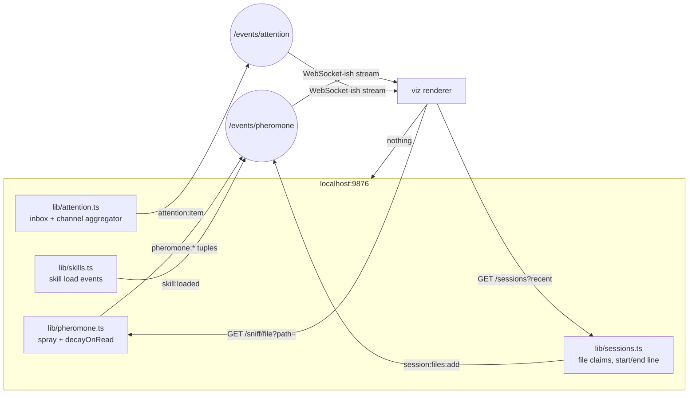

# Attention Pheromone Trails + the Operator Editor

**Status:** design, not implementation
**Author:** sortie 2026-06-03 (operator-direct request)
**Anchors:**
  `docs/design/pheromone-vocabulary-v1.md` (the substrate)
  `docs/design/2026-06-03-pheromone-viz/mock.html` (the picture)
  `lib/attention.ts` (the aggregator that already exists)
  `lib/pheromone.ts` (the substrate that already exists)
  ADRs 0033–0037 (the wiring)

This document has two halves that share one premise: **attention is the most undervalued
artifact a fleet produces, and the operator is being asked to keep all of it in their head.**

Half one is a live + replayable picture of where agents are spending their attention
on the operator's files. Half two is the editor the operator opens to *do something*
about it — pin a paragraph, deposit a counter-pheromone, write a doc that an agent
will read with an obvious heat trail.

Neither half is implementation. Both are shippable, and the picture is the part the
operator should look at before reading the words.

---

## TL;DR

- **Pheromone viz** turns the existing substrate (`lib/pheromone.ts`) plus the existing aggregator (`lib/attention.ts`) into a heat-tree + line gutter + time scrubber + cross-file trail graph. Live and replayable. Per-agent filter. Operator pin overlay. Mock at `docs/design/2026-06-03-pheromone-viz/mock.html`.
- **WYSIWYG editor** is a Tauri shell + Rust core + comrak markdown engine + tree-sitter highlighting + a pheromone sidecar that paints per-paragraph heat on top of *whatever the operator is reading*. Justified only by the sidecar; without it, fork Marktext.
- Half-life model and decay rules are already specified in v1. This doc is purely the picture and the editor that uses the picture.
- Three concrete next PRs for the viz; three for the editor; both have a sane MVP that ships before the ambitious version.
- Pre-mortem at the end: when this is the wrong move, when it's worth it anyway.

---

# Part 1 — Pheromone trail visualization

## What this is and what it isn't

This is a picture of *where the fleet's attention has been*. Not where the fleet *worked*
(commits cover that, and git already drew that picture in 2005). Attention is upstream
of work: it's the read, the cite, the claim, the hover, the long pause. It's what a
fleet does *before* it changes a file, and the volume of it is the leading indicator
the operator currently has to reconstruct from chat transcripts and intuition.

> Attention is the *act of looking*. Work is the *act of changing*. Pheromones, in this
> system, are the recorded shadow of attention — a strength-on-target scalar that
> evaporates on its own (`pheromone-vocabulary-v1.md` § 3). The picture is a renderer
> over that shadow.

Three things the picture is **not**:

1. Not a tracelog viewer. Tracelogs are at `pd activity` and they answer "what
   happened at 17:42:13Z." The picture answers "what has been getting attention this
   morning?" and "where did one agent's reading of file A lead it next?" The first is
   sequential and exhaustive; the second is aggregate and forgetful.
2. Not a productivity dashboard. It does not score agents. It does not flag the
   slacker. The whole point of half-life decay is that an agent who reads a file at
   2 pm and ignores it at 6 pm should look identical to one who never read it — the
   shadow has faded. Building a "minutes-of-attention-per-agent" panel on top of this
   would re-introduce the failure mode pheromones exist to avoid.
3. Not a debugger. When tests are red the picture turns ochre because vocab v1 says
   `quality:test-failing` is always-visible — but the operator still has to read the
   test output. The picture says *go here next*, not *here is what to type*.

The clearest way to say it: **the picture is a `pd sniff`, made spatial.** The CLI's
ASCII heatbar (`cli/commands/pheromone.ts:154`) renders one target at a time and is
limited by the terminal grid; the picture renders the whole tree and the whole file
and the whole graph, with time on the X axis.

## Architecture in one paragraph

The daemon already writes pheromones into row metadata (`lib/pheromone.ts:80-95`).
The daemon already exposes the aggregator (`lib/attention.ts`) and the read surface
(`pd sniff` → `routes/pheromone.ts:46`). The viz is therefore a **read-only renderer**
fed by two SSE streams plus one polled query:



The renderer never writes. The renderer can replay because the daemon retains the
last N pheromone events in a ring buffer (Phase 2, slug `pheromone_events`, called
out in vocab v1 § 9). The renderer can filter by agent because every spray records
its `sprayed_by` field and every `attention:item` carries its `agentId`.

The picture has four layers:

1. **Heat tree.** Per-file intensity scalar = urgency-weighted (`pheromone-vocabulary-v1.md` § 4.1).
2. **Gutter heatmap.** Per-line intensity, one cell per line, color = dominant kind at that line, opacity = strength.
3. **Cross-file trails.** Edges between files when one agent's read of A is followed (within a session, within N seconds) by a read or claim on B. These are stigmergic edges — they exist because something walked from A to B and left a smell.
4. **Time scrubber.** A 60-bucket density bar (one bucket per minute by default, configurable by range pill). Playhead anchored at "now" for live; draggable for replay.

The mock at `docs/design/2026-06-03-pheromone-viz/mock.html` is the picture. Open
it. Toggle the theme button. The throb on hot lines is the live-pulse animation —
a 5-second throb gated by `prefers-reduced-motion`. The cross-file trail SVG has
edges that dash-flow because attention literally has direction.

## Choices the picture defends

**Why a heat tree and not a treemap.** Treemaps optimize for surface area; we don't
want that. The hottest file in the tree is the *same width* as the coldest because the
operator already knows the relative sizes of their files. The signal is heat, not
volume.

**Why a gutter heatmap and not an inline overlay.** Inline overlays (highlighting the
code itself) work for "show me ONE kind" but break under the multi-kind composition
the vocab demands. The gutter is a dedicated channel; the code keeps its syntax
highlighting; you read both at once. (The mock does add a faint background to lines
where two kinds agree — `data-attn="test-failing"` plus `data-attn="contested"` would
get a left-border stripe per the dominant kind, never two stripes.)

**Why a time scrubber and not a date picker.** A date picker is a query interface;
a scrubber is an exploration interface. The operator does not know what time the
interesting moment was — that's the *whole reason* they're here. The scrubber
also makes the relationship between attention and time legible: you can *see* the
moment the human-blocked badge appeared, and the lines that lit up after.

**Why the agent filter is chips, not a sidebar tree.** The chip row is a
multi-select with sticky color identity. Click "claude-cli" — claude's color
disappears from the gutter, from the tree, from the timeline. The picture is the
filter's preview. A sidebar tree would force a re-render-on-pick discontinuity.

## Three concrete next PRs

### PR A — `pheromone-events` ring buffer + SSE

A 1k-event circular buffer in `lib/pheromone.ts` plus a `routes/events/pheromone.ts`
SSE endpoint. Every `spray()` call appends `{ts, target, kind, strength, sprayed_by}`.
SSE replays the last N events on subscribe (catch-up), then streams new ones.
Replay-the-last-hour is "GET /pheromones/events?since=ts" without SSE.

Files touched: `lib/pheromone.ts` (add ring + writer), `routes/events.ts` (new SSE
handler). No schema change.

Acceptance: `curl -N localhost:9876/events/pheromone` streams JSON lines on spray;
hitting `?since=` returns last-N events with `replay: true` flag on each.

### PR B — `/sniff/file` enriched read surface

Vocab v1 § 6 spec'd it; nobody's built it. Returns `{ dominant, urgency_score,
always_visible: [...], pheromones: [{kind, value, rank, trend, age_s, half_life_s,
sprayed_by, advice}] }` for a single file. Powers the inspector column in the mock.

Files touched: `routes/sniff.ts` (extend existing), `lib/pheromone.ts` (expose
enriched read), `mcp/server.ts` (new MCP tool `sniff_file_enriched`).

Acceptance: hitting `/sniff/file?path=lib/pheromone.ts` returns the JSON shape the
inspector renders.

### PR C — the viz itself, as a route on the daemon

A single-file `public/attention.html` that hits the two endpoints above plus
`/sessions?recent` and renders the picture. No build step, no framework — same
philosophy as `public/index.html`. The mock at `docs/design/2026-06-03-pheromone-viz/mock.html`
is the spec. Lift it.

Files touched: `public/attention.html` (new), `routes/index.ts` (wire the static
route), `public/index.html` (link to it from the dashboard nav).

Acceptance: navigate to `localhost:9876/attention`, see your live fleet's heat tree,
scrub backward to a moment from 30 minutes ago, see the lines that lit up at that
moment.

---

# Part 2 — The Operator Editor

> Why do we need our own editor? Because the picture above is a renderer — it tells
> the operator where attention is going. The editor is the *write* surface of the
> same loop: the operator highlights a passage, the daemon sprays a synthetic
> pheromone on it, and the next agent to read the file sees the operator's pin
> the same way it sees `quality:test-failing`. The picture is read; the editor is
> write. Together they close the stigmergic loop.

## Stack: Tauri shell, Rust core, comrak engine

| Layer | Pick | Defense |
|---|---|---|
| Shell | **Tauri 2.x** | Web tech for UI (we already ship a dashboard); Rust for the dirty work; small binary; respects OS dark mode; respects Dynamic Type via system font fallback. The alternative is forcing the editor to be a web page on `localhost:9876`, which is fine for some operators but loses the "open this `.md` from Finder" affordance. |
| Markdown | **comrak** | The reference-quality Rust CommonMark + GFM parser. It produces an AST we can walk; it supports the same extensions the website-v2 MDX pipeline already uses (tables, footnotes, strikethrough). Pulldown-cmark is faster but emits events, not nodes — worse for two-way edit. |
| Highlighting | **tree-sitter + syntect** for code blocks | tree-sitter for editable code blocks (so the WYSIWYG isn't lying about parse state); syntect for read-only fenced blocks in source view. Both compile to wasm in the renderer if we need the same highlighter in the browser. |
| Editor surface | **CodeMirror 6 in the webview**, controlled by the Rust core | The "render markdown as styled text inline" trick (Typora, iA Writer, Marktext) is CM6's strength; the alternative is writing our own contenteditable, which is an Adventure. |
| File watch | **notify-rs** | Cross-platform, what every other Rust editor uses. Wire to the same `pheromone:hot:editing` spray that `lib/sessions.ts` does for claims. |
| Plugin surface | **WASM components** via wasmtime | Plugins as `.wasm` files that get a typed sandbox host. This is where the pheromone sidecar lives, and where third-party annotations live. |

Three Rust UI alternatives — Iced, Egui, Slint — were considered and rejected:

- **Iced** is excellent for tight desktop UIs but its text editing primitives are
  not Typora-class today. We'd be writing the bidi-aware soft-wrap and IME glue
  ourselves. CodeMirror has solved this and ships it.
- **Egui** is immediate-mode. Markdown rendering with selection-preservation across
  re-renders is a fight. Not Typora.
- **Slint** has the best designer-friendly markup but the cursor-handling primitives
  for rich text are nascent.

The honest read: any pure-Rust UI gets us 70% of an editor and three years of "we
need to ship a basic IME shortcut and it's a tracking issue from 2024." Tauri lets
us put 100% of the editing primitive on top of CodeMirror today, and 100% of the
filesystem + plugin + IPC work on top of Rust.

## What the sidecar does

The pheromone sidecar is the only feature on this editor that would justify
building it instead of forking Marktext. Concretely:

- **Per-paragraph heat ribbon.** A 2 px column down the left edge of every paragraph,
  colored per the dominant pheromone kind on that paragraph's source range. Fades
  on hover so it doesn't dominate prose; pops on scrubber-driven replay.
- **Operator highlight → agent priority.** Select a passage, hit `⌘P` ("Pin"), and
  the editor calls `pd pheromone spray --kind relevance:operator-pinned --target
  file:path#L<n>-L<m> --strength 0.9`. Next agent's `pd sniff` returns the pin in
  the always-visible slot. Mirror affordance: `⌘⇧P` to clear.
- **Inline agent pheromone deposits.** When an agent calls `pd note` or `pd cite`
  with a file+region target, the editor renders a marginalia chip near that range
  ("claude-cli cited L7", "codex contested L16-L18"). Click the chip → opens the
  agent's note in a side panel.
- **Replay mode.** Same time scrubber as the viz, embedded in the editor's
  status bar. Drag back to see the heat as it was 20 minutes ago. The text doesn't
  move; only the ribbons fade.

Everything else the editor does — render headings nicely, fold code blocks, drag
images, paste tables — is table stakes and is the part we *shouldn't* invent.
That's what CodeMirror and comrak are for.

## ASCII mock — editor + sidebar

```
+------ Port Daddy Editor — docs/design/pheromone-vocabulary-v1.md ------+
|                                                                       |
|  # Pheromone Vocabulary v1 — Kind Catalog & Decay Model        |O|   |  <-- |O|: operator pin glyph (12px eyebrow)
|                                                                |O|   |
|  **Status:** v1, accepted                                            |
|                                                              [claude]|  <-- agent chip: cited this paragraph 3m ago
|  ## 1. Typing rule                                                   |
|                                                                | C |  <-- |C|: codex left a counter-note
|  Pheromones encode **graded attention**, never facts. A              |
|  pheromone is a scalar in `[0, 1]` on a target...                    |
|  |hot| The hot:editing kind decays on read with half-life     [code] |  <-- inline mention badge for kind name
|       300 s. See § 3.1 formula.                                      |
|                                                                      |
|  ## 3. Decay model — per-kind half-life                              |
|                                                              [hot]   |
|  | claude-cli read this 4× in last 20m. last cite 2m ago. |  ← sidecar bubble on hover
|                                                                      |
|  v_new = v * (0.5 ^ (dt / h))                                        |
|  This is the standard half-life formula...                           |
|                                                                      |
+---+---------------------------------------------------------+--------+
| ◀ |======|||========================|||||==================|▶| 4h v |  <-- replay scrubber + range
+---+---------------------------------------------------------+--------+

Sidebar (collapsed by default, ⌘1 to toggle):

+---- pheromones on this file ----+
|  attention:human-blocked  ████  |
|  quality:test-failing     ███   |
|  hot:editing              ███   |
|  recent:touched           ██    |
|  relevance:operator-pin   ███   |  <-- new kind, sprayed by THIS editor on ⌘P
|                                  |
|  dominant: attention:human-blocked
|  urgency:  0.86                  |
+----------------------------------+
```

The ribbon column to the right of the prose is the "where did attention land?" channel.
The bottom bar is the same scrubber as the viz. The sidebar mirrors the inspector
column of the viz. Operator who's read one of these has read the other.

## Three concrete next PRs (editor edition)

### PR A — MVP read-only `pd attention edit <path>`

A binary that opens any `.md` file in a Tauri shell with comrak rendering,
read-only, and the sidecar querying `/sniff/file` on a 5 s tick. No save, no
plugins. This is the smallest possible thing that proves the sidecar is real.
~2000 LoC.

Files: new `apps/editor/` (Tauri scaffold), `apps/editor/src-tauri/src/sniff.rs`
(thin wrapper over the daemon's HTTP API), `apps/editor/src/App.tsx` (CM6 readonly
+ sidecar shell). No daemon changes required (PR B from Part 1 is the only daemon
dependency).

Acceptance: open `docs/design/pheromone-vocabulary-v1.md`, see the ribbon, see the
sidebar, see live updates as another agent runs `pd sniff` against the file.

### PR B — Write mode + operator pin

CodeMirror in `edit` mode. Save through Tauri's filesystem API; debounce 800 ms,
spray `hot:editing` on save. Implement `⌘P` to call `pd pheromone spray --kind
relevance:operator-pinned --target file:path#L<n>-L<m>`. Introduces the new kind
`relevance:operator-pinned` to vocab v1's open-questions list § 7.2 — i.e. this PR
also lands the vocab amendment.

Files: same as PR A plus `lib/pheromone-kinds.ts` amendment (kind catalog entry),
`docs/design/pheromone-vocabulary-v1.md` § 7 → § 2 promotion.

Acceptance: pin a passage, run `pd sniff files <path>` from another terminal, see
the pin in `always_visible`.

### PR C — Inline agent marginalia + replay

Render the agent-note chip system. Subscribe to `/events/attention` and
`/events/pheromone` SSE; place chips near the source-range a `pd cite` references.
Replay scrubber drives sidebar values backward through the ring buffer from
Part 1 / PR A.

Files: `apps/editor/src/Marginalia.tsx`, `apps/editor/src/Scrubber.tsx`.

Acceptance: codex runs `pd cite "L16-L18"`; chip appears next to those lines
within 1 s; drag the scrubber backward to 30 min ago, watch the chip vanish.

---

## Pre-mortem — when this is the wrong move

The honest case **against** building our own editor:

1. **Forking Marktext gets us 90% of the editor for 10% of the work.** Marktext
   is Electron + Vue and has Typora-class WYSIWYG markdown today. We could
   add the sidecar as a Marktext extension and ship in a week. We'd inherit the
   Electron weight and a foreign UI codebase, but we'd be home.
2. **Helix is closer to the operator's instincts than Typora is.** The user's
   "the CLI is for the robots" rule cuts both ways — and the editing surface
   most agents recognize is Helix / Neovim. The "operator editor" might be
   `pd attention edit` as a *Helix overlay* (a sidebar plugin in a TUI), not
   a GUI app. This would also pass the no-tiny-fonts rule for free (let the
   terminal scale).
3. **CodeMirror 6 in a webview is still a webview.** All the IME / clipboard /
   spell-check / accessibility quirks of webviews come along. Native Mac text
   handling is *better* than any CodeMirror config we'll ship.
4. **A Rust core does not buy us much for an editor.** It buys us a lot for a
   *daemon*. The editor is mostly latency-tolerant. We're picking Rust here
   because the rest of the project is Rust-shaped, not because the editor
   needs it.
5. **The pheromone surface might be the wrong write surface anyway.** If the
   operator highlights a paragraph to mark it relevant, that's a fact about
   the operator's intent. Per vocab v1 § 7.2, that is *probably* a tuple, not
   a pheromone. We may end up wanting the editor to write to feedback +
   tuples and have a synthetic pheromone derived from those rows. That's
   fine, but it means the "write a pheromone directly" affordance is wrong.

The honest case **for** building it anyway:

1. **The sidecar is the product.** No other editor has it. None will. The
   editor that the operator opens to read agent notes is the editor whose
   sidecar carries the right metadata. A Marktext fork that imports
   `@portdaddy/sidecar` is fine but means the operator has to know to install
   it. The bundled editor is the *one* editor where the sidecar is the
   default.
2. **The viz and the editor share a renderer.** The mock at
   `docs/design/2026-06-03-pheromone-viz/mock.html` and the editor mock above
   share `--pheromone-*` tokens, the time scrubber, the agent chip row, and
   the inspector column. Building both makes them one product. Building only
   the viz makes the editor an afterthought.
3. **The operator's vision-accessibility ground rule (`feedback_no_tiny_fonts`)
   is easier to honor on a surface we own.** Marktext's font handling is
   adequate but is downstream of Electron-Chromium accessibility defaults.
   Our editor honors `prefers-reduced-motion`, Dynamic Type via the system
   font stack, and the 14px floor by construction.
4. **`pd` already speaks every other Curiositech property's MDX dialect.** The
   editor that lights up on `<!-- COMPONENT:skillcta -->` and renders an inline
   preview of the registered component is the editor every Curiositech blog
   wants. That's a moat. (And the rule that *every blog post must be bespoke*
   is harder to honor when the editor is just a markdown text box.)

The middle position: **build PR A (the read-only editor) first.** It's the
smallest test of whether the sidecar carries weight. If, after a week of using
it, the operator finds the sidecar essential, we promote to PR B and PR C and
the full Tauri+comrak stack is justified. If the sidecar feels like a curiosity,
we kill the editor and ship the sidecar as a Marktext + VS Code extension and
move on.

The viz is independent of the editor decision. The viz ships either way.

---

## Cross-references

- Substrate truth: `docs/design/pheromone-vocabulary-v1.md` (every kind name in this doc traces to a row in § 2)
- Existing renderer: `cli/commands/pheromone.ts:154-178` (the ASCII bar; this doc's mock is the GUI version)
- Aggregator the editor sidecar will query: `lib/attention.ts:1-95`
- Spray surface the editor will write to: `routes/pheromone.ts:46`
- Existing dashboard idiom the viz route should match: `public/index.html` (single-file, no build step)
- Design tokens the mock copies and the editor should import: `website-v2/src/styles/tokens.semantic.css`
- Vision accessibility floor the editor must honor: user-level `feedback_no_tiny_fonts.md`, 14px body / 12px eyebrow
