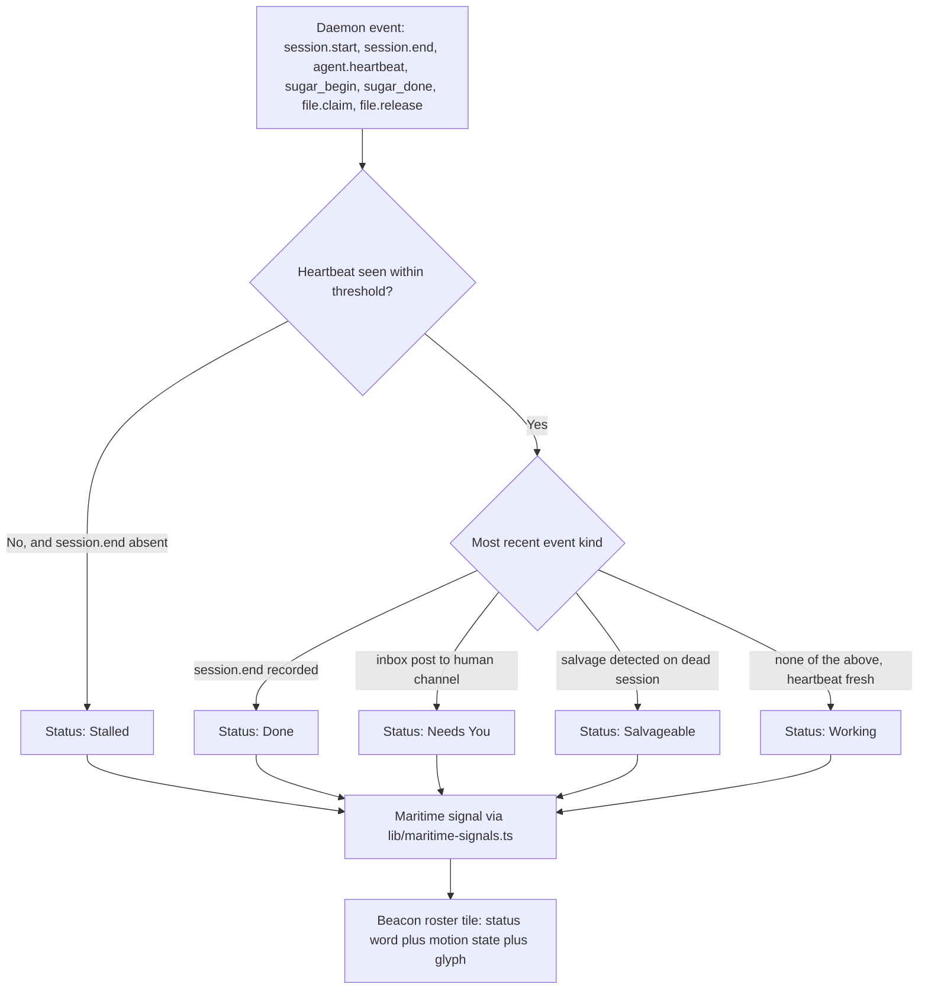

# Coding-Agent Desktop/Control-Plane UX, 2026 — Port Daddy Beacon Requirements

**Status:** Design proposal. Nothing below is shipped — every item is a **proposal**, cross-checked against what already exists in this repo.
**Author:** research-and-specify-mature-beacon-agent-ux sortie (2026-08-04/05)
**Scope:** Port Daddy's differentiated requirements grounded in the 2026 baseline established in `coding-agent-ux-2026-baseline.md`, derived from real substrate already in this repo, not invented vibes.
**Relates to:** roadmap item `first-class-agent-sessions-and-spawn-supervision-3-28`; `docs/design/operator-state-contract.md`; `docs/design/pheromone-vocabulary-v1.md`; `skills/international-code-of-signals/references/port-daddy-symbology.md`; `docs/strategy/harbor-editor-battle-plan.md`; ADR-0120 (`docs/adr/0120-rust-kernel-boundary.md`).

**A note on "Beacon."** This document uses "Beacon" as the working name for the mature coding-agent control-plane surface it specifies. Port Daddy already has two real, shipped surfaces that between them own this ground: **Fleet Control Center** (`apps/FleetBar/FleetBar`, ambient consent/status/re-entry) and **`pd-console`** (`core/pd-console`, the deep proof surface — the Harbor cooperative editor described in `docs/strategy/harbor-editor-battle-plan.md`). Per the architecture truth already recorded in this repo's `AGENTS.md` ("Architecture truths" section) and ADR-0120, Beacon is **not a proposal for a fourth rival shell** — it is the name for the increment of work that makes FleetBar and `pd-console` jointly satisfy everything below. Anywhere this doc says "Beacon should," read it as "FleetBar and/or `pd-console` should," never as "a new app should exist."

---

## 3. Port Daddy Differentiated Requirements

Each requirement below states (a) the gap in the competitive baseline it closes, (b) the real Port Daddy substrate it builds on — cited by file, not invented — and (c) what is explicitly **not yet built**.

### 3.1 One cross-harness durable roster

**Gap it closes**: every vendor's roster is single-tool. A Port Daddy operator running Claude Code, Codex, and Gemini CLI against the same repo today has three disconnected rosters and no shared "what is everyone doing" view.

**Existing substrate**: Port Daddy's daemon already tracks sessions across harnesses as first-class data — observed live during this research via the `swarm_awareness` MCP tool (`mcp/server.ts`, tool handler at the `swarm_awareness` case): each active session in this repo's own daemon carries an explicit `harness: { id, label, backend, model, confidence }` field alongside `identity`, `worktree`, and `activeSession`. This is not aspirational — it is the exact shape the roster in the baseline document's §2 needs, already present in `lib/active-agent-roster.ts` and surfaced by `cli/commands/agents.ts` and `routes/agent-cockpit.ts`.

**Requirement (proposed, not yet built)**: Beacon's roster view must render this cross-harness field set as first-class columns (harness label + backend/model, not just a generic "agent"), rather than assuming every row is a Claude Code session. No new backend data model is required — the roster is a rendering gap, not a data gap.

### 3.2 Lineage, accounting, and receipts

**Gap it closes**: only Devin's Session Insights and GitHub Copilot's premium-request accounting come close to per-session cost transparency, and neither ties cost to a durable, queryable receipt the way the `agentic-app-architecture` skill's "no side effect without an artifact-backed receipt" rule demands.

**Existing substrate**: `lib/cost-tracker.ts` and `lib/bonds.ts` already back the `budget` block in `docs/design/operator-state-contract.md`'s `/operator/state` contract (recent cost events, budget status, totals); session notes are immutable and durable per the Port Daddy MCP server's own tool description ("Notes are immutable — once written, they cannot be edited or deleted"); the PR-trailer discipline (`Roadmap-Item:` / `Roadmap-Spawns:`) already ties every merged change back to a roadmap slug.

**Requirement (proposed, not yet built)**: Beacon must render lineage as a first-class object — for any agent-authored change, show the session that made it, the roadmap item it's rented against, the cost events attributed to it, and the note trail, in one place — not scattered across `pd cost`, `pd roadmap`, and `pd notes` outputs the operator has to manually correlate.

### 3.3 Explicit Join / Follow / Open — not one overloaded "resume"

**Gap it closes**: nearly every competitor conflates three genuinely different operations under one verb. Claude Code's `-r` restores full history into the *same* interactive context (closest to "Join"). Devin's CLI→cloud handoff explicitly creates a **new** VM from packaged context — the vendor's own docs are careful to say this is not a reconnect (closest to neither Join nor Follow — it's closer to "fork"). GitHub Copilot's session-log viewer lets you watch without steering (closest to "Follow"). No vendor names these as three distinct, chooseable actions on the same roster row.

**Existing substrate**: the daemon already emits three separate, distinct URLs per agent in the `control` block returned by `swarm_awareness` and the active-agent roster — `steeringChannel` (`agent:${agent.id}`), `streamUrl` (`/agents/${id}/stream`), and `interruptUrl` (`/agents/${id}/interrupt`), plus a `controlCenterUrl` that deep-links into the Fleet Control Center's agent focus view — all defined in `lib/active-agent-roster.ts`.

**Requirement (proposed, not yet built)**: Beacon must expose exactly three verbs per roster row, mapped onto that existing field set, not a fourth invented word:
- **Join** — attach live and steer, via `steeringChannel`/`interruptUrl`. Requires the session still be running.
- **Follow** — read-only stream of the transcript, via `streamUrl`. Works on a running session; degrades gracefully to "replay" on a finished one.
- **Open** — jump to the destination artifact (the PR, the worktree, the touched file), via `controlCenterUrl` or a resolved file/PR link — not a chat surface at all.

No new session-control protocol needs to be invented; this requirement is entirely about giving three existing, already-distinct daemon capabilities three distinct, honest verbs in the UI instead of one ambiguous "Resume" button.

### 3.4 Status verbs derived from real event types, not invented adjectives

**Gap it closes**: the baseline document's §2.8 found that no competitor documents a real "stalled" state — everyone substitutes a fixed timeout. A status label that isn't backed by an actual event is exactly the failure mode the `runtime-verification-for-agents` skill's Arbiter pattern exists to catch: a monitor (or a UI) that reports state without checking it against ground truth risks the "Watchman crashes" anti-pattern — the display claims a status the underlying system was never actually asked to confirm.

**Existing substrate**: this repo's `AGENTS.md` already states the rule Beacon must inherit: "`session.start`, `session.end`, `session.note`, `file.claim`, `file.release`, and sugar begin/done events should stamp `agentId`, `targetId`, and `identityProject` so briefing/FleetBar/UI do not have to reverse-engineer scope from prose." The daemon's own sitrep output (observed live: `agent.heartbeat`, `sugar_done`, `session.end`, `sugar_begin`, `session.start`) is exactly this event stream.

**Requirement (proposed, not yet built)**: every status verb Beacon shows (Working, Needs You, Done, Stalled, Salvageable) must be a deterministic function of a named event or its absence (e.g., "Stalled" = no `agent.heartbeat` within N seconds while `session.end` has not fired — the same detection Port Daddy's Bosun heartbeat/reaper mechanism already performs for daemon supervision), never a client-side guess. If a status label can't cite the event(s) that produced it, it doesn't ship.

### 3.5 Restrained nautical microcopy — extend the registry, do not decorate

**Gap it closes**: none of the eight competitors use a themed vocabulary at all, so there's no "gap" to close here in the competitive sense — the risk is self-inflicted. Port Daddy already has a maritime signal layer, and the single most important rule for Beacon's copy is not to freelance around it.

**Existing substrate**: `lib/maritime-signals.ts` (`SIGNAL_FOR_STATE`), `lib/maritime.ts`, and `core/pd-console/src/maritime.rs` already implement an ICOS-audited state→flag mapping (`docs/design/operator-state-contract.md`'s `fleetSignal` derivation reuses it: `B`=burning-cash, `V`=conflict, `F`=awaiting-human, `J`=mayday/salvage, `P`=fleet-healthy, `M`=idle). `skills/international-code-of-signals/references/port-daddy-symbology.md` is a standing audit of this mapping against the actual 1969 Code (Pub. 102) and names the anti-pattern directly: "Decorative Nautical Theming — a flag means whatever the nearest tooltip says today, meanings drift per surface... Extend from the registry (`skills/international-code-of-signals/data/signals.json`), never from vibes."

**Requirement (proposed, not yet built)**: any new Beacon status word or icon that wants nautical flavor must first be checked against `skills/international-code-of-signals/data/signals.json` via the ICOS skill's own lookup tool (`skills/international-code-of-signals/scripts/icos_lookup.py`) before it ships, exactly as that skill's audit table already does for existing pd states. If no honest single-letter flag fits, use a two-letter General Code group (there are 645) rather than inventing a meaning for an unclaimed or historically-wrong letter (the skill's own example: `R` has no 1969 meaning and should never be glossed as "way is off my ship"). Where no restrained, corpus-backed option exists, Beacon uses plain English — restraint over vibes.

### 3.6 Shimmering/wave/wheel progress motion, with a reduced-motion equivalent

**Gap it closes**: the baseline document's §1 shows every vendor has *some* progress indication, but none of the primary docs researched describe a considered motion *language* tied to what the state actually means — most are generic spinners.

**Existing substrate**: `skills/build-coop-ide-gpui/SKILL.md` already commits `pd-console`'s Harbor surface to a bespoke motion system — it names `gpui-shaders` (the "living-harbor water" motif) and `rust-gpui-motion` (springs, not linear easing, "one motion owner per surface") as required siblings, and the pheromone vocabulary already assigns `⌛` (hourglass) to `urgency:overdue` and `⚓` to `salvage:pending` (`docs/design/pheromone-vocabulary-v1.md` §4.2) — real, shipped glyph-level precedent for a wheel/wave metaphor.

**Requirement (proposed, not yet built)**: three motion states, tied to the same event-backed statuses from §3.4, not to decoration:
- **Shimmer** (working/alive) — a gentle light-on-water ripple, reusing the `pd-console` water shader where the surface already exists; in FleetBar (SwiftUI, no shader pipeline), a slow, low-amplitude opacity pulse per the `native-app-designer` skill's spring-physics rule (never `.linear()`).
- **Wave** (background/async, not currently focused) — a horizontal traveling highlight, distinguishing "working elsewhere" from "working right here."
- **Wheel/hourglass** (blocked/waiting — needs-you, salvage-pending) — a slow rotation or the existing `⌛`/`⚓` glyphs, never animated faster than the urgency actually warrants (per `native-app-designer`'s "Animation Overload Syndrome" failure mode: max 2–3 simultaneously animating elements, no constant motion everywhere).
- **Reduced-motion equivalent, mandatory**: every one of the above degrades to a static color + glyph pairing (already defined per-kind in the pheromone catalog) with zero animation, gated on the OS-level reduced-motion preference — per `native-app-designer`'s quality gate ("reduced motion is supported for accessibility") and consistent with this repo's own house rule against shipping motion nobody can turn off.

### 3.7 A practical Beacon information architecture / window layout

**Gap it closes**: this is not a competitive gap (desktop layout isn't part of any vendor's public docs) — it is where an external applied lens from the `desktop-window-layout-architect` skill applies directly, and where the temptation to scaffold a brand-new shell (explicitly forbidden by ADR-0120 and by this repo's own "Architecture truths" section) is highest.

**Existing constraint**: `AGENTS.md` already states the target split — "`pd-console` is the deep proof surface, FleetBar is ambient consent/status/re-entry, Scout is evidence-backed intake, and CLI/MCP are automation adapters" — and forbids scaffolding another Rust UI/daemon without reconciling against ADR-0120 (`docs/adr/0120-rust-kernel-boundary.md`) first.

**Surface map (proposed)**, applying role-taxonomy patterns from the `desktop-window-layout-architect` skill:

| Role | Surface | Home |
|---|---|---|
| `navigation` | Cross-harness roster (§3.1), filterable by harness/status | FleetBar Control Center |
| `canvas` | Full transcript/tool-event stream for the Joined/Followed session | `pd-console` |
| `inspector` | Permissions, checkpoints, cost/lineage receipts (§3.2) for the selected session | Trailing pane in `pd-console`, per the "trailing inspector, not a mini document window" rule |
| `artifact` | Diff/checkpoint viewer, worktree/PR status | `pd-console`, opened via "Open" (§3.3) |
| `console` | Terminal/shell output for the session | `pd-console` |
| `utility` | Notifications, spend summary, ambient status | FleetBar popover |

**Geometry/placement (proposed)**: follow the skill's hard rules directly — the roster (navigation) and canvas (transcript) are field-first and get visual priority; the inspector is a trailing pane, never a floating mini-document window (explicitly named anti-pattern: "Inspector as a Mini Document Window"); percentages are decided only after minimum content sizes are set, never the reverse (anti-pattern: "Percentages First, Minimums Later"); wide/medium/narrow workspace presets are required, not a single fixed split.

**Compact wireframe (wide preset)**:

```
+-------------------------------------------------------------------+
| Beacon (FleetBar Control Center)              [project switcher]  |
+---------------------+---------------------------------------------+
| ROSTER (nav)         | TRANSCRIPT (canvas)                        |
| harness  status  age |  session-A  ~ shimmer ~  [Join] [Follow]   |
| Claude   Working  2m |  > tool call: Read lib/x.ts                |
| Codex    Needs-you 9m|  > tool call: Edit lib/x.ts                |
| Gemini   Done     1h |  ...streamed transcript...                 |
|                       +---------------------------------------------+
|                       | INSPECTOR (trailing pane)                  |
|                       |  permissions: acceptEdits                  |
|                       |  cost: $0.42 / roadmap: 3-28-...           |
|                       |  checkpoints: [rewind list]                |
+-----------------------+---------------------------------------------+
| UTILITY (bottom, non-blocking): notifications · spend · sitrep      |
+-------------------------------------------------------------------+
```

**Implementation moves (proposed, smallest-first)**: (1) add harness/backend columns to the existing roster render — a rendering change only, per §3.1; (2) wire the three §3.3 verbs to the existing `control` URLs — no new endpoints; (3) land the inspector as a trailing pane in `pd-console` per the Harbor build order already defined in `skills/build-coop-ide-gpui/references/04-build-order-and-composing-the-skills.md`; (4) motion (§3.6) lands last, after the data and layout are real, per that same skill's explicit warning against "building the editor before the coordination."

---

## 4. Anti-Patterns

Grounded in the assigned lenses plus the competitive gaps found in the baseline document's §2.8. Each is a concrete failure mode Beacon must actively avoid, not a generic principle.

- **Chat box with secret hands** (`agentic-app-architecture`). A roster row that shows a status word but hides the tool calls behind it is untrustable by construction. Every product in the baseline document's §2 that documents its transcript view treats tool calls as first-class; Beacon must not regress behind that baseline.
- **Transcript is the whole state** (`agentic-app-architecture`). Durable history, forkability, and episodic memory are separate design requirements from "the chat log is long." Beacon's roster (§3.1) and lineage view (§3.2) exist precisely because the transcript alone cannot answer "what did this session cost, and against what roadmap item."
- **Side effects with no gate, no isolation, no receipt** (`agentic-app-architecture`). Every worktree-isolated, PR-finish-lined change already satisfies isolation; §3.2's requirement closes the "no receipt" half specifically.
- **Decorative nautical theming** (`international-code-of-signals`). The single highest-risk anti-pattern for this specific project, because the temptation is self-inflicted, not competitive. See §3.5 — extend `skills/international-code-of-signals/data/signals.json`-backed meanings, never invent a flag's gloss.
- **Answering from flag-chart folklore** (`international-code-of-signals`). Any nautical term must be checked against the actual 1969 Code text, not "everyone assumes X means Y" (the skill's own example: `R` has no single-letter 1969 meaning).
- **Every problem gets another window** (`desktop-window-layout-architect`). Beacon must not spawn a new floating window per feature request (a fifth "Roster Window," a sixth "Cost Window"). Related work stays in panes inside the two real surfaces (§3.7).
- **Chrome is free** (`desktop-window-layout-architect`). No permanent bottom action bar stealing space from the transcript canvas; the canvas keeps visual priority over inspectors and utility panes.
- **Percentages first, minimums later** (`desktop-window-layout-architect`). Workspace presets (§3.7) are chosen by role priority and minimum content size, then expressed as percentages — never the reverse, which produces overlap on resize.
- **Inspector as a mini document window** (`desktop-window-layout-architect`). The permissions/cost/checkpoint inspector (§3.7) is a trailing pane with panel-lifecycle semantics, not a minimizable peer document window.
- **Generic Card Syndrome / Linear Animation Death / Rainbow Vomit / Animation Overload / Inconsistent Spacing Chaos** (`native-app-designer`). Beacon's roster rows must not become identical gray cards with `.linear()` transitions; the shimmer/wave/wheel motion language (§3.6) exists specifically to give each state a distinct, spring-based, restrained motion signature — max 2-3 animating elements, 3-4 colors, an 8pt grid.
- **The Watchman crashes / monitors that mutate state** (`runtime-verification-for-agents`). A status label is only as honest as the heartbeat check behind it (§3.4). If Beacon's own status-derivation logic dies silently, the roster must show "unknown," never silently keep showing the last good status as if it were current.
- **Checking everything synchronously** (`runtime-verification-for-agents` / `designing-data-intensive-applications`). The cross-harness roster (§3.1) is necessarily eventually consistent — harnesses push heartbeats asynchronously; Beacon must not add a synchronous cross-harness lock to "fix" this, since coordination is the enemy of scale, per the same lens. Read-your-writes matters only for the one thing a human just did (an approval click), not for the whole roster's staleness.
- **Dashboard theater** (`execution-transparency-dashboard`). Every panel in §3.7 must map to an operator question with a concrete next action (Join/Follow/Open, approve, resolve-and-clear) — no panel exists purely to look comprehensive. The existing `/operator/state` contract (`docs/design/operator-state-contract.md`) already models this discipline (`needsYou` items carry a stable `code` and a concrete `action`); Beacon inherits it rather than reinventing a weaker version.
- **Mixed horizons** (`execution-transparency-dashboard`). Live runtime truth (roster, transcript) and planned work (roadmap items, `cockpitMissions`) must stay visually distinct, exactly as `/operator/state`'s response shape already separates them into different top-level fields.
- **Hallucinated status summary** (`always-on-agent-applications`, "Hallucinated Memory Syndrome" adapted). Any auto-generated one-line session summary (the Claude Code agent-view pattern Beacon should adopt per the baseline document's §1) must cite the event(s) it summarizes; an ungrounded summary is the same failure mode as an agent claiming a memory it doesn't have.

---

## 5. Phased Acceptance Criteria

Phased per the `build-coop-ide-gpui` skill's own build-order discipline (buffer/coordination before polish; motion lands last) and scoped against the real roadmap item this work rents against, `first-class-agent-sessions-and-spawn-supervision-3-28` (currently `backlog`). None of these phases are built yet.

### Phase 0 — Render the roster that already exists
- [ ] FleetBar Control Center's roster view adds harness/backend/model columns sourced from the existing `lib/active-agent-roster.ts` payload — no new backend fields.
- [ ] Roster distinguishes sessions by `identityProject` and `worktreeId` so two Port Daddy checkouts never collide (per the existing "Current Gotchas" rule in `AGENTS.md` about duplicate fleet names).
- [ ] Acceptance: an operator running Claude Code + Codex against the same repo sees both in one list, correctly labeled, with zero new daemon endpoints.

### Phase 1 — Three honest verbs
- [ ] Join wired to `steeringChannel`/`interruptUrl`; disabled (not hidden) when the session has ended.
- [ ] Follow wired to `streamUrl`; works read-only on a running session and degrades to replay on a finished one.
- [ ] Open wired to `controlCenterUrl` or a resolved PR/file/worktree link, never opening a chat surface.
- [ ] Acceptance: no roster row exposes a single ambiguous "Resume" button; each of the three verbs is independently clickable and independently testable against the existing endpoints.

### Phase 2 — Status verbs and receipts
- [ ] Every status word shown is traced, in code, to the specific event(s) (or heartbeat absence) that produced it; a status with no traceable event is a bug, not a UI choice.
- [ ] Lineage panel (§3.2) shows session → roadmap item → cost events → note trail for any selected row, reusing `lib/cost-tracker.ts`, `lib/bonds.ts`, and the roadmap-item linkage already required by the PR trailer convention.
- [ ] Any new nautical term or glyph is checked against `skills/international-code-of-signals/data/signals.json` via `skills/international-code-of-signals/scripts/icos_lookup.py` before merge; the PR description names the check.
- [ ] Acceptance: a reviewer can point at any status label on screen and be shown the exact event log line that produced it.

### Phase 3 — Motion, with reduced-motion parity required before ship
- [ ] Shimmer/wave/wheel states land in `pd-console` (via the `gpui-shaders`/`rust-gpui-motion` siblings named in `skills/build-coop-ide-gpui/SKILL.md`) and in FleetBar (SwiftUI springs, no `.linear()`).
- [ ] A reduced-motion static equivalent (color + existing pheromone glyph, zero animation) ships in the **same PR** as any new motion, not as a follow-up — no motion-only PR is acceptance-complete without its static counterpart.
- [ ] Acceptance: toggling the OS reduced-motion preference removes all animation from Beacon with no loss of information (every state distinguishable by color/glyph alone).

### Phase 4 — Workspace presets, not a fourth shell
- [ ] Wide/medium/narrow presets defined per §3.7's surface map, implemented as increments to FleetBar and `pd-console` only.
- [ ] A reconciliation note against ADR-0120 (`docs/adr/0120-rust-kernel-boundary.md`) is required in the PR description for any change that touches `pd-console`'s window/pane structure, confirming no new Rust UI shell was introduced.
- [ ] Acceptance: at 1280×720, 1440×900, and a high-density laptop resolution, no pane overlaps after minimum sizes apply, and the transcript canvas retains visual priority over the inspector at every width.

---

## 6. Status-Verb Derivation Flow

The one diagram that matters for this doc: how a real event becomes a Beacon status word, keeping §3.4's rule enforceable.



No status reaches the roster tile without passing through a named daemon event first — the diagram is the enforcement mechanism for §3.4, not decoration.

---

**Roadmap-Item:** first-class-agent-sessions-and-spawn-supervision-3-28
