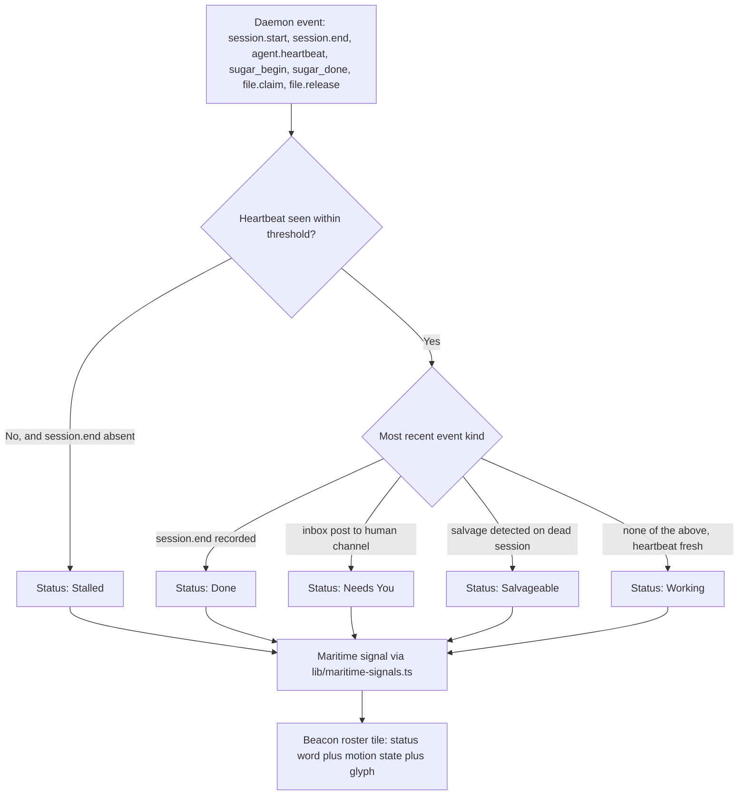

# Coding-Agent Desktop/Control-Plane UX, 2026 — Baseline, Evidence, and the Port Daddy Twist

**Status:** Design doc / product research. Nothing in the "Port Daddy Differentiated Requirements" section below is shipped — every item there is a **proposal**, cross-checked against what already exists in this repo.
**Author:** research-and-specify-mature-beacon-agent-ux sortie (2026-08-04/05)
**Scope:** What a mature 2026 coding-agent desktop/control-plane surface is expected to do, sourced from primary vendor documentation only, plus the specific things Port Daddy's proposed **Beacon** surface should do differently — grounded in code and docs that exist in this repo today, not in vibes.
**Relates to:** roadmap item `first-class-agent-sessions-and-spawn-supervision-3-28`; `docs/design/operator-state-contract.md`; `docs/design/pheromone-vocabulary-v1.md`; `skills/international-code-of-signals/references/port-daddy-symbology.md`; `docs/strategy/harbor-editor-battle-plan.md`.

**A note on "Beacon."** This document uses "Beacon" as the working name for the mature coding-agent control-plane surface it specifies. Port Daddy already has two real, shipped surfaces that between them own this ground: **Fleet Control Center** (`apps/FleetBar/FleetBar`, ambient consent/status/re-entry) and **`pd-console`** (`core/pd-console`, the deep proof surface — the Harbor cooperative editor described in `docs/strategy/harbor-editor-battle-plan.md`). Per the architecture truth already recorded in this repo's `AGENTS.md` ("Architecture truths" section) and ADR-0120 (`docs/adr/0120-rust-kernel-boundary.md`), Beacon is **not a proposal for a fourth rival shell** — it is the name for the increment of work that makes FleetBar and `pd-console` jointly satisfy everything below. Anywhere this doc says "Beacon should," read it as "FleetBar and/or `pd-console` should," never as "a new app should exist."

---

## TL;DR

By August 2026, every serious coding-agent product (Claude Code, GitHub Copilot coding agent, Cursor, OpenAI Codex, Windsurf/Devin, Google Gemini CLI/Antigravity, Amazon Q Developer/Kiro) has converged on the same eight or nine table-stakes UX primitives: a session roster with live status, a full inspectable tool-call transcript, deterministic session resume by ID, checkpoint/rewind with diff preview, a tiered permission model with an explicit "no-prompts" escape hatch, an OS-level or VM-level execution sandbox, MCP support, and a rules/skills file convention. Almost none of them do three things well: **cross-tool session unification** (every vendor's roster only shows its own sessions), **an explicit distinction between attaching to a live session vs. reading its history vs. jumping to its output artifact** (most conflate "resume" with all three), and **accessibility** (only Claude Code and GitHub Copilot/VS Code publish real accessibility documentation; nobody else does). Port Daddy already has unique substrate — a cross-harness advisory-claim daemon, an ICOS-audited status-signal registry (`lib/maritime-signals.ts`), and a durable session/note ledger — that lets Beacon do all three, without inventing a new execution model.

---

## 1. Baseline Table — What "Mature" Means in 2026

Each row states the pattern that is now common across most-or-all of the eight researched products, and the notable variance. Full per-product citations are in §2.

| Dimension | 2026 baseline pattern | Notable variance / gap |
|---|---|---|
| Session roster | A dedicated panel/window lists concurrent sessions with a status taxonomy (running/needs-input/done/error at minimum) and a one-line auto-generated summary. Claude Code's agent view (`Pinned / Ready for review / Needs input / Working / Completed`) and Antigravity's Agent Manager Panel are the most structured examples. | No vendor's roster spans more than its own tool. Cursor's Agents Window does not document its row schema at all. |
| Full transcripts / tool events | Tool calls are shown as first-class UI elements, not buried in prose — Copilot's "internal monologue," Cursor's unlimited tool-call log, Devin's screenshot-annotated Computer Use trace. | Whether tool calls render inline vs. collapsed is frequently undocumented (Copilot, Cursor). |
| Exact continuation/join | Deterministic resume-by-session-ID is now standard: `claude -r <id>`, `codex exec resume <id>`, `gemini --resume <UUID>`, Devin's `resumeSession(sessionId)`. | Devin's cloud product is the outlier: CLI→cloud "handoff" packages context into a **new** VM, it does not reconnect to an old one — resume and handoff are different operations wearing the same word. |
| Checkpoints/diffs | An automatic, timeline-scrubbable checkpoint system distinct from git is now expected (Claude Code `/rewind`, Cursor Checkpoints, Antigravity `/rewind`/`/diff`, Gemini CLI `/restore`). | Codex has no confirmed automatic rewind (best-practice guidance is "make your own git checkpoints"); Devin cloud has PR-level diff review, not a session rewind. |
| Permissions/approvals | A 3-to-5-tier model is now universal: read-only → auto-edit-in-workspace → classifier/reviewer-mediated → no-prompts ("YOLO"/"Bypass"/"Full-access"), plus a growing "smart"/"auto-review" tier where a second model judges risk instead of a static allow/deny list. | Naming is completely unstandardized (`bypassPermissions`, `Run Everything`, `--dangerously-bypass-approvals-and-sandbox`, `Bypass`, `Full-access`) — every vendor reinvented the same five states with different words and no shared vocabulary. |
| Sandboxes | OS-level sandboxing (macOS Seatbelt, Linux bubblewrap/Landlock/nsjail, Windows AppContainer/WSL2) is now the local-execution default across Claude Code, Cursor, Codex, Devin/Windsurf, and Antigravity. | Windows support is uniformly the weakest tier (Copilot's local sandbox cannot block individual paths on Windows at all; Devin's sandbox doesn't support Windows). |
| MCP/connectors | MCP is now the universal connector protocol — every product researched supports it, at minimum via stdio + one HTTP-based transport, with per-server or per-tool approval gating. | Scope/precedence conventions vary (project vs. user vs. org config file location) and some products (Copilot cloud agent) explicitly don't support MCP *resources* or *prompts*, only tools. |
| Skills/rules | An `AGENTS.md`-family convention plus a `SKILL.md`-family packaging convention (frontmatter + progressive disclosure) is converging across Cursor, Codex, Devin/Windsurf, Antigravity, and (via Claude Code's own skills) Anthropic. | GitHub Copilot's instructions system (`copilot-instructions.md` / `*.instructions.md`) predates and sits parallel to, rather than merges with, the `AGENTS.md`/`SKILL.md` convention, though it now also reads `AGENTS.md`. |
| Hotkeys/command palette | Mode-cycling on one key (`Shift+Tab` in Claude Code, Cursor, and Devin CLI — a genuine three-way convergence) plus a dedicated multi-session switcher (Ctrl+Tab-family) is now standard. | Accessibility-specific keybindings (toggle "thinking" content, announce question N of M) exist only in VS Code 1.110+. |
| Caches/context | Automatic compaction/summarization triggered by a token-percentage threshold, plus a manual `/compact`-family command, is now universal. | Exact context-window sizes and cache-hit accounting are rarely documented precisely; only Copilot publishes a hard number (1M tokens) and Codex documents a server-side `compact_threshold`. |
| Background tasks/subagents | Parent-delegates-to-child subagent execution (own context, own tool budget, summarized return) is now common — Claude Code, Cursor, Codex, and Devin all document it with near-identical shapes (foreground blocks parent, background notifies on completion). | Depth/nesting limits are inconsistently documented; GitHub Copilot's docs describe parallelism only as independent top-level sessions, with no nested-subagent primitive found. |
| Notifications | OS-native notification + terminal-bell fallback is standard for CLIs (Codex's OSC9/BEL, Gemini CLI's OSC9/BEL, Claude Code's `Notification` hook); desktop apps add sound + badge + mobile push. | Precise behavior ("what exactly triggers a push") is often under-specified even in primary docs. |
| Terminal/browser/Chromium | A first-class, agent-driven browser tool is now standard, not a novelty — Copilot ships Playwright MCP by default, Cursor and Antigravity both gate a browser pane behind approval, Codex has both a shared browser pane and OS-level Computer Use. | Devin is the only product confirmed to expose a **real, non-headless** browser instance reachable over CDP (port 29229) that a human's own tools (e.g. Playwright) can attach to — everyone else is silent on headless-vs-real. |
| Remote/cloud execution | A distinct cloud/VM execution mode, separate from local, is now table stakes — every product except Amazon Q Developer/Kiro (unclear) documents one. | Session time limits vary by an order of magnitude: GitHub Copilot cloud agent hard-caps at 59 minutes with no override; Devin sessions are architected to run indefinitely on a dedicated VM. |
| Spend/usage | An in-product usage view is now standard, but per-session/per-task dollar cost (as opposed to aggregate plan usage) is the least-documented sub-dimension across every vendor researched. | Billing models are converging on token-based pricing (GitHub's PRU→"AI Credits" move, OpenAI's April-2026 token-aligned Codex pricing) away from flat per-message/per-session pricing. |
| Liveness/stall/unknown | A coarse status enum (running/finished/error, sometimes +blocked/expired) is universal at the API level. | A genuinely distinct, *documented* "stalled" state (as opposed to "still running, just slow") was **not found** in primary docs for any product except Port Daddy's own prior art (see §3.3) — every vendor instead documents a fixed timeout (Copilot: 1 hour) as the de facto stall detector. |
| Recovery | Session state persisting to disk/DB so a crash doesn't lose history is universal. | An explicit, named "what happens after a crash" contract is the single most under-documented dimension across every vendor — every product's coverage here is inferred from adjacent features (resume-by-ID, VM persistence), not a dedicated doc. |
| Worktree/branch/PR status | Per-task git isolation (worktree or dedicated branch) plus an agent-authored PR with live status is now universal for the products with cloud/background execution. | Devin's Stacked PRs feature (dependent PR chains with per-layer CI and auto-retargeting) is the most sophisticated documented PR-lifecycle feature found anywhere in this research. |
| Accessibility | **Not yet a baseline.** Only two of eight product families (Claude Code; GitHub Copilot's VS Code surface) publish dedicated accessibility documentation (screen-reader mode, reduced motion, a VPAT/WCAG conformance report). | Six of eight (Cursor, Codex, Windsurf/Devin, Google, Amazon Q/Kiro) have **no accessibility documentation found at all** in primary sources. This is the single largest, most consistent gap in the entire competitive set. |

---

## 2. Verified External Evidence

Collected 2026-08-04/05 by parallel research passes restricted to vendor-owned primary documentation (official `docs.*`/`developers.*`/`help.*` domains, official changelogs, and official blog announcements). Community forums, comparison articles, and third-party blogs were explicitly excluded as evidence even where they surfaced in search. Every claim below is attributed to the specific product and dimension it was verified against; where a primary doc could not be found, that is stated rather than inferred.

### 2.1 Claude Code (Anthropic)

- **Session roster**: agent view groups sessions into `Pinned / Ready for review / Needs input / Working / Completed`, with an animated icon per state, a Haiku-generated one-line summary refreshed every 15s, session age, and a colored PR badge. (Source: https://code.claude.com/docs/en/agent-view)
- **Continuation/join**: `claude -c` continues the most recent session; `claude -r "<session-id>"` resumes a specific ID with full history; Remote Control lets a signed-in user attach to a local session from another device. (Source: https://code.claude.com/docs/en/sessions; https://code.claude.com/docs/en/remote-control)
- **Checkpoints/diffs**: `/rewind` lists every prompt in the session with four restore options; up to 100 checkpoints retained per session, 30-day cleanup by default. (Source: https://code.claude.com/docs/en/checkpointing)
- **Permissions**: six modes (`default`, `acceptEdits`, `plan`, `auto` — a separate classifier model reviews every action against a block/allow list, `dontAsk`, `bypassPermissions`); deny-over-ask-over-allow evaluation order. (Source: https://code.claude.com/docs/en/permission-modes)
- **Sandboxes**: Linux bubblewrap / macOS Seatbelt for the Bash tool; network isolation via a unix-socket-routed proxy with domain allowlisting; a separate managed-VM sandbox for Claude Code on the web with scoped git credentials and audit logging. (Source: https://code.claude.com/docs/en/sandboxing; https://code.claude.com/docs/en/sandbox-environments)
- **Background/subagents**: subagents run in the background by default; `/tasks` lists them; `CLAUDE_CODE_DISABLE_BACKGROUND_TASKS=1` opts out. (Source: https://code.claude.com/docs/en/sub-agents)
- **Liveness states**: agent-view icon shape distinguishes alive/responsive vs. exited-but-resumable vs. `/loop` sleeping-with-countdown; a 20-second no-data threshold surfaces an explicit "waiting for API response" state before any retry. (Source: https://code.claude.com/docs/en/agent-view)
- **Worktrees**: `--worktree`/`-w` creates an isolated worktree + branch per session, including branching from a specific PR number; end-of-session prompt to keep or remove. (Source: https://code.claude.com/docs/en/worktrees)
- **Accessibility**: opt-in screen-reader mode (`claude --ax-screen-reader`) replaces the visual terminal with linear text read by VoiceOver/NVDA; documented settings for reduced motion and colorblind-friendly themes. (Source: https://code.claude.com/docs/en/accessibility)

### 2.2 GitHub Copilot (coding agent + VS Code agent mode)

- **Session roster**: an "Agents panel" on GitHub.com lists sessions with progress and token usage; VS Code adds a dedicated Agents window with next/prev chat navigation. Exact panel column/badge schema was **not found** in primary docs. (Source: https://docs.github.com/en/copilot/how-tos/copilot-on-github/use-copilot-agents/manage-and-track-agents; https://code.visualstudio.com/docs/agents/agents-window)
- **Sandboxes**: local sandbox (public preview) uses Seatbelt/bubblewrap/Windows ProcessContainer with independently configurable filesystem/network scopes; cloud sandbox is a fully isolated, ephemeral Linux environment on Azure Container Apps Sandboxes, pausable/resumable across devices. (Source: https://docs.github.com/en/copilot/concepts/about-cloud-and-local-sandboxes)
- **MCP**: repo-level JSON config; GitHub MCP server and a Playwright MCP server ship by default; the cloud agent explicitly does not support MCP resources or prompts, tools only. (Source: https://docs.github.com/en/copilot/how-tos/copilot-on-github/customize-copilot/configure-mcp-servers)
- **Browser tool**: the coding agent "has its own web browser" via a built-in Playwright MCP server for reading, interacting, and screenshotting pages during a session. (Source: https://github.blog/changelog/2025-07-02-copilot-coding-agent-now-has-its-own-web-browser/)
- **Remote execution limit**: cloud agent sessions run in a GitHub-Actions-powered ephemeral environment with a hard **59-minute** cap, "cannot be extended or bypassed." (Source: https://docs.github.com/en/copilot/concepts/agents/cloud-agent/about-cloud-agent)
- **Liveness/stall**: "Copilot can appear to be stuck for a while, and then get moving again... if the session remains stuck, it will time out after an hour" — no documented visual taxonomy beyond this fixed timeout. (Source: https://docs.github.com/en/copilot/how-tos/use-copilot-agents/coding-agent/troubleshoot-coding-agent)
- **Worktree/PR status**: automatic branch + draft `[WIP]` PR on assignment, task-descriptive branch names, regular PR-body status updates, human approval required before CI/CD runs on agent-authored PRs. (Source: https://docs.github.com/en/copilot/how-tos/use-copilot-agents/cloud-agent/use-cloud-agent-on-github)
- **Accessibility**: formal WCAG 2.2 / VPAT 2.5 conformance reports published per surface (VS Code, CLI, IntelliJ, Vim/Neovim, Enterprise); VS Code 1.110 added a screen-reader-accessible "thinking content" toggle and an accessible chat-question carousel. (Source: https://accessibility.github.com/conformance/github-copilot/; https://code.visualstudio.com/updates/v1_110)

### 2.3 Cursor

- **Cloud agents**: managed centrally at cursor.com/agents; API exposes machine-checkable status (`RUNNING`, `FINISHED`, `ERROR`, `CREATING`, `EXPIRED`). (Source: https://cursor.com/docs/cloud-agent; https://cursor.com/docs/background-agent/api/overview)
- **Checkpoints**: automatic pre-significant-change snapshots, timeline-scrubbable, explicitly **not** git — "use Git for permanent version control." (Source: https://docs.cursor.com/agent/chat/checkpoints)
- **Permissions**: three Run Modes — Auto-review (allowlist + sandbox + a classifier for the rest), Allowlist, Run Everything — plus standing guardrails (Browser Protection, File-Deletion Protection, External-File Protection) that apply regardless of mode. (Source: https://cursor.com/docs/agent/security/run-modes)
- **Sandboxes**: macOS Seatbelt, Linux Landlock+seccomp, Windows via a WSL2-hosted Linux sandbox; vendor's own A/B claim: "sandboxed agents stop 40% less often than unsandboxed ones." (Source: https://cursor.com/blog/agent-sandboxing)
- **Subagents**: three built-ins (`explore`, `bash`, `browser`); explicit cost-linearity warning — "five subagents in parallel uses roughly five times the tokens." (Source: https://cursor.com/docs/subagents)
- **Worktrees**: local agent tasks get isolated worktrees; post-task options to keep working, commit, PR, or merge back. (Source: https://cursor.com/docs/configuration/worktrees)
- **Accessibility**: **not found** in primary docs — no dedicated accessibility page exists on cursor.com/docs.

### 2.4 OpenAI Codex (CLI + cloud/app)

- **Session roster**: cloud/ChatGPT task list shows repo/branch, and status badges `Merged` / `Closed` / `Archive` with diff stats. (Source: https://learn.chatgpt.com/docs/cloud)
- **Continuation/join**: `--resume`/`-r` picker vs. `--continue`/`-l` most-recent; `codex exec resume <session-id>` for scripted resume by ID. (Source: developers.openai.com Codex CLI reference)
- **Checkpoints**: no confirmed built-in automatic rewind; documented best practice is "create Git checkpoints before and after a task." A native rewind feature exists only as open GitHub issues on `openai/codex`, not as documented shipped behavior — treated here as **unconfirmed**. (Source: https://learn.chatgpt.com/docs/codex/cli)
- **Permissions**: `Auto` / `Read-only` / `Never` (CI) / `Untrusted` / `Full-access` (`--dangerously-bypass-approvals-and-sandbox`, "should only be used inside an externally hardened environment"), plus an "Auto-review" reviewer-agent mode. (Source: https://learn.chatgpt.com/docs/agent-approvals-security)
- **Sandboxes**: macOS Seatbelt out of the box; Linux/WSL2 bubblewrap; write access restricted to cwd + temp; network off by default with domain-allowlist proxy. (Source: https://learn.chatgpt.com/docs/sandboxing)
- **Subagents**: three delegation modes — direct request, proactive ("Ultra intelligence" tier), instruction-based; subagent threads inspectable via `/agent`. (Source: https://learn.chatgpt.com/docs/agent-configuration/subagents)
- **Browser/Computer Use**: "Computer Use" operates the built-in browser and other app windows but explicitly cannot automate terminal apps or ChatGPT itself, "since automating them could bypass ChatGPT security policies." (Source: https://developers.openai.com/codex/app/computer-use)
- **Worktrees**: chats default to a Codex-managed, disposable worktree, sticky per chat. (Source: https://learn.chatgpt.com/docs/environments/git-worktrees)
- **Accessibility**: only an OS *permission* grant (Accessibility, for Computer Use) was found — no assistive-technology documentation exists.

### 2.5 Windsurf (Cascade / Devin Local) and Devin (Cognition)

Cognition now owns Windsurf and has merged the documentation entirely — every `docs.windsurf.com` page 307-redirects to `docs.devin.ai`. Three distinct agent surfaces share one doc site: legacy Cascade, the newer "Devin Local" CLI harness (Cascade's documented successor), and cloud Devin. (Source: redirect observed fetching `https://docs.windsurf.com/windsurf/cascade/cascade.md` → `https://docs.devin.ai/desktop/cascade/cascade`)

- **Session roster**: Agent Command Center is a Kanban board — columns by status, running sessions rendered "greyed out and read-only" while in flight. (Source: https://docs.devin.ai/desktop/agent-command-center)
- **Checkpoints**: named, navigable checkpoints in Cascade; a redesigned Changes tab (word-level diff highlighting, persistent file-tree sidebar) shipped July 29–31, 2026 per the product changelog. (Source: https://docs.devin.ai/desktop/cascade/cascade; https://docs.devin.ai/release-notes/2026)
- **Permissions**: terminal auto-execution has four levels (Disabled / Allowlist Only / Auto / Turbo); Devin Local separately uses a Deny→Ask→Allow rule model over files/commands/fetches/MCP tools. (Source: https://docs.devin.ai/desktop/terminal; https://docs.devin.ai/desktop/devin-local)
- **Sandboxes**: Devin Local's OS-level sandbox derives writable paths from permission scopes and filters network via a loopback proxy; **documented limits**: network filtering "currently unstable," Windows OS-level sandboxing "not currently supported." (Source: https://docs.devin.ai/cli/sandbox)
- **Subagents**: spawn in foreground (blocks parent) or background (parent continues, notified on completion); subagent panel shows profile/title/status/elapsed-time/tool-call-count. (Source: https://docs.devin.ai/cli/subagents)
- **Notifications**: a unified `devin.agentNotifications` setting posts one native OS notification across Cascade, Devin Local, and ACP agents uniformly. (Source: https://docs.devin.ai/desktop/changelog)
- **Browser/Computer Use**: Devin's Computer Use drives a **real, non-headless Chrome instance** reachable over CDP on port 29229 — "cookies, localStorage, auth tokens — persist," and external tools like Playwright can attach to the live browser session. Fixed 1024×768 resolution; macOS unsupported. (Source: https://docs.devin.ai/work-with-devin/computer-use)
- **Spend/usage**: moved from credits to a daily+weekly token quota system (March 2026); a "Session Insights" view surfaces ACU usage, message count, a composite XS–XL session size, and an auto-classified task category per completed session. (Source: https://docs.devin.ai/desktop/accounts/quota; https://docs.devin.ai/product-guides/session-insights)
- **Liveness**: API `status_enum` — `working | blocked | expired | finished | suspend_requested | suspend_requested_frontend | resume_requested | resume_requested_frontend | resumed` — the most granular documented state machine found across all products researched. (Source: https://docs.devin.ai/api-reference/v1/sessions/retrieve-details-about-an-existing-session)
- **Worktree/branch/PR**: **Stacked PRs** — dependent PR chains where "every PR shows only its own change — nothing bleeds in from the layers above or below," Devin watches CI per layer and GitHub auto-retargets remaining PRs as lower ones merge. (Source: https://docs.devin.ai/work-with-devin/stacked-prs)
- **Accessibility**: **not found** in primary docs for either Cascade/Devin Local or cloud Devin.

### 2.6 Google (Gemini CLI + Antigravity)

- **Session roster**: `gemini --list-sessions` / `/resume` for the CLI; Antigravity's Agent Manager Panel (`/agents`) groups subagents under an expandable header with a green dot marking the active agent. (Source: https://github.com/google-gemini/gemini-cli/blob/main/docs/cli/session-management.md; https://antigravity.google/docs/cli/commands/agents)
- **Checkpoints/diffs**: Gemini CLI checkpoints into a shadow git repo (disabled by default); Antigravity's `/diff` opens a full-screen Interactive Diff Viewer with VCS/Turn/Commit modes and inline steering comments. (Source: https://github.com/google-gemini/gemini-cli/blob/main/docs/cli/checkpointing.md; https://antigravity.google/docs/cli/commands/diff)
- **Permissions**: Gemini CLI's `--approval-mode` (`default|auto_edit|yolo|plan`, `Shift+Tab` cycles live); Antigravity's unified Deny/Ask/Allow engine scoped per action category (`read_file`, `write_file`, `command`, `mcp`, etc.). (Source: https://github.com/google-gemini/gemini-cli/blob/main/docs/cli/cli-reference.md; https://antigravity.google/docs/permissions)
- **Sandboxes**: Gemini CLI supports Seatbelt, Docker/Podman, Windows ICACLS, and opt-in gVisor; Antigravity has a separate opt-in Terminal Sandbox (`nsjail`/`sandbox-exec`/`AppContainer`), default off. (Source: https://github.com/google-gemini/gemini-cli/blob/main/docs/cli/sandbox.md; https://antigravity.google/docs/cli/sandbox)
- **Background/subagents**: Antigravity subagents can themselves spawn nested child agents; `/agents` shows explicit `running`/`done`/`killed`/`error` states. (Source: https://antigravity.google/docs/cli/subagents)
- **Worktrees**: Antigravity Projects support a "New Worktree Mode" provisioning an isolated worktree per agent session specifically to avoid cross-agent conflicts. (Source: https://antigravity.google/docs/projects)
- **Accessibility**: Gemini CLI ships a `--screen-reader` flag and ARIA-style props for extension authors, though multiple open upstream issues report the support is incomplete. (Source: https://github.com/google-gemini/gemini-cli/blob/main/docs/cli/cli-reference.md)

### 2.7 Amazon Q Developer / Kiro

**Critical finding**: as of this research, AWS's own docs state the Amazon Q Developer CLI **has been rebranded to Kiro** — "The Q CLI has become the Kiro CLI" — and most `command-line-*.html` detail pages under `qdeveloper-ug` now redirect to the guide root. (Source: https://docs.aws.amazon.com/amazonq/latest/qdeveloper-ug/command-line.html) Claims below are split accordingly between the still-live Amazon Q Developer IDE docs and Kiro's own docs (kiro.dev), labeled separately.

- **IDE chat history**: per-workspace, searchable conversation list; not ID-addressable per the primary docs found. (Source: https://docs.aws.amazon.com/amazonq/latest/qdeveloper-ug/ide-chat-conversation.html)
- **Kiro CLI resume**: `--resume` (most recent), `--resume-picker` (interactive), `--resume-id <ID>` (deterministic). (Source: https://kiro.dev/docs/reference/cli-commands/)
- **MCP**: global CLI config at `~/.aws/amazonq/cli-agents`; servers load in the background, `/tools` shows per-server load progress. (Source: https://docs.aws.amazon.com/amazonq/latest/qdeveloper-ug/qdev-mcp.html)
- **Skills/rules**: not found under the live Amazon Q Developer tree; Kiro documents "Steering" markdown files (`product.md`/`tech.md`/`structure.md`), Agent Skills, Custom Agents, and file/pattern-triggered Hooks. (Source: https://kiro.dev/docs/steering/; https://kiro.dev/docs/cli/skills/)
- **Permissions**: Kiro CLI 3.0 replaced blanket `--trust-all-tools` flags with a structured `permissions.yaml` policy, with docs explicitly warning against blanket trust in production. (Source: https://kiro.dev/docs/cli/v3/permissions/)
- **Sandbox/terminal/browser/accessibility/liveness-taxonomy/recovery/worktree-PR-status**: **not found** in any primary doc for either Amazon Q Developer or Kiro at the pages reachable during this research.

### 2.8 Dimensions with weak-to-no primary coverage, across the whole competitive set

- **Accessibility**: real coverage in only 2 of 8 product families (Claude Code; GitHub Copilot/VS Code). Everyone else: nothing, or an OS permission grant mistaken for one.
- **Post-crash/disconnect recovery as a named, dedicated contract**: no vendor publishes one. Every product's "recovery" story is inferred from adjacent features (resume-by-ID, VM persistence, subagent-survives-reload changelog entries).
- **A documented "stalled" state distinct from "still running, just slow"**: not found for any product. Every vendor's answer is a fixed timeout (Copilot: 1 hour) rather than a diagnosed state.
- **Per-session/per-task granular dollar cost in the primary UI** (as opposed to aggregate plan/budget usage): not confirmed for any product at the pages fetched.

---

## 3. Port Daddy Differentiated Requirements

Each requirement below states (a) the gap in the competitive baseline it closes, (b) the real Port Daddy substrate it builds on — cited by file, not invented — and (c) what is explicitly **not yet built**.

### 3.1 One cross-harness durable roster

**Gap it closes**: every vendor's roster is single-tool. A Port Daddy operator running Claude Code, Codex, and Gemini CLI against the same repo today has three disconnected rosters and no shared "what is everyone doing" view.

**Existing substrate**: Port Daddy's daemon already tracks sessions across harnesses as first-class data — observed live during this research via the `swarm_awareness` MCP tool (`mcp/server.ts`, tool handler at the `swarm_awareness` case): each active session in this repo's own daemon carries an explicit `harness: { id, label, backend, model, confidence }` field alongside `identity`, `worktree`, and `activeSession`. This is not aspirational — it is the exact shape the roster in §2's baseline table needs, already present in `lib/active-agent-roster.ts` and surfaced by `cli/commands/agents.ts` and `routes/agent-cockpit.ts`.

**Requirement (proposed, not yet built)**: Beacon's roster view must render this cross-harness field set as first-class columns (harness label + backend/model, not just a generic "agent"), rather than assuming every row is a Claude Code session. No new backend data model is required — the roster is a rendering gap, not a data gap.

### 3.2 Lineage, accounting, and receipts

**Gap it closes**: only Devin's Session Insights and GitHub Copilot's premium-request accounting come close to per-session cost transparency, and neither ties cost to a durable, queryable receipt the way the `agentic-app-architecture` skill's "no side effect without an artifact-backed receipt" rule demands.

**Existing substrate**: `lib/cost-tracker.ts` and `lib/bonds.ts` already back the `budget` block in `docs/design/operator-state-contract.md`'s `/operator/state` contract (recent cost events, budget status, totals); session notes are immutable and durable per the Port Daddy MCP server's own tool description ("Notes are immutable — once written, they cannot be edited or deleted"); the PR-trailer discipline (`Roadmap-Item:` / `Roadmap-Spawns:`) already ties every merged change back to a roadmap slug.

**Requirement (proposed, not yet built)**: Beacon must render lineage as a first-class object — for any agent-authored change, show the session that made it, the roadmap item it's rented against, the cost events attributed to it, and the note trail, in one place — not scattered across `pd cost`, `pd roadmap`, and `pd notes` outputs the operator has to manually correlate.

### 3.3 Explicit Join / Follow / Open — not one overloaded "resume"

**Gap it closes**: nearly every competitor conflates three genuinely different operations under one verb. Claude Code's `-r` restores full history into the *same* interactive context (closest to "Join"). Devin's CLI→cloud handoff explicitly creates a **new** VM from packaged context — the vendor's own docs are careful to say this is not a reconnect (closest to neither Join nor Follow — it's closer to "fork"). GitHub Copilot's session-log viewer lets you watch without steering (closest to "Follow"). No vendor names these as three distinct, chooseable actions on the same roster row.

**Existing substrate**: the daemon already emits three separate, distinct URLs per agent in the `control` block returned by `swarm_awareness` and the active-agent roster — `steeringChannel` (`agent:${agent.id}`), `streamUrl` (`/agents/${id}/stream`), and `interruptUrl` (`/agents/${id}/interrupt`), plus a `controlCenterUrl` that deep-links into the Fleet Control Center's agent focus view — all defined in `lib/active-agent-roster.ts`.

**Requirement (proposed, not yet built)**: Beacon must expose exactly three verbs per roster row, mapped onto that existing field set, not a fourth invented word:
- **Join** — attach live and steer, via `steeringChannel`/`interruptUrl`. Requires the session still be running.
- **Follow** — read-only stream of the transcript, via `streamUrl`. Works on a running session; degrades gracefully to "replay" on a finished one.
- **Open** — jump to the destination artifact (the PR, the worktree, the touched file), via `controlCenterUrl` or a resolved file/PR link — not a chat surface at all.

No new session-control protocol needs to be invented; this requirement is entirely about giving three existing, already-distinct daemon capabilities three distinct, honest verbs in the UI instead of one ambiguous "Resume" button.

### 3.4 Status verbs derived from real event types, not invented adjectives

**Gap it closes**: §2.8 found that no competitor documents a real "stalled" state — everyone substitutes a fixed timeout. A status label that isn't backed by an actual event is exactly the failure mode the `runtime-verification-for-agents` skill's Arbiter pattern exists to catch: a monitor (or a UI) that reports state without checking it against ground truth risks the "Watchman crashes" anti-pattern — the display claims a status the underlying system was never actually asked to confirm.

**Existing substrate**: this repo's `AGENTS.md` already states the rule Beacon must inherit: "`session.start`, `session.end`, `session.note`, `file.claim`, `file.release`, and sugar begin/done events should stamp `agentId`, `targetId`, and `identityProject` so briefing/FleetBar/UI do not have to reverse-engineer scope from prose." The daemon's own sitrep output (observed live: `agent.heartbeat`, `sugar_done`, `session.end`, `sugar_begin`, `session.start`) is exactly this event stream.

**Requirement (proposed, not yet built)**: every status verb Beacon shows (Working, Needs You, Done, Stalled, Salvageable) must be a deterministic function of a named event or its absence (e.g., "Stalled" = no `agent.heartbeat` within N seconds while `session.end` has not fired — the same detection Port Daddy's Bosun heartbeat/reaper mechanism already performs for daemon supervision), never a client-side guess. If a status label can't cite the event(s) that produced it, it doesn't ship.

### 3.5 Restrained nautical microcopy — extend the registry, do not decorate

**Gap it closes**: none of the eight competitors use a themed vocabulary at all, so there's no "gap" to close here in the competitive sense — the risk is self-inflicted. Port Daddy already has a maritime signal layer, and the single most important rule for Beacon's copy is not to freelance around it.

**Existing substrate**: `lib/maritime-signals.ts` (`SIGNAL_FOR_STATE`), `lib/maritime.ts`, and `core/pd-console/src/maritime.rs` already implement an ICOS-audited state→flag mapping (`docs/design/operator-state-contract.md`'s `fleetSignal` derivation reuses it: `B`=burning-cash, `V`=conflict, `F`=awaiting-human, `J`=mayday/salvage, `P`=fleet-healthy, `M`=idle). `skills/international-code-of-signals/references/port-daddy-symbology.md` is a standing audit of this mapping against the actual 1969 Code (Pub. 102) and names the anti-pattern directly: "Decorative Nautical Theming — a flag means whatever the nearest tooltip says today, meanings drift per surface... Extend from the registry (`data/signals.json`), never from vibes."

**Requirement (proposed, not yet built)**: any new Beacon status word or icon that wants nautical flavor must first be checked against `data/signals.json` via the ICOS skill's own lookup tool (`skills/international-code-of-signals/scripts/icos_lookup.py`) before it ships, exactly as that skill's audit table already does for existing pd states. If no honest single-letter flag fits, use a two-letter General Code group (there are 645) rather than inventing a meaning for an unclaimed or historically-wrong letter (the skill's own example: `R` has no 1969 meaning and should never be glossed as "way is off my ship"). Where no restrained, corpus-backed option exists, Beacon uses plain English — restraint over vibes.

### 3.6 Shimmering/wave/wheel progress motion, with a reduced-motion equivalent

**Gap it closes**: the competitive baseline (§1) shows every vendor has *some* progress indication, but none of the primary docs researched describe a considered motion *language* tied to what the state actually means — most are generic spinners.

**Existing substrate**: `skills/build-coop-ide-gpui/SKILL.md` already commits `pd-console`'s Harbor surface to a bespoke motion system — it names `gpui-shaders` (the "living-harbor water" motif) and `rust-gpui-motion` (springs, not linear easing, "one motion owner per surface") as required siblings, and the pheromone vocabulary already assigns `⌛` (hourglass) to `urgency:overdue` and `⚓` to `salvage:pending` (`docs/design/pheromone-vocabulary-v1.md` §4.2) — real, shipped glyph-level precedent for a wheel/wave metaphor.

**Requirement (proposed, not yet built)**: three motion states, tied to the same event-backed statuses from §3.4, not to decoration:
- **Shimmer** (working/alive) — a gentle light-on-water ripple, reusing the `pd-console` water shader where the surface already exists; in FleetBar (SwiftUI, no shader pipeline), a slow, low-amplitude opacity pulse per the `native-app-designer` skill's spring-physics rule (never `.linear()`).
- **Wave** (background/async, not currently focused) — a horizontal traveling highlight, distinguishing "working elsewhere" from "working right here."
- **Wheel/hourglass** (blocked/waiting — needs-you, salvage-pending) — a slow rotation or the existing `⌛`/`⚓` glyphs, never animated faster than the urgency actually warrants (per `native-app-designer`'s "Animation Overload Syndrome" failure mode: max 2–3 simultaneously animating elements, no constant motion everywhere).
- **Reduced-motion equivalent, mandatory**: every one of the above degrades to a static color + glyph pairing (already defined per-kind in the pheromone catalog) with zero animation, gated on the OS-level reduced-motion preference — per `native-app-designer`'s quality gate ("reduced motion is supported for accessibility") and consistent with this repo's own house rule against shipping motion nobody can turn off.

### 3.7 A practical Beacon information architecture / window layout

**Gap it closes**: this is not a competitive gap (desktop layout isn't part of any vendor's public docs) — it is where the `desktop-window-layout-architect` lens applies directly, and where the temptation to scaffold a brand-new shell (explicitly forbidden by ADR-0120 and by this repo's own "Architecture truths" section) is highest.

**Existing constraint**: `AGENTS.md` already states the target split — "`pd-console` is the deep proof surface, FleetBar is ambient consent/status/re-entry, Scout is evidence-backed intake, and CLI/MCP are automation adapters" — and forbids scaffolding another Rust UI/daemon without reconciling against ADR-0120 (`docs/adr/0120-rust-kernel-boundary.md`) first.

**Surface map (proposed)**, applying the `desktop-window-layout-architect` role taxonomy:

| Role | Surface | Home |
|---|---|---|
| `navigation` | Cross-harness roster (§3.1), filterable by harness/status | FleetBar Control Center |
| `canvas` | Full transcript/tool-event stream for the Joined/Followed session | `pd-console` |
| `inspector` | Permissions, checkpoints, cost/lineage receipts (§3.2) for the selected session | Trailing pane in `pd-console`, per the "trailing inspector, not a mini document window" rule |
| `artifact` | Diff/checkpoint viewer, worktree/PR status | `pd-console`, opened via "Open" (§3.3) |
| `console` | Terminal/shell output for the session | `pd-console` |
| `utility` | Notifications, spend summary, ambient status | FleetBar popover |

**Geometry/placement (proposed)**: follow the skill's hard rules directly — the roster (navigation) and canvas (transcript) are field-first and get visual priority; the inspector is a trailing pane, never a floating mini-document window (explicitly named anti-pattern: "Inspector as a Mini Document Window"); percentages are decided only after minimum content sizes are set, never the reverse (anti-pattern: "Percentages First, Minimums Later"); wide/medium/narrow workspace presets are required, not a single fixed split.

**Compact wireframe (wide preset)**:

```
+-------------------------------------------------------------------+
| Beacon (FleetBar Control Center)              [project switcher]  |
+---------------------+---------------------------------------------+
| ROSTER (nav)         | TRANSCRIPT (canvas)                        |
| harness  status  age |  session-A  ~ shimmer ~  [Join] [Follow]   |
| Claude   Working  2m |  > tool call: Read lib/x.ts                |
| Codex    Needs-you 9m|  > tool call: Edit lib/x.ts                |
| Gemini   Done     1h |  ...streamed transcript...                 |
|                       +---------------------------------------------+
|                       | INSPECTOR (trailing pane)                  |
|                       |  permissions: acceptEdits                  |
|                       |  cost: $0.42 / roadmap: 3-28-...           |
|                       |  checkpoints: [rewind list]                |
+-----------------------+---------------------------------------------+
| UTILITY (bottom, non-blocking): notifications · spend · sitrep      |
+-------------------------------------------------------------------+
```

**Implementation moves (proposed, smallest-first)**: (1) add harness/backend columns to the existing roster render — a rendering change only, per §3.1; (2) wire the three §3.3 verbs to the existing `control` URLs — no new endpoints; (3) land the inspector as a trailing pane in `pd-console` per the Harbor build order already defined in `skills/build-coop-ide-gpui/references/04-build-order-and-composing-the-skills.md`; (4) motion (§3.6) lands last, after the data and layout are real, per that same skill's explicit warning against "building the editor before the coordination."

---

## 4. Anti-Patterns

Grounded in the assigned lenses plus the competitive gaps found in §2.8. Each is a concrete failure mode Beacon must actively avoid, not a generic principle.

- **Chat box with secret hands** (`agentic-app-architecture`). A roster row that shows a status word but hides the tool calls behind it is untrustable by construction. Every product in §2 that documents its transcript view treats tool calls as first-class; Beacon must not regress behind that baseline.
- **Transcript is the whole state** (`agentic-app-architecture`). Durable history, forkability, and episodic memory are separate design requirements from "the chat log is long." Beacon's roster (§3.1) and lineage view (§3.2) exist precisely because the transcript alone cannot answer "what did this session cost, and against what roadmap item."
- **Side effects with no gate, no isolation, no receipt** (`agentic-app-architecture`). Every worktree-isolated, PR-finish-lined change already satisfies isolation; §3.2's requirement closes the "no receipt" half specifically.
- **Decorative nautical theming** (`international-code-of-signals`). The single highest-risk anti-pattern for this specific project, because the temptation is self-inflicted, not competitive. See §3.5 — extend `data/signals.json`-backed meanings, never invent a flag's gloss.
- **Answering from flag-chart folklore** (`international-code-of-signals`). Any nautical term must be checked against the actual 1969 Code text, not "everyone assumes X means Y" (the skill's own example: `R` has no single-letter 1969 meaning).
- **Every problem gets another window** (`desktop-window-layout-architect`). Beacon must not spawn a new floating window per feature request (a fifth "Roster Window," a sixth "Cost Window"). Related work stays in panes inside the two real surfaces (§3.7).
- **Chrome is free** (`desktop-window-layout-architect`). No permanent bottom action bar stealing space from the transcript canvas; the canvas keeps visual priority over inspectors and utility panes.
- **Percentages first, minimums later** (`desktop-window-layout-architect`). Workspace presets (§3.7) are chosen by role priority and minimum content size, then expressed as percentages — never the reverse, which produces overlap on resize.
- **Inspector as a mini document window** (`desktop-window-layout-architect`). The permissions/cost/checkpoint inspector (§3.7) is a trailing pane with panel-lifecycle semantics, not a minimizable peer document window.
- **Generic Card Syndrome / Linear Animation Death / Rainbow Vomit / Animation Overload / Inconsistent Spacing Chaos** (`native-app-designer`). Beacon's roster rows must not become identical gray cards with `.linear()` transitions; the shimmer/wave/wheel motion language (§3.6) exists specifically to give each state a distinct, spring-based, restrained motion signature — max 2-3 animating elements, 3-4 colors, an 8pt grid.
- **The Watchman crashes / monitors that mutate state** (`runtime-verification-for-agents`). A status label is only as honest as the heartbeat check behind it (§3.4). If Beacon's own status-derivation logic dies silently, the roster must show "unknown," never silently keep showing the last good status as if it were current.
- **Checking everything synchronously** (`runtime-verification-for-agents` / `designing-data-intensive-applications`). The cross-harness roster (§3.1) is necessarily eventually consistent — harnesses push heartbeats asynchronously; Beacon must not add a synchronous cross-harness lock to "fix" this, since coordination is the enemy of scale, per the same lens. Read-your-writes matters only for the one thing a human just did (an approval click), not for the whole roster's staleness.
- **Dashboard theater** (`execution-transparency-dashboard`). Every panel in §3.7 must map to an operator question with a concrete next action (Join/Follow/Open, approve, resolve-and-clear) — no panel exists purely to look comprehensive. The existing `/operator/state` contract (`docs/design/operator-state-contract.md`) already models this discipline (`needsYou` items carry a stable `code` and a concrete `action`); Beacon inherits it rather than reinventing a weaker version.
- **Mixed horizons** (`execution-transparency-dashboard`). Live runtime truth (roster, transcript) and planned work (roadmap items, `cockpitMissions`) must stay visually distinct, exactly as `/operator/state`'s response shape already separates them into different top-level fields.
- **Hallucinated status summary** (`always-on-agent-applications`, "Hallucinated Memory Syndrome" adapted). Any auto-generated one-line session summary (the Claude Code agent-view pattern Beacon should adopt per §1) must cite the event(s) it summarizes; an ungrounded summary is the same failure mode as an agent claiming a memory it doesn't have.

---

## 5. Phased Acceptance Criteria

Phased per the `build-coop-ide-gpui` skill's own build-order discipline (buffer/coordination before polish; motion lands last) and scoped against the real roadmap item this work rents against, `first-class-agent-sessions-and-spawn-supervision-3-28` (currently `backlog`). None of these phases are built yet.

### Phase 0 — Render the roster that already exists
- [ ] FleetBar Control Center's roster view adds harness/backend/model columns sourced from the existing `lib/active-agent-roster.ts` payload — no new backend fields.
- [ ] Roster distinguishes sessions by `identityProject` and `worktreeId` so two Port Daddy checkouts never collide (per the existing "Current Gotchas" rule in `AGENTS.md` about duplicate fleet names).
- [ ] Acceptance: an operator running Claude Code + Codex against the same repo sees both in one list, correctly labeled, with zero new daemon endpoints.

### Phase 1 — Three honest verbs
- [ ] Join wired to `steeringChannel`/`interruptUrl`; disabled (not hidden) when the session has ended.
- [ ] Follow wired to `streamUrl`; works read-only on a running session and degrades to replay on a finished one.
- [ ] Open wired to `controlCenterUrl` or a resolved PR/file/worktree link, never opening a chat surface.
- [ ] Acceptance: no roster row exposes a single ambiguous "Resume" button; each of the three verbs is independently clickable and independently testable against the existing endpoints.

### Phase 2 — Status verbs and receipts
- [ ] Every status word shown is traced, in code, to the specific event(s) (or heartbeat absence) that produced it; a status with no traceable event is a bug, not a UI choice.
- [ ] Lineage panel (§3.2) shows session → roadmap item → cost events → note trail for any selected row, reusing `lib/cost-tracker.ts`, `lib/bonds.ts`, and the roadmap-item linkage already required by the PR trailer convention.
- [ ] Any new nautical term or glyph is checked against `data/signals.json` via `skills/international-code-of-signals/scripts/icos_lookup.py` before merge; the PR description names the check.
- [ ] Acceptance: a reviewer can point at any status label on screen and be shown the exact event log line that produced it.

### Phase 3 — Motion, with reduced-motion parity required before ship
- [ ] Shimmer/wave/wheel states land in `pd-console` (via the `gpui-shaders`/`rust-gpui-motion` siblings named in `skills/build-coop-ide-gpui/SKILL.md`) and in FleetBar (SwiftUI springs, no `.linear()`).
- [ ] A reduced-motion static equivalent (color + existing pheromone glyph, zero animation) ships in the **same PR** as any new motion, not as a follow-up — no motion-only PR is acceptance-complete without its static counterpart.
- [ ] Acceptance: toggling the OS reduced-motion preference removes all animation from Beacon with no loss of information (every state distinguishable by color/glyph alone).

### Phase 4 — Workspace presets, not a fourth shell
- [ ] Wide/medium/narrow presets defined per §3.7's surface map, implemented as increments to FleetBar and `pd-console` only.
- [ ] A reconciliation note against ADR-0120 (`docs/adr/0120-rust-kernel-boundary.md`) is required in the PR description for any change that touches `pd-console`'s window/pane structure, confirming no new Rust UI shell was introduced.
- [ ] Acceptance: at 1280×720, 1440×900, and a high-density laptop resolution, no pane overlaps after minimum sizes apply, and the transcript canvas retains visual priority over the inspector at every width.

---

## 6. Status-Verb Derivation Flow

The one diagram that matters for this doc: how a real event becomes a Beacon status word, keeping §3.4's rule enforceable.



No status reaches the roster tile without passing through a named daemon event first — the diagram is the enforcement mechanism for §3.4, not decoration.
