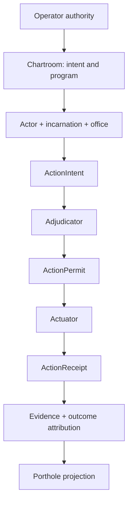

# System map and ontology

**Status:** PROPOSED PROJECTION  
**Rule:** a noun is honest only when its authority, exclusions, maturity, and implementation references are explicit.

## Product-level nouns

| Noun | Definition | May determine | Must not determine | Maturity / grounding |
|---|---|---|---|---|
| Operator | Human or explicitly delegated principal with attributable authority. | Intent approval, standing policy, overrides within contract. | Facts that were not observed; success by declaration. | Existing product role; exact mutation ceremony open. |
| Harbor | Authority/trust domain with membership, resources, epochs, and sovereignty. | Local authority boundary and grants. | Automatic cross-Harbor truth. | **Accepted direction:** `docs/adr/0122-harbor-authority.md`; existing Harbor/card/Relay code is partial. |
| Convoy | Named, governed application/program composition over runtime, actors, intentions, resources, budgets, evidence, targets, and Harbor relationships. | Packaging/lifecycle boundary. | Rename of Harbor, Fleet, or repo. | Lifecycle and name accepted in PR #9987; runtime unbuilt end-to-end. |
| Fleet | Declarative always-on team/launch composition. | Agent-team topology and triggers within its contract. | Convoy lifecycle, Harbor authority, or durable personhood. | Built/partial; `pd-fleet.yml`, fleet engine, conductor. |

## Identity and agency

| Noun | Definition | May determine | Must not determine | Maturity / grounding |
|---|---|---|---|---|
| Actor / AgentNode | Durable accountable person in the system. | Stable address, lineage, obligations, outcome history. | Current liveness or provider process by itself. | ADR-0121 Accepted; ADR-0040 Proposed with partial implementation. |
| Incarnation / body | One live execution embodiment of an Actor. | Current process/backend/session binding. | New durable identity or erased history. | Partial via actor soul/body lease and runtime sessions. |
| BodyLease | Revocable binding from a live incarnation to an Actor and current authority epoch. | Whether a body may act as that Actor now. | Memory inheritance or policy authorization by itself. | ADR-0022 Accepted; implementation partial. |
| Office | Durable organizational responsibility such as Historian or Builder. | Expected duties and routing. | Identity, authority, or protocol agreement. | Hypothesis/design. |
| ProtocolRole | Role within one protocol instance. | Legal messages/transitions for that instance. | Durable office or Actor identity. | Research/design through FIPA graft. |

## Intent and coordination

| Noun | Definition | May determine | Must not determine | Maturity / grounding |
|---|---|---|---|---|
| Chartroom | Intended canonical intent/program graph and source-disposition authority. | Requirements, intentions, dependencies, tensions, supersession, proof links. | Runtime effects or evidence fabrication. | Designed; PR #9989 draft, no production cutover/import. |
| Goal | Desired condition or candidate objective. | Deliberation input. | Persistent commitment. | Designed semantic distinction. |
| Intention | Accepted persistent commitment with lifecycle and provenance. | Scheduling/resume/supersession behavior. | Permission to cause effects. | Designed from BDI/ADR-0041. |
| Decision | Attributable resolution that changes authoritative design/program state. | Named records within authority scope. | Silent constitutional amendment. | This ledger proposes ceremony. |
| Tension | Two desirable properties that both still carry weight. | Design constraints and experiments. | A forced false resolution. | First-class ledger record. |
| Claim | Hard coordination record over file/symbol/resource scope. | Occupancy, conflict, transfer, salvage cues. | Actuator permission or completion proof. | Claims built; Claim Tree ADR Proposed. |
| Pheromone | Provenance-bearing signal with strength and half-life. | Advisory attention/selection priors. | Ownership, permission, fact, or success. | Accepted vocabulary design; lifecycle/visualization proposed. |

## Effect and evidence pipeline

| Noun | Definition | May determine | Must not determine | Maturity / grounding |
|---|---|---|---|---|
| ActionIntent | Typed, canonical proposal for one exact consequential effect. | Candidate target, parameters, expected state, requested authority. | Permission or execution. | Keystone proposal; no frozen runtime contract. |
| Adjudicator | Isolated deterministic reference monitor over signed policy and authoritative facts. | Deny, Permit, or proposed PermitWithObligations. | Perform the effect. | Skill exists; runtime keystone is backlog/proposal. |
| ActionPermit | One-use capability bound to exact intent/action/policy/epoch/snapshot/nonce/expiry. | Admit its bound actuator attempt. | Prove that the attempt occurred or succeeded. | Proposed. |
| Actuator | Narrow trusted adapter that performs one permitted effect and observes the result. | Exact effect execution within binding. | Broaden permit or infer business outcome. | Existing Git/GitHub/files/shell paths are fragmented; typed boundary proposed. |
| ActionReceipt | Immutable record of attempt, observations, obligations, and uncertainty. | Evidence of what the actuator observed. | Desired downstream outcome without evaluation. | Receipt machinery partial; unified contract proposed. |
| Event | Recorded occurrence. | Ordering and provenance when authentic. | Truth of an attached assertion by itself. | Multiple event planes exist. |
| Observation | Measurement or readback from a named observer. | Evidence input with scope/freshness. | Universal truth. | Partial. |
| Evidence | Source-bound material supporting or refuting a claim. | Proof evaluation input. | Automatic success. | Partial and distributed. |
| Outcome | Evaluated result against an acceptance policy. | Learning, reputation, settlement when witnessed. | Replacement for receipts. | Designed, not a complete ledger. |

## Runtime, transport, and projections

| Noun | Definition | May determine | Must not determine | Maturity / grounding |
|---|---|---|---|---|
| Keel / Coast Guard | Confinement, spawn ownership, egress, secret, and body-lease boundary. | What a body can physically reach under its tier. | Semantic authorization or proof alone. | Coast Guard partial/shipped cooperative tier; stronger isolation backlog. |
| Relay | Cross-machine transport/federation fabric. | Authenticated delivery, replay, revocation within protocol. | Canonical program truth or merged Harbor sovereignty. | ADR-0049 Accepted; implementation partial/shipped surfaces. |
| Porthole | Temporal/evidentiary projection over causal events and attachments. | Search, replay, chain navigation, freshness display. | Canonical mutation or success fabrication. | Terminal product exists; universal causal stage PR #9970 unmerged. |
| Claim Tree | Spatial projection of work/claim hierarchy. | Where coordination state applies. | Authority outside the claim contract. | ADR-0038 Proposed; pd-console claim code exists. |
| FleetBar | Ambient operator consent, health, and re-entry surface. | Mutations only through shared authority contracts. | Rival state store. | Built Mac surface. |
| pd-console | Deep proof/workstation surface. | Rich projections and contract-bound commands. | Independent authorization semantics. | Built/active Rust GPUI/REPL surface. |

## Experience and economy

| Noun | Definition | May determine | Must not determine | Maturity / grounding |
|---|---|---|---|---|
| Skill | Versioned cognitive or procedural module. | Advice/transform within declared interface. | Authority merely because selected. | Large catalog exists; graft accounting partial. |
| SkillBinding | Exact skill digest, target contract, adopted/rejected semantics, and evidence. | What implementation imported. | Outcome credit by presence alone. | Proposed. |
| SelectionPolicy | Replaceable function choosing actors, plans, skills, or evaluators. | Selection with recorded features/uncertainty. | Identity or witnessed outcomes. | Research/design. |
| ExecutionBudget | Authority for inference, search, storage, API, and runtime COGS. | Admission/reservation/accrual within funded ceiling. | Commerce spending. | Existing ledgers strong; Convoy economic binding proposed. |
| ActionBudget | Authority to buy, advertise, transfer, or otherwise spend for a beneficiary. | Commerce effects within explicit purpose/approvals. | Provider COGS by implication. | Proposed distinction. |
| Anchor / Market | Contracting, bonds, escrow, settlement, and paid module exchange. | Economic coordination after identity/outcomes exist. | Central planning or premature reputation. | Later design/research. |

## Stack in one sentence per layer

The hypervisor gives safety; the virtual Actor gives continuity; Chartroom preserves intent; BDI supplies commitment semantics; Parley structures disagreement; actuators choke authority; receipts establish observed truth; Porthole makes the chain visible; Relay crosses machines and Harbors; skills modularize cognition; evaluation turns experience into learning; Anchor may later turn proven capability into an economy; Convoy packages it as applications.

