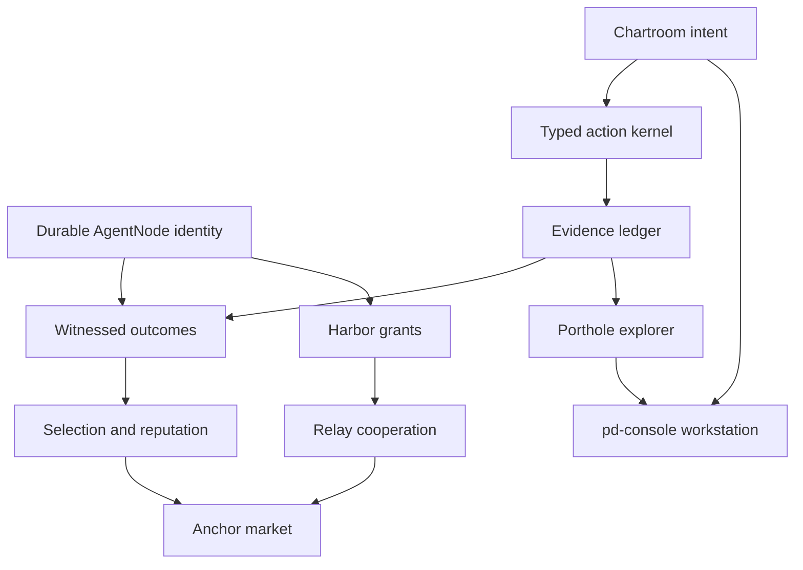

# Dependency program

**Status:** PROPOSED PROGRAM PROJECTION  
**Authority:** generated from contracts and proofs; not a second roadmap authority

The canonical planning object is a dependency graph of contracts and proofs. A “roadmap” is only a funded cut through that graph. The earlier M0–M10 sequence remains preserved in the [archive](archive/prior-M0-M10-roadmap.md), but it no longer gets to hide prerequisite or parallel work inside a persuasive linear story.

## Program streams

| Stream | Required result | Existing substrate | Missing proof | Enables |
|---|---|---|---|---|
| Identity | One durable person across replaceable bodies | ADR-0022; actor souls; `AgentNode`/`Body` schemas | provider-A → provider-B continuity with universal write attribution | outcomes, grants, reputation |
| Intent | One persistent, provenance-bearing program graph (`GH-C-002`, `GH-C-009`) | WorkIntent intake; operator charge ledger; graph edges | signed Chartroom mutation and readback | scheduling, interruption, workstation |
| Action | Typed request → decision → permit → actuator → receipt (`GH-C-004`…`GH-C-008`) | tool gate; governance schemas; Arbiter; WorkReceipt | complete mediation and GitHub proof | safety, evidence, economics |
| Runtime | Harbor-owned spawn and secret custody (contract family still incomplete) | body lifecycle; budgets; Rust boundary ADR; `GH-C-001`, `GH-C-007` | same-UID confinement and provider-boundary accounting | reliable enforcement |
| Coordination | hard claims plus advisory signals (`GH-C-010`) | Claim Forest; editor claims; pheromone runtime | combined projection and conflict/salvage proof | concurrent work |
| Evidence | joined causal, temporal, and semantic history (`GH-C-008`, `GH-C-011`) | hash-chained event ledger; search; replay prototype | decision-to-receipt chain and privacy-before-write | Porthole, outcomes |
| Protocol | disagreement and task exchange with explicit terminal semantics (contract not yet promoted) | mature Parley; FIPA skills | role-parameterized protocol registry/grafts | collaboration, Relay |
| Experience | pd-console as primary workplace (`GH-C-011`) | claims panes; PWA/native prototypes | GH-CUT-001 | dogfooding |
| Federation | sovereign Harbor exchange (`GH-C-003`) | Relay v0, sealed transit, remote Harbors | grant/evidence contract proof and revocation timing | native collaboration |
| Economy | truthful cost, outcome, and settlement (`GH-C-012`; outcome/settlement contracts incomplete) | budgets, bonds, pd-anchor primitives | independent outcome oracle and settlement authority | paid skills |

## Forced dependency order

These are constraints, not a claim that all work must be serial:

1. Identity must be non-whitewashable before outcomes can accumulate against a person.
2. Outcomes must be witnessed before reputation or routing can learn reliably.
3. Runtime authority and actuator contracts must exist before receipts can prove governed effects.
4. An event/evidence ledger must exist before Porthole can become an evidence explorer.
5. Harbor grants and evidence contracts must exist before federation can imply cooperation.
6. Identity, outcomes, grants, metering, and settlement authority must precede a credible market.

## Funded next cut

See [GH-CUT-001](program/CUT-001-first-vertical-proof.md). It crosses identity, intent, claim coordination, action authorization, embodiment, and evidence in one small browser change. That breadth is intentional: a narrow subsystem demo would allow incompatible local semantics to survive.

## Exit rule

No stream advances because its prose is comprehensive. It advances when the corresponding proof in [11-proof-catalog.md](11-proof-catalog.md) passes at an exact repository and policy revision.
