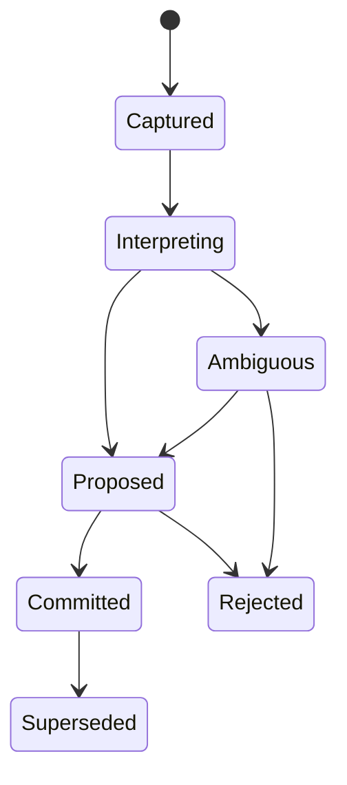
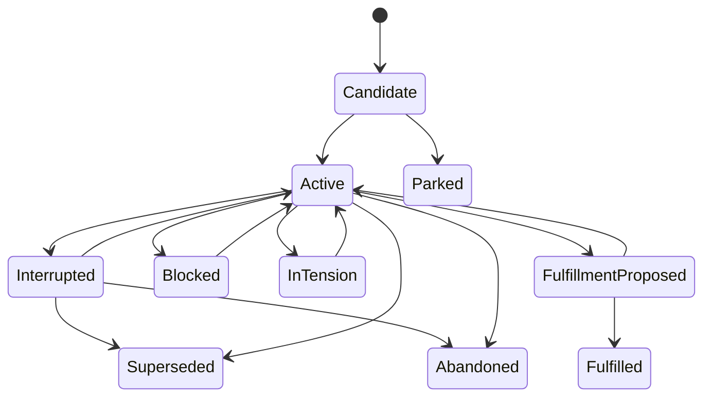
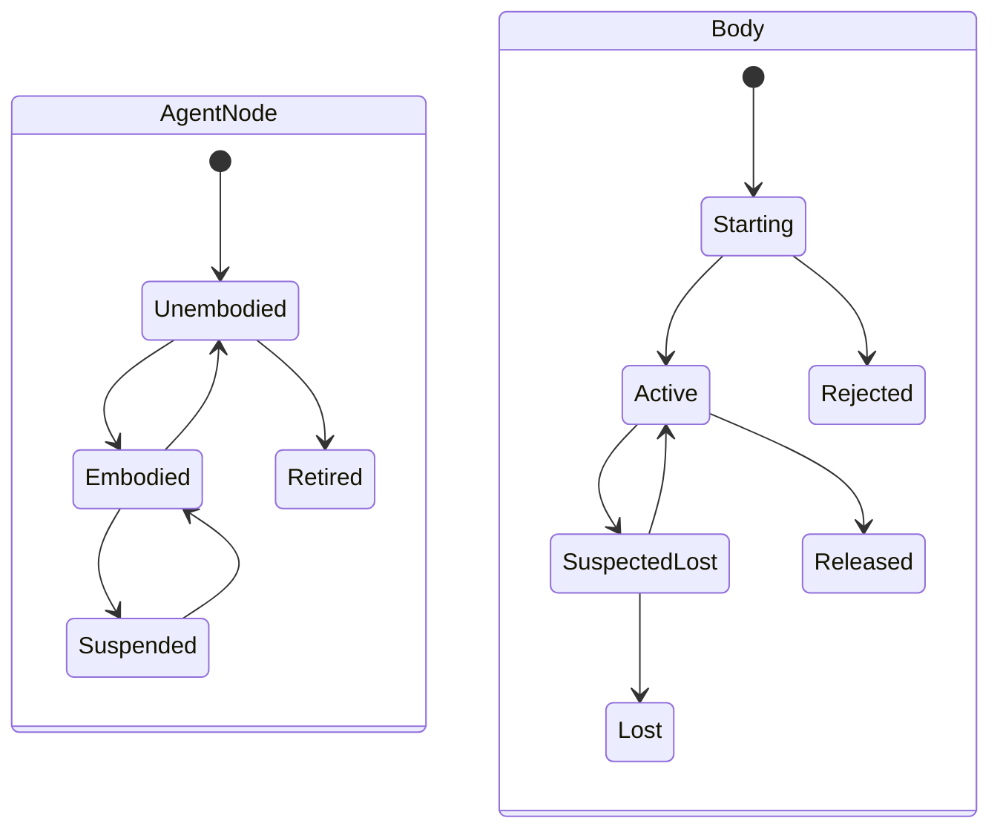
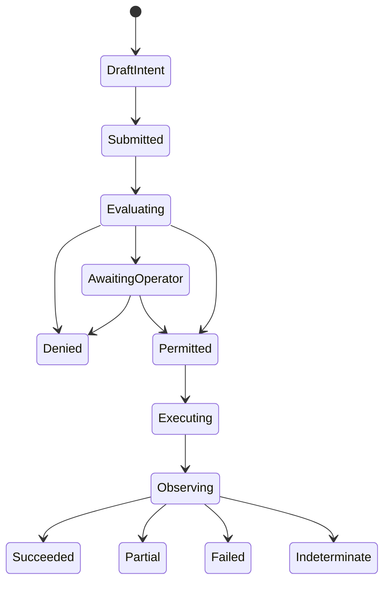

# State-machine catalog

**Status:** CONTRACT CANDIDATES  
**Important:** names below are not runtime enums until their governing contract is ratified.

State machines buy speed and honesty simultaneously. A legal local transition can be a deterministic table lookup; an illegal edge can be rejected before model or policy work; projections can update incrementally. They do not make external effects instantaneous.

## Operator utterance and interpretation



`Captured` is a valid lightning-fast durable result. `Committed` requires the applicable authority. Rejection never deletes the source utterance.

## Intention



`Fulfilled` is governed by a named completion policy; an actor saying “done” is at most evidence or a proposal.

## Durable person and body



The accepted repository vocabulary is `AgentNode` as durable person and `Body` as replaceable embodiment. “Incarnation” remains a descriptive candidate until [GH-Q-003](05-open-questions.md) is resolved.

## Governed effect



Outcome assessment is a separate state machine. `Permitted` never means effected. A retry after `Indeterminate` is a new governed action unless the actuator contract proves the original action safe and idempotent.

## Claim and pheromone

| Object | Candidate states | Authority |
|---|---|---|
| Claim | requested, active, conflicted, released, expired, stale, salvaged | hard coordination only |
| Pheromone | emitted, active, decaying, disputed, expired | none |
| Grant | draft, offered, active, suspended, revocation-requested, revoked, expired, rejected, diverged | input to local authorization |

Their apparent spatial overlap does not compose their authority.

## Parley

The current Parley runtime already has durable parties, turns, seen receipts, outbox recovery, quotas, TTL, and terminal states including `COLLAPSED`, `ESCALATED`, and `VOIDED`. A future generic protocol registry must reconcile, not replace, that authority.

Candidate generalized flow:

```text
draft → open → proposal/evidence exchange → deliberation
      → resolved | impasse | timeout | cancelled | protocol violation
```

Delivery, understanding, acceptance, agreement, and downstream mutation are distinct.

## Budget reservation and settlement

```text
grant:       draft → active → suspended | exhausted | revoked | expired
reservation: requested → held → consumed | partially-consumed | released | expired
usage:       estimated → boundary-observed → provider-confirmed | disputed | unattributed
settlement:  pending → held → released | refunded | disputed | indeterminate
```

Execution failure does not erase genuinely incurred provider COGS.

## Relay grant revocation race

`revocation requested` is an immediate local event. It is not `revoked everywhere`. The record must retain at least request time, remote receipt time, permit issuance, actuator admission, provider acceptance, observation, and both Harbor epochs. The precise cancellation rule remains [GH-Q-031](05-open-questions.md).

