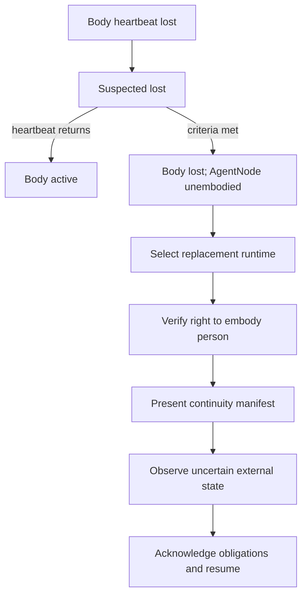
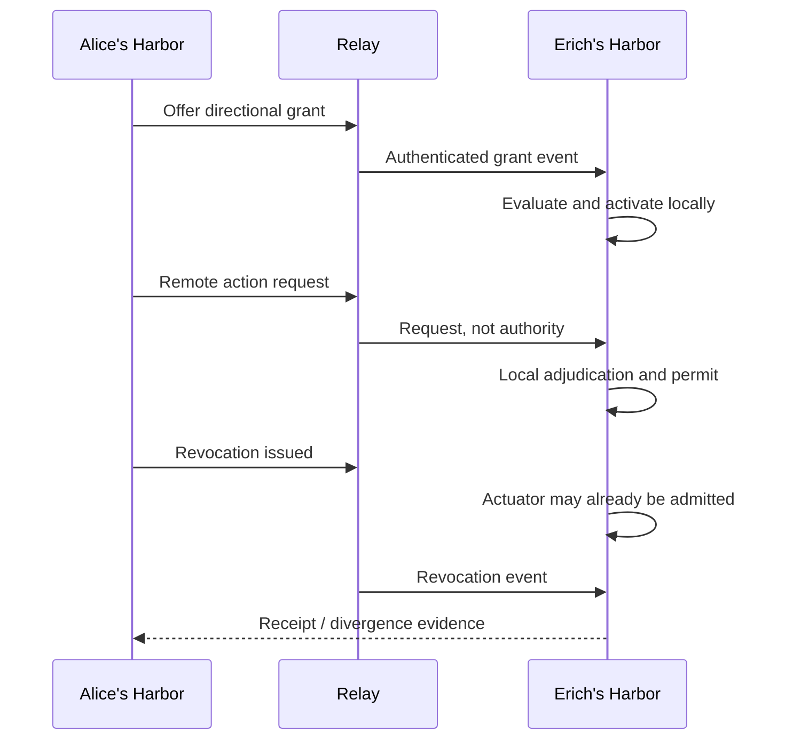

# Complete end-to-end flows

**Status:** UX PROPOSAL  
Each flow names durable events, authority boundaries, negative paths, and evidence. Policy questions remain linked rather than answered by UI prose.

## FLOW-01 — First vertical proof: intent to witnessed outcome

```mermaid
sequenceDiagram
    participant E as Erich
    participant C as Chartroom
    participant B as Builder
    participant K as Action kernel
    participant G as GitHub actuator
    participant P as Porthole
    E->>C: Capture feature instruction
    C-->>E: Captured; interpretation proposed
    E->>C: Commit typed intention
    C->>B: Schedule accepted intention
    B->>K: Submit exact GitHub ActionIntent
    K-->>E: Judgment required
    E->>K: Authorize exact action once
    K->>G: Bound ActionPermit
    G->>G: Effect + read-after-write
    G-->>P: Observation + ActionReceipt
    P-->>E: Completion evidence ready
    E->>C: Accept outcome transition
```

1. Quick capture durably appends raw instruction and immediately displays `Captured`.
2. Interpretation proposes typed intent, acceptance requirement, dependencies, and ambiguity.
3. Erich edits/commits the transition at an exact Chartroom revision.
4. Builder requests a hard repository scope. Claim Forest evaluates overlap; pheromones may influence the suggestion only.
5. Builder edits; events and wakes appear. Nemesis claims the test seam and adds exact-head acceptance evidence.
6. A prior contrary decision opens a Parley. Agreed/unresolved parts become downstream proposals.
7. Builder submits `UpdatePullRequestBody`; the action kernel evaluates versioned evidence.
8. Erich sees exact actor/body/Harbor/target/payload/preconditions/grant/budget/expiry and authorizes once.
9. The actuator alone uses the GitHub credential, checks expected state, writes, and observes target state.
10. Porthole joins requirement, change, test, permit, effect, observation, receipt, and outcome policy.
11. `Ready for operator outcome judgment` appears. Erich accepts or rejects fulfillment; neither publication nor a receipt alone forces success.

**Negative:** stale test blocks the completion policy; publication can still have a successful effect receipt. A failed browser outcome does not rewrite the GitHub receipt.

## FLOW-02 — Abrupt second idea: refine, interrupt, or contradict

1. Original intention `int_A` is active with claims and a running body.
2. Erich invokes quick capture from any screen. `utt_B` is durable before interpretation.
3. The model proposes one or more relations; deterministic checks list affected decisions/invariants.
4. If `REFINES`, the semantic diff adds acceptance detail without changing the commitment identity unless the contract requires a new version.
5. If `INTERRUPTS`, `int_A` moves to interrupted with resume condition; `int_B` becomes active under its own claims/grants/budget.
6. If `CONTRADICTS`, a Tension is proposed. Existing work may pause under policy; neither side disappears.
7. If ambiguous, Erich may keep a Question and defer commitment.
8. Rejecting interpretation keeps both source utterance and existing intention untouched.
9. After urgent work, Bridge shows drift since `int_A`'s last proven event and offers `Resume`, `Re-plan`, `Abandon`, `Supersede`.

**Authority:** capture is immediate local durability; only accepted mutation changes the program. Automatic resumption remains GH-Q-007.

**Evidence:** utterance ID, proposal/version, cited affected records, operator authorization, old/new graph digests.

## FLOW-03 — Body loss and provider-neutral resurrection



1. Liveness evidence moves the Body from active to suspected lost; the UI names threshold and last event.
2. On lost, durable person remains visible. Claims, grants, reservations, obligations, and submitted/permitted actions retain their own states.
3. Resurrection selection lists provider/runtime, sandbox, capabilities, cost estimate, privacy, and compatibility.
4. The replacement proves the right to embody the `AgentNode`; a new Body lease is issued or denied.
5. A signed/content-addressed task capsule is inspected. Every continuity item gets a disposition.
6. Any action submitted/admitted during the unobserved interval triggers external observation before retry.
7. Existing permits are shown as unusable unless the unresolved transfer contract explicitly allows them.
8. The new Body acknowledges open obligations and starts from the last proven event plus drift, not a generic prompt.
9. If the original returns, split-brain policy blocks silent simultaneous embodiment and opens a reconciliation state.

**Failure:** invalid credential → `Replacement rejected`; capsule mismatch → stop; provider unavailable → person remains unembodied; observation unavailable → intention remains blocked/indeterminate.

## FLOW-04 — Narrow GitHub effect: allow

1. Actor constructs typed effect and preview; no reusable secret is available.
2. Submission freezes `ActionIntent` with digest, idempotency key, and actor/body/Harbor/intention attribution.
3. Runtime validates legal lifecycle edge and normalizes data.
4. Authorization snapshot hydrates credential facts, directional grant, policy/schema epoch, resource/expected state, budget reservation, and relevant entities.
5. Candidate Cedar/native evaluator returns allow/deny plus diagnostics; any evaluator error is treated as indeterminate/deny.
6. Short transaction compares exact versions, inserts bound permit and outbox, consumes/reserves nonce/budget authority, commits.
7. UI says `Permit issued; no effect observed yet`.
8. Actuator verifies permit/expiry/nonces, rechecks required preconditions, owns credential, sends effect.
9. Read-after-write matches exact normalized desired state.
10. Receipt links attempt, provider response, observation, cost, and postconditions.

**No hidden batch semantics:** each row receives independent request/permit/receipt.

## FLOW-05 — Action denied or revised

1. Evaluation returns no permit because grant scope, expected state, budget, policy, credential, or legal edge fails.
2. Denial names the exact failed predicate, evidence, policy/schema epoch, and safe remediation.
3. `Revise request` copies human-readable input into a new draft but preserves the denied immutable request.
4. Scope, payload, expected state, or target change produces a new digest/idempotency key.
5. If operator judgment rather than policy failure is required, the state is `Awaiting operator`, not denied.
6. If policy/entity hydration fails, state is `Indeterminate authorization`; no allow is honored.

Example:

> **Denied — grant does not include protected PR body section.** Request `air_901` remains recorded. Smallest remediation: request `UpdatePullRequestBody:summary-only` for PR #9987, or open a constitutional-impact review.

## FLOW-06 — External partial or indeterminate effect

1. Actuator admits a valid permit.
2. Provider accepts the request, but transport fails before a response; or only some multi-postcondition effects are observed.
3. The receipt enters `Indeterminate` or `Partial`, never `Failed` solely due to timeout.
4. Automatic retry is disabled unless the actuator contract proves idempotency and target observation permits it.
5. Reconciliation reads external state under a new observation event.
6. If exact desired state exists, receipt may transition to observed success with the new evidence.
7. If mismatch exists, it becomes observed mismatch/partial; if still unobservable, it remains indeterminate.
8. A compensating/rollback effect is a new governed request.

**UI:** show what is known, what may have happened, next safe observation, and the danger of retry. Cost reservation remains held or settles according to boundary-observed usage.

## FLOW-07 — Claim collision, expiry, and salvage

1. Builder requests `WRITE docs/grand-harbor/**` for intention A.
2. Claim Forest returns parent/child/peer overlap and compatibility.
3. Compatible READ or disjoint symbol scope activates under policy; incompatible WRITE remains requested/conflicted.
4. UI offers narrowing, holder contact, protocol negotiation, or cancellation. A risk pheromone may explain likely contention but does not decide.
5. Body loss makes the person unembodied; the claim is not silently released.
6. Lease/liveness threshold marks claim stale under explicit policy.
7. A reviewer opens salvage, sees worktree/diff/event/evidence state, and decides preserve, transfer, split, release, or abandon under authority.
8. New holder receives a new/derived claim with lineage. Original record remains.

**No-signal test:** repeat with pheromones disabled; active/conflict/salvage transitions are identical.

## FLOW-08 — Parley resolved and unresolved

1. A Tension or explicit disagreement starts with a literal proposition and stakes.
2. User chooses protocol/version; role slots are displayed before actor bindings.
3. Actors accept/refuse roles; deadlines/evidence obligations are recorded.
4. Structured acts pass validation. Delivery and seen/understood evidence are distinct.
5. Duplicate/out-of-order act is quarantined or handled under protocol, not silently reordered.
6. Participants propose, challenge, provide evidence, amend, withdraw, or issue `not-understood`.
7. Terminal path can be resolved, impasse, timeout, cancelled, protocol violation, or the existing Parley terminal mapping after reconciliation.
8. Resolution produces three sets: agreed, rejected, unresolved.
9. Downstream Chartroom changes are proposals requiring their normal authority.

**Resolved example:** pheromones may influence candidate ranking but cannot confer assignment.  
**Unresolved residue:** whether the default AgentMatcher enables that input.

## FLOW-09 — Cross-Harbor grant and in-flight revoke



1. Issuing Harbor offers typed direction, resource/action scope, expiry, disclosure, budget, evidence terms.
2. Receiving Harbor authenticates source and decides local acceptance; remote acceptance alone may not activate local use.
3. Every use cites grant and emits evidence according to the disclosure contract.
4. Remote action request enters the receiving Harbor's action kernel; transport connection is irrelevant to authority.
5. Revocation creates a local event immediately and travels through Relay.
6. Authorization after the effective epoch denies. In-flight action follows explicit timing rules across permit issuance, admission, provider acceptance, and observation.
7. Partition may leave Harbors diverged. The UI shows both states rather than “syncing” a fictional consensus.

## FLOW-10 — Economic reservation and concurrent oversubscription

1. A RevenueReceipt may mint bounded EconomicAuthority under a signed release policy; execution subsidies, revenue, and commerce ActionBudget are separate.
2. Convoy/intention/actor requests an ExecutionBudget reservation for provider work.
3. Atomic check sees ceiling, held reservations, observed usage, policy margin/limits, and nested delegation.
4. Two concurrent requests cannot reserve the same remaining authority: compare-and-swap admits one and denies/retries the other.
5. Credential boundary performs work and measures actual usage.
6. Reservation is consumed/partially consumed; unused amount releases. Late/provider-adjusted usage stays explicit.
7. Outcome assessment occurs separately; failed work may still incur COGS.
8. Burn governors pause/raise/kill according to policy and produce receipts.

**Denial copy:** `Reservation denied: $0.17 remains; this request needs up to $0.24. Ask for $0.07 more, narrow the plan, or select a lower-ceiling runtime.`

## FLOW-11 — Paid private skill invocation

1. Buyer inspects versioned capability, price, max execution COGS, platform compensation, data fields, retention, evidence, failure/refund, settlement and confidentiality terms.
2. Contract binds buyer/seller durable identities and task/skill versions.
3. Buyer supplies only permitted input; protected skill implementation and buyer state remain in their declared domains.
4. Execution authority is reserved; confidential runtime attestation/verification is performed if the future design requires it.
5. Provider boundary measures COGS; evidence commitments are emitted without unnecessary payload disclosure.
6. Independent evaluator/outcome oracle applies the contract's acceptance policy.
7. Settlement releases, refunds, holds, or disputes independently of provider cost accounting.
8. Witnessed outcome may influence later reputation with uncertainty and anti-gaming controls.

**This is future flow:** missing attestation, data/evidence, oracle, settlement, identity, and reputation contracts stay visible in the UI.

## FLOW-12 — Evidence-chain debugging from “shipped”

1. User selects or types an assertion.
2. Porthole identifies the declared completion policy and exact subject revision.
3. It walks backward through outcome, evaluator, observation, receipt, permit, implementation, and accepted requirement.
4. Every edge names type, source authority, event/observation time, content digest and trust/disclosure status.
5. The first absent, stale, conflicting, redacted, or untrusted edge is emphasized without hiding later evidence.
6. Opening source preserves the shared Harbor/Convoy/resource/intention/actor/time tuple.
7. Historical replay rebuilds projections but has no actuator capability.
8. If repair work is needed, `Create diagnostic intention` captures a new source and proposal; it does not mutate history.

## FLOW-13 — Global stop during active work

1. Operator invokes global stop with keyboard shortcut or scope-bar control.
2. Review lists active bodies, pending permits, admitted actuators, external operations, grants, and reservations.
3. Copy distinguishes immediate local stops from best-effort cancellation and irreversible in-flight effects.
4. Operator scopes all Harbor, current Convoy, selected actors, or action classes and submits governed stop/revocation requests.
5. Harbor stops local scheduling/body capabilities, invalidates new permits under epoch policy, sends remote revocations/cancellations, and records every response.
6. Porthole opens a stop timeline; unresolved external effects remain indeterminate until observed.

Primary copy: `Issue stop and revocation requests`. Never: `Stop everything immediately` unless the declared substrate can prove that guarantee.

