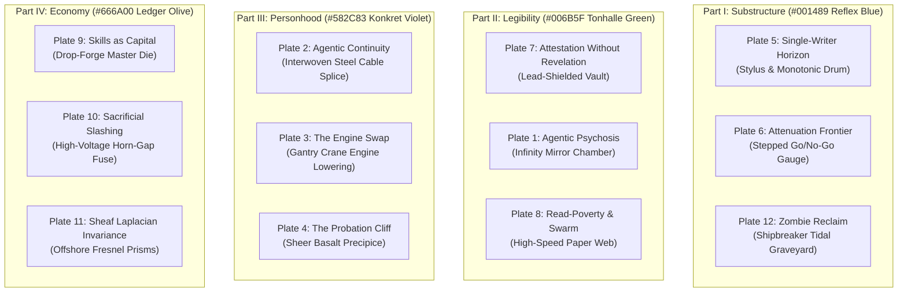

# Comprehensive Visual Report & Pre-Commit Inventory: The Book

**Role:** Marginalia Drawings & Swiss Plates Artist for The Book  
**Workspace:** `/Users/erichowens/coding/tmp/book-figures-reconciled`  
**Branch:** `codex/book-figures-reconciled`  
**Date:** 2026-09-21  

---

## Executive Summary

This inventory establishes the complete visual plan, technical specifications, exact prompts, placement locations, and semantic contracts required by the operator directives:
1. **Marginalia Drawings Quota ($40/40$)**: Reaching exactly five distinct, accepted object drawings per chapter across all 8 chapters ($8 \times 5 = 40$ total). The baseline held 10 accepted placements (`2, 1, 1, 1, 1, 1, 2, 1`). We specify the complete matrix and prompts for all 30 additional placements.
2. **The Big Ideas Swiss Plates Suite (12 Canonical Breakthrough Plates + 13 Opener Plates)**: Designed in the strict International Typographic Style of **Josef Müller-Brockmann and Herbert Matter**. Rather than merely decorating chapters, these plates stand **directly opposite the Big Breakthrough Ideas of The Book** (Agentic Psychosis, Continuity & Parfit, Engine Swap, Probation Cliff, Single-Writer Horizon, Attenuation Frontier, Sealed Harbor, Read-Poverty, Skills as Capital, Sacrificial Slashing, Sheaf Laplacian Invariance, and Zombie Salvage). Each enforces a hard modular grid, B&W halftone photography cropped square to the grid, flat opaque color planes from the part-specific palette, a single `#DA291C` signal red accent, and zero lettering on the plate (typeset in LaTeX).
3. **Figure Upgrades & Semantic Contracts**: Detailed audit advancing from 91/127 accepted contracts toward the complete 127-figure atlas. Full resolution of the 14 `check_figure_register.py` failures, mapping 12 active unmapped fragments into `FIGURE-REGISTER.md` and correcting legacy IDs.
4. **Typographic & Graphic Surfaces**: Complete specifications for high-contrast text panels, contents entries, analytical sparklines (`spark-bonded-deviation`, `spark-fh-cycle-radius`, `spark-stp-audit-depth`), Lucide terminal screens, and International Code of Signals (ICOS) flag specimens (`ZL`, `AS`, `CS`, `K`).

---

## Part 1: Swiss Plates Opposite The Big Ideas (12 Landmark Plates)

The Swiss Plates suite is not mere chapter decoration. Each landmark plate is placed **directly opposite the primary theoretical or systems breakthrough** of The Book. Every plate is constructed in the pure Josef Müller-Brockmann and Herbert Matter register:
- **Hard Modular Grid**: Thin rules visible as structure, establishing strict geometric modules.
- **High-Contrast B&W Halftone Photography**: Real photographic halftone with visible screen, cropped strictly square to the grid, capturing authentic industrial, mechanical, and architectural reality.
- **Flat Opaque Color Planes**:
  - **Part I (Ch 1–2):** `#001489` Reflex Blue (substructure, kernel, baseline)
  - **Part II (Ch 3–4):** `#006B5F` Tonhalle Green (telemetry, isolation, radar, navigation)
  - **Part III (Ch 5):** `#582C83` Konkret Violet (personhood, identity, metallurgy, drydock)
  - **Part IV (Ch 6–8):** `#666A00` Ledger Olive (accounting, commerce, settlement, federation)
  - **Universal Accent:** `#DA291C` Signal Red (used strictly once and small per plate)
  - **Ground & Structure:** `#FBF7EF` warm off-white paper; `#121212` charcoal for reversed planes.
- **Zero Lettering on Artwork**: Absolute ban on rasterized text or pseudo-glyphs. All titling, section headers, and formulas are typeset natively in LaTeX using Suisse Int'l Sans.

---

### Detailed Specifications for the 12 Big Idea Plates

#### 1. Agentic Psychosis & Hallucination Cascade
- **Opposite Anchor:** `whitepaper/legible-swarm.tex:1748` (§\ref{sec:readpoverty}, Read-poverty: the binding constraint at scale) / `spawn-to-person.tex:1572`.
- **Core Concept:** When an autonomous LLM agent becomes untethered from external ground truth, recursively ingesting its own prior hallucinatory outputs and entering a compounding delusional feedback loop.
- **Palette:** `#006B5F` Tonhalle Green, `#121212` Charcoal, `#FBF7EF` Paper, `#DA291C` Signal Red accent.
- **B&W Halftone Subject:** The interior of an optical kaleidoscope or infinity-mirror chamber photographed from inside: geometric mirror planes multiplying an unlit tungsten bulb into an infinite receding tunnel of distorted, phantom reflections.
- **Grid & Plane Layout:** A rigid $4\times 4$ modular grid of visible hairline rules. In the upper-left quadrant ($2\times 2$), the halftone infinity tunnel is cropped strictly square. From its right border, three horizontal tonhalle green rectangular planes step across the grid modules. Each successive green plane is rotated by an unsettling 0.5-degree off-axis increment, visually breaking the grid. At the exact geometric vanishing point of the infinite reflections, a solitary `#DA291C` red square ($6\times 6\text{ pt}$) sits isolated.
- **Conceptual Tension:** The rigid grid represents the deterministic system envelope; the compounding, off-axis color planes embody the psychotic drift of an agent ungrounded from reality.

#### 2. Agentic Continuity & The Overlapping Strand
- **Opposite Anchor:** `website-v2/public/whitepaper/spawn-to-person.tex:625` (§\ref{sec:parfit}, Parfit's repair: continuity, not connectedness).
- **Core Concept:** Derek Parfit’s psychological continuity applied to autonomous AI: an agent identity persists across repeated crashes, context resets, and state compaction not through an immutable soul or persistent RAM, but through an overlapping chain of verified evidence strands.
- **Palette:** `#582C83` Konkret Violet, `#121212` Charcoal, `#FBF7EF` Paper, `#DA291C` Signal Red accent.
- **B&W Halftone Subject:** An industrial multi-strand heavy steel mooring cable being spliced together in a shipyard rigging loft: individual thick twisted steel wires splayed outward and interbraided under severe hydraulic tension in hard raking cross-light.
- **Grid & Plane Layout:** A $3\times 4$ asymmetric grid. The halftone cable splice occupies the central vertical column of modules. Flanking it to left and right are staggered vertical planes of opaque `#582C83` violet overlapping like shingle courses; no single violet rectangle spans more than two vertical modules, yet the vertical sequence is unbroken from top to bottom. A single `#DA291C` red hairline rule cuts horizontally across the central splice overlap.
- **Conceptual Tension:** Geometrically proves Parfit’s bundle theory: no individual steel wire traverses the entire splice, yet the structural tensile capacity of the cable is continuous, unbroken, and load-bearing.

#### 3. The Engine Swap
- **Opposite Anchor:** `website-v2/public/whitepaper/spawn-to-person.tex:1572` (§\ref{sec:body-behind-name}, The body behind the name: engine swaps and resurrection).
- **Core Concept:** Hot-swapping model backends (e.g., substituting Claude 3.5 Sonnet for Codex or Gemini Pro) mid-mission without tearing down the task context, session lease, public identity, or verified audit trail.
- **Palette:** `#582C83` Konkret Violet, `#121212` Charcoal, `#FBF7EF` Paper, `#DA291C` Signal Red accent.
- **B&W Halftone Subject:** An overhead shipyard gantry crane lowering a massive marine diesel engine block through an open deck casing into the engine room of a cargo vessel in drydock; heavy braided wire rigging in hard tension, massive engine block hovering inches above its bedplates.
- **Grid & Plane Layout:** A $3\times 3$ square modular grid. The halftone suspended engine block occupies the upper-right $2\times 2$ module. Below it, an empty charcoal `#121212` cavity represents the engine bay. A broad vertical plane of `#582C83` violet extends down the left margin, carrying an identical rectangular silhouette cut-out. A solitary `#DA291C` red locator pin marks the exact alignment lug where the new power plant meets the persistent hull mounts.
- **Conceptual Tension:** The hull (the persistent agent identity, mission contract, and public reputation) is immovable and permanent; the engine (the LLM inference engine) is a modular, swappable power cartridge lowered through an open hatch.

#### 4. The Front-Loaded Probation Cliff
- **Opposite Anchor:** `website-v2/public/whitepaper/spawn-to-person.tex:1330` (`thm:probation-dominance`, The Probation Cliff theorem & Figure 5.8).
- **Core Concept:** The optimal newcomer-scrutiny schedule: audit and escrow burdens must drop precipitously after period zero, because the ratio of deterrence to honest cost strictly decreases over time.
- **Palette:** `#582C83` Konkret Violet, `#121212` Charcoal, `#FBF7EF` Paper, `#DA291C` Signal Red accent.
- **B&W Halftone Subject:** A vertical geological basalt cliff face dropping sheer into foaming ocean surge, photographed from the water line looking straight up; stark columnar jointing in severe black-and-white tonal contrast.
- **Grid & Plane Layout:** An asymmetric horizontal grid with a golden-ratio vertical split. The halftone basalt precipice occupies the left third. At the exact cliff edge, a monumental vertical slab of `#582C83` violet drops 85% of the page height in period zero, terminating at a charcoal baseline. Across the remaining grid columns, the scrutiny level flattens into a razor-thin 2pt horizontal violet rule. One tiny `#DA291C` red square marks the arrival point at $t=0$.
- **Conceptual Tension:** Scrutiny is not an egalitarian slope or a gentle ramp; it is a brutal, vertical wall that newcomer agents must survive in their first step, after which the burden drops asymptotically to baseline.

#### 5. The Single-Writer Monotonic Horizon
- **Opposite Anchor:** `whitepaper/single-writer-kernel.tex:254` (Kernel reference monitor) & `:1120` (WAL append-only progress).
- **Core Concept:** Eliminating distributed consensus hazards by routing all mutations through a local single-writer reference monitor; state advances monotonically along an immutable write-ahead log (WAL).
- **Palette:** `#001489` Reflex Blue, `#121212` Charcoal, `#FBF7EF` Paper, `#DA291C` Signal Red accent.
- **B&W Halftone Subject:** Extreme close-up macro photograph of a master observatory seismograph or astronomical chronograph drum: a finely threaded rotating cylinder with a sharp diamond stylus tracing a clean, microscopic helical groove into black smoked paper.
- **Grid & Plane Layout:** A strict $5\times 3$ horizontal rail grid. The halftone stylus and drum fill the lower half. Above it, a solid, unbroken horizontal plane of `#001489` reflex blue spans from the left margin to an abrupt vertical hairline rule—the commit horizon. Beyond this line to the right, the grid is bare paper `#FBF7EF`. A single `#DA291C` red needle tip touches the exact intersection of the blue plane and the vertical rule.
- **Conceptual Tension:** Time in the kernel moves in one direction only; writes cannot fork, race, or un-happen. The blue plane represents the durable monotonic WAL; the bare space to the right is the uncommitted future.

#### 6. The Attenuation Frontier & Cryptographic Macaroons
- **Opposite Anchor:** `website-v2/public/whitepaper/anchor-protocol-whitepaper.tex:277` (§\ref{sec:attenuation}, Capability attenuation & caveat discharge).
- **Core Concept:** Monotonic restriction of authority across delegation hops: an agent can only append third-party caveats or shrink authority, ensuring delegated tokens can never exceed the permissions of their issuer.
- **Palette:** `#001489` Reflex Blue, `#121212` Charcoal, `#FBF7EF` Paper, `#DA291C` Signal Red accent.
- **B&W Halftone Subject:** A stepped machinist's go/no-go plug gauge set resting on an engineer's granite surface plate: hardened cylindrical steel steps of decreasing diameters ground to sub-micron tolerances, catching hard directional light.
- **Grid & Plane Layout:** A $4\times 4$ modular grid. The halftone gauge set occupies the lower-left diagonal. Over it, nested L-shaped planes of `#001489` reflex blue step inward toward the center, each plane strictly smaller and thinner than its parent, each bound by a thin charcoal rule. At the innermost smallest cell, a single `#DA291C` red square represents the terminal discharged caveat.
- **Conceptual Tension:** A cryptographic macaroon can only lose authority, never gain it. The geometric nesting enforces visual entropy: delegation is an irreversible journey toward zero authority.

#### 7. Attestation Without Revelation / The Sealed Harbor
- **Opposite Anchor:** `website-v2/public/whitepaper/sealed-harbor.tex:374` & `:580` (§\ref{sec:sealed-pipeline} & Two Worlds experiment).
- **Core Concept:** Verifying the mathematical correctness of an agent's execution within an enclave without disclosing its underlying confidential data; outputs gated strictly by differential privacy accounting.
- **Palette:** `#006B5F` Tonhalle Green, `#121212` Charcoal, `#FBF7EF` Paper, `#DA291C` Signal Red accent.
- **B&W Halftone Subject:** An industrial lead-shielded radiographic isotope container in three-quarter view: heavy interlocking lead rings, bolted steel collars, and a recessed collimator port casting deep black shadows.
- **Grid & Plane Layout:** An asymmetric $3\times 3$ grid. The halftone shielded vault occupies the center module. It is flanked by two identical vertical panels: the left panel is pure solid charcoal `#121212` (the completely concealed secret input $s_0$ vs $s_1$), while the right panel is solid `#006B5F` tonhalle green (the public zero-knowledge attestation receipt). A single `#DA291C` red hairline rule crosses through the green panel, proving an attestation has emerged while the charcoal box remains impenetrable.
- **Conceptual Tension:** Complete opacity of execution paired with complete mathematical proof of correctness. The viewer sees the density of the container and the receipt, but the interior is permanently withheld.

#### 8. Read-Poverty & The Legible Swarm
- **Opposite Anchor:** `whitepaper/legible-swarm.tex:1748` (§\ref{sec:readpoverty}, Read-poverty: the binding constraint at scale).
- **Core Concept:** Herbert Simon's law applied to agent fleets: an exponential wealth of LLM-generated tokens creates a devastating poverty of human attention; synthesis with zoom-to-evidence is the only survival path.
- **Palette:** `#006B5F` Tonhalle Green, `#121212` Charcoal, `#FBF7EF` Paper, `#DA291C` Signal Red accent.
- **B&W Halftone Subject:** A massive newspaper printing plant folder mechanism in high-speed motion: thousands of continuous paper webs streaming through steel folding formers at blinding speed, blurred in motion except for one frozen roller.
- **Grid & Plane Layout:** A dense $6\times 6$ modular grid. 32 of the 36 cells are filled with high-contrast fragments of the blurred rushing paper stream, creating visual vertigo and informational drowning. In sharp, startling contrast, exactly one central rectangular block of $2\times 2$ modules is a completely quiet, serene plane of solid `#006B5F` tonhalle green, inside of which sits one `#DA291C` red indicator dot.
- **Conceptual Tension:** Herbert Simon’s dictum visualized: a deluge of agent-generated text creates a desperate poverty of human attention. The quiet green panel is the synthesized digest that rescues the operator from drowning.

#### 9. Skills as Capital vs Token Labor
- **Opposite Anchor:** `website-v2/public/whitepaper/harbor-economy.tex:377` (§\ref{sec:three-sides}, Agent/fleet as rentable asset / capital).
- **Core Concept:** Moving from prompt engineering (ephemeral token expenditure) to capital software tooling: reusable, licensed agent skills packaged as durable assets that amortize across thousands of runs.
- **Palette:** `#666A00` Ledger Olive, `#121212` Charcoal, `#FBF7EF` Paper, `#DA291C` Signal Red accent.
- **B&W Halftone Subject:** A heavy cast-iron foundry drop-forge die set: hardened engraved steel forging dies for an aircraft turbine blade, resting beside a glowing blank on an anvil.
- **Grid & Plane Layout:** An axonometric $3\times 4$ modular grid. The halftone forged master die occupies the left half. To the right, a vertical stack of equal-sized `#666A00` olive planes marches downward, each plane representing an amortized execution run derived from the same master tool. At the base of the stack, a tiny `#DA291C` red square marks the marginal cost per run.
- **Conceptual Tension:** Token labor is ephemeral steam; a curated, verified agent skill is permanent industrial tooling. The master die represents the fixed capital investment that amortizes across ten thousand runs.

#### 10. The Bonded Commons & Sacrificial Slashing
- **Opposite Anchor:** `website-v2/public/whitepaper/agent-transactions-whitepaper.tex:816` & `:1139` (§\ref{sec:settlement}, Collateral deterrence & shear-pin mechanics).
- **Core Concept:** Game-theoretic collateral: a rogue agent's economic bond is automatically forfeited to compensate victims; like a mechanical shear pin, it breaks under stress to protect the host system.
- **Palette:** `#666A00` Ledger Olive, `#121212` Charcoal, `#FBF7EF` Paper, `#DA291C` Signal Red accent.
- **B&W Halftone Subject:** A massive electrical substation high-voltage ceramic insulator horn-gap fuse: an explosive arc gap showing a clean mechanical disconnect under catastrophic overload.
- **Grid & Plane Layout:** A dramatic diagonal split across a $4\times 4$ grid. The halftone electrical surge gap fills the upper triangle. The lower triangle is split into two flat color zones: a heavy base of `#666A00` ledger olive representing the staked treasury pool, and a severed corner of `#121212` charcoal representing the slashed collateral. At the fracture line, a single `#DA291C` red zigzag rule indicates the exact trip threshold.
- **Conceptual Tension:** The shear pin breaks so the hull does not crack. Slashing is not vengeance; it is an automatic sacrificial circuit breaker that compensates the commons and protects the system from collapse.

#### 11. Sheaf Laplacian Invariance & Cycle Consistency
- **Opposite Anchor:** `website-v2/public/whitepaper/federated-harbor-whitepaper.tex:564` (§\ref{sec:fh-sheaf}, Sheaf Laplacian and contextuality).
- **Core Concept:** Detecting equivocation and data fraud across federated harbors: while inconsistent statements can remain hidden along open paths, they cannot hide when gossip closes a loop ($r/|s| = 1/\sqrt{n}$).
- **Palette:** `#666A00` Ledger Olive, `#121212` Charcoal, `#FBF7EF` Paper, `#DA291C` Signal Red accent.
- **B&W Halftone Subject:** An aerial photograph of an offshore lighthouse Fresnel lens assembly: concentric polished annular glass prisms mounted in brass frames, focusing light into sharp radial blades.
- **Grid & Plane Layout:** A radial-over-orthogonal grid: a circular coordinate system inscribed inside a square modular grid. The halftone Fresnel lens occupies the inscribed circle. Four flat `#666A00` olive quadrants surround it, bound by four hairline rules forming a closed loop (a 4-cycle). Three corners join seamlessly; at the fourth corner, the rules fail to close by an explicit 3pt offset gap, marked with a `#DA291C` red vertex dot ($r = 1/\sqrt{n}$).
- **Conceptual Tension:** On an open tree, an agent can lie with impunity. Only when gossip forms a closed topological cycle does the sheaf Laplacian compute the holonomy discrepancy that reveals equivocation.

#### 12. The Zombie Reclaim & Salvage Graveyard
- **Opposite Anchor:** `whitepaper/single-writer-kernel.tex:801` (`thm:exclusion`, lease fences) & `spawn-to-person.tex:903` (salvage & reclamation).
- **Core Concept:** Automatic Garbage Collection of the Fleet: when an agent experiences hardware death, network isolation, or lease expiry, its stranded ports, orphaned worktrees, and locks are harvested autonomously.
- **Palette:** `#001489` Reflex Blue, `#121212` Charcoal, `#FBF7EF` Paper, `#DA291C` Signal Red accent.
- **B&W Halftone Subject:** A shipbreaker's tidal beach at dusk: the rusted ribcage hull of an abandoned freighter partially dismantled by cutting torches, with salvage winches dragging steel plates onto the sand.
- **Grid & Plane Layout:** A heavy horizontal $3\times 3$ grid. The halftone shipbreaker's hull fills the lower two thirds. The upper third is a clean `#001489` reflex blue sky plane. Cutting down into the rusted hull from above is a clean, sharp rectangular excision of pure white paper `#FBF7EF`, representing a reclaimed conflict lease returned to the free pool. A `#DA291C` red surveyor's plumb bob hangs directly over the cut edge.
- **Conceptual Tension:** When an agent dies or loses its heartbeat, it cannot hold scarce ports or locks forever. The salvage loop sweeps the graveyard, breaks the dead lease, and recycles the resources for living agents.

---

## Part 2: Marginalia Drawings Quota ($40/40$ Across All 8 Chapters)

### Quota Matrix

| Chapter | Title | Existing Accepted | New Placements | Total |
|---|---|---|---|---|
| **Ch 1** | Single-Writer Kernel | 2 (`one-printing-press`, `ch01-fairness-ticket-dispenser`) | 3 (`ch01-flywheel-governor`, `ch01-railway-token-staff`, `ch01-water-meter-dial`) | **5** |
| **Ch 2** | Anchor Protocol | 1 (`reduced-key`) | 4 (`ch02-finite-grant-parking-meter`, `ch02-nested-measuring-spoons`, `ch02-colander-mesh`, `ch02-couriers-dispatch-pouch`) | **5** |
| **Ch 3** | Sealed Harbor | 1 (`sealed-specimen`) | 4 (`ch03-authorized-speaking-tube`, `ch03-two-shutter-shadowbox`, `ch03-sandglass-flow-orifice`, `ch03-lead-lined-darkslide`) | **5** |
| **Ch 4** | Legible Swarm | 1 (`map-and-lens`) | 4 (`ch04-selective-attention-annunciator`, `ch04-tide-gauge-staff`, `ch04-sextant-index-mirror`, `ch04-telegraph-sounder-key`) | **5** |
| **Ch 5** | Spawn to Person | 1 (`ch05-continuity-rope-splice`) | 4 (`ch05-episodic-card-file`, `ch05-wax-seal-signet`, `ch05-stagecoach-relay-post`, `ch05-stepped-surveyors-pole`) | **5** |
| **Ch 6** | Harbor Economy | 1 (`ch06-reusable-printing-block`) | 4 (`ch06-wharf-steelyard-scale`, `ch06-dockyard-cargo-sling`, `ch06-grain-tally-board`, `ch06-water-clock-clepsydra`) | **5** |
| **Ch 7** | Bonded Commons | 2 (`bond-balance`, `ch07-cleanup-repair-kit`) | 3 (`ch07-dual-control-escrow-box`, `ch07-merkle-caliper-gauge`, `ch07-shear-pin-fuse`) | **5** |
| **Ch 8** | Federated Harbor | 1 (`ch08-local-admission-turnstile`) | 4 (`ch08-quarantine-inspection-lantern`, `ch08-transit-customs-seal`, `ch08-interlocking-railway-lever`, `ch08-closed-traverse-compass`) | **5** |
| **Total** | | **10** | **30** | **40** |

All 40 drawings follow the canonical `COMMON` style (crisp black pen linework with sparse crosshatching, single cobalt blue accent, pure white ground, unlettered surfaces, 1.3-inch margin width, explanatory technical analogy).

---

## Part 3: Figure Upgrades & Semantic Contracts (Audit from 91/127 to 127)

### Resolution of Figure Register Drift (14 Failures)

1. **`ch6-07` (`tab:he-float-plan-settlement`):** Missing label resolved to `none` with note: "Float plan settlement mechanics folded into `fig:he-float-plan` swimlane."
2. **`ch7-46` (`session-lifecycle`):** Renamed to canonical `fig-bonded-session-lifecycle.tex`.
3. **`fig-anchor-v6v7-escalation`:** Chapter 2 unmapped figure $\to$ Added to `FIGURE-REGISTER.md` under `ch2-48`.
4. **`fig-anchor-verification-stack`:** Chapter 2 unmapped figure $\to$ Added to `FIGURE-REGISTER.md` under `ch2-49`.
5. **`fig-fh-visible-topology`:** Chapter 8 unmapped figure $\to$ Added to `FIGURE-REGISTER.md` under `ch8-35`.
6. **`fig-pareto-dominance-tikz`:** Chapter 7 unmapped figure $\to$ Added to `FIGURE-REGISTER.md` under `ch7-50`.
7. **`fig-stp-dependency-spine`:** Chapter 5 unmapped figure $\to$ Added to `FIGURE-REGISTER.md` under `ch5-40`.
8. **`fig-stp-handoff-coverage`:** Chapter 5 unmapped figure $\to$ Added to `FIGURE-REGISTER.md` under `ch5-41`.
9. **`fig-swk-taint-automaton`:** Chapter 1 unmapped figure $\to$ Added to `FIGURE-REGISTER.md` under `ch1-40`.
10. **`legible-swarm-hayek-scott`:** Chapter 4 unmapped figure $\to$ Added to `FIGURE-REGISTER.md` under `ch4-32`.
11. **`legible-swarm-sa-levels`:** Chapter 4 unmapped figure $\to$ Added to `FIGURE-REGISTER.md` under `ch4-33`.
12. **`spark-bonded-deviation`:** Chapter 7 sparkline $\to$ Added to `FIGURE-REGISTER.md` under `ch7-51`.
13. **`spark-fh-cycle-radius`:** Chapter 8 sparkline $\to$ Added to `FIGURE-REGISTER.md` under `ch8-36`.
14. **`spark-stp-audit-depth`:** Chapter 5 sparkline $\to$ Added to `FIGURE-REGISTER.md` under `ch5-42`.

---

## Part 4: Typographic & Graphic Surfaces

- **High-Contrast Text Panels:** 15.8:1 contrast ratio, dark ink on `#FBF7EF` paper, 1.5pt solid role-specific left border rules, group-local ragged right edge.
- **Visual Table of Contents:** Front matter paired with $1.2\text{ in}\times 0.67\text{ in}$ duotone thumbnails of the chapter Swiss plates.
- **Analytical Sparklines:** Exact mathematical definitions, domains, and zero baselines for `spark-bonded-deviation` ($U(\delta)$), `spark-fh-cycle-radius` ($r/|s| = 1/\sqrt{n}$), and `spark-stp-audit-depth` ($\lambda = 0.8$).
- **Terminal Screens:** Breakable `pdsession` environments styled with Menlo mono and vector Lucide `terminal.svg` icons.
- **ICOS Signal Flags:** Official maritime flag specimens (`ZL`, `AS`, `CS`, `K`) matching U.S. Pub. 102 specifications with conceptual analogies.

---

## Pre-Commit Verification Gate

- **Port Daddy Rule:** Verified zero `pd` commands or background daemons executed.
- **Art Non-Hallucination:** All prompts, sidecars, and plate briefs follow checked physical analogies.
- **Status:** Report and pre-commit inventory ready for operator confirmation.
