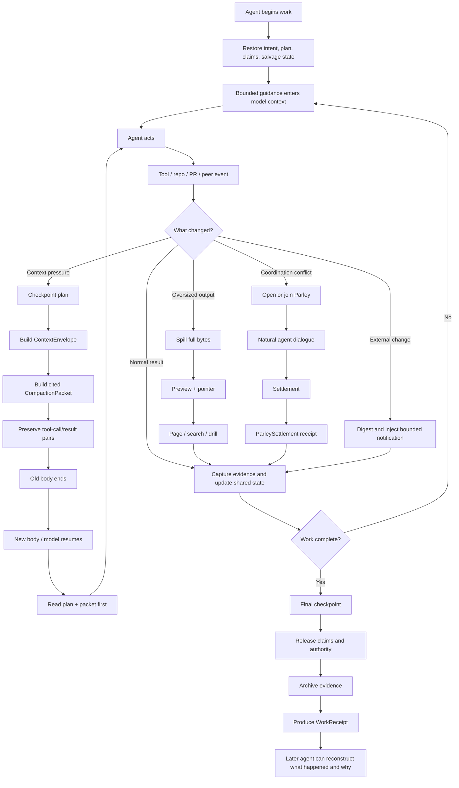
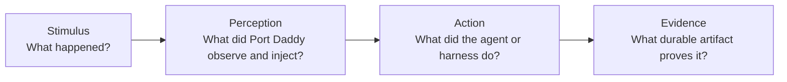
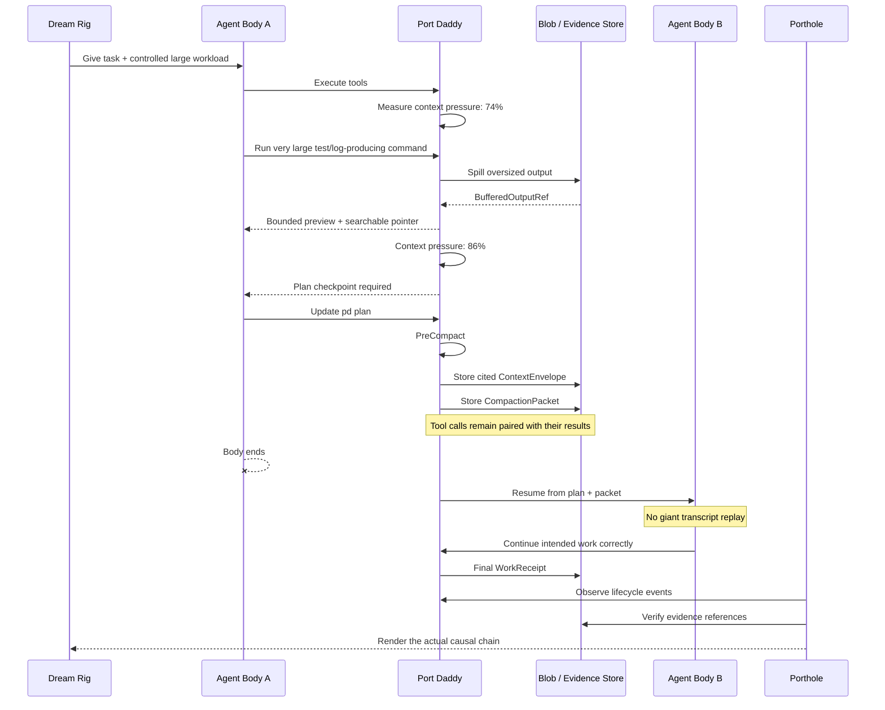
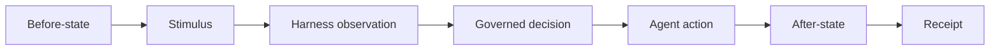
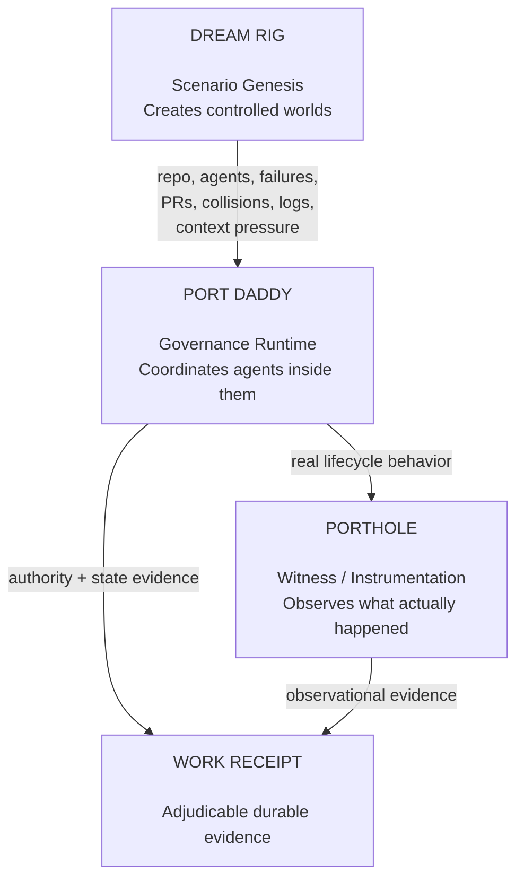
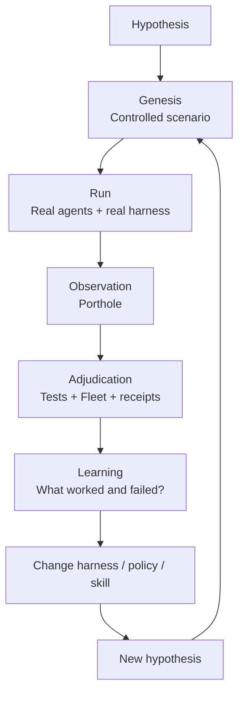
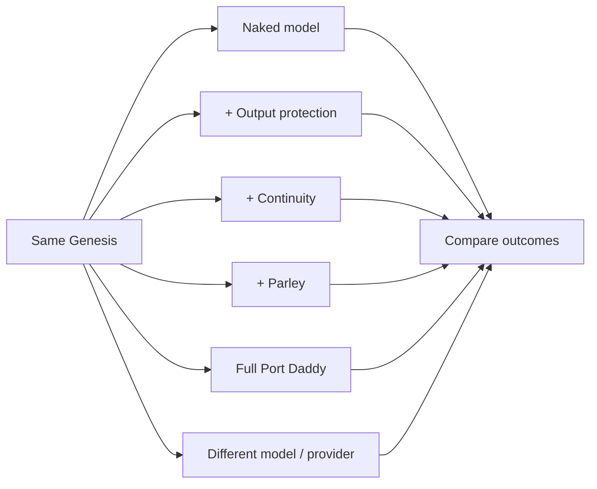
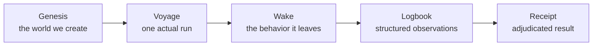
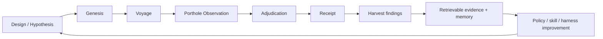

# Harness Lifecycle Proof

> Provenance: written by an agent during the night the author describes as the one time the product ran turnkey (agents coding, messaging each other, a fleet agent driving diffs to merge), and preserved here verbatim on 2026-09-07 because the book owes it a section. Component names have changed since; the vocabulary (Genesis, Voyage, Wake, Logbook, Receipt) and the invariant at the end are what the book takes. The substrate study in `studies/substrate-study/PROTOCOL.md` is a Dream Rig in this sense: each cell is a Genesis, each seeded run a Voyage, the CSV the Logbook, `REPORT.md` the Receipt.



## The proof model

Every meaningful lifecycle transition should prove four linked facts:



A context-compaction scenario, for example, is not:

> “Run the compaction command and show that it exits successfully.”

It is:



# What Porthole is recording

Porthole should not primarily record terminals.

It should record **causality**.

For every important event, the viewer should be able to answer:

- What condition existed before the harness intervened?
- What did Port Daddy know?
- What did Port Daddy actually put in front of the model?
- Which authority permitted or blocked the next action?
- What did the agent do because of it?
- What state changed?
- What evidence survived?
- Could another agent resume from that evidence?
- Can the result later be challenged or replayed?

That means the real unit of Porthole footage is not a command invocation.

It is a **provable transition**.



The movie is merely the human-readable projection of that transition.

The receipt is its machine-readable projection.

## Dream Rig, Port Daddy, and Porthole

These three should remain deliberately separate.



Dream Rig must be able to say:

> Create a repo with two agents whose intended edits overlap semantically but not textually. Give one an incoming PR review after three turns. Make the second tool output exceed the context-safe boundary. Drive Agent A above the PreCompact threshold.

Then Port Daddy gets no special favors. It has to deal with that world.

Porthole watches.

The receipt tells us whether it actually succeeded.

# The experimental loop

This is where the architecture becomes more than a demo harness.



The same Genesis can be replayed against different harness conditions:



Now Port Daddy can answer questions experimentally:

- Does compaction reduce task failure?
- Does Parley reduce duplicate work?
- Does bounded suggestion improve completion without creating distraction?
- Does a plan checkpoint improve cross-model resurrection?
- Does the full harness outperform a naked model enough to justify its token and latency costs?
- Which interventions help only under particular failure modes?
- Which skills improve behavior versus merely changing traces?

That is the system worth recording.

# What should this “Genesis” be called?

I would use **Genesis** for the instantiated test-world itself, not for the entire discipline.

A useful vocabulary would be:

**Genesis** — a reproducible initial world-state  	` plus perturbation schedule.

**Voyage** — one execution of a Genesis by a particular model/harness configuration.

**Wake** — the observable behavioral trace left by that Voyage.

**Logbook** — the structured observational record.

**Receipt** — the adjudicated claims we are willing to assert afterward.

That gives us a strong naval vocabulary:



A Genesis might therefore be something like:

> **Genesis: Contested Checkout**
>
> Two agents receive adjacent checkout work. Their plans collide at one semantic contract. Agent B crosses 85% context pressure while investigating a failing test. A review notification arrives while the Parley is active. Agent A finishes first.

You can run that Genesis twenty times.

Each is a different Voyage.

Each produces its own Wake and Logbook.

Each ends—successfully or unsuccessfully—with a Receipt.

# The larger discipline

For the overall system, the strongest name is **Harness Experimentalism**.

More technical alternatives are:

- **Agent Lifecycle Experimentation**
- **Harness Adjudication**
- **Behavioral Harness Verification**

The conceptual hierarchy is:

```text
Harness Experimentalism
    └── Genesis
         └── Voyage
              └── Wake
                   └── Logbook
                        └── Receipt
```

The key invariant is:

> **A harness claim is not established because a feature executed. It is established when a controlled Genesis produces an observable Voyage whose consequential transitions are supported by durable evidence and a valid adjudication receipt.**

## The closed loop

This gives Port Daddy a finite experimental loop rather than a write-only evidence system:



The important final edge is **back into the system**.

Evidence that is recorded but never retrieved is archival exhaust. The useful system records enough of the Voyage to support later retrieval, comparison, counterfactual analysis, skill extraction, regression detection, and policy improvement.

That makes the whole architecture:

**Dream Rig creates the Genesis. Port Daddy governs the Voyage. Porthole witnesses the Wake. The Logbook preserves the observations. Adjudication produces the Receipt. Harvesting feeds what was learned back into the next Genesis.**	