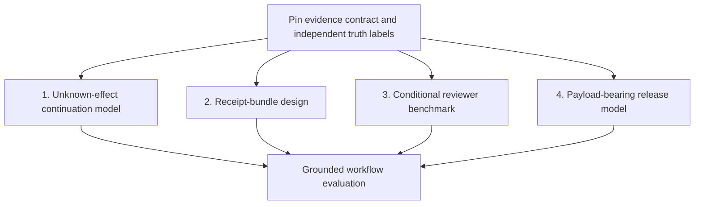

# Harbor research corpus reading — 28 September 2026

Reference notes and research triage. Scope: every top-level PDF in `docs/harbor-research/pdf`, read in case-insensitive alphabetical filename order. PDF page numbers below count the cover as page 1. Source documents are evidence to assess, not operational instructions.

## Method and progress

- Verified linked worktree: `/Users/erichowens/coding/tmp/paper-eight-observability-20260927`; feature branch `codex/paper-seven-evidence-20260927`; Git directory `/Users/erichowens/coding/port-daddy/.git/worktrees/paper-eight-observability-20260927`.
- Applied the checked-in Port Daddy agent/contributor skills and Harbor Results skill; the local runtime remains halted. No runtime, publication, or deployed-product proof is implied by this reading.
- Inventory: 30 PDFs, 318 pages. All PDF byte hashes differ. The inventory records read-input hashes from extraction, not hashes of subsequently regenerated PDFs; preserve these values as the reading provenance. Text extraction preserves page markers; matching text is compared explicitly rather than inferred from titles.
- Reading complete: files 1–30, all 318 pages accounted for; incremental reading notes retained below.
- Distinguish source claims, mathematical arguments checked during reading, finite synthetic evidence reported by a source, and live/empirical validation. Reading does not rerun a reported experiment.

## Inventory

| Order | PDF | Pages | SHA256 |
|---:|---|---:|---|
| 1 | [1-Revising-the-Treatise.pdf](../pdf/1-Revising-the-Treatise.pdf) | 6 | `33880188ecf633b5712027ea5bd837b9690b5ad98888ec28b11554052aa2ff56` |
| 2 | [2-Product-Direction-and-Roadmap.pdf](../pdf/2-Product-Direction-and-Roadmap.pdf) | 7 | `d94931eb8e8beff174c524a70b7947be3fc69e15c431393e4be0b03f406d3552` |
| 3 | [3-Research-and-Proof-Roadmap.pdf](../pdf/3-Research-and-Proof-Roadmap.pdf) | 5 | `bf1d5851655180c2d255146f8f26d713f5380671a3fc33e25e545dd54f663f64` |
| 4 | [4-Publishable-Papers.pdf](../pdf/4-Publishable-Papers.pdf) | 5 | `2d21b46f67440b8c68d2783faa8e11190d7d5d3ee9a8ac03a7b9934ed4ab24e0` |
| 5 | [Coordination-Papers-Review-and-Extensions.pdf](../pdf/Coordination-Papers-Review-and-Extensions.pdf) | 16 | `90ea848af0859b91d59d6c28e4aa6db3eab1501893d0ce4a645118595685d3a4` |
| 6 | [doc1_treatise.pdf](../pdf/doc1_treatise.pdf) | 6 | `eb8cd031f5f68d1b6bab350fd4ec0f6779abb1613e3715cba07c08cbb54dabf9` |
| 7 | [doc2_product.pdf](../pdf/doc2_product.pdf) | 7 | `2860b937050a0003832ee4eac759067a1d840c727f767835b8ce116a53825ed4` |
| 8 | [doc3_research.pdf](../pdf/doc3_research.pdf) | 5 | `a03c22ddb2987a742c7bb44afb43c363a4cb4f4c36dad1cfbcdd05f9bf2ecafd` |
| 9 | [doc4_papers.pdf](../pdf/doc4_papers.pdf) | 5 | `43bdb5d4f15a3b2fd3ce0f843fc0df9378a4f4c0227012ddef55bdd59b79992a` |
| 10 | [exec1.pdf](../pdf/exec1.pdf) | 5 | `b2092bbb1de77f9adcae2524871ec3805be19ee0a4c0d209c54164e8c938ec95` |
| 11 | [exec2.pdf](../pdf/exec2.pdf) | 5 | `e314586354560579dc5f05e1b43ec71824f83ff6d054c5968837b363ee3d2cda` |
| 12 | [exec3.pdf](../pdf/exec3.pdf) | 6 | `75ea1d08cbfc3ddc64fcdfaa1128fa96cca742cf5b4fcec1998e08741f73e127` |
| 13 | [exec4.pdf](../pdf/exec4.pdf) | 4 | `92fbd384b7cb4926a0510af24b9c20c20758686ba6159f8f3f9eadc718675d88` |
| 14 | [exec5.pdf](../pdf/exec5.pdf) | 6 | `91f0d0c08d316cec6dbb682053387297a0e165b33d9fb4dea1f4c1325a4fe7a4` |
| 15 | [Execution-Report-1-Legibility-Package.pdf](../pdf/Execution-Report-1-Legibility-Package.pdf) | 5 | `109a1d69488a50ca12bac079077370495bcab216b2252323173bcfd7e699192c` |
| 16 | [Execution-Report-2-Frontier-Controllability-Sheaf.pdf](../pdf/Execution-Report-2-Frontier-Controllability-Sheaf.pdf) | 5 | `154819b13a0a430fd3ec77c8ea0a60c46cded8b2973ae1dbf52686c4812b14c6` |
| 17 | [Execution-Report-3-Tower-WorkUnit-SealedRoom.pdf](../pdf/Execution-Report-3-Tower-WorkUnit-SealedRoom.pdf) | 6 | `1e007c675a644aed557c800fd3f2245b7e07276f2deff20087b9d17fc0b083ae` |
| 18 | [paper1.pdf](../pdf/paper1.pdf) | 16 | `6831ff8acec66c12844f8997e84da93e4055ef600a30fa31788c25f1e1a6e647` |
| 19 | [paper2.pdf](../pdf/paper2.pdf) | 14 | `8e748f3329fc04f21b6c4f796dab2b971153e525af4b458c2d51a81562224c2a` |
| 20 | [paper3.pdf](../pdf/paper3.pdf) | 12 | `7c868432ef73e5b649d44fd23ba67db14745b871e060ecc2def903b6387a8569` |
| 21 | [paper4.pdf](../pdf/paper4.pdf) | 17 | `89dcf1f33121b46530293fc2d278388cf9077ba17610c374165cf3fbfbeeda93` |
| 22 | [paper5.pdf](../pdf/paper5.pdf) | 14 | `a772a9c2ae2798d9422e1f90aa51c346ae7d52222136e04b3128fb27d549c643` |
| 23 | [paper6.pdf](../pdf/paper6.pdf) | 14 | `3e82b62cc51efe2d75e47b7f815a255b8c040db2b434daf80964a4f65f42a4e2` |
| 24 | [paper7.pdf](../pdf/paper7.pdf) | 11 | `25fdc6f53cab93a24488dc366545fb076c54b17bca7f492861161aca8f751667` |
| 25 | [paper8.pdf](../pdf/paper8.pdf) | 13 | `9d0522a5860704714d7a524d717d37cce9759ebaa15178355382d8b6d9184d80` |
| 26 | [portfolio.pdf](../pdf/portfolio.pdf) | 12 | `f5ac4c2937392d4f8f14ccd092a123cbe78aeb13df5c77a0a0021e998373c74b` |
| 27 | [Provable-Results-Portfolio.pdf](../pdf/Provable-Results-Portfolio.pdf) | 12 | `b1e44d8993387cdcd65e0cc4157e052ed5838230a4ded5ebb11788c6d4fb14a9` |
| 28 | [review.pdf](../pdf/review.pdf) | 16 | `5da9005ae7c20fa5908e4b2104a08d6b4ed3af31321a4e78fc9eda2273cba874` |
| 29 | [Sheaf-Cohomology-Lit-Review-Assessment-Prototyping-Plan.pdf](../pdf/Sheaf-Cohomology-Lit-Review-Assessment-Prototyping-Plan.pdf) | 12 | `89b34264679300afe3a91779cc8612ffa48778959035ff416c8f801f3894b088` |
| 30 | [The-Harbor-After-the-Harbor.pdf](../pdf/The-Harbor-After-the-Harbor.pdf) | 51 | `c3b49099f18f5dd8c5ec2cb8ba6711d6d7d089521f4b6463ee8c16c208087219` |

## Alphabetical reading notes

### 1. `1-Revising-the-Treatise.pdf` — 6 pages; read pp. 1–6

- **Candidate contributions:** effect-boundary fencing and conflict predicates (p. 1); principal-aggregated authority and sanctions (p. 2); typed evidence warrants and scoped assurance levels (p. 3); work-unit lifecycle, continuation, release policy, and authority before economic pricing (pp. 3–6).
- **Assumptions and gaps:** p. 4 upgrades transcript replay to a “sufficient statistic” for same-provider continuation without establishing provider state sufficiency; treat that as a conjectural assumption. Page 4 also turns model heterogeneity into independent audit cliques and a contraction claim without an empirical independence argument. Distinct model brands do not establish independent errors. Its instruction to gate all release channels requires a concrete observable-channel model.
- **Actionable questions:** what exact operation state permits safe cross-provider continuation after ambiguous remote success? Can correlated reviewer detection replace the independent-clique premise? Can an evidence-type checker reject a stronger claim than its verifier warrants?
- **Dependencies:** explicit acceptance policy, operation identities, principal binding, enforced effect channel, observed rather than assumed calibration. The stage-game correction on p. 1 is elementary, not a new research target.

### 2. `2-Product-Direction-and-Roadmap.pdf` — 7 pages; read pp. 1–7

- **Candidate contributions:** five assurance levels tied to actual channels (pp. 2–3); single-work-unit receipts and continuation safety (p. 3); review assignments with different information and held-out mutation tests (p. 4); finite release accounting and correlated underwriting (pp. 4–5).
- **Assumptions and gaps:** roadmap statements are proposed behavior, not implementation evidence. The p. 4 `(1-d)^k` assurance price requires conditional independence or a stronger conditional detection bound. Page 6 conflates a FULL checkpoint with the durable-commit policy stated on p. 2 of file 1; no durability theorem follows from that wording. The financial/regulatory and model-platform claims are unverified source assertions, not recommendations adopted here.
- **Actionable questions:** under a fixed cost/latency budget, does blinded information separation outperform repeated independent-looking reviews of the same patch? Which crashes leave an operation in unknown state, and how does a receipt let a successor resolve it safely?
- **Dependencies:** separate ground-truth defect labels, held-out mutation families, a declared threat model, and persistent operation identity. Market/underwriting work depends on measured failure correlations; it should not precede that evidence.

### 3. `3-Research-and-Proof-Roadmap.pdf` — 5 pages; read pp. 1–5

- **Candidate contributions:** falsification before formalization (p. 1); calibrated alerting, conserved privacy spend and inherited credit (pp. 1–2); supervisory control and a tractable commitment language (p. 3); work-unit safety/refinement and noninterference (pp. 3–4); explicit experimental comparisons (p. 5).
- **Assumptions and gaps:** the proposed sheaf gate on p. 4 asks a topology-dependent vector-space dimension to count faults; this cannot be adopted as a data detector. Its claim that a joint digest pays the sum of separate floors requires an explicit joint source/decoder model. Several short research tasks are already represented by executed results in the Harbor Results skill; check the papers before proposing them again.
- **Actionable questions:** which theorem assumptions survive real observation, missingness, and correlated failures? Which properties of a finite work-unit model lift to unbounded identifiers and concurrent actors?
- **Dependencies:** stable observation alphabets, adversarial counterexamples, declared truth/effect oracles, and empirical calibration. The p. 5 blind-review and cross-provider experiments remain stronger candidates than re-proving named textbook results.

### 4. `4-Publishable-Papers.pdf` — 5 pages; read pp. 1–5

- **Candidate contributions:** focused units for summary design, enforcement, reviewer incentives, release control, continuity, and authority (pp. 1–4); experimentally gated artifact paper (pp. 4–5).
- **Assumptions and gaps:** page 1's absence-of-prior-art statement about binary one-sided distortion is not a novelty proof. Page 2's heterogeneity-to-independence inference is unproved. The file's “Paper 8” names a systems artifact, whereas the actual `paper8.pdf` must be identified by its contents. Numbering alone does not identify a result.
- **Actionable questions:** can one operational decision and one falsifiable claim be isolated per submission? Which positive theorem survives the strongest equal-information baseline?
- **Dependencies:** primary-literature checks, genuine data, and full hypothesis statements; no venue-readiness or time estimate here is accepted as evidence.

### 5. `Coordination-Papers-Review-and-Extensions.pdf` — 16 pages; read pp. 1–16

- **Candidate contributions:** separate strategic principal behavior from stochastic model error (pp. 1–2); shared provenance with reader-specific projections (pp. 2–3); mechanism proposals for role queues, context paging, sidecar evidence and continuation (pp. 8–12); typed conflict detection with chartered resolution (pp. 12–14); explicit release channels (pp. 14–15).
- **Assumptions and gaps:** p. 7's tower contraction is asserted from sealed selection without a complete bribery game. Page 10 says sampled deterrence restores “zero-miss in expectation”; stochastic detector error and incentive compliance do not imply that conclusion. Page 8's connected-graph log argument assumes enough overlap comparability and does not by itself prove all hidden claims agree. Page 9's inbound `O(f s log n)` load needs a workload/arrival distribution. Page 6's unconditional newcomer dominance is contradicted by file 1's numeric counterexample.
- **Actionable questions:** formalize correlated and non-strategic audit failures; test a sidecar against omission and valid-but-irrelevant evidence; distinguish bounded runtime observations from all feasible external effects; characterize safe continuation after an unknown effect outcome.
- **Dependencies:** information-separated reviews, verifiable structural facts, external-effect observation contracts, principal attribution, and a declared release channel set. No legal, financial, or platform claim is adopted solely from this review.

### 6. `doc1_treatise.pdf` — 6 pages; reviewed pp. 1–6 against file 1

PDF byte hash differs. Exhaustive extracted-text comparison, including page markers, finds only terminology substitutions to “critical” and resulting line wrapping. Claims, page locations, gaps, questions, and dependencies match file 1. No additional mathematical claim appears.

### 7. `doc2_product.pdf` — 7 pages; reviewed pp. 1–7 against file 2

PDF byte hash differs. Exhaustive comparison finds only bullet-glyph encoding changes. All content, page-specific notes, gaps, questions, and dependencies match file 2; no distinct research result is inferred from the second filename.

### 8. `doc3_research.pdf` — 5 pages; reviewed pp. 1–5 against file 3

PDF byte hash differs. Exhaustive comparison finds substitutions to “critical,” math/bullet glyph encoding, whitespace, and wrapping. Mathematical and experimental proposals, cited pages, limitations, questions, and dependencies match file 3.

### 9. `doc4_papers.pdf` — 5 pages; reviewed pp. 1–5 against file 4

PDF byte hash differs; page-marked extracted text is exactly identical. This is a text alias, not a claimed byte duplicate. The novelty cautions, content-based identification requirement, questions, and dependencies in file 4 apply unchanged.

### 10. `exec1.pdf` — 5 pages; read pp. 1–5

- **Results:** calibrated expected-loss alerting (pp. 1–2), conflicting reader rankings and a shared-open-budget covering bound (pp. 2–3), a literal finite-bit synthetic encoder experiment (pp. 3–5).
- **Check/gap:** the displayed odds threshold on p. 2 is algebraically wrong when attention cost is positive. From `C a >= c + F(1-a)`, the posterior threshold is `(c+F)/(C+F)`; for `C>c`, posterior odds must exceed `(c+F)/(C-c)`, not `(c+F)/C`. Example `C=10,c=2,F=0,a=.18`: true rule rejects inspection (`1.8<2`), displayed odds rule accepts (`.18/.82>.2`). This is a bounded correction, not a proposed new theorem. The p. 3 “best achievable” success expression is generally a counting upper bound, not guaranteed achievable by a finite codebook. Inspect `paper1.pdf` for its exact statements.
- **Questions/dependencies:** quantify query costs and correlated inspection errors before translating synthetic bit/opportunity counts to human time. Two incompatible rankings require distinct projections; they do not prove two distinct model processes are necessary.

### 11. `exec2.pdf` — 5 pages; read pp. 1–5

- **Results:** binary rate/open/miss tradeoff and ideal group-test queries (pp. 1–2), finite controllability checker (pp. 2–3), constructed cycle residual demonstration (pp. 3–4).
- **Check/gap:** a signal retained by the residual method but withheld from direct comparison is unequal information; the stated unique-detection comparison on pp. 3–4 cannot establish practical advantage. The actual visible coordinate graph matters, and deleting a receipt differs from declining to compare retained claims. The frontier is monotone under constraint relaxation; the text correctly clips its zero-rate regime. Group tests assume a reliable group oracle and comparable query cost.
- **Questions/dependencies:** equal-information receipt acquisition remains open; the cycle and one-edge identities themselves are covered by the current Paper 7 work. An operational zoom experiment needs an explicit noisy, costly group-query mechanism.

### 12. `exec3.pdf` — 6 pages; read pp. 1–6

- **Results:** audit stage-game threshold, a stylized bribery/tower model and reputation-dependent schedules (pp. 2–4); 536-state work-unit check with five guard mutations (pp. 4–5); finite two-run secret-equivalence check to depth 7 (pp. 5–6).
- **Assumptions/gaps:** each result remains conditional on its state/observation model. The `O(1)` audit-cost limit needs independent unaudited discovery and increasing forfeitable continuation value. Finite state enumeration does not show a daemon refines the model, prove arbitrary population safety, or establish liveness. Page 3's tower language needs a clearly defined finite termination tolerance; infinite-depth certification is not supplied by a finite recurrence plot.
- **Questions/dependencies:** characterize the complete journal needed for unknown-outcome recovery; prove a parameterized model invariant; measure conditional detection after previous reviewers miss. These tasks rely on different evidence and can run in parallel.

### 13. `exec4.pdf` — 4 pages; read pp. 1–4

- **Results:** atomic privacy-ledger invariant and imported composition (pp. 1–2); hypergeometric canary power and sequential detection (pp. 2–3); transfer-based conservation of live inherited credit (pp. 3–4).
- **Assumptions/gaps:** privacy requires every release mediated and correctly priced, beyond ledger equality. Canary independence/secrecy are explicit; correlated stripping defeats exponential amplification (p. 3). The report gives the Wald expectation as an equality in the theorem box but calls it an approximation in the boundary; 297 predicted versus 359 simulated exposes overshoot. No-mint applies to economic/voting credit, not necessarily epistemic Bayesian evidence: copying evidence to another reasoner need not debit the first reasoner's belief.
- **Questions/dependencies:** anytime-valid detection against adaptive leakage may be valuable, but needs a declared null and calibrated conditional detection. Keep evidence provenance and conserved authority weight conceptually separate. Do not re-propose A3/A4/A6 as untouched research.

### 14. `exec5.pdf` — 6 pages; read pp. 1–6

- **Results:** disclosed engine pricing and principal-wide sanctions (pp. 1–2), escalation threshold/tuning band (pp. 2–3), service-pool comparison with failure/recovery (p. 3), corrupted context-pin analysis (p. 4), finite commitment-language boundary (pp. 4–5), scalar residual results (pp. 5–6).
- **Assumptions/gaps:** engine pricing is a two-period model; exponential arrivals/service/recovery limit queue conclusions. The pin proof needs the exact oracle-consultation and repair-on-touch semantics; experiments do not prove its pathwise perturbation charge. The conflict bound must include output size when enumerating all conflict pairs. Sender-constrained errors can cancel even with one sender, so p. 6's single-equivocator language is insufficient for blanket detection. Current Paper 7 already states that boundary precisely.
- **Questions/dependencies:** queue tails and unknown outcomes are more operationally relevant than another mean-only rule. An output-sensitive incremental conflict checker could be useful but must beat simple indexed constraint checking and prove the combined semantics, not merely combine three classical bounds.

### 15. `Execution-Report-1-Legibility-Package.pdf` — 5 pages; reviewed pp. 1–5

Full page-marked text compared with `exec1.pdf`. Shared statements and gaps are those of file 10. Distinct source facts: p. 4 reports 8/16 spurious violations, whereas `exec1.pdf` p. 4 reports 8/14; the figure labels are not extracted in this PDF, and nearby prose shifts across pp. 4–5. Neither ratio is independently rerun here. All conclusions about the demonstrated counting bound remain scoped to synthetic encoders.

### 16. `Execution-Report-2-Frontier-Controllability-Sheaf.pdf` — 5 pages; reviewed pp. 1–5

Full page-marked text compared with `exec2.pdf`. Distinct mathematical disagreement on p. 2: this PDF calls an increasing rate near relaxed miss tolerance a real geometric feature; `exec2.pdf` calls it a domain error. Relaxing a constraint enlarges the feasible set, so its infimum cannot increase: the latter interpretation is correct. Shared results/gaps/questions/dependencies are in file 11. This is content reconciliation, independent of filename or chronology.

### 17. `Execution-Report-3-Tower-WorkUnit-SealedRoom.pdf` — 6 pages; reviewed pp. 1–6

Full page-marked text compared with `exec3.pdf`. Mathematical statements match; differences are wording, figure extraction, glyphs, and paragraph page breaks. The tower boundary begins on p. 3 and continues p. 4; the finite work-unit boundary remains p. 5; the secrecy boundary spans pp. 5–6. Questions and dependencies are as in file 12. No second independent experiment is inferred from this second report filename.

### 18. `paper1.pdf` — 16 pages; read pp. 1–16

- **Established within the stated model:** literal-message counting lower bound (pp. 2–3), incompatible ranking objectives (pp. 3–5), posterior expected loss (pp. 5–9), pinned Bernoulli joint distribution (pp. 8–9), and an explicit query-count bound for plain halving (pp. 10–12).
- **Narrow repair priority:** Theorem 3 p. 6 repeats the incorrect odds denominator documented for `exec1.pdf`; its probability-threshold worked example and Figure 6 p. 9 use the correct formula. Page 3 describes the counting upper bound as an achievable optimum without a covering construction. Page 12 uses strict “exceeds 1” at `d=1/12`, where the expression equals 1. These are corrections before extending the theory.
- **Assumptions/gaps:** p. 15 explicitly assumes unit-cost reliable group queries; the average-source frontier and cheap-zoom example do not share an operating point. The comparison on p. 9 uses `log choose(N,k)` without subtracting the open-budget term, so it compares different flag budgets. A common ranking is possible when reader tie refinements are compatible; “agree on every pair” needs careful treatment of ties. General summary representations need not be scalar rankings.
- **Actionable question:** when query cost grows with group size and errors are correlated, which inspection policy actually reduces human time at a fixed miss budget? First compare flat inspection and established adaptive group testing under identical query information/cost. Dependencies: realistic group-query interface and independently labelled critical items; novelty needs a primary-literature audit of noisy/cost-sensitive group testing and vector distortion constraints.

### 19. `paper2.pdf` — 14 pages; read pp. 1–14

- **Results:** exact-policy realization through controllability (pp. 3–5), nine-policy synthetic checker (pp. 5–7), two-state supervisor and an empty supremal-language example (pp. 8–9), partial-observation direction (p. 9).
- **Assumptions/gaps:** inability to realize *all* legal traces does not mean prevention is impossible: a stricter nonempty safe sublanguage may remain. The paper defines exact realization carefully but pp. 4–5 sometimes infer a universal “detect only” consequence. An unobservable semantic trigger is not always permanently unknowable: an externally certified factual predicate could change the observation model. Pages 9–12 acknowledge the direct supervisory-control/norm-enforcement prior art; another renamed controllability theorem offers little mathematical novelty.
- **Actionable question:** given ambiguous effect outcomes and delayed receipts, synthesize the least restrictive policy that prevents repeats while stating the liveness cost. Dependencies: an explicit partial-observation model and concrete adapter capabilities. A receipt's benefit should be measured by which safe actions it enables, rather than by log volume.

### 20. `paper3.pdf` — 12 pages; read pp. 1–12

- **Results:** correctly separated keep-gain/confiscation stage games (pp. 4–5), affine single-level sealed-bribery calculation (pp. 5–7), and conditional declining audit schedules (pp. 7–9).
- **Assumptions/gaps:** clique disjointness is stipulated on p. 6, asserted to come from model diversity on p. 10, and acknowledged to require measurement on p. 11. Statistical error correlation and coordinated economic bribery are distinct. The recursion is a stylized expected-value model, not a calibrated probability of false approval. `O(1)` auditing requires unbounded forfeitable stake or sufficient unaudited revelation; bounded stake and changing engines threaten that premise. Theorem 3 p. 8 presents the continuous triangle area as a bound for a discrete sum although the p. 8–9 example itself exceeds it (41.79 versus 41.67); the asymptotic class survives, exact constant does not.
- **Actionable question:** how many additional *conditional* detections does a reviewer buy after previous reviewers have missed, at a fixed budget? Test information-separated roles against same-patch repeats and randomized equal-cost assignment. Dependencies: held-out grounded defects, time/price accounting, uncertainty estimates for joint misses, and no strategic incentive claim for non-strategic model errors.

### 21. `paper4.pdf` — 17 pages; read pp. 1–17

- **Results:** committed-input parity release verified for four secrets/depth 7 (p. 5), explicit payload-laundering limitation (p. 7), controlled egress theorem (pp. 7–9), adaptive privacy-filter distinction (pp. 9–10), canary assumptions and approximate sequential latency (pp. 11–12), output-channel capacity account (p. 13).
- **Assumptions/gaps:** its current `submit` transition carries no payload, so it cannot express `t=f(secret)` followed by honest `g(t)` (p. 7). The paper explicitly distinguishes a valid DP mechanism from a malicious worker declaring a number (p. 10). Noninterference for a trusted committed-input gate does not directly cover adversarial release candidates; `q*b` is an observation-alphabet cap, with timing/termination and adaptive release metadata excluded unless charged. “Attested” deployment and side properties on p. 3 are design assertions here, not deployment evidence.
- **Actionable question:** which typed release contract preserves confidentiality when the candidate, query selection, stopping, and status metadata are adversarially chosen? Build the smallest payload-bearing model and prove a transcript-capacity bound; compare a trusted fixed function of committed data, a public constant output, and worker-supplied candidates. Dependencies: declared observation alphabet, commit-bound input identities, and gate authority. This model gap should be resolved before mechanizing the present payload-free model at arbitrary depth.

### 22. `paper5.pdf` — 14 pages; read pp. 1–14

- **Results:** transfer conservation of live voting/economic weight (pp. 2–5), quality-price pass-through explicitly required for incentive alignment (pp. 5–7), bounded migration protocol and principal-wide sanctions (p. 8), capped front-loaded probation via exchange argument (pp. 9–11).
- **Assumptions/gaps:** p. 2 repeats an unconditional cheap-identity impossibility inconsistent with the numeric counterexample in file 1 p. 2; accessible newcomer utility must be compared with sanctioned continuation utility. The capped probation statement has a proof but no cap-aware sweep (pp. 10–11); verifying it is a bounded validation task, not automatically new research. The migration model proves score attribution at a tiny depth, not actual task resumption, uncertain external-effect handling, or checkpoint sufficiency. The mathematical conservation object is scarce credit, not all knowledge derived from an episode.
- **Actionable question:** determine the smallest capsule/journal that supports safe recovery across a provider change when a remote effect may have occurred but its acknowledgment is lost. Dependencies: effect identities, crash points, readback/idempotency guarantees, and inherited obligations; compare standard durable workflow replay before claiming novelty.

### 23. `paper6.pdf` — 14 pages; read pp. 1–14

- **Results:** a ground monotone Horn/interval/difference-constraint fragment and a satisfiability reduction (pp. 3–6); exact mean-cost specialization threshold (pp. 7–8); failure/recovery floor with correct domain and finite-skill boundary (pp. 8–10).
- **Narrow repair priority:** pp. 1–7 repeatedly infer that NP-completeness requires a human/chartered resolver. Complexity supplies no such conclusion: a solver remains an algorithm, and human judgment does not remove worst-case search. Authority to choose norms is separate from computational complexity. Theorem 1a p. 4 claims it finds *every* overlap within sorting time; enumerating quadratically many overlapping pairs requires an output-size term. Decision or one witness can have the stated faster bound.
- **Assumptions/gaps:** independent ground intervals and deadline variables exclude symbolic endpoints coupling these subsystems (p. 12). Queues assume exponential arrivals, service, failures, recovery, and preemptive resume; p. 12 explicitly omits tail latency. Five-atom sweeps do not measure production scaling.
- **Actionable questions:** can incremental conflict detection retain tractability with the scheduling features actually needed? Can a tail-risk/repair-delay model identify cases where a specialist looks good on means but misses recovery objectives? Both first need workload evidence; simple indexed checks and a warm standby pool are mandatory baselines.

### 24. `paper7.pdf` — 11 pages; read pp. 1–11

- **Results:** exact one-edge effective-resistance residual and sender blind-space dimension `h−1` (p. 4), direct-observation domination on the same endpoint evidence (pp. 5–6), constrained versus unrestricted repairs (p. 7), complete projected noise balls and strict `>2ε` identification boundary (pp. 8–9), and the marginal receipt innovation formula (pp. 9–10).
- **Assumptions/gaps:** comparisons must preserve feature/coordinate semantics, source identity, snapshots, and the visible observation graph. The converse noise statement requires complete balls; sender-constrained errors can have smaller feasible sets. A cycle residual cannot certify truth or identify a culprit. The synthetic cases on p. 6 do not measure deployment. A new bridge has zero immediate residual gain but can enable later informative cycles.
- **Actionable question:** choose affordable authenticated receipt *bundles* to separate a specified finite failure library. The parent's independently checked example has base `01=0` and isolated vertex 2; queries `12=1` and `20=0` each give zero residual alone but jointly give squared residual `1/3`. Thus a zero-gain greedy stop is invalid, and ordinary submodularity guarantees cannot be assumed. Compare exhaustive tiny-instance bundle search with direct equal-information checks and cost-matched random acquisition. Dependencies: genuinely distinguishable hypotheses, candidate receipt costs and availability, observation contracts, and noise assumptions; reuse the existing formulas rather than presenting them as fresh research.

### 25. `paper8.pdf` — 13 pages; read pp. 1–13

- **Results already present:** typed face/harmonic decomposition and the fixed-information face-attachment limit (pp. 2–4); edge-group code distance and sparse stability (pp. 4–5); relative extension (p. 5); direct endpoint dominance (p. 7); finite-signature separation and three-edge-connectivity (p. 8); `λ(G)>2k` arbitrary sparse-error identification and redundant-observation monotonicity (p. 9). These must not appear as uncompleted theorem suggestions.
- **Assumptions/gaps:** the typed fixture uses count features; hashes/approvals require symbolic checks. A face relation without a new measurement cannot increase total completion detection (p. 4). Relative class zero proves possible extension, not actual hidden truth. Metadata equality in the graph fixture is not signature verification (p. 5). Synthetic intervention maps need independent validation before they can name operational failures (pp. 10–12).
- **Actionable question:** can provenance-bound partial disclosure make acquisition cheaper for a declared failure library than direct authenticated checks receiving the same evidence? The paper explicitly sets this field gate (pp. 11–12). Pair this with Paper7 bundle selection, carrying all direct baselines; do not add a parallel project that merely proves another finite-signature or sparse-mincut criterion.

### 26. `portfolio.pdf` — 12 pages; read pp. 1–12

- **Candidate inventory:** summary decisions, release accounting, canaries, routing, reputation budgets (pp. 2–5); digest/zoom, audit towers, control, conflicts, substitution, probation and escalation (pp. 5–10); paging, noninterference and trade subsidies (pp. 10–11).
- **Reconciliation with actual papers:** many proposed deliverables are already addressed by Papers1–6 and execution reports. This inventory is a source of hypotheses, not a completion tracker. The mathematical necessity claim for separate scalar heads (p. 2) does not exclude a vector representation with reader-specific projection. The false-silence probability on p. 9 has the sign reversed if urgency above `ucrit` is genuinely urgent: silence mass is `max(0,F(u*)−F(ucrit))`. The pin-oracle claim on p. 10 needs a bounded damage model: a single erroneous permanent pin can repeatedly displace useful requests, so corruption count alone does not justify one refetch per error.
- **Assumptions/gaps:** uniform canary placement does not by itself imply independent detector misses (p. 4); scalar declared ε is not a DP guarantee (p. 3); total inherited credit over all historical DAG nodes is not conserved unless spending removes or debits parents (pp. 4–5). Expected fee balance (p. 11) is not pathwise solvency or a complete mechanism-design iff. These are scoped concerns, not proofs that all possible corrected models fail.
- **Actionable question:** prioritize measurable premises of these proposals. Of the unexecuted items, noisy query cost and conditional reviewer detection connect to concrete operational losses; subsidy and untrusted paging claims need considerably more model work before a research promise.

### 27. `Provable-Results-Portfolio.pdf` — 12 pages; read pp. 1–12 by exhaustive comparison with file 26

- **Content reconciliation:** all normalized-token differences inspected. Content matches file26's candidate portfolio; differences are terminology substitutions, mathematical extraction glyphs, hyphenation and page placement. The candidate B1 objective begins p. 6 here; B4 begins p. 7 and continues p. 8; the final instrumentation caveat reaches p. 12.
- **Results, assumptions, gaps, questions:** the file26 findings apply with those page shifts. In particular the false-silence formula remains on p. 9 and the untrusted-pin claim remains on p. 10. Byte hashes differ (inventory); this comparison is not an independent proof or experiment.

### 28. `review.pdf` — 16 pages; read pp. 1–16 by exhaustive comparison with file 5

- **Content reconciliation:** all normalized-token differences inspected; the substantive review, solved examples and proposed targets match `Coordination-Papers-Review-and-Extensions.pdf`. Differences are terminology, typography/extraction and wrapping. This is a textual counterpart, not additional validation.
- **Results/assumptions/gaps/questions:** file5 notes apply. In particular the proposed audit contraction still requires a concrete independence/corruption model; the context-paging claim needs a correctly matched cache theorem and pin assumptions; mediation alone leaves gate semantics as an oracle. The direct-corpus papers supply the relevant bounded executions. No recommendation is counted twice because both names occur in the inventory.

### 29. `Sheaf-Cohomology-Lit-Review-Assessment-Prototyping-Plan.pdf` — 12 pages; read pp. 1–12

- **Useful scope:** names cellular sheaf, contextuality, consistency-radius and forensic-evidence literatures (pp. 2–6), and explicitly demands equal-information baselines and falsification (pp. 10–11).
- **Demonstrable structural errors:** for fixed maps, `dim H¹` is fixed, so it cannot count injected faults as proposed on pp. 8–11. The unconstrained minimum-norm element of `ker L₁` is zero (p. 8); localization needs a specified observed class. A constant-sheaf honest cycle has nonzero H¹, refuting “H¹ nonzero iff equivocation” on p. 7. Ordinary finite prefix-ordered logs are not a join-semilattice when two branches have no common extension (pp. 5–6). The square-root sum of squared discrepancies introduced on pp. 3–4 is not the maximum discrepancy claimed on p. 9: two unit discrepancies give `√2`, not 1. Whether a different chosen consistency-radius definition uses a supremum must be stated.
- **Unsupported inference:** a forensic impossibility under specified protocol assumptions is not an invitation for cohomology to infer missing information from the same states (pp. 1, 8, 11). The proposed “quotient out topology” does not produce a fault count. Random real embeddings of cryptographic roots (pp. 7, 10) do not preserve semantic distances. Payload causation/localization requires signatures and independent observations, not just harmonic support.
- **Reconciliation/dependencies:** Papers7–8 supply precise selected-evidence results and acknowledge these boundaries. The viable continuation is authenticated observation design under partial disclosure and cost; do not implement this document's unqualified counting/localization goals. Primary references require verification before reuse; search-result labels embedded in this PDF are not citations proving its claims.

### 30. `The-Harbor-After-the-Harbor.pdf` — 51 pages; reading ledger

- **pp. 1–14 read:** contents/reader framing (pp. 1–7); work-unit lineage and expected value per inspection second (pp. 7–8); principal-level exposure and confidentiality (p. 9); claim corrections (pp. 10–12); assurance ladder and omission audit ledger (pp. 13–14).
- **Concrete premises worth retaining:** exact-key uniqueness does not exclude intersecting intervals `[10,30]` and `[20,40]`, and lease-table ownership without downstream fencing does not exclude a resumed stale actor (p. 10). Signatures prove attribution/integrity rather than event completeness/truth (p. 12). Operator attention should account for available intervention and inspection quality, beyond probability times stakes (p. 8). An omission audit needs a complete candidate-capture boundary (p. 14).
- **Status caution:** references to product readiness and manuscript defects here are evidence about the proposed architecture/text; they are not a current source or runtime audit. The local runtime remains halted.
- **pp. 15–28 read:** grounded deterministic verification versus subjective judgment (p. 15), actual inspection-time and decision-loss frontier (p. 16), logged selection propensities (p. 17), hidden continuation tasks and mandatory-obligation coverage (p. 18), fault-class durability/fencing (pp. 19–20), task capsules and finite conformance versus proof (p. 21), principled actor replacement (pp. 22–24), causal skill exposure and conditional review detection (p. 25), partitions and tombstone freshness (p. 26), settlement/transfer integrity (pp. 27–28).
- **Research dependencies clarified:** p. 18 explicitly warns that arbitrary complementarity removes the usual greedy submodularity bound; this supports bundle-aware Paper7 follow-up. Page 21 names pending-effect/idempotency state as indispensable to continuation; protected receipts are stronger than prose checkpoints. Page 25 distinguishes causal evaluation of skills from observed successful grafts and correctly requires a conditional detection probability for audit deterrence. Page 28's split-view example states that no method detects before evidence meets, directly limiting file29's proposed partition advantage.
- **Cautions:** p. 17 says operator digest and context compaction “must be the same ... projection,” while reader-specific losses elsewhere require distinct projections from the same durable sources; shared provenance is the safe common requirement. Page 20's broad enforcement iff still needs partial-observation and exact-versus-restricted-policy distinctions from Paper2.
- **pp. 29–42 read:** declared final authority versus truth (p. 29), hopwise attenuation and proof-harness scope (p. 30), corrected game matrix and evidence/capital caveats (pp. 31–33), dissemination assumptions (p. 34), typed messages and fenced role epochs (pp. 35–36), lower-privilege projection and effect mediation (p. 37), causal skill experiments (p. 38), provider-neutral continuation (p. 39), review independence (p. 40), and conflict/impact models (pp. 41–42).
- **Strong task evidence:** p. 39 gives the indistinguishable-hidden-state obstruction to exact trajectory restoration and demands reconciliation of unresolved effects before retry. Page 40 explicitly rejects an independence assumption for reviewers and asks for pairwise/higher-order joint misses, protected heldouts, and pre-patch property writing. Pages 41–42 separate conflict detection from who may decide a tradeoff; this contradicts Paper6's inference from NP-completeness to a required human algorithm.
- **Model cautions:** at-most-once effects cannot follow from a local journal alone when the remote adapter lacks deduplication/readback; this must become an explicit capability assumption. The role-epoch statement on p. 35 means at most one *currently authorized* epoch at an effect's linearization point, not that only one epoch can ever have produced an accepted effect.
- **pp. 43–51 read; file complete:** federation/modal boundaries and the two-principal confidential work order (p. 43); dual key release and whole-worker labels (p. 44); payload, timing, receipt and adaptive-output leakage (pp. 45–46); small work-unit transition system (pp. 47–48); proposed build sequence and references (pp. 49–51).
- **Result candidates:** the declared finite observation alphabet can give a transcript capacity bound; payload-bearing robust declassification needs a stricter model than label monotonicity (pp. 45–46). The work-unit model separates authorization, effects, claims, review and settlement (pp. 47–48); a finite model is a useful first deliverable, with fairness/reachability required for liveness.
- **Assumptions/gaps:** attestation, complete mediation, gate correctness and excluded side channels are explicit hypotheses (p. 45), not outcomes established in this memorandum. A generic natural-language confidentiality scanner is not a substitute for a release contract. The federation summary on p. 43 is a design heuristic; invariant confluence depends on the exact operations/invariant and must be checked before asserting every finite-budget design needs the same coordination structure.

## Narrow correction queue — separate from the research agenda

These findings concern stated formulas or implications. They do not establish a broad failure of the surrounding program, and no source paper was edited during this reading.

| Priority | Demonstrable issue | Witness and bounded repair |
|---|---|---|
| 1 | `paper1.pdf` p. 6 Theorem 3; also `exec1.pdf` p. 2: the printed odds expression is not equivalent to the expected-cost rule. Current source: [`paper1.tex:129`](../tex/paper1.tex#L129). | Write `Ca ≥ c+F(1−a)`, hence `a ≥ (c+F)/(C+F)` when `C+F>0`. For `C>c` and `a<1`, odds are `a/(1−a) ≥ (c+F)/(C−c)`, not denominator `C`. Counterexample `C=10,c=2,F=0,a=.18`: inspection costs2 and avoids1.8, so decline; printed odds `.18/.82>.2` inspect. Handle `C≤c` and endpoint `a=1` directly instead of dividing by a nonpositive denominator. |
| 2 | `paper3.pdf` p. 8 Theorem 3 states a continuous triangle area as a bound/limit for a discrete schedule. Current source: [`paper3.tex:160`](../tex/paper3.tex#L160); p. 8–9's “exactly half the first term” is also inexact here. | With `G=10,d=.8,B=50,a=1,v=.6,r=.05`, `t*=1000/3`. Exact rational arithmetic gives `Σ(t=0..333)(10−.03t)/40 =167167/4000=41.79175`, above `aG²/(2dBrv)=125/3≈41.666667`. Excess is `1501/12000≈.12508333`, not exactly `.125`. With `n=ceil(G/(rv))`, exact lifetime spend is `a[nG−rv n(n−1)/2]/(dB)`. The `O(1)` conclusion holds for fixed positive parameters. |
| 3 | `paper6.pdf` p. 4 Theorem 1a promises enumeration of every interval overlap in sorting time. | For n identical exclusive intervals on one resource, output contains `n(n−1)/2` pairs. Add the output-size term or state a decision/one-witness result. |
| 4 | `paper6.pdf` pp. 1–7 derives a required human/chartered resolver from NP-completeness. | NP-completeness is compatible with exhaustive/SAT solving and does not prove any human requirement. Separate computational cost from the authority to choose or waive a policy. |
| 5 | `paper5.pdf` p. 2 repeats an unconditional free-identity argument. | `1-Revising-the-Treatise.pdf` p. 2 and `The-Harbor-After-the-Harbor.pdf` pp. 11,23 give score10, sanction2, newcomer0: accessible best score falls to8 even with free minting. State the utility/access condition under which resetting evades the sanction. |

Other items in per-file notes are explicitly *cautions or untested premises* unless a witness is given. In particular, reviewer independence, trusted gates, calibrated anomaly scores, complete event capture and representative intervention signatures are measurement/model obligations. Reading their statement does not verify them.

## Ranked next research tasks

**Recommendation:** start the safe-continuation model and the receipt-acquisition study in parallel; prepare the reviewer experiment as an independent empirical lane. Keep payload-bearing declassification as a fourth, independently scoped formal lane if there is capacity. This ranking weights concrete operational losses before breadth of theory. These are proposed studies, not demonstrated deployments or claims of novel theorems.

### 1. Safe continuation when an external effect has an unknown outcome

- **Corpus basis:** `paper2.pdf` p. 9 (partial observation); `paper5.pdf` p. 8 (migration proves sanctions, not effect recovery); `The-Harbor-After-the-Harbor.pdf` pp. 21,39,47–48 (pending-effect journal, reconcile before retry, work-unit model).
- **Operational value:** prevents a successor from repeating a consequential request after the original actor loses its acknowledgment. Also states exactly when safe progress must stop.
- **First deliverable:** a finite transition model of one work unit, two actor epochs, one remote effect and crashes before/after remote commit and local receipt persistence. Give adapters three explicit capabilities: atomic deduplication with durable result, authoritative readback with stated consistency, and neither. For each observable capsule state, enumerate the concrete worlds it permits and the intersection of safe actions. Produce shortest counterexample traces for unsafe retry, stale epoch, missing key and premature receipt garbage collection.
- **Prerequisites:** stable operation identity across actor replacement; authenticated adapter result; declared retention and consistency; explicit distinction between effect occurrence and settlement; capability/epoch checked at the actual effect boundary. No hidden remote-state oracle.
- **Bounded proof:** an observation-equivalence class containing both “effect committed” and “effect never occurred” cannot support an unconditional non-idempotent retry that guarantees no duplicate in both worlds. Then prove the proposed policy's safety and identify the extra adapter evidence needed for eventual completion. This is a specialization of classical indistinguishability/control reasoning, not a new general impossibility.
- **Simpler baseline:** a durable outbox plus remote idempotency key and stored result; also a conservative “unknown means stop and reconcile” policy. Compare accepted safe continuations, duplicate effects, unrecoverable unknowns, and recovery steps.
- **Falsifier/stop rule:** any admitted trace repeats an effect or accepts a stale actor, or the proposed capsule adds no safe progress beyond the outbox baseline. If the adapter supplies neither deduplication nor discriminating readback, keep the explicit unresolved state; do not invent a completion guarantee.
- **Likely mathematical interest:** moderate if a minimal sufficient observation/capsule characterization spans heterogeneous adapters and retains a useful liveness statement. Low if it merely renames RPC retry semantics.
- **Primary boundary:** RIFL already addresses request identity, atomic durable completion records, retry rendezvous and record reclamation. Its stated client-crash/metadata assumptions matter for actor replacement. The proposed contribution must lie in adapter-dependent continuation and authority inheritance, not the existence of deduplication. [Lee et al., *Implementing Linearizability at Large Scale and Low Latency*, §3 and §9](https://web.stanford.edu/~ouster/cgi-bin/papers/rifl.pdf).

### 2. Costed receipt bundles that distinguish specified failures

- **Corpus basis:** `paper7.pdf` pp. 8–10; `paper8.pdf` pp. 8–12. Reuse Paper8 Theorem8's finite signature separation, Theorem10's sparse mincut criterion, and Paper7's marginal receipt formula. The parent case enumeration supplies numerical witnesses; it does not assert a fresh general theorem.
- **Operational value:** spends audit effort on evidence that resolves a real ambiguity and avoids stopping at zero immediate gain while a useful cycle-closing bundle remains affordable.
- **First deliverable:** a fully enumerated acquisition benchmark with at most six vertices, a fixed finite failure library, candidate authenticated packets and budgets of one to three packets. Optimize worst-pair projected separation or number of unresolved hypothesis pairs at a fixed noise radius. Include the bridge-complementarity example, indistinguishable culprit edges, equal residual norms with distinct vectors, coherent falsehood, copied packets, and infeasible queries. Report exact best bundles and costed counterexamples to single-step selection.
- **Prerequisites:** same feature/schema/watermark; candidate receipts available under the disclosure policy; externally validated intervention signatures and fixed label set; noise balls stated; per-source provenance distinguishes another observation from another copy. Changing the failure library as edges are added changes the optimization problem and invalidates a casual monotonicity argument.
- **Bounded proof/experiment:** first reproduce the non-submodular witness: base `01=0`, vertex2 isolated; additional `12=1` and `20=0` each alone yield zero residual, both yield squared residual `1/3`. Compare exhaustive bundle search, two-step lookahead, direct endpoint/symbolic checks, and cost-matched random acquisition. All methods get the same authorized evidence. A sheaf representation can earn cost/explanation value; it cannot manufacture unavailable distinctions.
- **Falsifier/stop rule:** direct checks at equal total acquisition cost weakly dominate, or real packets cannot instantiate the assumed independent signatures. Then retain a simpler acquisition/checker policy and stop claiming a distinctive topological advantage. No greedy approximation ratio is claimed without proving the required property for the actual objective.
- **Likely mathematical interest:** moderate to high only if nuisance-compatible offsets, disclosure restrictions and cycle complementarity produce a tractable special class or a meaningful bound. A numerical bundle selector alone is a useful engineering result, not proof of general novelty.
- **Primary boundary:** expensive noisy hypothesis identification, nonuniform costs and correlated noise are already treated by EC². Compare its equivalence-class objective and assumptions before inventing a new greedy rule; raw residual margin does not automatically inherit adaptive submodularity. [Golovin, Krause and Ray, *Near-Optimal Bayesian Active Learning with Noisy Observations*](https://arxiv.org/abs/1010.3091).

### 3. Measure the extra evidence each reviewer contributes after shared misses

- **Corpus basis:** `paper3.pdf` pp. 6,10–11; `The-Harbor-After-the-Harbor.pdf` pp. 25,40,48.
- **Operational value:** tells the operator whether another paid review reduces missed defects enough to justify its cost and false blocks. It tests the actual assurance premise before pricing audit towers or bonds.
- **First deliverable:** an offline, pre-registered benchmark manifest of 24 held-out, independently adjudicated defects from at least three failure classes, with paired clean controls and exact tree/spec/oracle bindings. Compare (A) repeated same-diff reviews, (B) property author plus blind tester with separated information, and (C) one stronger reviewer at equal total cost. Freeze acceptance criteria before revealing the patch; randomize assignment/order and keep project-level holdouts. This is a pilot for effect-size/variance estimation, not enough to certify rare-event reliability.
- **Prerequisites:** a verifier independent of the reviewers, protected heldouts, no leakage of expected answer, actual time/token/spend accounting, versioned models/prompts/tools, and a stated target defect distribution. Separate model mistakes from strategic bribery; no experiment on one implies a game-theoretic result for the other.
- **Bounded analysis:** estimate `Pr(reviewer j detects | preceding reviewers all missed)` and the joint miss probability directly, with uncertainty clustered by underlying defect/project. Record false blocks on clean controls. The chain-rule product of *conditional* miss rates is exact; replacing them with marginal rates is the empirical assumption under test.
- **Simpler baseline:** one strong reviewer plus protected deterministic tests and the random equal-cost assignment. Vendor diversity alone is not the treatment; information access and task roles are.
- **Falsifier/stop rule:** information separation gives no practically meaningful reduction in held-out joint misses at the same cost/false-block budget, or the result disappears under project/model shift. Publish that outcome and avoid independence-based assurance multipliers. A pilot with too few shared misses is inconclusive, not proof of independence.
- **Likely mathematical interest:** initially low; strong empirical and operational interest. A later finite-sample stopping/allocation bound would require a clearly defensible dependence/drift model and a separate literature review.
- **Primary boundary:** independently built software has long been known to exhibit dependent failures; this general fact is not an LLM-era novelty. The open measurement is the effect of deliberately separated evidence on this workflow. [Knight and Leveson, *An Experimental Evaluation of the Assumption of Independence in Multi-Version Programming*](https://people.cs.rutgers.edu/~uli/cs673/papers/EvaluationMultiVersionProgramming86.pdf).

### 4. A payload-bearing release model with an explicit transcript budget

- **Corpus basis:** `paper4.pdf` pp. 5,7,9–10,13; `The-Harbor-After-the-Harbor.pdf` pp. 43–46.
- **Operational value:** determines which confidentiality promise survives when an untrusted worker chooses the candidate output and its release pattern. Closes a gap that a payload-free model cannot exercise.
- **First deliverable:** a finite two-secret/two-candidate release system in which the worker may submit, adapt, abort and choose among allowed statuses. Contrast a trusted function of a committed input with a gate applying the same function to worker-supplied data. Enumerate the full observer transcript including candidate identifiers, count/length/status and scheduled release slots. Include a minimal laundering witness `candidate=f(secret)` and a repair binding release semantics to the committed input and authorized query.
- **Prerequisites:** named observer/attacker, release authority, fixed finite channel alphabet, explicit adaptive-query limit, replay state and complete mediation of modeled channels. Hardware confinement/attestation remains an assumption; the model does not establish it. An ε declaration by a worker is not a DP mechanism.
- **Bounded proof:** show noninterference modulo a declared trusted release function, or a transcript-support capacity bound when arbitrary choices are intentionally permitted. The raw `q*b` result only applies after all observable choices are counted; variable stopping/status requires the actual transcript tree. Prove the repaired model and preserve attack traces from deliberately weakened variants.
- **Simpler baseline:** a fixed public constant and a trusted, fixed function of committed data with fixed schedule. Compare any richer policy's useful outputs and exact additional observations against these controls.
- **Falsifier/stop rule:** same authorized release but distinguishable secret-dependent transcripts; policy-approved candidate laundering; or a purported repair that achieves confidentiality only by eliminating the requested utility without disclosing that loss. Defer unbounded mechanization until the finite payload model survives.
- **Likely mathematical interest:** moderate if the multi-principal/adaptive receipt interface exposes a precise new composition problem; low for re-proving generic IFC or finite alphabet capacity. This bounded search is not a novelty certificate.
- **Primary boundary:** robust declassification already asks whether an attacker can exploit an intentional release channel and links confidentiality to integrity. The Harbor question must specify which attacker-controlled candidate/query/receipt interface is outside existing assumptions. [Zdancewic and Myers, *Robust Declassification*](https://www.cs.cornell.edu/zdance/robust_declassification.htm).

## Dependency graph and parallel assignments

Proposed task ownership below is for a subsequent authorized research run; no new agents, implementation or live experiments were launched by this reading.

| Lane | Disjoint ownership for a future assignment | First review gate | Dependency and integration rule |
|---|---|---|---|
| Continuation | New `research/continuation-observation-model.md` and a dedicated finite-model script | Observation classes, unsafe shortest traces, adapter matrix | Own operation/capsule semantics; share only the immutable receipt schema with acquisition. |
| Acquisition | New `research/receipt-bundle-design.md` and a dedicated exact-enumeration script | Exact tiny-instance optimum versus direct checks and greedy | Reuse Paper7/8 formulas; do not concurrently edit those papers. Needs frozen signatures/costs. |
| Reviewer experiment | New `research/reviewer-dependence-protocol.md` plus a manifest of held-out cases | Blind labels, cost parity, conditional-miss estimand, power limits | Independent of either graph theory or remote adapter implementation. Paid model runs require their own scoped execution authority/budget. |
| Confidential release | New `research/payload-release-model.md` plus a dedicated finite-model script | Candidate-laundering witness, complete transcript alphabet, repaired invariant | Independent formal lane; does not require starting a confidential runtime. |
| Lead integration | Shared evidence-contract decisions and final comparative report | No inconsistent meanings of source, receipt, truth or “independent” | Freeze shared definitions before edits; review lane outputs before extending source papers. |

At three-person capacity, run continuation, acquisition and reviewer preparation concurrently; queue confidential release. At two-person capacity, pair continuation with acquisition and prepare the reviewer manifest after one bounded artifact is reviewable. This is a scheduling suggestion, not an estimated completion guarantee.

## What not to pursue next

- **No duplicate theorem project:** Paper7 already has the one-edge residual, sender `h−1` blind space, bounded-error boundary and receipt increment; Paper8 already has finite-signature, typed-distance, relative-extension and sparse-mincut results. Cite and use them.
- **No generic “H¹ counts/localizes dishonest agents” project:** file29's premises fail the witnesses above. Filling a face without a new observation cannot improve completion detection. Coherent falsehood and missing signed evidence remain outside the algebra's reach.
- **No unbounded proof of the payload-free Sealed Harbor model yet:** add adversarial payloads and all declared observer channels first.
- **No audit-tower capital claim from nominal provider diversity:** conditional detection, incentives, stake collectability and drift need separate evidence.
- **No broad marketplace/underwriting extension before measured loss and verifier behavior:** conserved accounting and signed receipts do not establish solvency or semantic quality.
- **Defer noisy/costly digest zoom until a real group-query contract is available:** Paper1's unit-cost reliable inspection assumption is the open operational premise. A cost/accuracy pilot is worthwhile, but another halving/counting theorem is already covered and should not displace the four tasks above.
- **Defer generic role-queue/semantic-conflict expansion:** first identify a workload where the existing simple checker, direct constraint solver or warm standby baseline fails. NP-hardness alone is not that evidence.

## Completion and evidence boundary

All 30 top-level PDFs and all 318 source pages are accounted for in case-insensitive alphabetical filename order. Differing bytes were never silently deduplicated; files6–9,15–17,27–28 were reconciled through exhaustive textual comparisons, with substantive differences recorded. Full-text reading or comparison covered body, proofs, caveats and references. Page numbers are physical PDF pages, including covers. Extracted mathematical glyphs were checked against source when needed for the exact Paper1/Paper3 witnesses.

The four external primary references above were checked on 28 September 2026 for the narrow novelty boundaries stated. This was a bounded literature check, not a systematic novelty review. No reference establishes Harbor deployment, field accuracy, cryptographic admission or the proposed studies' outcome. The only new arithmetic performed here was explicit checking of stated witnesses; reported source experiments remain source-reported. The parent separately owns the Paper7 case script and its test evidence.
