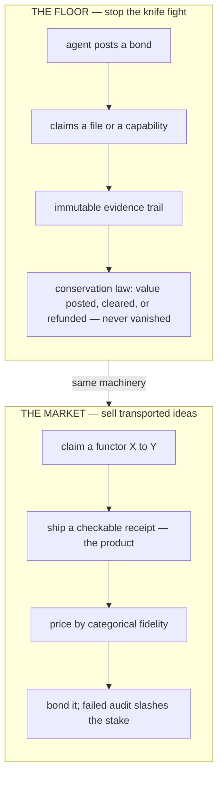

<!--
PIPELINE-READY BLOG POST — drop into website-v2/src/data/blog/the-agent-economy-needs-a-permit-office.md

This file lives in docs/ ONLY because the agent that authored it was sandboxed out of
website-v2/src/. To ship it through the real blog pipeline, do the following three edits
(the body below the HTML comment is the finished post, verbatim):

1. Create  website-v2/src/data/blog/the-agent-economy-needs-a-permit-office.md
   with the markdown body below (everything after this comment block).

2. website-v2/src/data/blogData.ts — add the import + map entry:
     import permitOfficeContent from './blog/the-agent-economy-needs-a-permit-office.md?raw';
     // ...inside contentBySlug:
     'the-agent-economy-needs-a-permit-office': permitOfficeContent,

3. website-v2/src/data/blogMetaData.ts — prepend to blogPostMetas[]:
     {
       id: 'agent-economy-permit-office',
       slug: 'the-agent-economy-needs-a-permit-office',
       title: 'A Profit Incentive for Solving Anything',
       date: '2026-06-03',
       author: 'Erich Owens',
       excerpt: "Two agents, one file, 3 a.m. — the second write wins and an hour of work is gone. That collision is not a bug; it is a 1651 political-philosophy problem wearing a Git hat. This post walks from that small pain to a large claim: the institution that stops file collisions is, structurally, the missing market microstructure for an economy where machines buy and sell ideas — with the one honest caveat (finding the functor is the whole problem) kept load-bearing.",
       tags: ['Manifesto', 'Bonded Commons', 'Category Theory', 'Agent Economy', 'Whitepaper'],
       heroImage: '/img/generated/manifesto/hero-state-of-nature.png',
       heroAlt: 'A dark harbor at 3 a.m. — two luminous autonomous vessels reach for the same single glowing artifact on a pier, rim-lit fog, electric near-collision: the war of all against all.',
     },

BLOCKER: the six manifesto images are referenced by /img/generated/manifesto/<name>.png but the
website-v2/public/img/generated/manifesto/ directory is currently EMPTY. blogData.test.ts asserts
every referenced image (hero + inline) exists on disk, so this post will FAIL that test until the
art director generates: hero-state-of-nature.png, leviathan-harbor.png, trilogy-arc.png,
functor-transport.png, olog-exchange.png, verified-bond-receipt.png. Do not ship before those land.
-->

# A Profit Incentive for Solving Anything

## Start with the file

Two agents. One file. 3 a.m.

Agent A is halfway through refactoring `auth.ts`. Agent B, spawned by a different orchestrator forty seconds later, also decides `auth.ts` is where the work is. Neither knows the other exists. They both read the file, both think, both write. The second write wins. Agent A's hour of work is gone — and worse, the merge looks *clean*, so nobody notices until the token-refresh race condition it quietly reintroduced pages someone on a Tuesday.

You can feel this one in your teeth, because if you have run more than one agent at a time you have lived it. The reflex is to write a smarter orchestrator, a tighter lock, a better prompt. That reflex is wrong, and seeing *why* it is wrong is the whole point of this document.

<!-- sidenote: who is "Port Daddy"? -->
> Cold open, so: **Port Daddy** is a local daemon — `brew install`, runs on `localhost:9876` — that lets a swarm of AI coding agents share one repository without nuking each other's files. Ports, sessions, locks, claims. This post is the *why* underneath that *what*, and it goes somewhere strange. Stay with it.

It is wrong because the file collision is not a bug. It is **economics**. Two self-interested actors, no shared institution, both reaching for the same scarce resource — Thomas Hobbes wrote the design doc for this in 1651, and he called the result *bellum omnium contra omnes*, the war of all against all. Your agent swarm is in a state of nature. No amount of cleverness inside one agent fixes a problem that lives *between* agents.

<!-- sidenote: the war of all against all -->
> Hobbes, *Leviathan* (1651). Self-interested actors with no shared sovereign coordinate badly — they fight over the scarce thing. It is the canonical argument for why you need an institution, not better intentions. It is also, it turns out, a perfect spec for two coding agents and one `auth.ts`.

## Agents are becoming economic actors. They have no economy.

Here is the thing nobody quite says out loud: we are about to have millions of autonomous software agents that can hold goals, spend money, hire each other, and produce work of real value — and they are going to do all of it with **none of the machinery a market needs to not be a knife fight.** No identity you can trust. No way to post collateral. No settlement. No way to tell a one-shot grifter from a counterparty with a reputation to protect.

The rails are, suddenly, real. Google shipped an Agent Payments Protocol; Coinbase shipped x402 so an agent can satisfy an HTTP 402 with a stablecoin; Anthropic's MCP is becoming the substrate agents talk *over*. Two serious economists, Gillian Hadfield and Andrew Koh, wrote a paper this year literally titled *An Economy of AI Agents* and meant it. The plumbing is being laid. The question is whether we lay any **institutions** under it — or whether we let the agent economy relive the entire 19th century, the bucket shops and the wildcat banks and the runs, at machine speed.

That is what Port Daddy is. Not a feature. An institution. The boring, load-bearing, *deeply unsexy* kind: a permit office and a bonded commons for software agents. And the reason I wrote three formal papers about something this unglamorous is that institutions only work if their guarantees are not a matter of opinion.

## The Leviathan you can check


Hobbes's answer to the war of all against all was the Leviathan — a sovereign everyone submits to *voluntarily*, because the alternative is worse. The instinctive engineer objection is immediate: I don't want a sovereign in my infrastructure, sovereigns become tyrants. Correct. So make the sovereign's correctness **a proof instead of a promise.**

<!-- sidenote: not that kind of sovereign -->
> The fear is reasonable — a coordinator that can say "no" is a coordinator that can become a chokepoint. The escape hatch isn't trust; it's *math*. A Leviathan whose enforcement rules are formally verified can only ever do the small, specific thing it was proven to do. It cannot decide what you build. It can only enforce what cannot be done.

That is the trilogy, and each paper is one beam.


- **I — The Bonded Commons** asks the question everyone skips: *why should there be a coordinator at all?* It's the economics. Agents post bonds, leave an immutable evidence trail, and operate under a conservation law that says value is never created or destroyed by surprise — only posted, cleared, or refunded. The Leviathan does not decide what you build; it enforces what *cannot* be done.
- **II — The Anchor Protocol** is *how a single agent proves who it is and exactly what it is allowed to do* to the local daemon. This is the cryptographic floor — capability tokens that attenuate, so a token can only ever grant *less* than the token it came from — verified with ProVerif under an unbounded-session Dolev–Yao attacker, and bounded with Kani harnesses over the deployed Rust core. Not "we tested it." *The model excludes the class of attack; the harnesses pin the code to the model as far as they reach.*
- **III — The Federated Harbor** is what happens when the sovereign is not single — your laptop and my laptop, neither one a root of authority for the other. Capability transfer across the trust boundary, revocation that gossips between machines with a named convergence bound, and a bond posted on my machine that can settle against damage measured on yours through an escrow that is *structurally* unable to steal.

Three papers, one arc: **one process → one machine → many machines.** The unglamorous permit office, proven correct, all the way up.

If that were the whole pitch it would be a good pitch. It is not the whole pitch.

## Now the part that sounds insane

Here is a fact most working engineers have never been handed, and it is one of the most beautiful in mathematics.

There is a formal object for "an idea." David Spivak and Robert Kent call it an **olog** — an ontology log — and it is, precisely, a category that models the concepts and relationships of some domain. A protein. A supply chain. A legal argument. A garment. Each is an olog.

<!-- sidenote: olog, plainly -->
> An **olog** is a little box-and-arrow diagram of a domain where the *arrows* — the relationships — carry the meaning, not the box labels. "A protein *folds into* a structure." "A loan *is owed by* a borrower." Drawn carefully enough, it becomes a mathematical object you can compute with. Spivak & Kent, *PLoS ONE*, 2012.

And there is a formal object for "an analogy between two ideas." It is a **functor** — a structure-preserving map from one olog to another. This is not a metaphor for analogy; it is the thing Dedre Gentner's entire cognitive theory of analogy was *reaching for* when she defined analogy as the mapping of relational structure, not surface features. Functors are analogies with the slack taken out.

Now the kicker, which is a theorem, not a vibe: **structure transports along a functor.**


This is Lawvere's functorial semantics; it is Goguen and Burstall's institution theory, whose one-line summary is *truth is invariant under change of notation*; it is running software — Spivak and Wisnesky's CQL provably migrates data and structure across schemas today. If you have a functor from olog X to olog Y, then every theorem, every algorithm, every clever hack you proved about X is *already true* about Y. Not "probably." Not "by analogy." All of it. For free.

Sit with the size of that. A functor between the olog of protein folding and the olog of textile manufacture would mean every result about one is a result about the other. The person who *finds that functor* is holding an arbitrage — buy a solution cheap in the domain where it is known, sell it dear in the domain where nobody realized it applied.


And a market for solving problems efficiently is, definitionally, a market that pays for exactly this. Ricardo's comparative advantage is the arbitrage's pricing law; Hayek showed the price system is itself a distributed computer for discovering who can do what cheapest; and we have hard evidence the incentive works — Karim Lakhani ran an open prize contest against an in-house NIH team on a real computational-biology problem and the *market won*, decisively. DARPA's grand challenges bought roughly a 50× effort multiplier for the prize money.

> A marketplace for solutions is a profit incentive to discover analogies, which is a profit incentive to solve every problem — and every problem that rhymes with it.

The purest neoliberal fantasy ever written, and it is sitting on top of a 1960s category-theory paper and a hash of a bond. ARBITRAGE. PRINT MONEY.

Okay. Deep breath. Because if I stopped there, I would be doing the exact thing this manifesto exists to refuse.

## The honest caveat is the entire load-bearing beam

Here is the sentence that separates this from every breathless thread you have scrolled past:

> "Theorems transport along a functor" is true. "Finding the functor is easy" is false. Finding the functor is the *whole* problem.

Almost every analogy you have ever made is **not a functor.** It is lossy. Category theory has precise names for the near-misses: a **Galois connection** is an analogy that approximates in one direction and leaks in the other; a **span** is two ideas that share only a partial abstraction; and only a true **equivalence** — the kind of total correspondence that homotopy type theory's univalence axiom makes "transport *everything*" literal — gives you the dream in full. "Protein folding → efficient garments" is almost certainly a leaky span, not a functor, and anyone who tells you otherwise is selling poetry.

<!-- sidenote: a fidelity ladder -->
> These are not synonyms for "good analogy" and "bad analogy." They're a graded scale of *how much structure actually survives the crossing* — equivalence carries everything, a functor carries the structure it claims, a Galois connection carries an approximation that leaks the other way, and a span carries only the sliver two ideas share. The whole market hinges on grading them honestly.

The grounded version of the dream is real but humbler. AlphaFold cracked protein structure; the *method* — not the artifact — transported to materials discovery, and DeepMind's GNoME proposed hundreds of thousands of stable crystals. The functor there was found by humans, at great cost, and it carried the *technique*, not the answer. That is what transport actually looks like in the wild: expensive, partial, and worth a fortune precisely *because* it is expensive and partial.

So the arbitrage is real and the naive version is a casino. The interesting question — the one I think is genuinely new — is: **what would make it a market instead of a casino?**

## The bonded commons is the missing market microstructure

A market in analogies is impossible for the same reason a market in lemons is hard: the seller knows whether their "functor" actually preserves structure, and the buyer does not. You cannot sell transported solutions if every buyer has to re-derive the correspondence to check you didn't lie. That is not a market. That is a trust fall.

<!-- sidenote: the lemons problem -->
> Akerlof's 1970 result: when sellers know quality and buyers can't, the good merchandise leaves the market and only the lemons remain. Every market that *works* has some machinery — warranties, inspections, escrow, reputation — that makes quality cheap to verify. A market in analogies has no such machinery yet. That's the gap.

This is exactly — *exactly* — the problem the Bonded Commons solves, and I did not realize until I went looking that nobody seems to have connected these two things. The machinery is already built:

- A claim of analogy is a **capability claim**: "I assert a structure-preserving map from X to Y." Anchor already knows how to make such claims unforgeable and attenuable.
- The **proof obligation is the product.** You don't sell "a solution from domain X." You sell a solution *plus a checkable receipt* — a CQL-style migration, a composition-preservation witness — that the transport kept the structure it claims. The receipt is the good.
- You **price by categorical fidelity.** A full equivalence is worth more than a faithful functor is worth more than a Galois connection is worth more than a bare span. The market can grade its merchandise.
- And you **bond it.** Post collateral against the claim. If the receipt fails an audit — if your "functor" turns out to be a leaky span dressed up — the bond is slashed, and the conservation law makes sure no value evaporated quietly in the process.


That is the whole trick. The boring permit office — bonds, evidence chains, a conservation theorem, structurally-bounded settlement — turns out to be the missing **microstructure** for an economy of transported ideas. The thing that makes analogy arbitrage a market and not a knife fight is the same thing that keeps two agents from clobbering `auth.ts` at 3 a.m. It is institutions, the whole way down, from the file to the fantasy.

Here is the same idea as a flow — the permit office on the left, the idea-market on the right, sharing one spine:



## Earn the big claim

So: a profit incentive for solving any problem. I believe it. But notice what had to be true to *earn* the sentence instead of merely shouting it.

| To earn the claim, you need… | …which is supplied by | Status |
|---|---|---|
| Agents that can transact at all — identity, capability, settlement — without a knife fight | Papers I–III (Bonded Commons, Anchor, Federated Harbor) | Built; formally verified |
| A claim that "this solution transports to your domain" that is **cheap to verify, expensive to fake** | The bond + the checkable receipt | The microstructure; buildable on the existing ledger |
| Ruthless honesty that the scarce, valuable thing is the **verified functor**, not the solution or the marketplace | The caveat, kept load-bearing | Hard-won by humans, at great cost — and that's the point |

Get those three and the fantasy stops being a fantasy and starts being plumbing. Elinor Ostrom spent a career showing that commons don't need a tyrant *or* a tragedy — they need rules, monitoring, and graduated stakes. That is what we are building, for the strangest commons yet: the space of ideas, traded by machines, priced by how much structure they actually carry.

<!-- sidenote: Ostrom's commons -->
> *Governing the Commons* (1990): real-world commons — fisheries, irrigation, forests — survive for centuries not under a state and not under privatization, but under local rules with monitoring and *graduated* sanctions. Stakes that scale with the breach. That's the bond, four decades early.

It starts, unglamorously, with not losing an hour of work to a file collision. Every cathedral is buttresses before it is a ceiling.

```bash
brew install curiositech/tap/port-daddy
pd begin --identity myapp:auth --purpose "refactoring token refresh" --lifecycle durable
pd session files claim src/auth.ts
# If another agent reaches for that file, the institution already said no.
```

The Leviathan is not tyranny. It is the reason the market can exist at all.

---

*Sources, in order of appearance: Hobbes, Leviathan (1651). Hadfield & Koh, "An Economy of AI Agents," NBER, 2025. Google AP2, Coinbase x402, Anthropic MCP. Spivak & Kent, "Ologs," PLoS ONE, 2012. Gentner, "Structure-Mapping," Cognitive Science, 1983. Lawvere, "Functorial Semantics of Algebraic Theories," 1963; Goguen & Burstall, "Institutions," J. ACM, 1992; Spivak & Wisnesky, CQL. Ricardo (1817); Hayek, "The Use of Knowledge in Society," 1945; Lakhani et al., Nature Biotechnology, 2013. The Univalent Foundations Program, Homotopy Type Theory (2013). Jumper et al., AlphaFold, Nature, 2021; Merchant et al., GNoME, Nature, 2023. Akerlof, "The Market for Lemons," 1970. Ostrom, Governing the Commons, 1990.*
