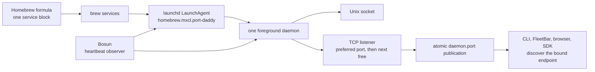

# Daemon and supervision

Port Daddy should have one boring production lifecycle:



If normal operation needs more explanation than that, it is a product defect.

## Is this what every Homebrew daemon does?

No. The normal Homebrew model is a formula `service` block that names the
foreground command; `brew services` registers it with macOS `launchd` or Linux
`systemd`. Homebrew documents that mapping in its
[services command](https://docs.brew.sh/Manpage.html#services-subcommand), and
its [service DSL](https://docs.brew.sh/rubydoc/Homebrew/Service.html) exposes
the run command, logs, environment, and keep-alive policy. Apple expects the
process started by `launchd` to remain in the foreground and handle `SIGTERM`;
it must not daemonize itself. See [launchd.plist(5)](https://keith.github.io/xcode-man-pages/launchd.plist.5.html).

Port Daddy added complexity for four project-specific reasons:

1. The installed Homebrew release and a source checkout are different builds.
2. Named development daemons run beside stable with isolated state.
3. Bosun observes application heartbeat/readiness that process existence alone
   cannot prove.
4. Releases must reconcile binary, database, CLI, UI, and route versions.

Those are real needs. They do not justify multiple production supervisors,
hardcoded client ports, detached canonical fallbacks, or hand-copied binaries.

## Production invariants

- `homebrew.mxcl.port-daddy` is the only production process supervisor on macOS.
- The daemon runs in the foreground. `launchd` owns start, stop, restart, and
  resurrection.
- The configured default is a preferred bind port, not an address clients may
  assume.
- If a foreign or unverifiable process owns the preferred port, the daemon tries
  the next candidate and atomically publishes the port it actually bound.
- If a healthy Port Daddy sibling owns the preferred port, stable refuses a
  second writer. An isolated named daemon may opt into a different state plane.
- Clients resolve an explicit `PORT_DADDY_URL` first; otherwise they use the Unix
  socket or the published port file through `shared/daemon-discovery.ts`.
- `daemon.pid`, `daemon.port`, `/health`, the listener, launchd PID, binary hash,
  and Bosun heartbeat must describe one generation.
- Bosun observes and asks the supervisor to act. It never spawns a canonical
  daemon itself.

The dynamic-port rule is enforced in runtime code and in load-bearing contributor
docs by `tests/unit/no-hardcoded-daemon-port.test.js`. The only preferred-port
literal lives in `shared/daemon-discovery.ts`.

## Installed release versus development source

| Surface | Authority | Update path |
|---|---|---|
| Installed `pd` and stable daemon | Homebrew keg and service | tagged release, tap update, `brew upgrade` |
| Source checkout | current branch | edit, test, and build only |
| Named feature daemon | compiled daemon from one worktree | `pd dev up --from <worktree> --label <name>` |

Merging source does not update the installed daemon. Building `dist/` does not
update it either. A stable version changes only when a release artifact is cut,
the Homebrew formula advances, the keg upgrades, and the supervised service is
restarted.

Never copy a development binary over an installed keg. That destroys provenance:
the package manager reports one version while launchd executes unrelated bytes.

## Development daemons

Backend work is proved on a named feature daemon before release:

```sh
pd dev up --from "$PWD" --label squid-release
eval "$(pd use squid-release)"
"$PORT_DADDY_CLI" status
"$PORT_DADDY_CLI" squid on
pd dev list
pd dev down squid-release
```

Each named daemon has its own runtime directory, database, sockets, port file,
heartbeat, and berth record under `~/.port-daddy/instances/<label>/`. Port
assignment comes from the selected/discovered coordinator and is checked against
the OS before launch. No named daemon may claim the stable daemon's currently
published endpoint.

`pd dev up` builds both artifacts from the selected worktree: the daemon and its
matching feature CLI. It publishes the CLI path as `PORT_DADDY_CLI` and also
prepends a profile-local shim directory to `PATH`. The explicit variable is the
authority for spawned agents. A login shell may rebuild `PATH` and put Homebrew's
stable `pd` first again, so feature-daemon hooks and agent instructions must invoke
`"$PORT_DADDY_CLI"`, not bare `pd`. This prevents an apparently healthy feature
test from silently talking to the installed release.

Targeting is explicit:

```sh
eval "$(pd use squid-release)"  # this shell follows the named daemon
"$PORT_DADDY_CLI" status        # matching feature CLI and daemon
eval "$(pd use stable)"         # clear the override; resume discovery

pd --daemon squid-release status # one command, no shell mutation
```

`pd use stable` does not export a guessed URL. It removes the named override so
normal socket/port-file discovery resumes.

## Read-only diagnosis

Use these in order. They do not mutate the daemon:

```sh
which pd
pd --version
pd status --json
pd doctor --json
pd dev list --json
brew services info port-daddy --json
launchctl print "gui/$(id -u)/homebrew.mxcl.port-daddy"
```

Interpret the layers separately:

| Observation | What it proves | What it does not prove |
|---|---|---|
| launchd job has a PID | supervisor owns a process | daemon routes are responsive |
| Unix-socket status works | local CLI transport responds | browser/TCP transport works |
| TCP `/health` works | published listener responds | running bytes match installed bytes |
| version/hash converge | runtime matches installed artifact | Squid hooks are installed in a project |
| Bosun heartbeat is fresh | daemon loop is alive | every route or spawned worker is healthy |

When socket and TCP disagree, trust neither in isolation. Compare `/health`, the
published port, listener ownership, PID files, launchd PID, and binary hash as one
generation. The CLI status/doctor surfaces should perform that join for the
operator; terminal archaeology is a contributor fallback.

## Recovery

Use the smallest supervisor-owned action:

| Condition | Action |
|---|---|
| launchd loaded, daemon wedged or old installed bytes | `brew services restart port-daddy` |
| service not registered | `brew services start port-daddy` |
| installed keg is behind the released formula | `brew update && brew upgrade port-daddy` |
| named feature daemon is stale | stop and recreate that label from its worktree |
| production listener moved | fix the client that ignored discovery; do not force the daemon back |
| healthy Port Daddy sibling detected | identify the duplicate state plane; do not start another writer |

Do not use `kill` as a restart command. Do not start a detached canonical daemon
when the launchd service is missing. Do not let FleetBar, Doctor, Bosun, or a CLI
freshness check become a second supervisor.

## Release gate

The exact commands live in [`docs/RELEASING.md`](../RELEASING.md). The daemon-specific
contract is:

1. Build the CLI and daemon artifacts from the release candidate.
2. Pass the compiled daemon integrity smoke before serving runtime routes.
3. Start a named daemon from those exact bytes and record its label, published
   URL, PID, version, git revision, and artifact hash.
4. Prove changed routes through that named daemon, including durable transcript
   read-back for backend work.
5. Run the Squid activation and attention/conformance proof when harness assets
   changed.
6. Tag only the reviewed candidate tree. Let the release workflow update the tap.
7. Upgrade Homebrew and verify installed CLI version, daemon version/hash,
   supervisor PID, discovered TCP health, and FleetBar agree.

Release success is convergence, not “the build command exited zero.”

## Ownership boundary

| Component | Owns | Never owns |
|---|---|---|
| Homebrew | installed formula/keg | process health decisions |
| launchd | canonical process lifecycle | application readiness |
| daemon | listeners, endpoint publication, readiness, durable state | its own resurrection |
| Bosun | heartbeat/wedge observation | direct daemon spawning |
| FleetBar / CLI / Doctor | explanation and operator controls | hidden competing supervision |
| named berth | isolated development runtime | stable endpoint or production state |

The target architecture is deliberately uneventful: one package, one OS
supervisor, one foreground production process, one published endpoint, and any
number of explicitly named isolated development processes.
