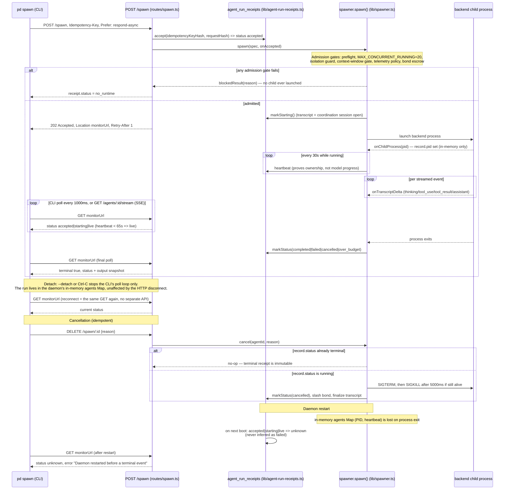

# `pd spawn` Lifecycle — Admission, Execution, Collection, Reconnect, Cancel, Restart

## Provenance (read before citing anything below)

Every `lib/`, `routes/`, `cli/` citation in this document was read and line-verified
against branch `codex/first-class-agent-sessions-integration-20260804` @ commit
`8a5742cc061a843c338c0498487839ac58bc5fc9` (2026-08-05) — the exact tree the locally
running `pd 3.28.0` daemon executes from (`/Users/erichowens/.port-daddy/instances/*/dev-bin/pd`
is a `tsx` shim into that checkout, not a build artifact). That branch is queued to merge
into `main` and has not merged as of this writing. Most cited files already exist on
`main` today (their content will change shape at merge, not their location); five files
cited below exist **only** on the integration branch and are marked inline as **not yet
shipped to `main`**. Treat every specific claim as "true of the running pd 3.28.0
daemon today," not necessarily "true of `main` at this exact line, today."

This document is scoped to the **`pd spawn` HTTP/CLI primitive** (`POST /spawn`,
`GET /spawn/:id`, `GET /spawn/receipts/:id`, `DELETE /spawn/:id`, `pd spawn` /
`pd spawn cancel` / `pd spawned`). It does **not** cover the separate trigger-driven
fleet-event spawn path (`lib/fleet-engine.ts`, governed by
[`docs/adr/0093-event-spawn-trust-substrate.md`](../adr/0093-event-spawn-trust-substrate.md))
or the session-continuation/Agent-Harbor work described in
[`docs/adr/0095-agent-run-saga-and-backend-authority.md`](../adr/0095-agent-run-saga-and-backend-authority.md)
beyond what's noted in [Proposed follow-ons](#proposed-follow-ons).

---

## Current 3.28 executable contract

### 1. Admission is bounded before any process starts

`POST /spawn` (`routes/spawn.ts:108`) validates the request shape, then calls
`assessSpawnPreflight()` (`lib/spawn-preflight.ts:142-275`), which refuses launch unless
a cost tracker is wired, `budgetUsd` is a positive finite number, a semantic identity
resolves to a project, and at least one runtime candidate is reachable
(`lib/spawn-preflight.ts:204-246`). If preflight fails, the route returns HTTP 400
`code: 'PRECONDITION_FAILED'` (`routes/spawn.ts:226-234`) before `spawner.spawn()` is
ever called.

Inside `spawner.spawn()` (`lib/spawner.ts:1870`), admission is a sequence of hard gates,
each of which can block the launch before a child process exists:

- **Concurrency ceiling** — a hard-coded `MAX_CONCURRENT_RUNNING = 20`
  (`lib/spawner.ts:1822`, comment: *"Hard ceiling on concurrent running agents. Prevents
  fork bombs."*). If 20 agents are already `running`, the spawn is refused with
  `` `Spawn blocked: ${running} agents already running (limit: ${MAX_CONCURRENT_RUNNING}). Wait for one to finish.` ``
  (`lib/spawner.ts:1902-1904`).
- **Worktree isolation guard** — `assessSpawnIsolation()` (`lib/spawner.ts:1602-1620`)
  refuses a file-writing spawn into a git **main checkout** (`.git` is a directory) as
  opposed to a **worktree** (`.git` is a file); the guarding comment cites a real
  incident ("On 2026-06-03 this deleted 403 files in the port-daddy working tree",
  `lib/spawner.ts:1562-1563`).
- **Context-window gate** — refused if `spec.estimatedPromptTokens / effectiveContextWindow >= 0.9`
  (`lib/spawner.ts:1918-1928`).
- **Telemetry-policy gate** — refused if no cost tracker is available or the backend's
  telemetry policy disallows launch (`lib/spawner.ts:1935-1946`).
- **Bond escrow** — a scope-proportional bond (base `DEFAULT_BOND_USD = 0.01`,
  `lib/spawner.ts:1797`) is escrowed via `bonds.escrow(...)` (`lib/spawner.ts:2131-2156`)
  before the process runs; escrow failure blocks the spawn.

Only once every gate passes is an in-memory `AgentRecord` created with `status:'running'`,
a transcript row opened as "a PRECONDITION of running the backend"
(`lib/spawner.ts:2198-2210`), and the backend process actually launched
(`lib/spawner.ts:2402-2424`). The child's real OS PID is captured later, inside
`onChildProcess`, at the moment the process actually forks (`lib/spawner.ts:2369-2384`).

### 2. Every async spawn gets a durable, idempotency-keyed receipt and a stable monitor URL

`pd spawn` always sends `Prefer: respond-async` and a fresh
`` 'Idempotency-Key': randomUUID() `` header, one per CLI invocation
(`cli/commands/spawn.ts:260-261`). Server-side, `POST /spawn` requires that header for
async admission and 400s with `code: 'IDEMPOTENCY_KEY_REQUIRED'` if it's missing
(`routes/spawn.ts:299-309`).

The receipt is a row in the SQLite table `agent_run_receipts`
(**not yet shipped to `main`** — `lib/agent-run-receipts.ts:157-176`, only present on the
integration branch), keyed by the SHA-256 of the idempotency key (`idempotency_key_hash`,
unique index) plus a SHA-256 of the canonicalized request body (`request_hash`). A
replayed key whose request body drifted throws `AgentRunIdempotencyConflictError`,
surfaced as HTTP 409 `code: 'IDEMPOTENCY_CONFLICT'`
(**not yet shipped to `main`** — `lib/agent-run-receipts.ts:266-269`; `routes/spawn.ts:364-372`).
An exact, unchanged replay returns the same receipt rather than launching a second run.

The **monitor URL** is a literal, stable route pattern:
`` `/spawn/receipts/${encodeURIComponent(receipt.id)}` ``
(`routes/spawn.ts:74`), returned as `monitorUrl` in the body and the `Location` header of
the 202 response, alongside `Retry-After: 1` (`routes/spawn.ts:436-447`). The route
comment calls it *"a stable collection handle across reconnects/restarts"*
(`routes/spawn.ts:475`). A second, agent-id-keyed route, `GET /spawn/:id`
(`routes/spawn.ts:563-600`, comment: *"reconnectable collection from live memory or
transcript"*), serves the same purpose for `pd spawned <id> --wait`
(`cli/commands/spawn.ts:302-305`).

### 3. Execution: PID capture, heartbeat, and streamed transcript deltas

`record.pid` is `null` until the real subprocess forks; `onChildProcess` sets it from the
actual child PID the instant it's available (`lib/spawner.ts:2369-2384`), and resets it
to `null` on completion (`lib/spawner.ts:2511`). **PID tracking is in-memory only** — it
lives in the daemon's `agents = new Map<string, AgentRecord>()`
(`lib/spawner.ts:1649`) and does not survive a daemon restart.

A supervisor-side heartbeat fires every **30,000 ms** while `status === 'running'`,
recording `record.heartbeatAt = Date.now()` and posting `{pid, status:'busy', progress}`
to coordination (`lib/spawner.ts:2296-2306`). The doc comment on `heartbeatAt` is explicit
about what it proves and doesn't: *"Last supervisor heartbeat. This proves ownership, not
model progress."* (`lib/spawner.ts:281-282`).

Backends that stream events (the cli-tube backends parse `claude-code`'s `stream-json` or
`codex --json` per line) call `onTranscriptDelta` once per event as it arrives, appending
each `thinking` / `tool_use` / `tool_result` / assistant turn to the open transcript row
mid-run (`lib/spawner.ts:679`, comment). Backends that only return a final answer get one
assistant-turn append at completion instead (`lib/spawner.ts:2558-2560`). The delta-level
surfaces are two SSE streams — `GET /agents/:id/stream` (merged status + tube +
transcript, `routes/agent-cockpit.ts:107-140`) and `GET /transcripts/stream`
(`routes/transcripts.ts:187`) — each frame shaped
`{type:'start'|'update'|'end', entry, compliance}` (`routes/agent-cockpit.ts:358-367`).
`GET /spawn/:id` and `GET /spawn/receipts/:id` return the whole `output` snapshot, not
per-event deltas (`routes/spawn.ts:525`, `:735`).

### 4. No wall-clock timeout on a generic CLI task — only an explicit, caller-owned deadline

`resolveDeadlineMs()` returns `null` unless the caller passed a positive, finite
`spec.deadlineMs`:

```ts
function resolveDeadlineMs(spec) {
  return typeof spec.deadlineMs === 'number' && Number.isFinite(spec.deadlineMs) && spec.deadlineMs > 0
    ? spec.deadlineMs : null;
}
```
(`lib/spawner.ts:701-705`, doc comment on `SpawnSpec.deadlineMs`, `lib/spawner.ts:174`:
*"Optional caller-owned wall deadline in milliseconds. Omit for no task deadline."*)

When `deadlineMs` is `null`, no `deadlineTimer` is armed and the run is observed until
exit or explicit cancellation (`lib/spawner.ts:2062-2063`, `:2189-2196`). The CLI's own
`--help` text says the same thing in plain words:
`` --deadline-ms <ms>    Optional task deadline; CLI agents have no default ``
(`cli/commands/spawn.ts:200`).

This is distinct from `DEFAULT_BACKEND_TRANSPORT_TIMEOUT_MS = 5 * 60 * 1000`
(`lib/spawner.ts:691`) — a per-network-call transport timeout applied to a single backend
API/CLI transport call, not to the whole task (`lib/spawner.ts:694-699`). When a positive
`deadlineMs` *is* supplied and it expires, the run is cancelled through the same `cancel()`
path an operator would use, ending in `status:'cancelled'` — not a distinct "timed out"
status (`lib/spawner.ts:2189-2196`; confirmed by
`tests/unit/spawner-cli-agy-transcript.test.js:88`,
`expect(result.status).toBe('cancelled')`). A regression test,
`tests/unit/retired-spawn-timeout-contract.test.js` (**not yet shipped to `main`**),
asserts the codebase contains no surviving `spec.timeout`/`options.timeout` task-timeout
alias anywhere in `routes/spawn.ts`, `cli/commands/spawn.ts`, `lib/spawner.ts`, or
`lib/fleet-engine.ts` — `deadlineMs` is the sole task-level time knob.

### 5. Detach and reconnect are the same primitive: stop polling, then poll (or connect) again

There is no separate "detach" or "reconnect" API — verified by reading both client
surfaces end to end:

- **CLI polling** (`cli/commands/spawn.ts:41-62`, `collectSpawn()`): after a 202, the CLI
  polls the monitor URL every `SPAWN_POLL_INTERVAL_MS = 1_000` ms
  (`cli/commands/spawn.ts:31-32`) with a plain `GET`, until
  `spawnCollectionSettled(data)` — `terminal === true`, `outcomeUnknown === true`, or
  `status` is one of `completed|failed|cancelled|over_budget|no_runtime|unknown`
  (`cli/commands/spawn.ts:36-39`). `pd spawn --detach` skips this loop and returns the
  receipt immediately; the run is unaffected either way because it lives in the
  spawner's in-memory `agents` Map, not tied to the HTTP connection
  (`cli/commands/spawn.ts:200`, `:274`). On success the CLI prints:
  `` `Accepted ${agentId}; following durable run (Ctrl-C detaches only this client).` ``
  (`cli/commands/spawn.ts:276`) — Ctrl-C kills the CLI polling loop, not the run. On a
  transient fetch failure the loop logs *"Spawn monitor disconnected; the daemon still
  owns the run. Reconnecting…"* and keeps polling the same URL
  (`cli/commands/spawn.ts:56-58`) — **reconnect is re-issuing the same `GET`**, not a
  distinct call.
- **SSE** (`GET /agents/:id/stream`, `routes/agent-cockpit.ts:107-140`): on connect it
  sends a full snapshot (current status + latest transcript,
  `routes/agent-cockpit.ts:180`, `:333-356`), then live deltas, then a 30s `:heartbeat`
  keepalive (`routes/agent-cockpit.ts:182-184`). The server force-closes the connection
  after `connectionLimits.sseTimeout = 300000` ms (5 min,
  `shared/connection-tracking.js:17`, enforced `routes/agent-cockpit.ts:200-203`). A
  client detaches by closing the connection (`request.raw.on('close', cleanup)`,
  `routes/agent-cockpit.ts:205`); the agent keeps running server-side. **Reconnect is
  opening a fresh `GET /agents/:id/stream`**, which re-delivers the snapshot then resumes
  live deltas — there is no resume-from-cursor / Last-Event-ID mechanism in this route.

### 6. Status is `accepted → starting → live → {terminal | unknown}`, not `stalled`

Three related enums exist. The receipt-level one is authoritative for the monitor URL:

```ts
export type AgentRunReceiptStatus =
  | 'accepted' | 'starting' | 'live'
  | 'completed' | 'failed' | 'cancelled' | 'over_budget' | 'no_runtime'
  | 'unknown';

export const TERMINAL_AGENT_RUN_STATUSES = new Set<AgentRunReceiptStatus>([
  'completed', 'failed', 'cancelled', 'over_budget', 'no_runtime',
]);
```
(**not yet shipped to `main`** — `lib/agent-run-receipts.ts:9-26`.) Note `'unknown'` is
explicitly *not* terminal — it is reconcilable back to `'live'` given fresh evidence.

Transitions, each with a concrete trigger:

- `accepted` → set on receipt insert (`lib/agent-run-receipts.ts:212`, not yet shipped to
  `main`).
- `accepted` → `starting`: `markStarting()` fires the instant `spawner.spawn()`'s
  `onAccepted` callback runs — i.e. transcript and coordination session are both open
  (`routes/spawn.ts:389-397`).
- `starting`/anything → `live`: only via `markStatus(id, 'live', {liveEvidence})`, and
  only if `liveEvidence.pid` is a positive integer and the supervisor heartbeat is fresher
  than `AGENT_RUN_LIVE_EVIDENCE_MAX_AGE_MS = 65_000` ms — otherwise it throws
  (`lib/agent-run-receipts.ts:6`, `:304-317`, not yet shipped to `main`). `GET /spawn/:id`
  computes an equivalent `lifecycleState` inline using the same hard-coded 65-second
  window (`routes/spawn.ts:573-577`).
- → terminal (`completed | failed | cancelled | over_budget`): set at the spawner's
  completion path, `` wasCancelled ? 'cancelled' : budgetOverrunError ? 'over_budget' : error ? 'failed' : 'completed' ``
  (`lib/spawner.ts:2506`). `no_runtime` is receipt-only, meaning the spawn was blocked
  pre-launch (`agentRunStatusForSpawnResult()`, `lib/agent-run-receipts.ts:28-32`, not
  yet shipped to `main`).
- → `unknown`: two triggers. **(a)** heartbeat staleness — `GET /spawn/receipts/:id`
  downgrades a `'live'` receipt to `'unknown'` the moment
  `Date.now() - live.heartbeatAt >= AGENT_RUN_LIVE_EVIDENCE_MAX_AGE_MS`, with
  `error: 'The agent was previously live, but current PID and heartbeat evidence are unavailable.'`
  (`routes/spawn.ts:508-512`). **(b)** daemon restart — see §8.

There is **no `'stalled'` literal anywhere in `lib/spawner.ts` or in
`lib/agent-run-receipts.ts`** (not yet shipped to `main`). The heartbeat-staleness downgrade above is the mechanism
that stands in for "stalled": the contract has exactly one non-terminal-but-suspect state
(`unknown`), reached either by evidence going stale or by a restart, not a distinct
"stalled" status.

### 7. Cancellation is explicit and idempotent by construction

`pd spawn cancel <agentId> [--reason <text>]` (`cli/commands/spawn.ts:111-155`, listed in
`--help` at `cli/commands/spawn.ts:207`) sends `DELETE /spawn/:id {reason}`
(`routes/spawn.ts:603-629`), which calls `spawner.cancel(id, reason)`
(`lib/spawner.ts:2744-2815`). The idempotency is a one-line guard with an explicit
rationale in the comment:

```ts
function cancel(agentId: string, reason = 'Cancelled by spawner'): void {
  const record = agents.get(agentId);
  if (!record) return;
  // A terminal receipt is immutable. Late budget-pause, panic, or operator
  // cancellation signals can race with normal completion; they may clean up
  // a live child, but must never rewrite a completed/failed outcome.
  if (record.status !== 'running') return;
  ...
```
(`lib/spawner.ts:2744-2750`.) Calling cancel twice, or cancelling an already-finished run,
is a documented no-op the second time — the terminal outcome is never rewritten.
Mechanically, `cancel()` both **signals** the child (SIGTERM, then SIGKILL after 5000 ms
via `process.kill(-pid, signal)` on the process group, `lib/spawner.ts:536-558`) **and**
marks the record `status: 'cancelled'` (`lib/spawner.ts:2775-2777`), slashes the escrowed
bond (`lib/spawner.ts:2785-2789`), and finalizes the open transcript row to
`status:'cancelled'` (`lib/spawner.ts:2803-2814`).

### 8. A daemon restart makes a nonterminal run's outcome `'unknown'` — it never infers failure

There is no PID-vs-database reconciliation for individual spawned runs on daemon boot —
verified by reading `lib/spawner.ts` end to end: `AgentRecord.pid` lives only in the
in-memory `agents` Map (`lib/spawner.ts:1649`), which is empty after every restart, and
no boot-time code walks `agent_run_receipts` probing `process.kill(pid, 0)`.

Instead, restart recovery is honest ignorance rather than inference. On every
construction of the receipt store (i.e. every daemon boot), any receipt still
`'accepted' | 'starting' | 'live'` is flipped to `'unknown'`:

```sql
UPDATE agent_run_receipts
SET status = 'unknown', updated_at = ?,
    error = COALESCE(error, 'Daemon restarted before a terminal event; task outcome is unknown.')
WHERE status IN ('accepted', 'starting', 'live')
```
(**not yet shipped to `main`** — `lib/agent-run-receipts.ts:196-204`, gated by
`options.recoverNonTerminal !== false`, default true at both call sites,
`routes/spawn.ts:71`, `routes/sessions.ts:245`.) The non-receipt path,
`spawner.get(agentId)`, does the same for a transcript still marked `status:'running'`
after the in-memory record is gone, surfacing `status:'unknown'` with the identical
"no failure was inferred" language (`lib/spawner.ts:2720`, `:2732-2734`).

`lib/daemon-reconciliation.ts` (**not yet shipped to `main`**) is a **different**
mechanism entirely — it detects and terminates a half-alive zombie **daemon process**
(one whose Unix socket answers but whose TCP listener is dead), not an individual spawned
agent run; do not confuse the two.

### 9. Accounting is exact tokens/cost, plus a slashable bond — not wall-clock billing

`SpawnTelemetry` records `inputTokens`, `cachedInputTokens?`, `outputTokens`, `costUsd`,
and a `rateMode: 'exact' | 'estimated'` flag documented as *"'exact' = backend-reported
token counts; 'estimated' = best-guess (~chars/4)"* (`lib/spawner.ts:257-264`). Wall-clock
duration is **not itself an accounted/billed quantity** in the receipt — only
`startedAt`/`completedAt` timestamps let a caller derive it, and an aggregate
`spawn.duration_ms` counter is bumped for metrics, not stored per-run
(`lib/spawner.ts:2627`).

Enforcement runs before the hard cap check: under `enforceTelemetryPolicy` (default
true), a run is refused/failed unless the backend actually returned token counts, the
cost tracker computed a non-estimated cost (barring an explicit flat-rate allow-list),
and that cost is `> 0` and was durably recorded (`lib/spawner.ts:2436-2494`). Only then is
`hardBudgetCapError()` evaluated (`lib/spawner.ts:1634-1640`): `costUsd > spec.budgetUsd`
produces `status: 'over_budget'`. Cost events live in a separate ledger owned by
`CostTracker.record()` (`lib/cost-tracker.ts:520`), not the transcript/receipt tables.

Independently of budget/cost, every admitted spawn escrows a small bond
(`DEFAULT_BOND_USD = 0.01`, `lib/spawner.ts:1797`), refunded on clean exit
(`lib/spawner.ts:2616`) or slashed on error/cancellation
(`lib/spawner.ts:2614`, `:2787`) — a commons-pool deterrent, not a cost record.

`tests/unit/spawner-budget-cap.test.js` (`describe('spawner hard budget cap edges')`,
`:63`) proves the boundary cases: exact cost equal to `budgetUsd` still completes
(`:93`); missing/`NaN` recorded cost finalizes `'failed'`, never `'over_budget'`
(`:164-204`); and any non-positive/non-numeric `budgetUsd` is treated as "no hard cap"
(`:206-247`).

---

## Sequence: admission → execution → collection → reconnect → cancel → restart



---

## Comparison: how long does a generic CLI agent task run, per its own vendor docs?

This section cites official vendor documentation only — no inference about internals not
stated in those docs.

**`codex exec` (OpenAI Codex CLI).** Per
[openai.com/index/unrolling-the-codex-agent-loop/](https://openai.com/index/unrolling-the-codex-agent-loop/)
("Unrolling the Codex agent loop"), the agent loop's documented stop condition is
structural, not time-based: each turn ends with an assistant message once the model
issues no further tool calls, at which point "its work is complete and control returns to
the user." The article — read in full — does not document a default wall-clock ceiling,
turn cap, or `max_execution_time_s`-style parameter for a `codex exec` run; it describes
prompt construction, stateless Responses-API calls with prompt caching, and the
`/responses/compact` auto-compaction trigger, none of which govern run duration by the
clock.

**`claude -p` (Claude Code, print mode).** Per
[code.claude.com/docs/en/cli-usage](https://code.claude.com/docs/en/cli-usage), print mode
(`claude -p "query"`) has no documented default wall-clock timeout for the whole run.
`--max-turns` bounds agentic turns instead ("Limit the number of agentic turns (print mode
only). Exits with an error when the limit is reached. No limit by default.");
`--max-budget-usd` bounds spend, not time — "Once spend reaches the cap, spawning another
subagent fails with `Budget limit reached`, and Claude Code stops background subagents
that are still running."

**Bash tool timeout ≠ whole-CLI-run timeout.** Per
[code.claude.com/docs/en/env-vars](https://code.claude.com/docs/en/env-vars),
`BASH_DEFAULT_TIMEOUT_MS` ("Default timeout for long-running bash commands (default:
120000, or 2 minutes)") and `BASH_MAX_TIMEOUT_MS` ("Maximum timeout the model can set for
long-running bash commands (default: 600000, or 10 minutes). The effective ceiling is the
larger of this and `BASH_DEFAULT_TIMEOUT_MS`") both govern **one Bash tool invocation**
inside a run — not the run itself. A `claude -p` session that never calls Bash is
unaffected by either variable; a session that runs many Bash commands can still continue
indefinitely across turns, bounded only by `--max-turns` or `--max-budget-usd` if set.

**Where this lines up with pd spawn.** All three systems share the same shape: none of
them impose a default wall-clock ceiling on the *whole task*; each imposes narrower,
opt-in bounds instead (turn count, spend, or — for `pd spawn` — an explicit
`deadlineMs`). `pd spawn`'s difference is where the opt-in bound is asserted: the
**caller** supplies `deadlineMs` per launch (§4 above), rather than the backend CLI
exposing a flag the caller must remember to pass.

---

## Proposed follow-ons

The following are documented proposals, not implemented behavior — cited here so a reader
does not mistake them for part of the current contract above.

- **[`docs/adr/0095-agent-run-saga-and-backend-authority.md`](../adr/0095-agent-run-saga-and-backend-authority.md)**
  (status: Proposed, 2026-07-05) describes a larger "Agent Run Saga" state machine —
  `IntentCaptured -> Planning -> ... -> Materializing -> RunsAttached -> Running -> ... -> ReceiptSealing -> ReceiptSealed`
  — and an eleven-schema "Agent Harbor v0" contract (`schemas/agent-harbor/v0/`, not yet
  shipped to `main`) that would supersede today's flatter
  `accepted → starting → live → terminal|unknown` receipt with a compliance-witnessed,
  nine-section `WorkReceipt`. Some ADR-0095 concepts have already landed inside the
  receipt table documented above — `AgentRunKind = 'spawn' | 'session-continuation'` and
  the `predecessorSessionId`/`successorSessionId` columns exist today
  (`lib/agent-run-receipts.ts:8`, `:39-41`, not yet shipped to `main`) and are wired into
  `routes/sessions.ts` — but the full saga state machine, compliance witnessing, and
  sealed `WorkReceipt` object are still Proposed, not built into the `pd spawn` path this
  document describes.
- **[`docs/adr/0093-event-spawn-trust-substrate.md`](../adr/0093-event-spawn-trust-substrate.md)**
  governs a related but distinct subsystem — trigger-driven spawns from webhooks, email,
  SMS, and GitHub events (`lib/fleet-engine.ts`), not the `POST /spawn` primitive
  documented above. Its own "proposed, not shipped" items (its §7 evidence table and §5.3
  deferred-findings table) are about that trigger path — an L2 durable spawn queue with
  per-backend concurrency and spillover, an L3 console-panes-plus-transactional-outbox
  surface, and macaroon-based capability enforcement — and should not be read as
  follow-ons to the receipt/monitor/reconnect/cancel contract in this document.

---

## Test evidence (this is executable behavior, not aspiration)

| Behavior | Test file | Test/describe block |
| --- | --- | --- |
| Isolation guard blocks a main-checkout spawn | `tests/unit/spawner-isolation-guard.test.js` | `describe('spawn() wiring')` → `test('refuses a file-writing spawn into a main checkout, before any launch')` (`:123-124`) |
| Idempotent replay returns one receipt; drifted replay conflicts | `tests/unit/agent-run-receipts.test.js` (not yet shipped to `main`) | `describe('agent run receipt ledger')` (`:9`) → `test('exact idempotent replay returns one stable receipt')` (`:34`); `test('same key with request drift conflicts without launching another run')` (`:84`) |
| Restart recovery labels nonterminal receipts `unknown`, invents no failure | `tests/unit/agent-run-receipts.test.js` (not yet shipped to `main`) | `test('restart recovery labels nonterminal receipts unknown without inventing failure')` (`:102`) |
| `unknown` requires fresh evidence to reconcile back to `live`; terminal is sticky | `tests/unit/agent-run-receipts.test.js` (not yet shipped to `main`) | `test('terminal ownership is sticky while unknown requires direct evidence to reconcile live')` (`:129`) |
| `over_budget` present across transcript/API/client contracts | `tests/unit/spawn-status-contract.test.js` | `describe('spawn status contract coverage')` → `test('over_budget is present in transcript, API, and client status contracts')` (`:9-10`) |
| Hard budget cap boundary + non-cap-eligible inputs | `tests/unit/spawner-budget-cap.test.js` | `describe('spawner hard budget cap edges')` (`:63`) → `:93`, `:128`, `:164`, `:206` |
| CLI forwards `deadlineMs`; fails fast without budget | `tests/unit/spawn-cli-budget.test.js` | `describe('pd spawn budget enforcement')` (`:48`) → `test('forwards deadlineMs on spawn')` (`:96`); `test('fails fast when budget is missing')` (`:196`) |
| Deadline expiry finalizes transcript as cancelled, not a distinct timeout state | `tests/unit/spawner-cli-agy-transcript.test.js` | `describe('cli:agy explicit deadline transcript behavior')` (`:26`) → `test('hanging no-output agy child finalizes transcript as deadline-cancelled')` (`:71`) |
| No surviving generic `timeout` alias anywhere in the spawn path | `tests/unit/retired-spawn-timeout-contract.test.js` (not yet shipped to `main`) | `describe('retired spawn timeout contract')` (`:82`) |
| Live transcript deltas from a real subprocess, not a mock | `tests/unit/spawner-live-transcripts.test.js` | `it('records reasoning + command + assistant turns from a real codex run')` (`:44`); `it('records cli:claude-code thinking + assistant from a real run launched with the "claude-cli" sentinel model')` (`:164`) |
| Cancellation reason is validated and forwarded exactly | `tests/unit/spawn-cancel-reason.test.js` (not yet shipped to `main`) | `describe('spawn cancellation reason')` (`:6`) → `test('validates and forwards the exact operator reason')` (`:7`) |
| Daemon `/spawn` invokes real provider binaries; failures aren't wrapped as success | `tests/bun/spawn-provider-binary-daemon.test.ts` | `describe('daemon /spawn provider binary launch path')` (`:254`) → `:255`, `:307` |

---

## How to re-verify this document

No Mermaid-syntax guard exists in this repo as of this writing (checked
`scripts/check-doc-citations.mjs` and `package.json`; neither references `mermaid`). The
diagram above was hand-checked for valid `sequenceDiagram` syntax (`alt`/`else`, `loop`,
`Note over`, balanced ` ``` ` fences) against the Mermaid sequence-diagram grammar; a live
`npx @mermaid-js/mermaid-cli` render was attempted from this environment and did not
complete (package fetch did not return within 60s) — re-attempt that render in an
environment with reliable npm registry access before merge, as a stronger check than the
manual grammar review performed here. The link/citation guard does exist and must pass:

```bash
node scripts/check-doc-citations.mjs docs/operations/spawn-lifecycle.md
```
